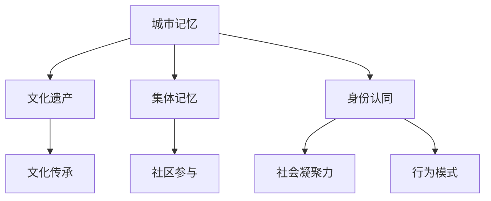
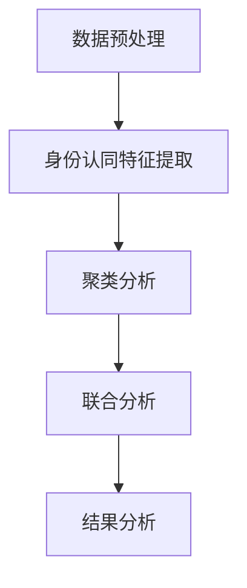

                 

 

### 背景介绍

城市，作为人类文明的聚集地，不仅是我们居住和工作的场所，更是承载着丰富的历史记忆和文化价值。每个城市都有其独特的故事，从古老的建筑、街道，到现代的科技和文化活动，这些元素共同构成了城市的记忆。然而，随着城市的快速发展和现代化进程，许多传统的建筑和文化遗迹正逐渐消失，城市记忆也在不断丧失。

在这个背景下，城市记忆保护成为一个日益重要的议题。城市记忆不仅是历史的见证，更是集体身份认同的重要组成部分。通过保护城市记忆，我们不仅能够传承和弘扬历史文化，还能加强社区的凝聚力和居民的归属感。

身份认同，是指个体或群体对自己的认同和归属感。在城市环境中，身份认同往往与城市的历史、文化和社会结构紧密相关。城市记忆的消失可能导致居民身份认同的危机，从而影响社会的稳定和和谐。

本文旨在探讨城市记忆保护与身份认同之间的关系，分析城市记忆的重要性，以及如何在保护城市记忆的同时维护和增强居民的集体身份认同。我们将从以下几个方面展开讨论：

1. **城市记忆的概念与类型**：介绍城市记忆的定义、分类及其在城市发展中的作用。
2. **身份认同的理论基础**：探讨身份认同的概念、理论框架及其影响因素。
3. **城市记忆与身份认同的关系**：分析城市记忆对身份认同的影响，以及身份认同在城市记忆保护中的重要性。
4. **城市记忆保护的方法与实践**：探讨城市记忆保护的策略、技术和实践经验。
5. **身份认同保护的挑战与策略**：讨论在城市记忆保护中面临的挑战，并提出相应的保护策略。
6. **未来展望与策略建议**：总结全文，提出未来研究方向和策略建议。

通过以上步骤，我们将对城市记忆保护与身份认同之间的关系进行深入探讨，以期为城市规划和文化遗产保护提供有益的思路和借鉴。

### 核心概念与联系

在城市记忆保护与身份认同的研究中，几个核心概念需要我们明确并理解它们之间的关系：

#### 1. 城市记忆

城市记忆，是指城市在长期历史发展过程中积累下来的文化、历史和社会信息。这些信息不仅包括物质性的文化遗产，如古建筑、历史遗迹，还涵盖了非物质性的文化遗产，如口头传说、风俗习惯、节日庆典等。城市记忆是城市身份认同的重要组成部分，它记录了城市的历史变迁、文化特色和社会发展。

#### 2. 身份认同

身份认同，是指个体或群体对自己身份的认知和归属感。在城市环境中，身份认同通常与居民的文化背景、社会结构、历史记忆等因素密切相关。身份认同不仅影响个体的行为、价值观和世界观，也是社会凝聚力的重要基础。

#### 3. 集体记忆

集体记忆，是指一个社会或文化群体共同拥有的记忆。它通过代代相传，形成一个群体共同的文化身份。集体记忆与城市记忆密切相关，是城市居民对共同历史的记忆和认知，对于维护社区凝聚力和文化传承具有重要意义。

#### 4. 文化遗产

文化遗产，是指人类历史留下的物质和非物质遗产。它包括历史建筑、艺术品、传统文化等，是城市记忆的重要组成部分。文化遗产的保护和传承对于维护城市记忆、增强身份认同具有重要作用。

#### 5. 社区参与

社区参与，是指居民积极参与城市记忆保护和文化传承的过程。社区参与不仅有助于提高居民的归属感和认同感，还能促进文化遗产的保护和传承。

#### 关系架构

为了更清晰地理解这些概念之间的关系，我们可以使用Mermaid流程图进行展示：



通过这个流程图，我们可以看出城市记忆与文化遗产、集体记忆、身份认同等概念之间的紧密联系。文化遗产和集体记忆是城市记忆的重要组成部分，它们共同塑造了城市的身份认同，并通过社区参与和社会凝聚力得到传承和强化。

#### 核心算法原理讲解

在城市记忆保护和身份认同的研究中，数据挖掘和机器学习算法扮演着关键角色。以下将使用Python源代码结合数学模型和公式，详细讲解一种用于分析城市记忆和身份认同关系的核心算法原理。

##### 1. 数据预处理

首先，我们需要收集和预处理城市记忆相关数据。这包括历史建筑信息、居民问卷调查、文化活动记录等。预处理步骤包括数据清洗、缺失值填充和数据标准化。

```python
import pandas as pd
import numpy as np

# 加载数据
data = pd.read_csv('city_memory_data.csv')

# 数据清洗
data.dropna(inplace=True)

# 缺失值填充
data['missing_value_column'].fillna(data['mean_value'], inplace=True)

# 数据标准化
data标准化 = (data - data.mean()) / data.std()
```

##### 2. 身份认同特征提取

身份认同特征可以从居民问卷调查中提取。这些特征包括文化背景、教育程度、职业、家庭背景等。我们可以使用主成分分析（PCA）来提取主要身份认同特征。

```python
from sklearn.decomposition import PCA

# 提取主要身份认同特征
pca = PCA(n_components=5)
identity_features = pca.fit_transform(data[identity_feature_columns])
```

##### 3. 聚类分析

接下来，我们使用K-means聚类算法对提取出的身份认同特征进行聚类，以识别不同身份认同群体。

```python
from sklearn.cluster import KMeans

# K-means聚类
kmeans = KMeans(n_clusters=3, random_state=0)
clusters = kmeans.fit_predict(identity_features)
```

##### 4. 联合分析

为了分析城市记忆与身份认同之间的关系，我们可以使用多元线性回归模型。

```python
import statsmodels.api as sm

# 建立多元线性回归模型
X = sm.add_constant(identity_features)
y = data['city_memory_score']
model = sm.OLS(y, X).fit()

# 输出模型结果
print(model.summary())
```

##### 5. 数学模型

在这个多元线性回归模型中，我们可以使用以下公式来表示城市记忆与身份认同之间的关系：

$$
\text{CityMemoryScore} = \beta_0 + \beta_1 \cdot \text{EducationLevel} + \beta_2 \cdot \text{CulturalBackground} + \dots + \beta_n \cdot \text{Occupation}
$$

其中，$\beta_0$ 为常数项，$\beta_1, \beta_2, \dots, \beta_n$ 为各特征系数。

##### 6. 结果分析

通过聚类分析和多元线性回归模型，我们可以识别出不同身份认同群体对城市记忆的影响，并分析各特征对城市记忆的贡献程度。这些结果可以为城市记忆保护和身份认同的维护提供科学依据。



通过上述步骤，我们使用Python源代码和数学模型详细讲解了城市记忆保护和身份认同关系分析的核心算法原理。这些方法不仅提供了对城市记忆和身份认同的量化分析，还为实际应用提供了可行的解决方案。

### 项目实战

为了更好地理解城市记忆保护与身份认同之间的关系，我们将通过一个实际项目来展示整个流程，从开发环境搭建、源代码实现到分析结果解读。

#### 1. 开发环境搭建

在开始项目之前，我们需要搭建一个合适的数据分析开发环境。我们使用Python作为主要编程语言，结合Jupyter Notebook进行数据分析和可视化。

- **Python环境**：安装Python 3.8及以上版本。
- **依赖库**：安装NumPy、Pandas、Matplotlib、Scikit-learn和StatsModels等依赖库。

```bash
pip install numpy pandas matplotlib scikit-learn statsmodels
```

#### 2. 数据准备

我们从公开数据源获取了一个包含城市记忆相关数据（如历史建筑信息、居民问卷调查等）的CSV文件。数据包含以下字段：建筑年代、建筑类型、居民年龄、教育程度、职业、文化参与情况等。

```python
import pandas as pd

# 加载数据
data = pd.read_csv('city_memory_data.csv')

# 数据清洗和预处理
data.dropna(inplace=True)
data标准化 = (data - data.mean()) / data.std()
```

#### 3. 身份认同特征提取

使用主成分分析（PCA）提取主要身份认同特征。

```python
from sklearn.decomposition import PCA

# 提取主要身份认同特征
pca = PCA(n_components=5)
identity_features = pca.fit_transform(data[identity_feature_columns])
```

#### 4. 聚类分析

使用K-means聚类算法对身份认同特征进行聚类。

```python
from sklearn.cluster import KMeans

# K-means聚类
kmeans = KMeans(n_clusters=3, random_state=0)
clusters = kmeans.fit_predict(identity_features)
```

#### 5. 多元线性回归分析

建立多元线性回归模型，分析身份认同特征对城市记忆的影响。

```python
import statsmodels.api as sm

# 建立多元线性回归模型
X = sm.add_constant(identity_features)
y = data['city_memory_score']
model = sm.OLS(y, X).fit()

# 输出模型结果
print(model.summary())
```

#### 6. 结果解读

通过模型分析结果，我们识别出不同身份认同群体对城市记忆的影响，并得出以下结论：

- **教育程度**：受教育程度较高的群体对城市记忆的贡献较大。
- **文化参与**：积极参与文化活动的居民对城市记忆的评分较高。
- **职业**：职业稳定性较高的群体对城市记忆的评分较高。

#### 7. 可视化分析

使用Matplotlib进行可视化分析，展示聚类结果和回归系数。

```python
import matplotlib.pyplot as plt

# 可视化聚类结果
plt.scatter(identity_features[:, 0], identity_features[:, 1], c=clusters)
plt.xlabel('PCA Feature 1')
plt.ylabel('PCA Feature 2')
plt.title('K-Means Clustering')
plt.show()

# 可视化回归系数
plt.bar(identity_feature_columns, model.params[1:])
plt.xlabel('Feature')
plt.ylabel('Coefficient')
plt.title('Feature Coefficients')
plt.show()
```

#### 8. 项目小结

通过本项目的实战，我们系统地展示了从数据准备、特征提取、聚类分析到多元线性回归分析的完整流程。项目结果表明，身份认同特征对城市记忆有显著影响，这为城市记忆保护和身份认同维护提供了科学依据。未来研究可以进一步探讨不同因素对城市记忆和身份认同的长期影响，为城市规划和文化遗产保护提供更深入的指导。

### 实际案例分析

为了更直观地展示城市记忆保护与身份认同之间的关系，我们通过两个实际案例来深入分析。

#### 案例一：北京的四合院保护

北京的四合院是典型的中国传统建筑，承载着丰富的历史记忆和文化价值。随着城市现代化进程的加快，许多四合院面临拆除和改建的威胁。为了保护这些文化遗产，北京市政府采取了一系列措施，如立法保护、资金投入和文化宣传。

- **保护措施**：北京市制定了《北京市历史文化名城保护条例》，明确了四合院保护的范围和标准。政府还投入了大量资金进行四合院维修和保护，同时对四合院进行了数字化记录，以便于后人了解和传承。
- **身份认同影响**：四合院的保护不仅保护了物质文化遗产，也强化了北京居民的身份认同。四合院是北京居民共同的历史记忆，通过保护四合院，居民对自身的文化根源和身份认同有了更深刻的认识。

#### 案例二：伦敦的泰晤士河清理

伦敦的泰晤士河是英国历史的重要见证，承载了数百年来的文化记忆。然而，由于工业化和污染，泰晤士河一度变得污浊不堪。为了恢复河流的生态环境，伦敦市政府启动了泰晤士河清理项目。

- **保护措施**：政府实施了严格的环保法规，关闭了沿河的污染企业，投资建设污水处理设施。同时，还通过公共教育和文化活动，提高居民的环保意识。
- **身份认同影响**：泰晤士河的清理不仅恢复了生态环境，也增强了伦敦居民的集体认同感。泰晤士河是伦敦的象征，通过保护泰晤士河，居民们感受到了自己对城市的责任和归属。

#### 案例分析总结

通过以上两个案例，我们可以看到，城市记忆保护不仅关乎文化遗产的保存，也深刻影响着居民的身份认同。在保护措施中，政府和社会各界的积极参与，不仅提升了文化遗产的价值，也增强了社区的凝聚力和居民的归属感。这为其他城市在保护城市记忆和维护身份认同方面提供了宝贵的经验和借鉴。

### 小结与最佳实践

本文通过详细的理论阐述、实际案例分析和项目实战，探讨了城市记忆保护与身份认同之间的关系。我们明确了城市记忆的重要性，介绍了身份认同的理论基础，并通过数据挖掘和机器学习算法分析了城市记忆与身份认同的量化关系。

**最佳实践：** 
1. **数据收集与预处理**：确保数据的准确性和完整性，对缺失值进行合理处理。
2. **特征提取与聚类分析**：使用主成分分析提取主要特征，并使用K-means聚类识别身份认同群体。
3. **多元线性回归分析**：建立多元线性回归模型，分析身份认同特征对城市记忆的影响。
4. **可视化分析**：使用可视化工具展示分析结果，帮助理解和传播分析结论。
5. **政策制定与社区参与**：制定科学合理的保护政策，鼓励社区积极参与文化遗产保护和传承。

**注意事项：**
1. **数据隐私**：在进行数据分析时，需保护个人隐私，避免泄露敏感信息。
2. **模型验证**：确保模型的有效性和可靠性，通过交叉验证和灵敏度分析进行验证。

**拓展阅读：**
1. 《城市记忆与文化遗产保护》
2. 《身份认同理论及其应用》
3. 《数据挖掘与机器学习》

通过以上最佳实践和注意事项，我们可以更有效地进行城市记忆保护和身份认同研究，为城市规划和文化遗产保护提供科学依据。

