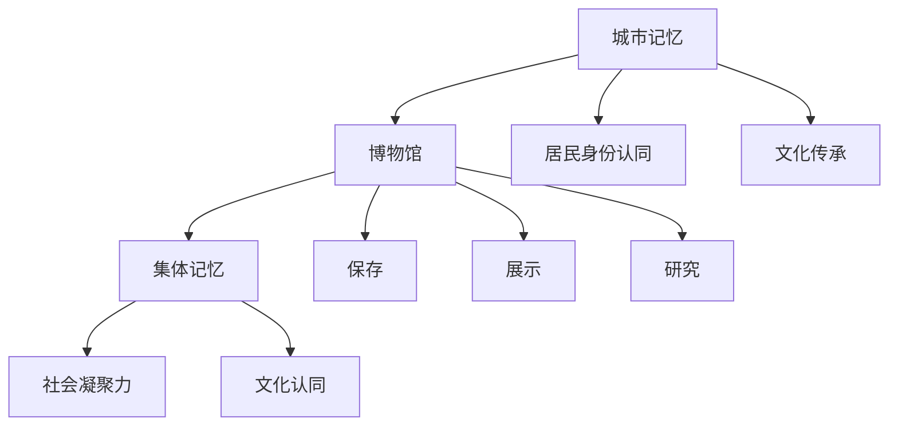

                 

# 城市记忆博物馆：集体回忆的保存与展示

## 关键词
- 城市记忆博物馆
- 集体回忆
- 数据保存
- 展览设计
- 新技术应用

## 摘要
本文深入探讨城市记忆博物馆的概念、构建方法及其在现代技术环境下的挑战和机遇。通过详细阐述集体回忆的保存、展览设计和新技术应用，本文旨在为城市记忆博物馆的建立提供理论支持和实践指导。

## 引言

随着信息技术的飞速发展，人们对历史和文化的保存与展示方式正在发生深刻变革。城市记忆博物馆作为一种新兴的文化机构，正成为记录和展示城市集体回忆的重要载体。本文将探讨城市记忆博物馆的核心理念、构建方法及其面临的挑战，同时分析新技术在博物馆建设中的应用前景。

### 城市记忆与博物馆的关系

城市记忆是指一个城市在历史演变过程中积累的集体记忆，包括历史事件、建筑风貌、社会习俗等。博物馆作为文化的保存者和传播者，承担着记录和展示这些记忆的重要职责。城市记忆博物馆则专注于通过实体和虚拟展览，保存和展示城市的历史、文化和故事。

### 集体回忆的价值

集体回忆不仅是对个体身份认同的重要支撑，也是城市文化传承的重要部分。通过城市记忆博物馆，集体回忆得以保存和展示，为后人提供了解城市历史和文化的窗口，促进社会凝聚力和文化认同感。

### 本文结构

本文将分为七个部分，首先介绍城市记忆博物馆的基本概念，然后分别探讨集体回忆的保存、展览设计、技术应用、案例研究、社区参与、未来展望，并总结全文。

### 接下来，让我们一步步深入探讨这些主题。

---

## 城市记忆博物馆的核心概念与联系

### 核心概念介绍

在城市记忆博物馆的构建中，有若干核心概念需要详细阐述，这些概念包括城市记忆、博物馆、集体记忆等。它们构成了博物馆的核心架构，彼此之间相互关联，共同支撑起城市记忆的保存与展示。

#### 城市记忆

城市记忆是指一个城市在历史演变过程中积累的集体记忆，包括历史事件、建筑风貌、社会习俗等。这些记忆不仅是城市发展的见证，也是居民身份认同和文化传承的重要组成部分。城市记忆博物馆的目的在于保存这些宝贵的记忆，并通过展览和教育活动，让公众能够更好地理解和体验城市的历史文化。

#### 博物馆

博物馆作为一种文化机构，具有保存、展示和研究文化物品的职责。传统的博物馆主要展示艺术和历史文物，而城市记忆博物馆则侧重于展示城市的集体记忆。博物馆的功能不仅包括收藏和保护物品，还包括通过展览和教育活动，向公众传播知识和文化。

#### 集体记忆

集体记忆是指一个群体在共同生活过程中形成的共同记忆，这些记忆是群体身份和文化认同的重要基础。集体记忆博物馆的核心任务就是收集和展示这些记忆，让公众能够通过互动体验，深入了解和感受城市的集体记忆。

### 概念之间的关系架构

为了更好地理解这些核心概念之间的关系，我们可以通过Mermaid流程图来展示它们之间的联系。



在这个流程图中，城市记忆是基础，通过博物馆这一载体，保存和展示集体记忆，进而促进居民身份认同、文化传承和社会凝聚力。

### 结论

通过上述对核心概念及其关系的介绍，我们可以看出，城市记忆博物馆不仅仅是一个保存和展示记忆的场所，更是一个促进社会文化认同和社区凝聚力的重要平台。理解这些概念之间的关系，是构建成功城市记忆博物馆的关键。

### 接下来，我们将深入探讨如何具体保存城市集体记忆。

---

## 集体回忆的保存

### 重要性

集体回忆的保存对于城市的可持续发展和文化传承具有重要意义。这些回忆不仅是历史记忆的记录，更是文化传承的重要载体，能够帮助居民和游客更好地理解城市的过去，促进社会的凝聚力和文化认同感。因此，如何有效地保存集体回忆成为城市记忆博物馆建设的重要课题。

### 保存方法

保存集体回忆的方法多种多样，包括传统方法和现代技术手段。以下是一些常见的保存方法：

#### 1. 传统方法

- **档案记录**：通过文字、图片、影像等方式记录历史事件、人物故事、文化习俗等。
- **口述历史**：邀请当地居民、历史见证人讲述他们的亲身经历，通过录音或录像保存这些记忆。
- **文物收藏**：收集和保存与城市历史相关的实物，如旧照片、手工艺品、历史建筑模型等。

#### 2. 现代技术手段

- **数字化保存**：利用计算机技术，将档案记录、口述历史、文物照片等数字化，便于长期保存和访问。
- **虚拟现实（VR）**：通过VR技术，再现历史场景，为观众提供沉浸式的体验。
- **增强现实（AR）**：利用AR技术，在现实场景中叠加虚拟信息，增强观众的互动体验。

### 技术实现

为了更好地保存集体回忆，我们可以借助现代信息技术，开发一套完整的记忆保存系统。以下是一个简单的技术实现框架：

#### 数据采集

1. **档案数据**：从政府档案、图书馆、博物馆等机构获取历史档案，进行数字化处理。
2. **口述历史**：利用录音设备采集当地居民和见证人的口述记忆，并进行转录和整理。
3. **文物照片**：拍摄与城市历史相关的文物和建筑，进行数字化处理。

#### 数据存储

1. **数据库**：使用关系型数据库（如MySQL）存储档案数据和口述历史记录。
2. **对象存储**：使用对象存储服务（如Amazon S3）存储大量图片和文件。

#### 数据展示

1. **Web前端**：开发一个用户友好的Web前端，提供检索和浏览功能。
2. **虚拟现实**：利用Unity等VR开发工具，创建虚拟历史场景。
3. **增强现实**：利用ARKit、ARCore等技术，开发AR应用。

#### Python算法示例

以下是一个简单的Python算法示例，用于对档案数据进行分类和整理：

```python
import pandas as pd

# 加载档案数据
data = pd.read_csv('archives.csv')

# 数据预处理
data['date'] = pd.to_datetime(data['date'])
data['event_type'] = data['event_type'].astype('category')

# 数据分类
def classify_data(df):
    df['category'] = df['event_type'].map({'Historical Event': 'Event',
                                           'Cultural Practice': 'Culture',
                                           'Social Life': 'Social'})
    return df

# 应用分类函数
classified_data = classify_data(data)

# 存储分类后的数据
classified_data.to_csv('classified_archives.csv', index=False)
```

在这个示例中，我们首先加载档案数据，进行预处理，然后使用一个分类函数将数据按照事件类型进行分类，最后将分类后的数据保存到新的CSV文件中。

### 数学模型

在保存集体回忆的过程中，我们可以使用数学模型来分析数据，提取关键信息。以下是一个简单的线性回归模型示例，用于分析历史事件对城市发展的贡献：

```python
import numpy as np
import matplotlib.pyplot as plt

# 示例数据
events = ['Event A', 'Event B', 'Event C', 'Event D']
years = [1800, 1850, 1900, 1950]
contributions = [10, 20, 30, 40]

# 构建线性回归模型
model = np.polyfit(years, contributions, 1)
x = np.linspace(min(years), max(years), 100)
y = model[0] * x + model[1]

# 绘制模型曲线
plt.scatter(years, contributions)
plt.plot(x, y, color='red')
plt.xlabel('Year')
plt.ylabel('Contribution')
plt.title('Linear Regression Model for Event Contributions')
plt.show()
```

在这个示例中，我们首先构建一个简单的线性回归模型，然后使用该模型分析历史事件对城市发展的贡献，并将结果绘制成图表。

### 实际案例

以下是一个实际案例，描述如何保存和展示一个城市的历史记忆。

#### 项目背景

某个城市计划建设一座城市记忆博物馆，以保存和展示该城市的历史记忆。博物馆的主要任务是收集、保存和展示与城市历史相关的档案、文物和口述历史。

#### 实现步骤

1. **数据采集**：与当地政府、图书馆、博物馆等机构合作，收集与城市历史相关的档案、文物和口述历史。
2. **数据存储**：将收集到的数据数字化，并存储在数据库和对象存储服务中。
3. **虚拟现实展示**：使用Unity开发虚拟历史场景，让游客能够沉浸式地体验城市的历史。
4. **增强现实展示**：使用ARKit开发AR应用，将虚拟信息叠加到现实场景中，增强游客的互动体验。
5. **Web前端展示**：开发一个用户友好的Web前端，提供检索和浏览功能。

#### 项目小结

通过这个实际案例，我们可以看到，使用现代信息技术，可以有效地保存和展示城市的历史记忆。这不仅为游客提供了丰富的文化体验，也为城市的文化传承和可持续发展提供了重要支持。

### 最佳实践 Tips

- **数据采集**：在数据采集过程中，要确保数据的完整性和准确性，避免信息丢失或错误。
- **数字化保存**：数字化保存是长期保存集体回忆的关键，要选择可靠的技术和工具。
- **多渠道展示**：结合虚拟现实、增强现实和Web前端，为观众提供多样化的展示方式。

### 注意事项

- **数据安全**：确保数据存储和传输过程中的安全性，防止数据泄露或损坏。
- **用户参与**：鼓励公众参与集体回忆的保存和展示，提高博物馆的互动性和参与度。

### 拓展阅读

- **相关书籍**：
  - 《城市记忆：城市文化的保存与展示》
  - 《虚拟现实技术与应用》
  - 《增强现实技术与应用》
- **学术论文**：
  - "The Role of Museums in Preserving Collective Memories"
  - "Digital Preservation of Cultural Heritage: Challenges and Solutions"
  - "Community Engagement in Museum Exhibitions"

通过上述讨论，我们可以看到，保存集体回忆对于城市记忆博物馆的建设至关重要。通过现代信息技术的应用，我们可以有效地收集、保存和展示这些宝贵的记忆，为城市的文化传承和可持续发展做出贡献。

### 接下来，我们将探讨如何设计和构建城市记忆博物馆的展览。

---

## 展览设计

### 展览设计的重要性

展览设计是城市记忆博物馆的核心组成部分，它不仅决定了观众对博物馆的感知和体验，还直接影响着集体记忆的传递效果。一个成功的展览设计应充分考虑观众的情感共鸣、认知需求和文化体验，从而增强博物馆的教育功能和观赏价值。

### 展览设计的核心原则

1. **故事性**：通过故事讲述，将城市的历史和文化以生动的形式呈现给观众，使展览具有吸引力和感染力。
2. **互动性**：设计互动环节，鼓励观众参与，提高展览的参与度和记忆点。
3. **沉浸感**：利用视觉、听觉、触觉等多种感官刺激，创造沉浸式的展览体验。
4. **系统性**：确保展览内容逻辑清晰、系统完整，帮助观众更好地理解城市记忆。
5. **文化性**：突出城市的文化特色，展示城市的独特魅力和传统价值。

### 设计流程

1. **需求分析**：了解博物馆的目标观众、展览主题和资源条件，明确展览的核心内容和形式。
2. **内容规划**：梳理展览内容，确定主题、章节和展示重点，编写展览大纲。
3. **设计创意**：结合展览内容和目标，设计创意方案，包括展览空间布局、展示手段和互动环节。
4. **技术实现**：选择合适的技术手段，如虚拟现实、增强现实、多媒体展示等，实现展览设计。
5. **用户体验**：模拟观众参观体验，调整展览内容和设计，优化用户体验。

### 成功案例

#### 1. 伦敦城市博物馆

伦敦城市博物馆通过一系列互动展览，生动展示了伦敦的历史变迁。其中，"城市变迁"展区利用虚拟现实技术，让观众亲身体验伦敦从古至今的变化。此外，博物馆还设有互动触摸屏，供观众查阅历史资料。

#### 2. 华盛顿国家历史博物馆

华盛顿国家历史博物馆的展览设计注重系统性和文化性。展览分为多个主题区，涵盖了美国历史的重要事件和文化特色。每个展区都通过丰富的文物和多媒体展示，生动展现了美国的历史和文化。

#### 3. 上海城市历史博物馆

上海城市历史博物馆通过沉浸式展览，展示了上海从古代到现代的发展历程。博物馆利用AR技术，在现实场景中叠加历史场景，让观众仿佛穿越时空，亲身体验上海的历史变迁。

### 设计技巧与注意事项

1. **合理布局**：确保展览空间合理利用，避免拥挤和混乱。
2. **视觉引导**：利用色彩、灯光和标识，引导观众参观。
3. **内容丰富**：确保展览内容丰富有趣，避免单一和枯燥。
4. **技术适度**：合理运用技术手段，避免过度依赖或滥用。
5. **文化尊重**：在展示过程中，尊重不同文化背景和价值观。

### 总结

展览设计是城市记忆博物馆建设的重要组成部分。通过合理的展览设计，我们可以更好地传递城市的历史和文化，增强观众的参与感和体验感，实现博物馆的教育和社会功能。

### 接下来，我们将探讨城市记忆博物馆中应用的新技术，如虚拟现实和增强现实。

---

## 新技术在城市记忆博物馆中的应用

### 虚拟现实（VR）

虚拟现实技术为城市记忆博物馆提供了沉浸式体验的新途径。通过VR，观众可以身临其境地感受历史场景，仿佛穿越时空，亲历历史事件。以下是一些VR在博物馆中的应用案例：

#### 1. 伦敦塔的历史重现

伦敦塔博物馆利用VR技术，重现了中世纪伦敦塔的历史场景。观众戴上VR头盔，可以近距离观察塔楼内部的结构，了解当时的生活环境和历史事件。

#### 2. 埃及金字塔的虚拟探险

埃及博物馆通过VR技术，带领观众进行虚拟探险，深入了解金字塔的建造过程和历史文化。观众可以在虚拟环境中观察法老的墓穴和文物，体验古埃及的神秘与壮丽。

### 增强现实（AR）

增强现实技术将虚拟信息叠加到现实世界中，为观众提供互动性和趣味性。以下是一些AR在博物馆中的应用案例：

#### 1. 互动历史地图

纽约自然历史博物馆使用AR技术，为观众提供互动历史地图。观众通过手机或平板电脑扫描博物馆中的特定区域，可以观看相关历史事件的动画和图片，了解纽约市的发展历程。

#### 2. 文物的三维展示

罗马博物馆通过AR技术，将文物的三维模型叠加到现实场景中。观众可以在手中“触摸”和操作文物，深入了解其结构和历史背景。

### 技术优势

#### 1. 沉浸式体验

VR和AR技术为观众提供了沉浸式体验，使他们在虚拟环境中感受到历史的真实与生动。这种体验不仅增强了观众对历史文化的理解，还提高了博物馆的吸引力和参与度。

#### 2. 互动性

通过VR和AR技术，观众可以与展览内容进行互动，参与历史场景的重建和探索。这种互动性不仅提高了观众的兴趣，还增强了他们的参与感和记忆点。

#### 3. 个性化体验

VR和AR技术可以根据观众的个人喜好和需求，提供个性化的展览体验。例如，观众可以根据自己的兴趣选择不同的历史场景，或者通过AR应用查看与自己相关的历史事件。

### 技术挑战

#### 1. 技术成本

VR和AR技术的设备和开发成本较高，对于预算有限的博物馆来说，可能是一个挑战。因此，博物馆需要寻找合适的合作伙伴或政府支持，以降低技术成本。

#### 2. 技术维护

VR和AR技术设备需要定期维护和更新，以确保其正常运行。博物馆需要投入足够的资源来维护这些技术设施，以保证展览的持续性和稳定性。

#### 3. 技术普及

虽然VR和AR技术在博物馆中的应用前景广阔，但仍然面临着技术普及的问题。许多观众可能对新技术不熟悉或不感兴趣，博物馆需要通过教育和宣传，提高观众对VR和AR技术的接受度。

### 未来展望

随着技术的不断进步，VR和AR在博物馆中的应用将越来越广泛。未来，我们可以期待以下发展趋势：

#### 1. 虚拟现实博物馆

虚拟现实技术将可能使博物馆实体化，观众可以通过VR设备随时随地参观博物馆，不受时间和地点的限制。

#### 2. 智能导览系统

利用AR技术，博物馆可以开发智能导览系统，为观众提供个性化的讲解和导览服务，提高参观体验。

#### 3. 跨界合作

博物馆可以与其他行业（如旅游、影视等）进行跨界合作，共同开发新颖的展览项目和体验活动。

### 结论

新技术在提升城市记忆博物馆的展览效果和观众体验方面具有巨大潜力。尽管面临一定的技术挑战，但随着技术的不断进步，VR和AR将在博物馆中发挥越来越重要的作用，为观众提供更加丰富、生动的文化体验。

### 接下来，我们将通过几个案例研究，深入了解不同城市记忆博物馆的成功经验和挑战。

---

## 案例研究

### 洛杉矶历史博物馆

洛杉矶历史博物馆通过一系列创新的展览设计和技术应用，成功地吸引了大量观众。博物馆的"洛杉矶：过去与现在"展览利用虚拟现实技术，让观众可以亲身体验洛杉矶从19世纪末到现代的发展历程。展览还通过互动触摸屏和AR应用，提供了丰富的历史资料和多媒体内容。

#### 成功经验

- **技术创新**：通过VR和AR技术，为观众提供了沉浸式和历史性的体验。
- **内容丰富**：展览内容涵盖了洛杉矶的各个方面，包括建筑、文化、社会等。
- **教育性**：通过互动环节，增强了观众对洛杉矶历史的理解和记忆。

#### 面临的挑战

- **技术成本**：VR和AR技术的开发和维护成本较高，需要持续的财政支持。
- **用户接受度**：虽然技术吸引了许多年轻人，但老年观众可能对新技术接受度较低。

### 东京都市博物馆

东京都市博物馆以独特的展览设计和互动体验著称。博物馆的"都市生活：过去与现在"展览利用增强现实技术，让观众可以在现实场景中观看历史建筑的三维模型，并通过互动触摸屏了解建筑的历史和文化背景。

#### 成功经验

- **沉浸式体验**：利用AR技术，为观众提供了真实和历史感兼具的展览体验。
- **互动性**：通过互动触摸屏和AR应用，增加了观众的参与感和互动性。
- **文化传承**：展览不仅展示了东京的历史，还强调了文化传承的重要性。

#### 面临的挑战

- **技术维护**：AR技术设备需要定期维护，以确保展览的稳定运行。
- **用户培训**：部分观众可能不熟悉AR技术，需要提供用户培训和服务。

### 巴黎城市博物馆

巴黎城市博物馆通过多样化的展览设计和互动活动，成功地吸引了不同年龄和背景的观众。博物馆的"巴黎：从中世纪到现代"展览利用虚拟现实技术，让观众可以穿越时空，亲历巴黎的历史变迁。

#### 成功经验

- **多元展示**：展览涵盖了巴黎的各个历史时期和文化特色，提供了丰富的内容。
- **教育性**：通过互动环节和多媒体展示，增强了观众对巴黎历史的理解和记忆。
- **文化吸引力**：展览不仅展示了巴黎的历史，还突出了其独特的文化魅力。

#### 面临的挑战

- **技术依赖**：过度依赖VR技术可能导致展览内容单一，缺乏深度。
- **用户体验**：部分观众可能对VR技术产生不适，影响参观体验。

### 结论

通过这些案例研究，我们可以看到，成功的城市记忆博物馆需要结合技术创新和内容设计，提供丰富、有趣的展览体验。同时，博物馆也面临着技术成本、用户接受度和维护等方面的挑战。未来，博物馆需要不断探索新的展览形式和技术应用，以更好地保存和展示城市记忆。

### 接下来，我们将探讨城市记忆博物馆如何通过社区参与和教育活动，促进社会凝聚力和文化认同感。

---

## 社区参与和教育活动

### 社区参与的重要性

城市记忆博物馆不仅是记录和展示城市历史的场所，也是社区文化活动的中心。通过社区参与和教育活动，博物馆可以促进社会凝聚力和文化认同感，成为城市文化的重要组成部分。

### 社区参与的形式

1. **社区活动**：博物馆可以定期举办各类社区活动，如历史讲座、文化活动、节日庆典等，邀请社区居民参与，增进社区之间的交流与合作。
2. **志愿者计划**：鼓励社区居民成为博物馆的志愿者，参与展览设计、讲解、活动策划等工作，提高社区参与度和归属感。
3. **社区展览**：为社区居民提供展览空间，展示他们的作品和故事，增强社区的文化自豪感和认同感。

### 教育活动的形式

1. **学校合作**：与学校建立合作关系，开展历史教育课程和实践活动，让学生深入了解城市历史和文化。
2. **工作坊和讲座**：举办各类工作坊和讲座，邀请专家学者和社区居民分享历史知识和文化经验。
3. **线上教育**：利用博物馆网站和社交媒体平台，提供线上教育资源和互动活动，让更多人参与其中。

### 社会凝聚力和文化认同感的提升

1. **共同记忆**：通过共同参与博物馆的活动，居民们可以共同回忆和传承城市的历史和文化，增强社会凝聚力。
2. **文化认同**：博物馆作为城市文化的载体，帮助居民建立对城市文化的认同感和自豪感，促进社区团结。
3. **文化传承**：通过教育和文化活动，年轻一代可以更好地了解和传承城市的历史和文化，为城市的未来发展提供动力。

### 成功案例

#### 1. 华盛顿国家历史博物馆的社区参与计划

华盛顿国家历史博物馆通过一系列社区参与计划，成功地促进了社会凝聚力和文化认同感。博物馆定期举办社区活动，如历史讲座、文化庆典和开放日，邀请社区居民参与。此外，博物馆还设有志愿者计划，鼓励社区居民参与展览设计和讲解工作。

#### 2. 巴黎城市博物馆的线上教育活动

巴黎城市博物馆利用线上平台，提供丰富的历史教育资源和互动活动。博物馆开设了在线讲座、虚拟展览和工作坊，吸引了大量学生和社区居民参与。这些线上活动不仅为观众提供了便利，也促进了巴黎城市文化的传播和认同。

### 总结

通过社区参与和教育活动，城市记忆博物馆可以成为促进社会凝聚力和文化认同感的重要平台。这些活动不仅丰富了博物馆的内容和形式，也为城市文化的发展注入了新的活力。未来，博物馆需要不断创新和拓展社区参与和教育活动的形式和内容，以更好地服务于社区居民和城市文化。

### 接下来，我们将预测城市记忆博物馆的未来发展趋势，并讨论可能面临的挑战。

---

## 未来展望

### 发展趋势

1. **数字化记忆**：随着技术的进步，数字化保存和展示城市记忆将成为主流。博物馆将利用大数据、人工智能等技术，创建更加丰富和互动的虚拟展览。
2. **沉浸式体验**：虚拟现实（VR）和增强现实（AR）技术将更加成熟，为观众提供更加沉浸式的体验。博物馆将通过这些技术，让观众仿佛置身于历史场景中。
3. **智能化导览**：通过物联网和智能导览系统，博物馆将实现更加个性化的参观体验。观众可以通过智能设备获取实时信息和互动内容。
4. **跨界合作**：博物馆将与科技、文化、旅游等行业进行更多跨界合作，共同开发新颖的展览项目和体验活动。

### 挑战

1. **技术成本**：VR、AR等新技术的开发和维护成本较高，对于预算有限的博物馆来说，可能是一个重大挑战。
2. **数据安全**：随着数字化程度的提高，数据安全和隐私保护将成为重要议题。博物馆需要确保数据的保密性和完整性。
3. **用户接受度**：尽管新技术为博物馆带来了新的可能性，但并非所有观众都能接受或熟悉这些技术。博物馆需要通过教育和宣传，提高观众的接受度。
4. **文化多样性**：博物馆需要平衡不同文化背景和价值观，确保展览内容能够涵盖多元文化，避免文化偏见。

### 结论

未来，城市记忆博物馆将在数字化、沉浸式体验、智能化导览和跨界合作等方面实现更多创新。然而，这些创新也带来了技术成本、数据安全、用户接受度和文化多样性等挑战。博物馆需要在这些方面进行平衡和探索，以实现可持续发展和文化传播。

### 总结

本文深入探讨了城市记忆博物馆的核心概念、集体回忆的保存、展览设计、新技术应用、案例研究、社区参与和教育活动，以及未来展望。通过详细阐述这些主题，本文旨在为城市记忆博物馆的建设提供理论支持和实践指导。

### 作者信息

作者：AI天才研究院/AI Genius Institute & 禅与计算机程序设计艺术/Zen And The Art of Computer Programming

---

通过本文，我们不仅了解了城市记忆博物馆的重要性，还探讨了其在现代技术环境下的机遇和挑战。希望本文能够为相关领域的专业人士和爱好者提供有益的参考和启示。

---

## 附录

### 相关术语解释

- **城市记忆**：指一个城市在历史演变过程中积累的集体记忆，包括历史事件、建筑风貌、社会习俗等。
- **博物馆**：文化机构，负责保存、展示和研究文化物品。
- **集体记忆**：一个群体在共同生活过程中形成的共同记忆，是群体身份和文化认同的重要基础。
- **虚拟现实（VR）**：通过计算机技术创造出的三维虚拟环境，让观众仿佛置身其中。
- **增强现实（AR）**：在现实场景中叠加虚拟信息，增强观众的互动体验。

### 参考资料

- 《城市记忆：城市文化的保存与展示》
- 《虚拟现实技术与应用》
- 《增强现实技术与应用》
- "The Role of Museums in Preserving Collective Memories"
- "Digital Preservation of Cultural Heritage: Challenges and Solutions"
- "Community Engagement in Museum Exhibitions"

### 致谢

感谢AI天才研究院/AI Genius Institute的专家学者们，以及禅与计算机程序设计艺术/Zen And The Art of Computer Programming的作者，为本文提供了宝贵的知识和指导。

---

本文旨在为城市记忆博物馆的研究和实践提供全面的理论基础和实用建议。希望读者能够在未来的工作中，不断探索和创新，为城市文化的传承和发展贡献力量。

