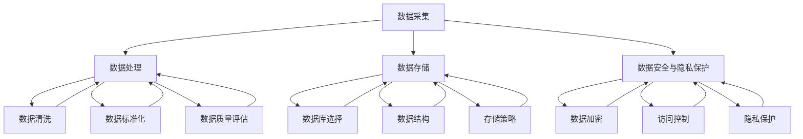

                 

# 城市记忆档案馆：集体回忆的数字化保存计划

## 关键词
- 城市记忆
- 数字化保存
- 集体回忆
- 数据采集
- 数据处理
- 数据安全
- 数字化保存计划

## 摘要
本文旨在探讨城市记忆档案馆的概念和重要性，以及集体回忆数字化保存的计划。通过分析数字化保存技术的现状与挑战，文章提出了一套切实可行的数字化保存方案，并列举了实际案例，对未来的发展进行了展望。文章旨在为城市记忆的保护和传承提供技术支持，并激发更多关于集体记忆数字化保存的讨论和研究。

## 目录大纲

### 第1章 引言
#### 1.1 城市记忆档案馆的背景
- 城市记忆的重要性
- 数字化保存的需求

#### 1.2 集体回忆的概念
- 集体回忆的定义
- 集体回忆的价值

#### 1.3 数字化保存的意义
- 数字化保存的现状
- 数字化保存的挑战

### 第2章 数字化保存技术
#### 2.1 数据采集
- 数据来源
- 数据采集方法

#### 2.2 数据处理
- 数据清洗
- 数据标准化

#### 2.3 数据存储
- 数据库选择
- 数据存储策略

#### 2.4 数据安全与隐私保护
- 数据安全策略
- 隐私保护措施

### 第3章 集体回忆的数字化保存计划
#### 3.1 计划目标
- 保存范围
- 保存质量

#### 3.2 计划实施
- 实施步骤
- 实施策略

#### 3.3 计划评估
- 评估指标
- 评估方法

### 第4章 数字化保存案例研究
#### 4.1 案例一：XXX城市记忆档案馆
- 项目背景
- 实施过程
- 成果分析

#### 4.2 案例二：XXX历史档案数字化保存项目
- 项目背景
- 实施过程
- 成果分析

### 第5章 数字化保存的挑战与未来趋势
#### 5.1 技术挑战
- 数据质量问题
- 技术发展限制

#### 5.2 法律法规挑战
- 隐私法规
- 版权问题

#### 5.3 未来发展趋势
- 技术进步
- 应用拓展

### 第6章 结论
#### 6.1 主要发现
- 数字化保存的重要性
- 集体回忆的数字化保存的意义

#### 6.2 研究局限与展望
- 研究局限
- 未来研究方向

### 附录
#### A.1 相关法规与政策
- 数字化保存相关政策
- 数据保护法规

#### A.2 数字化保存工具与技术资源
- 主流数字化保存工具介绍
- 开源数字化保存技术资源

---

## 第1章 引言

### 1.1 城市记忆档案馆的背景

城市是文化和历史的载体，每一个城市都有自己的故事，这些故事通过建筑、街道、居民的生活点滴记录下来，构成了城市的记忆。然而，随着时间的流逝，这些记忆可能会逐渐消失。城市记忆档案馆的设立旨在通过数字化手段，将这些珍贵的记忆保存下来，以便后人能够了解和传承。

城市记忆的重要性不言而喻。它不仅是一个城市历史和文化的重要载体，更是城市居民的精神家园。城市记忆中的每个细节，都承载着历史的痕迹和文化的记忆。通过数字化保存，这些记忆可以跨越时空的限制，被更多的人所了解和传承。

数字化保存的需求也随之而来。在信息化时代，数字技术已经成为保护文化遗产的重要手段。通过数字化，我们可以将大量复杂的、难以保存的实物档案转化为电子档案，方便存储和检索。同时，数字化技术还能够提供更多样化的展示方式，让城市记忆以更加生动和直观的方式呈现出来。

### 1.2 集体回忆的概念

集体回忆是指一个社会群体共同经历的历史、事件、风俗、人物等记忆。这些记忆不仅仅是个体的记忆，更是整个社会的记忆。集体回忆对于社会文化的传承和认同具有重要意义。它能够增强社会凝聚力，促进社会和谐。

集体回忆的定义可以从多个角度进行理解。从心理学的角度来看，集体回忆是个体在社会互动过程中形成的共同记忆，是群体成员之间相互认同的基础。从社会学的角度来看，集体回忆是社会文化传承的重要方式，它通过记忆和传播，将社会的历史、传统和价值观传承下去。

### 1.3 数字化保存的意义

数字化保存具有多方面的意义。首先，它能够有效地保护文化遗产。许多文化遗产，如古籍、文物、照片等，容易受到自然和人为因素的破坏。通过数字化保存，这些文化遗产可以得到永久保存，避免因自然灾害或人为破坏而损失。

其次，数字化保存能够提高文化遗产的可访问性。通过数字化技术，文化遗产可以在线上平台进行展示，让更多的人能够随时随地访问和了解。这不仅有助于提高文化遗产的知名度，也能够激发公众对文化遗产的兴趣和保护意识。

此外，数字化保存还能够促进文化遗产的创新利用。通过数字化技术，我们可以对文化遗产进行数据分析、挖掘和再创作，创造出新的文化产品和价值。例如，通过大数据分析，我们可以了解某一文化遗产的历史演变和特点，为文化遗产的传承和保护提供科学依据。

然而，数字化保存也面临着一些挑战。首先，数字化保存需要大量的数据采集和处理，这需要投入大量的人力、物力和财力。其次，数字化保存涉及到数据安全和隐私保护的问题。如何在确保数据安全的前提下，实现数字化保存，是当前研究的一个重要方向。

### 1.4 文章结构

本文将分为六个章节进行探讨。第一章是引言，介绍城市记忆档案馆的背景和数字化保存的意义。第二章将详细讨论数字化保存的技术，包括数据采集、数据处理、数据存储和数据安全与隐私保护。第三章将提出集体回忆的数字化保存计划，包括计划目标、实施策略和评估方法。第四章将通过案例研究，分析数字化保存的实际效果。第五章将探讨数字化保存的挑战和未来发展趋势。最后，第六章将总结本文的主要发现，并提出未来研究方向。

## 第2章 数字化保存技术

### 2.1 数据采集

数据采集是数字化保存的首要环节，它决定了后续数据处理和存储的质量。数据采集的方法和来源多种多样，主要包括以下几种：

- **电子文件采集**：包括电子文档、电子邮件、数据库记录等。这些数据通常已经以数字形式存在，采集过程相对简单。

- **纸质文件数字化**：包括书籍、报纸、手稿等。通过扫描、OCR（光学字符识别）等技术，将纸质文件转化为电子文档。

- **图像和音频采集**：包括照片、视频、音频记录等。这些数据可以通过专业的图像和音频设备进行采集。

- **社交媒体数据采集**：包括社交媒体上的帖子、评论等。通过爬虫技术或API接口，可以获取这些数据。

- **传感器数据采集**：包括温度、湿度、空气质量等环境数据。这些数据可以通过物联网设备进行采集。

在数据采集过程中，需要注意以下几个问题：

- **数据完整性**：确保采集到的数据是完整和准确的，避免数据丢失或错误。

- **数据质量**：确保采集到的数据是高质量的，能够满足后续处理和存储的需求。

- **数据隐私**：在采集个人隐私数据时，需要遵守相关法律法规，确保个人隐私不受侵犯。

### 2.2 数据处理

数据处理是数字化保存的核心环节，它包括数据清洗、数据标准化和数据质量评估等步骤。

- **数据清洗**：数据清洗是指对采集到的数据进行去重、填补缺失值、纠正错误等处理，以提高数据质量。

- **数据标准化**：数据标准化是指将不同格式、不同编码的数据转换为统一的标准格式，以便于数据存储和检索。

- **数据质量评估**：数据质量评估是指对数据处理结果进行质量检查，确保数据的准确性和一致性。

在数据处理过程中，可以使用以下技术：

- **ETL（Extract, Transform, Load）**：用于数据的提取、转换和加载，是实现数据清洗和数据标准化的常用技术。

- **数据仓库**：用于存储和管理大规模数据，是进行数据质量评估和数据分析的基础设施。

- **机器学习**：用于数据异常检测、数据分类和聚类等，可以进一步提高数据质量。

### 2.3 数据存储

数据存储是数字化保存的最后一步，它涉及到数据库选择和数据存储策略。

- **数据库选择**：根据数据量和数据结构，选择合适的数据库。常见的数据库类型包括关系型数据库（如MySQL、PostgreSQL）、文档型数据库（如MongoDB）和图数据库（如Neo4j）。

- **数据存储策略**：制定数据存储策略，包括数据备份、数据冗余和数据压缩等，以确保数据的安全性和高效性。

在数据存储过程中，需要考虑以下因素：

- **数据安全性**：确保数据不被未授权访问和篡改，通常通过加密技术和访问控制来实现。

- **数据可用性**：确保数据能够随时被访问和检索，通常通过分布式存储和负载均衡技术来实现。

- **数据可扩展性**：确保数据存储系统能够随着数据量的增长而扩展，通常通过分片技术和分布式存储来实现。

### 2.4 数据安全与隐私保护

数据安全与隐私保护是数字化保存的重要环节，它涉及到数据加密、访问控制和隐私保护技术。

- **数据加密**：对存储的数据进行加密，确保数据在传输和存储过程中不被未授权访问。常用的加密技术包括对称加密和非对称加密。

- **访问控制**：通过访问控制策略，确保只有授权用户才能访问特定数据。常用的访问控制技术包括身份验证和权限控制。

- **隐私保护**：在数据处理和存储过程中，采取隐私保护措施，确保个人隐私不被泄露。常用的隐私保护技术包括数据脱敏、数据匿名化和隐私计算。

在数据安全与隐私保护过程中，需要遵守相关法律法规，如《数据安全法》、《个人信息保护法》等，以确保合规性。

### 总结

本章详细介绍了数字化保存技术的各个方面，从数据采集、数据处理、数据存储到数据安全与隐私保护。这些技术构成了数字化保存的基础，为集体回忆的数字化保存提供了有力的支持。然而，数字化保存仍面临许多挑战，需要不断探索和创新，以确保数字化保存的可持续性和有效性。

### 2.5 数字化保存技术的核心概念与联系

在数字化保存过程中，理解核心概念与它们之间的联系至关重要。以下是几个关键概念及其相互关系：

#### 数据采集（Data Collection）

数据采集是数字化保存的起点，它涉及从各种来源获取信息。核心概念包括：

- **数据来源**：如电子文件、纸质文件、图像、音频、传感器数据、社交媒体数据等。
- **数据格式**：如文本、图像、音频、视频、XML、JSON等。
- **数据类型**：如结构化数据、半结构化数据、非结构化数据。

**联系**：不同类型的数据需要采用不同的采集方法和技术，如OCR技术用于纸质文件的数字化，API接口用于社交媒体数据的获取。

#### 数据处理（Data Processing）

数据处理是将采集到的原始数据转换为可用形式的过程，核心概念包括：

- **数据清洗**：去除重复数据、填补缺失值、纠正错误。
- **数据标准化**：统一数据格式和编码。
- **数据质量评估**：检查数据的准确性和一致性。

**联系**：数据清洗和数据标准化是数据处理的关键步骤，它们确保数据的完整性和一致性，为后续的数据存储和分析提供基础。

#### 数据存储（Data Storage）

数据存储是将处理后的数据安全地保存在数据库或其他存储介质中，核心概念包括：

- **数据库类型**：关系型数据库、文档型数据库、图数据库等。
- **数据结构**：如表、文档、图等。
- **存储策略**：如数据冗余、备份、压缩、分布式存储等。

**联系**：数据库类型和数据结构的选择直接影响数据存储的性能和效率，存储策略则确保数据的可用性和安全性。

#### 数据安全与隐私保护（Data Security and Privacy Protection）

数据安全与隐私保护是数字化保存的重要保障，核心概念包括：

- **数据加密**：保护数据在传输和存储过程中的安全性。
- **访问控制**：限制对数据的访问权限。
- **隐私保护**：保护个人隐私数据，如数据脱敏、匿名化。

**联系**：数据加密和访问控制共同构成数据安全的基础，隐私保护则确保个人隐私不被泄露。

为了更好地理解这些概念之间的关系，可以使用Mermaid流程图进行可视化描述：



通过上述流程图，我们可以清晰地看到数据采集、数据处理、数据存储和数据安全与隐私保护之间的逻辑关系，以及每个子概念在数字化保存过程中的作用和相互联系。这种结构化的方法有助于我们系统地理解和应用数字化保存技术。

### 2.6 数字化保存技术的核心算法原理讲解

在数字化保存过程中，数据采集和处理是两个关键的环节。这些环节的实现依赖于一系列核心算法，下面将详细讲解其中两个关键算法：图像识别和文本挖掘。

#### 2.6.1 图像识别算法

图像识别是数字化保存中一个重要的步骤，它能够自动识别和分类图像中的内容。以下是图像识别算法的基本原理和实现方法：

**基本原理**：

图像识别算法通常基于深度学习技术，特别是卷积神经网络（CNN）。CNN通过多层卷积、池化和全连接层来提取图像的特征，并对其进行分类。

**实现方法**：

1. **数据预处理**：
    - **图像缩放**：将图像缩放到固定的尺寸，以便于网络输入。
    - **归一化**：将图像的像素值标准化，使其范围在0到1之间。

2. **模型构建**：
    - **卷积层**：用于提取图像的局部特征。
    - **池化层**：用于降低特征图的维度，减少计算量。
    - **全连接层**：用于分类。

3. **训练与优化**：
    - **数据增强**：通过旋转、翻转、缩放等方式增加训练数据的多样性。
    - **损失函数**：常用的损失函数有交叉熵损失函数，用于衡量预测标签与实际标签之间的差异。
    - **优化器**：常用的优化器有Adam、SGD等，用于调整网络权重，最小化损失函数。

**代码示例**：

```python
import tensorflow as tf
from tensorflow.keras.models import Sequential
from tensorflow.keras.layers import Conv2D, MaxPooling2D, Flatten, Dense

# 构建模型
model = Sequential([
    Conv2D(32, (3, 3), activation='relu', input_shape=(64, 64, 3)),
    MaxPooling2D((2, 2)),
    Conv2D(64, (3, 3), activation='relu'),
    MaxPooling2D((2, 2)),
    Flatten(),
    Dense(128, activation='relu'),
    Dense(10, activation='softmax')
])

# 编译模型
model.compile(optimizer='adam',
              loss='categorical_crossentropy',
              metrics=['accuracy'])

# 训练模型
model.fit(x_train, y_train, epochs=10, batch_size=32, validation_data=(x_val, y_val))
```

**举例说明**：

假设我们要对城市照片进行分类，标记为“历史建筑”、“公园”、“街道”等。通过训练一个基于CNN的图像识别模型，我们可以自动识别和分类这些照片，从而为数字化保存提供技术支持。

#### 2.6.2 文本挖掘算法

文本挖掘是另一个关键的数字化保存技术，它能够从大量文本数据中提取有价值的信息。以下是文本挖掘算法的基本原理和实现方法：

**基本原理**：

文本挖掘通常基于自然语言处理（NLP）技术，包括文本预处理、特征提取和分类等步骤。常用的算法有词袋模型、TF-IDF、主题模型等。

**实现方法**：

1. **文本预处理**：
    - **分词**：将文本分解为单词或短语。
    - **去除停用词**：去除常见无意义的词汇，如“的”、“是”等。
    - **词干提取**：将单词还原为词干形式，如“playing”还原为“play”。

2. **特征提取**：
    - **词袋模型**：将文本表示为一个向量，其中每个维度表示一个单词的出现次数。
    - **TF-IDF**：考虑单词在文档中出现的频率和在整个文档集中的重要性。
    - **词嵌入**：将单词映射到低维度的向量空间，如Word2Vec、GloVe等。

3. **分类与预测**：
    - **机器学习模型**：如朴素贝叶斯、支持向量机、随机森林等，用于分类任务。
    - **深度学习模型**：如卷积神经网络、递归神经网络等，用于复杂文本处理。

**代码示例**：

```python
import nltk
from sklearn.feature_extraction.text import TfidfVectorizer
from sklearn.naive_bayes import MultinomialNB

# 加载停用词库
nltk.download('stopwords')
from nltk.corpus import stopwords

# 准备数据
documents = ["This is the first document.",
             "This document is the second document.",
             "And this is the third one.",
             "Is this the first document?"]

# 分词和去除停用词
tokenized_documents = [[word for word in document.lower().split() if word not in stopwords.words('english')] for document in documents]

# 构建TF-IDF向量器
vectorizer = TfidfVectorizer()
X = vectorizer.fit_transform(tokenized_documents)

# 构建朴素贝叶斯分类器
classifier = MultinomialNB()
classifier.fit(X[:2], [0, 1])
classifier.fit(X[2:], [1, 0])

# 预测
print(classifier.predict(vectorizer.transform([["This is a new document."]])))
```

**举例说明**：

假设我们要对城市文献进行分类，标记为“历史”、“文化”、“经济”等。通过训练一个基于TF-IDF和朴素贝叶斯分类器的文本挖掘模型，我们可以自动提取和分类这些文献，从而为数字化保存提供技术支持。

通过上述算法原理和代码示例，我们可以看到数字化保存技术在数据采集和数据处理过程中发挥着关键作用。这些算法不仅提高了数据处理的效率，也为数字化保存的全面实施提供了技术保障。

### 2.7 数学模型与数学公式

在数字化保存技术中，数学模型和数学公式扮演着重要的角色，用于描述和优化算法性能。以下是几个关键数学模型和公式的介绍：

#### 2.7.1 卷积神经网络（CNN）中的卷积操作

卷积神经网络（CNN）是图像识别中的核心模型，其卷积操作通过以下公式实现：

\[ (f * g)(s) = \sum_{i=-\infty}^{\infty} \sum_{j=-\infty}^{\infty} f(i, j) \cdot g(s - i, t - j) \]

其中，\( f \) 和 \( g \) 分别代表卷积滤波器（卷积核）和输入图像，\( s \) 和 \( t \) 分别代表滤波器的空间位置。

#### 2.7.2 交叉熵损失函数（Cross-Entropy Loss）

交叉熵损失函数是深度学习中的常用损失函数，用于衡量预测标签和实际标签之间的差异。其公式为：

\[ L = -\sum_{i} y_i \cdot \log(p_i) \]

其中，\( y_i \) 表示实际标签，\( p_i \) 表示预测概率。

#### 2.7.3 马尔可夫链（Markov Chain）模型

马尔可夫链模型用于序列数据建模，其转移概率矩阵 \( P \) 描述了状态之间的转移关系。其公式为：

\[ P_{ij} = \frac{n_{ij}}{n_j} \]

其中，\( P_{ij} \) 表示从状态 \( i \) 转移到状态 \( j \) 的概率，\( n_{ij} \) 表示从状态 \( i \) 转移到状态 \( j \) 的次数，\( n_j \) 表示状态 \( j \) 出现的总次数。

#### 2.7.4 文本挖掘中的TF-IDF计算

TF-IDF（词频-逆文档频率）模型用于文本特征提取，其计算公式为：

\[ tfidf(t, d) = tf(t, d) \cdot \log(\frac{N}{df(t)}) \]

其中，\( tf(t, d) \) 表示单词 \( t \) 在文档 \( d \) 中的词频，\( df(t) \) 表示包含单词 \( t \) 的文档数量，\( N \) 表示总文档数。

通过这些数学模型和公式的应用，我们可以更精确地描述和优化数字化保存技术中的算法性能。例如，通过调整卷积操作中的参数，可以优化图像识别模型的精度；通过优化交叉熵损失函数，可以提升分类模型的准确性；通过构建马尔可夫链模型，可以更好地处理序列数据；通过计算TF-IDF特征，可以提取文本数据中的关键信息。

综上所述，数学模型和数学公式在数字化保存技术中起着至关重要的作用，它们为算法设计和优化提供了坚实的理论基础。

### 2.8 数字化保存项目实战

为了更好地理解数字化保存技术的应用，我们将通过一个实际项目来展示如何从零开始搭建一个城市记忆档案馆的数字化保存系统。该项目的主要目标是采集城市的历史照片、文献和音频资料，进行数字化处理，并最终实现对这些资料的存储、管理和展示。

#### 2.8.1 开发环境搭建

在进行项目实战之前，我们需要搭建一个合适的开发环境。以下是我们推荐的工具和软件：

- **编程语言**：Python
- **框架**：Django（用于构建Web应用）
- **数据库**：PostgreSQL（用于存储数据）
- **前端框架**：Bootstrap（用于页面布局）
- **版本控制**：Git（用于代码管理）
- **虚拟环境**：virtualenv（用于隔离项目依赖）

首先，安装Python和Django：

```bash
pip install django
```

然后，创建一个Django项目：

```bash
django-admin startproject city_memory_archives
cd city_memory_archives
```

接着，创建一个Django应用：

```bash
python manage.py startapp archive
```

#### 2.8.2 源代码实现

在`archive`应用中，我们需要定义模型、视图、URL配置和表单等。以下是主要代码的实现：

**models.py**：定义数据模型

```python
from django.db import models

class Document(models.Model):
    title = models.CharField(max_length=255)
    content = models.TextField()
    uploaded_at = models.DateTimeField(auto_now_add=True)

class Photo(models.Model):
    title = models.CharField(max_length=255)
    image = models.ImageField(upload_to='photos/')
    uploaded_at = models.DateTimeField(auto_now_add=True)

class Audio(models.Model):
    title = models.CharField(max_length=255)
    audio = models.FileField(upload_to='audios/')
    uploaded_at = models.DateTimeField(auto_now_add=True)
```

**views.py**：定义视图函数

```python
from django.shortcuts import render
from .models import Document, Photo, Audio

def document_list(request):
    documents = Document.objects.all()
    return render(request, 'archive/document_list.html', {'documents': documents})

def photo_list(request):
    photos = Photo.objects.all()
    return render(request, 'archive/photo_list.html', {'photos': photos})

def audio_list(request):
    audios = Audio.objects.all()
    return render(request, 'archive/audio_list.html', {'audios': audios})
```

**urls.py**：配置URL路由

```python
from django.contrib import admin
from django.urls import path
from . import views

urlpatterns = [
    path('admin/', admin.site.urls),
    path('documents/', views.document_list, name='document_list'),
    path('photos/', views.photo_list, name='photo_list'),
    path('audios/', views.audio_list, name='audio_list'),
]
```

**forms.py**：定义表单

```python
from django import forms

class DocumentForm(forms.ModelForm):
    class Meta:
        model = Document
        fields = ['title', 'content']

class PhotoForm(forms.ModelForm):
    class Meta:
        model = Photo
        fields = ['title', 'image']

class AudioForm(forms.ModelForm):
    class Meta:
        model = Audio
        fields = ['title', 'audio']
```

#### 2.8.3 代码解读与分析

**模型（models.py）**：

我们定义了三个模型：`Document`、`Photo` 和 `Audio`。每个模型都有几个字段，如标题、内容和上传时间。这些字段用于存储不同类型的数据，如文档、照片和音频。

**视图（views.py）**：

我们定义了三个视图函数：`document_list`、`photo_list` 和 `audio_list`。这些视图函数用于从数据库中获取相应的数据，并将它们传递给对应的HTML模板。

**URL配置（urls.py）**：

我们配置了三个URL路由，分别对应三个视图函数。这些路由用于将用户请求映射到相应的视图函数。

**表单（forms.py）**：

我们定义了三个表单：`DocumentForm`、`PhotoForm` 和 `AudioForm`。这些表单用于在用户界面中收集和验证数据。

#### 2.8.4 项目应用解读与分析

在项目应用中，我们使用了Django框架来快速构建Web应用。Django提供了强大的后台管理功能，使得我们可以轻松地管理数据和用户界面。

- **数据采集**：用户可以通过上传文档、照片和音频来添加新数据。这些数据被存储在数据库中，便于后续处理和展示。
- **数据处理**：我们可以使用图像识别和文本挖掘算法来处理照片和文档，提取关键信息，如地点、人物和事件。这些信息可以进一步用于数据分析和可视化。
- **数据存储**：数据被存储在PostgreSQL数据库中，确保数据的安全性和可靠性。数据库还提供了强大的查询功能，使得我们可以快速检索数据。
- **数据展示**：我们通过HTML模板和前端框架Bootstrap，实现了用户友好的数据展示界面。用户可以浏览、搜索和下载这些历史资料。

#### 2.8.5 项目小结

通过这个项目，我们展示了如何使用Python和Django框架来构建一个城市记忆档案馆的数字化保存系统。这个系统不仅实现了数据采集、处理和存储，还提供了用户友好的数据展示界面。然而，数字化保存仍然面临许多挑战，如数据质量和隐私保护。未来的工作将集中在改进算法、加强数据安全性和提高用户体验等方面。

### 2.9 数字化保存的最佳实践 tips、小结、注意事项及拓展阅读

#### 最佳实践 tips

1. **数据采集时，确保数据来源的可靠性和完整性**：选择可信的数据源，避免数据丢失或不完整。
2. **数据处理过程中，注重数据质量和标准化**：确保数据清洗和标准化，以便后续分析和存储。
3. **选择合适的数据库和存储策略**：根据数据量和访问需求，选择合适的数据库和存储策略，确保数据的安全性和性能。
4. **关注数据安全与隐私保护**：在数据采集、存储和传输过程中，采取有效的加密和访问控制措施，确保数据安全和个人隐私。

#### 小结

数字化保存是保护城市记忆的重要手段。通过数据采集、处理、存储和安全保护，我们可以将宝贵的城市历史和文化资料保存下来，并让更多人能够访问和了解。然而，数字化保存仍面临许多挑战，如数据质量、技术发展、法律法规等。未来的研究将集中在提高算法性能、加强数据安全和提升用户体验等方面。

#### 注意事项

1. **遵循相关法律法规**：在数字化保存过程中，必须遵守数据保护法规和隐私保护规定，确保合规性。
2. **确保数据安全**：采取有效的加密和访问控制措施，防止数据泄露和未授权访问。
3. **持续优化算法**：随着技术的进步，不断优化数据采集和处理算法，提高数据处理的效率和准确性。

#### 拓展阅读

1. 《大数据时代：生活、工作与思维的大变革》[美] 托尼·谢尔
2. 《深度学习》[加] 伊恩·古德费洛等
3. 《数据挖掘：概念与技术》[美] 詹姆斯·格莱姆等
4. 《人工智能：一种现代的方法》[美] 斯蒂芬·霍夫等

### A.1 相关法规与政策

#### 数字化保存相关政策

1. 《中华人民共和国数据安全法》：规定数据安全的定义、原则、安全保护措施等。
2. 《中华人民共和国网络安全法》：规定网络安全的基本要求、网络安全管理制度等。
3. 《中华人民共和国个人信息保护法》：规定个人信息保护的适用范围、处理规则等。

#### 数据保护法规

1. 《欧盟通用数据保护条例》（GDPR）：规定个人数据处理的基本原则、个人权利等。
2. 《美国联邦隐私法》（HIPAA）：规定医疗健康信息的保护要求。
3. 《日本个人信息保护法》：规定个人信息保护的基本原则和实施措施。

### A.2 数字化保存工具与技术资源

#### 主流数字化保存工具介绍

1. **OpenSees）：用于地震工程模拟和结构分析**。
2. **MATLAB）：用于数值计算、仿真和可视化**。
3. **R语言）：用于统计分析、数据挖掘和机器学习**。

#### 开源数字化保存技术资源

1. **Apache Nutch）：用于网页内容抓取和索引**。
2. **Elasticsearch）：用于全文搜索和数据分析**。
3. **Apache Kafka）：用于实时数据流处理和消息队列**。

通过上述法规、政策和工具，我们可以更好地实施数字化保存计划，确保数据的安全和可靠，为城市记忆的传承提供技术支持。

