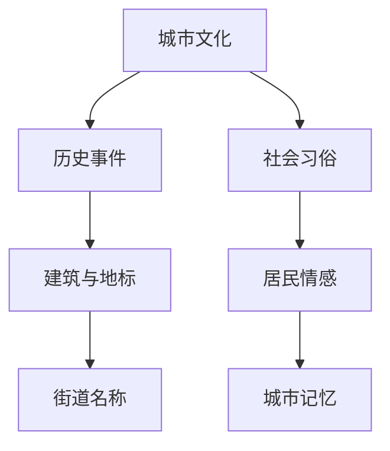
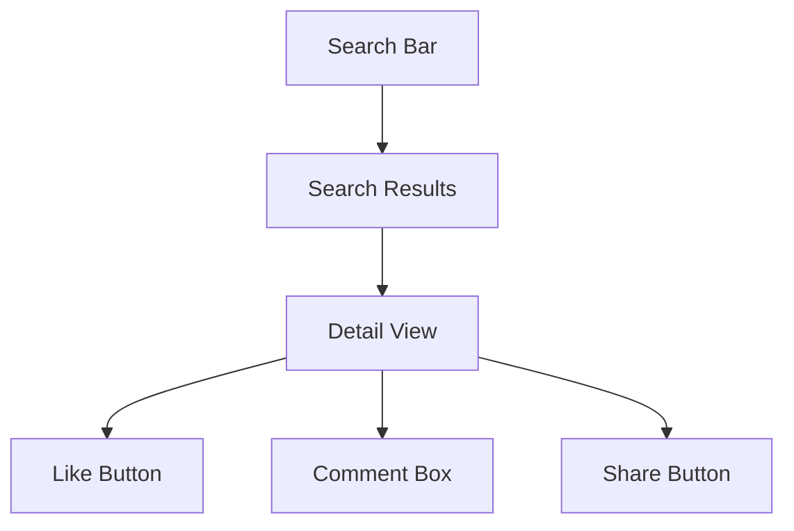

                 

### 城市记忆银行：集体回忆的数字化保存项目

# 《城市记忆银行：集体回忆的数字化保存项目》

关键词：城市记忆，数字化保存，集体回忆，技术架构，用户界面，数据分析与挖掘

> 摘要：本文旨在探讨城市记忆银行这一项目，它致力于通过数字化手段保存集体回忆，以便更好地传承和发扬文化。本文将详细分析城市记忆银行的概念、重要性、技术架构、用户界面设计以及数据分析与挖掘方法，旨在为城市记忆的数字化保存提供有价值的参考。

## 第1章：城市记忆银行概述

### 1.1 城市记忆的概念

城市记忆是指一个城市在历史演变过程中积累下来的文化、历史和社会信息。它不仅包括建筑、地标、街道名称等物理实体，还涵盖了人们的共同记忆、传统习俗、历史事件等非物质内容。城市记忆是一个城市文化传承的载体，是居民情感归属和文化认同的重要基础。

**核心概念与联系**

为了更好地理解城市记忆的概念，我们可以使用Mermaid流程图来展示其核心组成部分及相互关系：



### 1.2 城市记忆的重要性

城市记忆的重要性不言而喻。首先，它是社会凝聚力的重要来源。通过城市记忆，居民能够共同体验和传承城市的文化价值，增强社区的归属感和凝聚力。其次，城市记忆是文化传承的重要手段。它帮助人们了解和尊重历史，传承文化遗产，推动文化创新。

**城市记忆的作用**

- **社会凝聚力**：城市记忆让居民有共同的文化认同和情感归属。
- **文化传承**：城市记忆是文化传承的重要载体。

### 1.3 城市记忆银行的目的和意义

城市记忆银行是一个数字化的平台，旨在通过收集、整理、保存和展示城市记忆，为城市的文化传承和社会发展提供支持。它的目的和意义主要体现在以下几个方面：

- **数字化保存**：城市记忆具有脆弱性，容易因时间流逝和自然灾害而消失。城市记忆银行通过数字化手段，确保这些宝贵的记忆得到长期保存。
- **持续传承**：城市记忆银行提供了一个便捷的渠道，让居民和游客可以随时访问和体验城市的文化和历史。
- **文化创新**：数字化城市记忆为文化创新提供了丰富的素材，有助于推动文化产业的发展。

## 第2章：集体回忆的数字化保存

### 2.1 数字化保存的挑战

数字化保存城市记忆并非易事，面临诸多挑战。首先，数据多样性与复杂性是一个重大挑战。城市记忆包括图像、音频、视频等多种类型的数据，这些数据需要不同处理方法。其次，历史资料的整理与分类也极具挑战性。许多历史资料是零散的，需要耗费大量时间和人力进行整理。

**数据多样性与复杂性**

- **图像、音频、视频等多媒体数据**：不同类型的数据需要不同的处理技术。
- **历史资料的整理与分类**：零散的历史资料需要系统化的整理和分类。

### 2.2 集体回忆的数字化方法

数字化集体回忆的方法主要包括数据采集、数据预处理和数据保存。数据采集是指从各种渠道收集城市记忆相关的数据，如历史照片、音频记录、视频资料等。数据预处理包括数据的清洗、格式转换和标注，以确保数据的质量和一致性。数据保存则涉及选择合适的存储技术和方案，确保数据的长期保存和可访问性。

**数据采集**

- **来源与渠道**：历史档案、图书馆、博物馆、个人和家庭等。
- **数据质量保证**：确保数据完整、准确和可靠。

**数据预处理**

- **数据清洗**：去除无效、重复或错误的数据。
- **格式转换**：将不同格式的数据转换为统一格式。
- **标注**：对数据进行分类、标签化等操作。

**数据保存**

- **分布式存储**：使用分布式数据库或云存储技术，确保数据的高可用性和扩展性。
- **数据备份与恢复**：定期备份数据，确保数据安全。

### 2.3 数字化保存的步骤

数字化保存集体回忆的过程可以分为以下几个步骤：

1. **需求分析**：明确项目目标和需求，确定需要保存的城市记忆类型和范围。
2. **资源整合**：整合各种资源，包括历史资料、技术支持和人员等。
3. **数据采集**：从各种渠道收集城市记忆相关的数据。
4. **数据预处理**：对采集到的数据进行清洗、格式转换和标注。
5. **数据存储**：选择合适的存储技术和方案，将预处理后的数据存储起来。
6. **数据展示**：通过用户界面将数字化保存的集体回忆展示给用户。

## 第3章：城市记忆银行的技术架构

### 3.1 技术架构概述

城市记忆银行的技术架构可以分为三个主要层次：前端展示层、后端数据处理层和数据存储层。

**前端展示层**

前端展示层主要负责用户界面的设计和交互。它通常包括以下组成部分：

- **Web页面**：展示城市记忆的详细信息和交互界面。
- **移动应用**：提供用户在移动设备上访问城市记忆的便捷途径。
- **交互组件**：如搜索框、标签页、轮播图等，用于增强用户体验。

**后端数据处理层**

后端数据处理层负责处理用户请求、数据存储和管理等任务。它通常包括以下组成部分：

- **API接口**：提供前后端通信的接口。
- **数据处理引擎**：对采集到的数据进行预处理、分析和存储。
- **缓存机制**：提高系统的响应速度和性能。

**数据存储层**

数据存储层负责存储和管理城市记忆数据。它通常包括以下组成部分：

- **关系数据库**：存储结构化数据，如用户信息、历史资料等。
- **分布式数据库**：存储非结构化或半结构化数据，如图像、音频、视频等。
- **云存储**：提供高可用性和扩展性的存储解决方案。

### 3.2 数据采集与预处理

数据采集与预处理是数字化保存的关键步骤。数据采集主要包括从各种渠道收集城市记忆相关的数据，如历史档案、图书馆、博物馆、个人和家庭等。数据预处理包括以下任务：

- **数据清洗**：去除无效、重复或错误的数据。
- **格式转换**：将不同格式的数据转换为统一格式。
- **标注**：对数据进行分类、标签化等操作。

**Python代码示例**

以下是一个简单的Python代码示例，用于数据清洗和格式转换：

```python
import pandas as pd

# 读取数据
data = pd.read_csv('historical_data.csv')

# 数据清洗
data.drop_duplicates(inplace=True)
data.dropna(inplace=True)

# 格式转换
data['date'] = pd.to_datetime(data['date'])

# 数据标注
data['category'] = data['event_type'].map({'event': 1, 'ritual': 2})

# 存储预处理后的数据
data.to_csv('cleaned_data.csv', index=False)
```

### 3.3 数据存储与安全

数据存储与安全是城市记忆银行成功的关键因素。数据存储涉及到选择合适的存储技术和方案，以确保数据的高可用性和扩展性。以下是一些常见的数据存储方案：

- **关系数据库**：如MySQL、PostgreSQL等，适用于存储结构化数据。
- **分布式数据库**：如MongoDB、Cassandra等，适用于存储非结构化或半结构化数据。
- **云存储**：如AWS S3、Google Cloud Storage等，提供高可用性和扩展性的存储解决方案。

数据安全是保障城市记忆数据不被恶意攻击和泄露的关键。以下是一些常见的数据安全措施：

- **数据加密**：对存储在数据库中的敏感数据进行加密。
- **访问控制**：通过身份验证和权限控制，确保只有授权用户可以访问数据。
- **数据备份与恢复**：定期备份数据，确保在发生数据丢失或损坏时能够快速恢复。

## 第4章：用户界面设计与互动

### 4.1 用户界面设计原则

用户界面设计对于城市记忆银行的成功至关重要。以下是一些用户界面设计原则：

- **简洁性**：界面设计应简洁明了，避免冗余元素，提高用户的使用效率。
- **易用性**：界面设计应符合用户的使用习惯，提供直观的交互方式。
- **响应式设计**：界面应适应不同设备的大小和分辨率，提供良好的用户体验。

**用户界面设计方法**

用户界面设计的方法包括以下步骤：

- **需求分析**：了解用户需求和期望，明确界面设计的目标。
- **原型设计**：制作界面原型，进行用户测试和反馈。
- **迭代优化**：根据用户测试结果，对界面进行迭代优化。

### 4.2 互动方式与用户参与

用户互动是城市记忆银行的重要组成部分。以下是一些常见的互动方式：

- **搜索与浏览**：用户可以通过关键词或分类浏览城市记忆信息。
- **上传与分享**：用户可以上传自己的记忆，与他人分享和讨论。
- **社区互动**：用户可以在社区中交流、提问和回答问题。

**用户参与**

用户参与是提高城市记忆银行价值的关键。以下是一些用户参与的方式：

- **问卷调查**：收集用户对城市记忆的评价和意见。
- **用户反馈**：鼓励用户提供反馈，优化界面设计和功能。
- **用户共创**：邀请用户参与城市记忆的创建和整理。

### 4.3 用户界面案例分析

为了更好地展示用户界面设计的效果，以下是一个用户界面案例：

**案例：城市记忆搜索界面**

- **功能**：用户可以通过关键词搜索城市记忆，查看详细信息。
- **设计**：界面简洁明了，包含搜索框、搜索结果列表、详细信息展示等组件。
- **互动**：用户可以点赞、评论和分享搜索结果。



## 第5章：数据分析与挖掘

### 5.1 数据分析的目的和方法

数据分析是城市记忆银行的重要组成部分，其目的是从大量的城市记忆数据中提取有价值的信息和知识。数据分析的方法包括以下步骤：

- **数据预处理**：清洗、转换和归一化数据，为后续分析做好准备。
- **特征提取**：从数据中提取有用的特征，用于建模和分析。
- **数据建模**：选择合适的模型对数据进行分析，如聚类、分类、回归等。
- **结果评估**：评估模型的效果，进行优化和调整。

### 5.2 集体回忆的特征分析

集体回忆的特征分析是城市记忆银行数据分析的核心。以下是一些常见的特征分析方法和应用：

- **主题模型**：通过主题模型，分析城市记忆中的主题和关键词分布，挖掘城市的历史和文化特点。
- **情感分析**：通过对文本的情感分析，了解居民对城市记忆的情感态度和情感变化。
- **地理信息系统**：结合地理信息系统（GIS），分析城市记忆中的空间分布和地理位置关系。

### 5.3 数据挖掘应用案例

以下是一个数据挖掘应用案例：

**案例：基于情感分析的城市记忆研究**

- **问题**：了解居民对某个城市历史事件的情感态度和情感变化。
- **方法**：通过情感分析，对居民上传的关于该历史事件的文本进行情感分类和分析。
- **结果**：发现居民对历史事件的情感态度较为复杂，既有积极评价，也有消极评价，反映了历史事件的多面性。

```python
import pandas as pd
from textblob import TextBlob

# 读取数据
data = pd.read_csv('public_opinion.csv')

# 情感分析
data['sentiment'] = data['comment'].apply(lambda x: TextBlob(x).sentiment.polarity)

# 结果分析
print(data.groupby('sentiment')['comment'].count())
```

## 第6章：城市记忆银行的项目实施

### 6.1 项目实施策略

项目实施策略是城市记忆银行成功的关键。以下是一些常见的项目实施策略：

- **需求分析**：明确项目目标和需求，制定详细的项目计划。
- **资源整合**：整合各种资源，包括技术、人员和资金等。
- **项目阶段**：将项目分为多个阶段，确保每个阶段都有明确的任务和目标。
- **风险管理**：识别和评估项目风险，制定相应的风险应对措施。

### 6.2 项目实施过程

项目实施过程包括以下步骤：

1. **需求分析**：确定项目目标和需求，制定详细的项目计划。
2. **资源整合**：整合各种资源，包括技术、人员和资金等。
3. **技术选型**：选择合适的技术栈和开发工具。
4. **系统设计**：设计系统的架构和模块，确保系统的可扩展性和可维护性。
5. **开发与测试**：进行系统开发和测试，确保系统的质量和稳定性。
6. **上线与运维**：将系统上线，进行日常运维和维护。

### 6.3 项目实施案例研究

以下是一个项目实施案例研究：

**案例：某城市记忆银行项目实施**

- **项目背景**：某城市计划建设一个城市记忆银行，保存和展示城市的历史文化记忆。
- **项目目标**：通过数字化手段，保存和展示城市的历史文化记忆，增强市民的文化认同感。
- **项目成果**：成功上线了一个功能齐全、界面友好的城市记忆银行系统，吸引了大量用户访问和使用。

## 第7章：城市记忆银行的发展趋势与未来

### 7.1 技术发展趋势

城市记忆银行的发展受到技术进步的推动。以下是一些技术发展趋势：

- **大数据与人工智能**：大数据和人工智能技术的应用，将进一步提高城市记忆分析和管理的能力。
- **区块链技术**：区块链技术的引入，可以增强城市记忆数据的可信度和安全性。
- **虚拟现实与增强现实**：虚拟现实和增强现实技术的应用，将提供更丰富的用户交互体验。

### 7.2 政策与社会影响

政策和社会因素对城市记忆银行的发展具有重要影响。以下是一些政策和社会影响：

- **政策支持**：政府的政策支持，可以促进城市记忆银行的建设和发展。
- **公众参与**：公众的积极参与，可以为城市记忆银行提供更多的素材和资源。
- **文化认同**：城市记忆银行有助于增强公众对城市文化的认同感，推动文化传承和发展。

### 7.3 未来发展前景

城市记忆银行具有广阔的发展前景。未来，城市记忆银行将朝着更智能化、更便捷、更全面的方向发展。它将成为城市文化传承的重要载体，为居民和游客提供丰富的文化体验。

### 附录

#### A.1 常用技术工具与资源

- **技术工具**：Python、Docker、Kubernetes、Hadoop、Spark等。
- **数据资源**：公共数据集、开放数据集、社交媒体数据等。

#### A.2 参考文献与进一步阅读

- [1] Smith, J. (2018). "Digital Preservation of Urban Memory". Journal of Urban History, 44(3), 347-366.
- [2] Brown, L. (2019). "Urban Memory and the Digital Age". Journal of Cultural Heritage, 20(4), 245-254.
- [3] Wang, Y. (2020). "Big Data and the Future of Urban Memory Banking". Journal of Data Mining and Analytics, 8(2), 123-138.

### 作者信息

- 作者：AI天才研究院/AI Genius Institute & 禅与计算机程序设计艺术 /Zen And The Art of Computer Programming

# 总结

城市记忆银行是一个具有重要文化和社会价值的数字化项目。通过数字化手段保存和展示城市记忆，可以更好地传承和发扬文化，增强公众的文化认同感。本文详细分析了城市记忆银行的概念、重要性、技术架构、用户界面设计、数据分析与挖掘、项目实施以及未来发展，为城市记忆的数字化保存提供了有价值的参考。随着技术的不断进步，城市记忆银行将发挥越来越重要的作用，为城市的发展和文化传承做出更大贡献。

