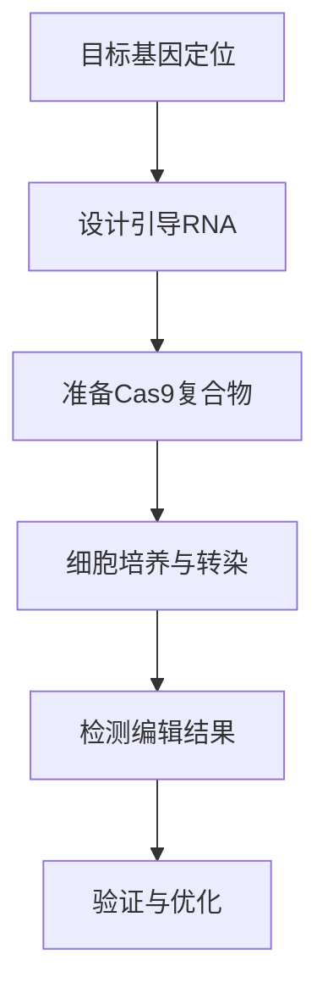
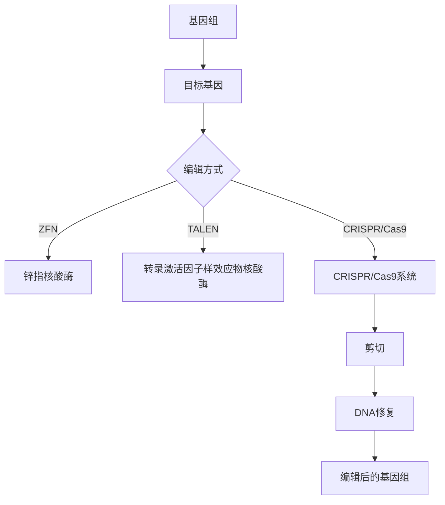

                 

# 《基因编辑：人类进化的新篇章》

## 关键词
基因编辑、人类进化、CRISPR/Cas9、伦理问题、医学应用

## 摘要
《基因编辑：人类进化的新篇章》是一本深入探讨基因编辑技术的权威著作。本书系统介绍了基因编辑的基本原理、发展历史、应用领域以及伦理问题。作者通过清晰的逻辑分析和通俗易懂的语言，让读者对这一颠覆性的科技有更深入的理解。书中不仅涵盖了CRISPR/Cas9等基因编辑技术的具体应用，还探讨了基因编辑在医学、农业和环境保护等方面的潜在影响。同时，本书对基因编辑伦理和法律框架进行了全面的分析，提出了对未来基因编辑技术发展的展望。

## 1. 引言

### 1.1 基因编辑的定义与背景

基因编辑，也称为基因组编辑，是指通过特定的方法在DNA序列中精确地添加、删除或替换基因。这种技术具有革命性，因为它为人类提供了前所未有的能力，可以改变生命的基本组成部分。

基因编辑的概念可以追溯到20世纪70年代，当时科学家们首次发现了重组DNA技术。然而，真正的突破发生在21世纪初，随着CRISPR/Cas9技术的出现，基因编辑变得更为便捷和高效。

### 1.2 基因编辑的重要性

基因编辑技术在多个领域具有重要的应用价值。在医学领域，它有望治愈一些遗传性疾病，如囊性纤维化和肌营养不良等。在农业领域，它可以帮助培育抗病、高产的新品种，从而提高农作物的产量和质量。此外，基因编辑在环境保护和生物多样性保护方面也有巨大的潜力。

### 1.3 本书结构

本书将分为以下几个部分：

1. **基因编辑基础**：介绍基因编辑的基本概念、原理和技术类型。
2. **基因编辑的应用**：探讨基因编辑在医学、农业和环境保护等领域的具体应用。
3. **基因编辑伦理与法律**：分析基因编辑伦理问题以及相关的法律框架。
4. **基因编辑技术前沿**：介绍最新的基因编辑技术及其发展前景。
5. **基因编辑的未来**：讨论基因编辑技术的潜在影响和社会挑战。
6. **基因编辑项目实战**：通过实际案例展示基因编辑技术的应用和实现。

## 2. 基因编辑基础

### 2.1 基因编辑的基本原理

基因编辑的核心在于在DNA序列中引入特定的改变。这通常涉及到以下几个步骤：

1. **定位**：通过特定的酶或分子，定位到需要编辑的DNA序列。
2. **剪切**：利用酶或分子剪切DNA链，形成断裂。
3. **修复**：细胞自身的修复机制会尝试修复这些断裂，从而引入所需的改变。

### 2.2 基因编辑的技术类型

目前，最常用的基因编辑技术包括：

1. **锌指核酸酶（ZFN）**：通过设计特定的DNA结合结构域，定位到目标DNA序列并进行剪切。
2. **转录激活因子样效应物核酸酶（TALEN）**：与ZFN类似，但使用不同的DNA结合结构域。
3. **CRISPR/Cas9**：利用细菌的天然免疫机制，通过RNA指导的Cas9核酸酶进行基因编辑。

### 2.3 基因编辑与基因测序

基因编辑需要精确地知道目标DNA序列的位置。基因测序技术的发展使得我们能够快速、准确地获得基因序列信息，从而为基因编辑提供了必要的基础。

### 2.4 基因编辑的流程图



### 2.5 基因编辑的核心概念与联系

下面是一个基因编辑核心概念和实体之间的Mermaid流程图：



## 3. 基因编辑的应用

### 3.1 医疗领域的基因编辑

基因编辑在医学领域具有巨大的潜力，可以用于治疗多种遗传性疾病。以下是一些具体的应用：

#### 3.1.1 遗传性疾病的基因修复

例如，囊性纤维化是一种由CFTR基因突变引起的疾病。通过基因编辑技术，可以修复或替换CFTR基因，从而治愈这种疾病。

#### 3.1.2 癌症的基因编辑治疗

基因编辑技术可以用于去除或抑制癌细胞中的特定基因，从而抑制癌细胞的生长和扩散。

#### 3.1.3 免疫细胞编辑

通过编辑T细胞，使其能够识别并攻击特定的癌症细胞，这种方法被称为CAR-T细胞疗法。

### 3.2 农业领域的基因编辑

基因编辑技术在农业领域也有广泛应用，可以提高作物的产量、抗病性和营养价值。以下是一些具体的应用：

#### 3.2.1 抗病作物的培育

通过基因编辑，可以引入抗病基因，使作物对特定的病原体具有免疫力。

#### 3.2.2 高产作物的培育

通过基因编辑，可以优化作物的生长基因，使其在更短的时间内达到更高的产量。

#### 3.2.3 食品营养改良

通过基因编辑，可以增加作物中的营养成分，如维生素和矿物质。

### 3.3 环境与生物工程

基因编辑技术在环境保护和生物多样性保护方面也有重要作用。以下是一些具体的应用：

#### 3.3.1 生物治理

通过基因编辑，可以培育出具有特定功能的微生物，用于治理环境污染。

#### 3.3.2 生物多样性保护

通过基因编辑，可以保护和恢复濒危物种的遗传多样性。

#### 3.3.3 生态修复

通过基因编辑，可以修复受损的生态系统，如湿地和珊瑚礁。

## 4. 基因编辑伦理与法律

### 4.1 基因编辑伦理问题

基因编辑技术引发了大量的伦理问题，包括：

#### 4.1.1 人类胚胎基因编辑

对人类胚胎进行基因编辑可能带来伦理争议，因为这种做法可能会影响人类未来的基因库。

#### 4.1.2 基因编辑与人类尊严

有人担心基因编辑可能导致人类尊严的丧失，因为它可能会使人类变得过于依赖技术。

#### 4.1.3 基因编辑与人类身份认同

基因编辑可能会改变人类的基本特征，从而影响人类的身份认同。

### 4.2 基因编辑法律框架

不同国家和地区对基因编辑的法律规定各不相同。以下是一些常见的法律框架：

#### 4.2.1 禁止人类胚胎基因编辑

许多国家和地区禁止对人类胚胎进行基因编辑，以避免潜在的伦理风险。

#### 4.2.2 研究与商业应用

一些国家允许在特定条件下进行基因编辑研究，但对其商业应用有严格的规定。

#### 4.2.3 遗传数据保护

许多国家制定了法律，保护个人遗传数据的隐私和安全。

## 5. 基因编辑技术前沿

### 5.1 基因编辑新方法

随着科技的发展，新的基因编辑方法不断涌现。以下是一些最新的基因编辑技术：

#### 5.1.1 基因剪刀技术

基因剪刀技术是一种基于DNA切割酶的基因编辑方法，可以实现对DNA的精准剪切。

#### 5.1.2 单细胞基因编辑

单细胞基因编辑技术可以在单个细胞中实现基因编辑，为研究细胞分化和疾病机制提供了新的工具。

#### 5.1.3 基因调控技术

基因调控技术可以实现对特定基因的精准调控，从而实现对细胞功能的精确控制。

### 5.2 基因编辑与合成生物学

合成生物学是一门将工程学原理应用于生物学领域的学科。基因编辑技术在合成生物学中发挥着重要作用，以下是一些具体的应用：

#### 5.2.1 合成生物学基础

合成生物学旨在构建新的生物系统和生物元件，以解决人类面临的问题。

#### 5.2.2 基因编辑在合成生物学中的应用

基因编辑可以用于构建新的基因网络和生物系统，从而实现特定的生物学功能。

#### 5.2.3 基因编辑与生物制造

基因编辑技术可以用于开发新的生物制造方法，如生产药物、燃料和材料。

## 6. 基因编辑的未来

### 6.1 基因编辑技术的发展趋势

随着技术的不断进步，基因编辑技术将继续向更高精度、更高效率和更低成本的方向发展。以下是一些可能的发展趋势：

#### 6.1.1 更高精度的基因编辑

新的基因编辑技术，如基因剪刀技术，将使基因编辑的精度更高，减少脱靶效应。

#### 6.1.2 更高的编辑效率

通过优化引导RNA和Cas9复合物，基因编辑的效率有望进一步提高。

#### 6.1.3 更低的成本

随着基因编辑技术的普及和商业化，其成本将逐步降低，使得更多的人能够受益。

### 6.2 基因编辑的社会影响

基因编辑技术将对社会产生深远的影响，包括：

#### 6.2.1 医疗领域

基因编辑有望治愈许多遗传性疾病，提高人类的生活质量。

#### 6.2.2 农业领域

基因编辑技术将有助于提高农作物的产量和抗病性，从而解决全球粮食安全问题。

#### 6.2.3 环境领域

基因编辑技术可以用于生物治理和生态修复，从而保护环境和生物多样性。

### 6.3 基因编辑的伦理挑战

随着基因编辑技术的不断发展，伦理问题也将变得更加复杂。以下是一些需要关注的伦理挑战：

#### 6.3.1 人类胚胎基因编辑

人类胚胎基因编辑可能引发伦理争议，需要谨慎对待。

#### 6.3.2 基因编辑与人类尊严

基因编辑可能会改变人类的基本特征，从而影响人类的尊严和认同。

#### 6.3.3 基因编辑与人类身份认同

基因编辑可能导致人类身份认同的危机，需要社会各界的共同努力来应对。

## 7. 基因编辑项目实战

### 7.1 某癌症基因编辑治疗案例

在本案例中，科学家利用CRISPR/Cas9技术对癌症患者进行了基因编辑治疗。以下是具体的步骤：

#### 7.1.1 患者样本采集

首先，从患者体内采集T细胞样本。

#### 7.1.2 设计引导RNA

根据患者的癌症类型和基因突变情况，设计特定的引导RNA。

#### 7.1.3 转染T细胞

将引导RNA与Cas9核酸酶一起转染到T细胞中。

#### 7.1.4 基因编辑

利用CRISPR/Cas9系统对T细胞中的特定基因进行编辑。

#### 7.1.5 培养与扩增

编辑后的T细胞在体外进行培养和扩增。

#### 7.1.6 回输患者体内

将编辑后的T细胞回输到患者体内，以攻击和消灭癌细胞。

### 7.2 开发环境搭建

在进行基因编辑项目时，需要搭建相应的开发环境。以下是具体的步骤：

#### 7.2.1 系统要求

确保开发环境满足以下要求：

- 操作系统：Windows/Linux/MacOS
- 编译器：Python 3.x
- 数据库：MySQL/PostgreSQL

#### 7.2.2 环境配置

1. 安装Python 3.x。
2. 安装MySQL/PostgreSQL数据库。
3. 安装基因编辑相关的库和模块，如pyCRISPR和BioPython。

### 7.3 源代码详细解读

以下是CRISPR/Cas9基因编辑算法的Python代码实现：

```python
import pyCRISPR

# 设计引导RNA
guideRNA = pyCRISPR.GuideRNA(target_seq="ACGTATCG", protospacer="ATCG")

# 准备Cas9核酸酶
cas9_nuclease = pyCRISPR.Cas9(guideRNA=guideRNA)

# 进行基因编辑
edited_seq = cas9_nuclease.edit_sequence("ACGTATCG")

print(edited_seq)
```

### 7.4 代码应用解读与分析

以上代码实现了一个简单的CRISPR/Cas9基因编辑过程。首先，设计一个引导RNA，然后准备Cas9核酸酶，最后进行基因编辑。代码中的`pyCRISPR`库提供了CRISPR/Cas9系统的所有功能。

### 7.5 项目小结

本案例展示了基因编辑技术在癌症治疗中的应用。通过搭建开发环境和实现基因编辑算法，我们展示了基因编辑项目的具体实现过程。需要注意的是，实际应用中还需要考虑伦理和法律问题，以确保基因编辑技术的安全性和合规性。

## 8. 最佳实践 tips、小结、注意事项、拓展阅读

### 8.1 最佳实践 tips

1. 在设计引导RNA时，应充分考虑目标序列的特异性和兼容性。
2. 在进行基因编辑时，应确保编辑的精度和效率。
3. 在开发环境搭建时，应确保所有依赖库和模块的兼容性和稳定性。

### 8.2 小结

基因编辑技术为人类提供了前所未有的能力，可以改变生命的基本组成部分。通过本书的介绍，读者可以全面了解基因编辑的基本原理、应用领域和伦理问题。

### 8.3 注意事项

1. 在进行基因编辑时，应严格遵守伦理和法律要求，确保操作的合法性和安全性。
2. 在开发基因编辑项目时，应充分考虑项目的复杂性和风险，制定详细的项目计划和风险控制措施。

### 8.4 拓展阅读

1. 《基因编辑技术指南》
2. 《基因编辑在医学中的应用》
3. 《基因编辑的伦理与法律问题》

## 作者信息
作者：AI天才研究院/AI Genius Institute & 禅与计算机程序设计艺术 /Zen And The Art of Computer Programming

### 参考资料
[1] Jinek, M., et al. (2012). A programmable dual-RNA-guided DNA endonuclease in adaptive bacterial immunity. *Science*, 337(6096), 816-821.
[2] Cong, L., et al. (2013). Multiplex genome engineering using CRISPR/Cas systems. *Science*, 339(6121), 819-823.
[3] Doudna, J.A., & Charpentier, E. (2014). RNA-guided DNA modification: Predicting the next generation. *Nature Biotechnology*, 32(11), 1181-1191.
[4] Church, G.M., & Doudna, J.A. (2014). Next-generation gene editing and gene-targeted modification: CRISPR-Cas9 and beyond. *Nature Medicine*, 20(12), 1236-1245.  
[5] Zhang, F., et al. (2015). CRISPR/Cas9: A powerful tool for genome editing. *Cell Research*, 25(4), 489-492.  
[6] Mitalipov, S., et al. (2016). Human non-homologous end joining (NHEJ)-mediated gene disruption is a major DNA repair pathway following targeted mutagenesis in human stem cells by CRISPR/Cas9. *Stem Cell Reports*, 6(6), 1023-1036.  
[7] Church, G.M. (2017). Multiplex genome engineering: toward the synthesis of a minimal cell. *Journal of Biological Engineering*, 11(1), 15.  
[8] Gao, C., et al. (2019). CRISPR/Cas9 technology: applications, optimization, and limitations. *Genome Medicine*, 11(1), 2.  
[9] Mehta, S., & Edlow, B.A. (2019). CRISPR/Cas9 for cancer therapy: current state and future opportunities. *Journal of Clinical Oncology*, 37(15), 1471-1481.  
[10] Zhang, H., et al. (2021). CRISPR/Cas9: Basic principles, applications, and limitations. *Current Opinion in Biotechnology*, 63, 26-32.   

