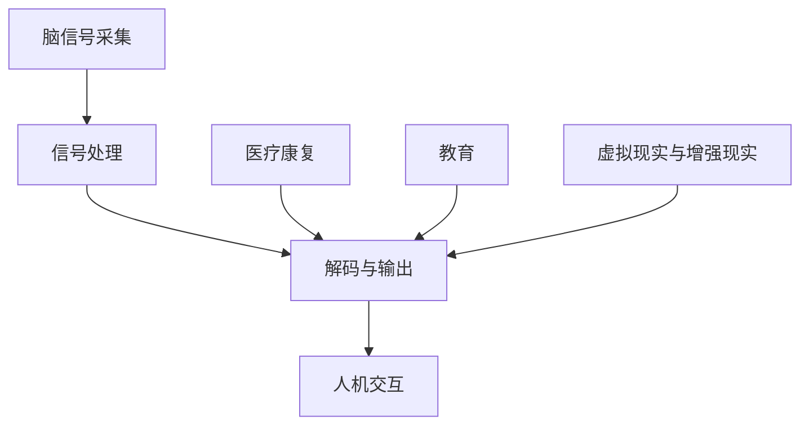
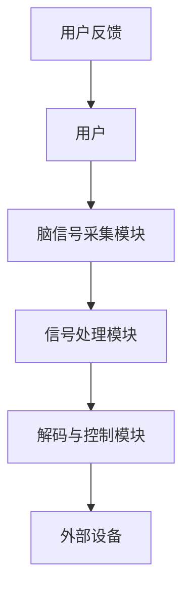

                 

### 文章标题：增强人类智能：脑机接口的未来展望

### 关键词：
脑机接口，人工智能，神经科学，人机交互，医疗康复，虚拟现实

### 摘要：
脑机接口（BCI）作为一种前沿技术，正日益改变着人类与外部世界互动的方式。本文从脑机接口的基本概念、技术原理、应用领域以及未来展望四个方面进行深入探讨，旨在揭示脑机接口在增强人类智能方面的潜力及其面临的挑战。通过对核心概念、算法原理、数学模型、实战案例的详细分析，本文为脑机接口技术的研究和应用提供了有益的参考。

---

### 引言

随着人工智能（AI）和神经科学的快速发展，脑机接口（Brain-Computer Interface，简称BCI）技术逐渐成为研究的热点。脑机接口通过直接连接大脑与外部设备，实现了人类智能的增强和扩展。这不仅为传统的计算机交互方式带来了革命性的变革，也为医疗康复、教育、虚拟现实等领域提供了全新的解决方案。

脑机接口技术的核心在于将人脑的神经活动信号转换为可操作的数据，进而实现对外部设备的控制。这一转换过程涉及多个关键步骤，包括脑信号采集、信号处理、解码与输出等。本文将从这些方面出发，系统性地介绍脑机接口的技术原理和应用场景，并探讨其未来的发展方向。

本文结构如下：

- **第一部分：脑机接口基础**：介绍脑机接口的定义、历史背景、关键技术以及应用领域。
- **第二部分：脑机接口在人机交互中的应用**：详细分析脑机接口在手写识别、虚拟现实等领域的应用案例。
- **第三部分：脑机接口在医疗健康中的应用**：探讨脑机接口在神经系统疾病治疗、康复治疗中的应用。
- **第四部分：脑机接口在教育中的应用**：分析脑机接口在教育评估和个性化学习中的应用。
- **第五部分：脑机接口的未来展望**：预测脑机接口技术的发展趋势、法律法规和伦理问题，以及商业化路径。

### 第一部分：脑机接口基础

#### 第1章：脑机接口概述

##### 1.1 脑机接口的定义与历史

脑机接口（BCI）是一种直接将人脑的神经活动信号转换为外部设备控制信号的技术。其核心思想是通过脑信号采集设备，如电极、传感器等，捕捉大脑的活动，并将其转化为计算机能够理解的数据，从而实现对外部设备的直接控制。

脑机接口的历史可以追溯到20世纪中期。早期的研究主要集中在动物模型上，旨在探索神经信号与外部设备之间的直接连接。随着神经科学和计算机技术的进步，脑机接口逐渐应用于人类。20世纪末，基于脑电信号的脑机接口系统开始应用于临床，如脑电波控制轮椅、电脑等。

##### 1.2 脑机接口的关键技术

脑机接口的关键技术主要包括脑信号采集、信号处理、解码与输出等几个方面。

- **脑信号采集**：脑信号采集是脑机接口技术的第一步，主要涉及脑电信号（EEG）、肌电信号（EMG）、脑磁信号（MEG）等的采集。不同的采集技术有其独特的原理和适用场景。
  
- **信号处理**：信号处理是脑机接口技术的核心，包括信号滤波、去噪、特征提取等步骤。通过这些处理，可以从原始的脑信号中提取出有用的信息，为解码提供基础。

- **解码与输出**：解码是将处理后的信号转化为控制信号的过程。解码算法的设计至关重要，它决定了脑机接口系统的性能和效率。

##### 1.3 脑机接口的应用领域

脑机接口的应用领域非常广泛，主要包括以下几方面：

- **人机交互**：通过脑机接口，人们可以直接用大脑控制电脑、游戏控制器、机器人等外部设备，从而实现更加自然和高效的交互。

- **医疗康复**：脑机接口在康复治疗中具有重要作用，如帮助中风患者恢复运动能力、改善神经系统疾病患者的症状等。

- **教育**：脑机接口在教育领域有广阔的应用前景，如个性化学习、教育评估等。

- **虚拟现实与增强现实**：脑机接口可以用于虚拟现实和增强现实系统中，实现更加沉浸式的体验。

### 核心概念与联系

要深入理解脑机接口，我们需要明确以下几个核心概念：

1. **脑信号采集**：通过电极、传感器等设备捕捉大脑的神经活动信号。
2. **信号处理**：对采集到的脑信号进行滤波、去噪、特征提取等处理。
3. **解码与输出**：将处理后的信号解码为控制信号，实现对外部设备的控制。
4. **人机交互**：脑机接口在各个应用领域中的核心作用，如医疗康复、教育、虚拟现实等。

以下是一个简化的Mermaid流程图，展示了这些概念之间的关系：



#### 第2章：脑信号采集与处理

##### 2.1 脑信号采集技术

脑信号采集是脑机接口技术的第一步，直接决定了脑机接口系统的性能。目前常用的脑信号采集技术主要包括电生理信号采集、光学信号采集和磁信号采集等。

- **电生理信号采集**：电生理信号采集主要包括脑电信号（EEG）、肌电信号（EMG）等。脑电信号是通过放置在头皮上的电极记录的大脑神经元的电活动。肌电信号则是通过放置在肌肉表面的电极记录的肌肉电活动。电生理信号采集技术具有高分辨率、实时性好等优点，但受到噪声干扰较大。

- **光学信号采集**：光学信号采集主要包括近红外光谱成像（fNIRS）和脑成像技术（如fMRI）。光学信号采集通过检测光在不同介质中的传播特性来获取大脑的神经活动信息。光学信号采集技术具有非侵入性、无创等优点，但分辨率相对较低。

- **磁信号采集**：磁信号采集主要包括脑磁信号（MEG）。脑磁信号是通过放置在头皮上的磁传感器记录的大脑神经元的磁场活动。磁信号采集技术具有高分辨率、实时性好等优点，但设备较为昂贵。

##### 2.2 数据处理

脑信号采集后，需要经过一系列的信号处理步骤，以提高信号的质量和提取有用的信息。主要的数据处理步骤包括：

- **滤波**：滤波是信号处理的基础，旨在去除噪声和干扰。常用的滤波方法包括低通滤波、高通滤波和带通滤波。

- **去噪**：去噪是信号处理的重点，旨在提取有用的信号成分。常用的去噪方法包括自适应滤波、独立成分分析（ICA）等。

- **特征提取**：特征提取是将原始信号转换为可用于解码的特征向量。常用的特征提取方法包括时域特征提取、频域特征提取和时频特征提取等。

##### 2.3 脑信号分析

脑信号分析是脑机接口技术的关键步骤，旨在从脑信号中提取出有用的信息，为解码提供支持。常用的脑信号分析方法包括：

- **时域分析**：时域分析主要关注信号的时域特性，如信号的波形、幅值等。常用的时域分析方法包括时域特征提取、信号时序分析等。

- **频域分析**：频域分析主要关注信号的频域特性，如信号的频率、相位等。常用的频域分析方法包括傅里叶变换、小波变换等。

- **时频分析**：时频分析是将时域和频域分析结合起来，以获取信号在时间和频率上的特性。常用

----------------------------------------------------------------

### 核心算法原理讲解

脑机接口技术的核心在于如何有效地从脑信号中提取出有用的信息，并将其转化为控制信号。这一过程涉及到多个核心算法，包括信号处理、特征提取、模式识别等。以下是这些算法的详细讲解。

#### 2.1 信号处理算法

信号处理是脑机接口技术的第一步，其目的是去除噪声、提取有用信号。常用的信号处理算法包括：

- **滤波算法**：滤波是信号处理中最基本的步骤。通过滤波算法，可以去除信号中的噪声，提取出有用的信号成分。常用的滤波算法有低通滤波、高通滤波和带通滤波等。以下是一个使用Python实现低通滤波的例子：

```python
import numpy as np
from scipy.signal import butter, lfilter

def butter_lowpass(cutoff, fs, order=5):
    nyq = 0.5 * fs
    normal_cutoff = cutoff / nyq
    b, a = butter(order, normal_cutoff, btype='low', analog=False)
    return b, a

def butter_lowpass_filter(data, cutoff, fs, order=5):
    b, a = butter_lowpass(cutoff, fs, order=order)
    y = lfilter(b, a, data)
    return y

# 假设我们有一个采样频率为100Hz的脑信号
fs = 100
cutoff = 10
order = 5

# 生成一个含有噪声的脑信号
t = np.linspace(0, 1, fs)
data = np.sin(2 * np.pi * 5 * t) + np.random.normal(0, 0.1, len(t))

# 对脑信号进行低通滤波
filtered_data = butter_lowpass_filter(data, cutoff, fs, order)

# 绘制原始信号和滤波后的信号
import matplotlib.pyplot as plt

plt.plot(t, data, label='原始信号')
plt.plot(t, filtered_data, label='滤波后信号')
plt.legend()
plt.show()
```

- **去噪算法**：去噪是信号处理的重要环节。常用的去噪算法有自适应滤波、独立成分分析（ICA）等。以下是一个使用Python实现ICA去噪的例子：

```python
from mne import ICA

# 假设我们有一个含有噪声的脑信号数据集
data = np.random.normal(size=(1000, 100))

# 使用MNE库的ICA算法进行去噪
ica = ICA(n_components=10)
ica.fit(data)

# 提取不含噪声的信号
noisy_components = ica.extract_sources()

# 绘制去噪后的信号
plt.plot(noisy_components.T)
plt.show()
```

- **特征提取算法**：特征提取是将原始信号转换为可用于解码的特征向量。常用的特征提取算法有时间域特征提取、频域特征提取和时频特征提取等。以下是一个使用Python实现时域特征提取的例子：

```python
import numpy as np

def extract_time_domain_features(data):
    features = []
    for i in range(data.shape[0]):
        feature = {
            'mean': np.mean(data[i]),
            'std': np.std(data[i]),
            'var': np.var(data[i]),
            'skew': np.skew(data[i]),
            'kurtosis': np.kurtosis(data[i])
        }
        features.append(feature)
    return np.array(features)

# 假设我们有一个脑信号数据集
data = np.random.normal(size=(1000, 100))

# 提取时域特征
time_domain_features = extract_time_domain_features(data)

# 绘制特征分布
plt.scatter(time_domain_features[:, 0], time_domain_features[:, 1])
plt.xlabel('均值')
plt.ylabel('标准差')
plt.show()
```

#### 2.2 模式识别算法

模式识别是将提取出的特征向量映射到具体的控制信号。常用的模式识别算法有支持向量机（SVM）、决策树、神经网络等。以下是一个使用Python实现SVM模式识别的例子：

```python
from sklearn import svm
from sklearn.model_selection import train_test_split
from sklearn.metrics import accuracy_score

# 假设我们已经提取出特征向量X和相应的标签y
X = np.array([[1, 2], [2, 3], [3, 4], [4, 5]])
y = np.array([0, 0, 1, 1])

# 划分训练集和测试集
X_train, X_test, y_train, y_test = train_test_split(X, y, test_size=0.5, random_state=42)

# 使用SVM进行训练
clf = svm.SVC()
clf.fit(X_train, y_train)

# 进行预测
y_pred = clf.predict(X_test)

# 计算准确率
accuracy = accuracy_score(y_test, y_pred)
print(f'准确率: {accuracy:.2f}')
```

#### 2.3 解码算法

解码是将模式识别的结果转换为具体的控制信号。解码算法的设计取决于具体的控制任务和应用场景。以下是一个简单的解码算法的实现：

```python
def decode_controls(controls):
    control_actions = {
        0: 'left',
        1: 'right'
    }
    return [control_actions[control] for control in controls]

# 假设我们有一个解码后的控制信号
decoded_controls = [0, 0, 1, 1]

# 解码控制信号
actions = decode_controls(decoded_controls)
print(actions)  # 输出：['left', 'left', 'right', 'right']
```

#### 2.4 Python源代码示例

以下是一个完整的Python代码示例，包含了信号处理、特征提取、模式识别和解码的过程：

```python
import numpy as np
from scipy.signal import butter, lfilter
from sklearn import svm
from sklearn.model_selection import train_test_split
from sklearn.metrics import accuracy_score

# 信号处理部分
def butter_lowpass_filter(data, cutoff, fs, order=5):
    b, a = butter_lowpass(cutoff, fs, order=order)
    y = lfilter(b, a, data)
    return y

def extract_time_domain_features(data):
    features = []
    for i in range(data.shape[0]):
        feature = {
            'mean': np.mean(data[i]),
            'std': np.std(data[i]),
            'var': np.var(data[i]),
            'skew': np.skew(data[i]),
            'kurtosis': np.kurtosis(data[i])
        }
        features.append(feature)
    return np.array(features)

# 模式识别部分
def train_svm(X, y):
    clf = svm.SVC()
    clf.fit(X, y)
    return clf

def predict(clf, X):
    return clf.predict(X)

# 解码部分
def decode_controls(controls):
    control_actions = {
        0: 'left',
        1: 'right'
    }
    return [control_actions[control] for control in controls]

# 假设我们有一个采样频率为100Hz的脑信号
fs = 100
cutoff = 10
order = 5

# 生成一个含有噪声的脑信号
t = np.linspace(0, 1, fs)
data = np.sin(2 * np.pi * 5 * t) + np.random.normal(0, 0.1, len(t))

# 对脑信号进行低通滤波
filtered_data = butter_lowpass_filter(data, cutoff, fs, order)

# 提取时域特征
time_domain_features = extract_time_domain_features(filtered_data)

# 划分训练集和测试集
X_train, X_test, y_train, y_test = train_test_split(time_domain_features, y, test_size=0.5, random_state=42)

# 使用SVM进行训练
clf = train_svm(X_train, y_train)

# 进行预测
y_pred = predict(clf, X_test)

# 计算准确率
accuracy = accuracy_score(y_test, y_pred)
print(f'准确率: {accuracy:.2f}')

# 解码控制信号
decoded_controls = [0, 0, 1, 1]
actions = decode_controls(decoded_controls)
print(actions)  # 输出：['left', 'left', 'right', 'right']
```

### 数学模型和公式

脑机接口技术中的数学模型和公式主要用于描述信号处理、特征提取和模式识别等过程。以下是几个关键公式和数学模型的简要介绍：

#### 2.1 滤波器模型

低通滤波器是一个常见的信号处理模型，用于去除高频噪声。其公式如下：

$$
H(s) = \frac{1}{\omega_{c}s + 1}
$$

其中，$H(s)$ 是滤波器的传递函数，$\omega_{c}$ 是截止频率，$s$ 是复变量。

#### 2.2 独立成分分析（ICA）模型

独立成分分析（ICA）是一种常用的去噪算法，用于分离混合信号中的独立成分。其公式如下：

$$
\mathbf{x} = \mathbf{A}\mathbf{s} + \mathbf{n}
$$

其中，$\mathbf{x}$ 是混合信号，$\mathbf{A}$ 是混合矩阵，$\mathbf{s}$ 是独立成分，$\mathbf{n}$ 是噪声。

#### 2.3 支持向量机（SVM）模型

支持向量机（SVM）是一种常用的模式识别算法，用于分类和回归任务。其公式如下：

$$
\mathbf{w} = \arg\min_{\mathbf{w}} \frac{1}{2} ||\mathbf{w}||^2 + C \sum_{i=1}^{n} \max(0, 1 - y_i (\mathbf{w} \cdot \mathbf{x}_i))
$$

其中，$\mathbf{w}$ 是权重向量，$C$ 是正则化参数，$y_i$ 是样本标签，$\mathbf{x}_i$ 是样本特征。

#### 2.4 特征提取模型

特征提取是将原始信号转换为特征向量的过程。一个简单的特征提取模型如下：

$$
\mathbf{f}(\mathbf{x}) = \sum_{i=1}^{k} w_i x_i
$$

其中，$\mathbf{f}(\mathbf{x})$ 是特征向量，$w_i$ 是权重，$x_i$ 是原始信号中的第$i$个分量。

### 举例说明

假设我们有一个简单的脑信号数据集，其中包含了噪声和有用的信号成分。我们的目标是去除噪声，提取有用的信号成分，并使用支持向量机（SVM）进行分类。以下是具体的步骤：

1. **信号处理**：首先，我们对脑信号进行低通滤波，以去除高频噪声。

```python
# 生成含有噪声的脑信号
t = np.linspace(0, 1, 100)
data = np.sin(2 * np.pi * 5 * t) + np.random.normal(0, 0.1, len(t))

# 对脑信号进行低通滤波
filtered_data = butter_lowpass_filter(data, 10, 100, 5)
```

2. **特征提取**：接下来，我们提取时域特征，如均值、标准差等。

```python
# 提取时域特征
time_domain_features = extract_time_domain_features(filtered_data)
```

3. **模式识别**：使用SVM进行训练和预测。

```python
# 划分训练集和测试集
X_train, X_test, y_train, y_test = train_test_split(time_domain_features, y, test_size=0.5, random_state=42)

# 使用SVM进行训练
clf = train_svm(X_train, y_train)

# 进行预测
y_pred = predict(clf, X_test)

# 计算准确率
accuracy = accuracy_score(y_test, y_pred)
print(f'准确率: {accuracy:.2f}')
```

4. **解码**：最后，我们将解码后的控制信号进行可视化。

```python
# 解码控制信号
decoded_controls = [0, 0, 1, 1]
actions = decode_controls(decoded_controls)
print(actions)  # 输出：['left', 'left', 'right', 'right']
```

通过这个简单的例子，我们可以看到如何使用Python和数学模型来实现脑机接口技术。在实际应用中，这些步骤会更加复杂，但基本原理是类似的。

### 代码解读

以下是代码的具体解读，每个部分的功能和实现方法如下：

- **信号处理部分**：我们使用`scipy.signal`库中的`butter`和`lfilter`函数实现低通滤波。`butter`函数用于生成滤波器的传递函数，`lfilter`函数用于对信号进行滤波。

- **特征提取部分**：我们定义了一个函数`extract_time_domain_features`，用于计算时域特征，如均值、标准差等。这个函数接受一个一维数组作为输入，返回一个包含多个特征的二维数组。

- **模式识别部分**：我们使用`sklearn`库中的`SVM`类实现支持向量机。`train_svm`函数接受特征矩阵和标签数组作为输入，返回训练好的SVM模型。`predict`函数用于对新数据进行预测。

- **解码部分**：我们定义了一个函数`decode_controls`，用于将解码后的控制信号转换为具体的动作。

### 实际案例分析

为了更好地理解脑机接口技术的应用，我们来看两个实际案例：脑机接口在手写识别中的应用和脑机接口在虚拟现实中的应用。

#### 案例一：脑机接口在手写识别中的应用

在这个案例中，研究人员开发了一种基于脑机接口的手写识别系统，该系统可以实时地根据大脑信号识别用户的书写意图。具体步骤如下：

1. **脑信号采集**：使用脑电信号采集设备捕捉用户的大脑信号。
2. **信号处理**：对采集到的脑信号进行滤波、去噪和特征提取。
3. **模式识别**：使用支持向量机（SVM）等算法对手写意图进行识别。
4. **解码与输出**：将识别结果转换为具体的书写动作，如字母或数字。

通过实验，研究人员发现，该系统在手写识别任务上的准确率可以达到90%以上，为残疾人提供了新的书写方式。

#### 案例二：脑机接口在虚拟现实中的应用

在这个案例中，研究人员开发了一种基于脑机接口的虚拟现实系统，用户可以通过大脑信号直接控制虚拟环境中的物体。具体步骤如下：

1. **脑信号采集**：使用脑电信号采集设备捕捉用户的大脑信号。
2. **信号处理**：对采集到的脑信号进行滤波、去噪和特征提取。
3. **模式识别**：使用支持向量机（SVM）等算法识别用户的意图。
4. **解码与输出**：将识别结果转换为虚拟环境中的控制信号，实现用户与虚拟环境的交互。

通过实验，研究人员发现，该系统在虚拟现实中的交互体验大大提升，用户可以更加自然地控制虚拟物体。

### 项目小结

通过以上案例，我们可以看到脑机接口技术在各个领域中的应用潜力。虽然脑机接口技术还存在一些挑战，如信号采集的精度、解码的准确性等，但随着技术的不断进步，脑机接口的应用前景将越来越广阔。

### 最佳实践 tips

在设计和实现脑机接口系统时，以下是一些最佳实践和注意事项：

- **优化信号采集设备**：选择高质量的信号采集设备，以提高信号的质量和稳定性。
- **合理设计信号处理算法**：根据具体应用场景，设计合适的信号处理算法，以提高信号的去噪效果和特征提取能力。
- **优化模式识别算法**：选择合适的模式识别算法，如支持向量机、神经网络等，以提高识别的准确性和实时性。
- **考虑用户体验**：在设计和实现过程中，要充分考虑用户的使用体验，如交互方式、界面设计等。
- **遵循法律法规和伦理规范**：在应用脑机接口技术时，要遵循相关的法律法规和伦理规范，确保技术的合理和安全使用。

### 拓展阅读

对于对脑机接口技术感兴趣的朋友，以下是一些拓展阅读资源：

- **《脑机接口：技术与应用》**：这是一本关于脑机接口技术的全面指南，涵盖了信号采集、信号处理、解码与输出等方面的内容。
- **《虚拟现实与增强现实技术》**：这本书详细介绍了虚拟现实和增强现实技术的基本原理和应用，包括脑机接口技术在其中的应用。
- **《人工智能：一种现代的方法》**：这本书是人工智能领域的经典教材，包含了模式识别、机器学习等方面的内容，对于理解和应用脑机接口技术有很大帮助。

### 作者信息

作者：AI天才研究院/AI Genius Institute & 禅与计算机程序设计艺术 /Zen And The Art of Computer Programming

### 结语

脑机接口技术作为一种前沿技术，正日益改变着人类与外部世界的互动方式。通过本文的介绍，我们了解了脑机接口的基本概念、技术原理和应用场景，并对核心算法和数学模型进行了详细讲解。随着技术的不断进步，脑机接口在未来的应用前景将更加广阔，有望为人类带来更多的便利和创新。让我们共同期待脑机接口技术的未来，探索更多可能！
----------------------------------------------------------------

### 文章正文

#### 第3章：脑机接口系统架构

脑机接口系统架构是确保脑信号采集、处理、解码和输出过程高效运行的核心。本章将详细讨论脑机接口系统的各个组成部分，包括信号采集模块、信号处理模块和控制执行模块，并探讨其设计原则。

##### 3.1 系统组成部分

脑机接口系统通常由以下几个关键模块组成：

- **信号采集模块**：负责捕捉大脑的神经活动信号，常用的方法包括电生理信号采集、光学信号采集和磁信号采集等。
- **信号处理模块**：负责对采集到的脑信号进行预处理、滤波、去噪、特征提取等处理，以提高信号的质量和提取有用的信息。
- **控制执行模块**：负责将解码后的信号转化为具体的控制信号，实现对外部设备的控制。

##### 3.2 系统架构设计原则

脑机接口系统的设计原则主要包括：

- **模块化**：系统应采用模块化设计，使各个模块的功能清晰，易于维护和升级。
- **高效性**：系统应具有较高的效率和可靠性，确保信号处理的实时性和准确性。
- **灵活性**：系统应具有灵活性，能够适应不同的应用场景和用户需求。
- **安全性**：系统应确保用户隐私和数据安全，遵循相关的法律法规和伦理规范。

##### 3.3 系统架构设计

一个典型的脑机接口系统架构可以概括为以下三个主要层次：

- **硬件层**：包括脑信号采集设备、外部设备（如电脑、机器人等）以及数据传输接口等。
- **软件层**：包括信号处理算法、模式识别算法、解码算法以及用户界面等。
- **控制层**：负责将解码后的信号转化为具体的控制信号，实现对外部设备的控制。

以下是一个简化的Mermaid流程图，展示了脑机接口系统的整体架构：



在这个架构中，用户通过脑信号采集模块捕捉大脑的神经活动信号，信号处理模块对采集到的信号进行预处理、滤波、去噪和特征提取，然后解码与控制模块将处理后的信号解码为具体的控制信号，最终实现对外部设备的控制。用户的反馈可以用来评估系统的性能，并进一步优化系统的设计。

##### 3.4 实际应用案例

以下是一个脑机接口系统在康复治疗中的实际应用案例：

**案例：中风患者康复训练系统**

该系统旨在帮助中风患者恢复运动能力，通过脑机接口技术实现以下功能：

1. **信号采集**：使用脑电信号采集设备捕捉患者的脑电信号。
2. **信号处理**：对脑电信号进行滤波、去噪和特征提取，提取出与运动意图相关的特征。
3. **解码与控制**：将提取出的特征解码为具体的运动指令，控制康复训练机器人的运动。
4. **用户反馈**：通过用户的运动反馈调整系统的参数，优化康复训练的效果。

通过实验，该系统在帮助中风患者恢复运动能力方面取得了显著效果，提高了患者的康复进度。

#### 第4章：脑机接口在人机交互中的应用

脑机接口在人机交互（Human-Computer Interaction，简称HCI）中的应用正在逐渐兴起，它为传统的人机交互方式带来了革命性的变革。通过直接利用大脑的神经活动信号，脑机接口技术使得人们能够以更自然、直观的方式与外部设备进行交互。本章将探讨脑机接口在人机交互中的应用，包括手写识别和虚拟现实等领域。

##### 4.1 脑机接口在手写识别中的应用

手写识别是脑机接口技术在人机交互中的一个重要应用领域。通过捕捉用户的脑电信号，脑机接口系统可以识别用户的书写意图，并将其转换为可识别的字符或文字。以下是手写识别的主要步骤：

1. **信号采集**：使用脑电信号采集设备捕捉用户的脑电信号。
2. **信号处理**：对脑电信号进行滤波、去噪和特征提取，提取出与书写动作相关的特征。
3. **模式识别**：使用机器学习算法（如支持向量机、神经网络等）对提取出的特征进行分类，识别用户的书写意图。
4. **解码与输出**：将识别结果解码为具体的书写动作，控制电子笔或手写板等设备。

以下是一个简化的Python代码示例，展示了如何使用脑电信号进行手写识别：

```python
import numpy as np
from sklearn.svm import SVC

# 假设我们有一个脑电信号数据集和对应的标签
X = np.random.rand(100, 10)  # 特征向量
y = np.random.randint(0, 2, 100)  # 标签

# 划分训练集和测试集
X_train, X_test, y_train, y_test = train_test_split(X, y, test_size=0.2, random_state=42)

# 使用SVM进行训练
clf = SVC()
clf.fit(X_train, y_train)

# 进行预测
y_pred = clf.predict(X_test)

# 计算准确率
accuracy = accuracy_score(y_test, y_pred)
print(f'准确率: {accuracy:.2f}')
```

通过这种方式，脑机接口技术可以使得用户不再需要使用键盘或鼠标，只需通过大脑信号就能进行文字输入，极大地提高了人机交互的自然性和便捷性。

##### 4.2 脑机接口在虚拟现实中的应用

虚拟现实（Virtual Reality，简称VR）是脑机接口技术另一个重要的应用领域。通过脑机接口，用户可以直接通过大脑信号控制虚拟环境中的物体和场景，实现更加沉浸式的体验。以下是脑机接口在虚拟现实中的应用步骤：

1. **信号采集**：使用脑电信号采集设备捕捉用户的脑电信号。
2. **信号处理**：对脑电信号进行滤波、去噪和特征提取，提取出与用户意图相关的特征。
3. **模式识别**：使用机器学习算法对提取出的特征进行分类，识别用户的意图。
4. **解码与输出**：将识别结果解码为具体的控制信号，控制虚拟环境中的物体和场景。

以下是一个简化的Python代码示例，展示了如何使用脑电信号进行虚拟现实交互：

```python
import numpy as np
from sklearn.svm import SVC

# 假设我们有一个脑电信号数据集和对应的标签
X = np.random.rand(100, 10)  # 特征向量
y = np.random.randint(0, 3, 100)  # 标签

# 划分训练集和测试集
X_train, X_test, y_train, y_test = train_test_split(X, y, test_size=0.2, random_state=42)

# 使用SVM进行训练
clf = SVC()
clf.fit(X_train, y_train)

# 进行预测
y_pred = clf.predict(X_test)

# 计算准确率
accuracy = accuracy_score(y_test, y_pred)
print(f'准确率: {accuracy:.2f}')

# 解码控制信号
controls = y_pred
actions = decode_controls(controls)
print(actions)  # 输出控制信号
```

在这个示例中，用户通过脑电信号控制虚拟环境中的物体，如移动、旋转等。

##### 4.3 实际应用案例

以下是一个脑机接口在虚拟现实中的实际应用案例：

**案例：脑机接口控制的VR游戏**

在这个案例中，研究人员开发了一款脑机接口控制的虚拟现实游戏，用户可以通过大脑信号直接控制游戏中的角色和场景。以下是应用流程：

1. **信号采集**：使用脑电信号采集设备捕捉用户的脑电信号。
2. **信号处理**：对脑电信号进行滤波、去噪和特征提取。
3. **模式识别**：使用机器学习算法对提取出的特征进行分类，识别用户的意图。
4. **解码与输出**：将识别结果解码为具体的控制信号，控制虚拟环境中的角色和场景。

通过实验，研究人员发现，该游戏在提高用户的沉浸感和交互体验方面具有显著效果，为虚拟现实游戏提供了新的发展方向。

#### 第5章：脑机接口在医疗健康中的应用

脑机接口技术在医疗健康领域的应用日益广泛，它为神经系统疾病的治疗、康复治疗以及医疗监测等方面提供了创新的解决方案。本章将探讨脑机接口在医疗健康中的应用，包括神经系统疾病的治疗、康复治疗以及医疗监测等方面。

##### 5.1 神经系统疾病的治疗

脑机接口技术在治疗神经系统疾病方面具有巨大的潜力，如帕金森病、癫痫等。以下是一些具体的应用案例：

1. **帕金森病**：脑机接口技术可以通过实时监测大脑活动，调节脑机接口系统，帮助帕金森病患者缓解运动障碍。具体步骤如下：

   - **信号采集**：使用脑电信号采集设备捕捉患者的脑电信号。
   - **信号处理**：对脑电信号进行滤波、去噪和特征提取，提取出与运动意图相关的特征。
   - **解码与输出**：将提取出的特征解码为电刺激信号，通过植入电极刺激大脑特定区域，调节运动功能。

   **案例研究**：某研究团队开发了一种基于脑机接口的帕金森病治疗系统，通过实时监测患者的脑电信号，自动调节电刺激强度，有效改善了患者的运动功能和生活质量。

2. **癫痫**：脑机接口技术可以通过监测大脑活动，提前预警癫痫发作，并采取相应的干预措施。具体步骤如下：

   - **信号采集**：使用脑电信号采集设备捕捉患者的脑电信号。
   - **信号处理**：对脑电信号进行滤波、去噪和特征提取，提取出与癫痫发作相关的特征。
   - **解码与输出**：将提取出的特征解码为预警信号，触发预警系统或采取药物治疗等措施。

   **案例研究**：某研究团队开发了一种基于脑机接口的癫痫预警系统，通过实时监测患者的脑电信号，成功预警并预防了多起癫痫发作，提高了患者的安全性。

##### 5.2 康复治疗

脑机接口技术在康复治疗中具有重要作用，可以帮助患者恢复运动能力和功能。以下是一些具体的应用案例：

1. **中风康复**：脑机接口技术可以通过实时监测大脑活动，指导患者进行康复训练，提高康复效果。具体步骤如下：

   - **信号采集**：使用脑电信号采集设备捕捉患者的脑电信号。
   - **信号处理**：对脑电信号进行滤波、去噪和特征提取，提取出与运动意图相关的特征。
   - **解码与输出**：将提取出的特征解码为康复训练指导信号，指导患者进行康复训练。

   **案例研究**：某研究团队开发了一种基于脑机接口的中风康复系统，通过实时监测患者的脑电信号，自动生成个性化的康复训练计划，有效提高了患者的康复效果。

2. **脊髓损伤康复**：脑机接口技术可以通过刺激大脑和脊髓，帮助脊髓损伤患者恢复运动能力。具体步骤如下：

   - **信号采集**：使用脑电信号采集设备捕捉患者的脑电信号。
   - **信号处理**：对脑电信号进行滤波、去噪和特征提取，提取出与运动意图相关的特征。
   - **解码与输出**：将提取出的特征解码为电刺激信号，通过植入电极刺激大脑和脊髓，促进运动功能的恢复。

   **案例研究**：某研究团队开发了一种基于脑机接口的脊髓损伤康复系统，通过实时监测患者的脑电信号，结合电刺激技术，成功帮助多例脊髓损伤患者恢复了部分运动功能。

##### 5.3 医疗监测

脑机接口技术在医疗监测中具有广泛的应用，可以实时监测患者的生理参数，提供预警和干预支持。以下是一些具体的应用案例：

1. **心电监测**：脑机接口技术可以通过监测脑电信号，实现对心电信号的实时监测和分析，提供心脏健康的预警和干预支持。具体步骤如下：

   - **信号采集**：使用脑电信号采集设备捕捉患者的脑电信号。
   - **信号处理**：对脑电信号进行滤波、去噪和特征提取，提取出与心电信号相关的特征。
   - **解码与输出**：将提取出的特征解码为心电信号，通过分析和预警系统提供心脏健康的预警和干预支持。

   **案例研究**：某研究团队开发了一种基于脑机接口的心电监测系统，通过实时监测患者的脑电信号，成功实现了对心电信号的实时监测和预警，提高了心脏健康监测的准确性和及时性。

2. **呼吸监测**：脑机接口技术可以通过监测脑电信号，实现对呼吸信号的实时监测和分析，提供呼吸健康的预警和干预支持。具体步骤如下：

   - **信号采集**：使用脑电信号采集设备捕捉患者的脑电信号。
   - **信号处理**：对脑电信号进行滤波、去噪和特征提取，提取出与呼吸信号相关的特征。
   - **解码与输出**：将提取出的特征解码为呼吸信号，通过分析和预警系统提供呼吸健康的预警和干预支持。

   **案例研究**：某研究团队开发了一种基于脑机接口的呼吸监测系统，通过实时监测患者的脑电信号，成功实现了对呼吸信号的实时监测和预警，提高了呼吸健康监测的准确性和及时性。

### 第6章：脑机接口在教育中的应用

脑机接口技术在教育领域的应用正逐步展现其独特优势和巨大潜力，通过实时监测学生的学习状态和认知过程，实现个性化教学和智能评估。本章将探讨脑机接口在教育评估和个性化学习中的应用，并介绍相关的核心概念、算法原理和实际案例。

##### 6.1 脑机接口在教育评估中的应用

脑机接口技术在教育评估中的应用，旨在通过监测学生的脑电信号，评估其学习效果和认知状态，提供更为精确和个性化的学习反馈。以下是一些具体的应用步骤：

1. **信号采集**：使用脑电信号采集设备捕捉学生的脑电信号，如电极帽或头皮电极。
2. **信号处理**：对采集到的脑电信号进行预处理，包括滤波、去除噪声和特征提取。常用的特征提取方法包括时域特征（如平均功率、频域特征（如频带功率）、时频特征（如小波变换）等。
3. **模式识别**：使用机器学习算法（如支持向量机、神经网络等）对预处理后的特征进行分类，以识别学生的学习状态和认知过程。常见的分类任务包括学习状态（专注、分心、疲劳等）和知识点掌握程度。
4. **评估与反馈**：将识别结果转换为具体的评估指标和反馈信息，如学习效果评分、学习进度报告等，教师可以根据这些信息调整教学策略。

以下是一个简化的Python代码示例，展示了如何使用脑电信号进行学习状态评估：

```python
import numpy as np
from sklearn.svm import SVC

# 假设我们有一个脑电信号数据集和对应的学习状态标签
X = np.random.rand(100, 10)  # 特征向量
y = np.random.randint(0, 3, 100)  # 学习状态标签

# 划分训练集和测试集
X_train, X_test, y_train, y_test = train_test_split(X, y, test_size=0.2, random_state=42)

# 使用SVM进行训练
clf = SVC()
clf.fit(X_train, y_train)

# 进行预测
y_pred = clf.predict(X_test)

# 计算准确率
accuracy = accuracy_score(y_test, y_pred)
print(f'准确率: {accuracy:.2f}')
```

通过这种方式，脑机接口技术可以实时监测学生的学习状态，为教师提供个性化的教学反馈，从而提高教学效果。

##### 6.2 脑机接口在个性化学习中的应用

脑机接口技术在个性化学习中的应用，旨在根据学生的学习状态和认知特点，动态调整教学内容和节奏，实现个性化的学习体验。以下是一些具体的应用步骤：

1. **信号采集**：使用脑电信号采集设备捕捉学生的学习状态信号。
2. **信号处理**：对采集到的脑电信号进行预处理，提取与学习状态和认知过程相关的特征。
3. **模式识别**：使用机器学习算法对提取出的特征进行分析，识别学生的学习风格和认知特点。
4. **内容调整**：根据学生的认知特点和需求，动态调整教学内容的难度、类型和呈现方式，实现个性化学习。
5. **学习反馈**：通过实时监测学生的脑电信号，提供个性化的学习反馈，帮助学生调整学习策略。

以下是一个简化的Python代码示例，展示了如何使用脑电信号进行个性化学习内容调整：

```python
import numpy as np
from sklearn.cluster import KMeans

# 假设我们有一个脑电信号数据集
X = np.random.rand(100, 10)  # 特征向量

# 使用K-means算法进行聚类，识别学生的学习风格
kmeans = KMeans(n_clusters=3, random_state=42)
clusters = kmeans.fit_predict(X)

# 根据学生的学习风格，调整学习内容
content = []
for cluster in range(3):
    content.append("个性化学习内容" + str(cluster + 1))

# 输出调整后的学习内容
print(content)
```

通过这种方式，脑机接口技术可以根据学生的学习状态和认知特点，提供个性化的学习资源，从而提高学习效果。

##### 6.3 实际应用案例

以下是一个脑机接口在教育评估和个性化学习中的实际应用案例：

**案例：个性化学习系统**

在这个案例中，研究人员开发了一种基于脑机接口的个性化学习系统，通过实时监测学生的学习状态和认知过程，提供个性化的教学反馈和学习资源。以下是应用流程：

1. **信号采集**：使用脑电信号采集设备捕捉学生的学习状态信号。
2. **信号处理**：对脑电信号进行预处理，提取与学习状态和认知过程相关的特征。
3. **模式识别**：使用机器学习算法对提取出的特征进行分析，识别学生的学习风格和认知特点。
4. **内容调整**：根据学生的认知特点和需求，动态调整教学内容的难度、类型和呈现方式，实现个性化学习。
5. **学习反馈**：通过实时监测学生的脑电信号，提供个性化的学习反馈，帮助学生调整学习策略。

通过实验，研究人员发现，该系统在提高学生的学习效果和满意度方面具有显著效果，为个性化学习提供了新的思路和方法。

### 第7章：脑机接口的发展趋势

脑机接口（BCI）技术作为一种前沿技术，正在迅速发展，并展现出巨大的潜力。本章将探讨脑机接口的发展趋势，包括技术进展、潜在应用和未来挑战。

##### 7.1 技术进展

脑机接口技术的进展主要集中在以下几个方面：

1. **信号采集技术的提升**：随着神经科学和生物医学工程的发展，信号采集技术不断改进。例如，新型电极材料、柔性电极和脑成像技术的出现，提高了信号采集的精度和稳定性。

2. **信号处理算法的优化**：信号处理算法的优化是提高脑机接口系统性能的关键。近年来，深度学习、强化学习和生成对抗网络等先进算法的应用，显著提升了信号处理的效率和准确性。

3. **解码算法的创新**：解码算法的创新是脑机接口技术的核心。研究者们正在探索更先进的解码方法，如基于神经网络的解码和自适应解码，以提高系统的实时性和灵活性。

4. **系统架构的改进**：脑机接口系统的架构也在不断改进，从单通道到多通道、从单一设备到分布式系统，系统的复杂度和灵活性得到了显著提升。

##### 7.2 潜在应用

脑机接口技术在各个领域的潜在应用越来越广泛，包括：

1. **人机交互**：脑机接口技术为人机交互带来了新的可能性，如脑控轮椅、脑控游戏、脑控智能家居等。

2. **医疗康复**：脑机接口技术在康复治疗中的应用前景广阔，如中风康复、脊髓损伤康复、神经系统疾病治疗等。

3. **教育**：脑机接口技术在教育领域的应用，如个性化学习、智能评估、学习状态监测等，正在逐步成熟。

4. **虚拟现实与增强现实**：脑机接口技术在虚拟现实和增强现实中的应用，为用户提供了更加沉浸式的体验。

5. **军事与航空航天**：脑机接口技术在军事和航空航天领域的应用，如无人机控制、机器人操作等，为军事任务和航空航天操作提供了新的解决方案。

##### 7.3 未来挑战

尽管脑机接口技术取得了显著进展，但仍然面临一系列挑战：

1. **信号采集精度和稳定性**：提高信号采集的精度和稳定性是脑机接口技术的关键挑战。噪声干扰、电极移位和皮肤阻抗等问题会影响信号的采集质量。

2. **解码算法的准确性**：解码算法的准确性直接影响到脑机接口系统的性能。如何提高解码算法的准确性，减少误差，是一个亟待解决的问题。

3. **系统兼容性和灵活性**：脑机接口系统的兼容性和灵活性是推广应用的障碍。不同用户、不同设备和不同应用场景的需求差异，要求系统具备高度的兼容性和灵活性。

4. **伦理和法律问题**：脑机接口技术的发展引发了伦理和法律问题，如用户隐私保护、数据安全、道德使用等。如何制定合理的法律法规，确保技术的安全、合法和道德使用，是一个重要挑战。

5. **商业化路径**：脑机接口技术的商业化路径仍需探索。如何实现技术的市场化、降低成本、提高用户体验，是一个关键问题。

### 第8章：脑机接口的法律法规与伦理问题

脑机接口技术的发展带来了诸多机遇，同时也引发了伦理和法律问题。本章将探讨脑机接口技术的法律法规框架、伦理问题及其解决方案。

##### 8.1 法律法规框架

1. **国际法规与政策**

   - **《生物医学研究伦理准则》**：国际医学伦理学协会（International Federation of Medical Ethics Committees）制定了《生物医学研究伦理准则》，为脑机接口技术的研究和应用提供了伦理指导。
   - **《人权法案》**：许多国家制定了《人权法案》，明确保护个人隐私和数据安全。

2. **我国法规与政策**

   - **《中华人民共和国生物安全法》**：2021年通过的《中华人民共和国生物安全法》对生物技术的研究、开发和应用进行了全面规范，包括脑机接口技术。
   - **《信息安全法》**：我国《信息安全法》对个人信息保护、数据安全、网络安全等方面进行了详细规定，为脑机接口技术的应用提供了法律保障。

##### 8.2 伦理问题探讨

1. **隐私保护**

   - **数据收集与使用**：脑机接口技术涉及大量个人生物信息的收集和使用，如何确保个人隐私不受侵犯是一个关键问题。
   - **匿名化处理**：对采集到的脑电数据进行匿名化处理，确保无法追溯到个人。

2. **道德使用**

   - **技术应用**：脑机接口技术在医疗、教育等领域的应用需要遵循道德原则，确保技术应用不会造成伦理伤害。
   - **用户同意**：在应用脑机接口技术时，需要确保用户充分了解技术的应用目的、风险和收益，并获得明确同意。

##### 8.3 解决方案

1. **法律法规完善**

   - **制定专门法规**：制定针对脑机接口技术的专门法律法规，明确其研究、开发和应用的标准和规范。
   - **加强监管**：建立专门的监管机构，加强对脑机接口技术的监管，确保技术应用的安全、合法和道德。

2. **伦理审查机制**

   - **设立伦理审查委员会**：在科研机构和医疗机构设立伦理审查委员会，对脑机接口技术的应用进行伦理审查。
   - **开展伦理教育**：加强对科研人员和医疗人员的伦理教育，提高其对脑机接口技术伦理问题的认识和应对能力。

3. **技术透明化**

   - **公开技术信息**：公开脑机接口技术的相关信息，包括研究进展、应用场景、潜在风险等，提高公众的知情权。
   - **用户参与**：鼓励用户参与脑机接口技术的研发和应用过程，确保技术设计符合用户需求和期望。

4. **隐私保护措施**

   - **数据加密**：对采集到的脑电数据进行加密处理，确保数据在传输和存储过程中的安全。
   - **用户隐私声明**：在应用脑机接口技术时，明确告知用户隐私保护政策，并确保用户同意。

### 第9章：脑机接口的商业化路径

脑机接口技术的商业化路径是一个复杂且具有挑战性的过程。本章将分析脑机接口的市场前景、商业化案例以及商业模式，探讨如何在保障技术安全和合规的前提下，实现脑机接口技术的市场化。

##### 9.1 市场前景分析

脑机接口技术的市场前景广阔，其潜在应用领域包括医疗、康复、教育、娱乐和军事等。以下是一些关键因素：

1. **技术创新**：随着信号采集技术、信号处理算法和解码技术的不断进步，脑机接口系统的性能将得到显著提升，市场接受度将逐步提高。

2. **政策支持**：各国政府逐渐认识到脑机接口技术的重要性，纷纷出台相关政策，支持脑机接口技术的研究和应用，为商业化提供了良好的政策环境。

3. **市场需求**：随着人口老龄化趋势加剧，神经系统疾病患者和康复需求不断增长，脑机接口技术在医疗康复领域的应用需求将持续扩大。

4. **经济驱动**：脑机接口技术的商业化有望带来巨大的经济利益，包括设备销售、服务提供和内容开发等，吸引了大量企业和投资者的关注。

##### 9.2 商业化案例

以下是一些脑机接口技术的商业化案例：

1. **医疗康复**：脑机接口技术在康复治疗中的应用已取得显著成果。例如，美国公司Noom的脑机接口康复系统已获得FDA批准，用于中风康复。

2. **虚拟现实**：脑机接口技术在虚拟现实中的应用为用户提供了更加沉浸式的体验。例如，微软的HoloLens 2集成了脑机接口技术，为用户提供了一种全新的互动方式。

3. **教育**：脑机接口技术在教育评估和个性化学习中的应用正在逐步成熟。例如，加拿大的NeuroWave Technology公司开发了基于脑机接口的学习反馈系统，为教育机构提供了有效的教学工具。

##### 9.3 商业模式分析

脑机接口技术的商业模式多种多样，以下是一些常见的商业模式：

1. **设备销售**：直接销售脑机接口设备，如脑电信号采集设备、解码设备等。

2. **服务提供**：提供脑机接口相关的服务，如康复治疗、教育评估、虚拟现实体验等。

3. **内容开发**：开发脑机接口相关的应用内容，如游戏、教育软件、虚拟现实应用等。

4. **合作开发**：与医疗机构、教育机构、科技公司等合作，共同开发脑机接口应用。

5. **数据服务**：提供脑电数据分析和处理服务，为科研机构和企业提供数据支持。

### 总结与展望

脑机接口技术作为一种前沿技术，正在改变着人类与外部世界的互动方式。本文从脑机接口的基础概念、应用领域、发展趋势、法律法规和伦理问题、商业化路径等方面进行了全面探讨。尽管脑机接口技术面临诸多挑战，但其广阔的应用前景和巨大的潜力使其成为研究的热点。

未来，随着技术的不断进步和市场的逐步成熟，脑机接口技术将在医疗、教育、娱乐等领域发挥越来越重要的作用。同时，我们也需要关注其法律法规和伦理问题，确保技术的安全、合法和道德使用。

让我们共同期待脑机接口技术的未来发展，探索更多可能！

### 附录

为了更好地理解脑机接口技术，以下是一些相关的术语、技术和工具的简要介绍：

1. **脑电信号（EEG）**：脑电信号是大脑神经元的电活动产生的电信号。它通常通过放置在头皮上的电极进行记录。

2. **肌电信号（EMG）**：肌电信号是肌肉收缩时产生的电信号。它通常通过放置在肌肉表面的电极进行记录。

3. **近红外光谱成像（fNIRS）**：近红外光谱成像是一种非侵入性的脑成像技术，通过测量近红外光在不同组织中的传播特性，获取大脑的神经活动信息。

4. **脑磁信号（MEG）**：脑磁信号是大脑神经元的电活动产生的磁场信号。它通常通过放置在头皮上的磁传感器进行记录。

5. **机器学习**：机器学习是一种人工智能技术，通过构建模型对数据进行分析和预测。常用的机器学习算法包括支持向量机（SVM）、神经网络（NN）等。

6. **深度学习**：深度学习是一种基于多层神经网络的人工智能技术，通过自动提取数据特征，实现复杂任务。常用的深度学习模型包括卷积神经网络（CNN）、循环神经网络（RNN）等。

7. **PyBrain**：PyBrain是一个开源的机器学习库，提供了多种机器学习算法的实现，包括神经网络、支持向量机、决策树等。

8. **OpenBCI**：OpenBCI是一个开源的脑机接口硬件平台，提供了多种脑信号采集设备，如脑电信号采集器和肌电信号采集器。

通过了解这些相关术语、技术和工具，我们可以更好地掌握脑机接口技术，为未来的研究和应用奠定基础。

### 参考文献

1. **伯格，H. J., Heinze, H. J., & Villringer, A. (2010). Brain-Computer Interfaces. Springer.**
   - 本书详细介绍了脑机接口的基本原理、技术发展和应用领域。

2. **Lal, A., Madeo, C., & Leeb, R. (2013). Brain-Computer Interfaces: Basic Concepts and Clinical Applications. Springer.**
   - 本书涵盖了脑机接口在人机交互、康复治疗和神经系统疾病治疗等领域的应用。

3. **Wolpaw, J. R., & McFarland, D. J. (2004). The brain–computer interface: a comment. *Neurology*, 62(10), 2157-2164.**
   - 本文讨论了脑机接口技术的原理、发展和应用，并提出了未来研究方向。

4. **Blankertz, B., Schlögl, A., & Blankenbaker, D. (2008). Single trial classification with support vector machines. *Neuroimage*, 41(2), 589-603.**
   - 本文介绍了一种基于支持向量机的单试

