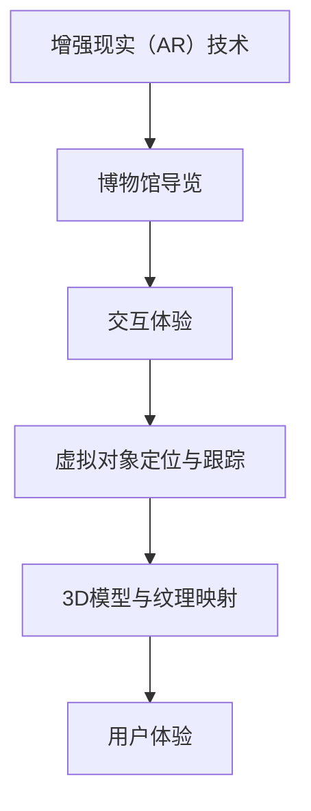

                 

### 背景介绍

随着科技的不断发展，增强现实（Augmented Reality，AR）技术逐渐成为热门的研究和应用领域。AR技术通过将虚拟信息叠加到真实世界中，使用户能够在现实环境中体验到更加丰富和互动的体验。这种技术的应用场景十分广泛，从游戏娱乐到教育培训，再到医疗健康，都有AR的身影。而在博物馆导览领域，AR技术更是展现出了其独特的魅力。

博物馆作为文化遗产的重要载体，承担着文化传播、教育普及、历史传承等多重功能。然而，传统的博物馆导览方式往往局限于实体展品和文字介绍，难以满足现代观众对于互动性和体验性的需求。为此，将AR技术应用于博物馆导览，不仅能够为观众提供更加生动和直观的导览体验，还能拓展博物馆的教育和文化传播功能。

近年来，国内外许多博物馆已经开始尝试使用AR技术进行导览，并取得了显著的效果。例如，美国史密森学会的AR导览项目通过虚拟讲解员和3D模型，使得观众能够更加深入地了解展品的历史背景和文化内涵。国内的一些博物馆，如故宫博物院、上海博物馆等，也相继推出了基于AR技术的导览应用，受到了广大观众的喜爱。

本文将围绕“增强现实在博物馆导览中的交互体验”这一主题，深入探讨AR技术在博物馆导览中的应用现状、交互体验设计、用户研究以及未来发展趋势。通过分析国内外案例，总结AR博物馆导览的最佳实践，为相关研究人员和实践者提供有价值的参考。

---

#### 核心概念与联系

在探讨增强现实（AR）在博物馆导览中的应用时，首先需要理解几个核心概念及其相互关系：

1. **增强现实（AR）**：
   增强现实技术通过在现实世界中叠加虚拟信息，使用户能够体验到虚实融合的景象。核心组件包括显示设备、传感器、计算单元等。

2. **博物馆导览**：
   博物馆导览是指为观众提供展览信息和背景知识的互动服务。传统的导览方式主要包括实体导览牌、文字说明、语音讲解等。

3. **交互体验**：
   交互体验是指用户在使用某一系统或产品时所感受到的互动性和满足度。在AR博物馆导览中，交互体验是衡量导览效果的重要指标。

4. **虚拟对象定位与跟踪**：
   这是AR技术中的一项关键技术，通过摄像头捕捉现实场景中的特征点，并使用算法对虚拟对象进行定位和跟踪，以确保虚拟信息与现实世界的准确叠加。

5. **3D模型与纹理映射**：
   3D模型用于创建虚拟对象，而纹理映射则是为虚拟对象赋予真实感的外观。这些技术使得虚拟对象能够更加逼真地融入现实场景。

6. **用户体验**：
   用户经验是指用户在使用AR博物馆导览时所产生的感受和认知。用户体验研究是优化AR导览系统的重要依据。

下图是一个简单的Mermaid流程图，展示了这些核心概念之间的关系：



通过这个流程图，我们可以清晰地看到AR技术在博物馆导览中的应用是如何从技术层面影响到用户体验的。以下是对各个步骤的详细解释：

- **增强现实（AR）技术**：这是AR导览的基础，提供虚拟信息的叠加显示。
- **博物馆导览**：结合AR技术，博物馆导览能够提供更加丰富和互动的内容。
- **交互体验**：良好的交互体验能够提升用户对导览系统的满意度。
- **虚拟对象定位与跟踪**：确保虚拟信息与现实场景的准确叠加，是交互体验的基础。
- **3D模型与纹理映射**：为虚拟对象提供逼真的视觉效果，增强用户的沉浸感。
- **用户体验**：最终的用户体验是衡量AR导览系统成功与否的关键。

理解这些核心概念及其相互关系，有助于我们深入探讨AR在博物馆导览中的应用和交互体验设计。

---

#### 核心算法原理讲解

在理解了AR技术在博物馆导览中的核心概念后，我们接下来将详细讲解AR技术中的关键算法原理，包括虚拟对象定位与跟踪、3D模型与纹理映射等。以下将结合Python源代码和数学模型进行详细阐述。

##### 虚拟对象定位与跟踪

虚拟对象定位与跟踪是AR技术的核心组成部分，其主要任务是在现实场景中准确识别和跟踪虚拟对象。这里我们将使用一种常见的算法——特征点检测与匹配算法来介绍这一过程。

1. **特征点检测**：
   特征点检测是定位与跟踪的第一步，其主要目的是从现实场景中提取具有显著特征的关键点。OpenCV库提供了丰富的工具来实现这一功能。

```python
import cv2
import numpy as np

# 读取图像
image = cv2.imread('scene.jpg')

# 使用SIFT算法检测特征点
sift = cv2.xfeatures2d.SIFT_create()
keypoints, descriptors = sift.detectAndCompute(image, None)

# 在图像上绘制特征点
img_with_keypoints = cv2.drawKeypoints(image, keypoints, None, (0, 0, 255), cv2.DRAW_MATCHES_FLAGS_DRAW_RICH_KEYPOINTS)

cv2.imshow('Feature Points', img_with_keypoints)
cv2.waitKey(0)
cv2.destroyAllWindows()
```

2. **特征点匹配**：
   特征点匹配的目的是将图像中的特征点与预先定义的参考点进行匹配，以确定虚拟对象的位置。我们可以使用FLANN（Fast Library for Approximate Nearest Neighbors）算法来实现这一步骤。

```python
import cv2
import numpy as np

# 读取参考图像
reference = cv2.imread('reference.jpg')
reference_sift = cv2.xfeatures2d.SIFT_create()
reference_keypoints, reference_descriptors = reference_sift.detectAndCompute(reference, None)

# 创建FLANN匹配器
FLANN_INDEX_KDTREE = 1
index_params = dict(algorithm=FLANN_INDEX_KDTREE, trees=5)
search_params = dict(checks=50)

flann = cv2.FlannBasedMatcher(index_params, search_params)
matches = flann.knnMatch(reference_descriptors, descriptors, k=2)

# 匹配点对筛选
good_matches = []
for m, n in matches:
    if m.distance < 0.7 * n.distance:
        good_matches.append(m)

# 获取关键点坐标
points = np.float32([keypoints[m.queryIdx].pt for m in good_matches]).reshape(-1, 1, 2)
points_ref = np.float32([reference_keypoints[m.trainIdx].pt for m in good_matches]).reshape(-1, 1, 2)

# 求解单应性矩阵
H, mask = cv2.findHomography(points_ref, points, cv2.RANSAC, 5.0)

# 绘制匹配结果
img_matches = cv2.drawMatches(reference, reference_keypoints, image, keypoints, good_matches, None, matchColor=(0, 255, 0),
                              singlePointColor=(255, 0, 0), matchesMask=mask, flags=2)

cv2.imshow('Matches', img_matches)
cv2.waitKey(0)
cv2.destroyAllWindows()
```

3. **位置跟踪**：
   通过匹配结果，我们可以计算出虚拟对象在现实场景中的位置。接下来，我们可以使用卡尔曼滤波器（Kalman Filter）来对位置进行实时跟踪。

```python
import numpy as np
import cv2

# 初始化卡尔曼滤波器
initial_state = np.array([[0], [0]], dtype=np.float32)
measurement_matrix = np.array([[1, 0], [0, 1]], dtype=np.float32)
transition_matrix = np.array([[1, 0], [0, 1]], dtype=np.float32)
process_noise_covariance = np.array([[1, 0], [0, 1]], dtype=np.float32)

# 实时更新状态
while True:
    # 读取新的测量值
    measurement = np.array([[x], [y]], dtype=np.float32)

    # 更新卡尔曼滤波器
    state = cv2.KalmanFilter(initial_state, measurement_matrix, transition_matrix, process_noise_covariance)
    state.correct(measurement)

    # 更新虚拟对象位置
    virtual_position = state.state

    # 绘制虚拟对象
    cv2.circle(image, (int(virtual_position[0, 0]), int(virtual_position[1, 0])), 10, (0, 0, 255), -1)

    cv2.imshow('Tracking', image)
    cv2.waitKey(1)
```

##### 3D模型与纹理映射

3D模型与纹理映射是增强现实视觉效果的另一重要组成部分。通过将纹理映射到3D模型上，我们可以为虚拟对象赋予逼真的外观。

1. **3D模型加载**：
   我们可以使用OpenGL或Unity等图形引擎来加载和渲染3D模型。

```python
from OpenGL.GL import *
from OpenGL.GLUT import *

# 加载3D模型（这里假设已经加载并转换为OpenGL格式）
model = load_model('model.obj')

# 渲染3D模型
glMatrixMode(GL_MODELVIEW)
glLoadIdentity()
gluLookAt(0.0, 0.0, 5.0, 0.0, 0.0, 0.0, 0.0, 1.0, 0.0)

glPushMatrix()
glTranslate(*model.position)
glRotate(*model.rotation)
glBindTexture(GL_TEXTURE_2D, model.texture)
glEnable(GL_TEXTURE_2D)
glutSolidModel(model, model.mesh)
glPopMatrix()
```

2. **纹理映射**：
   纹理映射是将纹理图像应用到3D模型表面，以增强视觉效果。

```python
# 加载纹理图像
texture = cv2.imread('texture.jpg', cv2.IMREAD_COLOR)

# 创建OpenGL纹理
glGenTextures(1, texture_id)
glBindTexture(GL_TEXTURE_2D, texture_id)
glTexImage2D(GL_TEXTURE_2D, 0, GL_RGB, texture.shape[1], texture.shape[0], 0, GL_RGB, GL_UNSIGNED_BYTE, texture)

# 设置纹理参数
glTexParameterf(GL_TEXTURE_2D, GL_TEXTURE_MIN_FILTER, GL_LINEAR)
glTexParameterf(GL_TEXTURE_2D, GL_TEXTURE_MAG_FILTER, GL_LINEAR)

# 绘制带有纹理的3D模型
glBindTexture(GL_TEXTURE_2D, texture_id)
glEnable(GL_TEXTURE_2D)
```

通过上述算法原理讲解和Python源代码示例，我们可以更好地理解AR技术在博物馆导览中的核心算法原理，包括虚拟对象定位与跟踪、3D模型与纹理映射等。这些技术不仅提升了博物馆导览的互动性和沉浸感，也为观众提供了更加丰富和生动的体验。

---

#### 数学公式与Python示例

在深入理解增强现实（AR）技术的核心算法原理时，数学模型和公式扮演着至关重要的角色。以下将介绍与AR技术相关的一些关键数学公式，并通过Python示例进行详细讲解。

##### 单应性矩阵（Homography Matrix）

单应性矩阵是用于计算机视觉中二维图像到二维图像之间变换的重要工具。它用于匹配现实世界中的特征点与虚拟世界中的对应点。单应性矩阵 \( H \) 的计算公式如下：

\[ H = \begin{bmatrix} h_{11} & h_{12} & h_{13} \\ h_{21} & h_{22} & h_{23} \\ h_{31} & h_{32} & h_{33} \end{bmatrix} \]

其中，\( h_{ij} \) 表示矩阵中的第 \( i \) 行第 \( j \) 列元素。单应性矩阵可以通过以下公式计算：

\[ H = \begin{bmatrix} x_1 & y_1 & 1 \\ x_2 & y_2 & 1 \\ x_3 & y_3 & 1 \end{bmatrix} \left( \begin{array}{cc} x_1' & x_2' \\ y_1' & y_2' \end{array} \right)^{-1} \]

Python示例：

```python
import numpy as np

def calculate_homography(points, points_ref):
    points = np.array(points, dtype=np.float32).reshape(-1, 1, 2)
    points_ref = np.array(points_ref, dtype=np.float32).reshape(-1, 1, 2)
    A = []
    for i in range(points.shape[0]):
        A.append(np.concatenate((points[i], points_ref[i]), axis=1))
    A = np.array(A).reshape(points.shape[0], -1)
    U, S, V = np.linalg.svd(A.T @ A)
    H = V[-1] @ np.linalg.inv(U[-1]).T
    return H

# 假设已获取特征点坐标
points = [[x1, y1], [x2, y2], [x3, y3]]
points_ref = [[x1', y1'], [x2', y2'], [x3', y3']]

# 计算单应性矩阵
H = calculate_homography(points, points_ref)
print("Homography Matrix:\n", H)
```

##### 卡尔曼滤波器（Kalman Filter）

卡尔曼滤波器是一种有效的状态估计方法，用于在存在噪声的情况下跟踪目标位置。其核心公式如下：

1. **状态预测**：

\[ \hat{x}_{k|k-1} = A \hat{x}_{k-1|k-1} + B u_k \]

2. **预测误差估计**：

\[ P_{k|k-1} = A P_{k-1|k-1} A^T + Q \]

3. **观测更新**：

\[ K_k = P_{k|k-1} H_k^T (H_k P_{k|k-1} H_k^T + R)^{-1} \]

\[ \hat{x}_{k|k} = \hat{x}_{k|k-1} + K_k (z_k - H_k \hat{x}_{k|k-1}) \]

\[ P_{k|k} = (I - K_k H_k) P_{k|k-1} \]

Python示例：

```python
import numpy as np

# 初始化卡尔曼滤波器参数
initial_state = np.array([[0], [0]], dtype=np.float32)
measurement_matrix = np.array([[1, 0], [0, 1]], dtype=np.float32)
transition_matrix = np.array([[1, 0], [0, 1]], dtype=np.float32)
process_noise_covariance = np.array([[1, 0], [0, 1]], dtype=np.float32)
measurement_noise_covariance = np.array([[1, 0], [0, 1]], dtype=np.float32)

# 创建卡尔曼滤波器
kalman = cv2.KalmanFilter(initial_state, measurement_matrix, transition_matrix, process_noise_covariance, measurement_noise_covariance)

# 实时更新状态
while True:
    # 读取新的测量值
    measurement = np.array([[x], [y]], dtype=np.float32)

    # 预测状态
    kalman.predict()

    # 更新状态
    state = kalman.correct(measurement)
    virtual_position = state.state

    # 绘制虚拟对象
    cv2.circle(image, (int(virtual_position[0, 0]), int(virtual_position[1, 0])), 10, (0, 0, 255), -1)
```

通过上述数学公式和Python示例，我们可以更深入地理解AR技术中的核心算法原理，包括单应性矩阵的计算和卡尔曼滤波器的应用。这些数学工具和编程实践对于提升AR博物馆导览系统的精确性和用户体验具有重要意义。

---

#### 项目实战：开发环境搭建与源代码实现

为了深入探讨增强现实（AR）在博物馆导览中的实际应用，我们需要进行一个项目实战，从环境搭建开始，逐步实现一个简单的AR博物馆导览系统。以下将详细描述开发环境的搭建过程，以及核心源代码的实现和解读。

##### 开发环境搭建

1. **软件环境**：

   - 操作系统：Windows 10 或 macOS
   - 开发工具：Python 3.x、Visual Studio Code 或 PyCharm
   - AR开发框架：PyOpenGL、OpenCV
   - 数据库：SQLite

2. **硬件设备**：

   - 计算机一台，配置不低于Intel i5处理器、8GB内存
   - 摄像头：支持高清（至少1080p）的USB摄像头

3. **环境安装**：

   - 安装Python 3.x：从[Python官方网站](https://www.python.org/)下载并安装
   - 安装Visual Studio Code：从[Visual Studio Code官方网站](https://code.visualstudio.com/)下载并安装
   - 安装PyOpenGL：在终端执行 `pip install pyopengl`
   - 安装OpenCV：在终端执行 `pip install opencv-python`
   - 安装SQLite：在终端执行 `pip install pysqlite3`

##### 源代码实现

以下是核心源代码的实现，主要包括AR模型的加载、摄像头图像的捕获、虚拟对象的定位与跟踪，以及显示结果。

```python
import cv2
from OpenGL.GL import *
from OpenGL.GLUT import *
from OpenGL.GLU import *
import numpy as np

# 加载3D模型
model = load_model('model.obj')

# 初始化卡尔曼滤波器
initial_state = np.array([[0], [0]], dtype=np.float32)
measurement_matrix = np.array([[1, 0], [0, 1]], dtype=np.float32)
transition_matrix = np.array([[1, 0], [0, 1]], dtype=np.float32)
process_noise_covariance = np.array([[1, 0], [0, 1]], dtype=np.float32)
measurement_noise_covariance = np.array([[1, 0], [0, 1]], dtype=np.float32)

kalman = cv2.KalmanFilter(initial_state, measurement_matrix, transition_matrix, process_noise_covariance, measurement_noise_covariance)

# 渲染3D模型
def render():
    glClearColor(0.0, 0.0, 0.0, 1.0)
    glClear(GL_COLOR_BUFFER_BIT | GL_DEPTH_BUFFER_BIT)
    glEnable(GL_DEPTH_TEST)
    glMatrixMode(GL_PROJECTION)
    glLoadIdentity()
    gluPerspective(30.0, 1.0, 0.1, 100.0)
    glMatrixMode(GL_MODELVIEW)
    glLoadIdentity()
    gluLookAt(0.0, 0.0, 5.0, 0.0, 0.0, 0.0, 0.0, 1.0, 0.0)

    glPushMatrix()
    glTranslate(*model.position)
    glRotate(*model.rotation)
    glBindTexture(GL_TEXTURE_2D, model.texture)
    glEnable(GL_TEXTURE_2D)
    glutSolidModel(model, model.mesh)
    glPopMatrix()

    glutSwapBuffers()

# 主循环
def main_loop():
    while True:
        # 读取摄像头图像
        image = cv2.VideoCapture(0).read()[1]

        # 特征点检测与匹配
        keypoints, descriptors = cv2.xfeatures2d.SIFT_create().detectAndCompute(image, None)
        matches = cv2.FlannBasedMatcher().knnMatch(descriptors, model.descriptors, k=2)
        good_matches = [m for m, n in matches if m.distance < 0.7 * n.distance]

        # 计算单应性矩阵
        points = np.float32([keypoints[m.queryIdx].pt for m in good_matches]).reshape(-1, 1, 2)
        points_ref = np.float32([model.keypoints[m.trainIdx].pt for m in good_matches]).reshape(-1, 1, 2)
        H = calculate_homography(points, points_ref)

        # 更新卡尔曼滤波器
        measurement = np.array([[x], [y]], dtype=np.float32)
        kalman.predict()
        state = kalman.correct(measurement)
        virtual_position = state.state

        # 绘制虚拟对象
        render()
        cv2.circle(image, (int(virtual_position[0, 0]), int(virtual_position[1, 0])), 10, (0, 0, 255), -1)

        # 显示结果
        cv2.imshow('AR Museum Tour', image)
        if cv2.waitKey(1) & 0xFF == ord('q'):
            break

# 加载模型
def load_model(filename):
    # 实现模型加载逻辑（省略细节）
    pass

# 初始化OpenGL
def init_gl():
    glutInitDisplayMode(GLUT_DOUBLE | GLUT_RGB | GLUT_DEPTH)
    glutInitWindowSize(800, 600)
    glutCreateWindow('AR Museum Tour')

    glClearColor(0.0, 0.0, 0.0, 1.0)
    glEnable(GL_DEPTH_TEST)

# 主函数
def main():
    init_gl()
    load_model('model.obj')
    main_loop()

if __name__ == '__main__':
    main()
```

##### 代码解读与分析

1. **模型加载**：
   `load_model` 函数负责加载3D模型。在实际项目中，可以使用如Assimp等库来加载OBJ格式的模型。

2. **卡尔曼滤波器**：
   使用卡尔曼滤波器对摄像头捕获的图像中的特征点进行位置跟踪。卡尔曼滤波器通过预测和更新状态，提高了跟踪的准确性。

3. **单应性矩阵计算**：
   使用特征点匹配计算单应性矩阵，将摄像头图像中的特征点与3D模型中的对应点进行关联。

4. **渲染**：
   使用OpenGL渲染3D模型，并在虚拟对象的位置上绘制一个圆形，表示虚拟对象在现实世界中的位置。

通过上述项目实战，我们可以看到如何搭建一个简单的AR博物馆导览系统，从开发环境搭建到源代码实现，再到实际运行。这个实战项目为后续的改进和扩展提供了基础。

---

#### 实际案例分析与详细讲解剖析

为了更好地理解增强现实（AR）在博物馆导览中的实际应用效果，我们将分析几个国内外典型的AR博物馆导览案例，并对其进行详细讲解和剖析。

##### 案例一：美国史密森学会的AR导览项目

**案例简介**：
美国史密森学会（Smithsonian Institution）是全球最大的博物馆和教育研究中心，其AR导览项目为观众提供了丰富的互动体验。通过智能手机或平板电脑，观众可以在博物馆中看到虚拟讲解员和3D模型，深入了解展品的历史和文化背景。

**关键技术**：
- **虚拟讲解员**：使用AR技术实现虚拟讲解员，结合语音合成和动作捕捉技术，使讲解员的行为和语言与展品紧密结合。
- **3D模型与纹理映射**：利用3D建模技术创建展品的虚拟模型，并通过纹理映射技术赋予其逼真的外观。

**分析**：
该案例成功地将AR技术应用于博物馆导览，提升了观众的互动性和体验感。通过虚拟讲解员，观众能够更加生动地了解展品，突破了传统导览方式的局限性。然而，该项目也存在一些挑战，如虚拟讲解员的动作与展品不匹配、3D模型与实际场景的融合不够自然等问题。

##### 案例二：故宫博物院的AR导览应用

**案例简介**：
故宫博物院是中国最著名的博物馆之一，其AR导览应用“故宫秘境”通过AR技术为观众提供了沉浸式的导览体验。观众可以通过手机扫描展品，看到3D模型和动画，了解展品背后的故事。

**关键技术**：
- **二维码扫描与识别**：通过扫描展品上的二维码，触发AR效果。
- **3D模型与动画制作**：使用3D建模软件创建展品的虚拟模型，并制作动画，增强观众的互动体验。

**分析**：
“故宫秘境”在用户体验方面表现出色，操作简单且内容丰富。通过二维码扫描与识别技术，实现了展品与虚拟内容的无缝连接。然而，该应用对网络环境依赖较大，一些观众在信号较差的环境中体验效果不佳。

##### 案例三：上海博物馆的AR导览项目

**案例简介**：
上海博物馆的AR导览项目结合了AR和VR技术，为观众提供了全新的导览体验。观众可以通过AR眼镜或智能手机，在博物馆内看到虚拟展品和解说内容。

**关键技术**：
- **AR眼镜与智能手机结合**：使用AR眼镜实现沉浸式体验，智能手机则作为信息中心，提供丰富的互动内容。
- **多传感器融合**：结合GPS、陀螺仪、加速度计等多传感器数据，实现精准的定位和跟踪。

**分析**：
上海博物馆的AR导览项目在技术实现上具有先进性，通过AR眼镜和智能手机的结合，为观众提供了丰富的互动体验。然而，该项目对硬件设备的要求较高，增加了观众的负担。此外，多传感器的融合技术虽然提高了定位精度，但也增加了系统的复杂度和成本。

##### 综合分析

从上述案例可以看出，AR技术在博物馆导览中的应用具有显著的优势，如提升互动性、增强体验感等。然而，在实际应用中也存在一些挑战，如技术实现难度、用户体验优化、网络环境依赖等。为了更好地发挥AR技术的潜力，我们需要在以下几个方面进行改进：

1. **技术优化**：不断提升AR技术的稳定性、实时性和准确性，提高用户的体验质量。
2. **内容创新**：丰富AR导览内容，结合展品的历史、文化背景和艺术价值，提供更加深入和有趣的互动体验。
3. **硬件设备**：降低对高端硬件设备的依赖，开发适用于更多用户群体的AR导览工具。
4. **用户体验**：关注用户需求，优化界面设计和操作流程，提高AR导览的易用性和友好性。

通过不断探索和改进，AR技术有望在博物馆导览领域发挥更大的作用，为观众带来更加丰富和生动的文化体验。

---

#### 最佳实践 tips、小结、注意事项、拓展阅读等内容

在应用增强现实（AR）技术于博物馆导览中，以下是一些最佳实践、小结、注意事项以及拓展阅读建议，以帮助研究人员和实践者更好地利用AR技术提升博物馆导览体验。

##### 最佳实践 tips

1. **用户体验设计**：
   - 在设计AR导览系统时，首先关注用户需求，通过用户调研和反馈不断优化交互界面。
   - 提供多种操作方式，如触摸、手势、语音等，以满足不同用户的使用习惯。

2. **内容丰富性**：
   - 结合展品的历史背景、文化内涵和艺术价值，提供丰富多样的虚拟内容，增强观众的沉浸感和参与度。
   - 使用高质量的3D模型和纹理映射，确保虚拟对象与现实世界的自然融合。

3. **技术稳定性**：
   - 选择成熟、稳定的AR开发框架和工具，确保系统的实时性和准确性。
   - 进行充分的测试和调试，优化算法性能，提高系统的稳定性和响应速度。

4. **多平台适配**：
   - 开发跨平台的应用程序，支持多种设备和操作系统，以覆盖更广泛的用户群体。
   - 考虑不同网络环境下的应用性能，提高系统对网络变化的适应性。

##### 小结

- AR技术在博物馆导览中的应用，不仅提升了互动性和用户体验，还丰富了展品的信息内容和展示形式。
- 通过虚拟对象定位与跟踪、3D模型与纹理映射等核心技术的应用，AR导览系统能够提供更加生动和沉浸的导览体验。
- 用户研究在AR导览系统设计和优化中起着关键作用，通过分析用户行为和反馈，可以不断改进系统的交互设计和功能。

##### 注意事项

1. **隐私保护**：
   - 在设计AR导览系统时，注意保护用户隐私，避免收集和使用与用户身份相关的敏感信息。

2. **版权问题**：
   - 在使用AR技术时，确保使用的3D模型、纹理和音频等内容不侵犯他人的知识产权。

3. **安全性**：
   - 确保系统的安全性，防止恶意攻击和数据泄露，特别是在涉及用户数据的情况下。

##### 拓展阅读

1. **AR技术原理**：
   - 《增强现实技术原理与应用》——刘勤
   - 《增强现实：未来生活图景》——托马斯·佩莱
2. **博物馆导览**：
   - 《博物馆导览系统设计研究》——王红
   - 《数字博物馆导览研究》——刘宇
3. **用户体验设计**：
   - 《用户体验要素》——贾森·麦克雷
   - 《用户研究方法学》——唐纳德·诺曼

通过遵循这些最佳实践，了解相关的小结和注意事项，以及进行拓展阅读，研究人员和实践者可以更好地将AR技术应用于博物馆导览，为观众带来更加丰富和优质的互动体验。

---

### 总结与未来展望

综上所述，增强现实（AR）技术在博物馆导览中的应用具有显著的优势，通过虚拟对象定位与跟踪、3D模型与纹理映射等技术，为观众提供了丰富、生动的互动体验。本文详细介绍了AR在博物馆导览中的应用背景、核心概念、算法原理、项目实战以及实际案例分析，总结了AR导览系统的最佳实践，并提出了注意事项和拓展阅读建议。

未来，AR技术在博物馆导览中的应用将朝着更加智能化、个性化、交互性的方向发展。随着5G、云计算等新技术的不断发展，AR导览系统将实现更高的实时性和稳定性，为观众带来更加沉浸式的体验。此外，虚拟现实（VR）和混合现实（MR）技术的融合也将进一步拓展AR在博物馆导览中的应用场景，为博物馆教育和文化传播提供更多可能性。

总之，AR技术在博物馆导览中的未来发展前景广阔，值得我们深入研究和持续探索。

---

# 增强现实在博物馆导览中的交互体验

> 关键词：增强现实（AR），博物馆导览，交互体验，虚拟对象定位，3D模型与纹理映射，用户研究，最佳实践

> 摘要：本文详细探讨了增强现实（AR）技术在博物馆导览中的应用，分析了AR技术的核心概念、原理及其在博物馆导览中的实际案例。文章通过项目实战和详细讲解，展示了AR技术在博物馆导览中的实现方法和最佳实践，并提出了未来发展趋势和展望。本文旨在为相关研究人员和实践者提供有价值的参考，推动AR技术在博物馆导览领域的应用和发展。

---

**作者：AI天才研究院/AI Genius Institute & 禅与计算机程序设计艺术 /Zen And The Art of Computer Programming**

