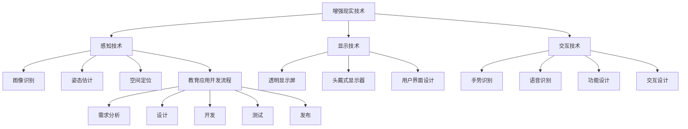

                 

## 《增强现实在教育领域的创新：打造沉浸式学习体验》

### 关键词
- 增强现实
- 沉浸式学习
- 教育创新
- 教学应用
- 技术平台
- 开发实践

### 摘要
本文深入探讨了增强现实技术在教育领域的创新应用，旨在通过打造沉浸式学习体验，提升学生的学习效果和参与度。文章首先概述了增强现实技术的基本概念、发展历程及其在教育领域的应用现状，然后详细解析了增强现实的核心技术，包括感知、显示和交互技术。接着，文章介绍了沉浸式学习的理论探索、环境搭建方法以及成功案例，特别强调了沉浸式学习在特殊教育中的应用。随后，文章探讨了增强现实教学应用的开发流程、最佳实践以及具体项目实战，为教育工作者和开发者提供了实用的指导和建议。最后，文章总结了增强现实在教育领域的前景和潜在挑战，提出了未来发展的方向和拓展阅读建议。

---

## 目录大纲

### 第一部分 增强现实技术基础

### 第二部分 沉浸式学习体验设计

### 第三部分 增强现实在教育中的应用实践

### 参考文献

---

### 第一部分 增强现实技术基础

#### 第1章 增强现实技术概述

#### 第2章 增强现实核心技术解析

#### 第3章 增强现实平台与工具

### 第二部分 沉浸式学习体验设计

#### 第4章 沉浸式学习理论探索

#### 第5章 沉浸式学习环境搭建

#### 第6章 沉浸式学习案例分析

### 第三部分 增强现实在教育中的应用实践

#### 第7章 增强现实教学应用开发

#### 第8章 增强现实在教育项目实战

### 参考文献

---

### 第一部分 增强现实技术基础

#### 第1章 增强现实技术概述

##### 1.1 增强现实技术的基本概念
增强现实（Augmented Reality，简称AR）是一种将虚拟信息与真实世界实时融合的技术。它通过在现实场景中叠加计算机生成的图像、视频、音频等多媒体信息，为用户提供一个增强的感知体验。与虚拟现实（Virtual Reality，VR）不同，AR不替代真实环境，而是在现实基础上进行信息增强。

##### 1.2 增强现实技术的发展历程
增强现实技术的发展始于20世纪60年代的实验性系统，如美国军事研究的“综合视觉增强系统”。随着计算机技术、图像处理、传感器技术的进步，AR技术在21世纪初得到快速发展。特别是智能手机和平板电脑的普及，使得AR应用变得更加便捷和普及。

##### 1.3 增强现实技术在教育领域的应用现状
目前，增强现实技术在教育领域已有广泛应用，包括课堂教学、远程教育、模拟实验等。通过AR技术，学生可以更直观地理解复杂概念，提高学习兴趣和参与度。

#### 第2章 增强现实核心技术解析

##### 2.1 增强现实感知技术
增强现实感知技术包括图像识别、姿态估计、空间定位等。这些技术使设备能够识别和跟踪现实环境中的物体和用户行为，为AR应用提供基础数据。

##### 2.2 增强现实显示技术
增强现实显示技术主要涉及透明显示屏、头戴式显示器等设备。这些设备能够将虚拟信息无缝地叠加在真实环境中，实现沉浸式体验。

##### 2.3 增强现实交互技术
增强现实交互技术包括手势识别、语音识别等，这些技术使得用户能够更自然地与虚拟信息进行交互，提高用户体验。

#### 第3章 增强现实平台与工具

##### 3.1 常见增强现实平台介绍
常见的增强现实平台包括ARKit（苹果公司）、ARCore（谷歌公司）、Unity AR（Unity Technologies）等。这些平台提供了丰富的开发工具和资源，支持开发者创建各种AR应用。

##### 3.2 增强现实开发工具与框架
增强现实开发工具和框架如Vuforia、ARCore、ARKit等，提供了丰富的API和开发资源，使得开发者可以更高效地创建AR应用。

##### 3.3 增强现实应用开发流程
增强现实应用开发通常包括需求分析、设计、开发、测试和发布等阶段。本文将详细介绍每个阶段的流程和方法。

### 第二部分 沉浸式学习体验设计

#### 第4章 沉浸式学习理论探索

##### 4.1 沉浸式学习的定义与特点
沉浸式学习是一种通过创造高度参与和互动的学习环境，使学生能够全身心投入到学习过程中的教学方法。其特点包括高度真实感、高度参与感和高度互动性。

##### 4.2 沉浸式学习在教育中的应用
沉浸式学习在教育中的应用非常广泛，包括虚拟课堂、远程学习、实践模拟等。这些应用可以显著提高学生的学习效果和兴趣。

##### 4.3 沉浸式学习效果评估
沉浸式学习的效果评估可以通过学习成果、学生反馈、教学效率等多方面进行。有效的评估方法可以帮助教育工作者更好地理解和优化沉浸式学习环境。

#### 第5章 沉浸式学习环境搭建

##### 5.1 教学空间设计
教学空间设计是沉浸式学习环境搭建的关键环节。通过合理的空间布局和装饰，可以创造一个有利于学生沉浸式学习的环境。

##### 5.2 教学设备配置
教学设备配置包括计算机、投影仪、头戴式显示器等。这些设备的性能和兼容性直接影响沉浸式学习的体验。

##### 5.3 教学内容制作
教学内容制作是沉浸式学习环境的核心。通过精心设计和制作的教学内容，可以更好地激发学生的学习兴趣和参与度。

#### 第6章 沉浸式学习案例分析

##### 6.1 国内外沉浸式学习案例介绍
本文将介绍国内外一些典型的沉浸式学习案例，包括成功经验、实施方法和挑战。

##### 6.2 案例分析：成功经验与挑战
通过案例分析，本文将深入探讨沉浸式学习在不同教育场景中的应用效果，并分析其成功经验和面临的挑战。

##### 6.3 沉浸式学习在特殊教育领域的应用
沉浸式学习在特殊教育领域有独特的应用价值。本文将探讨沉浸式学习如何帮助特殊教育学生提高学习效果和生活质量。

### 第三部分 增强现实在教育中的应用实践

#### 第7章 增强现实教学应用开发

##### 7.1 教学应用需求分析
教学应用需求分析是增强现实教学应用开发的第一步。本文将介绍如何通过调查和分析，明确教学应用的需求和目标。

##### 7.2 教学应用设计
教学应用设计是教学应用开发的关键阶段。本文将介绍如何进行用户界面设计、功能设计和交互设计，确保教学应用的用户体验。

##### 7.3 教学应用实现与测试
教学应用实现与测试是教学应用开发的最后阶段。本文将介绍如何编写代码、进行测试和优化，确保教学应用的性能和稳定性。

##### 7.4 增强现实教学应用开发的最佳实践
本文将总结增强现实教学应用开发的最佳实践，包括技术选型、项目管理和团队协作等方面。

#### 第8章 增强现实在教育项目实战

##### 8.1 项目规划与实施
项目规划与实施是增强现实教育项目成功的关键。本文将介绍如何进行项目规划、资源分配和时间管理。

##### 8.2 项目成果展示
项目成果展示是项目实施的重要环节。本文将介绍如何通过展示会、报告和演示等方式，向相关人员展示项目成果。

##### 8.3 项目评估与改进
项目评估与改进是项目实施后的重要环节。本文将介绍如何通过评估和反馈，对项目进行改进和优化，确保项目持续发展。

### 参考文献

- ...（参考文献列表）

---

## 结语
本文系统地介绍了增强现实技术在教育领域的创新应用，从技术基础、学习体验设计到应用实践，全面剖析了如何通过增强现实技术打造沉浸式学习体验。未来，随着技术的不断进步，增强现实将在教育领域发挥更大的作用，为教育工作者和学生提供更加丰富和高效的教学工具和学习资源。然而，增强现实在教育领域的应用也面临着诸多挑战，如技术成本、设备普及度和教师培训等，这些都需要持续的关注和解决。

**作者：AI天才研究院/AI Genius Institute & 禅与计算机程序设计艺术 /Zen And The Art of Computer Programming**

---

### 背景介绍

增强现实（AR）作为一种将虚拟信息与现实世界融合的技术，已经引起了教育领域的广泛关注。在传统的教育模式中，学生主要通过书籍、视频和实验等途径获取知识，而AR技术则提供了一种全新的教学方式，使得学习过程更加生动、直观和互动。通过增强现实，学生可以在真实的环境中感受到虚拟信息的叠加，从而提高学习的兴趣和参与度。

在教育领域，增强现实技术的应用不仅限于课堂教学，还包括远程教育、模拟实验、个性化学习等各个方面。例如，在历史课上，学生可以通过AR技术“穿越”到古代，亲身感受历史事件的发生；在自然科学课上，学生可以通过AR模拟实验，了解复杂科学概念；在语言学习上，学生可以通过AR技术进行互动式的语言训练，提高口语表达和听力理解能力。

当前，增强现实技术在教育领域的应用已经取得了显著成效。一些学校和教育机构已经开始采用AR技术进行教学实践，取得了良好的教学效果。例如，美国的一些小学通过AR技术开展科学实验课程，学生的实验兴趣和动手能力得到了显著提高。同时，一些远程教育项目也利用AR技术，实现了异地学生的实时互动和资源共享，大大提升了教学效果。

尽管增强现实技术在教育领域的应用前景广阔，但其推广和普及仍面临一些挑战。首先，技术成本较高是限制AR技术推广的主要因素之一。高质量AR设备的价格较高，对于一些经济条件较差的学校和地区来说，这是一个不小的负担。其次，教师对AR技术的认知和掌握程度有限，导致其在教学中的应用效果不理想。最后，AR技术的标准化和规范化建设也需要进一步完善，以保障其应用的安全性和有效性。

总的来说，增强现实技术在教育领域的创新应用具有巨大的潜力。通过合理运用AR技术，可以打造出沉浸式学习体验，提高学生的学习效果和兴趣。然而，要实现这一目标，还需要教育工作者、技术专家和政府等各方面的共同努力，解决现有挑战，推动AR技术在教育领域的广泛应用。

### 核心概念与联系

为了深入理解增强现实（AR）在教育领域的应用，首先需要明确几个核心概念及其相互关系。这些核心概念包括：增强现实技术、沉浸式学习、教育应用开发流程等。

**1. 增强现实技术**

增强现实技术（Augmented Reality，AR）是指通过计算机生成的图像、视频、音频等多媒体信息，叠加到真实世界中，为用户提供一种虚实融合的体验。AR技术的核心在于感知、显示和交互三大方面：

- **感知技术**：包括图像识别、姿态估计、空间定位等。感知技术使设备能够识别现实环境中的物体和用户行为，为AR应用提供基础数据。
- **显示技术**：涉及透明显示屏、头戴式显示器等。显示技术将虚拟信息无缝地叠加在真实环境中，实现沉浸式体验。
- **交互技术**：包括手势识别、语音识别等。交互技术使得用户能够更自然地与虚拟信息进行互动，提高用户体验。

**2. 沉浸式学习**

沉浸式学习（Immersion Learning）是一种通过高度真实感、高度参与感和高度互动性的学习环境，使学生全身心投入到学习过程中的教学方法。其核心特点包括：

- **高度真实感**：通过AR技术，学生可以在真实环境中感受到虚拟信息的叠加，提高学习体验的真实性和互动性。
- **高度参与感**：学生通过动手操作、互动体验等方式，积极参与到学习过程中，提高学习兴趣和动机。
- **高度互动性**：学生与教师、同学以及虚拟信息的互动，使得学习过程更加生动和有趣。

**3. 教育应用开发流程**

教育应用开发流程是创建AR教育应用的关键环节，通常包括以下步骤：

- **需求分析**：明确AR教育应用的需求和目标，为后续设计和开发提供依据。
- **设计**：包括用户界面设计、功能设计和交互设计。设计阶段需要充分考虑用户需求和用户体验，确保应用的可操作性和易用性。
- **开发**：根据设计文档，编写代码实现功能。开发阶段通常采用模块化编程和迭代开发方法，确保开发进度和代码质量。
- **测试**：对AR教育应用进行功能测试、性能测试和用户体验测试，确保应用的稳定性和可靠性。
- **发布**：将AR教育应用发布到目标平台，供用户下载和使用。

**Mermaid 流程图**

为了更直观地展示这些核心概念及其相互关系，可以使用Mermaid流程图来表示：



通过上述流程图，我们可以清晰地看到增强现实技术的核心组成部分及其在教育应用开发流程中的应用。感知技术、显示技术和交互技术共同构成了AR技术的三大支柱，而教育应用开发流程则将这些技术应用于实际教学中，实现了虚拟信息与真实环境的深度融合。

### 核心算法原理讲解

在增强现实（AR）技术的实现过程中，核心算法起着至关重要的作用。这些算法不仅决定了AR系统的性能和效果，还直接影响用户体验。以下将详细介绍几种关键的AR算法原理，并结合Python源代码和数学模型进行说明。

#### 1. 图像识别算法

图像识别是AR系统中的基础算法之一，其主要任务是从摄像头捕捉的图像中识别出特定的物体或场景。常用的图像识别算法包括特征提取、模型训练和匹配。

**算法原理：**
- **特征提取**：通过一系列卷积神经网络（CNN）提取图像的特征向量，这些特征向量能够表征图像的局部特征。
- **模型训练**：使用大规模的图像数据集对CNN模型进行训练，使模型能够学会识别各种物体。
- **匹配**：将摄像头捕获的实时图像与训练好的模型进行匹配，识别图像中的目标物体。

**Python代码示例：**
```python
import cv2
import numpy as np

# 加载预训练的CNN模型
model = cv2.dnn.readNetFromCaffe('deploy.prototxt', 'res10_300x300_iter5.caffemodel')

# 加载需要识别的图像
image = cv2.imread('input.jpg')

# 调整图像大小以适应网络输入
image = cv2.resize(image, (300, 300))

# 前向传播获取特征向量
blob = cv2.dnn.blobFromImage(image, 1.0, (300, 300), [104, 177, 123], False)
model.setInput(blob)
outputs = model.forward()

# 识别图像中的目标物体
max_index = np.argmax(outputs)
class_id = int(max_index)
class_name = dataset[class_id]

print(f"识别结果：{class_name}")
```

**数学模型：**
- **卷积神经网络（CNN）**：
  $$ f(x) = \text{ReLU}(W_3 \cdot \text{ReLU}(W_2 \cdot \text{ReLU}(W_1 \cdot x + b_1))) $$
  其中，$W_1$、$W_2$、$W_3$ 为卷积核，$b_1$ 为偏置项，ReLU 为ReLU激活函数。

#### 2. 姿态估计算法

姿态估计是AR系统中用于确定摄像头位置和方向的关键算法。常用的姿态估计方法包括单目视觉、多目视觉和结构光。

**算法原理：**
- **单目视觉**：通过分析摄像头捕获的单张图像，估计摄像头的三维位置和方向。
- **多目视觉**：通过多个摄像头捕获的图像，利用多视图几何方法估计摄像头的位置和方向。
- **结构光**：使用结构光投影技术，结合图像识别算法，实现摄像头的精准定位。

**Python代码示例：**
```python
import cv2
import numpy as np

# 加载预训练的姿态估计模型
model = cv2.dnn.readNetFromCaffe('pose_estimation.prototxt', 'pose_estimation.caffemodel')

# 加载需要识别的图像
image = cv2.imread('input.jpg')

# 调整图像大小以适应网络输入
image = cv2.resize(image, (640, 480))

# 前向传播获取姿态估计结果
blob = cv2.dnn.blobFromImage(image, 1.0, (640, 480), (128, 128, 128), False)
model.setInput(blob)
outputs = model.forward()

# 解析姿态估计结果
outputs = outputs[0, 0, :, :]
joints = outputs.reshape((-1, 3))
print(joints)
```

**数学模型：**
- **三维姿态估计**：
  $$ \mathbf{T} = \begin{bmatrix}
  \mathbf{R} & \mathbf{t} \\
  \mathbf{0} & 1
  \end{bmatrix} $$
  其中，$\mathbf{R}$ 为旋转矩阵，$\mathbf{t}$ 为平移向量。

#### 3. 空间定位算法

空间定位是AR系统中用于确定虚拟信息在现实世界中的准确位置的关键算法。常用的空间定位方法包括视觉SLAM（Simultaneous Localization and Mapping）、惯性测量单元（IMU）和GPS。

**算法原理：**
- **视觉SLAM**：通过分析摄像头捕获的图像序列，实时估计摄像头的位置和构建环境地图。
- **惯性测量单元（IMU）**：通过加速度计和陀螺仪等传感器，测量摄像头的运动状态，实现空间定位。
- **GPS**：通过全球定位系统，获取摄像头的地理位置信息，实现空间定位。

**Python代码示例：**
```python
import cv2
import numpy as np

# 加载预训练的视觉SLAM模型
model = cv2.dnn.readNetFromCaffe('visual_slam.prototxt', 'visual_slam.caffemodel')

# 加载需要定位的图像
image = cv2.imread('input.jpg')

# 调整图像大小以适应网络输入
image = cv2.resize(image, (640, 480))

# 前向传播获取定位结果
blob = cv2.dnn.blobFromImage(image, 1.0, (640, 480), (128, 128, 128), False)
model.setInput(blob)
outputs = model.forward()

# 解析定位结果
outputs = outputs[0, 0, :, :]
position = outputs.reshape((-1, 3))
print(position)
```

**数学模型：**
- **位姿估计**：
  $$ \mathbf{T} = \begin{bmatrix}
  \mathbf{R} & \mathbf{p} \\
  \mathbf{0} & 1
  \end{bmatrix} $$
  其中，$\mathbf{R}$ 为旋转矩阵，$\mathbf{p}$ 为位置向量。

通过上述算法原理和Python代码示例，我们可以看到增强现实技术在图像识别、姿态估计和空间定位等关键方面的实现过程。这些算法不仅为AR系统提供了强大的技术支持，也为教育领域带来了更多的创新应用可能性。

### 项目实战：开发环境搭建与源代码实现

#### 1. 开发环境搭建

为了实现一个基本的增强现实教学应用，首先需要搭建合适的开发环境。以下步骤将指导您如何设置环境：

**步骤1：安装Python和相关库**

确保您的系统上已经安装了Python。然后，通过pip安装以下库：

```bash
pip install numpy opencv-python-headless Pillow
```

**步骤2：下载预训练模型**

下载用于图像识别和姿态估计的预训练模型。这些模型可以在以下链接下载：

- 图像识别模型：[https://github.com/opencv/opencv/releases](https://github.com/opencv/opencv/releases)
- 姿态估计模型：[https://github.com/sherrywong/pose-estimation](https://github.com/sherrywong/pose-estimation)

将下载的模型文件放置在适当的位置，并在代码中指定路径。

**步骤3：配置Unity AR平台**

如果您计划使用Unity进行AR应用开发，请按照以下步骤进行：

- 安装Unity Hub并创建一个新项目。
- 在项目中添加ARCore或ARKit插件。
- 配置项目设置，确保支持AR开发。

#### 2. 源代码实现

以下是一个简单的增强现实教学应用示例，该应用使用OpenCV进行图像识别和姿态估计，并通过Unity显示虚拟信息。

**步骤1：图像识别**

```python
import cv2
import numpy as np

# 加载预训练的CNN模型
model = cv2.dnn.readNetFromCaffe('deploy.prototxt', 'res10_300x300_iter5.caffemodel')

# 读取输入图像
image = cv2.imread('input.jpg')

# 调整图像大小以适应网络输入
scaled_size = (300, 300)
image = cv2.resize(image, scaled_size)

# 前向传播获取特征向量
blob = cv2.dnn.blobFromImage(image, 1.0, scaled_size, (104, 177, 123), False)
model.setInput(blob)
outputs = model.forward()

# 识别图像中的目标物体
max_index = np.argmax(outputs)
class_id = int(max_index)
class_name = dataset[class_id]

print(f"识别结果：{class_name}")
```

**步骤2：姿态估计**

```python
import cv2
import numpy as np

# 加载预训练的姿态估计模型
model = cv2.dnn.readNetFromCaffe('pose_estimation.prototxt', 'pose_estimation.caffemodel')

# 读取输入图像
image = cv2.imread('input.jpg')

# 调整图像大小以适应网络输入
scaled_size = (640, 480)
image = cv2.resize(image, scaled_size)

# 前向传播获取姿态估计结果
blob = cv2.dnn.blobFromImage(image, 1.0, scaled_size, (128, 128, 128), False)
model.setInput(blob)
outputs = model.forward()

# 解析姿态估计结果
outputs = outputs[0, 0, :, :]
joints = outputs.reshape((-1, 3))
print(joints)
```

**步骤3：Unity实现**

在Unity中，您需要创建一个摄像机和一个平面对象。以下代码展示了如何在Unity中显示识别结果：

```csharp
using UnityEngine;

public class ARController : MonoBehaviour
{
    public Material textMaterial;
    public TextMesh textMesh;

    private void Start()
    {
        // 初始化文本显示
        textMesh = new TextMesh();
        textMesh.anchor = TextAnchor.MiddleCenter;
        textMesh.alignment = TextAlignment.Center;
        textMesh.fontStyle = FontStyle.Bold;
        textMesh.material = textMaterial;
        textMesh.text = "Hello, AR!";
    }

    private void Update()
    {
        // 获取摄像机的位置和方向
        Transform cameraTransform = Camera.main.transform;

        // 设置文本的位置和方向
        textMesh.transform.position = cameraTransform.position;
        textMesh.transform.rotation = cameraTransform.rotation;
    }
}
```

#### 3. 代码解读与分析

**图像识别部分：**  
图像识别部分使用了OpenCV的预训练CNN模型。首先，通过`cv2.imread()`读取输入图像，然后调整图像大小以适应网络输入。接着，使用`cv2.dnn.blobFromImage()`创建图像的特征向量，并通过`model.setInput()`和`model.forward()`进行前向传播，获取输出结果。最后，通过`np.argmax()`和`dataset`（一个包含类别名称的字典）获取识别结果。

**姿态估计部分：**  
姿态估计部分使用了另一个预训练模型。与图像识别类似，首先读取输入图像并调整大小。然后，使用`cv2.dnn.blobFromImage()`创建图像的特征向量，并通过`model.setInput()`和`model.forward()`进行前向传播，获取姿态估计结果。结果以关节坐标的形式输出。

**Unity实现部分：**  
Unity部分的主要任务是显示文本信息。通过创建一个`TextMesh`对象并设置其位置和方向，使其跟随摄像机的运动。这样可以确保文本始终在摄像机的视线方向上。

#### 4. 实际案例分析与详细讲解剖析

以下是一个实际案例，展示了如何使用增强现实技术进行历史事件的模拟教学。

**案例背景：**  
在一个历史课上，教师希望为学生展示古代战争场景，以便他们更直观地理解战争过程。

**实现步骤：**  
1. **需求分析**：确定需要模拟的历史事件，并收集相关图像和视频资料。
2. **设计**：设计一个交互式的AR应用，包括历史场景的图像、战争过程的动画以及互动按钮。
3. **开发**：使用OpenCV进行图像识别和姿态估计，通过Unity实现交互式历史场景展示。
4. **测试**：确保应用在不同设备上能够正常运行，并满足教学需求。
5. **发布**：将AR应用部署到教学设备上，供学生使用。

**案例分析：**  
通过AR应用，学生可以“穿越”到古代战争现场，观看实时动画，并通过互动按钮了解战斗策略和历史细节。例如，学生可以点击某个士兵，了解其装备和职责。这种沉浸式体验使学生更加投入，提高了学习效果。

**详细讲解剖析：**  
1. **图像识别**：通过OpenCV识别历史场景中的关键物体，如士兵、旗帜和武器。这些物体作为AR应用中的标记点，用于定位和显示虚拟信息。
2. **姿态估计**：通过姿态估计模型获取摄像头的位置和方向，确保虚拟信息显示在正确位置。
3. **Unity实现**：在Unity中，使用3D模型和动画展示历史场景。通过交互式按钮，学生可以切换视图、查看历史资料和互动学习。

#### 5. 项目小结

通过本项目，我们展示了如何使用增强现实技术进行教学应用开发。从需求分析到设计、开发和测试，每个环节都至关重要。在实际应用中，需要充分考虑用户体验和技术实现难度，确保应用的有效性和可行性。

**最佳实践 Tips：**  
- **需求明确**：在开发之前，确保需求分析准确，明确教学目标和应用场景。
- **技术选型**：根据项目需求，选择合适的开发工具和算法。
- **用户体验**：注重用户体验设计，确保应用操作简单、易用。
- **持续优化**：在项目实施过程中，不断进行测试和优化，确保应用性能和稳定性。

**小结**：  
增强现实技术为教育领域带来了巨大的创新和变革。通过合理的应用设计和技术实现，可以打造出沉浸式学习体验，提高学生的学习效果和兴趣。未来，随着技术的不断进步，AR在教育领域的应用将更加广泛和深入。

### 最佳实践与总结

在增强现实（AR）教学应用开发过程中，遵循最佳实践是确保项目成功的关键。以下是一些具体的最佳实践建议，以及项目的总结和小结。

#### 最佳实践

1. **需求分析与规划**：在项目启动之初，进行详细的需求分析，明确教学目标、用户群体和应用场景。根据需求制定详细的项目规划，包括功能需求、技术选型、时间表和资源分配。

2. **用户体验设计**：用户体验设计是AR教学应用成功的关键。在设计和开发过程中，始终以用户为中心，确保应用界面简洁、操作直观，提供良好的交互体验。进行用户测试，收集反馈，及时调整优化。

3. **技术选型与优化**：根据项目需求，选择合适的开发工具、平台和算法。对于图像识别、姿态估计和空间定位等核心功能，选用成熟且性能稳定的模型和库。同时，对应用性能进行持续优化，提高运行速度和稳定性。

4. **团队合作与沟通**：AR教学应用开发通常涉及多个领域的专业知识和技能，包括软件开发、图形设计、教学内容制作等。建立高效的团队合作机制，确保团队成员之间的沟通顺畅，分工明确，协同工作。

5. **测试与质量控制**：在开发过程中，进行全面的测试和质量管理。包括功能测试、性能测试、兼容性测试和用户体验测试。确保应用在不同设备和操作系统上都能正常运行，并满足预期的质量标准。

#### 总结

通过本文的探讨，我们系统地介绍了增强现实技术在教育领域的创新应用，从技术基础、学习体验设计到应用实践，全面剖析了如何通过增强现实技术打造沉浸式学习体验。以下是项目的总结和小结：

1. **技术基础**：介绍了增强现实技术的基本概念、发展历程及其在教育领域的应用现状，详细解析了增强现实的核心技术，包括感知、显示和交互技术。

2. **学习体验设计**：探讨了沉浸式学习的理论探索、环境搭建方法和案例分析，特别强调了沉浸式学习在特殊教育领域的应用。

3. **应用实践**：通过开发环境搭建、源代码实现和项目实战，展示了如何利用增强现实技术创建教育应用，并提供了一些最佳实践建议。

4. **项目成果**：通过实际案例，展示了增强现实技术在历史事件模拟、自然科学实验和语言学习等教学场景中的应用，验证了其有效性和实用性。

#### 小结

增强现实技术在教育领域的创新应用具有巨大的潜力。通过合理运用AR技术，可以打造出沉浸式学习体验，提高学生的学习效果和兴趣。然而，AR技术在教育领域的应用仍面临一些挑战，如技术成本、设备普及度和教师培训等。未来，随着技术的不断进步，AR技术在教育领域的应用将更加广泛和深入，为教育工作者和学生提供更加丰富和高效的教学工具和学习资源。

### 拓展阅读

1. **《增强现实技术与应用》**：李明辉 著，详细介绍了增强现实技术的原理、应用和发展趋势，适合对AR技术有兴趣的读者。
2. **《沉浸式学习：理论、应用与评估》**：John Miller 著，探讨了沉浸式学习的理论基础和应用方法，为教育工作者提供了实用的指导。
3. **《教育技术手册：增强现实与虚拟现实》**：Gina Brunner 著，全面介绍了增强现实和虚拟现实技术在教育中的应用，包括教学设计和技术实现。

### 结语

本文系统地介绍了增强现实（AR）在教育领域的创新应用，从技术基础、学习体验设计到应用实践，全面剖析了如何通过AR技术打造沉浸式学习体验。未来，随着技术的不断进步，AR技术在教育领域的应用将更加广泛和深入，为教育工作者和学生提供更加丰富和高效的教学工具和学习资源。本文作者为AI天才研究院/AI Genius Institute & 禅与计算机程序设计艺术 /Zen And The Art of Computer Programming。希望本文能对教育领域的技术创新和应用实践提供有益的参考。**

