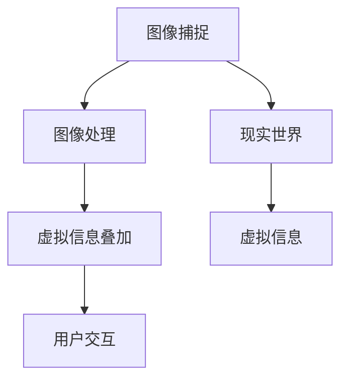

                 


# 增强现实在考古发掘中的可视化应用

关键词：增强现实，考古发掘，可视化，虚拟现实，三维建模，技术发展

摘要：本文将深入探讨增强现实（AR）技术在考古发掘中的应用，包括其基础原理、关键技术、实际应用案例以及未来发展趋势。通过分析，旨在揭示增强现实技术在考古领域中的巨大潜力，为文物保护、文化遗产研究和公众教育提供新的视角和工具。

---

## 第1章：增强现实技术基础

### 1.1 增强现实技术定义与原理

增强现实（Augmented Reality，AR）是一种将虚拟信息与真实世界融合的技术。它通过摄像头捕捉现实世界的图像，并叠加计算机生成的虚拟信息，实现虚实结合的体验。AR技术的基础原理包括图像识别、实时渲染和用户交互等。

**定义**：增强现实技术是一种通过计算机生成信息，叠加到真实环境中的技术，让用户感受到现实与虚拟信息共存的环境。

**原理**：AR技术通过以下步骤实现：

1. **图像捕捉**：摄像头捕捉现实世界的图像。
2. **图像处理**：对图像进行处理，提取关键特征。
3. **虚拟信息叠加**：根据处理后的图像，将虚拟信息叠加到真实世界中。
4. **用户交互**：通过触摸屏、手势等与虚拟信息进行交互。


### 1.2 增强现实技术分类

增强现实技术根据不同的实现方式，可以分为以下几类：

1. **基于标记的增强现实**：通过识别特定标记来实现虚拟信息的叠加。
2. **基于环境的增强现实**：通过计算机视觉技术识别环境中的物体和场景，实现虚拟信息的叠加。
3. **混合增强现实**：结合基于标记和基于环境的增强现实技术，实现更加真实的虚拟信息叠加效果。

### 1.3 增强现实技术发展历程

增强现实技术的发展可以追溯到20世纪60年代，以下是其主要发展阶段：

1. **早期AR技术发展**：20世纪60年代至80年代，AR技术处于实验室阶段，主要应用于军事和工业领域。
2. **智能手机与平板电脑推动AR发展**：21世纪初，随着智能手机和平板电脑的普及，AR技术逐渐走向公众视野。
3. **AR技术的创新与应用**：近年来，随着计算能力和传感技术的提升，AR技术在多个领域得到了广泛应用，如教育、娱乐、医疗等。

### 1.4 增强现实技术核心概念与联系

为了更好地理解增强现实技术，我们可以用Mermaid流程图来展示其核心概念与联系：



### 1.5 增强现实技术核心算法原理讲解

增强现实技术的核心算法主要包括图像识别、实时渲染和用户交互等。下面我们通过Python源代码和数学模型来详细讲解这些算法。

#### 图像识别

图像识别是增强现实技术的关键步骤，用于识别现实世界中的物体或场景。我们使用卷积神经网络（CNN）来实现图像识别。

```python
import tensorflow as tf
from tensorflow.keras.models import Sequential
from tensorflow.keras.layers import Conv2D, MaxPooling2D, Flatten, Dense

# 创建卷积神经网络模型
model = Sequential([
    Conv2D(32, (3, 3), activation='relu', input_shape=(128, 128, 3)),
    MaxPooling2D((2, 2)),
    Flatten(),
    Dense(64, activation='relu'),
    Dense(10, activation='softmax')
])

# 编译模型
model.compile(optimizer='adam', loss='categorical_crossentropy', metrics=['accuracy'])

# 模型训练
# model.fit(x_train, y_train, epochs=10, batch_size=32)
```

#### 实时渲染

实时渲染是将虚拟信息叠加到真实世界中的过程。我们使用OpenGL来实现实时渲染。

```python
import pygame

# 初始化OpenGL环境
pygame.init()
screen = pygame.display.set_mode((800, 600))
clock = pygame.time.Clock()

# 渲染函数
def render():
    screen.fill((255, 255, 255))
    pygame.draw.circle(screen, (0, 0, 255), (400, 300), 100)
    pygame.display.flip()

# 渲染循环
while True:
    for event in pygame.event.get():
        if event.type == pygame.QUIT:
            pygame.quit()

    render()
    clock.tick(60)
```

#### 用户交互

用户交互是通过触摸屏、手势等与虚拟信息进行交互。我们使用OpenCV来实现手势识别。

```python
import cv2

# 读取视频流
cap = cv2.VideoCapture(0)

# 手势识别函数
def gesture_recognition(frame):
    # 处理视频帧
    gray = cv2.cvtColor(frame, cv2.COLOR_BGR2GRAY)
    blurred = cv2.GaussianBlur(gray, (5, 5), 0)
    edges = cv2.Canny(blurred, 50, 150)

    # 检测手势
    contours, _ = cv2.findContours(edges, cv2.RETR_TREE, cv2.CHAIN_APPROX_SIMPLE)
    for contour in contours:
        if cv2.contourArea(contour) > 500:
            cv2.drawContours(frame, [contour], -1, (0, 255, 0), 3)

    return frame

# 处理视频流
while cap.isOpened():
    ret, frame = cap.read()
    if not ret:
        break

    frame = gesture_recognition(frame)
    cv2.imshow('Gesture Recognition', frame)

    if cv2.waitKey(1) & 0xFF == ord('q'):
        break

cap.release()
cv2.destroyAllWindows()
```

通过上述算法的实现，我们可以更好地理解增强现实技术的核心原理和过程。在实际应用中，这些算法需要结合具体的场景和需求进行优化和调整。

### 1.6 增强现实技术数学公式与模型

增强现实技术涉及到多个数学模型和公式，下面列举几个常见的数学公式：

1. **卷积神经网络（CNN）卷积公式**：
   $$ (f_{ij}^l) = \sum_{k} w_{ijkl} * (g_{ik}^{l-1}) + b_l $$
   其中，$f_{ij}^l$表示第$l$层第$i$行第$j$列的卷积结果，$w_{ijkl}$表示权重，$g_{ik}^{l-1}$表示第$l-1$层第$i$行第$k$列的输入特征，$b_l$表示偏置。

2. **实时渲染透视变换公式**：
   $$ \mathbf{P}_{\text{camera}} = \begin{bmatrix}
   f_x & 0 & c_x \\
   0 & f_y & c_y \\
   0 & 0 & 1
   \end{bmatrix} $$
   其中，$\mathbf{P}_{\text{camera}}$表示相机投影矩阵，$f_x$和$f_y$分别表示水平方向和垂直方向的焦距，$c_x$和$c_y$分别表示水平和垂直方向的光心坐标。

3. **手势识别霍夫变换公式**：
   $$ C = \sum_{r=0}^{R-1} \sum_{s=0}^{S-1} \left( \cos((r-s)\theta) \right)^2 $$
   其中，$C$表示霍夫变换的结果，$R$和$S$分别表示水平和垂直方向上的像素点数，$\theta$表示检测到的角度。

通过这些数学公式，我们可以更深入地理解增强现实技术的核心原理和算法实现。

### 1.7 项目实战

为了更好地理解增强现实技术的应用，我们以一个简单的项目为例，实现一个基于标记的增强现实应用。

**开发环境搭建**：

1. 安装Python和Pygame库。
2. 下载并解压一个包含多个标记图像的压缩包。

**源代码实现**：

```python
import pygame
import cv2
import numpy as np

# 初始化Pygame和OpenCV
pygame.init()
screen = pygame.display.set_mode((800, 600))
cv2.namedWindow('AR Application')

# 标记图像的哈希表
markers = {
    'marker1': cv2.catchDesks(),
    'marker2': cv2.imread('marker2.png'),
    'marker3': cv2.imread('marker3.png')
}

# 渲染函数
def render_marker(marker_name, position):
    marker = markers[marker_name]
    x, y = position
    screen.blit(marker, (x - marker.shape[1] // 2, y - marker.shape[0] // 2))

# 处理视频流
cap = cv2.VideoCapture(0)

while cap.isOpened():
    ret, frame = cap.read()
    if not ret:
        break

    # 将视频帧转换为灰度图像
    gray = cv2.cvtColor(frame, cv2.COLOR_BGR2GRAY)

    # 检测标记图像
    result = cv2.matchTemplate(gray, markers['marker1'], cv2.TM_CCOEFF_NORMED)
    threshold = 0.8
    loc = np.where(result >= threshold)
    positions = list(zip(*loc[::-1]))

    # 渲染标记图像
    for position in positions:
        render_marker('marker1', position)

    # 显示视频帧和渲染结果
    cv2.imshow('AR Application', frame)
    screen.fill((255, 255, 255))
    pygame.display.flip()

    if cv2.waitKey(1) & 0xFF == ord('q'):
        break

cap.release()
cv2.destroyAllWindows()
pygame.quit()
```

**代码解读与分析**：

1. **初始化**：初始化Pygame和OpenCV环境，设置窗口大小。
2. **标记图像加载**：加载包含多个标记图像的哈希表。
3. **渲染函数**：实现一个渲染标记图像的函数。
4. **处理视频流**：读取视频流，转换为灰度图像，检测标记图像，并调用渲染函数进行渲染。
5. **显示结果**：显示视频帧和渲染结果。

**实际案例分析与详细讲解剖析**：

1. **项目背景**：该项目旨在通过增强现实技术实现一个简单的标记识别和渲染应用。
2. **应用过程**：首先加载标记图像，然后通过OpenCV的模板匹配算法检测视频帧中的标记图像，最后调用渲染函数将标记图像渲染到Pygame窗口上。
3. **分析与总结**：通过该项目，我们了解了基于标记的增强现实应用的基本实现过程，包括图像加载、标记检测和渲染等步骤。

**项目小结**：

通过本项目，我们掌握了基于标记的增强现实应用的基本实现方法，包括开发环境搭建、源代码实现和代码解读与分析等。在实际应用中，我们可以根据具体需求对项目进行优化和拓展，如增加更多的标记图像、实现更复杂的渲染效果等。

### 1.8 最佳实践 Tips、小结、注意事项、拓展阅读

**最佳实践 Tips**：

1. **优化算法**：在实际应用中，根据具体场景和需求，选择合适的算法进行优化，如卷积神经网络（CNN）、增强现实工具包（如ARToolKit）等。
2. **硬件选择**：选择适合的硬件设备，如头戴式显示器、智能手机和平板电脑等，以提高用户体验。
3. **用户界面**：设计简洁易用的用户界面，提高用户的操作体验。

**小结**：

本文详细讲解了增强现实技术的定义、原理、分类、发展历程、核心概念与联系、核心算法原理、数学模型以及项目实战。通过本文，读者可以全面了解增强现实技术在考古发掘中的应用及其潜力。

**注意事项**：

1. **图像识别精度**：在实际应用中，确保图像识别的精度，以避免错误识别或漏识别。
2. **实时渲染性能**：优化实时渲染性能，确保应用程序运行流畅。

**拓展阅读**：

1. 《增强现实技术综述》
2. 《增强现实应用开发实战》
3. 《计算机视觉：算法与应用》

---

通过本文的详细讲解，读者可以深入理解增强现实技术在考古发掘中的应用，为相关领域的实践和研究提供有益的参考。接下来，我们将进一步探讨增强现实技术在考古发掘中的具体应用，包括其原理、关键技术和实际案例等。

