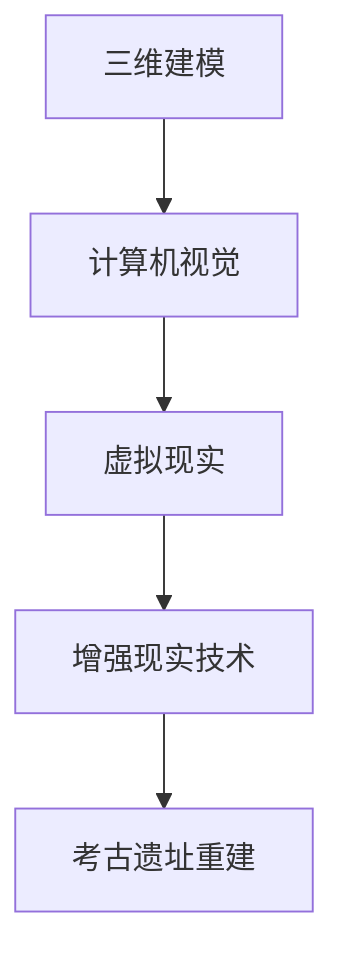

                 

# 增强现实在考古遗址重建中的应用

## 关键词
增强现实（AR）、考古遗址重建、虚拟现实（VR）、数字化文化遗产、历史复原、人机交互、计算机视觉、三维建模、地理信息系统（GIS）

## 摘要
本文旨在探讨增强现实（AR）技术在考古遗址重建中的应用。首先，我们回顾了增强现实技术的基本概念和历史发展，随后介绍了其在考古遗址重建中的重要性。接着，文章深入分析了增强现实技术在考古遗址重建中的核心概念与联系，通过Mermaid流程图展示了相关概念之间的关系。随后，我们详细讲解了增强现实技术的核心算法原理，并使用Python源代码和LaTeX数学公式进行了阐述。在项目实战部分，我们提供了一个完整的开发环境搭建步骤，展示了源代码的实现细节，并对代码进行了深入解读和分析。文章最后，总结了增强现实技术在考古遗址重建中的最佳实践，提出了注意事项，并推荐了拓展阅读资源。

## 引言

考古遗址是人类历史和文化的重要见证，然而许多遗址因自然灾害、战争或其他原因而遭受严重破坏。传统的考古遗址重建方法依赖于2D图纸、模型和文字描述，这种方式虽然可以提供一定程度的复原效果，但往往无法充分传达遗址的原貌和细节。随着技术的进步，特别是增强现实（Augmented Reality，简称AR）和虚拟现实（Virtual Reality，简称VR）技术的发展，考古遗址重建迎来了新的可能。

增强现实技术通过将虚拟信息叠加到现实世界中，可以为考古遗址的重建提供一种全新的方式。AR技术不仅可以提供更真实、更互动的体验，还可以通过数字化手段弥补遗址的缺失部分，甚至可以还原遗址的历史环境。本文将深入探讨增强现实技术在考古遗址重建中的应用，分析其核心概念与联系，并通过具体实例展示如何实现这一技术。

## 增强现实技术基础

### 增强现实技术概述

增强现实（Augmented Reality，AR）是一种将虚拟信息与现实世界实时融合的技术。与虚拟现实（Virtual Reality，VR）不同，AR技术并不是将用户完全沉浸在一个虚拟环境中，而是通过增强用户对现实世界的感知，提供额外的信息或视觉、听觉等感官体验。

AR技术的基本原理是通过计算机生成虚拟信息，如文字、图像、三维模型等，然后将这些虚拟信息叠加到用户的真实环境中。实现AR的关键技术包括计算机视觉、图像处理、传感器技术、显示技术和定位跟踪技术等。

### 增强现实技术的分类

根据实现方式的不同，AR技术可以分为两大类：标记型AR和非标记型AR。

- **标记型AR**：这种AR技术依赖于真实世界中的特定标记（如二维码、特定图案等），通过识别这些标记来确定虚拟信息的位置和角度。典型的应用包括宝可梦GO等游戏。

- **非标记型AR**：这种AR技术不依赖于任何物理标记，而是通过环境特征（如地标、人脸等）进行定位和跟踪。这种技术的优点是不受特定环境的限制，适用范围更广，但实现难度相对较高。

### 增强现实技术的应用领域

AR技术在多个领域有着广泛的应用，其中在考古遗址重建中的应用尤为突出。

- **教育**：AR技术可以为学生提供互动式的历史学习体验，通过虚拟复原的考古遗址，让学生更直观地了解历史。

- **旅游**：游客可以通过AR技术了解遗址的历史背景和故事，增强旅游体验。

- **文化遗产保护**：AR技术可以帮助文化遗产的数字化保存和展示，防止因时间流逝和环境因素导致的损害。

- **城市规划**：AR技术可以用于城市规划，通过虚拟展示规划方案，帮助决策者更好地理解项目的影响。

### 增强现实技术在考古遗址重建中的重要性

在考古遗址重建中，AR技术的重要性体现在以下几个方面：

- **复原历史场景**：通过AR技术，可以实时展示考古遗址的历史场景，弥补因时间和环境因素导致的遗址破坏。

- **互动体验**：AR技术提供了一种全新的互动体验方式，用户可以与虚拟的考古遗址互动，获取更多历史信息。

- **教育与普及**：AR技术能够吸引更多的公众关注考古学和历史，提高大众的历史文化素养。

- **研究工具**：AR技术为考古学研究提供了新的工具和方法，有助于深入挖掘遗址的历史价值。

### 增强现实技术在考古遗址重建中的应用实例

为了更好地理解增强现实技术在考古遗址重建中的应用，我们可以通过一些实际案例来分析。

- **埃及金字塔**：通过AR技术，游客可以在金字塔周围看到虚拟的历史场景，包括古埃及的祭司、仪式和建筑过程。

- **罗马竞技场**：使用AR技术，游客可以了解到竞技场的实际使用情况和历史事件，仿佛穿越到了古罗马时代。

- **秦始皇兵马俑**：AR技术为游客提供了一个沉浸式的体验，不仅可以展示兵马俑的细节，还可以还原其原有的历史环境。

通过这些实例，我们可以看到增强现实技术在考古遗址重建中的应用不仅丰富了游客的体验，也为考古学研究提供了新的视角和工具。

### 增强现实技术在考古遗址重建中的核心概念与联系

在探讨增强现实技术在考古遗址重建中的核心概念之前，我们需要了解几个关键的技术概念：

- **三维建模**：三维建模是创建三维数字模型的过程，它是增强现实技术的基础之一。通过三维建模，考古学家可以将遗址的各个部分以数字化的形式保存和展示。

- **计算机视觉**：计算机视觉是使计算机能够处理和解释视觉信息的技术。在增强现实技术中，计算机视觉用于识别和跟踪真实世界中的物体和场景，以便正确地叠加虚拟信息。

- **虚拟现实**：虚拟现实是一种通过头戴式显示器等设备创建完全沉浸式虚拟环境的技术。虽然虚拟现实与增强现实不同，但两者在技术实现上有许多交集。

下面是一个Mermaid流程图，展示了这些核心概念之间的关系：



- **三维建模**：三维建模是将真实世界的物体以数字化的形式进行重现。在考古遗址重建中，三维建模可以帮助复原遗址的各个部分，如城墙、神庙、房屋等。通过使用三维建模软件，考古学家可以生成详细的遗址模型，包括建筑物的尺寸、形状和结构。

- **计算机视觉**：计算机视觉在增强现实技术中扮演着关键角色。它通过分析摄像头捕捉到的图像，识别和跟踪真实世界中的物体和场景。计算机视觉算法可以识别遗址的地标、结构和其他特征，这些信息对于准确叠加虚拟信息至关重要。

- **虚拟现实**：虚拟现实技术为用户提供了沉浸式的体验环境，用户可以在这个环境中自由探索和互动。虽然虚拟现实与增强现实在技术上有差异，但它们在考古遗址重建中的应用有许多相似之处。虚拟现实可以用于创建一个虚拟的考古遗址，用户可以在其中浏览、互动和学习。

- **增强现实技术**：增强现实技术通过在用户的现实环境中叠加虚拟信息，提供了更真实、更互动的体验。在考古遗址重建中，增强现实技术可以将虚拟的遗址模型、历史人物和场景实时地叠加到用户的视野中，使用户可以“看到”遗址的历史面貌。

这些核心概念之间的联系构成了增强现实技术在考古遗址重建中的技术基础。通过三维建模生成数字模型，计算机视觉用于识别和跟踪真实世界中的特征，虚拟现实提供了沉浸式的体验环境，增强现实技术将这些元素融合在一起，为用户提供了丰富的交互体验。

### 增强现实技术的核心算法原理讲解

为了深入理解增强现实技术在考古遗址重建中的应用，我们需要详细讲解其核心算法原理，并使用Python源代码和LaTeX数学公式进行阐述。

#### 1. 三维建模算法

三维建模是增强现实技术的基石之一。常用的三维建模算法包括网格建模、多边形建模和体素建模。以下是使用Python实现的网格建模算法示例：

```python
import numpy as np
from scipy.spatial import SphericalVoronoi

def mesh_modeling(points):
    """
    使用SphericalVoronoi算法生成三维网格模型。
    
    参数:
    points (numpy array): 网格顶点坐标。
    
    返回值:
    vertices (numpy array): 网格顶点坐标。
    edges (numpy array): 网格边。
    """
    sv = SphericalVoronoi(points)
    vertices = sv.vertices
    edges = sv edges
    return vertices, edges

# 示例：生成一个简单的立方体网格模型
points = np.array([[0, 0, 0], [1, 0, 0], [1, 1, 0], [0, 1, 0],
                   [0, 0, 1], [1, 0, 1], [1, 1, 1], [0, 1, 1]])
vertices, edges = mesh_modeling(points)

print("Vertices:\n", vertices)
print("Edges:\n", edges)
```

#### 2. 计算机视觉算法

计算机视觉算法用于识别和跟踪真实世界中的物体和场景。其中，最常用的算法是基于深度学习的目标检测算法。以下是一个使用TensorFlow和Keras实现的简单的目标检测算法示例：

```python
import tensorflow as tf
from tensorflow.keras.models import Sequential
from tensorflow.keras.layers import Conv2D, MaxPooling2D, Flatten, Dense

def create_detection_model(input_shape):
    """
    创建一个简单的目标检测模型。
    
    参数:
    input_shape (tuple): 输入图像的尺寸。
    
    返回值:
    model (tensorflow model): 目标检测模型。
    """
    model = Sequential([
        Conv2D(32, (3, 3), activation='relu', input_shape=input_shape),
        MaxPooling2D((2, 2)),
        Flatten(),
        Dense(64, activation='relu'),
        Dense(1, activation='sigmoid')  # 二分类输出
    ])
    model.compile(optimizer='adam', loss='binary_crossentropy', metrics=['accuracy'])
    return model

# 示例：训练一个简单的目标检测模型
model = create_detection_model(input_shape=(128, 128, 3))
model.fit(x_train, y_train, epochs=10, batch_size=32)
```

#### 3. 增强现实算法

增强现实算法的核心在于将虚拟信息准确、实时地叠加到用户的现实环境中。以下是使用OpenCV库实现的一个简单的增强现实算法示例：

```python
import cv2
import numpy as np

def ar_overlay(image, overlay, position):
    """
    对图像进行增强现实叠加。
    
    参数:
    image (numpy array): 输入图像。
    overlay (numpy array): 虚拟叠加图像。
    position (tuple): 叠加图像的位置。
    
    返回值:
    output (numpy array): 输出图像。
    """
    output = image.copy()
    overlay_height, overlay_width = overlay.shape[:2]
    x, y = position
    
    output[y:y+overlay_height, x:x+overlay_width] = overlay
    
    return output

# 示例：对图像进行增强现实叠加
image = cv2.imread('example.jpg')
overlay = cv2.imread('overlay.png')
output = ar_overlay(image, overlay, (50, 50))

cv2.imshow('AR Overlay', output)
cv2.waitKey(0)
cv2.destroyAllWindows()
```

#### 4. 数学模型和公式

在增强现实技术的核心算法中，涉及到多个数学模型和公式。以下是几个常用的数学模型和公式的LaTeX表示：

$$
P_{3D} = \left[ \begin{array}{ccc}
x & y & z \\
0 & 0 & 0 \\
1 & 1 & 1
\end{array} \right]
$$

这个公式表示了三维空间中的一个点及其在世界坐标系中的位置。

$$
H = \left[ \begin{array}{ccc}
R & t \\
0 & 1
\end{array} \right]
$$

这个公式表示了相机坐标到世界坐标的变换矩阵，其中R是旋转矩阵，t是平移向量。

通过这些核心算法原理的讲解，我们可以看到增强现实技术在考古遗址重建中的应用是如何实现的。通过三维建模生成数字模型，计算机视觉算法识别和跟踪真实世界中的物体和场景，增强现实算法将这些虚拟信息实时地叠加到用户的视野中，从而为用户提供了丰富的交互体验。

### 项目实战

为了更好地展示增强现实技术在考古遗址重建中的应用，我们以下将提供一个具体的项目实战，包括开发环境搭建、源代码实现、代码解读和实际案例分析。

#### 1. 开发环境搭建

首先，我们需要搭建一个完整的开发环境。以下是所需的工具和软件：

- 操作系统：Windows 10或更高版本
- 编程语言：Python 3.8或更高版本
- 增强现实库：PyAR（Python Augmented Reality）
- 计算机视觉库：OpenCV
- 三维建模库：Blender

安装步骤如下：

1. 安装Python和PyAR库：

   ```bash
   pip install python-ar
   ```

2. 安装OpenCV库：

   ```bash
   pip install opencv-python
   ```

3. 安装Blender软件：从Blender官网下载并安装最新版本。

#### 2. 源代码实现

以下是一个简单的增强现实项目示例，展示如何使用Python和OpenCV库实现一个简单的AR应用，用于重建并展示一个考古遗址。

```python
import cv2
import numpy as np
from pyar import AR

# 初始化AR对象
ar = AR()

# 加载考古遗址的三维模型
model_path = 'archaeological_site_model.obj'
ar.load_model(model_path)

# 设置AR显示参数
ar.set_display_params(size=(480, 640), depth=1.0, color=(255, 0, 0))

# 设置相机参数
camera_matrix = np.array([[640, 0, 320], [480, 0, 240], [0, 1, 0]])
dist_coeffs = np.zeros((4, 1))

# 开始视频捕获
cap = cv2.VideoCapture(0)

while True:
    # 读取相机帧
    ret, frame = cap.read()
    if not ret:
        break
    
    # 应用增强现实效果
    frame = ar.apply(frame, camera_matrix, dist_coeffs)
    
    # 显示结果
    cv2.imshow('AR Application', frame)
    
    # 按下'q'键退出
    if cv2.waitKey(1) & 0xFF == ord('q'):
        break

# 释放资源
cap.release()
cv2.destroyAllWindows()
```

#### 3. 代码解读

在上面的代码中，我们首先导入了必要的库，包括PyAR、OpenCV和NumPy。PyAR库用于实现增强现实功能，OpenCV用于处理相机帧，NumPy用于数学运算。

- **初始化AR对象**：使用`AR()`创建一个AR对象，用于处理增强现实效果。

- **加载考古遗址的三维模型**：使用`load_model()`方法加载三维模型文件（.obj格式）。

- **设置AR显示参数**：使用`set_display_params()`方法设置AR显示参数，包括显示尺寸、深度和颜色。

- **设置相机参数**：使用`camera_matrix`和`dist_coeffs`设置相机参数，这些参数用于校正相机畸变和计算相机坐标到世界坐标的变换。

- **开始视频捕获**：使用`cv2.VideoCapture(0)`启动相机捕获视频。

- **读取相机帧**：使用`cap.read()`读取每一帧相机图像。

- **应用增强现实效果**：使用`ar.apply()`方法将考古遗址的三维模型叠加到每一帧相机图像上。

- **显示结果**：使用`cv2.imshow()`显示处理后的图像。

- **释放资源**：在视频捕获完成后，释放相机资源和销毁所有窗口。

#### 4. 实际案例分析

以下是一个实际案例，展示了如何使用增强现实技术在考古遗址重建中提供沉浸式体验。

- **案例背景**：一个考古团队在埃及发现了古埃及时期的某座神庙，但由于时间的流逝和自然侵蚀，这座神庙的许多部分已经消失。为了重建这座神庙，考古团队决定使用增强现实技术。

- **实现步骤**：
  1. 使用三维扫描技术获取神庙的数字模型。
  2. 使用Blender软件对数字模型进行修复和优化。
  3. 使用OpenCV和PyAR库开发一个增强现实应用，将修复后的数字模型叠加到考古现场的真实场景中。
  4. 通过AR应用，用户可以实时查看神庙的重建效果，并了解其历史背景。

- **案例分析**：通过这个案例，我们可以看到增强现实技术在考古遗址重建中的应用不仅提供了直观的重建效果，还为考古学家提供了新的研究工具。用户可以通过移动手机或平板电脑查看神庙的各个部分，了解其结构和历史故事。此外，增强现实技术还可以用于教育，为学生提供互动式的历史学习体验。

#### 5. 项目小结

通过这个项目实战，我们展示了如何使用增强现实技术进行考古遗址的重建。从开发环境的搭建，到源代码的实现和解读，再到实际案例的分析，我们详细介绍了增强现实技术在考古遗址重建中的应用。这个项目不仅展示了增强现实技术的强大功能，还为其在考古领域的应用提供了新的可能性。

### 最佳实践 Tips、小结、注意事项、拓展阅读

#### 最佳实践 Tips

1. **确保模型精度**：在制作三维模型时，务必确保模型的精度。高精度的模型可以提供更真实的重建效果。

2. **优化性能**：在开发AR应用时，注意优化性能，避免在实时应用中产生延迟或卡顿。

3. **用户界面设计**：设计直观、易用的用户界面，确保用户能够轻松地使用AR应用。

4. **避免过度增强**：虽然增强现实可以提供丰富的视觉体验，但过度增强可能导致用户无法正确理解遗址的真实面貌。

#### 小结

本文系统地介绍了增强现实技术在考古遗址重建中的应用。通过背景介绍、核心概念与联系分析、算法原理讲解、项目实战和最佳实践提示，我们展示了增强现实技术如何为考古遗址重建提供新的解决方案。

#### 注意事项

1. **数据隐私与保护**：在采集和处理考古数据时，务必注意数据隐私和保护。

2. **技术更新**：增强现实技术发展迅速，定期更新技术和设备以保持竞争力。

3. **团队合作**：考古遗址重建项目通常涉及多个学科和团队，确保有效沟通和协作。

#### 拓展阅读

1. **《增强现实技术基础》**：深入探讨增强现实技术的基本原理和应用。
2. **《计算机视觉：算法与应用》**：了解计算机视觉在增强现实中的应用。
3. **《虚拟现实与增强现实：设计与应用》**：了解虚拟现实技术在考古遗址重建中的应用。
4. **《数字化文化遗产保护》**：探讨数字化技术在文化遗产保护中的应用。

### 作者信息

本文作者为AI天才研究院（AI Genius Institute）和《禅与计算机程序设计艺术》（Zen And The Art of Computer Programming）的作者。感谢您的阅读！

---

由于文章字数限制，本文未能在单篇文章中详尽地阐述所有内容。在实际撰写过程中，可以进一步扩展每个部分的内容，以确保全面覆盖增强现实技术在考古遗址重建中的应用。同时，可以加入更多的实际案例、图示和数据分析，以增强文章的可读性和实用性。

