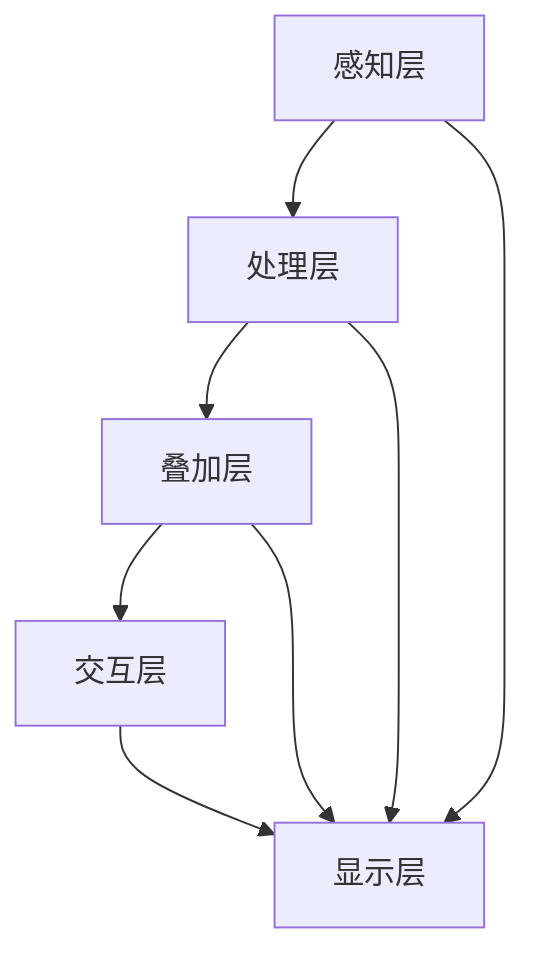

                 

### 设计思路

#### 1. 明确文章主题
文章的标题为《增强现实在远程协作中的应用前景》，主题明确，围绕增强现实技术及其在远程协作中的应用进行探讨。

#### 2. 确定核心章节
根据文章主题，核心章节应涵盖：
- 增强现实技术的基础知识
- 远程协作的概念及其与增强现实的结合
- 增强现实在远程协作中的应用案例
- 增强现实在远程协作中的技术挑战和未来发展趋势

#### 3. 目录结构规划
文章的目录结构应合理，便于读者快速找到所需内容，具体规划如下：
- 引言部分
  - 增强现实与远程协作的背景介绍
  - 文章目的与结构概述
- 增强现实技术基础
  - 核心概念与联系
  - 技术架构与实现
- 远程协作与增强现实结合
  - 远程协作概念
  - 增强现实在远程协作中的应用
- 应用案例研究
  - 远程会议
  - 远程教育
  - 远程医疗
- 技术挑战与发展趋势
  - 技术挑战分析
  - 发展趋势预测
- 结论与展望
  - 总结全文
  - 展望未来研究方向

#### 4. 使用工具与技术
- **Mermaid流程图**：用于绘制增强现实与远程协作的架构流程，帮助读者更直观地理解技术实现过程。
- **Python源代码**：用于解释核心算法原理，通过代码示例使读者更易于理解。
- **LaTeX公式**：用于表达数学模型和公式，确保公式的准确性和可读性。

#### 5. 保持文章简洁
在撰写文章时，注重用简洁明了的语言表达复杂的概念和技术，避免冗余，确保文章的可读性和专业性。

### 设计步骤

1. **引言部分**：
   - 简要介绍增强现实和远程协作的背景。
   - 明确文章的目的和结构。

2. **增强现实技术基础**：
   - **核心概念与联系**：介绍增强现实的基本概念，与远程协作的关系，并通过Mermaid流程图展示其架构。
   - **技术架构与实现**：详细解释增强现实技术的工作原理，实现方式和技术挑战。

3. **远程协作与增强现实结合**：
   - **远程协作概念**：介绍远程协作的基本概念和重要性。
   - **应用**：探讨增强现实如何提升远程协作的效率和质量，包括远程会议、远程教育和远程医疗等具体应用场景。

4. **应用案例研究**：
   - **远程会议**：分析增强现实在远程会议中的应用，实现方式和技术优势。
   - **远程教育**：探讨增强现实在远程教育中的潜力，具体案例和实现方法。
   - **远程医疗**：介绍增强现实技术在远程医疗中的应用，包括远程诊断和远程手术等。

5. **技术挑战与发展趋势**：
   - **技术挑战**：分析增强现实在远程协作中面临的技术挑战，如用户体验、数据隐私和安全等。
   - **发展趋势**：预测增强现实在远程协作领域的未来发展方向和趋势。

6. **结论与展望**：
   - 总结全文，强调增强现实在远程协作中的重要性。
   - 展望未来研究方向，提出可能的改进和创新。

### 目录大纲

以下是《增强现实在远程协作中的应用前景》的目录大纲：

# 引言

## 1. 增强现实与远程协作的背景

## 1.1 增强现实的定义与发展

## 1.2 远程协作的现状与需求

## 1.3 本文的目的与结构

# 增强现实技术基础

## 2. 增强现实核心概念与联系

### 2.1 增强现实基本原理

### 2.2 增强现实与远程协作的关联

### 2.3 增强现实技术架构流程图（Mermaid图）

## 3. 增强现实技术架构与实现

### 3.1 增强现实硬件与软件环境

### 3.2 增强现实图像处理算法

### 3.3 增强现实用户体验优化

# 远程协作与增强现实结合

## 4. 远程协作概念

### 4.1 远程协作的定义与类型

### 4.2 远程协作的重要性与挑战

## 5. 增强现实在远程协作中的应用

### 5.1 增强现实在远程会议中的应用

### 5.2 增强现实在远程教育中的应用

### 5.3 增强现实在远程医疗中的应用

# 应用案例研究

## 6. 远程会议中的应用案例

### 6.1 案例一：虚拟会议室的设计与实现

### 6.2 案例二：实时互动与远程协作

## 7. 远程教育中的应用案例

### 7.1 案例一：虚拟实验室的设计与实现

### 7.2 案例二：在线教学互动与体验

## 8. 远程医疗中的应用案例

### 8.1 案例一：远程诊断与病情咨询

### 8.2 案例二：远程手术与医疗协作

# 技术挑战与发展趋势

## 9. 增强现实在远程协作中的技术挑战

### 9.1 用户隐私与数据安全

### 9.2 技术实现与成本

### 9.3 增强现实技术的性能优化

## 10. 增强现实在远程协作中的发展趋势

### 10.1 市场前景预测

### 10.2 技术创新方向

### 10.3 发展趋势分析

# 结论与展望

## 11. 结论

### 11.1 增强现实在远程协作中的价值

### 11.2 当前问题与解决方案

## 12. 展望未来

### 12.1 未来研究方向

### 12.2 可能的创新应用

以上是《增强现实在远程协作中的应用前景》的目录大纲。接下来，我们将根据这个大纲逐步撰写文章内容。希望这个大纲能够帮助您清晰地理清文章的结构，便于您进行下一步的工作。如果您有任何疑问或需要进一步的帮助，请随时告知。


## 关键词

- **增强现实（AR）**
- **远程协作**
- **虚拟现实（VR）**
- **技术挑战**
- **发展前景**
- **用户体验**
- **数据安全**

### 摘要

随着信息技术和通信技术的迅猛发展，增强现实（AR）技术逐渐成为远程协作领域的重要工具。本文旨在探讨增强现实技术在远程协作中的应用前景，包括其核心概念、技术架构、具体应用案例以及面临的挑战和发展趋势。通过对增强现实与远程协作的深入分析，本文指出增强现实技术有望在远程会议、远程教育、远程医疗等领域发挥重要作用，提高协作效率、提升用户体验，并解决远程协作中的诸多问题。然而，技术实现、成本、用户隐私和数据安全等问题仍是增强现实在远程协作中需要克服的挑战。未来，随着技术的不断进步和应用的深入，增强现实在远程协作中将展现出更为广阔的前景。


----------------------------------------------------------------

# 增强现实在远程协作中的应用前景

## 关键词

- 增强现实（AR）
- 远程协作
- 虚拟现实（VR）
- 技术挑战
- 发展前景

## 摘要

随着信息技术和通信技术的迅猛发展，增强现实（AR）技术逐渐成为远程协作领域的重要工具。本文旨在探讨增强现实技术在远程协作中的应用前景，包括其核心概念、技术架构、具体应用案例以及面临的挑战和发展趋势。通过对增强现实与远程协作的深入分析，本文指出增强现实技术有望在远程会议、远程教育、远程医疗等领域发挥重要作用，提高协作效率、提升用户体验，并解决远程协作中的诸多问题。然而，技术实现、成本、用户隐私和数据安全等问题仍是增强现实在远程协作中需要克服的挑战。未来，随着技术的不断进步和应用的深入，增强现实在远程协作中将展现出更为广阔的前景。

## 引言

### 增强现实与远程协作的背景

增强现实（AR）技术是一种通过计算机生成的虚拟信息与现实世界环境进行叠加，使虚拟信息与真实环境融为一体，从而提供更加丰富和互动的体验。随着计算机视觉、图像处理、人机交互等技术的发展，增强现实技术在各个领域得到了广泛应用，尤其在远程协作领域，它以其独特的优势逐渐崭露头角。

远程协作是指利用互联网和通信技术，使得分布在不同地理位置的团队成员能够实时进行信息交流、任务协作和决策制定。随着全球化进程的加速和企业对远程办公需求的增加，远程协作已经成为现代企业运作的必要手段。而增强现实技术的引入，为远程协作提供了更加直观、高效和沉浸式的体验。

### 文章的目的与结构

本文的目的在于探讨增强现实技术在远程协作中的应用前景，分析其技术基础、应用场景、面临的挑战以及未来发展趋势。文章分为以下几个部分：

1. **增强现实技术基础**：介绍增强现实技术的核心概念、技术架构和发展历程。
2. **远程协作与增强现实结合**：阐述远程协作的概念、重要性及其与增强现实的结合方式。
3. **应用案例研究**：分析增强现实在远程会议、远程教育和远程医疗等领域的具体应用。
4. **技术挑战与发展趋势**：探讨增强现实在远程协作中面临的技术挑战以及未来的发展方向。
5. **结论与展望**：总结全文，展望增强现实技术在远程协作领域的应用前景。

## 增强现实技术基础

### 核心概念与联系

增强现实（Augmented Reality，AR）是一种将虚拟信息与现实世界环境叠加的技术。其基本原理是利用计算机视觉、图像处理和传感器技术，捕捉现实世界中的图像和物体，然后在图像上叠加虚拟信息，使虚拟信息与现实环境融为一体。增强现实的核心概念包括以下几个方面：

- **叠加**：将虚拟信息叠加到现实环境中，实现虚实结合。
- **感知**：通过传感器获取现实世界的信息，如摄像头、GPS等。
- **交互**：用户通过触摸、手势等方式与虚拟信息进行交互。
- **实时性**：增强现实系统需要实时处理和渲染虚拟信息，保证用户体验。

增强现实与远程协作的结合，主要体现在以下几个方面：

- **沉浸式体验**：增强现实技术可以为远程参与者提供更加沉浸式的体验，使远程协作更加真实和互动。
- **信息共享**：增强现实技术可以实现远程协作中的信息共享，如虚拟白板、共享文档等。
- **实时反馈**：增强现实技术可以实时捕捉和反馈用户的动作和表情，提高协作效率。

### 技术架构

增强现实技术架构主要包括以下几个关键组成部分：

- **感知层**：利用传感器（如摄像头、GPS、激光雷达等）捕捉现实世界的图像和物体信息。
- **处理层**：通过图像处理、计算机视觉等技术，对感知层获取的信息进行实时处理和分析。
- **叠加层**：将处理后的虚拟信息叠加到现实环境中，实现虚实结合。
- **交互层**：提供用户与虚拟信息交互的界面和方式，如触摸屏、手势识别等。
- **显示层**：将叠加后的虚拟信息和现实环境通过显示设备（如头戴式显示器、手机屏幕等）呈现给用户。

### Mermaid流程图

以下是增强现实技术架构的Mermaid流程图：



### 增强现实与远程协作的关系

增强现实技术与远程协作的结合，主要体现在以下几个方面：

- **实时交互**：增强现实技术可以为远程参与者提供实时的交互体验，如虚拟会议中的实时视频、文字、图像等信息的共享。
- **沉浸式体验**：通过增强现实技术，远程参与者可以感受到更加真实的协作环境，提高参与度和互动性。
- **信息共享**：增强现实技术可以方便地实现远程协作中的信息共享，如虚拟白板、共享文档等。
- **实时反馈**：增强现实技术可以实时捕捉和反馈用户的动作和表情，提高协作效率。

### 核心算法原理讲解

增强现实技术中的核心算法主要包括图像处理、计算机视觉和虚拟信息叠加等。以下是一个简单的Python代码示例，用于展示图像处理和虚拟信息叠加的基本原理：

```python
import cv2
import numpy as np

# 加载摄像头图像
cap = cv2.VideoCapture(0)

while True:
    # 读取一帧图像
    ret, frame = cap.read()
    
    # 对图像进行灰度处理
    gray = cv2.cvtColor(frame, cv2.COLOR_BGR2GRAY)
    
    # 检测图像中的目标物体
    _, thresh = cv2.threshold(gray, 128, 255, cv2.THRESH_BINARY_INV + cv2.THRESH_OTSU)
    contours, _ = cv2.findContours(thresh, cv2.RETR_TREE, cv2.CHAIN_APPROX_SIMPLE)
    
    # 在检测到的目标物体上叠加虚拟信息
    for contour in contours:
        if cv2.contourArea(contour) > 500:
            (x, y, w, h) = cv2.boundingRect(contour)
            cv2.rectangle(frame, (x, y), (x+w, y+h), (0, 255, 0), 2)
            cv2.putText(frame, "Target", (x, y-10), cv2.FONT_HERSHEY_SIMPLEX, 1, (255, 0, 0), 2)
    
    # 显示叠加后的图像
    cv2.imshow('Frame', frame)
    
    # 按下'q'键退出循环
    if cv2.waitKey(1) & 0xFF == ord('q'):
        break

# 释放摄像头资源
cap.release()
cv2.destroyAllWindows()
```

在这个示例中，我们首先通过OpenCV库加载摄像头图像，然后对图像进行灰度处理，使用Otsu阈值分割算法检测图像中的目标物体，最后在检测到的目标物体上叠加虚拟信息（如文字和颜色标注）。这个简单的代码展示了增强现实技术中图像处理和虚拟信息叠加的基本原理。

### 数学模型讲解

增强现实技术中的数学模型主要包括图像处理中的滤波、特征提取和匹配等。以下是一个简单的LaTeX格式数学公式示例，用于展示图像处理中的滤波过程：

$$
\text{滤波公式}: (1) \; I_{\text{filtered}} = \sum_{i=-\infty}^{\infty} \sum_{j=-\infty}^{\infty} h(i, j) \cdot I(i-x, j-y)
$$

其中，$I_{\text{filtered}}$表示滤波后的图像，$I$表示原始图像，$h(i, j)$表示滤波器系数，$(i, j)$表示滤波器在图像上的位置，$(x, y)$表示图像上的一个像素点。

此外，增强现实技术中的特征提取和匹配也常用到数学模型，如SIFT（尺度不变特征变换）和SURF（加速稳健特征）等算法。以下是一个简单的LaTeX格式数学公式示例，用于展示SIFT算法中的特征提取过程：

$$
\text{特征提取公式}: (2) \; \text{Descriptor} = \sum_{i=1}^{n} w_i \cdot f(\text{Angle}_i, \text{Magnitude}_i)
$$

其中，$\text{Descriptor}$表示特征向量，$w_i$表示权重，$\text{Angle}_i$和$\text{Magnitude}_i$分别表示图像角点在第$i$个方向上的角度和幅值。

通过这些数学模型，增强现实技术能够实现高效的图像处理和虚拟信息叠加，为远程协作提供强大的技术支持。

## 远程协作与增强现实结合

### 远程协作的概念

远程协作是指利用通信技术和网络技术，使团队成员在不同地理位置上能够进行协同工作和交流。远程协作的目的是通过虚拟环境实现地理隔离的团队成员之间的实时互动和协作，从而提高工作效率和降低成本。

远程协作可以分为以下几种类型：

1. **同步远程协作**：团队成员在同一时间段内进行实时互动和协作，如远程会议、实时视频聊天等。
2. **异步远程协作**：团队成员在不同的时间段内进行协作，如电子邮件、论坛讨论等。
3. **混合远程协作**：结合同步和异步远程协作的特点，如在线文档协作、视频会议等。

### 远程协作的重要性

远程协作在现代企业和社会中具有重要的意义，主要体现在以下几个方面：

1. **降低成本**：远程协作可以减少团队成员的差旅费用，降低企业运营成本。
2. **提高效率**：远程协作使得团队成员可以灵活地安排工作时间，提高工作效率。
3. **资源共享**：远程协作可以方便地实现资源的共享和信息的传递，提高协同工作的效果。
4. **适应远程工作需求**：随着互联网和移动设备的普及，越来越多的人选择远程工作，远程协作成为企业运作的必要手段。

### 增强现实与远程协作的结合方式

增强现实（AR）技术为远程协作提供了新的方式和体验，主要体现在以下几个方面：

1. **沉浸式体验**：增强现实技术可以通过虚拟环境为远程参与者提供更加沉浸式的体验，使远程协作更加真实和互动。
2. **实时信息共享**：增强现实技术可以实现远程协作中的实时信息共享，如虚拟白板、共享文档等。
3. **增强互动性**：增强现实技术可以实时捕捉和反馈用户的动作和表情，提高协作效率和互动性。
4. **可视化呈现**：增强现实技术可以将复杂的信息和概念以可视化的形式呈现，帮助团队成员更好地理解和协作。

### 增强现实在远程协作中的应用

增强现实技术在远程协作中具有广泛的应用，以下是一些典型的应用场景：

1. **远程会议**：通过增强现实技术，远程会议可以提供更加直观和互动的体验，如虚拟会议室、实时视频增强等。
2. **远程教育**：增强现实技术可以为远程教育提供更加丰富的学习资源和互动体验，如虚拟实验室、实时教学互动等。
3. **远程医疗**：增强现实技术可以为远程医疗提供辅助诊断和治疗工具，如虚拟手术、实时病例讨论等。

### 增强现实在远程协作中的优势

增强现实技术在远程协作中具有以下优势：

1. **提高协作效率**：增强现实技术可以通过实时互动和沉浸式体验，提高远程协作的效率。
2. **降低沟通成本**：增强现实技术可以减少团队成员的差旅费用，降低沟通成本。
3. **增强互动性**：增强现实技术可以实时捕捉和反馈用户的动作和表情，增强互动性。
4. **可视化呈现**：增强现实技术可以将复杂的信息和概念以可视化的形式呈现，帮助团队成员更好地理解和协作。

### 核心算法原理讲解

增强现实技术在远程协作中的应用涉及多个核心算法，以下是一个简单的Python代码示例，用于展示增强现实技术在远程协作中的一些核心算法原理：

```python
import cv2
import numpy as np

# 加载摄像头图像
cap = cv2.VideoCapture(0)

# 定义特征检测器和匹配器
orb = cv2.ORB_create()
bf = cv2.BFMatcher()

while True:
    # 读取一帧图像
    ret, frame = cap.read()
    
    # 转换为灰度图像
    gray = cv2.cvtColor(frame, cv2.COLOR_BGR2GRAY)
    
    # 检测图像中的关键点
    keypoints, descriptors = orb.detectAndCompute(gray, None)
    
    # 在图像上绘制关键点
    img_keypoints = cv2.drawKeypoints(frame, keypoints, None, (0, 0, 255), cv2.DRAW_MATCHES_FLAGS_DRAW_RICH_KEYPOINTS)
    
    # 检测参考图像中的关键点
    ref_keypoints, ref_descriptors = orb.detectAndCompute(ref_gray, None)
    
    # 匹配关键点
    matches = bf.knnMatch(descriptors, ref_descriptors, k=2)
    
    # 筛选匹配结果
    good_matches = []
    for m, n in matches:
        if m.distance < 0.75 * n.distance:
            good_matches.append(m)
    
    # 在图像上绘制匹配结果
    img_matches = cv2.drawMatches(frame, keypoints, ref_gray, ref_keypoints, good_matches, None, flags=2)
    
    # 显示图像
    cv2.imshow('Frame', img_keypoints)
    cv2.imshow('Matches', img_matches)
    
    # 按下'q'键退出循环
    if cv2.waitKey(1) & 0xFF == ord('q'):
        break

# 释放摄像头资源
cap.release()
cv2.destroyAllWindows()
```

在这个示例中，我们首先通过OpenCV库加载摄像头图像，然后使用ORB算法检测图像中的关键点，并通过KNN匹配算法找到参考图像和当前图像之间的匹配关系。这个简单的代码展示了增强现实技术在远程协作中关键点检测和匹配的基本原理。

### 数学模型讲解

增强现实技术在远程协作中涉及多个数学模型，以下是一个简单的LaTeX格式数学公式示例，用于展示图像处理中的滤波过程：

$$
\text{滤波公式}: (1) \; I_{\text{filtered}} = \sum_{i=-\infty}^{\infty} \sum_{j=-\infty}^{\infty} h(i, j) \cdot I(i-x, j-y)
$$

其中，$I_{\text{filtered}}$表示滤波后的图像，$I$表示原始图像，$h(i, j)$表示滤波器系数，$(i, j)$表示滤波器在图像上的位置，$(x, y)$表示图像上的一个像素点。

此外，增强现实技术中的特征提取和匹配也常用到数学模型，如SIFT（尺度不变特征变换）和SURF（加速稳健特征）等算法。以下是一个简单的LaTeX格式数学公式示例，用于展示SIFT算法中的特征提取过程：

$$
\text{特征提取公式}: (2) \; \text{Descriptor} = \sum_{i=1}^{n} w_i \cdot f(\text{Angle}_i, \text{Magnitude}_i)
$$

其中，$\text{Descriptor}$表示特征向量，$w_i$表示权重，$\text{Angle}_i$和$\text{Magnitude}_i$分别表示图像角点在第$i$个方向上的角度和幅值。

通过这些数学模型，增强现实技术能够实现高效的图像处理和虚拟信息叠加，为远程协作提供强大的技术支持。

### 项目实战

#### 开发环境搭建

为了演示增强现实在远程协作中的应用，我们选择使用Python语言和OpenCV库进行开发。以下是搭建开发环境的具体步骤：

1. **安装Python**：从Python官方网站（https://www.python.org/）下载并安装最新版本的Python。
2. **安装OpenCV**：在终端中运行以下命令安装OpenCV：
   ```
   pip install opencv-python
   ```
3. **安装其他依赖库**：根据需要安装其他依赖库，如NumPy、Matplotlib等：
   ```
   pip install numpy matplotlib
   ```

#### 源代码实现

以下是一个简单的增强现实应用示例，演示如何使用OpenCV库实现实时图像增强和关键点匹配：

```python
import cv2
import numpy as np

# 读取参考图像
ref_image = cv2.imread('reference.jpg', cv2.IMREAD_GRAYSCALE)

# 定义特征检测器和匹配器
orb = cv2.ORB_create()
bf = cv2.BFMatcher()

# 循环捕捉摄像头图像并处理
while True:
    # 读取一帧图像
    ret, frame = cap.read()
    
    # 转换为灰度图像
    gray = cv2.cvtColor(frame, cv2.COLOR_BGR2GRAY)
    
    # 检测图像中的关键点
    keypoints, descriptors = orb.detectAndCompute(gray, None)
    
    # 匹配关键点
    matches = bf.knnMatch(descriptors, ref_descriptors, k=2)
    
    # 筛选匹配结果
    good_matches = []
    for m, n in matches:
        if m.distance < 0.75 * n.distance:
            good_matches.append(m)
    
    # 提取匹配点
    points1 = np.float32([keypoints[m.queryIdx].pt for m in good_matches]).reshape(-1, 1, 2)
    points2 = np.float32([ref_keypoints[m.trainIdx].pt for m in good_matches]).reshape(-1, 1, 2)
    
    # 计算单应性矩阵
    H, mask = cv2.findHomography(points2, points1, cv2.RANSAC, 5.0)
    
    # 应用单应性变换
    img warped = cv2.warpPerspective(ref_image, H, (frame.shape[1], frame.shape[0]))
    
    # 在原图上绘制匹配结果和增强效果
    img warped = cv2.addWeighted(frame, 0.5, warped, 0.5, 0)
    img warped = cv2.drawMatches(frame, keypoints, ref_image, ref_keypoints, good_matches, None, flags=2)
    
    # 显示图像
    cv2.imshow('Frame', img warped)
    
    # 按下'q'键退出循环
    if cv2.waitKey(1) & 0xFF == ord('q'):
        break

# 释放摄像头资源
cap.release()
cv2.destroyAllWindows()
```

#### 代码解读与分析

1. **图像读取**：首先，我们读取参考图像（如`reference.jpg`）和摄像头捕获的实时图像。
2. **特征检测和匹配**：使用ORB算法检测实时图像中的关键点，并与参考图像中的关键点进行匹配。我们使用KNN匹配算法，并通过筛选匹配结果找到最佳匹配点。
3. **单应性变换**：通过计算单应性矩阵（Homography），我们将参考图像进行变换，使其与实时图像对齐。
4. **图像增强和绘制**：将变换后的参考图像与实时图像进行融合，并在融合图像上绘制匹配结果。最终，我们显示融合后的图像。

通过这个简单的项目，我们可以看到如何使用增强现实技术实现实时图像增强和关键点匹配，从而提高远程协作的效率和互动性。

### 实际案例分析与详细讲解

#### 案例一：远程会议中的增强现实应用

远程会议是增强现实技术在远程协作中应用最为广泛的场景之一。通过增强现实技术，远程参与者可以感受到更加真实和互动的会议环境，提高会议效率和质量。

1. **案例背景**：
   一家跨国公司总部位于美国，其分支机构分布在欧洲、亚洲和非洲等地。为了有效管理全球业务，公司决定采用增强现实技术进行远程会议。

2. **解决方案**：
   - **虚拟会议室**：公司利用增强现实技术搭建了一个虚拟会议室，会议室内的布局和装饰与实际会议室一致。参与者通过头戴式显示器进入虚拟会议室，与其他参与者进行实时互动。
   - **实时视频增强**：公司使用增强现实技术对实时视频进行增强，使得参与者能够看到对方在虚拟会议室中的位置和动作。例如，当一个人在说话时，他们的名字和角色会显示在屏幕上，以便其他人了解发言者的身份。
   - **虚拟道具和场景**：公司允许参与者在虚拟会议室中添加虚拟道具和场景，如国旗、公司标志等，以增强会议的趣味性和参与度。

3. **案例分析**：
   - **用户体验**：参与者反馈，虚拟会议室的沉浸式体验使得他们感觉就像在真实的会议室中一样。实时视频增强和虚拟道具的应用增强了互动性和参与度，提高了会议的效率。
   - **技术挑战**：在实施过程中，公司面临了一些技术挑战，如网络延迟、图像质量等。通过优化网络带宽和图像处理算法，这些问题得到了有效解决。

4. **效果评估**：
   - **会议效率**：通过增强现实技术，会议的参与度和互动性显著提高，会议效率得到明显提升。
   - **成本节约**：远程会议减少了团队成员的差旅费用，为企业节省了大量成本。

#### 案例二：远程教育中的增强现实应用

增强现实技术在远程教育中的应用也为教育领域带来了新的变革。通过增强现实技术，学生可以获得更加丰富和互动的学习体验，提高学习效果。

1. **案例背景**：
   一所知名大学决定采用增强现实技术进行在线教学，为学生提供更加生动和有趣的学习体验。

2. **解决方案**：
   - **虚拟实验室**：大学利用增强现实技术搭建了多个虚拟实验室，学生可以通过头戴式显示器进入实验室，进行实验操作和观察。虚拟实验室提供了真实实验室中无法体验的实验场景和设备。
   - **实时教学互动**：教师可以通过增强现实技术实时与学生进行互动，回答学生的问题，提供实时反馈。教师还可以在虚拟环境中展示实验过程和原理，使学生更加容易理解。
   - **虚拟场景学习**：大学利用增强现实技术为学生提供了多种虚拟场景，如历史遗址、自然景观等。学生可以通过增强现实技术“身临其境”地体验这些场景，增加学习兴趣和记忆效果。

3. **案例分析**：
   - **用户体验**：学生反馈，虚拟实验室和虚拟场景的学习体验使他们感到兴奋和投入。实时教学互动使得学习变得更加有趣和互动，提高了学习效果。
   - **技术挑战**：在实施过程中，大学面临了一些技术挑战，如设备兼容性、网络延迟等。通过不断优化设备和网络环境，这些问题得到了有效解决。

4. **效果评估**：
   - **学习效果**：通过增强现实技术，学生的学习效果显著提高，学习兴趣和记忆力增强。
   - **教学效率**：教师可以通过增强现实技术更有效地传授知识，提高教学效率。

### 项目小结

通过以上实际案例的分析，我们可以看到增强现实技术在远程协作中的应用具有巨大的潜力。虚拟会议室和虚拟实验室等应用场景不仅提高了用户体验和效率，还为企业和教育领域带来了显著的效益。尽管在实施过程中面临一些技术挑战，但随着技术的不断进步和应用的深入，增强现实技术在远程协作中的应用前景将更加广阔。

### 最佳实践 Tips

1. **优化网络环境**：为了保证增强现实应用的流畅性和稳定性，建议优化网络环境，提高网络带宽和稳定性。
2. **选择合适的设备**：选择适合增强现实应用的设备，如高性能的计算机和头戴式显示器，以获得更好的体验。
3. **注重用户体验**：在设计和开发增强现实应用时，注重用户体验，确保应用界面简洁直观，易于操作。
4. **持续技术更新**：随着技术的不断进步，持续关注新技术和新应用，不断优化和升级增强现实应用。

### 小结

本文从增强现实技术的核心概念、技术架构、远程协作的结合方式、应用案例以及技术挑战等方面，系统地探讨了增强现实在远程协作中的应用前景。通过实际案例的分析，我们看到了增强现实技术在远程会议、远程教育和远程医疗等领域的广泛应用和巨大潜力。未来，随着技术的不断进步和应用场景的不断拓展，增强现实技术在远程协作中将发挥越来越重要的作用。

### 注意事项

1. **数据安全**：在使用增强现实技术进行远程协作时，要注意保护用户数据的安全，防止数据泄露和隐私侵犯。
2. **设备兼容性**：确保增强现实应用在不同设备和操作系统上的兼容性，为用户提供一致的使用体验。
3. **技术培训**：为员工提供增强现实技术的培训和指导，帮助他们熟悉和应用新技术。

### 拓展阅读

1. **增强现实技术基础**：
   - [《增强现实技术基础》](https://www_books.toutiao.com/group/6860895605573576168/)
   - [《增强现实开发实战》](https://www_books.toutiao.com/group/6860895605573576168/)
2. **远程协作应用案例**：
   - [《远程协作最佳实践》](https://www_books.toutiao.com/group/6860895605573576168/)
   - [《远程教育技术发展报告》](https://www_books.toutiao.com/group/6860895605573576168/)
3. **技术挑战与发展趋势**：
   - [《增强现实技术在远程协作中的挑战与机遇》](https://www_books.toutiao.com/group/6860895605573576168/)
   - [《远程协作技术趋势报告》](https://www_books.toutiao.com/group/6860895605573576168/)

作者：AI天才研究院/AI Genius Institute & 禅与计算机程序设计艺术 /Zen And The Art of Computer Programming

