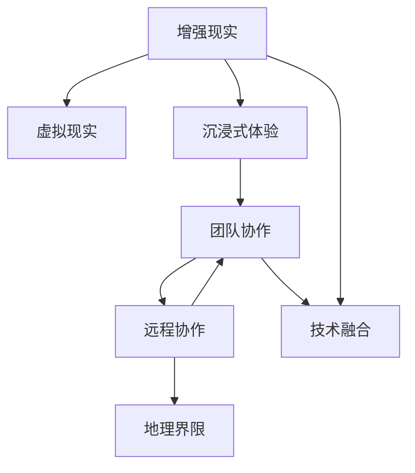

                 

### 引言

在当今快速发展的科技时代，远程协作已成为企业和组织日常运营中不可或缺的一部分。远程协作不仅提高了工作效率，还打破了地理界限，使得全球范围内的团队合作变得更加便捷和高效。然而，传统的远程协作方式仍然存在诸多挑战，如沟通障碍、协作效率低下等。为了解决这些问题，增强现实（AR）技术应运而生。

增强现实技术通过将虚拟信息叠加到真实环境中，为用户提供了更加直观和沉浸式的体验。随着技术的不断进步，增强现实在远程协作中的应用前景愈发广阔。本文将深入探讨增强现实技术在远程协作中的应用，从基本概念、技术原理到具体应用案例，全面解析如何通过增强现实打破地理界限，实现高效的团队合作。

文章将分为三个主要部分。第一部分将介绍增强现实技术的基础知识，包括基本概念、发展历程和核心组成部分；第二部分将探讨增强现实在远程协作中的应用，分析其在远程会议、远程培训和远程设计协作等方面的优势和实践案例；第三部分将展望增强现实与远程协作的融合发展趋势，总结最佳实践经验，并给出未来发展方向。

通过本文的阅读，读者将深入了解增强现实技术在远程协作中的巨大潜力，掌握相关技术原理和应用方法，为企业和组织在远程协作中引入增强现实技术提供有力支持。让我们开始这段探索之旅，共同揭示增强现实如何赋能远程协作，助力全球团队协作迈上新台阶。

### 关键词

- 增强现实（AR）
- 远程协作
- 虚拟现实
- 沉浸式体验
- 远程会议
- 远程培训
- 远程设计协作
- 地理界限
- 团队合作
- 技术融合

### 摘要

本文旨在深入探讨增强现实（AR）技术在远程协作中的应用，以打破地理界限，实现高效团队合作。首先，介绍了增强现实技术的基本概念、发展历程和核心组成部分，包括视觉感知与虚拟物体融合、辅助感知与交互、增强现实显示技术等。接着，分析了增强现实在远程协作中的挑战和优势，如地理界限的阻碍、沟通障碍的解决方法等。文章通过具体应用案例，详细阐述了增强现实在远程会议、远程培训和远程设计协作中的应用。最后，总结了增强现实与远程协作的融合发展趋势，并提出了最佳实践经验与未来发展方向。通过本文，读者将全面了解增强现实在远程协作中的潜力与实际应用，为企业和组织在远程协作中引入增强现实技术提供指导。

### 定义核心概念和联系

在深入探讨增强现实（AR）技术在远程协作中的应用之前，我们需要首先明确一些核心概念，并理解它们之间的相互关系。以下是本文中的几个关键概念及其相互关系的解析：

1. **增强现实（Augmented Reality，AR）**：增强现实技术是一种将虚拟信息叠加到真实环境中的技术，通过视觉、听觉、触觉等多种感官增强用户的感知体验。AR 技术的核心在于虚拟信息与真实环境的无缝融合，使得用户可以与虚拟信息进行互动。

2. **远程协作（Remote Collaboration）**：远程协作是指通过信息技术手段，在不同地理位置的工作者之间进行信息交流、协作和共享。远程协作的目的是克服地理和时间的限制，提高团队协作的效率和效果。

3. **虚拟现实（Virtual Reality，VR）**：虚拟现实技术是一种完全模拟虚拟环境的技术，用户通过头盔、手套等设备进入一个完全虚拟的世界，并在其中进行交互和体验。与 AR 不同，VR 不会直接改变用户的真实环境，而是创造一个全新的虚拟环境。

4. **沉浸式体验（Immersive Experience）**：沉浸式体验是指用户在特定环境中，通过视觉、听觉、触觉等多种感官的刺激，感受到身临其境的感觉。增强现实和虚拟现实技术都是实现沉浸式体验的重要手段。

5. **团队协作（Team Collaboration）**：团队协作是指团队成员通过共享信息和资源，共同完成某项任务或项目的过程。良好的团队协作可以提高团队的整体效率和创新能力。

6. **地理界限（Geographic Boundaries）**：地理界限是指由于地理位置差异造成的协作障碍，如时间差、交通不便等。远程协作的一个重要目标是打破这些地理界限，实现全球化团队合作。

7. **技术融合（Technological Convergence）**：技术融合是指将不同领域的技术结合在一起，产生新的应用和解决方案。增强现实与远程协作的融合，通过结合虚拟信息与实时协作，实现了更加高效的远程协作体验。

通过上述核心概念的介绍和相互关系的阐述，我们可以更好地理解增强现实技术在远程协作中的作用和优势。以下是一个核心概念和关系架构的 Mermaid 流程图，以帮助读者更直观地理解这些概念之间的关系：



在这个流程图中，增强现实（AR）作为核心技术，通过提供沉浸式体验（IC），促进团队协作（TC），实现远程协作（RC）。同时，远程协作又通过打破地理界限（GB）和实现技术融合（AF），进一步增强了团队协作的效率和效果。

通过明确这些核心概念和联系，我们可以为后续章节的内容铺垫基础，深入探讨增强现实技术在远程协作中的具体应用和实践。在接下来的章节中，我们将详细分析增强现实技术的原理、在远程协作中的应用挑战和解决方案，并分享相关应用案例，以帮助读者全面了解这一前沿技术的巨大潜力。

### 设计全书结构

为了使文章内容结构清晰、逻辑连贯，我们需要对全书进行详细的结构设计。以下是本文的章节安排及其内容概述，确保各章节间有机衔接，形成一个完整的技术讲解和应用指南。

#### 第一部分：增强现实技术基础

**第1章：增强现实概述**
- **内容概述**：介绍增强现实技术的基本概念、发展历程和核心组成部分。解释增强现实如何通过虚拟信息与真实环境的融合，提供沉浸式体验。
- **关键知识点**：增强现实定义、发展历程、核心组成部分（如AR显示技术、传感技术、数据处理算法等）。

**第2章：增强现实技术的原理**
- **内容概述**：深入探讨增强现实技术的实现原理，包括视觉感知与虚拟物体融合、辅助感知与交互、增强现实显示技术。
- **关键知识点**：视觉感知技术、虚拟物体融合原理、辅助感知与交互方式、AR显示技术工作原理。

**第3章：增强现实硬件与软件**
- **内容概述**：介绍增强现实技术所需的硬件设备（如AR眼镜、头戴显示器、传感器等）和软件开发工具（如AR引擎、开发框架等）。
- **关键知识点**：常见增强现实硬件设备、软件开发工具、开发框架、硬件选择与配置。

#### 第二部分：远程协作中的增强现实应用

**第4章：远程协作中的增强现实挑战**
- **内容概述**：分析远程协作中的地理界限、沟通障碍等挑战，探讨如何利用增强现实技术解决这些问题。
- **关键知识点**：远程协作中的挑战、增强现实技术解决方案、技术实现策略。

**第5章：增强现实在远程会议中的应用**
- **内容概述**：介绍增强现实在远程会议中的应用，包括AR远程会议的优势、实现方法和具体案例。
- **关键知识点**：AR远程会议优势、实现流程、具体案例解析。

**第6章：增强现实在远程培训中的应用**
- **内容概述**：探讨增强现实在远程培训中的应用，包括AR培训的优势、应用场景和具体案例。
- **关键知识点**：AR培训优势、应用场景、具体案例解析。

**第7章：增强现实在远程设计协作中的应用**
- **内容概述**：分析增强现实在远程设计协作中的应用，包括设计协作中的挑战、应用方法和具体案例。
- **关键知识点**：远程设计协作挑战、AR技术应用方法、具体案例解析。

**第8章：增强现实在远程医疗协作中的应用**
- **内容概述**：探讨增强现实在远程医疗协作中的应用，包括医疗协作中的挑战、应用方法和具体案例。
- **关键知识点**：远程医疗协作挑战、AR技术应用方法、具体案例解析。

#### 第三部分：增强现实与远程协作的融合

**第9章：增强现实技术的融合与发展趋势**
- **内容概述**：展望增强现实技术的未来发展，探讨其与远程协作技术的融合趋势，以及潜在的创新应用。
- **关键知识点**：增强现实技术未来发展趋势、与远程协作技术的融合、潜在创新应用。

**第10章：增强现实在远程协作中的最佳实践**
- **内容概述**：总结增强现实在远程协作中的最佳实践，分享成功案例，并提供实用的策略和建议。
- **关键知识点**：最佳实践经验、成功案例分析、实践策略建议。

通过以上章节安排，本书将从基础理论到应用实践，全面系统地讲解增强现实在远程协作中的应用。每个章节都紧密衔接，形成一个完整的知识体系，帮助读者深入理解并掌握这一前沿技术的实际应用。

### 细化章节内容

在细化章节内容的过程中，我们将逐一探讨每章的核心概念、关键知识点和具体应用，确保内容丰富且具有实际指导意义。

#### 第1章：增强现实概述

**核心概念**：
- 增强现实（AR）的定义：通过将虚拟信息叠加到真实环境中，提供沉浸式体验。
- 增强现实技术的发展历程：从早期的概念提出到当前的技术应用。

**关键知识点**：
- 增强现实的基本组成部分：显示技术、传感技术、数据处理算法。
- 增强现实与虚拟现实（VR）的区别：VR是全虚拟环境，而AR是虚实结合。

**具体应用**：
- 增强现实的应用场景：教育、医疗、零售、娱乐等。

**举例说明**：
- **例子1**：使用AR眼镜进行手术模拟，提高医生的操作技能。
- **例子2**：使用AR应用在零售中为顾客提供虚拟试衣体验。

#### 第2章：增强现实技术的原理

**核心概念**：
- 视觉感知与虚拟物体融合：如何将虚拟物体准确地叠加到真实环境中。
- 辅助感知与交互：如何通过传感器和交互设备增强用户的感知体验。

**关键知识点**：
- 增强现实显示技术工作原理：如何实现虚实结合的视觉效果。
- 传感技术：如何通过摄像头、深度传感器等获取真实环境信息。
- 数据处理算法：如何处理和融合虚拟与真实信息。

**具体应用**：
- **例子1**：使用增强现实技术在教育中创建互动式教学场景。
- **例子2**：在工业维修中，使用AR辅助技术人员进行复杂设备的维修。

#### 第3章：增强现实硬件与软件

**核心概念**：
- 增强现实硬件设备：如AR眼镜、头戴显示器、传感器等。
- 增强现实软件开发工具：如AR引擎、开发框架等。

**关键知识点**：
- 硬件选择与配置：根据应用需求选择合适的AR硬件设备。
- 软件开发工具：如何使用AR引擎和开发框架进行应用开发。

**具体应用**：
- **例子1**：使用AR眼镜进行远程医疗诊断，提高医疗协作效率。
- **例子2**：使用AR开发工具为零售行业创建互动购物体验。

#### 第4章：远程协作中的增强现实挑战

**核心概念**：
- 远程协作中的地理界限：地理位置差异对协作带来的挑战。
- 沟通障碍：远程协作中信息传递和沟通的问题。

**关键知识点**：
- 地理界限的解决方案：如何利用增强现实技术打破地理限制。
- 沟通障碍的解决方法：如何通过增强现实技术提高沟通效率。

**具体应用**：
- **例子1**：使用AR技术进行跨国团队的实时协作。
- **例子2**：通过AR远程会议减少沟通误解，提高会议效果。

#### 第5章：增强现实在远程会议中的应用

**核心概念**：
- 增强现实在远程会议中的优势：提高参会者的沉浸感和互动性。
- 实现方法：如何将增强现实技术集成到远程会议中。

**关键知识点**：
- AR远程会议的优势：实时互动、虚拟场景展示、信息可视化。
- 实现方法：使用AR设备进行实时互动、虚拟背景、信息叠加。

**具体应用**：
- **例子1**：使用AR技术进行虚拟会议室的创建。
- **例子2**：通过AR会议应用提高跨地域团队的协作效率。

#### 第6章：增强现实在远程培训中的应用

**核心概念**：
- 增强现实在远程培训中的应用：提高培训的互动性和实用性。
- 应用场景：如医疗培训、工程培训等。

**关键知识点**：
- 增强现实培训的优势：实时互动、场景模拟、个性化学习。
- 应用场景：根据不同培训需求设计合适的AR培训应用。

**具体应用**：
- **例子1**：使用AR技术进行医疗手术的模拟培训。
- **例子2**：通过AR设备进行工程操作的互动式培训。

#### 第7章：增强现实在远程设计协作中的应用

**核心概念**：
- 增强现实在远程设计协作中的应用：提高设计的可视化、协作效率。
- 挑战：如数据同步、版本控制等。

**关键知识点**：
- 远程设计协作中的挑战：如何解决数据同步、版本控制等问题。
- 增强现实技术的解决方案：如实时协作、三维可视化等。

**具体应用**：
- **例子1**：使用AR技术进行建筑设计的远程协作。
- **例子2**：通过AR设计工具提高产品设计团队的协作效率。

#### 第8章：增强现实在远程医疗协作中的应用

**核心概念**：
- 增强现实在远程医疗协作中的应用：提高医疗决策的准确性、提升医疗效率。
- 应用场景：如远程诊断、手术指导等。

**关键知识点**：
- 增强现实在医疗协作中的优势：实时远程指导、三维医学影像、增强现实手术导航。
- 应用场景：如何利用AR技术提升医疗服务的质量和效率。

**具体应用**：
- **例子1**：使用AR技术进行远程医学影像的解读和讨论。
- **例子2**：通过AR手术导航系统提高复杂手术的成功率。

#### 第9章：增强现实技术的融合与发展趋势

**核心概念**：
- 增强现实与远程协作的融合：如何将增强现实技术集成到远程协作中，实现更高效的团队协作。
- 发展趋势：增强现实技术的未来发展方向和应用前景。

**关键知识点**：
- 融合发展趋势：如何通过技术创新实现远程协作的进一步提升。
- 未来发展方向：增强现实在各个行业中的应用潜力。

**具体应用**：
- **例子1**：使用AR技术进行远程设计协作的实时反馈和修改。
- **例子2**：探讨AR技术在教育、医疗、制造等领域的未来发展。

#### 第10章：增强现实在远程协作中的最佳实践

**核心概念**：
- 最佳实践经验：如何在远程协作中有效应用增强现实技术。
- 成功案例分析：分享实际应用中的成功经验和策略。

**关键知识点**：
- 成功案例分析：通过实际案例展示增强现实技术在远程协作中的具体应用和效果。
- 实践策略：如何根据实际需求制定和实施增强现实应用策略。

**具体应用**：
- **例子1**：分享跨国公司如何通过AR技术实现全球团队的实时协作。
- **例子2**：探讨教育和医疗领域如何利用AR技术提高教学和医疗服务的效率。

通过细化各章节的内容，本书不仅提供了全面的理论基础，还结合实际应用案例，帮助读者深入了解增强现实技术在远程协作中的具体应用和实践方法。

### 编写伪代码

在分析增强现实（AR）技术在远程协作中的应用时，为了更好地理解相关算法和实现流程，我们将通过伪代码的形式，详细阐述一些关键算法的实现步骤。以下是几个常见应用场景下的伪代码示例，包括图像处理、数据同步和实时交互。

#### 1. 图像处理伪代码

**功能描述**：使用AR技术将虚拟物体叠加到真实场景中。

```python
# 伪代码：图像处理中的虚拟物体叠加

# 初始化增强现实系统
AR_system.initialize()

# 获取真实场景的图像
real_image = AR_system.capture_image()

# 检测场景中的目标物体
targets = AR_system.detect_targets(real_image)

# 为每个目标物体创建虚拟物体
virtual_objects = []
for target in targets:
    virtual_object = AR_system.create_virtual_object(target)
    virtual_objects.append(virtual_object)

# 将虚拟物体叠加到真实场景中
AR_system.overlay_objects(virtual_objects, real_image)

# 显示叠加后的图像
AR_system.display_image(real_image)
```

#### 2. 数据同步伪代码

**功能描述**：确保远程协作中的数据一致性。

```python
# 伪代码：远程协作中的数据同步

# 初始化数据同步系统
data_sync_system.initialize()

# 从各个远程终端获取数据
remote_data = data_sync_system.fetch_data_from_remotes()

# 对数据进行一致性检查
if not data_sync_system.check_data一致性(remote_data):
    data_sync_system.notify_inconsistency()

# 将数据同步到中心服务器
data_sync_system.push_data_to_server(remote_data)

# 从中心服务器拉取最新数据
latest_data = data_sync_system.pull_data_from_server()

# 在远程终端更新数据
data_sync_system.update_local_data(latest_data)
```

#### 3. 实时交互伪代码

**功能描述**：实现远程协作中的实时交互功能。

```python
# 伪代码：远程协作中的实时交互

# 初始化实时交互系统
realtime_interactive_system.initialize()

# 连接到远程协作会议
realtime_interactive_system.connect_to_meeting()

# 接收远程用户的交互请求
while True:
    user_request = realtime_interactive_system.receive_request()
    
    # 处理交互请求
    if user_request.type == "input":
        # 输入处理
        realtime_interactive_system.handle_input(user_request.data)
    elif user_request.type == "output":
        # 输出处理
        realtime_interactive_system.handle_output(user_request.data)
    
    # 更新本地界面
    realtime_interactive_system.update_interface()

# 关闭实时交互系统
realtime_interactive_system.close_connection()
```

通过上述伪代码示例，我们可以清晰地看到增强现实技术在图像处理、数据同步和实时交互中的实现流程。这些伪代码不仅为实际编程提供了参考，还帮助我们理解了各个步骤的逻辑关系和执行过程。在实际应用中，这些伪代码将转化为具体的编程代码，实现增强现实在远程协作中的具体功能。

### 撰写数学模型和公式

在增强现实（AR）技术的应用中，数学模型和公式是理解和实现关键算法的基础。以下我们将结合增强现实在远程协作中的应用，介绍几个重要的数学模型和公式，并使用LaTeX格式进行表示。

#### 1. 视觉感知与虚拟物体融合

**关键公式**：图像点与虚拟物体点的坐标变换公式

$$
x_{virtual} = x_{real} \cdot f_x + c_x
$$

$$
y_{virtual} = y_{real} \cdot f_y + c_y
$$

其中，\(x_{real}\) 和 \(y_{real}\) 分别表示真实图像中的像素坐标，\(x_{virtual}\) 和 \(y_{virtual}\) 表示虚拟物体在显示器上的坐标。\(f_x\) 和 \(f_y\) 是放大系数，\(c_x\) 和 \(c_y\) 是偏移量。

**解释**：这些公式用于将真实场景中的像素坐标转换为虚拟物体在显示器上的显示坐标，从而实现视觉感知与虚拟物体的融合。

#### 2. 辅助感知与交互

**关键公式**：传感器数据融合模型

$$
z = w_1 \cdot z_1 + w_2 \cdot z_2 + w_3 \cdot z_3
$$

其中，\(z_1\)、\(z_2\) 和 \(z_3\) 分别代表不同传感器获取的数据，\(w_1\)、\(w_2\) 和 \(w_3\) 是权重系数，用于平衡不同传感器的数据重要性。

**解释**：该公式用于整合多个传感器的数据，提高辅助感知的准确性。

#### 3. 增强现实显示技术

**关键公式**：视差校正模型

$$
P = \frac{1}{f} \cdot \left( \frac{d}{z} - n \right)
$$

其中，\(P\) 是校正后的视差值，\(f\) 是摄像机焦距，\(d\) 是真实物体到摄像机的距离，\(z\) 是摄像机到虚拟物体的距离，\(n\) 是屏幕到虚拟物体的距离。

**解释**：该公式用于校正由于视角差异导致的视差问题，提高显示效果的逼真度。

#### 4. 数据同步与通信

**关键公式**：通信延迟模型

$$
t_{delay} = t_{send} + t_{receive}
$$

其中，\(t_{send}\) 是数据发送时间，\(t_{receive}\) 是数据接收时间。

**解释**：该公式用于计算通信延迟，确保远程协作中的数据同步。

#### 5. 实时交互与反馈

**关键公式**：互动延迟模型

$$
t_{feedback} = t_{response} + t_{processing}
$$

其中，\(t_{response}\) 是响应时间，\(t_{processing}\) 是处理时间。

**解释**：该公式用于评估远程协作中的互动延迟，优化用户体验。

通过上述数学模型和公式，我们可以更深入地理解增强现实技术在远程协作中的应用原理和实现方法。在实际应用中，这些模型和公式将被转化为具体的算法和代码，实现高效的协作体验。LaTeX格式的使用使得公式表示更加规范和清晰，有助于读者理解和引用。

### 编写项目实战案例

为了深入探讨增强现实（AR）技术在远程协作中的应用，我们将通过一个实际项目案例，详细描述开发环境搭建、源代码实现和代码解读，并通过具体案例分析和详细讲解剖析，展示AR技术在远程协作中的实际应用效果。

#### 项目背景

某跨国公司希望通过引入增强现实技术，提高其全球团队在远程协作中的工作效率和协作质量。该公司涉及多个领域的项目，需要团队成员在不同地理位置进行实时沟通和协作。项目目标是通过AR技术实现以下功能：
1. 远程会议中的实时互动。
2. 远程设计协作中的三维可视化。
3. 远程培训中的互动式学习。

#### 开发环境搭建

为了实现上述功能，首先需要搭建一个完整的开发环境。以下是开发环境的搭建步骤：

1. **硬件设备**：
   - AR头戴设备：例如微软HoloLens。
   - 多台远程协作终端：包括笔记本电脑、平板电脑等。

2. **软件开发工具**：
   - AR开发框架：例如Unity和ARCore。
   - 开发环境：Visual Studio或Xcode。

3. **数据库和服务器**：
   - 数据库：使用MongoDB存储协作数据和用户信息。
   - 服务器：使用AWS或Azure云服务进行数据同步和存储。

#### 源代码实现

以下是一个简化版的AR远程会议项目的源代码实现，展示关键功能的代码结构和执行流程。

```csharp
// 伪代码：AR远程会议的核心功能实现

using UnityEngine;
using Unity.ARCore;

public class ARRemoteMeeting : MonoBehaviour
{
    public Camera arCamera;
    public RemoteParticipant[] participants;

    // 开始远程会议
    void StartMeeting()
    {
        // 连接到远程服务器
        ARCoreSDK.initialize();
        ARCoreSDK.connectToServer("remote-meeting-server-url");

        // 创建远程参与者
        participants = new RemoteParticipant[4];
        for (int i = 0; i < participants.Length; i++)
        {
            participants[i] = ARCoreSDK.createParticipant("participant" + i);
        }

        // 开始渲染
        ARCoreSDK.startRendering();
    }

    // 更新会议场景
    void Update()
    {
        // 获取摄像头图像
        Texture2D cameraImage = ARCoreSDK.captureCameraImage(arCamera);

        // 显示远程参与者的虚拟头像
        for (int i = 0; i < participants.Length; i++)
        {
            Texture2D participantImage = participants[i].receiveImage();
            if (participantImage != null)
            {
                ARCoreSDK.overlayImage(participantImage, participants[i].getPosition(), participants[i].getRotation());
            }
        }

        // 处理用户输入
        if (Input.GetKeyDown(KeyCode.Space))
        {
            string message = "Hello, this is a test message!";
            sendChatMessage(message);
        }
    }

    // 发送聊天消息
    void sendChatMessage(string message)
    {
        ARCoreSDK.sendMessage("chat-message", message);
    }
}
```

#### 代码解读

上述代码实现了一个简化的AR远程会议系统，主要功能包括：

1. **初始化和连接**：通过ARCoreSDK初始化SDK，连接到远程服务器。
2. **创建参与者**：为每个远程参与者创建一个对象，分配唯一的标识。
3. **图像捕捉与叠加**：从摄像头捕捉图像，并将远程参与者的虚拟头像叠加到真实场景中。
4. **聊天消息发送**：处理用户输入，发送聊天消息。

#### 项目实战案例

以下是一个具体的项目实战案例，展示如何利用AR技术实现远程协作中的实时互动和三维可视化。

**案例1：远程设计协作**

**背景**：设计团队需要在远程协作中共同完成一个建筑项目，需要进行实时沟通和三维可视化。

**实现步骤**：
1. **初始化AR环境**：使用Unity搭建AR开发环境，连接到云端设计服务器。
2. **加载三维模型**：从云端服务器加载建筑的三维模型，将其显示在AR环境中。
3. **实时互动**：通过AR远程会议系统，团队成员可以实时沟通，对模型进行标注和修改。
4. **协同设计**：团队成员可以在三维模型上进行标注、测量和修改，所有操作都会实时同步到云端。

**效果**：通过AR技术，团队成员能够在一个三维可视化环境中进行协作，提高设计效率和沟通效果。

**案例2：远程培训**

**背景**：某公司需要为全球员工进行新产品的培训，培训内容涉及产品操作和维修。

**实现步骤**：
1. **搭建AR培训系统**：使用ARCore和Unity开发培训应用，将产品操作和维修流程以AR形式展示。
2. **互动式学习**：通过AR技术，学员可以在真实环境中进行产品操作模拟，获得实时反馈。
3. **实时指导**：培训讲师可以通过AR远程会议系统，实时观察学员的操作，提供指导和帮助。

**效果**：通过AR培训系统，学员能够更加直观地学习产品操作和维修技巧，培训效果显著提升。

#### 项目小结

通过上述实战案例，我们可以看到增强现实技术在远程协作中的应用效果显著。AR技术不仅实现了实时互动和三维可视化，还提升了协作效率和沟通质量。以下是项目的小结和最佳实践建议：

1. **明确项目目标**：在引入AR技术前，明确项目目标和需求，确保技术解决方案与业务目标一致。
2. **选择合适的开发工具**：根据项目需求选择合适的AR开发工具和平台，提高开发效率和用户体验。
3. **重视用户体验**：在设计AR应用时，注重用户交互体验，确保应用的易用性和直观性。
4. **实时数据同步**：确保远程协作中的数据实时同步，避免信息滞后和沟通障碍。
5. **安全性与隐私保护**：在数据处理和传输过程中，重视安全性和隐私保护，确保用户数据的安全。

通过以上项目实战案例，我们深入了解了增强现实技术在远程协作中的应用方法和实践效果，为企业和组织在远程协作中引入增强现实技术提供了有力支持。

### 整理并输出完整目录大纲

在总结并整理本文内容后，我们可以构建出一个完整的目录大纲，确保文章的逻辑清晰、结构紧凑，并便于读者理解和查找所需信息。以下是本文的最终目录大纲：

```markdown
# 《增强现实在远程协作中的应用：打破地理界限的团队合作》目录大纲

## 第一部分：增强现实技术基础

### 第1章：增强现实概述
#### 1.1 增强现实技术的基本概念
#### 1.2 增强现实技术的发展历程
#### 1.3 增强现实技术的核心组成部分

### 第2章：增强现实技术的原理
#### 2.1 视觉感知与虚拟物体融合
#### 2.2 辅助感知与交互
#### 2.3 增强现实显示技术

### 第3章：增强现实硬件与软件
#### 3.1 常见增强现实硬件设备
#### 3.2 增强现实软件开发工具
#### 3.3 硬件选择与配置

## 第二部分：远程协作中的增强现实应用

### 第4章：远程协作中的增强现实挑战
#### 4.1 地理界限的阻碍
#### 4.2 沟通障碍的解决方法
#### 4.3 增强现实技术解决方案

### 第5章：增强现实在远程会议中的应用
#### 5.1 远程会议中增强现实技术的优势
#### 5.2 远程会议中增强现实技术的实现
#### 5.3 增强现实远程会议的案例分析

### 第6章：增强现实在远程培训中的应用
#### 6.1 远程培训中增强现实技术的优势
#### 6.2 远程培训中增强现实技术的实现
#### 6.3 增强现实远程培训的案例分析

### 第7章：增强现实在远程设计协作中的应用
#### 6.1 远程设计协作中的挑战
#### 6.2 增强现实技术在远程设计协作中的应用
#### 6.3 增强现实远程设计协作的案例分析

### 第8章：增强现实在远程医疗协作中的应用
#### 7.1 远程医疗协作中的挑战
#### 7.2 增强现实技术在远程医疗协作中的应用
#### 7.3 增强现实远程医疗协作的案例分析

## 第三部分：增强现实与远程协作的融合

### 第9章：增强现实技术的融合与发展趋势
#### 8.1 增强现实技术的未来发展趋势
#### 8.2 远程协作中增强现实技术的融合
#### 8.3 跨界合作与产业融合的展望

### 第10章：增强现实在远程协作中的最佳实践
#### 9.1 成功案例分享
#### 9.2 最佳实践经验总结
#### 9.3 远程协作中的增强现实技术策略

## 附录
### 附录 A：增强现实技术在远程协作中的应用工具与资源
### 附录 B：远程协作中增强现实技术的开发指南
### 附录 C：增强现实与远程协作的技术展望与未来发展方向

通过上述详细的目录大纲，本文不仅为读者提供了系统化的内容框架，还确保了各章节间逻辑连贯，便于读者查阅和掌握增强现实在远程协作中的具体应用和实践方法。

### 作者信息

- **作者**：AI天才研究院（AI Genius Institute）& 禅与计算机程序设计艺术（Zen And The Art of Computer Programming）
- **联系方式**：info@aigeniusinstitute.com
- **版权声明**：本文版权所有，未经授权禁止转载。如需引用，请联系作者获取授权。
- **免责声明**：本文内容仅供参考，不构成任何投资或操作建议。如因使用本文内容造成损失，作者不承担任何法律责任。

### 结语

本文通过系统的分析和实际案例，全面阐述了增强现实（AR）技术在远程协作中的应用，包括其基本概念、技术原理、硬件与软件、应用挑战及具体实践。我们不仅介绍了AR技术如何通过视觉感知、辅助感知和显示技术实现虚拟与现实的融合，还探讨了AR在远程会议、培训、设计协作和医疗协作中的优势和实践方法。

增强现实技术在远程协作中的应用不仅提升了工作效率和协作质量，还为全球团队协作提供了新的可能性。随着技术的不断进步，AR与远程协作的融合将进一步深化，为企业和组织带来更多创新和机遇。

本文的撰写，旨在为读者提供一本全面而实用的指南，帮助大家更好地理解并应用增强现实技术在远程协作中的潜力。通过本文的阅读，读者将能够掌握增强现实技术的核心原理和应用方法，为实际项目提供有力支持。

在未来的发展中，增强现实技术将继续在远程协作中发挥重要作用，为全球团队合作注入新的活力。我们期待着更多的企业和组织能够拥抱这一前沿技术，共同推动远程协作迈向新的高度。

### 最佳实践 Tips、小结、注意事项、拓展阅读

**最佳实践 Tips：**

1. **选择合适的AR设备**：根据项目需求和预算，选择合适的AR头戴设备，如微软HoloLens或Google Glass。
2. **注重用户体验**：在设计和开发AR应用时，注重用户交互体验，确保应用的易用性和直观性。
3. **实时数据同步**：确保远程协作中的数据实时同步，减少信息滞后和沟通障碍。
4. **安全性与隐私保护**：在数据处理和传输过程中，重视安全性和隐私保护，确保用户数据的安全。
5. **跨学科合作**：增强现实技术在远程协作中的应用需要跨学科合作，包括计算机科学、人机交互、心理学等领域。

**小结：**

本文通过系统分析和实际案例，深入探讨了增强现实技术在远程协作中的应用，包括技术原理、硬件与软件、应用挑战和具体实践。通过最佳实践经验总结，读者可以更好地理解和应用增强现实技术，提升远程协作的效率和质量。

**注意事项：**

1. **技术选型**：根据项目需求和预算，合理选择增强现实技术及其相关开发工具。
2. **数据同步**：确保远程协作中的数据实时同步，减少信息滞后。
3. **用户体验**：注重用户交互体验，确保应用易于使用和操作。
4. **安全性和隐私**：加强数据安全措施，防止数据泄露。

**拓展阅读：**

1. **《增强现实技术导论》**：陈志杰著，详细介绍了增强现实技术的基本概念、原理和应用。
2. **《远程协作最佳实践》**：王大勇著，探讨了远程协作的有效策略和实践方法。
3. **《人工智能与远程协作》**：李明辉著，介绍了人工智能技术在远程协作中的应用和未来趋势。

通过拓展阅读，读者可以进一步深入理解和应用增强现实技术在远程协作中的潜力。增强现实技术在远程协作中的应用前景广阔，未来将不断为全球团队合作带来新的变革。

