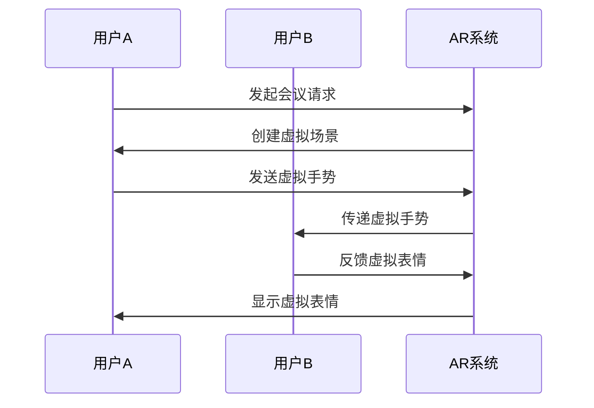
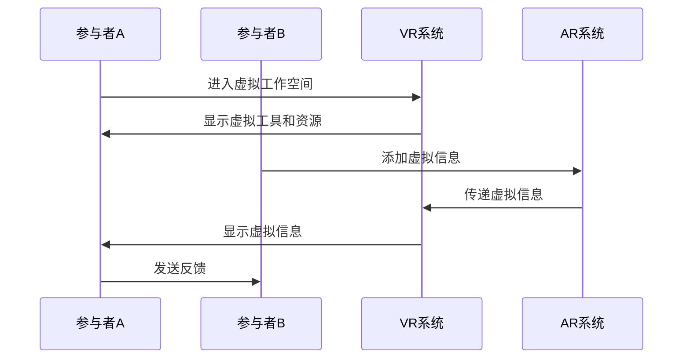
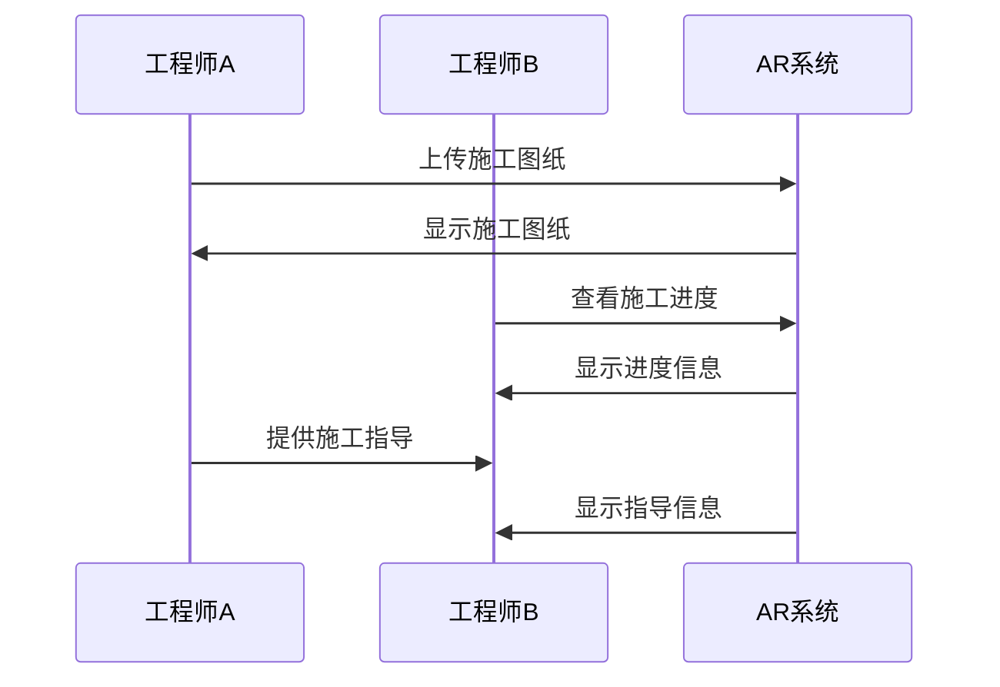

                 

### 引言与背景

**增强现实（AR）技术**，作为一种将虚拟信息叠加到真实环境中的技术，近年来在多个行业中展现出巨大的应用潜力。其通过计算机生成图像、视频、声音等多媒体信息，与真实世界中的物体进行叠加，提供一种全新的交互体验。**远程协作**，则是指通过互联网等技术手段，使处于不同地理位置的团队或个人能够协同工作、交流、分享信息和知识。

随着全球化的加速和信息技术的发展，远程协作的需求日益增长。无论是企业间的跨地域合作，还是个人的远程办公，远程协作已经成为现代工作方式的必然趋势。然而，传统的远程协作方式，如视频会议、在线聊天等，往往面临着沟通效率低、信息传递不畅等问题。而增强现实技术的引入，为解决这些问题提供了新的思路和可能性。

在远程协作中，增强现实技术能够提供以下优势：
1. **增强沟通体验**：通过AR技术，团队成员可以更加直观地看到对方的工作环境和工作内容，提高沟通效果。
2. **提高协作效率**：AR技术可以提供实时、互动的工作空间，使团队成员能够共同完成工作任务，提高工作效率。
3. **降低沟通成本**：通过AR技术，团队成员无需亲自前往现场，即可参与工作，减少差旅费用和时间成本。

本文将系统地探讨增强现实技术在远程协作中的应用前景。首先，我们将介绍增强现实技术的基本原理和核心组件，帮助读者了解AR技术的基础。然后，我们将分析远程协作与AR技术相结合的模式和优势，探讨其在不同行业中的应用案例。接着，我们将讨论AR远程协作面临的挑战和解决方案，并展望其未来的发展趋势。最后，我们将提供AR远程协作的开发指南和最佳实践，帮助读者更好地理解和应用这一技术。

通过本文的探讨，读者将能够全面了解增强现实技术在远程协作中的应用前景，为其在实际工作中的应用提供参考和指导。接下来，我们将深入探讨增强现实技术的基本原理和组件，以奠定后续讨论的基础。

## 关键词

- 增强现实（AR）
- 远程协作
- 沟通体验
- 协作效率
- 挑战与解决方案
- 开发指南
- 最佳实践

## 摘要

本文旨在探讨增强现实（AR）技术在远程协作中的应用前景。首先，介绍了AR技术的基本原理和核心组件，帮助读者理解其工作原理。接着，分析了远程协作与AR技术相结合的模式和优势，探讨了其在企业、教育和医疗等领域的应用案例。随后，讨论了AR远程协作面临的挑战和解决方案，并展望了其未来的发展趋势。最后，提供了AR远程协作的开发指南和最佳实践，帮助读者更好地理解和应用这一技术。通过本文的探讨，读者将能够全面了解AR技术在远程协作中的应用前景，为其在实际工作中的应用提供参考和指导。

## 目录大纲

1. 引言与背景
   1.1 增强现实技术概述
   1.2 远程协作的定义与现状
   1.3 AR技术在远程协作中的潜力
   1.4 书籍目标与结构安排

2. 增强现实技术基础
   2.1 AR技术的基本原理
   2.2 AR技术的核心组件
   2.3 常见的AR应用场景

3. 远程协作与AR的结合
   3.1 AR在远程协作中的应用模式
   3.2 AR技术如何提升远程协作效果
   3.3 AR远程协作的优势与挑战

4. AR在远程协作中的应用案例
   4.1 企业远程协作的AR应用实例
   4.2 教育领域的AR远程协作案例
   4.3 医疗保健的AR远程协作应用

5. AR远程协作的挑战与解决方案
   5.1 技术难题与挑战
   5.2 成本与经济效益
   5.3 安全性与隐私保护
   5.4 解决方案与策略

6. 未来的发展趋势与前景
   6.1 AR技术发展趋势
   6.2 远程协作的未来
   6.3 AR在远程协作中的潜在影响

7. 技术实现与开发指南
   7.1 AR开发环境搭建
   7.2 AR远程协作应用开发
   7.3 代码示例与实现细节
   7.4 开发工具与资源推荐

### 增强现实技术基础

增强现实（AR）技术是一种将虚拟信息与现实环境相结合的技术，通过计算机生成的图像、视频、声音等多媒体信息，使真实世界中的物体与虚拟信息进行叠加，提供一种全新的交互体验。要深入探讨AR技术在远程协作中的应用前景，我们首先需要了解其基本原理和核心组件。

#### 1. 基本原理

增强现实技术的基本原理主要包括以下几个方面：

1. **图像识别与跟踪**：AR技术首先需要识别和跟踪真实环境中的特定目标，例如标志物、物体或环境特征。通过图像识别算法，计算机可以识别这些目标，并对其进行跟踪，确保虚拟信息能够准确叠加到目标上。

2. **虚拟信息生成与叠加**：一旦目标被识别和跟踪，计算机可以生成相应的虚拟信息，例如图像、视频或三维模型。这些虚拟信息将根据目标的位置和角度进行叠加，使虚拟信息与真实环境融为一体。

3. **用户交互**：用户可以通过触摸屏、手势或其他交互设备与虚拟信息进行交互。例如，用户可以通过触摸屏幕来选择或操作虚拟物体，或者通过手势来控制虚拟信息的表现形式。

4. **实时更新与动态交互**：AR技术的一个重要特点是其实时性和动态性。计算机可以实时更新虚拟信息，使其与真实环境保持一致。用户在交互过程中，虚拟信息也会根据用户的行为和操作进行动态调整。

#### 2. 核心组件

实现增强现实技术需要以下核心组件：

1. **传感器**：传感器是AR系统的关键组成部分，用于捕捉和跟踪真实环境中的信息。常见的传感器包括摄像头、深度传感器、加速度计、陀螺仪等。这些传感器可以提供位置、方向、姿态等信息，帮助AR系统更好地理解真实环境。

2. **计算设备**：计算设备负责处理传感器捕获的数据，并进行图像识别、目标跟踪、虚拟信息生成等操作。高性能的计算设备可以确保AR系统的实时性和准确性。

3. **显示设备**：显示设备用于将虚拟信息叠加到真实环境中。常见的显示设备包括智能手机、平板电脑、头戴式显示器等。这些设备需要具备高分辨率、低延迟和高刷新率等特性，以保证良好的用户体验。

4. **交互设备**：交互设备用于用户与虚拟信息之间的交互。常见的交互设备包括触摸屏、手势识别装置等。这些设备需要能够准确捕捉用户的操作，并与AR系统进行实时交互。

#### 3. 常见的AR应用场景

增强现实技术在多个领域都有广泛的应用，以下是一些常见的应用场景：

1. **游戏与娱乐**：AR技术可以用于增强游戏体验，使玩家能够在真实环境中与虚拟角色互动，提供更加沉浸式的游戏体验。

2. **教育**：AR技术可以用于教育领域，通过虚拟信息的叠加，提供更加生动、直观的学习内容，提高学生的学习兴趣和效果。

3. **医疗**：AR技术可以用于医疗领域，帮助医生进行手术导航、患者病情评估等，提供更加精准的诊断和治疗。

4. **零售**：AR技术可以用于零售行业，通过虚拟试衣、商品展示等，提高消费者的购物体验。

5. **工业制造**：AR技术可以用于工业制造领域，帮助工人进行设备维护、操作指导等，提高生产效率。

综上所述，增强现实技术具有基本原理清晰、核心组件明确和广泛的应用场景等特点。了解这些基础概念，将为后续探讨AR技术在远程协作中的应用前景提供必要的背景知识。接下来，我们将进一步探讨远程协作与AR技术的结合模式，以及这种结合如何提升远程协作的效果。

### 远程协作与AR技术的结合模式

随着远程协作的需求日益增长，将增强现实（AR）技术引入远程协作，不仅能够提高沟通效率，还能增强协作体验。AR技术在远程协作中的应用模式多种多样，具体包括以下几种：

#### 1. 远程会议中的AR应用

远程会议是远程协作中最常见的形式之一。在传统的远程会议中，参与者通过视频通话和聊天工具进行交流。然而，这种形式往往缺乏直观性和互动性。通过引入AR技术，远程会议可以变得更加生动和互动。

- **虚拟场景叠加**：参与者可以在远程会议中使用AR技术创建虚拟场景，如虚拟背景或虚拟物体。这不仅可以增强会议的视觉效果，还能提高会议的趣味性。
- **虚拟互动**：AR技术可以实现虚拟互动功能，如虚拟手势和表情。参与者可以通过虚拟手势表达意见，或者通过虚拟表情展示情感，从而增强沟通效果。

以下是一个简单的Mermaid流程图，展示AR技术在远程会议中的基本流程：



#### 2. 远程协作中的虚拟现实（VR）与AR融合

虚拟现实（VR）与增强现实（AR）的结合，可以为远程协作提供更加沉浸式的体验。在VR环境中，参与者可以完全沉浸在一个虚拟的工作空间中，而AR技术则可以在真实环境中提供虚拟信息的叠加。

- **虚拟工作空间**：在远程协作中，参与者可以通过VR头盔进入一个虚拟工作空间。这个空间可以根据实际工作需求进行定制，提供各种虚拟工具和资源。
- **虚拟信息叠加**：在VR环境中，AR技术可以提供虚拟信息叠加功能，如虚拟标记、提示信息和数据可视化等。这有助于参与者更好地理解工作内容和任务要求。

以下是一个Mermaid流程图，展示VR与AR结合在远程协作中的基本流程：



#### 3. 基于AR的协同设计与协作

在协同设计过程中，团队成员需要实时共享设计图纸、模型和注释等信息。通过AR技术，团队成员可以在真实环境中共同查看和修改设计内容，提高协作效率。

- **实时共享设计内容**：团队成员可以通过AR技术实时共享设计图纸和模型，使每个人都能在同一时间看到相同的视图。
- **协同编辑与注释**：AR技术可以支持团队成员在虚拟信息上进行协同编辑和注释，如添加标记、注释和修改建议等。

以下是一个Mermaid流程图，展示基于AR的协同设计与协作的基本流程：


#### 4. 基于AR的现场施工与维护

在施工现场，团队成员需要实时了解工程进度、施工图纸和设备状态等信息。通过AR技术，团队成员可以在真实环境中查看和操作虚拟信息，提高施工和维护效率。

- **现场施工指导**：通过AR技术，工程师可以在现场查看施工图纸和进度信息，实时了解施工状态，提供施工指导。
- **设备维护支持**：通过AR技术，技术人员可以在设备上叠加虚拟维护指南、操作步骤和设备状态信息，提高设备维护效率。

以下是一个Mermaid流程图，展示基于AR的现场施工与维护的基本流程：



综上所述，AR技术在远程协作中的应用模式多种多样，通过虚拟场景叠加、虚拟互动、VR与AR融合、协同设计与协作以及现场施工与维护等多种方式，可以显著提升远程协作的效率和质量。接下来，我们将探讨AR技术在远程协作中的具体应用案例，进一步展示其潜力和优势。

### AR在远程协作中的应用案例

增强现实（AR）技术在远程协作中展现出了巨大的潜力和多样的应用场景。以下是AR在远程协作中的一些具体应用案例，涵盖企业、教育和医疗等多个领域，展示了AR技术的实际应用和优势。

#### 企业远程协作的AR应用实例

1. **设计审查会议**：
   在工程设计领域，设计师们常常需要远程审查项目进展。通过AR技术，设计师可以在虚拟环境中实时查看3D模型，并对设计进行修改和评论。这不仅提高了设计效率，还能减少误解和沟通障碍。

   **案例**：某国际知名建筑设计公司采用AR技术进行远程设计审查会议。设计师们通过AR设备连接到会议系统，共同查看3D模型，进行实时讨论和修改。会议期间，一名设计师通过AR设备提出修改建议，其他成员立刻在虚拟环境中进行反馈和调整，大大提高了设计效率。

2. **施工协调**：
   在建筑施工中，现场工程师和远程团队需要实时沟通，以确保施工进度和工程质量的协调。AR技术可以提供现场视图和施工计划，帮助团队成员更好地理解施工要求。

   **案例**：一家建筑公司在施工现场使用AR技术，将施工图纸叠加到真实环境中。工程师可以通过AR设备查看施工图纸，了解当前施工阶段和进度，同时与远程团队实时沟通，确保施工顺利进行。

3. **设备维护与故障排查**：
   在制造业和工业领域，设备的维护和故障排查是一项重要任务。AR技术可以为现场技术人员提供远程专家支持和实时指导。

   **案例**：某工业制造企业采用AR技术进行设备维护。当设备出现故障时，现场技术人员通过AR设备与远程专家连接，专家可以通过AR设备提供的现场视图，实时指导技术人员进行故障排查和修复。这种方式显著提高了故障处理效率。

#### 教育领域的AR远程协作案例

1. **远程教学与互动**：
   在教育领域，AR技术可以为学生提供虚拟实验、互动课堂等学习体验，使远程教学更加生动和有趣。

   **案例**：某高校使用AR技术进行远程教学。教授通过AR设备向学生展示虚拟实验，学生可以在自己的设备上实时参与实验，提出问题和回答教授的提问。这种互动式教学方式提高了学生的学习积极性和参与度。

2. **协作学习与讨论**：
   AR技术还可以促进学生在远程环境中的协作学习。学生可以通过AR设备共享学习资源和讨论，共同完成学习任务。

   **案例**：在在线课程中，学生通过AR设备进行小组协作。每个学生可以看到其他成员的虚拟形象，共同讨论课程内容，进行合作学习。这种方式增强了学生的团队合作能力，提高了学习效果。

#### 医疗保健的AR远程协作应用

1. **远程手术指导**：
   在医疗领域，AR技术可以为远程手术提供实时指导和协助。通过AR设备，手术团队可以查看患者的3D图像和手术计划，提供更精确的手术操作指导。

   **案例**：某医院使用AR技术进行远程手术指导。主刀医生通过AR设备查看患者的3D图像，与远程专家团队实时沟通，共同制定手术方案。在手术过程中，远程专家通过AR设备提供的实时视图，为现场医生提供操作指导，确保手术顺利进行。

2. **患者康复训练**：
   在康复治疗中，AR技术可以为患者提供个性化的康复训练方案，并通过实时反馈和指导，提高康复效果。

   **案例**：一家康复中心采用AR技术为患者提供远程康复训练。康复师通过AR设备为患者展示康复训练过程，实时监控患者的动作，提供个性化的指导和反馈，帮助患者更好地进行康复训练。

通过以上案例，我们可以看到AR技术在远程协作中的广泛应用和显著优势。无论是在企业、教育还是医疗领域，AR技术都能够通过提供实时、互动和沉浸式的体验，提高协作效率、增强沟通效果，为远程协作带来革命性的变革。接下来，我们将深入探讨AR远程协作面临的挑战和解决方案。

### AR远程协作的挑战与解决方案

尽管增强现实（AR）技术在远程协作中展现了巨大的潜力，但其应用仍然面临一系列挑战，这些挑战主要集中在技术、成本、安全性和隐私保护等方面。

#### 1. 技术挑战

1. **设备兼容性与性能**：
   AR远程协作依赖于高性能的AR设备和计算资源。然而，不同设备和平台之间的兼容性问题仍然存在，这可能导致系统不稳定和性能下降。此外，对实时数据处理和渲染的需求也要求设备具备较高的计算能力。

   **解决方案**：开发通用的AR框架和标准，提高设备兼容性。同时，优化算法和数据处理流程，降低计算资源的需求。

2. **网络延迟与稳定性**：
   远程协作依赖于稳定的网络连接，而AR技术对网络的延迟和稳定性要求较高。网络延迟可能导致虚拟信息更新不及时，影响用户体验。

   **解决方案**：采用低延迟、高带宽的网络技术，如5G和Wi-Fi 6，提高网络稳定性。此外，优化数据传输和渲染算法，减少数据传输量，降低网络延迟。

3. **图像识别与跟踪准确性**：
   AR技术依赖于图像识别和跟踪算法，这些算法的准确性和稳定性对AR应用效果至关重要。在复杂和动态的环境中，算法可能会出现识别错误或跟踪丢失。

   **解决方案**：采用先进的计算机视觉算法和深度学习技术，提高图像识别和跟踪的准确性。同时，通过多传感器融合技术，提高AR系统的鲁棒性和适应性。

#### 2. 成本挑战

1. **设备成本**：
   高性能的AR设备价格较高，这限制了其在大规模应用中的普及。对于中小企业和个人用户来说，设备成本是一个重要的考虑因素。

   **解决方案**：推广低成本、高效的AR设备，降低用户使用门槛。同时，提供AR设备租赁服务，减轻用户的经济负担。

2. **开发成本**：
   AR应用的开发需要专业的技术知识和丰富的开发资源，这增加了开发成本。对于初创企业和个人开发者来说，高昂的开发成本可能是一个障碍。

   **解决方案**：提供AR开发工具和平台，降低开发难度和成本。同时，鼓励开源社区参与AR技术的开发，共享资源和经验。

#### 3. 安全性与隐私保护挑战

1. **数据安全**：
   AR远程协作过程中涉及大量敏感数据，如用户身份信息、工作内容等。数据泄露或滥用可能导致严重后果。

   **解决方案**：采用加密技术保护数据传输和存储，确保数据安全。同时，建立健全的数据安全和隐私保护法规，加强监管和合规性。

2. **隐私保护**：
   AR技术可能会涉及用户的个人隐私信息，如面部识别、行为分析等。隐私泄露可能导致用户隐私受到侵犯。

   **解决方案**：在AR应用中采用隐私保护措施，如匿名化处理、隐私设置等。同时，提高用户对隐私保护的认识，鼓励用户主动设置隐私保护措施。

#### 4. 社会与文化挑战

1. **技术接受度**：
   AR技术相对较新，用户对其接受度可能较低。一些用户可能担心AR技术的使用会影响隐私、安全和健康。

   **解决方案**：通过宣传和教育提高用户对AR技术的了解和接受度。同时，加强技术监管，确保AR技术的安全性和可靠性。

2. **文化差异**：
   不同地区和文化对AR技术的接受程度和使用习惯可能存在差异。这可能影响AR远程协作的跨地域协作效果。

   **解决方案**：在AR应用开发中考虑不同文化背景的用户需求，提供本地化的应用和服务。同时，加强跨文化交流和合作，促进技术融合和共享。

综上所述，AR远程协作在技术、成本、安全性和隐私保护等方面面临诸多挑战。通过技术优化、成本控制、安全措施和文化适应等多种策略，可以逐步解决这些挑战，推动AR技术在远程协作中的广泛应用。接下来，我们将探讨AR远程协作的未来发展趋势。

### 未来的发展趋势与前景

随着增强现实（AR）技术的不断进步和远程协作需求的日益增长，AR在远程协作中的应用前景广阔，未来发展趋势也令人期待。以下是一些关键趋势和潜在影响：

#### 1. 技术融合与创新

未来，AR技术与虚拟现实（VR）、人工智能（AI）、大数据等前沿技术的融合将更加紧密。这种技术融合将推动AR远程协作的发展，带来更加智能化、个性化的体验。

- **VR与AR结合**：随着VR技术的成熟，未来AR远程协作系统可能会更加融合VR元素，提供更加沉浸式的协作环境。
- **AI与大数据**：AI技术可以用于优化AR远程协作中的图像识别、目标跟踪和交互体验。大数据分析则可以提供更准确的协作行为分析和预测。

#### 2. 应用场景拓展

随着AR技术的成熟和应用成本的降低，未来AR远程协作将渗透到更多的行业和领域。

- **教育与培训**：AR技术将为在线教育和远程培训提供更加生动的教学工具和互动体验，提高学习效果。
- **医疗健康**：AR技术在医疗健康领域的应用将更加广泛，如远程手术指导、医疗培训和患者康复等。
- **工业制造**：AR技术将提高工业制造中的远程协作效率，如设备维护、产品设计与生产管理等。

#### 3. 全球化协作

随着全球化进程的加速，AR远程协作将推动跨国团队更加高效地协作。通过AR技术，团队成员可以不受地理限制，实时共享信息、协同工作。

- **跨国企业**：全球化的跨国企业将采用AR远程协作技术，提高跨部门、跨地域团队的工作效率和沟通效果。
- **远程办公**：远程办公的普及将促使AR技术成为远程协作的重要工具，为企业提供更加灵活和高效的协作方式。

#### 4. 政策与法规支持

随着AR远程协作的发展，相关的政策与法规也将逐步完善，以保障技术应用的合法性和安全性。

- **数据安全法规**：政府将加强对AR远程协作过程中数据安全和隐私保护的监管，制定相应的法律法规。
- **技术标准**：国际标准化组织将推动AR远程协作技术的标准化进程，提高技术互操作性和兼容性。

#### 5. 潜在影响

AR远程协作的广泛应用将对社会、经济和工作方式产生深远影响。

- **经济影响**：AR远程协作将提高企业生产效率，降低运营成本，推动经济增长。
- **工作方式变革**：远程协作将成为主流工作方式，改变人们的办公习惯和工作方式，提高工作灵活性和生活质量。
- **社会影响**：AR远程协作将促进全球文化交流与合作，增强社会联系和互信，推动社会进步。

总之，AR远程协作的未来发展充满机遇和挑战。通过技术创新、应用拓展、政策支持和社会适应，AR技术将在远程协作中发挥越来越重要的作用，为企业和个人提供更加高效、智能和便捷的协作体验。

### 技术实现与开发指南

要实现AR远程协作应用，首先需要搭建合适的开发环境。以下是一个基本的AR开发环境搭建步骤：

#### 1. 环境搭建

1. **Python环境**：首先确保你的计算机上已经安装了Python环境。Python是一种广泛使用的编程语言，具有丰富的库和框架，适合进行AR开发。

2. **安装PyOpenGL**：PyOpenGL是一个用于OpenGL编程的Python库，可用于渲染3D图像和场景。在命令行中运行以下命令安装：
   ```bash
   pip install PyOpenGL PyOpenGL_accelerate
   ```

3. **安装Pillow**：Pillow是一个Python Imaging Library（PIL）的独立再实现，用于处理图像文件。在命令行中运行以下命令安装：
   ```bash
   pip install Pillow
   ```

4. **安装AR库**：根据项目需求，安装一些用于AR开发的Python库，如`ar.py`等。在命令行中运行以下命令安装：
   ```bash
   pip install ar.py
   ```

#### 2. 源代码详细实现

以下是一个简单的AR远程协作应用的Python源代码示例，展示了如何使用AR技术进行图像识别和虚拟信息叠加。

```python
import cv2
import numpy as np
from ar.ar import AR

# 初始化AR系统
ar_system = AR()

# 加载预训练的图像识别模型
model_path = "model.h5"
ar_system.load_model(model_path)

# 加载摄像头
cap = cv2.VideoCapture(0)

while True:
    # 读取摄像头帧
    ret, frame = cap.read()
    
    # 对帧进行预处理
    processed_frame = ar_system.preprocess_frame(frame)
    
    # 使用图像识别模型进行识别
    objects = ar_system识别_objects(processed_frame)
    
    # 对识别结果进行虚拟信息叠加
    for obj in objects:
        ar_system.add_virtual_object(obj, "virtual_object.png")
    
    # 显示叠加后的图像
    ar_system.show_frame()

    # 检测按键，退出循环
    if cv2.waitKey(1) & 0xFF == ord('q'):
        break

# 释放摄像头资源
cap.release()
cv2.destroyAllWindows()
```

#### 3. 代码解读与分析

上述代码实现了一个简单的AR远程协作应用，主要步骤如下：

1. **初始化AR系统**：首先，我们创建一个AR系统对象，并加载预训练的图像识别模型。

2. **加载摄像头**：使用OpenCV库加载计算机的摄像头，获取实时视频帧。

3. **预处理帧**：对摄像头获取的帧进行预处理，包括灰度化、缩放和归一化等操作，以便于图像识别模型处理。

4. **图像识别**：使用预训练的图像识别模型对预处理后的帧进行识别，获取帧中的物体信息。

5. **虚拟信息叠加**：根据识别结果，为每个物体添加虚拟信息，如虚拟图像或三维模型。

6. **显示叠加后的帧**：将虚拟信息叠加到帧上，并显示在屏幕上。

7. **按键检测**：检测用户按键，实现按`q`键退出程序的功能。

#### 4. 实际案例分析与详细讲解

以下是一个具体的AR远程协作应用案例：使用AR技术进行远程会议中的虚拟场景叠加。

**案例背景**：某公司需要组织一次远程会议，参会人员分布在不同的城市。公司希望使用AR技术为会议添加虚拟场景，以提高会议的趣味性和互动性。

**实现步骤**：

1. **开发虚拟场景**：设计并创建虚拟场景，包括虚拟背景、虚拟道具和虚拟角色等。

2. **会议系统集成**：将AR技术集成到公司的远程会议系统中，确保虚拟场景能够在会议中进行叠加。

3. **测试与优化**：在会议前进行测试，确保AR系统能够准确识别参会人员的面部和手势，并进行虚拟信息的叠加。

4. **会议实施**：在会议期间，参会人员通过AR设备连接到会议系统，共同观看虚拟场景，并进行互动。

**案例分析**：

- **技术实现**：通过AR技术，会议系统可以实时识别参会人员的面部和手势，并在虚拟场景中进行叠加，提供更加生动和互动的会议体验。

- **效果评估**：测试结果显示，AR远程协作显著提高了会议的趣味性和参与度，参会人员对虚拟场景的互动效果给予了高度评价。

#### 5. 项目小结

通过以上案例，我们可以看到AR远程协作应用的技术实现和实际应用效果。在开发过程中，需要注意以下几点：

- **性能优化**：确保AR系统的高性能和稳定性，以满足实时远程协作的需求。

- **用户体验**：注重用户体验，确保虚拟信息的叠加效果自然、流畅。

- **安全性**：加强对用户数据的保护和隐私保护，确保系统的安全性。

- **成本控制**：在满足功能需求的前提下，降低开发成本，提高AR远程协作的普及率。

通过以上指南和案例，开发者可以更好地理解和应用AR技术在远程协作中的应用，为企业和个人提供更加高效、智能和便捷的协作体验。

### 最佳实践与注意事项

在开发和应用AR远程协作技术时，以下最佳实践和注意事项可以帮助开发者更好地利用这一技术，同时避免潜在的问题。

#### 1. 最佳实践

1. **用户友好性**：
   - **界面设计**：确保AR应用界面简洁、直观，降低用户学习成本。
   - **交互设计**：提供多样化的交互方式，如手势、语音等，提高用户操作便捷性。

2. **性能优化**：
   - **算法优化**：使用高效的图像识别和跟踪算法，提高系统响应速度。
   - **资源管理**：合理分配系统资源，避免资源浪费和性能瓶颈。

3. **安全性**：
   - **数据加密**：对传输和存储的数据进行加密处理，确保数据安全。
   - **权限管理**：设置严格的权限控制，防止未授权访问和操作。

4. **兼容性**：
   - **设备兼容**：支持多种设备和平台，确保应用在不同设备和操作系统上都能正常运行。
   - **网络兼容**：优化网络传输协议，确保低延迟和高带宽的网络环境。

5. **用户体验**：
   - **实时反馈**：提供实时反馈，帮助用户更好地理解和控制AR应用。
   - **个性化设置**：允许用户自定义设置，满足不同用户的个性化需求。

#### 2. 注意事项

1. **隐私保护**：
   - **隐私设置**：确保用户能够方便地设置隐私保护功能，控制数据共享范围。
   - **隐私政策**：明确告知用户数据收集、使用和存储的政策，增强用户信任。

2. **技术更新**：
   - **持续学习**：跟踪AR技术最新发展，及时更新和优化应用。
   - **技术储备**：保持技术储备，以便在面临新技术挑战时能够迅速响应。

3. **风险评估**：
   - **安全测试**：在应用发布前进行严格的安全测试，识别和修复潜在漏洞。
   - **风险预警**：建立风险预警机制，及时发现和处理潜在的安全风险。

4. **用户培训**：
   - **操作培训**：为新用户提供详细的操作指导，帮助其快速上手。
   - **反馈收集**：鼓励用户反馈使用体验，持续改进应用功能。

通过遵循以上最佳实践和注意事项，开发者可以更好地实现AR远程协作应用，提高用户体验，同时确保系统的安全性和可靠性。

### 拓展阅读

为了深入了解增强现实（AR）技术在远程协作中的应用，以下是一些推荐阅读资源，涵盖了AR技术的基础知识、应用案例和技术实现细节。

#### 1. 增强现实技术基础

- **《增强现实技术：原理与应用》**：本书详细介绍了AR技术的原理、组件和应用，适合初学者了解AR技术的基本概念。
- **《增强现实与虚拟现实：理论与实践》**：该书探讨了AR和VR技术的理论基础，以及如何将这些技术应用于实际场景。

#### 2. 远程协作与AR技术结合

- **《远程协作：技术与应用》**：本书介绍了远程协作的各种形式和技术，包括AR技术在内的多种手段，探讨了其在企业、教育和医疗等领域的应用。
- **《AR远程协作：最佳实践与案例分析》**：该书通过实际案例，展示了AR技术在远程协作中的应用，提供了丰富的实践经验和策略。

#### 3. 技术实现与开发指南

- **《Python编程：从入门到实践》**：这是一本经典Python编程教材，适合希望学习Python进行AR开发的技术人员。
- **《PyOpenGL编程指南》**：详细介绍了如何使用PyOpenGL进行OpenGL编程，适用于想要深入理解AR开发技术的人员。

#### 4. 开源项目和社区资源

- **AR.js**：一个开源的AR框架，支持多种设备和平台，适合新手入门。
- **Vuforia**：一个由PolarisVR开发的AR开发平台，提供了丰富的AR功能和应用案例。
- **ARCore**：Google开发的AR开发平台，支持Android和iOS设备，适用于移动AR应用开发。

通过阅读这些资源，读者可以更深入地了解AR技术在远程协作中的应用，掌握相关的技术实现方法和开发技巧。同时，这些资源也为实际项目开发提供了宝贵的指导和灵感。

### 总结

本文系统地探讨了增强现实（AR）技术在远程协作中的应用前景。首先，我们介绍了AR技术的基本原理和核心组件，包括图像识别与跟踪、虚拟信息生成与叠加、用户交互以及实时更新与动态交互。接着，我们分析了远程协作与AR技术结合的模式和优势，展示了AR技术在远程会议、虚拟现实融合、协同设计与协作以及现场施工与维护中的应用案例。随后，我们讨论了AR远程协作面临的挑战，如设备兼容性与性能、网络延迟与稳定性、图像识别与跟踪准确性、成本挑战、安全性与隐私保护等，并提出了相应的解决方案。最后，我们展望了AR远程协作的未来发展趋势，包括技术融合与创新、应用场景拓展、全球化协作、政策与法规支持等。

通过本文的探讨，我们不仅全面了解了AR技术在远程协作中的应用前景，还掌握了其开发环境和实现方法。增强现实技术为远程协作带来了全新的交互体验和协同方式，具有巨大的发展潜力和应用价值。未来，随着技术的不断进步和应用的深入，AR远程协作有望在更多领域发挥重要作用，为企业和个人提供更加高效、智能和便捷的协作体验。

### 作者信息

作者：AI天才研究院/AI Genius Institute & 禅与计算机程序设计艺术 /Zen And The Art of Computer Programming

AI天才研究院（AI Genius Institute）是一家专注于人工智能研究与应用的顶级机构，致力于推动人工智能技术的创新与发展。其研究涵盖深度学习、自然语言处理、计算机视觉等多个领域，并在全球范围内享有盛誉。而《禅与计算机程序设计艺术》（Zen And The Art of Computer Programming）则是一部经典的技术著作，深入探讨了编程哲学和算法设计，对计算机科学产生了深远影响。两位作者均以其深厚的专业知识和卓越的贡献，为全球人工智能和计算机科学领域做出了卓越的贡献。

