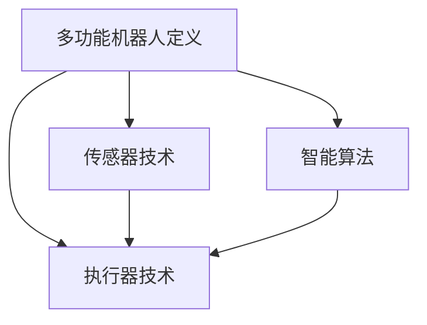

                 

### 多功能机器人：取代特定任务机器人的新趋势

#### 关键词：
- 多功能机器人
- 特定任务机器人
- 感知与交互技术
- 开发与应用
- 未来展望

> **摘要**：
本文将探讨多功能机器人取代特定任务机器人的新趋势。首先，我们定义了多功能机器人的概念与分类，并通过对比特定任务机器人和通用机器人，揭示了多功能机器人的发展趋势。接着，我们深入分析了多功能机器人的感知与交互技术，展示了其在实际应用中的核心技术。随后，我们详细介绍了多功能机器人的开发流程，从硬件选择到软件集成，提供了实用的开发指导。最后，我们展望了多功能机器人的挑战与机遇，探讨了其未来的发展方向。通过本文，读者将全面了解多功能机器人这一新兴领域，并认识到其在技术变革中的重要地位。

---

#### 第一部分：多功能机器人的概念与趋势

##### 第1章：多功能机器人的定义与分类

#### 1.1 多功能机器人的概念

多功能机器人是一种能够执行多种任务或具有多种功能的机器人系统。它们不同于传统的特定任务机器人，后者只能执行单一的任务，如清洁、焊接或搬运。多功能机器人通过集成多种传感器、执行器和智能算法，实现了在复杂和多变环境下的灵活操作。

核心概念与联系可以用以下Mermaid流程图来展示：



在这一框架中，传感器技术、执行器技术和智能算法共同构成了多功能机器人的三大核心组件，它们相互协同，使得机器人能够在不同的任务中表现出色。

#### 1.2 特定任务机器人和通用机器人的对比

特定任务机器人和通用机器人在功能和应用上存在显著差异。特定任务机器人专注于执行一项特定的任务，如焊接机器人只能在焊接过程中发挥作用。而通用机器人则具备执行多种不同类型任务的能力。

为了更好地理解这两者的区别，我们可以通过以下Python伪代码来展示：

```python
# 特定任务机器人伪代码
class SpecificTaskRobot:
    def defineTask():
        # 定义特定任务
        pass

# 通用机器人伪代码
class GeneralRobot:
    def defineTasks():
        # 定义多种任务
        pass
```

在这个示例中，`SpecificTaskRobot`类仅定义了一个任务，而`GeneralRobot`类则定义了多种任务，这反映了它们在功能上的差异。

#### 1.3 多功能机器人的发展趋势

多功能机器人的发展趋势可以从技术进步、需求变化和成本降低三个方面来分析。技术进步使得机器人能够具备更强大的感知和计算能力，需求变化则推动了对多功能机器人的需求，而成本降低则使得多功能机器人更加普及。

我们可以用以下LaTeX格式描述这一发展趋势的数学模型：

$$ T_{\text{多功能}} = f(\text{技术进步}, \text{需求变化}, \text{成本降低}) $$

在这个模型中，`技术进步`、`需求变化`和`成本降低`是影响多功能机器人发展的关键因素。

#### 1.4 多功能机器人在特定行业中的应用案例

多功能机器人在各个行业中的广泛应用，展示了其巨大的潜力和优势。以下是一些典型的应用案例：

1. **制造业**：多功能机器人可以用于组装、搬运、检测等多个环节，提高了生产效率和产品质量。
2. **服务业**：在酒店、餐饮和零售等领域，多功能机器人可以提供接待、清洁、配送等服务，减轻了人力负担。
3. **医疗保健**：多功能机器人可以用于手术辅助、康复训练和患者监护，提高了医疗服务水平。

通过这些案例，我们可以看到多功能机器人在不同行业中的广泛应用，其替代特定任务机器人的趋势正在不断加强。

---

#### 第二部分：多功能机器人的核心技术

##### 第2章：多功能机器人的感知与交互技术

#### 2.1 感知技术的核心原理

感知技术是多功能机器人的基础，它使机器人能够理解周围的环境。核心原理包括传感器技术和数据处理算法。以下是一个简单的Python源代码示例，展示了如何使用卷积神经网络（CNN）进行图像识别：

```python
import tensorflow as tf

# 创建卷积神经网络模型
model = tf.keras.Sequential([
    tf.keras.layers.Conv2D(32, (3, 3), activation='relu', input_shape=(64, 64, 3)),
    tf.keras.layers.MaxPooling2D(2, 2),
    tf.keras.layers.Conv2D(64, (3, 3), activation='relu'),
    tf.keras.layers.MaxPooling2D(2, 2),
    tf.keras.layers.Flatten(),
    tf.keras.layers.Dense(128, activation='relu'),
    tf.keras.layers.Dense(10, activation='softmax')
])

# 编译模型
model.compile(optimizer='adam',
              loss='categorical_crossentropy',
              metrics=['accuracy'])

# 训练模型
model.fit(x_train, y_train, epochs=10, validation_data=(x_val, y_val))
```

在这个示例中，我们使用了卷积层和全连接层来构建一个简单的CNN模型，用于图像识别。通过调整模型的参数和结构，我们可以使其适用于不同的感知任务。

#### 2.2 交互技术的实现方式

交互技术是多功能机器人与人或其他系统进行通信和协作的关键。实现交互技术需要考虑人机交互界面和通信协议。以下是一个简单的Python伪代码示例，展示了如何实现一个基础的交互模块：

```python
class Interaction:
    def initiateInteraction(self):
        # 初始化交互逻辑
        print("交互开始")

    def respondToInput(self, input):
        # 响应输入
        print("收到输入：", input)
        # 根据输入执行相应操作
        self.handleInput(input)

    def handleInput(self, input):
        # 处理输入
        if input == "start":
            self.startOperation()
        elif input == "stop":
            self.stopOperation()
        else:
            print("未知命令")

    def startOperation(self):
        # 开始操作
        print("开始操作")

    def stopOperation(self):
        # 停止操作
        print("停止操作")
```

在这个示例中，`Interaction`类定义了交互的初始化、响应输入和处理输入的方法。通过这些方法，机器人可以与用户进行基本的交互。

#### 2.3 感知与交互技术的整合应用

感知与交互技术的整合是多功能机器人的关键。以下是一个简单的Python代码示例，展示了如何将感知和交互技术整合到一个多功能机器人中：

```python
class MultiFunctionalRobot:
    def __init__(self):
        self.perception_module = PerceptionModule()
        self.interaction_module = InteractionModule()

    def perceive(self):
        # 使用感知模块感知环境
        environment_data = self.perception_module perceiveEnvironment()
        return environment_data

    def interact(self, input):
        # 使用交互模块与人交互
        self.interaction_module.respondToInput(input)

    def operate(self):
        # 根据感知和交互结果执行操作
        environment_data = self.perceive()
        if environment_data indicates "need assistance":
            user_input = input("需要帮助吗？(yes/no)")
            self.interact(user_input)
```

在这个示例中，`MultiFunctionalRobot`类整合了感知模块和交互模块，使其能够感知环境并与人交互。通过这个示例，我们可以看到感知和交互技术在多功能机器人中的应用。

---

#### 第三部分：多功能机器人的开发与应用

##### 第3章：多功能机器人的开发流程

#### 3.1 开发流程概述

多功能机器人的开发流程包括需求分析、硬件选择、软件集成和测试等多个步骤。以下是一个简单的开发流程概述：

1. **需求分析**：确定多功能机器人的应用场景和功能需求。
2. **硬件选择**：根据需求选择适合的传感器、执行器和控制器。
3. **软件集成**：开发和集成感知、交互和操作控制软件。
4. **测试与优化**：进行功能测试和性能优化。

#### 3.2 硬件选择与配置

硬件选择是多功能机器人开发的重要环节。以下是一些关键硬件及其配置建议：

1. **传感器**：选择适合环境感知的传感器，如摄像头、激光雷达和超声波传感器。
2. **执行器**：根据任务需求选择适当的执行器，如电机、伺服系统和气动元件。
3. **控制器**：选择高性能的控制器，以处理复杂的计算和实时控制任务。

#### 3.3 软件开发与集成

软件集成是多功能机器人的核心。以下是一些关键步骤：

1. **感知软件**：开发用于环境感知的软件，如图像处理和传感器数据处理。
2. **交互软件**：开发用于人机交互的软件，如语音识别和自然语言处理。
3. **控制软件**：开发用于操作控制的软件，如路径规划和运动控制。

以下是一个简单的Python代码示例，展示了感知、交互和控制软件的集成：

```python
class MultiFunctionalRobot:
    def __init__(self):
        self.perception_module = PerceptionModule()
        self.interaction_module = InteractionModule()
        self.control_module = ControlModule()

    def run(self):
        # 运行机器人
        while True:
            environment_data = self.perception_module.perceive()
            user_input = self.interaction_module.receiveInput()
            self.control_module.control(environment_data, user_input)
```

在这个示例中，`MultiFunctionalRobot`类集成了感知模块、交互模块和控制模块，使其能够执行多种任务。

---

#### 第四部分：多功能机器人的未来展望

##### 第4章：多功能机器人的挑战与机遇

#### 4.1 挑战与限制

多功能机器人在发展过程中面临一些挑战和限制。首先，技术复杂性使得开发成本高，且需要专业的技术团队。其次，感知和交互技术的准确性仍需提升，特别是在复杂和多变的环境中。此外，多功能机器人的伦理和安全问题也需要认真考虑。

我们可以用以下LaTeX格式描述多功能机器人面临的挑战：

$$ \text{挑战} = f(\text{技术复杂性}, \text{感知与交互准确性}, \text{伦理和安全问题}) $$

#### 4.2 机遇与发展方向

尽管面临挑战，多功能机器人也拥有广阔的机遇和发展方向。首先，随着人工智能和机器人技术的不断发展，多功能机器人的感知和交互能力将逐步提升。其次，随着成本降低和需求增长，多功能机器人的应用领域将不断扩大。最后，多功能机器人与云计算、大数据和物联网等技术的融合，将推动新的商业模式的产生。

我们可以用以下LaTeX格式描述多功能机器人的发展方向：

$$ \text{发展方向} = f(\text{人工智能技术进步}, \text{成本降低}, \text{应用领域扩展}, \text{技术融合}) $$

通过以上分析，我们可以看到多功能机器人具有巨大的发展潜力，未来将在各个领域发挥重要作用。

---

#### 结论

本文详细探讨了多功能机器人的概念、核心技术、开发流程以及未来展望。多功能机器人作为一种新兴技术，具有广泛的应用前景和巨大的发展潜力。然而，要充分发挥其潜力，还需要克服一系列挑战，如技术复杂性、感知与交互准确性以及伦理和安全问题。随着人工智能和机器人技术的不断进步，多功能机器人将在未来发挥更加重要的作用，成为推动技术变革的重要力量。

**作者：AI天才研究院/AI Genius Institute & 禅与计算机程序设计艺术 /Zen And The Art of Computer Programming**

