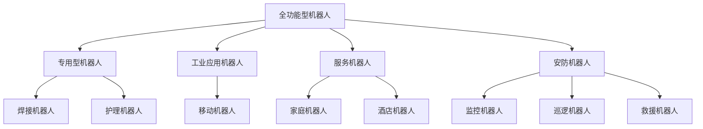

                 

# 《多功能机器人：取代特定任务机器人的新趋势》

## 关键词
机器人技术、多功能机器人、人工智能、特定任务机器人、发展趋势、设计原理

## 摘要
本文深入探讨了多功能机器人取代特定任务机器人的新趋势。首先，我们介绍了多功能机器人的定义、分类和核心概念，通过Mermaid流程图展示了它们的工作原理。接着，我们分析了特定任务机器人的局限性，探讨了人工智能在多功能机器人设计中的应用。文章详细讲解了多功能机器人的核心算法原理，并以Python源代码为例进行了说明。此外，我们还通过实际案例展示了多功能机器人在不同场景中的应用，并给出了开发与实现的详细步骤。最后，我们展望了多功能机器人的未来发展方向，并提出了相关的最佳实践和注意事项。

---

## 引言

### 1.1 多功能机器人的背景与发展历程

机器人技术起源于20世纪中叶，随着电子技术、传感器技术、人工智能等领域的迅猛发展，机器人技术也得到了极大的提升。传统的机器人主要用于特定任务，如焊接、搬运、装配等，这些机器人被设计为高效、精确地执行单一任务。然而，随着工业生产和服务领域的复杂化，特定任务机器人逐渐显露出其局限性。

多功能机器人作为机器人技术的一种新趋势，旨在解决特定任务机器人的局限性。它们通过整合多种功能，能够在不同的环境下执行多种任务，提高了机器人的灵活性和适用性。多功能机器人的出现，不仅推动了机器人技术的发展，也为各行业的自动化和智能化提供了新的解决方案。

### 1.2 特定任务机器人的局限性

特定任务机器人具有高效、精确等优点，但它们也存在一些局限性。首先，特定任务机器人的功能单一，难以适应复杂多变的工作环境。其次，特定任务机器人的灵活性较差，无法处理突发情况。此外，特定任务机器人通常需要定制化设计，导致成本高、维护难度大。

随着人工智能技术的不断进步，多功能机器人逐渐成为机器人技术发展的新方向。它们不仅能够执行多种任务，还能够通过自主学习不断优化自己的性能。多功能机器人的出现，为解决特定任务机器人的局限性提供了新的途径。

### 1.3 多功能机器人的新趋势

人工智能技术在多功能机器人设计中的应用，极大地提升了多功能机器人的智能水平和自主能力。通过深度学习、自然语言处理等技术，多功能机器人能够更好地理解环境、识别目标，并作出智能决策。

此外，多功能机器人的设计原则也在不断优化。例如，模块化设计使得多功能机器人能够灵活扩展和定制；人机交互设计提升了多功能机器人的用户体验；自适应控制系统使得多功能机器人能够根据环境变化自动调整性能。

总之，多功能机器人取代特定任务机器人的新趋势，不仅体现在技术上的突破，也体现在应用场景的不断扩展。随着技术的不断进步，多功能机器人将在更多领域发挥重要作用。

---

## 第1章：多功能机器人的核心概念与原理

### 2.1 多功能机器人的定义与分类

多功能机器人是一种集多种功能于一体的机器人系统，它能够在不同的环境下执行多种任务。根据不同的分类标准，多功能机器人可以划分为不同的类型。以下是几种常见的分类方法：

1. **根据功能类型分类：**

   - **全功能型机器人：** 能够执行多种基本功能，如移动、抓取、感知、决策等。
   - **专用型机器人：** 针对特定任务或场景进行设计，如工业制造中的焊接机器人、医院中的护理机器人等。

2. **根据应用场景分类：**

   - **工业应用机器人：** 用于工业生产中的自动化、智能化作业。
   - **服务机器人：** 用于家庭、酒店、医院等场景，提供便捷的生活服务和护理服务。
   - **安防机器人：** 用于监控、巡逻、救援等安全任务。

3. **根据控制方式分类：**

   - **自主型机器人：** 具有自主决策和行动能力，能够根据环境变化自主调整行为。
   - **半自主型机器人：** 需要外部指令或人工干预，但能够进行部分自主决策。

### 2.2 多功能机器人的关键特点

多功能机器人具有以下关键特点：

1. **多功能性：** 能够执行多种任务，适应复杂多变的工作环境。
2. **智能性：** 通过人工智能技术，具备自主学习和自适应能力。
3. **灵活性：** 设计灵活，能够根据需求快速调整和扩展功能。
4. **高效性：** 在多个任务间切换灵活，能够提高生产效率和服务质量。

### 2.3 多功能机器人的工作原理

多功能机器人的工作原理主要包括感知、决策和执行三个环节。

1. **感知：** 机器人通过传感器获取环境信息，包括视觉、听觉、触觉等，用于理解环境状态和任务需求。
2. **决策：** 机器人利用人工智能算法，对感知信息进行分析和处理，生成行动策略。
3. **执行：** 机器人根据决策策略，执行具体的任务操作，如移动、抓取、装配等。

### 2.4 多功能机器人的分类与关系架构

以下是多功能机器人的分类与关系架构图，通过Mermaid流程图展示。



---

## 第2章：多功能机器人的技术基础

### 2.1 传感器技术

传感器技术是多功能机器人的核心组成部分，它负责感知外部环境信息。以下是一些常见的传感器及其应用：

1. **视觉传感器：** 如摄像头、深度传感器等，用于获取图像和三维信息，实现目标识别和场景理解。
2. **力觉传感器：** 用于检测机器人与物体之间的接触力和摩擦力，实现精确抓取和装配。
3. **听觉传感器：** 如麦克风，用于捕捉声音信号，实现语音识别和交互。
4. **温度传感器：** 用于监测环境温度，确保机器人在不同温度下的稳定运行。

### 2.2 控制系统技术

控制系统技术是多功能机器人的“大脑”，它负责处理感知信息，生成行动策略，并控制机器人的执行。以下是一些关键技术：

1. **实时操作系统：** 如FreeRTOS、Ubuntu Core等，确保机器人能够高效、稳定地运行。
2. **运动控制算法：** 如PID控制、PID+反馈控制等，用于精确控制机器人的运动。
3. **决策算法：** 如深度学习、强化学习等，用于处理复杂环境下的决策问题。

### 2.3 人工智能技术

人工智能技术是提升多功能机器人智能性和自主性的关键。以下是一些常用的人工智能技术：

1. **深度学习：** 如卷积神经网络（CNN）、循环神经网络（RNN）等，用于图像识别、自然语言处理等。
2. **强化学习：** 如Q学习、SARSA等，用于机器人自主决策和路径规划。
3. **自然语言处理：** 如词嵌入、语言模型等，用于机器人的语音识别和语义理解。

### 2.4 通信技术

通信技术是多功能机器人实现远程控制和数据传输的基础。以下是一些常见的通信技术：

1. **无线通信：** 如Wi-Fi、蓝牙、5G等，实现机器人与外部设备的无线连接。
2. **有线通信：** 如USB、以太网等，实现机器人与控制计算机的连接。
3. **传感器网络：** 如Zigbee、LoRa等，实现机器人内部传感器之间的通信。

---

## 第3章：多功能机器人的设计原则

### 3.1 设计目标的明确

在多功能机器人的设计过程中，明确设计目标是至关重要的。设计目标通常包括以下几个方面：

1. **功能目标：** 确定机器人需要执行的主要任务和功能。
2. **性能目标：** 确定机器人的速度、精度、能耗等性能指标。
3. **可靠性目标：** 确保机器人在长时间运行中的稳定性和可靠性。
4. **安全性目标：** 确保机器人在操作过程中不会对人和环境造成伤害。

### 3.2 设计原则的遵循

为了实现设计目标，多功能机器人的设计应遵循以下原则：

1. **模块化设计：** 通过模块化设计，使得机器人能够灵活扩展和定制，满足不同应用场景的需求。
2. **人机交互设计：** 提高机器人的用户体验，使得操作更加便捷和直观。
3. **自适应设计：** 通过自适应控制系统，使得机器人在不同环境下能够自主调整性能，适应环境变化。
4. **高效能设计：** 在保证性能和可靠性的前提下，降低能耗，提高能效。

### 3.3 设计流程的规范化

多功能机器人的设计流程包括以下几个步骤：

1. **需求分析：** 收集和分析用户需求，明确机器人的功能、性能和可靠性要求。
2. **系统设计：** 根据需求分析结果，设计机器人的硬件和软件系统，确定传感器、控制系统和执行机构的配置。
3. **详细设计：** 详细设计各个模块的接口、通信协议和工作流程，确保系统能够高效、稳定地运行。
4. **原型验证：** 制作机器人原型，进行功能和性能测试，验证设计是否满足需求。
5. **优化与迭代：** 根据测试结果对设计进行优化和迭代，直到满足设计目标。

---

## 第4章：多功能机器人的应用场景

### 4.1 工业制造场景

在工业制造领域，多功能机器人已经得到了广泛应用。以下是一些典型的应用场景：

1. **生产线自动化：** 多功能机器人能够执行装配、焊接、搬运等多种任务，提高生产效率和产品质量。
2. **质量检测：** 通过视觉传感器和力觉传感器，多功能机器人能够对产品进行质量检测，确保产品质量。
3. **设备维护：** 多功能机器人能够进行设备的巡检、故障诊断和维修，减少设备停机时间。

### 4.2 医疗护理场景

在医疗护理领域，多功能机器人为医护人员提供了有力的辅助工具。以下是一些典型的应用场景：

1. **手术辅助：** 多功能机器人能够进行精准的手术操作，提高手术的成功率和安全性。
2. **护理服务：** 多功能机器人能够为患者提供陪护、护理、康复等服务，减轻医护人员的工作负担。
3. **医疗配送：** 多功能机器人能够自动完成药品、医疗用品的配送，提高医疗服务的效率。

### 4.3 家庭服务场景

在家庭服务领域，多功能机器人逐渐成为智能家居的一部分。以下是一些典型的应用场景：

1. **清洁服务：** 多功能机器人能够自动进行家庭清洁，如扫地、擦窗等，提高家庭生活的质量。
2. **生活助理：** 多功能机器人能够进行烹饪、洗衣、整理等家务劳动，减轻家庭成员的负担。
3. **娱乐互动：** 多功能机器人能够与家庭成员进行语音交互、娱乐互动，提升家庭氛围。

### 4.4 安防监控场景

在安防监控领域，多功能机器人能够提供实时、高效的监控服务。以下是一些典型的应用场景：

1. **安全巡逻：** 多功能机器人能够自动进行巡逻、监控，及时发现并报警。
2. **火灾救援：** 多功能机器人能够在火灾发生时，自动进行灭火、救援等工作。
3. **防爆排查：** 多功能机器人能够进行危险区域的排查，确保人员和设备的安全。

---

## 第5章：多功能机器人的开发与实现

### 5.1 开发环境搭建

在开发多功能机器人时，首先需要搭建一个合适的开发环境。以下是一个基本的开发环境搭建步骤：

1. **硬件平台选择：** 根据应用场景和需求，选择合适的硬件平台，如Arduino、Raspberry Pi等。
2. **软件平台安装：** 安装相应的软件平台，如ROS（Robot Operating System）、Ubuntu等。
3. **开发工具安装：** 安装编程开发工具，如Python、C++等。
4. **传感器连接：** 将传感器与硬件平台连接，并确保传感器数据的实时传输。

### 5.2 多功能机器人的编程实现

在编程实现方面，多功能机器人需要处理感知、决策和执行三个环节。以下是一个简单的编程实现流程：

1. **感知数据处理：** 编写代码，处理传感器数据，提取有用信息。
2. **决策算法实现：** 利用机器学习算法，如决策树、神经网络等，实现机器人的决策功能。
3. **执行代码编写：** 根据决策结果，编写控制代码，执行相应的任务。

### 5.3 多功能机器人的测试与优化

在多功能机器人开发完成后，需要进行测试和优化，以确保机器人的稳定性和性能。以下是一些测试和优化方法：

1. **功能测试：** 检查机器人是否能够完成预定的任务，如感知、决策、执行等。
2. **性能测试：** 测试机器人的速度、精度、能耗等性能指标，并进行优化。
3. **稳定性测试：** 检查机器人在长时间运行中的稳定性，如温度变化、电池耗电等。
4. **安全性测试：** 确保机器人在操作过程中不会对人和环境造成伤害。

### 5.4 代码解读与分析

以下是一个简单的Python代码示例，用于实现多功能机器人的感知、决策和执行功能。

```python
import rospy
from sensor_msgs.msg import Image
from geometry_msgs.msg import Twist

def image_callback(image_data):
    # 处理感知数据
    processed_data = process_image(image_data)

    # 决策
    action = decision-making_algorithm(processed_data)

    # 执行
    execute_action(action)

def process_image(image_data):
    # 图像预处理
    processed_image = preprocess_image(image_data)
    # 目标识别
    target = recognize_target(processed_image)
    return target

def decision-making_algorithm(processed_data):
    # 根据感知数据做出决策
    if processed_data == 'target':
        action = 'move_to_target'
    else:
        action = 'stop'
    return action

def execute_action(action):
    if action == 'move_to_target':
        # 移动到目标位置
        velocity_message = Twist()
        velocity_message.linear.x = 1.0
        pub_velocity.publish(velocity_message)
    elif action == 'stop':
        # 停止
        velocity_message = Twist()
        pub_velocity.publish(velocity_message)

if __name__ == '__main__':
    rospy.init_node('multi_function_robot')
    sub_image = rospy.Subscriber('/camera/image_raw', Image, image_callback)
    pub_velocity = rospy.Publisher('/cmd_vel', Twist, queue_size=10)
    rospy.spin()
```

在这个示例中，机器人首先通过摄像头获取图像数据，然后对图像进行预处理和目标识别。根据识别结果，机器人会做出相应的决策，并执行移动或停止等动作。

---

## 第6章：多功能机器人的未来展望

### 6.1 技术发展趋势

随着技术的不断进步，多功能机器人的未来发展趋势将主要集中在以下几个方面：

1. **人工智能技术的深入应用：** 人工智能技术将进一步提升多功能机器人的智能水平和自主能力，使其能够更好地理解环境、识别目标，并作出智能决策。
2. **物联网技术的融合：** 物联网技术的快速发展将使得多功能机器人能够与其他设备和系统实现无缝连接，提高其协同工作能力。
3. **新材料和新工艺的应用：** 新材料和新工艺的应用将使得多功能机器人具有更高的性能、更轻便的结构，以及更低的能耗。

### 6.2 行业应用前景

多功能机器人在各个行业的应用前景十分广阔。以下是一些典型应用领域：

1. **工业制造：** 多功能机器人将在工业制造中发挥更大的作用，如自动化生产线、质量检测、设备维护等。
2. **医疗护理：** 多功能机器人将在医疗护理领域提供更多的辅助功能，如手术辅助、护理服务、医疗配送等。
3. **家庭服务：** 多功能机器人将逐渐成为家庭服务的一部分，提供清洁、烹饪、护理等家务服务。
4. **安防监控：** 多功能机器人将在安防监控领域提供实时、高效的监控服务，如安全巡逻、火灾救援、防爆排查等。

### 6.3 未来研究方向

未来，多功能机器人研究将主要集中在以下几个方面：

1. **跨学科融合：** 加强机器人技术与其他领域（如生物学、心理学等）的交叉研究，提升机器人的智能化水平。
2. **人机协作：** 研究如何实现人机高效协作，提高机器人在复杂环境下的安全性和可靠性。
3. **自主性提升：** 研究如何进一步提升机器人的自主性，使其能够在更复杂、更动态的环境中自主决策和行动。
4. **伦理和法律问题：** 探索机器人伦理和法律问题，确保机器人在实际应用中的合法性和道德性。

---

## 附录

### A.1 多功能机器人相关的技术资料

- **传感器技术：**  
  - 视觉传感器：OpenCV、TensorFlow  
  - 力觉传感器：Force-Torque Sensor、六维力传感器  
  - 听觉传感器：PyAudio、Google语音识别

- **控制系统技术：**  
  - 实时操作系统：FreeRTOS、Ubuntu Core  
  - 运动控制算法：PID控制、PID+反馈控制

- **人工智能技术：**  
  - 深度学习：TensorFlow、PyTorch  
  - 强化学习：OpenAI Gym、PyTorch Reinforcement Learning

- **通信技术：**  
  - 无线通信：Wi-Fi、蓝牙、5G  
  - 有线通信：USB、以太网

### A.2 多功能机器人项目案例

- **项目1：** 多功能农业机器人  
  - 功能：自动播种、浇水、收割  
  - 技术难点：感知环境、路径规划、自主导航  
  - 成果：提高了农业生产效率，减少了人力成本

- **项目2：** 医院护理机器人  
  - 功能：陪护患者、提醒用药、搬运物品  
  - 技术难点：人机交互、自然语言处理、路径规划  
  - 成果：减轻了医护人员的工作负担，提高了患者的生活质量

- **项目3：** 家庭服务机器人  
  - 功能：扫地、擦窗、烹饪、洗衣  
  - 技术难点：感知环境、路径规划、多任务处理  
  - 成果：提高了家庭生活品质，减轻了家庭负担

### A.3 多功能机器人的发展史

- **20世纪50年代：** 机器人技术开始萌芽，出现了早期的机器人。
- **20世纪60年代：** 特定任务机器人开始应用于工业生产。
- **20世纪70年代：** 人工智能技术开始应用于机器人，提高了机器人的智能水平。
- **20世纪80年代：** 多功能机器人开始出现，如自动化生产线上的多功能机器人。
- **20世纪90年代：** 多功能机器人的应用逐渐扩展到医疗、服务等领域。
- **21世纪：** 随着物联网和人工智能技术的快速发展，多功能机器人进入了一个新的发展阶段，应用领域越来越广泛。

---

## 作者信息

作者：AI天才研究院/AI Genius Institute & 禅与计算机程序设计艺术 /Zen And The Art of Computer Programming

