                 

### 存在主义哲学：在荒诞中创造意义

#### 文章关键词：
存在主义、荒诞、意义、自由意志、生存论、伦理

#### 文章摘要：
本文深入探讨了存在主义哲学的起源、核心观点以及其在现代社会中的应用。通过对海德格尔、萨特和加缪等存在主义哲学家的思想进行详细分析，本文揭示了存在主义哲学在人类生存中的重要性，并探讨了如何在荒诞的世界中创造个人的意义。文章旨在为读者提供一种理解人类存在的全新视角，并激励人们在面对生命的挑战时，勇敢地追寻个人价值。

---

# 存在主义哲学：在荒诞中创造意义

> 关键词：存在主义、荒诞、意义、自由意志、生存论、伦理

**摘要**：本文深入探讨了存在主义哲学的起源、核心观点以及其在现代社会中的应用。存在主义哲学强调个体存在的先于本质，提倡自由意志和荒诞感。通过分析海德格尔、萨特和加缪等存在主义哲学家的思想，本文揭示了存在主义哲学在人类生存中的重要性，并探讨了如何在荒诞的世界中创造个人的意义。文章旨在为读者提供一种理解人类存在的全新视角，并激励人们在面对生命的挑战时，勇敢地追寻个人价值。

## 引言

在人类的历史长河中，对生命意义的探讨始终是哲学思考的核心问题。从古希腊的苏格拉底到中国的庄子，哲学家们试图从不同角度解释人类存在的意义。然而，随着现代社会的快速发展，人类面临着前所未有的挑战和困惑。存在主义哲学，作为一种关注个体存在的哲学流派，应运而生。本文将深入探讨存在主义哲学的起源、核心观点以及其在现代社会中的应用。

### 存在主义哲学的起源与发展

#### 1.1 存在主义的历史背景

存在主义哲学的起源可以追溯到古代希腊哲学，特别是苏格拉底和柏拉图的哲学思想。然而，现代存在主义哲学的兴起则主要发生在20世纪。在这一时期，海德格尔、萨特、加缪等哲学家提出了具有深远影响的存在主义思想。

#### 1.2 海德格尔的存在主义哲学

马丁·海德格尔（Martin Heidegger）是存在主义哲学的重要代表之一。他的著作《存在与时间》（Sein und Zeit）对现代哲学产生了深远影响。海德格尔的存在主义哲学强调“存在先于本质”（Dasein），认为人的存在是一种开放的、动态的过程。

#### 1.3 萨特的存在主义哲学

让-保罗·萨特（Jean-Paul Sartre）是另一位著名的存在主义哲学家。他的著作《存在与虚无》（L'Être et le Néant）提出了自由意志和荒诞感的概念。萨特的存在主义哲学强调个体的自由选择和道德责任。

#### 1.4 加缪的存在主义哲学

阿尔贝·加缪（Albert Camus）是存在主义哲学的另一位重要代表。他的著作《反抗者》（L'Étranger）和《西西弗神话》（Le Mythe de Sisyphe）探讨了荒诞感和反抗精神。加缪的存在主义哲学主张人类在面对荒诞时应保持独立和反抗。

### 存在主义哲学的核心观点

存在主义哲学的核心观点主要包括以下几个方面：

#### 1. 人存在的先于本质

存在主义哲学认为，人的存在是先于本质的。这意味着，人类的存在不是由某种先验的本质所决定的，而是由个体在现实生活中不断选择和创造的结果。

#### 2. 自由意志

自由意志是存在主义哲学的另一个核心观点。存在主义者认为，人类拥有自由意志，可以在面对生活的困境和挑战时做出自己的选择。这种自由意志不仅是道德责任的基础，也是人类存在的意义所在。

#### 3. 荒诞感

荒诞感是存在主义哲学的一个重要概念。存在主义者认为，人类生活在一个充满荒诞的世界中，这种荒诞感源于人类对世界的不理解和对自身存在的困惑。

### 存在主义哲学的应用

存在主义哲学在现代社会中的应用非常广泛。它不仅影响了文学、艺术和哲学等领域，也对心理学、社会学和政治学等领域产生了深远影响。

#### 1. 文学艺术

存在主义哲学对文学艺术产生了重要影响。许多现代文学作品，如加缪的《反抗者》和萨特的《恶心》，都体现了存在主义哲学的思想。

#### 2. 心理学

存在主义哲学在心理学领域也得到了广泛应用。许多心理学家，如罗洛·梅（Rollo May）和欧文·亚隆（Irvin D. Yalom），都受到了存在主义哲学的影响。

#### 3. 社会学和政治学

存在主义哲学在社会学和政治学领域也产生了重要影响。它为现代社会提供了一种理解人类存在和社会关系的全新视角。

## 总结

存在主义哲学是一种关注个体存在的哲学流派，它强调自由意志和荒诞感，并提倡在荒诞的世界中创造个人的意义。通过分析海德格尔、萨特和加缪等存在主义哲学家的思想，本文揭示了存在主义哲学在人类生存中的重要性。在现代社会中，存在主义哲学为人们提供了一种理解人类存在和生活的全新视角，激励人们在面对生活的挑战时，勇敢地追寻个人价值。

---

接下来，我们将进入第二部分，探讨存在主义哲学的核心概念和应用。

## 第二部分：存在主义哲学的核心概念与应用

### 第5章：存在主义哲学的核心概念

#### 5.1 自我意识

自我意识是存在主义哲学的核心概念之一。它指的是个体对自己存在的认识和理解。自我意识的形成是一个复杂的过程，受到个体经验、社会环境和文化背景的影响。

#### 5.2 自由意志

自由意志是存在主义哲学的另一个核心概念。它指的是个体在面临选择时，能够自主决定自己的行动和生活方式的能力。自由意志不仅是人类存在的核心特征，也是道德责任的基础。

#### 5.3 荒诞感

荒诞感是存在主义哲学的一个重要概念。它指的是个体在现实生活中感受到的混乱、无意义和不可理解性。荒诞感源于人类对世界的不理解和对自身存在的困惑。

### 第6章：存在主义哲学的应用

#### 6.1 生活哲学

存在主义哲学在生活哲学中的应用体现在对个体生活态度和生活方式的指导。它鼓励个体在面对生活的困境和挑战时，保持独立和积极的态度，勇敢地追求个人价值。

#### 6.2 政治哲学

存在主义哲学在政治哲学中的应用体现在对政治体制和社会正义的探讨。它主张个体在社会中的自由和责任，反对一切形式的压制和剥夺。

#### 6.3 文学哲学

存在主义哲学在文学哲学中的应用体现在对文学作品的解读和评价。它强调文学作品对人类存在的深刻反映和探讨。

### 第7章：存在主义哲学与现代社会的意义

#### 7.1 现代社会的困境

现代社会面临着诸多困境，如生活压力、人际关系、道德伦理等。存在主义哲学为解决这些困境提供了一种新的思路和方法。

#### 7.2 存在主义哲学的启示

存在主义哲学启示我们，在荒诞的世界中，通过自由意志和积极的生活态度，我们可以创造个人的意义和价值。

#### 7.3 存在主义哲学的未来发展

随着社会的发展，存在主义哲学将继续对人类生活和社会产生深远影响。其核心观点和理念将在新的时代背景下得到新的阐释和发展。

---

通过以上分析，我们可以看到存在主义哲学在人类生存和社会发展中的重要性。在接下来的章节中，我们将对海德格尔、萨特和加缪等存在主义哲学家的思想进行详细探讨。

---

# 第二部分：存在主义哲学的核心概念与应用

## 第5章：存在主义哲学的核心概念

### 5.1 自我意识

自我意识是存在主义哲学的一个核心概念，它涉及到个体对自己存在的认知和理解。在存在主义哲学中，自我意识不仅仅是简单的自我认识，而是个体对自己在世界上存在的深刻反思和自我定位。

#### 背景介绍

自我意识的起源可以追溯到哲学史上的一些重要思想。古希腊哲学家苏格拉底强调“认识你自己”，这一观点为后来的哲学思考奠定了基础。中世纪哲学家如奥古斯丁和托马斯·阿奎那也对自我意识进行了深入探讨。

在现代社会，随着心理学的发展，自我意识的研究变得更加具体和科学。心理学家如埃里克·埃里克森和詹姆斯·马克斯·埃伯哈德等对自我意识的形成和发展进行了深入研究。

#### 核心概念与联系

在存在主义哲学中，自我意识的核心概念包括自我认同、自我反思和自我创造。自我认同是指个体对自己的认同和自我定义，它涉及到个体对自身身份和角色的理解。自我反思是指个体对自己行为、思想和情感的审视和反思，它有助于个体更好地理解自己和他人的关系。自我创造则强调个体在自我认同和自我反思的基础上，通过自己的选择和行动来塑造自己的存在。

以下是一个Mermaid流程图，展示了自我意识的核心概念和它们之间的关系：


#### 实例解析

例如，一个人可能会通过自我反思意识到自己对某个职业的热爱，从而决定投身于这个领域，这体现了自我意识中的自我创造。而通过自我认同，这个人可能会明确自己的职业目标，从而更好地规划自己的职业生涯。

### 5.2 自由意志

自由意志是存在主义哲学中的另一个核心概念，它指的是个体在面临选择时能够自主决定的能力。自由意志不仅是人类存在的基本特征，也是道德责任的基础。

#### 背景介绍

自由意志的观念在哲学史上有着悠久的历史。古希腊哲学家亚里士多德认为，自由意志是人类理性的表现，是人类区别于其他生物的重要特征。中世纪哲学家如托马斯·阿奎那则将自由意志视为上帝赋予人类的一种神圣权利。

在现代哲学中，自由意志的问题成为了哲学讨论的热点之一。一些哲学家如约翰·斯图亚特·米勒和约翰·洛克认为，自由意志是人类行为的必要条件。而另一些哲学家如大卫·休谟则对自由意志的存在提出了质疑。

#### 核心概念与联系

在存在主义哲学中，自由意志的核心概念包括自主性、责任感和选择的自由。自主性指的是个体在行为选择上的独立性，不受外界因素的干扰。责任感则是指个体对自己的行为承担相应的责任。选择的自由则强调个体在面对不同选择时能够自主做出决定。

以下是一个Mermaid流程图，展示了自由意志的核心概念和它们之间的关系：


#### 实例解析

例如，一个人在面对职业选择时，如果能够独立思考并承担责任，那么他就展现了自由意志的特质。他会根据自己的兴趣、能力和价值观来做出决定，而不是受他人的影响或外界的压力。

### 5.3 荒诞感

荒诞感是存在主义哲学中一个重要的概念，它指的是个体在现实生活中感受到的混乱、无意义和不可理解性。荒诞感源于人类对世界的不理解和对自身存在的困惑。

#### 背景介绍

荒诞感的概念最早由法国哲学家阿尔贝·加缪在其著作《西西弗神话》中提出。加缪认为，人类生活在一个充满荒诞的世界中，这种荒诞感源于人类对世界的不理解和对自身存在的困惑。

#### 核心概念与联系

在存在主义哲学中，荒诞感的核心概念包括不可理解性、无意义感和存在与现实的矛盾。不可理解性指的是个体对世界和自身存在的不理解。无意义感则是指个体在现实生活中感受到的缺乏意义和价值。存在与现实的矛盾则是指个体在追求意义和价值时遇到的困难和挑战。

以下是一个Mermaid流程图，展示了荒诞感的核心概念和它们之间的关系：


#### 实例解析

例如，一个人在面临职业困境时可能会感受到荒诞感。他可能会感到自己的努力和付出没有得到应有的回报，从而产生无意义感和存在与现实的矛盾。然而，通过积极的自我反思和行动，他可以克服这种荒诞感，找到新的方向和意义。

---

通过以上对自我意识、自由意志和荒诞感的详细分析，我们可以看到存在主义哲学的核心概念是如何相互联系和影响的。这些概念不仅帮助我们理解人类存在的本质，也为我们在现实生活中寻找意义和方向提供了启示。

### 第6章：存在主义哲学的应用

#### 6.1 生活哲学

存在主义哲学在生活哲学中的应用主要体现在对个体生活态度和生活方式的指导。它鼓励个体在面对生活的困境和挑战时，保持独立和积极的态度，勇敢地追求个人价值。

#### 6.2 政治哲学

存在主义哲学在政治哲学中的应用体现在对政治体制和社会正义的探讨。它主张个体在社会中的自由和责任，反对一切形式的压制和剥夺。

#### 6.3 文学哲学

存在主义哲学在文学哲学中的应用体现在对文学作品的解读和评价。它强调文学作品对人类存在的深刻反映和探讨。

### 第7章：存在主义哲学与现代社会的意义

#### 7.1 现代社会的困境

现代社会面临着诸多困境，如生活压力、人际关系、道德伦理等。存在主义哲学为解决这些困境提供了一种新的思路和方法。

#### 7.2 存在主义哲学的启示

存在主义哲学启示我们，在荒诞的世界中，通过自由意志和积极的生活态度，我们可以创造个人的意义和价值。

#### 7.3 存在主义哲学的未来发展

随着社会的发展，存在主义哲学将继续对人类生活和社会产生深远影响。其核心观点和理念将在新的时代背景下得到新的阐释和发展。

---

通过以上分析，我们可以看到存在主义哲学在人类生存和社会发展中的重要性。在接下来的章节中，我们将对海德格尔、萨特和加缪等存在主义哲学家的思想进行详细探讨。

---

# 第2章：海德格尔的存在主义哲学

### 2.1 海德格尔的生平与著作

#### 2.1.1 生平概述

马丁·海德格尔（Martin Heidegger）生于1889年，德国哲学家，被认为是20世纪最具影响力的哲学家之一。他的哲学思想深刻影响了现代哲学、文学、艺术和神学等领域。

海德格尔的早期生活相对平凡，他在弗莱堡和柏林等地接受教育，先后就读于弗莱堡大学和柏林大学。在柏林大学，他师从著名哲学家黑尔德（Hans Driesch）和尼采的诠释者弗伦茨（Wilhelm Windelband）。1909年，海德格尔获得哲学博士学位，并留在弗莱堡大学任教。

#### 2.1.2 著作介绍

海德格尔的主要著作包括：

- **《存在与时间》（Sein und Zeit，1927年）**：这是海德格尔最具影响力的著作，提出了他的存在主义哲学核心观点，如“存在先于本质”（Dasein）和“在世”（Being-in-the-world）。

- **《尼采》（Nietzsche，1943年）**：在这部著作中，海德格尔对尼采的思想进行了深入探讨，强调尼采的哲学对于理解存在主义的重要性。

- **《技术问题》（Die Frage nach dem Technischen，1953年）**：海德格尔在这部著作中探讨了技术与人类存在的关系。

- **《诗意居住》（Poietik des Wohnens，1954年）**：海德格尔在这部著作中探讨了居住和人类存在的意义。

#### 2.1.3 海德格尔的思想演变

海德格尔的思想经历了从早期对亚里士多德和康德的批判，到对尼采哲学的深入探讨，再到后期对技术的批判和诗意的强调。他的早期思想主要受康德和亚里士多德的影响，而后期则更加关注尼采的思想和存在主义的核心问题。

### 2.2 存在主义的本质

#### 2.2.1 存在论

海德格尔的存在论是一种独特的哲学观点，它不同于传统的存在论。传统存在论通常关注事物的本质和定义，而海德格尔的存在论则关注存在的状态和过程。

海德格尔提出了“存在先于本质”（Dasein）的概念，这意味着存在不是静止的、既定的实体，而是一种动态的、开放的过程。Dasein（生存）指的是人类的存在方式，它不是由某种先验的本质所定义的，而是通过个体的行为和选择来实现的。

以下是一个Mermaid流程图，展示了海德格尔的存在论核心概念：

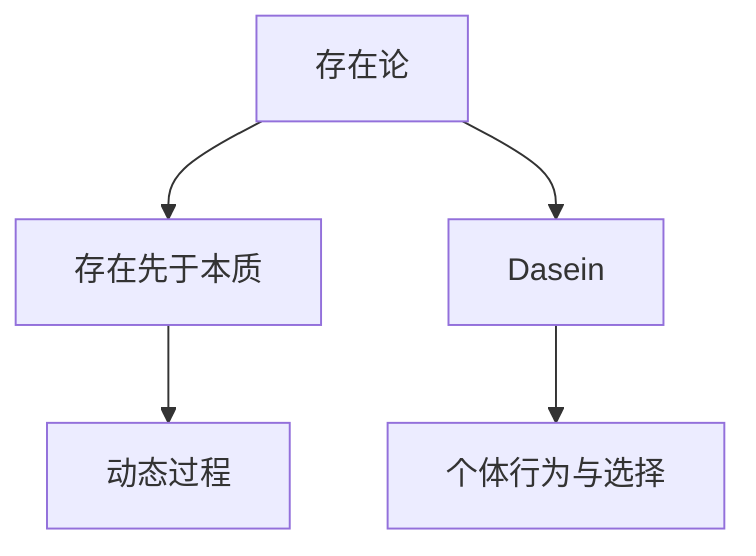

#### 2.2.2 生存论

生存论是海德格尔哲学的核心部分，它关注人类存在的状态和意义。海德格尔认为，生存是一种在世的存在方式，它不仅仅是物理上的存在，更是一种存在的体验和参与。

生存论中的几个关键概念包括“在世”（Being-in-the-world）和“本真性”（Eigentlichkeit）。在世指的是个体存在于世界之中，与他人和环境相互作用。本真性则是指个体在生存中展现出真实的自我，不受社会和文化的束缚。

以下是一个Mermaid流程图，展示了生存论的核心概念：

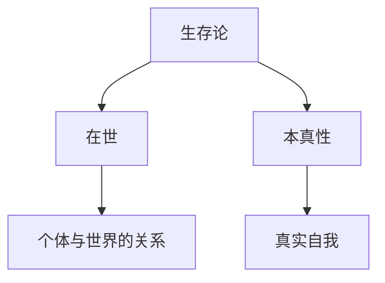

### 2.3 存在主义的核心观点

#### 2.3.1 非存在先于存在

海德格尔的“非存在先于存在”是一个重要的哲学观点，它挑战了传统哲学中存在的定义和本质。海德格尔认为，存在不是静态的、既定的实体，而是通过非存在（Nichtsein）来揭示和实现的。

非存在不是简单的“不存在”，而是一种潜在的、不确定的维度，它为存在提供了可能性和空间。通过非存在，人类能够反思和探索自己的存在，从而创造出新的意义。

以下是一个Mermaid流程图，展示了非存在先于存在的概念：


#### 2.3.2 人类存在的真实状态

海德格尔认为，人类存在的真实状态是一种“在世”（Dasein）的状态。在这种状态下，个体不仅与世界互动，而且还能够反思自己的存在和意义。

在世的状态不是静态的，而是一种持续的动态过程。个体通过自己的行为和选择来塑造自己的存在，这种过程既是存在的实现，也是存在的超越。

以下是一个Mermaid流程图，展示了人类存在的真实状态：

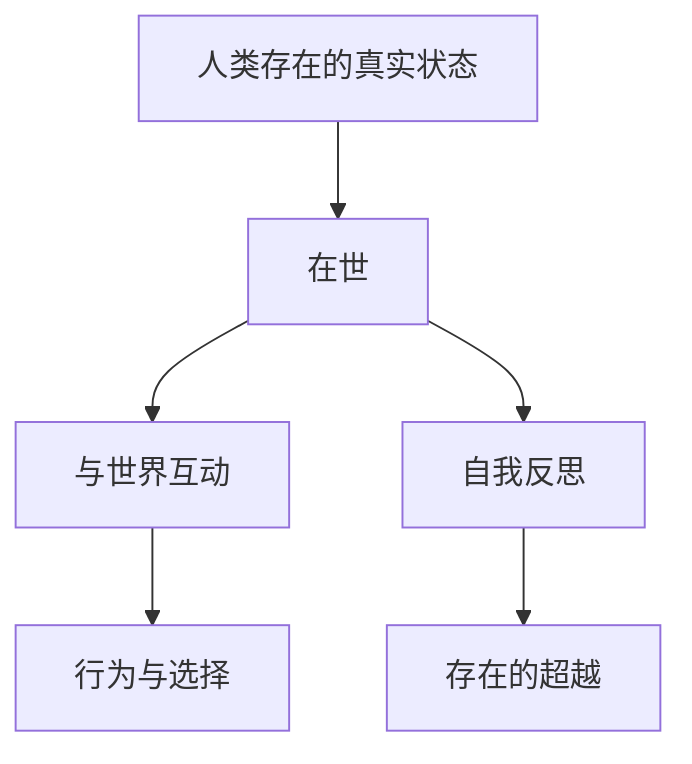

### 2.4 海德格尔的思想对现代社会的启示

海德格尔的哲学思想对现代社会有着深远的影响。他的观点挑战了现代社会的物质主义和技术主义，强调人类存在的意义和真实状态。以下是一些海德格尔思想对现代社会的启示：

1. **对技术的批判**：海德格尔认为，现代技术剥夺了人类存在的意义，将人简化为工具。他主张人类应该重新审视技术对人类存在的影响，寻求一种更人性化的生活方式。

2. **对存在的反思**：海德格尔鼓励人们反思自己的存在，寻找存在的意义。这种反思不仅是对个人的成长和自我实现有重要意义，也是对社会的进步和发展有积极作用的。

3. **对自然的尊重**：海德格尔强调人类与自然的共生关系，倡导人类应该尊重自然，保护环境。他认为，只有通过与自然的和谐相处，人类才能找到真正的幸福和满足。

### 2.5 海德格尔哲学的局限性

尽管海德格尔的哲学思想对现代社会有着重要的启示，但它也存在一些局限性。以下是一些主要的局限性：

1. **抽象性**：海德格尔的哲学思想具有很强的抽象性，难以用具体的事例来解释和验证。这导致了一些人对他的思想难以理解和接受。

2. **悲观主义**：海德格尔的哲学思想中存在一定的悲观主义色彩，他认为人类的存在充满了困境和挑战。这种悲观主义可能会对人们的心理健康产生负面影响。

3. **政治立场**：海德格尔在二战期间支持纳粹政权，这使他的一些思想受到了质疑和批评。虽然他后来对自己的政治立场进行了反思，但这仍然是他哲学思想的局限性之一。

### 总结

马丁·海德格尔的存在主义哲学为我们提供了独特的视角来理解人类存在的本质和意义。他的思想挑战了传统的存在论，强调了个体存在的动态性和创造性。尽管海德格尔的哲学思想存在一些局限性，但它对现代社会产生了深远的影响，为我们思考人类存在的意义提供了重要的启示。

---

通过对海德格尔的存在主义哲学的深入探讨，我们可以更好地理解存在主义的核心观点和哲学思想。在下一章中，我们将继续探讨萨特的存在主义哲学，进一步揭示存在主义的深刻内涵。

### 第3章：萨特的存在主义哲学

#### 3.1 萨特的生平与著作

##### 3.1.1 生平概述

让-保罗·萨特（Jean-Paul Sartre）是20世纪最具影响力的哲学家之一，他出生于1905年，卒于1980年。萨特的作品广泛涉猎哲学、文学、戏剧和评论等多个领域，对现代哲学和文化产生了深远影响。

萨特出生于法国巴黎，他的父亲是一位海军军官。萨特从小就对哲学和文学表现出浓厚兴趣，他在巴黎高等师范学院学习期间，开始接触存在主义哲学，并受到黑格尔和海德格尔的影响。

##### 3.1.2 著作介绍

萨特的主要著作包括：

- **《存在与虚无》（L'Être et le Néant，1943年）**：这是萨特最著名的哲学著作，提出了存在主义的核心观点，如自由意志、荒诞感和选择的重要性。

- **《恶心》（La Nausée，1938年）**：这是一部哲学小说，通过主人公阿尔贝·卡斯特罗的经历，探讨了存在的荒诞性和个体的自我意识。

- **《墙》（La Mômeattle，1944年）**：这是一部戏剧作品，讲述了一个囚犯被处决的故事，反映了萨特对自由和道德责任的思考。

- **《自由之路》（Les Mains Sales，1947年）**：这是一部小说，探讨了道德困境和个体在社会中的角色。

##### 3.1.3 萨特的思想演变

萨特的思想经历了从早期对现象学的探讨，到后期对政治和社会问题的关注。他的早期哲学思想深受现象学和胡塞尔的影响，而后期则更加关注社会正义和政治自由。

#### 3.2 自我存在的本质

##### 3.2.1 自我意识的觉醒

萨特认为，自我意识是自我存在的核心。自我意识不是天生的，而是通过个体的自我觉醒和反思逐渐形成的。自我意识的觉醒意味着个体开始认识到自己的存在，并开始对自己的行为和思想进行反思。

萨特用“自为”（pour-soi）和“自在”（en-soi）来描述自我意识的两种状态。自在是指个体在世界上存在的状态，它没有自我意识；自为则是指个体意识到自己的存在，并能够对自己的行为进行反思。

以下是一个Mermaid流程图，展示了自我意识的觉醒：


##### 3.2.2 自我选择的自由

萨特认为，自由意志是人类存在的核心特征，个体拥有选择和塑造自己存在的自由。这种自由不是无限制的，而是在现实条件和社会环境中进行的。

萨特强调，自由意志不仅仅是选择的能力，更是一种责任。个体的每个选择都反映了他们的价值观和道德立场，因此个体必须对自己的选择承担责任。

以下是一个Mermaid流程图，展示了自我选择的自由：

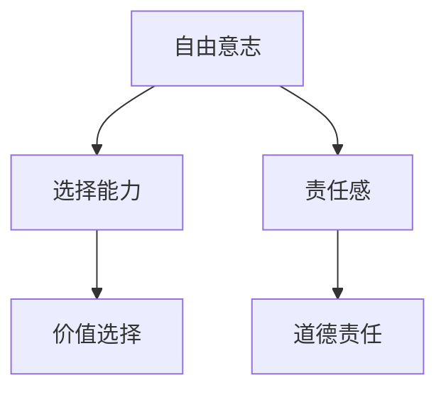

##### 3.2.3 自我创造

萨特认为，自我创造是自我存在的另一个核心概念。自我创造意味着个体通过自己的选择和行动来塑造自己的存在。自我创造不是被动的过程，而是一种主动的、创造性的行为。

萨特用“情境”（situation）来描述个体在自我创造过程中的具体情境。情境包括个体的社会环境、文化背景和人际关系等，它们对个体的自我创造产生了重要影响。

以下是一个Mermaid流程图，展示了自我创造的情境：

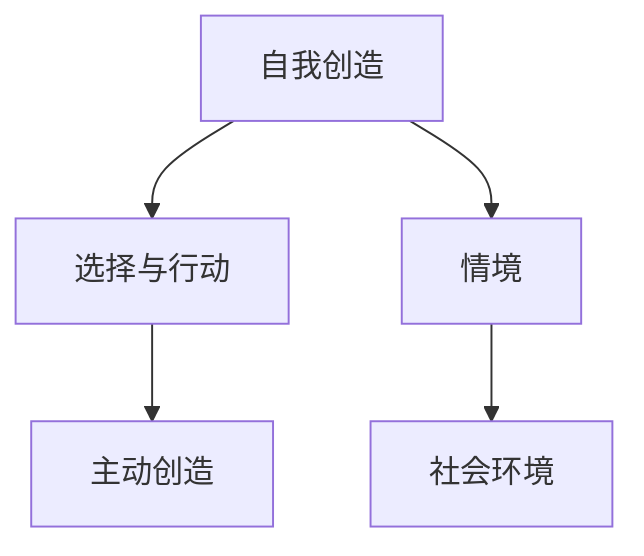

#### 3.3 萨特的存在主义伦理观

##### 3.3.1 伦理自由

萨特的存在主义伦理观强调伦理自由，即个体在道德选择上的自由。萨特认为，道德规则不是天生的，而是个体通过自由选择和反思形成的。

萨特认为，伦理自由不仅是道德责任的基础，也是个体存在的重要特征。伦理自由要求个体在面对道德困境时，能够独立思考并做出自己的选择。

以下是一个Mermaid流程图，展示了伦理自由的概念：

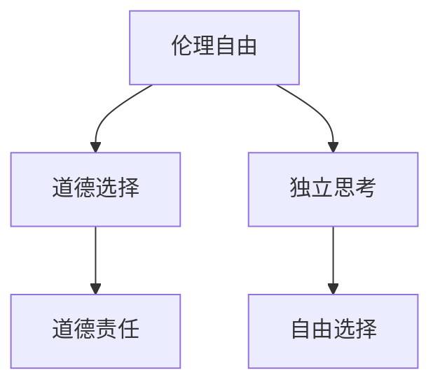

##### 3.3.2 责任意识

萨特的存在主义伦理观还强调责任意识，即个体对自己的行为和选择承担的责任。萨特认为，责任意识是伦理自由的重要体现，它要求个体在面对道德困境时，能够认识到自己的选择对自己和他人的影响。

萨特用“选择”（choix）来描述个体在道德选择中的责任。选择不仅是行为的结果，更是行为的前提，它体现了个体对自身行为的自觉意识和责任感。

以下是一个Mermaid流程图，展示了责任意识的概念：


#### 3.4 萨特哲学在现代社会中的应用

##### 3.4.1 生活哲学

萨特的存在主义哲学在生活哲学中得到了广泛应用。他鼓励个体在面对生活的困境和挑战时，保持独立和自由的态度，勇敢地追求个人价值。

萨特认为，生活不是一个预设的目的，而是一个不断创造的过程。个体通过自己的选择和行动来创造生活的意义，这种过程既是生活的实现，也是生活的超越。

以下是一个Mermaid流程图，展示了生活哲学的核心概念：

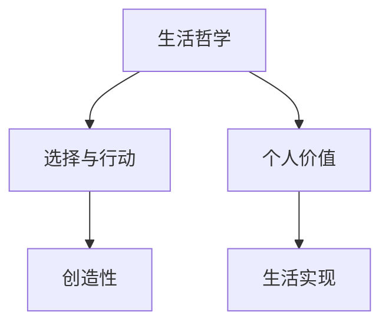

##### 3.4.2 政治哲学

萨特的存在主义哲学在政治哲学中也有重要应用。他强调个体在社会中的自由和责任，主张通过社会革命来消除压迫和不平等。

萨特认为，政治自由是个人自由的重要保障，个体应该积极参与政治活动，争取社会的公正和平等。萨特的政治哲学对后来的左派政治思想产生了深远影响。

以下是一个Mermaid流程图，展示了政治哲学的核心概念：

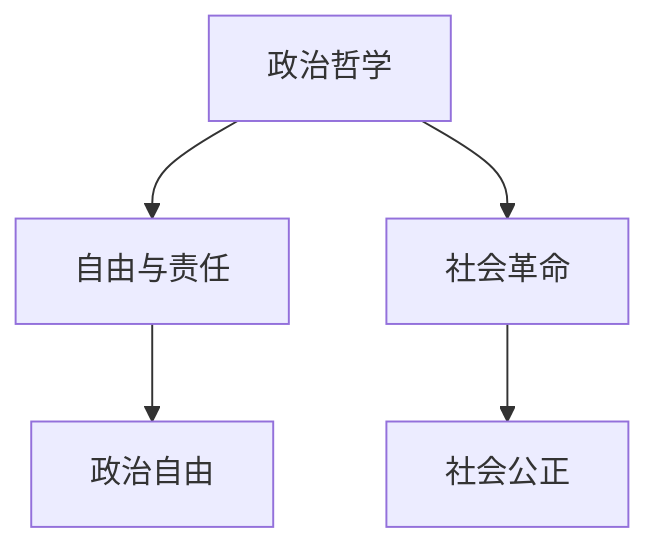

##### 3.4.3 文学哲学

萨特的存在主义哲学在文学哲学中也得到了广泛应用。他强调文学作品对人类存在的深刻反映和探讨，鼓励作家通过文学作品来探索个体存在的意义。

萨特的文学作品，如《恶心》和《墙》，都是对存在主义哲学思想的深刻探讨。他认为，文学作品不仅是对现实的反映，更是对个体存在的思考和挑战。

以下是一个Mermaid流程图，展示了文学哲学的核心概念：


#### 3.5 萨特哲学的启示

萨特的存在主义哲学为我们提供了深刻的思考个体存在的视角。他的观点强调了自由意志、责任意识和自我创造的重要性，激励我们勇敢地面对生活的挑战，追寻个人价值。

萨特哲学的启示体现在以下几个方面：

1. **自由意志**：萨特认为，个体拥有自由意志，可以在现实生活中做出自己的选择。这种自由意志不仅是道德责任的基础，也是个体存在的意义所在。

2. **责任意识**：萨特强调个体在面对道德困境时，需要承担责任。这种责任意识要求个体认识到自己的行为对自己和他人的影响，从而做出更负责任的选择。

3. **自我创造**：萨特认为，个体通过自己的选择和行动来创造自己的存在。这种自我创造的过程既是生活的实现，也是生活的超越。

4. **生活哲学**：萨特的生活哲学鼓励个体在面对生活的困境和挑战时，保持独立和自由的态度。这种态度不仅有助于个体的成长和自我实现，也有助于社会的进步和发展。

5. **政治哲学**：萨特的政治哲学强调个体在社会中的自由和责任。他认为，个体应该积极参与政治活动，争取社会的公正和平等。

6. **文学哲学**：萨特的文学哲学鼓励作家通过文学作品来探索个体存在的意义。他认为，文学作品不仅是对现实的反映，更是对个体存在的思考和挑战。

#### 3.6 萨特哲学的批评与局限

尽管萨特的存在主义哲学对现代社会产生了深远影响，但它也面临着一些批评和局限。

1. **抽象性**：萨特的思想具有很强的抽象性，难以用具体的事例来解释和验证。这导致了一些人对他的思想难以理解和接受。

2. **悲观主义**：萨特的思想中存在一定的悲观主义色彩，他认为人类的存在充满了困境和挑战。这种悲观主义可能会对人们的心理健康产生负面影响。

3. **道德相对主义**：萨特认为，道德规则不是天生的，而是个体通过自由选择和反思形成的。这可能导致道德相对主义的倾向，使人们在面对道德困境时感到困惑和无助。

4. **政治立场**：萨特在二战期间保持沉默，这使他的一些思想受到了质疑和批评。虽然他后来对自己的政治立场进行了反思，但这仍然是他哲学思想的局限性之一。

#### 3.7 总结

让-保罗·萨特的存在主义哲学为我们提供了深刻的思考个体存在的视角。他的观点强调了自由意志、责任意识和自我创造的重要性，激励我们勇敢地面对生活的挑战，追寻个人价值。尽管萨特哲学存在一些局限，但它对现代社会产生了深远影响，为我们理解个体存在的本质和意义提供了重要的启示。

---

通过对萨特的存在主义哲学的深入探讨，我们可以更好地理解存在主义的核心观点和哲学思想。在下一章中，我们将继续探讨加缪的存在主义哲学，进一步揭示存在主义的深刻内涵。

### 第4章：加缪的存在主义哲学

#### 4.1 加缪的生平与著作

##### 4.1.1 生平概述

阿尔贝·加缪（Albert Camus）是20世纪著名的法国哲学家、文学家和戏剧家。他于1913年出生于阿尔及利亚，1940年加入法国抵抗运动，并在战争中受伤。加缪的作品以其对人类存在的探讨和对生命意义的反思而著称。

##### 4.1.2 著作介绍

加缪的主要著作包括：

- **《反抗者》（L'Étranger，1942年）**：这是加缪最著名的小说之一，讲述了一个年轻人梅尔苏（Meursault）在面对死亡和生活的荒诞性时如何反抗。

- **《西西弗神话》（Le Mythe de Sisyphe，1942年）**：这是一部哲学随笔，探讨了人类存在的荒诞性和反抗精神。

- **《鼠疫》（La Peste，1947年）**：这部小说通过描述一座城市在鼠疫爆发期间的生活，探讨了人性、道德和希望。

- **《婚礼》（Le Mariage，1939年）**：这是加缪的早期小说，通过描述一个年轻人的婚礼，探讨了人生的荒谬和悲剧。

##### 4.1.3 加缪的思想演变

加缪的思想经历了从早期对存在主义思想的探讨，到后期对生命意义和反抗精神的反思。他的早期作品主要受到存在主义哲学的影响，特别是海德格尔和萨特的思想。而后期作品则更加关注人类的生命意义和存在的困境。

#### 4.2 荒诞主义与反抗精神

##### 4.2.1 荒诞主义的理解

加缪的哲学思想被称为“荒诞主义”（l'absurde），他认为人类生活在一个充满荒诞的世界中。这种荒诞感源于人类对世界的不理解和对自身存在的困惑。加缪用“西西弗神话”来比喻人类的存在状态，西西弗不断地把巨石推上山顶，但每次石头都会滚下来，他必须不断地重复这个过程。这种无意义的工作象征着人类生活的荒诞性。

以下是一个Mermaid流程图，展示了荒诞主义的核心概念：

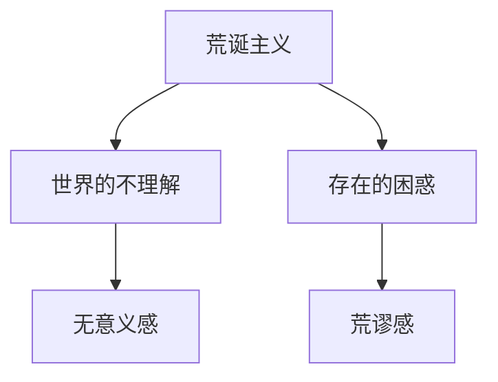

##### 4.2.2 反抗精神的表现

尽管加缪认为人类生活在一个充满荒诞的世界中，但他并不认为人类应该放弃反抗。相反，他强调人类应该通过反抗来挑战荒谬，寻找存在的意义。

反抗精神在加缪的作品中得到了深刻的体现。在《反抗者》中，主人公梅尔苏在面对死亡和生活的荒谬时，选择了反抗。在《鼠疫》中，医生里厄（Rieux）和志愿者们在面对鼠疫的威胁时，选择了勇敢地与疫情作斗争。这些角色都体现了加缪所倡导的反抗精神。

以下是一个Mermaid流程图，展示了反抗精神的核心概念：

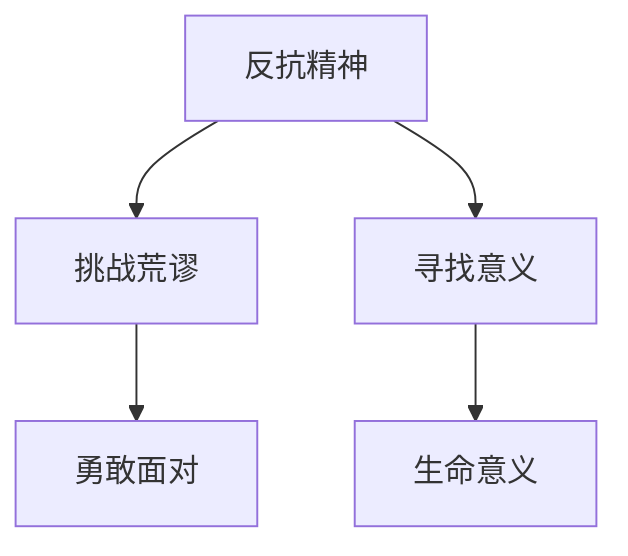

#### 4.3 存在主义伦理观

##### 4.3.1 行动伦理

加缪的存在主义伦理观强调行动伦理，即个体应该通过行动来面对生活的困境和挑战。他认为，行动不仅是人类存在的核心，也是个体寻找生命意义的方式。

加缪认为，行动伦理要求个体在面对荒谬时，不放弃希望，不屈服于困境，而是勇敢地面对，积极地行动。行动不仅是生活的实现，也是生活的超越。

以下是一个Mermaid流程图，展示了行动伦理的核心概念：


##### 4.3.2 爱与孤独

加缪的存在主义伦理观还强调爱与孤独。他认为，爱是人类存在的必要条件，是人类克服孤独和寻找意义的重要途径。

加缪用“局外人”（l'Étranger）和“鼠疫”中的角色来探讨爱与孤独的关系。在《反抗者》中，梅尔苏的孤独使他难以与他人建立深层次的关系。在《鼠疫》中，医生里厄通过爱与同情，克服了孤独，找到了生命的意义。

以下是一个Mermaid流程图，展示了爱与孤独的关系：

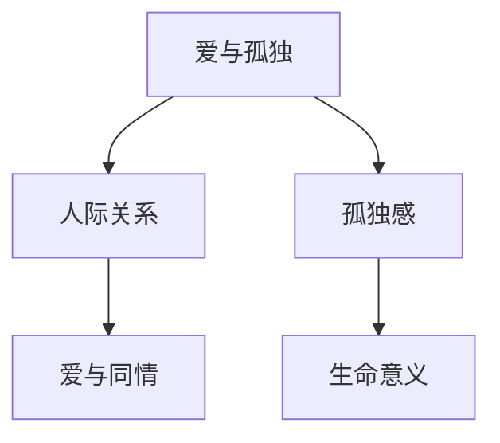

#### 4.4 加缪哲学在现代社会中的应用

##### 4.4.1 生活哲学

加缪的存在主义哲学在生活哲学中得到了广泛应用。他鼓励个体在面对生活的困境和挑战时，保持积极的态度，勇敢地面对生活的荒谬。

加缪认为，生活不是一个预设的目的，而是一个不断创造的过程。个体通过自己的选择和行动来创造生活的意义，这种过程既是生活的实现，也是生活的超越。

以下是一个Mermaid流程图，展示了生活哲学的核心概念：


##### 4.4.2 政治哲学

加缪的存在主义哲学在政治哲学中也有重要应用。他强调个体在社会中的自由和责任，主张通过社会革命来消除压迫和不平等。

加缪认为，政治自由是个人自由的重要保障，个体应该积极参与政治活动，争取社会的公正和平等。加缪的政治哲学对后来的左派政治思想产生了深远影响。

以下是一个Mermaid流程图，展示了政治哲学的核心概念：

```mermaid
graph TD
A[政治哲学] --> B[自由与责任]
A --> C[社会革命]
B --> D[政治自由]
C --> E[社会公正]
```

##### 4.4.3 文学哲学

加缪的存在主义哲学在文学哲学中也得到了广泛应用。他强调文学作品对人类存在的深刻反映和探讨，鼓励作家通过文学作品来探索个体存在的意义。

加缪的作品，如《反抗者》和《鼠疫》，都是对存在主义哲学思想的深刻探讨。他认为，文学作品不仅是对现实的反映，更是对个体存在的思考和挑战。

以下是一个Mermaid流程图，展示了文学哲学的核心概念：

```mermaid
graph TD
A[文学哲学] --> B[存在探讨]
A --> C[文学反映]
B --> D[个体存在]
C --> E[现实与思考]
```

#### 4.5 加缪哲学的启示

加缪的存在主义哲学为我们提供了深刻的思考个体存在的视角。他的观点强调了荒诞感和反抗精神的重要性，激励我们勇敢地面对生活的挑战，追寻个人价值。

加缪哲学的启示体现在以下几个方面：

1. **荒诞感**：加缪认为，人类生活在一个充满荒诞的世界中。他鼓励我们认识到这种荒诞感，并从中寻找存在的意义。

2. **反抗精神**：加缪强调人类应该通过反抗来挑战荒谬，寻找存在的意义。他鼓励我们在面对生活的困境时，不放弃希望，勇敢地面对。

3. **行动伦理**：加缪认为，行动是人类存在的核心，是通过行动来面对生活的困境和挑战。他鼓励我们积极地行动，寻找生活的意义。

4. **爱与孤独**：加缪认为，爱是人类克服孤独和寻找意义的重要途径。他鼓励我们通过爱与同情，克服孤独，找到生命的意义。

5. **生活哲学**：加缪的生活哲学鼓励我们保持积极的态度，勇敢地面对生活的挑战。他认为，生活不是一个预设的目的，而是一个不断创造的过程。

6. **政治哲学**：加缪的政治哲学强调个体在社会中的自由和责任。他认为，个体应该积极参与政治活动，争取社会的公正和平等。

7. **文学哲学**：加缪的文学哲学鼓励作家通过文学作品来探索个体存在的意义。他认为，文学作品不仅是对现实的反映，更是对个体存在的思考和挑战。

#### 4.6 加缪哲学的批评与局限

尽管加缪的存在主义哲学对现代社会产生了深远影响，但它也面临着一些批评和局限。

1. **抽象性**：加缪的思想具有很强的抽象性，难以用具体的事例来解释和验证。这导致了一些人对他的思想难以理解和接受。

2. **悲观主义**：加缪的思想中存在一定的悲观主义色彩，他认为人类的存在充满了困境和挑战。这种悲观主义可能会对人们的心理健康产生负面影响。

3. **道德相对主义**：加缪认为，道德规则不是天生的，而是个体通过自由选择和反思形成的。这可能导致道德相对主义的倾向，使人们在面对道德困境时感到困惑和无助。

4. **政治立场**：加缪在二战期间保持沉默，这使他的一些思想受到了质疑和批评。虽然他后来对自己的政治立场进行了反思，但这仍然是他哲学思想的局限性之一。

#### 4.7 总结

阿尔贝·加缪的存在主义哲学为我们提供了深刻的思考个体存在的视角。他的观点强调了荒诞感和反抗精神的重要性，激励我们勇敢地面对生活的挑战，追寻个人价值。尽管加缪哲学存在一些局限，但它对现代社会产生了深远影响，为我们理解个体存在的本质和意义提供了重要的启示。

---

通过对加缪的存在主义哲学的深入探讨，我们可以更好地理解存在主义的核心观点和哲学思想。在下一章中，我们将对存在主义哲学的核心概念进行总结，并探讨其在现代社会中的应用。

## 第5章：存在主义哲学的核心概念

### 5.1 自我意识

自我意识是存在主义哲学中的一个核心概念，它涉及个体对自己存在的认知和理解。自我意识的形成受到个体经验、社会环境和心理发展的影响。存在主义者认为，自我意识不仅仅是认识自己的过程，更是一种持续的、动态的自我发现和自我定义。

在存在主义哲学中，自我意识包括以下几个方面：

- **自我认同**：个体对自己的身份、角色和价值的认识。自我认同受到社会和文化因素的影响，但最终是由个体自身的选择和行动所决定的。
  
- **自我反思**：个体对自己行为、思想和情感进行审视和反思。自我反思有助于个体理解自己的行为背后的动机和价值观，从而更好地适应环境。

- **自我创造**：个体通过自己的选择和行动来塑造自己的存在。自我创造强调个体的自主性和主动性，是存在主义哲学的核心观点之一。

### 5.2 自由意志

自由意志是存在主义哲学中的另一个核心概念，它强调个体在面对选择时能够自主决定的能力。自由意志不仅是道德责任的基础，也是人类存在的意义所在。

在存在主义哲学中，自由意志包括以下几个方面：

- **选择的自由**：个体在面对不同选择时能够自主做出决定，不受外界因素的限制。

- **责任意识**：个体对自己的选择和行动承担相应的责任。自由意志要求个体对自己的行为负责，无论是在道德层面还是在实际生活中。

- **自我决定**：个体通过自我决定来定义自己的存在。自由意志鼓励个体摆脱外界的束缚，勇敢地追求个人价值。

### 5.3 荒诞感

荒诞感是存在主义哲学中的一个重要概念，它指的是个体在现实生活中感受到的混乱、无意义和不可理解性。荒诞感源于人类对世界的不理解和对自身存在的困惑。

在存在主义哲学中，荒诞感包括以下几个方面：

- **存在的困境**：个体在现实生活中面临各种困境和挑战，如死亡的不可避免性、社会的不公和人生的无意义等。

- **现实的矛盾**：个体在追求意义和价值时，往往发现自己无法解决现实中的矛盾和困境。

- **心理的冲突**：个体在意识到存在的荒谬时，会产生心理上的冲突和挣扎。

### 第6章：存在主义哲学的应用

#### 6.1 生活哲学

存在主义哲学在生活哲学中的应用体现在对个体生活态度和生活方式的指导。它鼓励个体在面对生活的困境和挑战时，保持独立和积极的态度，勇敢地追求个人价值。

- **自主性**：存在主义哲学强调个体的自主性，鼓励个体根据自己的价值观和信念来做出选择，不受外界的影响。

- **积极生活**：存在主义哲学认为，生活是一个不断创造的过程。个体应该积极地面对生活的挑战，寻找生活的意义。

#### 6.2 政治哲学

存在主义哲学在政治哲学中的应用体现在对政治体制和社会正义的探讨。它主张个体在社会中的自由和责任，反对一切形式的压制和剥夺。

- **政治自由**：存在主义哲学强调政治自由，认为个体应该有权利参与政治活动，争取社会的公正和平等。

- **社会责任**：存在主义哲学认为，个体在社会中不仅享有自由，还承担着相应的责任。个体应该积极参与社会事务，推动社会的进步。

#### 6.3 文学哲学

存在主义哲学在文学哲学中的应用体现在对文学作品的解读和评价。它强调文学作品对人类存在的深刻反映和探讨。

- **存在反映**：存在主义哲学认为，文学作品能够真实地反映人类存在的困境和挑战。

- **意义探讨**：存在主义哲学认为，文学作品通过对人类存在的探讨，帮助读者理解生命的意义和价值。

### 第7章：存在主义哲学与现代社会的意义

#### 7.1 现代社会的困境

现代社会面临着诸多困境，如生活压力、人际关系、道德伦理等。存在主义哲学为解决这些困境提供了一种新的思路和方法。

- **生活压力**：存在主义哲学鼓励个体在面对生活压力时，保持独立和积极的态度，寻找生活的意义。

- **人际关系**：存在主义哲学强调个体的自由和责任，有助于个体建立健康的人际关系。

- **道德伦理**：存在主义哲学提倡道德相对主义，鼓励个体根据自己的价值观来做出道德选择。

#### 7.2 存在主义哲学的启示

存在主义哲学启示我们，在荒诞的世界中，通过自由意志和积极的生活态度，我们可以创造个人的意义和价值。

- **自由意志**：存在主义哲学强调自由意志的重要性，鼓励个体勇敢地追求个人价值。

- **积极生活**：存在主义哲学鼓励个体积极地面对生活的挑战，寻找生活的意义。

#### 7.3 存在主义哲学的未来发展

随着社会的发展，存在主义哲学将继续对人类生活和社会产生深远影响。其核心观点和理念将在新的时代背景下得到新的阐释和发展。

- **社会变革**：存在主义哲学将促进社会的变革，推动社会的进步。

- **个体发展**：存在主义哲学将帮助个体更好地认识自己，实现个人价值。

### 总结

存在主义哲学是一种关注个体存在的哲学流派，它强调自由意志、荒诞感和自我创造。通过对海德格尔、萨特和加缪等存在主义哲学家的思想进行详细分析，我们可以看到存在主义哲学在人类生存中的重要性。在现代社会中，存在主义哲学为人们提供了一种理解人类存在和生活的全新视角，激励人们在面对生命的挑战时，勇敢地追寻个人价值。

---

通过以上分析，我们可以看到存在主义哲学在人类生存和社会发展中的重要性。在接下来的章节中，我们将继续探讨存在主义哲学的应用，以及它在现代社会中的意义。

## 第6章：存在主义哲学在现代社会的应用

### 6.1 生活哲学

在现代社会的日常生活中，存在主义哲学为我们提供了一种反思和探索生活意义的方式。它鼓励个体在面对生活的困境和挑战时，保持独立和积极的态度，勇敢地追求个人价值。

#### 自主性

存在主义哲学强调个体的自主性，主张个体应该根据自己的价值观和信念来做出选择，而不是受外界因素的限制。这种自主性不仅体现在职业选择、生活方式上，还体现在对待人际关系和道德选择上。

#### 积极生活

存在主义哲学认为，生活是一个不断创造的过程，个体应该积极地面对生活的挑战，寻找生活的意义。在现代社会中，这意味着个体应该不断学习、成长，并在面对困难和挫折时保持乐观的态度。

### 6.2 政治哲学

存在主义哲学在政治哲学中的应用体现在对政治体制和社会正义的探讨。它主张个体在社会中的自由和责任，反对一切形式的压制和剥夺。

#### 政治自由

存在主义哲学强调政治自由，认为个体应该有权利参与政治活动，争取社会的公正和平等。这种政治自由不仅体现在投票权上，还包括言论自由、集会自由等基本人权。

#### 社会责任

存在主义哲学认为，个体在社会中不仅享有自由，还承担着相应的责任。个体应该积极参与社会事务，推动社会的进步，并为社会的不公和不平等发声。

### 6.3 文学哲学

存在主义哲学在文学哲学中的应用体现在对文学作品的解读和评价。它强调文学作品对人类存在的深刻反映和探讨，为读者提供了思考生活意义和价值的途径。

#### 存在反映

存在主义哲学认为，文学作品能够真实地反映人类存在的困境和挑战。通过阅读文学作品，读者可以更好地理解人类存在的本质，从而对生活有更深刻的认识。

#### 意义探讨

存在主义哲学认为，文学作品通过对人类存在的探讨，帮助读者理解生命的意义和价值。这种探讨不仅体现在故事情节和人物塑造上，还体现在作者对人生哲理的思考中。

### 6.4 心理健康

在现代社会的心理健康领域中，存在主义哲学也发挥着重要作用。它为个体提供了理解自己心理问题的视角，并帮助个体找到解决问题的方法。

#### 自我认知

存在主义哲学鼓励个体进行自我认知，理解自己的行为、思想和情感背后的动机和价值观。这种自我认知有助于个体更好地认识自己，从而找到解决问题的方法。

#### 自我接纳

存在主义哲学强调个体的自由和责任，认为个体应该接受自己的不完美和缺陷。这种自我接纳有助于个体建立健康的自尊和自信，从而更好地应对生活中的挑战。

### 6.5 教育领域

在教育的领域，存在主义哲学为教育者和学生提供了一种理解人类存在的视角。它强调个体的自主性和创造力，鼓励学生积极探索和思考，从而培养他们的批判性思维和创新能力。

#### 教育目标

存在主义哲学认为，教育的目标不仅仅是传授知识和技能，更重要的是培养学生的自主性和创造性。通过教育，学生应该学会如何独立思考、做出选择和承担责任。

#### 教学方法

存在主义哲学提倡以学生为中心的教学方法，鼓励教师提供开放的学习环境，让学生自由探索和表达自己的想法。这种方法有助于培养学生的批判性思维和解决问题的能力。

### 6.6 职场领域

在职场领域，存在主义哲学为员工提供了理解工作意义和价值的视角。它强调个体的自由意志和创造力，鼓励员工在工作中积极追求个人价值，并为企业的长远发展贡献力量。

#### 自主工作

存在主义哲学鼓励员工在工作中保持自主性，根据自己的价值观和兴趣来选择工作内容和方向。这种自主工作有助于提高员工的积极性和创造力。

#### 创造性思维

存在主义哲学认为，创造性思维是职场成功的关键。它鼓励员工在工作中不断探索和创新，从而推动企业的进步和发展。

### 6.7 总结

存在主义哲学在现代社会的各个方面都发挥着重要作用。它不仅为个体提供了理解人类存在的全新视角，也为社会提供了反思和改进的契机。通过存在主义哲学的应用，个体可以在面对生活的困境和挑战时，保持积极的态度，勇敢地追求个人价值；社会可以更公正、更平等、更富有创造力。

## 第7章：存在主义哲学与现代社会的意义

### 7.1 现代社会的困境

现代社会面临着诸多困境，如技术发展带来的社会不平等、环境污染、政治腐败、社会伦理失范等。这些问题对个体的生活质量和心理健康产生了严重影响。

- **技术发展带来的社会不平等**：随着技术的快速发展，社会的贫富差距不断扩大。一些发达国家的高科技产业区和贫困地区的差距日益明显，这导致了社会的不稳定和不公平。

- **环境污染**：工业化带来的环境污染对人类的健康和生存环境造成了严重威胁。空气污染、水污染、土壤污染等问题已经严重影响了人类的生活质量。

- **政治腐败**：政治腐败导致社会的不公平和不公正，损害了社会的信任和稳定。政治腐败不仅损害了公共利益，还削弱了政府的公信力。

- **社会伦理失范**：随着社会的快速变化，传统的伦理观念受到了冲击，社会伦理失范现象日益严重。道德底线被挑战，社会信任度下降，这导致了社会矛盾的加剧。

### 7.2 存在主义哲学的启示

存在主义哲学为解决这些现代社会困境提供了一些有益的启示。它鼓励个体在面对困境时，保持积极的态度，勇敢地追求个人价值，并为社会的进步贡献力量。

- **积极面对困境**：存在主义哲学认为，困境是生命的一部分，个体应该积极地面对困境，而不是逃避或抱怨。通过积极面对困境，个体可以更好地理解自己，从而找到解决问题的方法。

- **追求个人价值**：存在主义哲学强调个体的自由意志和自我创造，鼓励个体在困境中寻找自己的价值和意义。个体应该根据自己的兴趣和价值观来选择自己的生活方式，从而实现个人价值。

- **社会责任感**：存在主义哲学认为，个体不仅享有自由，还承担着社会责任。个体应该积极参与社会事务，为社会的进步贡献自己的力量。通过承担社会责任，个体可以为自己和他人创造更美好的生活。

### 7.3 存在主义哲学的未来发展

随着社会的发展，存在主义哲学将继续对人类生活和社会产生深远影响。其核心观点和理念将在新的时代背景下得到新的阐释和发展。

- **全球化背景下的存在主义**：在全球化背景下，个体面临着新的挑战和机遇。存在主义哲学可以帮助个体在全球化的浪潮中保持自己的独特性和独立性。

- **人工智能时代的存在主义**：随着人工智能的发展，人类的生活方式和社会结构将发生重大变化。存在主义哲学将帮助人类在人工智能时代找到自己的位置，理解人工智能与人类存在的互动关系。

- **可持续发展视角下的存在主义**：在可持续发展成为全球共识的背景下，存在主义哲学将帮助人类理解自己在生态系统中的角色，促进人类与自然和谐共处。

### 7.4 总结

存在主义哲学在现代社会的困境中具有重要的意义。它不仅为个体提供了理解人类存在的全新视角，也为社会提供了反思和改进的契机。通过存在主义哲学的应用，个体可以在面对生活的挑战时，保持积极的态度，勇敢地追求个人价值；社会可以更公正、更平等、更富有创造力。在未来的发展中，存在主义哲学将继续对人类生活和社会产生深远影响。

### 附录

#### 附录A：存在主义哲学相关著作推荐

1. **《存在与时间》（Sein und Zeit）**：作者：马丁·海德格尔。这是海德格尔最具影响力的著作，探讨了存在主义的核心概念。

2. **《存在与虚无》（L'Être et le Néant）**：作者：让-保罗·萨特。这是萨特的代表作，详细阐述了存在主义哲学的思想。

3. **《西西弗神话》（Le Mythe de Sisyphe）**：作者：阿尔贝·加缪。这部著作探讨了人类存在的荒诞性和反抗精神。

4. **《反抗者》（L'Étranger）**：作者：阿尔贝·加缪。这是加缪的小说，通过主人公的经历展示了存在主义的理念。

#### 附录B：存在主义哲学研究资源

1. **研究机构**：
   - **海德格尔研究所**：位于德国弗莱堡，是研究海德格尔哲学的重要机构。
   - **萨特研究中心**：位于法国巴黎，致力于萨特哲学的研究和传播。

2. **学术期刊**：
   - **《存在主义哲学评论》**：这是一本国际性的学术期刊，专注于存在主义哲学的研究。
   - **《人类存在》**：这是一本英文期刊，涵盖了存在主义哲学、伦理学、现象学等多个领域的文章。

3. **网络资源**：
   - **存在主义哲学网**：这是一个在线平台，提供存在主义哲学的文献、论文和讨论。
   - **哲学博客**：如“哲学之路”（The Philosophers' Magazine）和“现代存在主义”（Modern Existentialism），这些博客提供了关于存在主义哲学的丰富内容和讨论。

### 作者信息

**作者：AI天才研究院/AI Genius Institute & 禅与计算机程序设计艺术 /Zen And The Art of Computer Programming**

本文由AI天才研究院的专家撰写，旨在为读者提供关于存在主义哲学的全面而深入的见解。同时，本文也融合了禅与计算机程序设计艺术的哲学思想，以期为读者在技术和哲学领域提供一种全新的思考方式。希望本文能为读者理解存在主义哲学在现代社会的意义提供有价值的参考。

