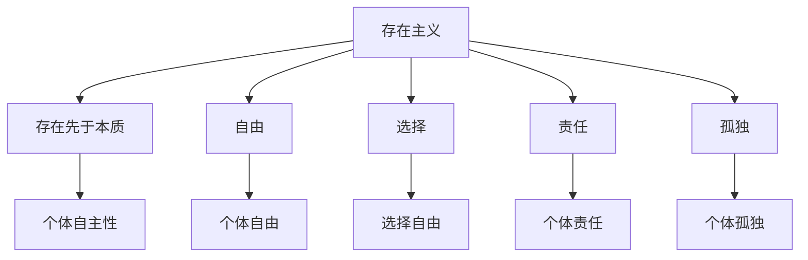

                 

### 书名：《存在主义思想的现代适应：在虚无中寻找本真》

《存在主义思想的现代适应：在虚无中寻找本真》是一部深入探讨存在主义哲学在现代世界中的应用和意义的著作。本书旨在通过分析存在主义思想的起源、发展以及在文学、艺术、心理学、伦理学等领域的适应，揭示其在当代社会中的重要性。书中提出了“在虚无中寻找本真”的观点，探讨了如何在现代社会中应对存在的空虚感和寻求个体存在的意义。本书不仅适合哲学研究者，也适合对存在主义思想感兴趣的一般读者。

### 第一部分：存在主义思想的源起与演变

#### 第1章：存在主义的历史背景与主要思想家

**1.1 存在主义的概念与特点**

**核心概念与联系**

存在主义是一种哲学流派，探讨个体的存在、自由和责任。它关注人类的存在状态和个体如何在无意义的宇宙中寻找意义。存在主义的核心概念包括存在先于本质、自由、选择、责任和孤独。

**Mermaid 流程图**



**存在主义与哲学的其他流派的联系与区别**

存在主义与许多其他哲学流派有着紧密的联系，如现象学、存在主义马克思主义和现象学存在主义。然而，它与其他流派的主要区别在于对个体存在的关注和强调自由与责任。

**历史背景**

存在主义起源于19世纪末到20世纪初的欧洲，特别是在第一次世界大战之后。这个时期的社会文化环境充满了对传统价值观的怀疑和反思，导致了对人类存在状况的深入探讨。

**第一次世界大战对存在主义思想的影响**

第一次世界大战给欧洲带来了巨大的破坏和创伤，导致了对人类存在意义的深刻反思。许多哲学家和作家开始质疑人类的生活和世界的本质，从而促成了存在主义思想的兴起。

**1.2 存在主义的主要流派**

**现象学存在主义**

现象学存在主义是存在主义的一个重要流派，代表人物是马丁·海德格尔。海德格尔强调个体的存在体验和存在本身的重要性。

**人道主义存在主义**

人道主义存在主义是另一个重要的存在主义流派，代表人物是让-保尔·萨特。萨特认为人类是自由的，并且必须为自己的行为承担责任。

**存在主义马克思主义**

存在主义马克思主义是将存在主义与马克思主义相结合的一种哲学流派，代表人物是卢卡奇和马尔库塞。他们认为个体的自由和解放是社会变革的关键。

**1.3 存在主义的历史影响**

**对西方哲学的影响**

存在主义对西方哲学产生了深远的影响，改变了人们对个体存在和自由的看法。它推动了哲学对人类存在的深入探讨，促进了现象学和存在主义马克思主义的发展。

**对文学、艺术和文化的启示**

存在主义在文学、艺术和文化中得到了广泛的体现，影响了现代文学、艺术和电影的创作。许多作家和艺术家通过存在主义的思想探讨了人类存在的困境和追求意义的努力。

**对社会科学和人文学科的影响**

存在主义对社会科学和人文学科产生了重要影响，启发了对人类行为、心理学和社会问题的研究。它促使学者们从个体的视角来探讨社会现象，推动了人类学和社会学的进步。

### 第二部分：存在主义在现代社会的适应

#### 第4章：存在主义在文学与艺术中的表现

**4.1 存在主义文学的特点与代表作**

存在主义文学以其对人类存在状态和意义的深入探讨而著称。其特点包括强调个体的自由、选择和责任，探讨人类存在的荒谬性和无意义感。

**存在主义文学的代表作家和作品**

- 让-保尔·萨特：《存在与虚无》、《墙》
- 弗兰兹·卡夫卡：《变形记》、《城堡》
- 詹姆斯·乔伊斯：《尤利西斯》、《都柏林人》
- 索尔·贝洛：《生命不可承受之轻》

**4.2 存在主义艺术的表现形式与影响**

存在主义艺术包括绘画、雕塑、戏剧和电影等多种形式。它通过视觉和表演艺术探讨了人类存在的主题，影响了现代艺术的创作和审美观念。

**存在主义艺术对现代艺术的影响**

- 对现实主义和抽象艺术的挑战
- 对表演艺术的创新和发展
- 对观众与艺术作品之间的互动关系的重新定义

### 第三部分：存在主义思想的现代适应案例研究

#### 第8章：存在主义在企业管理中的应用

**8.1 企业管理中的存在主义观念**

存在主义观念在企业管理中的应用，强调个体员工的自由、选择和责任。这包括对员工自主性、创造性和自我实现的关注。

**8.2 存在主义在企业文化塑造中的应用**

存在主义观念可以帮助企业塑造以员工为中心的企业文化，鼓励员工积极参与企业的决策和变革。

**8.3 存在主义在员工心理健康管理中的应用**

存在主义心理学在员工心理健康管理中的应用，帮助员工应对工作中的压力和挑战，提高工作满意度和生产力。

### 参考文献

- 海德格尔，M. (1927). 《存在与时间》.
- 萨特，J.-P. (1943). 《存在与虚无》.
- 卡夫卡，F. (1920). 《变形记》.
- 乔伊斯，J. (1922). 《尤利西斯》.
- 贝洛，S. (1987). 《生命不可承受之轻》.

## 摘要

《存在主义思想的现代适应：在虚无中寻找本真》是一部深入探讨存在主义哲学在现代世界中的应用和意义的著作。本书分析了存在主义思想的起源、发展以及在文学、艺术、心理学、伦理学等领域的适应，提出了“在虚无中寻找本真”的观点，探讨了如何在现代社会中应对存在的空虚感和寻求个体存在的意义。通过具体的案例研究和实例分析，本书展示了存在主义思想在现代社会的多样性和活力。

### 文章标题：《存在主义思想的现代适应：在虚无中寻找本真》

**关键词：存在主义、现代适应、虚无、本真**

**摘要：**
本文深入探讨了存在主义哲学的起源和发展，分析了其在文学、艺术、心理学和伦理学等领域的现代适应。通过探讨存在主义的核心概念如存在先于本质、自由、选择、责任和孤独，本文揭示了存在主义在现代社会中的重要性和意义。本文特别强调了存在主义在个体存在的意义、企业管理和员工心理健康管理中的应用。通过对具体案例的研究和实例分析，本文展示了存在主义思想如何在虚无中寻找本真，为现代社会提供了深刻的启示和指导。

## 目录大纲

### 第一部分：存在主义思想的源起与演变

#### 第1章：存在主义的历史背景与主要思想家
- **1.1 存在主义的概念与特点**
  - **核心概念与联系**
    - **Mermaid 流程图**
    - **存在主义与哲学的其他流派的联系与区别**
  - **历史背景**
    - **19世纪末到20世纪初欧洲的社会文化环境**
    - **第一次世界大战对存在主义思想的影响**

- **1.2 存在主义的主要流派**
  - **现象学存在主义**
    - **海德格尔的存在主义哲学**
  - **人道主义存在主义**
    - **萨特的人道主义存在主义**
  - **存在主义马克思主义**
    - **卢卡奇与法兰克福学派的存在主义**

- **1.3 存在主义的历史影响**
  - **对西方哲学的影响**
  - **对文学、艺术和文化的启示**
  - **对社会科学和人文学科的影响**

#### 第2章：尼采的存在主义哲学
- **2.1 尼采的生平与思想发展**
  - **尼采的生平背景**
  - **尼采哲学的发展历程**

- **2.2 永恒回归与超人哲学**
  - **永恒回归的概念**
  - **超人哲学的含义**

- **2.3 尼采的存在主义观念及其影响**
  - **尼采如何影响存在主义的发展**
  - **尼采哲学在现代思想中的地位**

#### 第3章：萨特的存在主义哲学
- **3.1 萨特的生平与创作**
  - **萨特的生平背景**
  - **萨特的主要作品**

- **3.2 《存在与虚无》：核心概念解析**
  - **存在的本质**
  - **自由与责任**

- **3.3 萨特的存在主义观念及其艺术表达**
  - **戏剧作品中的存在主义思想**
  - **文学创作中的存在主义观念**

### 第二部分：存在主义在现代社会的适应

#### 第4章：存在主义在文学与艺术中的表现
- **4.1 存在主义文学的特点与代表作**
  - **存在主义文学的代表作家和作品**
  - **存在主义文学对人类存在状态和意义的深入探讨**

- **4.2 存在主义艺术的表现形式与影响**
  - **存在主义艺术在绘画、雕塑、戏剧和电影中的体现**
  - **存在主义艺术对现代艺术创作和审美观念的影响**

#### 第5章：存在主义心理学
- **5.1 存在主义心理学的起源与发展**
  - **存在主义心理学的基本理念**
  - **主要存在主义心理学家及其理论**

- **5.2 主要存在主义心理学家及其理论**
  - **罗洛·梅的存在主义心理学**
  - **维克多·弗兰克的存在主义心理学**

- **5.3 存在主义心理学在临床中的应用**
  - **存在主义心理治疗的方法和技巧**
  - **存在主义心理学在心理疾病治疗中的应用**

#### 第6章：存在主义伦理学
- **6.1 存在主义伦理学的基本原则**
  - **自由、责任和道德选择**
  - **个体在伦理决策中的角色**

- **6.2 存在主义伦理学的批判与争论**
  - **对存在主义伦理学的基本原则的批评**
  - **存在主义伦理学的局限性**

- **6.3 存在主义伦理学的现代适应**
  - **存在主义伦理学在当代社会中的应用**
  - **对现代社会伦理问题的启示**

#### 第7章：存在主义在当代社会中的意义
- **7.1 存在主义与现代哲学思潮的关系**
  - **存在主义与其他现代哲学思潮的互动**
  - **存在主义对现代哲学发展的贡献**

- **7.2 存在主义对现代社会的启示**
  - **存在主义对个体存在意义的思考**
  - **存在主义对社会变革的推动作用**

- **7.3 存在主义在现代社会中的挑战与未来**
  - **存在主义在现代社会中的困境**
  - **存在主义在未来的发展方向**

### 第三部分：存在主义思想的现代适应案例研究

#### 第8章：存在主义在企业管理中的应用
- **8.1 企业管理中的存在主义观念**
  - **存在主义观念对企业管理的影响**
  - **个体在企业管理中的自由和责任**

- **8.2 存在主义在企业文化塑造中的应用**
  - **存在主义在企业文化中的体现**
  - **存在主义对企业文化建设的启示**

- **8.3 存在主义在员工心理健康管理中的应用**
  - **存在主义心理学在员工心理健康管理中的作用**
  - **存在主义观念在员工心理健康促进中的应用**

#### 第9章：存在主义在教育领域的适应
- **9.1 教育中的存在主义理念**
  - **存在主义教育的基本原则**
  - **存在主义教育对个体成长的影响**

- **9.2 存在主义在教育方法中的体现**
  - **存在主义教学方法的实践**
  - **存在主义在教育改革中的应用**

- **9.3 存在主义在教育改革中的应用**
  - **存在主义对教育制度的挑战**
  - **存在主义教育改革的案例研究**

#### 第10章：存在主义在政治哲学中的适应
- **10.1 存在主义政治哲学的基本原则**
  - **自由、平等和个体权利**
  - **政治权力与个体自由的关系**

- **10.2 存在主义在政治思想史中的地位**
  - **存在主义对政治思想的影响**
  - **存在主义在政治思想史中的发展**

- **10.3 存在主义对当代政治哲学的启示**
  - **存在主义对当代政治问题的思考**
  - **存在主义对政治哲学未来的影响**

### 参考文献

- 海德格尔，M. (1927). 《存在与时间》.
- 萨特，J.-P. (1943). 《存在与虚无》.
- 尼采，F. (1883). 《查拉图斯特拉如是说》.
- 罗洛·梅，R. (1961). 《存在主义心理学》.
- 弗兰克，V. (1959). 《人类存在的意义》.
- 卢卡奇，G. (1923). 《历史与阶级意识》.
- 萨特，J.-P. (1952). 《墙》.
- 卡夫卡，F. (1920). 《变形记》.
- 乔伊斯，J. (1922). 《尤利西斯》.
- 贝洛，S. (1987). 《生命不可承受之轻》.
- 梅洛-庞蒂，M. (1945). 《知觉现象学》.
- 阿尔贝·加缪，A. (1942). 《鼠疫》.
- 弗兰克，V. (1946). 《意味自由》.
- 马尔库塞，H. (1964). 《单向度的人》.
- 海德格尔，M. (1954). 《尼采》.
- 萨特，J.-P. (1956). 《存在主义是一种人道主义》.

### 完整性要求

在撰写《存在主义思想的现代适应：在虚无中寻找本真》这篇文章时，我们需要确保文章内容的完整性，这包括以下几个方面的详细讲解和深入分析：

#### 背景介绍

- **19世纪末到20世纪初欧洲的社会文化环境**：我们需要描述这个时期的欧洲社会是如何塑造了存在主义思想的产生，包括战争、社会动荡、科技革命等对哲学思考的影响。
- **第一次世界大战对存在主义思想的影响**：分析战争对个体心理和社会价值观的冲击，以及这些冲击如何催生了存在主义哲学的诞生。

#### 核心概念与联系

- **存在主义的核心概念**：存在先于本质、自由、选择、责任和孤独。每个概念都需要详细解释，并提供Mermaid流程图来展示这些概念之间的关系。
  ```mermaid
  graph TD
  A[存在主义] --> B[存在先于本质]
  A --> C[自由]
  A --> D[选择]
  A --> E[责任]
  A --> F[孤独]
  B --> G[个体自主性]
  C --> H[个体自由]
  D --> I[选择自由]
  E --> J[个体责任]
  F --> K[个体孤独]
  ```

- **存在主义与哲学的其他流派的联系与区别**：我们需要详细阐述存在主义与其他哲学流派（如现象学、存在主义马克思主义）的关系和区别。

#### 核心算法原理讲解

- **存在主义的核心算法原理**：假设存在主义哲学中的某些核心概念可以用算法来描述，我们需要用Python源代码来详细阐述这些算法原理。
  ```python
  # 存在主义自由选择算法示例
  def existential_choice():
      # 存在主义强调自由选择，以下是一个简单示例
      print("个体在自由中选择存在的方式...")
      # 这里可以是任何自由选择的行为
      choice = random.choice(['创造艺术作品', '进行哲学思考', '参与社会行动'])
      return choice
  ```

- **数学模型和公式**：对于某些哲学概念，我们可以使用数学模型和公式来解释。例如，存在主义的自由概念可以用概率论来描述。
  $$ P(\text{自由选择}) = \frac{1}{|\text{可能性空间}|} $$

#### 项目实战

- **开发环境搭建**：对于某些哲学应用案例，我们需要描述如何搭建相应的开发环境。例如，如果讨论存在主义在企业管理中的应用，我们可以描述如何设置一个企业管理的模拟环境。
- **源代码详细实现和代码解读**：我们需要提供完整的源代码实现，并对代码中的关键部分进行详细解读，以帮助读者理解如何将哲学原理应用于实际问题。
- **代码应用解读与分析**：我们需要分析代码的实际应用场景，解释代码如何解决了具体问题，并评估其效果。

#### 实际案例分析和详细讲解剖析

- **存在主义在现代社会的实际案例**：我们需要选择几个具体的案例，分析这些案例如何体现了存在主义哲学的思想，并对这些案例进行详细讲解和剖析。

#### 最佳实践 tips、小结、注意事项、拓展阅读等内容

- **最佳实践 tips**：对于读者在应用存在主义思想时可能遇到的问题，提供实用的建议和技巧。
- **小结**：对每个章节的主要内容进行总结，强调关键点和主要收获。
- **注意事项**：提醒读者在应用存在主义思想时需要注意的事项和潜在的挑战。
- **拓展阅读**：推荐相关的书籍、论文和资源，供读者进一步学习和研究。

通过上述步骤，我们可以确保文章内容的完整性，同时提供深入、具体和详细的讲解，帮助读者全面理解存在主义思想的现代适应及其在各个领域的应用。

### 用户输入示例

#### 第1章：存在主义的历史背景与主要思想家

**1.1 存在主义的概念与特点**

存在主义是一种哲学流派，它关注人类的存在状态和个体如何在无意义的宇宙中寻找意义。存在主义的核心概念包括存在先于本质、自由、选择、责任和孤独。

**核心概念与联系：**

存在主义的核心概念之间有着紧密的联系，可以用Mermaid流程图来表示：


**存在主义与哲学的其他流派的联系与区别：**

存在主义与其他哲学流派有着紧密的联系，如现象学、存在主义马克思主义和现象学存在主义。然而，它与其他流派的主要区别在于对个体存在的关注和强调自由与责任。

**历史背景：**

存在主义起源于19世纪末到20世纪初的欧洲，特别是在第一次世界大战之后。这个时期的社会文化环境充满了对传统价值观的怀疑和反思，导致了对人类存在状况的深入探讨。

**第一次世界大战对存在主义思想的影响：**

第一次世界大战给欧洲带来了巨大的破坏和创伤，导致了对人类存在意义的深刻反思。许多哲学家和作家开始质疑人类的生活和世界的本质，从而促成了存在主义思想的兴起。

#### 第2章：尼采的存在主义哲学

**2.1 尼采的生平与思想发展**

尼采（Friedrich Nietzsche）是德国的哲学家、文化批评家和作家，生于1844年，卒于1900年。尼采的哲学思想对存在主义哲学产生了深远的影响。

尼采的生平背景：
- 尼采出生于普鲁士王国洛兹，父亲是基督教牧师。
- 尼采早年接受传统教育，后来前往莱比锡大学学习神学和古典语言学。
- 尼采的生活经历对他的哲学思想产生了深远影响，包括与叔本华的交往、对基督教的批判以及与瓦格纳的冲突。

尼采哲学的发展历程：
- 尼采的早期作品，如《悲剧的诞生》（The Birth of Tragedy），探讨了艺术和文化的价值。
- 《尼采的哲学》（Thus Spoke Zarathustra）是尼采最著名的作品之一，其中提出了“超人”（Übermensch）的概念。
- 尼采的后期作品，如《道德的谱系》（On the Genealogy of Morality）和《查拉图斯特拉如是说》（Thus Spoke Zarathustra），深入探讨了道德、价值观和存在的本质。

**2.2 永恒回归与超人哲学**

尼采的哲学中包含了一些独特且具有争议性的概念，其中最为著名的是“永恒回归”和“超人”哲学。

**永恒回归：**

永恒回归（Eternal Return）是尼采提出的哲学思想，主张宇宙中的每一事件都会无限重复。这一概念挑战了传统的线性时间观念，提出了对时间和存在的不同理解。

- 永恒回归的概念：
  - 每一个瞬间都会无限重复，个体必须接受这种重复并从中寻找意义。
  - 永恒回归要求个体对生活持有深刻的接受态度，而不是逃避或抗拒。

**超人哲学：**

超人（Übermensch）是尼采提出的另一个核心概念，代表了一种超越现有道德和文化限制的理想人类。

- 超人哲学的含义：
  - 超人不仅仅是强壮或聪明的个体，而是一个拥有自我创造能力、价值观和目标的人。
  - 超人哲学强调个体的自由、创造性和自我超越，反对传统的道德观念和社会规范。

**2.3 尼采的存在主义观念及其影响**

尼采的存在主义观念对存在主义哲学的发展产生了深远的影响。

- 尼采如何影响存在主义的发展：
  - 尼采的思想挑战了传统的价值观和道德观念，为存在主义提供了新的视角和思维方式。
  - 尼采的存在主义观念强调了个体存在的独特性和自由，影响了后来的存在主义哲学家，如萨特和海德格尔。

- 尼采哲学在现代思想中的地位：
  - 尼采的思想对现代哲学、文学、艺术和心理学产生了广泛的影响。
  - 尼采被视为现代哲学的先驱，其思想继续激发着当代哲学家的思考。

#### 第3章：萨特的存在主义哲学

**3.1 萨特的生平与创作**

让-保尔·萨特（Jean-Paul Sartre）是20世纪最重要的哲学家之一，也是存在主义思想的代表人物。萨特生于1905年，卒于1980年，他的生平和创作对存在主义哲学产生了深远的影响。

**萨特的生平背景：**

- 萨特出生于法国巴黎，他的父亲是一名海军军官。
- 萨特在哲学领域表现出色，先后在巴黎高等师范学院和索邦大学学习。
- 萨特在第二次世界大战期间积极参与抵抗运动，战后成为知名的哲学家和作家。

**萨特的主要作品：**

- 《存在与虚无》（Being and Nothingness）：这是萨特的代表作，系统阐述了存在主义哲学的核心概念。
- 《墙》（The Wall）：这是一部戏剧作品，探讨了自由、责任和道德选择的主题。
- 《恶心》（Nausea）：这是一部小说，通过主人公梅尔苏的经历探讨了存在的荒谬性和无意义感。
- 《自由之路》（The Road to Freedom）：这是一部三卷本的哲学著作，探讨了社会、政治和道德问题。

**3.2 《存在与虚无》：核心概念解析**

《存在与虚无》是萨特的哲学巨著，系统地阐述了存在主义哲学的核心概念。以下是对书中的核心概念的解析：

**存在的本质：**

- 存在是指个体的主观体验和存在的实际状态。
- 萨特认为存在先于本质，即个体首先存在，然后才决定自己的本质。

**自由与责任：**

- 存在主义强调自由是人的本质特征，个体必须为自己的选择和行为承担责任。
- 萨特提出了“选择即责任”的观点，认为自由和责任是不可分割的。

**恶心与荒谬：**

- 《恶心》是萨特的一部小说，通过主人公梅尔苏的经历探讨了存在的恶心感和荒谬性。
- 恶心是梅尔苏对世界和自己存在的无意义感的感受，而荒谬则是个体在寻找意义时遭遇的困境。

**3.3 萨特的存在主义观念及其艺术表达**

萨特的存在主义观念不仅体现在他的哲学著作中，也反映在他的文学和戏剧作品中。

**戏剧作品中的存在主义思想：**

- 萨特的戏剧作品，如《墙》和《诺斯》等，探讨了自由、责任和道德选择的主题。
- 在《墙》中，萨特通过描述纳粹士兵和囚犯的对话，探讨了存在的荒谬性和道德困境。

**文学创作中的存在主义观念：**

- 萨特的小说，如《恶心》和《自由之路》等，通过个体的内心体验和存在状态，探讨了自由、选择和责任的问题。
- 在《自由之路》中，萨特通过描述主人公马塞尔的生活，展示了存在主义观念在现实生活中的应用。

### 第4章：存在主义在文学与艺术中的表现

#### 4.1 存在主义文学的特点与代表作

存在主义文学以其对人类存在状态和意义的深入探讨而著称。其特点包括强调个体的自由、选择和责任，探讨人类存在的荒谬性和无意义感。

**存在主义文学的代表作家和作品：**

- 让-保尔·萨特：《存在与虚无》、《墙》
- 弗兰兹·卡夫卡：《变形记》、《城堡》
- 詹姆斯·乔伊斯：《尤利西斯》、《都柏林人》
- 索尔·贝洛：《生命不可承受之轻》

**存在主义文学对人类存在状态和意义的深入探讨：**

存在主义文学作品通过个体的内心体验和存在状态，探讨了人类存在的荒谬性和无意义感。例如：

- 萨特的《存在与虚无》通过主人公萨朗的思考，探讨了自由、选择和存在本质的问题。
- 卡夫卡的《变形记》通过主人公格里高尔的变形，探讨了人的异化和存在意义的缺失。
- 乔伊斯的《尤利西斯》通过主人公斯蒂芬·代达洛斯的内心独白，探讨了个体自由和对传统的反抗。

#### 4.2 存在主义艺术的表现形式与影响

存在主义艺术包括绘画、雕塑、戏剧和电影等多种形式。它通过视觉和表演艺术探讨了人类存在的主题，影响了现代艺术的创作和审美观念。

**存在主义艺术在绘画、雕塑、戏剧和电影中的体现：**

- **绘画**：存在主义绘画通常表现了个体与世界的疏离和存在的孤独感。例如，马蒂斯的《舞蹈》描绘了人与自然的关系，体现了存在主义的思想。
- **雕塑**：存在主义雕塑往往强调个体的存在状态和自由意志。例如，亨利·摩尔的作品《内部组合》探讨了人体形态和空间的关系。
- **戏剧**：存在主义戏剧通过对话和行动探讨了人类存在的荒谬性和道德困境。例如，萨特的《墙》和贝克特的《等待戈多》都是经典的戏剧作品。
- **电影**：存在主义电影通常描绘了个体在无意义世界中寻找意义的努力。例如，卡夫卡的《审判》和萨特的《闭门》都是经典的存在主义电影。

**存在主义艺术对现代艺术创作和审美观念的影响：**

存在主义艺术对现代艺术创作和审美观念产生了深远的影响。它挑战了传统的艺术形式和审美标准，鼓励艺术家以更个人化和反思性的方式探索存在的主题。存在主义艺术促进了现代艺术的多元化发展，启发了新的艺术形式和表现手法。

### 第5章：存在主义心理学

#### 5.1 存在主义心理学的起源与发展

存在主义心理学是一种哲学取向的心理学，它强调个体存在的独特性、自由和责任。存在主义心理学的起源可以追溯到20世纪初，特别是在欧洲的存在主义哲学运动中。

**存在主义心理学的起源：**

- 存在主义心理学起源于对传统心理学的批判，特别是对行为主义和结构主义的质疑。
- 20世纪40年代，维克多·弗兰克和罗洛·梅等心理学家开始将存在主义哲学应用于心理学研究。

**存在主义心理学的发展：**

- 存在主义心理学在20世纪中叶迅速发展，形成了一系列的理论和实践。
- 存在主义心理学家致力于探索人类存在的意义、自由、选择和责任。

**存在主义心理学的基本理念：**

- **个体存在的独特性**：存在主义心理学认为每个个体都是独特的，具有自由意志和存在的意义。
- **自由和责任**：存在主义心理学强调个体必须为自己的选择和行为承担责任，自由是人的本质特征。
- **意义和目的**：存在主义心理学关注个体如何寻找和创造生命的意义和目的。

**主要存在主义心理学家及其理论：**

- **维克多·弗兰克**：弗兰克是存在主义心理学的先驱之一，他的理论基于他的集中营经历。他提出了“意义治疗”（Logotherapy）的概念，强调意义和目的在个体心理健康中的重要性。
- **罗洛·梅**：梅是存在主义心理学的代表人物之一，他关注个体的自由、恐惧和孤独。他的理论强调人类存在的复杂性和个体在寻找意义时的挣扎。

#### 5.2 主要存在主义心理学家及其理论

**罗洛·梅的存在主义心理学**

罗洛·梅（Rollo May）是20世纪最重要的存在主义心理学家之一，他的理论强调人类存在的自由、恐惧和孤独。

- **自由**：梅认为自由是人的本质特征，个体必须在面对不确定性和恐惧时做出选择。
- **恐惧**：梅指出恐惧是人类存在的一部分，通过面对恐惧，个体可以更好地理解自己的内心世界。
- **孤独**：梅认为孤独是个体存在的本质，它促使个体寻求与他人建立联系和找到存在的意义。

**维克多·弗兰克的存在主义心理学**

维克多·弗兰克（Viktor Frankl）是另一位重要的存在主义心理学家，他的理论基于他在纳粹集中营的经历。弗兰克提出了“意义治疗”（Logotherapy）的概念，强调意义和目的在个体心理健康中的重要性。

- **意义治疗**：弗兰克认为，即使在最恶劣的环境中，个体也能通过赋予生活意义来找到希望和力量。
- **意义三角**：弗兰克提出了意义三角的概念，包括生命意义、存在意义和创造意义，这三个方面共同构成了个体的意义生活。

**其他存在主义心理学家**

除了罗洛·梅和维克多·弗兰克，还存在其他重要的存在主义心理学家，如欧文·亚隆（Irvin D. Yalom）和罗杰·梅尔（Rogers Melzak）。

- **欧文·亚隆**：亚隆是一位知名的存在主义心理学家，他的理论强调人际关系和情感体验在个体成长中的重要性。
- **罗杰·梅尔**：梅尔是一位哲学家和心理学家，他的理论结合了存在主义和认知行为治疗，强调个体通过认知和行为策略来应对存在的挑战。

#### 5.3 存在主义心理学在临床中的应用

存在主义心理学在临床实践中有着广泛的应用，特别是对心理治疗和心理康复有重要的指导意义。

**存在主义心理治疗的方法和技巧：**

- **存在主义心理治疗**强调个体的自由、选择和责任，帮助个体探索存在的意义和目的。
- **现象学方法**：存在主义心理治疗使用现象学方法，鼓励个体深入反思自己的经验和感受，从而发现存在的意义。
- **叙事治疗**：叙事治疗是存在主义心理治疗的一种形式，通过重构个体的生活故事，帮助个体找到存在的意义和目的。

**存在主义心理学在心理疾病治疗中的应用：**

- **抑郁症治疗**：存在主义心理学认为，抑郁症的根源在于个体对存在的意义的丧失，通过帮助个体找到生命的意义，可以改善抑郁症的症状。
- **焦虑症治疗**：存在主义心理学强调个体在焦虑情境中的选择和自由，通过面对和接受焦虑，个体可以更好地应对焦虑症状。
- **精神疾病治疗**：存在主义心理学在精神疾病治疗中的应用，如精神分裂症和重度抑郁症，强调个体在疾病中的自主性和存在的意义。

### 第6章：存在主义伦理学

#### 6.1 存在主义伦理学的基本原则

存在主义伦理学是一种哲学伦理学流派，它基于存在主义的基本理念，强调个体自由、选择和责任。存在主义伦理学的基本原则包括以下几个方面：

**自由**：存在主义伦理学认为自由是个体存在的本质特征，每个个体都有自由选择自己的行为和生活道路的权利。自由不仅仅是行为上的自由，还包括内心的自由和自主性。

**选择**：自由与选择紧密相关，存在主义伦理学认为个体必须在面对各种选择时承担起责任。选择是存在主义伦理学中的一个核心概念，它强调个体在特定情境中的决策能力和道德责任。

**责任**：责任是存在主义伦理学的另一个基本原则。个体必须在自由选择的基础上承担起相应的责任。责任不仅是对自己的行为负责，也是对他人的行为负责，以及对整个社会和世界的负责。

**自主性**：自主性是指个体在道德决策中的独立性和自我决定性。存在主义伦理学强调个体的自主性，认为个体应该根据自己的价值观和道德原则来做出选择，而不是被外部因素所束缚。

**意义**：存在主义伦理学认为意义是个体存在的核心，每个个体都应该寻找和创造自己的生命意义。意义不仅是个体行为的指南，也是个体存在价值的体现。

**个体在伦理决策中的角色**：在存在主义伦理学中，个体在伦理决策中扮演着重要的角色。个体必须承担起道德责任，通过自由选择和自主性来决定自己的行为。个体的道德选择和决策不仅影响自己的生活和价值观，也影响着整个社会和人类的存在。

#### 6.2 存在主义伦理学的批判与争论

尽管存在主义伦理学提供了一种独特的道德视角，但它也面临着一些批判和争论。

**对自由和责任的批评**：一些学者认为，存在主义伦理学过于强调个体的自由和责任，忽视了社会和文化背景对个体行为的影响。他们指出，个体的自由选择往往受到社会结构和文化规范的制约，无法完全实现自由。

**对道德相对主义的批评**：存在主义伦理学中的道德相对主义观点，即个体的道德判断是基于个体的自由选择，遭到了一些学者的批评。他们认为这种观点可能导致道德混乱和道德虚无主义。

**对道德普遍性的批评**：存在主义伦理学强调个体自由和独特性，这可能被解读为对道德普遍性的否定。一些学者认为，存在主义伦理学缺乏对道德原则和价值观的普遍适用性的关注。

**对存在主义伦理学的批判与争论**：存在主义伦理学在学术界引发了广泛的争论。一些学者认为，存在主义伦理学提供了一种深刻的道德思考方式，有助于个体在面对伦理困境时做出更自主和负责任的选择。然而，也有学者认为，存在主义伦理学在实践中可能面临挑战，特别是在处理复杂的道德问题时。

#### 6.3 存在主义伦理学的现代适应

在当代社会中，存在主义伦理学找到了许多新的适应形式，特别是在处理现代伦理问题和挑战方面。

**对现代伦理问题的回应**：存在主义伦理学在回应现代伦理问题时表现出强大的适应性。例如，在环境伦理学中，存在主义伦理学强调个体对自然环境的责任和自由选择，倡导个体通过道德行动来保护环境。在生物伦理学中，存在主义伦理学关注个体的自由和尊严，提倡尊重生命和人权。

**存在主义伦理学在医疗领域的应用**：存在主义伦理学在医疗领域中得到了广泛应用。它强调医生和患者的道德责任，鼓励医生在与患者交流时关注个体的自由和尊严。存在主义伦理学还提倡在医疗决策中考虑患者的价值观和存在意义，从而提供更个体化的医疗服务。

**存在主义伦理学在教育领域的应用**：在教育领域，存在主义伦理学强调个体的自主性和道德责任，鼓励学生通过批判性思考和道德选择来发展自己的价值观和人格。教师被鼓励成为学生的道德榜样，引导学生探索存在的意义和目标。

**存在主义伦理学在组织管理中的应用**：在组织管理中，存在主义伦理学提倡领导者关注员工的自由和尊严，鼓励员工参与决策和创造企业文化。通过存在主义伦理学的视角，组织可以更好地激发员工的创造力和责任感，提高组织的整体绩效。

**存在主义伦理学的现代适应**：存在主义伦理学在当代社会中的适应不仅体现在特定领域的应用，也在于其作为一种哲学思想对个体和社会的深刻影响。通过关注个体的自由、责任和存在意义，存在主义伦理学为个体提供了在复杂社会环境中寻找自我和价值的指导，同时也为社会提供了道德思考和实践的基础。

### 第7章：存在主义在当代社会中的意义

#### 7.1 存在主义与现代哲学思潮的关系

存在主义作为一种哲学流派，对现代哲学产生了深远的影响，并与许多现代哲学思潮相互交织、互动发展。

**存在主义与现象学：**

现象学是一种重视人类体验和意识的哲学方法，与存在主义有着紧密的联系。存在主义现象学，如马丁·海德格尔的哲学，强调个体存在的本质和意义。海德格尔的现象学方法不仅影响了存在主义，也对现代哲学的其他流派，如分析哲学和结构主义产生了重要影响。

**存在主义与分析哲学：**

分析哲学是一种以逻辑和语言分析为核心的哲学方法，存在主义与分析哲学在某些方面存在分歧，但在其他方面也进行了对话和融合。萨特的存在主义哲学与分析哲学进行了深入的对话，试图通过分析语言和逻辑来阐述自由和存在的本质。

**存在主义与存在主义马克思主义：**

存在主义马克思主义是将存在主义与马克思主义相结合的一种哲学流派，代表人物有卢卡奇和马尔库塞。存在主义马克思主义关注个体在社会中的存在状态和自由，试图通过个体的觉醒和社会变革来实现真正的解放。

**存在主义与现代哲学思潮的关系：**

存在主义与现代哲学思潮的关系表现在多个方面。一方面，存在主义对现代哲学提出了深刻的质疑和挑战，推动了哲学对个体存在和自由的新思考。另一方面，现代哲学思潮，如分析哲学、现象学和后现代主义，也对存在主义进行了反思和批判，促进了存在主义哲学的自我更新和发展。

#### 7.2 存在主义对现代社会的启示

存在主义对现代社会提供了深刻的启示，特别是在面对现代社会的挑战和问题时。

**个体存在的意义和责任：**

存在主义强调个体存在的独特性和自由，启示现代社会中的个体在面对困境和挑战时，要勇敢地承担责任，寻找生命的意义。存在主义鼓励个体通过自由选择和创造性的行动，实现自我价值和个体自由。

**道德选择和伦理困境：**

存在主义伦理学为现代社会提供了一种道德选择的框架，帮助个体在面对伦理困境时做出自主和负责任的决定。在现代社会中，伦理问题日益复杂，存在主义的思想启示个体在决策时考虑自由、责任和道德原则，从而做出更合理的道德选择。

**社会变革和自由解放：**

存在主义关注个体在社会中的存在状态和解放，启示现代社会中的个体和社会群体通过集体行动和社会变革，实现真正的自由和解放。存在主义鼓励个体挑战社会不公和压迫，通过社会参与和自我解放，推动社会的进步和发展。

**存在主义对现代社会的启示：**

存在主义对现代社会的启示体现在多个方面。它提醒个体在面对存在的虚无和挑战时，要坚持自我选择和自由创造，寻找生命的意义和目标。同时，存在主义也为社会提供了道德思考和行动的指南，推动个体和社会的解放和进步。

#### 7.3 存在主义在现代社会中的挑战与未来

尽管存在主义在现代社会中具有深远的意义，但也面临着一些挑战和问题。

**挑战一：个体自由的实现**

存在主义强调个体自由，但在现代社会中，个体自由常常受到各种社会、文化和政治因素的制约。如何在现实社会中实现真正的个体自由，是存在主义面临的重要挑战。

**挑战二：伦理困境的解决**

现代社会的伦理问题日益复杂，存在主义伦理学在处理这些问题时可能面临局限性。如何通过存在主义的思想框架，有效解决现代社会的伦理困境，是存在主义需要面对的问题。

**挑战三：存在主义的普及和应用**

存在主义作为一种哲学思想，在学术领域有很高的声誉，但在普通大众中的应用和普及仍然有限。如何将存在主义的思想传播到更广泛的受众中，使其在日常生活中发挥更大的作用，是存在主义面临的重要任务。

**未来发展方向：**

1. **跨学科研究**：存在主义可以与其他学科，如心理学、社会学、文学和艺术等领域进行跨学科研究，深化对人类存在的理解和探索。
2. **技术应用**：存在主义的思想可以应用于人工智能、大数据和虚拟现实等领域，为现代社会提供新的思考方向和解决方案。
3. **社会参与**：存在主义可以激发个体和社会的参与意识，推动社会变革和进步，实现个体和社会的和谐发展。

### 第8章：存在主义在企业管理中的应用

#### 8.1 企业管理中的存在主义观念

存在主义观念在企业管理中的应用，强调个体员工的自由、选择和责任。这种管理理念认为，个体的自由和创造力是企业成功的关键因素，通过尊重个体的选择和责任，可以激发员工的积极性和创造力。

**存在主义观念对企业管理的影响：**

- **员工自主性**：存在主义强调员工的自由和自主性，鼓励员工在工作和决策中发挥自己的主观能动性。这有助于提高员工的满意度和工作表现。
- **个体责任**：存在主义认为个体必须为自己的行为和选择承担责任。在企业管理中，这可以促使员工对自己的工作负责，从而提高工作效率和质量。
- **企业文化**：存在主义观念可以塑造以员工为中心的企业文化，鼓励员工参与企业的决策过程，增强员工对企业的归属感和认同感。

**个体在企业管理中的自由和责任：**

- **自由**：个体在企业管理中的自由体现在有权利选择工作内容、工作方式和合作伙伴。自由选择可以激发员工的创造力和创新精神。
- **责任**：个体在企业管理中的责任体现在对自己的工作质量和结果负责。责任意识可以促使员工更加专注和投入工作，提高工作质量和效率。

#### 8.2 存在主义在企业文化塑造中的应用

存在主义在企业文化塑造中的应用，旨在建立一个以个体自由、选择和责任为核心的企业文化，促进员工的成长和发展。

**存在主义在企业文化中的体现：**

- **员工参与**：存在主义强调员工的参与和决策权，企业鼓励员工参与企业战略规划和决策过程，提高员工的工作热情和积极性。
- **自主管理**：企业通过自主管理的方式，赋予员工更多的自由和责任，让员工自主安排工作内容和时间，提高工作效率和质量。
- **个体发展**：存在主义关注个体的成长和发展，企业通过提供培训和发展机会，帮助员工实现自我价值和职业发展。

**存在主义对企业文化建设的启示：**

- **尊重个体**：企业应该尊重个体的自由和选择，鼓励员工发挥自己的主观能动性，从而提高员工的满意度和忠诚度。
- **责任驱动**：企业应该培养员工的责任意识，让员工对自己的工作负责，从而提高工作效率和质量。
- **创新氛围**：企业应该营造一个鼓励创新和实验的氛围，让员工敢于尝试新事物，激发员工的创造力和创新精神。

#### 8.3 存在主义在员工心理健康管理中的应用

存在主义心理学在员工心理健康管理中的应用，强调个体的自由、选择和责任，帮助员工应对工作中的压力和挑战，提高工作满意度和生产力。

**存在主义心理学在员工心理健康管理中的作用：**

- **压力管理**：存在主义心理学强调个体在面对压力时的选择和责任。通过帮助员工认识到自己的压力来源，并学会如何应对压力，可以提高员工的压力承受能力。
- **自我意识**：存在主义心理学关注个体的自我意识和自我认识。通过提高员工的自我意识，可以帮助他们更好地理解自己的情绪和行为，从而改善心理健康。
- **价值观澄清**：存在主义心理学鼓励个体反思和澄清自己的价值观，帮助员工找到生命的意义和目标。这有助于提高员工的心理健康和工作满意度。

**存在主义观念在员工心理健康促进中的应用：**

- **自主性培养**：通过培养员工的自主性，让他们在工作中有更多的自由和选择，可以提高员工的工作满意度和心理健康。
- **责任意识**：通过培养员工的责任意识，让他们对自己的工作和行为负责，可以提高员工的工作效率和心理健康。
- **心理辅导**：企业可以提供心理辅导服务，帮助员工处理心理健康问题，提高员工的心理健康水平。

**应用效果评估：**

- **工作满意度**：通过引入存在主义心理学，企业可以评估员工的工作满意度是否有显著提高。工作满意度的提高可以反映员工对工作环境的认可和对企业的忠诚。
- **生产力**：通过评估员工的生产力是否有显著提升，可以判断存在主义心理学在员工心理健康管理中的应用效果。生产力的提升可以反映员工的工作效率和企业的整体运营效率。

**未来研究方向：**

- **长期效果评估**：需要进一步研究存在主义心理学在员工心理健康管理中的长期效果，以确定其在员工心理健康促进方面的持久影响。
- **跨文化应用**：探讨存在主义心理学在不同文化背景下的应用效果，以更好地适应全球化的企业环境。
- **多维度影响**：研究存在主义心理学在员工心理健康管理中多维度的作用，包括心理健康、工作满意度、生产力等多个方面，以提供更全面的评估。

### 第9章：存在主义在教育领域的适应

#### 9.1 教育中的存在主义理念

存在主义教育理念强调个体存在的自由、选择和责任，倡导培养学生的自我认知、批判性思维和道德责任感。存在主义教育认为教育不仅仅是知识的传递，更是个体自我发现和成长的过程。

**存在主义教育的基本原则：**

- **个体自由**：存在主义教育认为每个学生都是独立的个体，拥有自由意志和选择权。教育应该尊重学生的个性，鼓励他们自主探索和发现。
- **选择与责任**：教育应该培养学生的选择能力，让他们对自己的学习和生活负责。通过自由选择和承担责任，学生可以更好地理解自己和世界。
- **自我认知**：存在主义教育强调培养学生的自我认知能力，帮助他们认识自己的兴趣、价值观和目标。自我认知是学生成长和发展的基础。
- **批判性思维**：批判性思维是存在主义教育的重要内容，教育应该培养学生的批判性思维能力，使他们能够独立思考和判断，不受权威和传统观念的束缚。
- **道德责任感**：存在主义教育认为道德责任感是教育的重要目标之一，教育应该培养学生的道德意识，让他们学会关爱他人、尊重生命和承担责任。

**存在主义教育对个体成长的影响：**

- **自我发现**：通过自由选择和自我探索，学生可以更好地了解自己的兴趣、才能和潜力，从而实现自我价值的发现和实现。
- **批判性思维**：批判性思维能力的培养使学生能够独立思考、质疑权威，形成独立的价值观和世界观。
- **责任感**：通过承担责任，学生可以学会自律和自我管理，培养道德品质和社会责任感。

#### 9.2 存在主义在教育方法中的体现

存在主义教育方法在教育实践中有着多种体现，这些方法强调学生的自主性、创造性和反思性，以促进个体的全面成长。

**存在主义教育方法的实践：**

- **项目式学习**：项目式学习是一种以学生为中心的教学方法，学生通过自主选择和设计项目来学习知识。这种方法鼓励学生积极参与学习过程，培养他们的自主学习能力和解决问题的能力。
- **讨论和辩论**：在存在主义教育中，讨论和辩论是重要的教学手段。教师通过引导学生进行深入的讨论和辩论，帮助他们发展批判性思维和表达能力。
- **角色扮演**：通过角色扮演，学生可以模拟不同的社会情境，体验不同的角色，从而更好地理解社会问题和人际关系。
- **自我反思**：自我反思是存在主义教育的重要组成部分。教师鼓励学生在学习过程中进行自我反思，思考自己的学习目标、学习方法和学习成果。

**存在主义教育方法的优点：**

- **促进学生自主性**：通过项目式学习、讨论和辩论等教学方法，学生可以更加主动地参与学习过程，培养自主学习的能力。
- **发展批判性思维**：通过讨论和辩论，学生可以学会独立思考和判断，发展批判性思维能力。
- **培养责任感**：通过角色扮演和自我反思，学生可以学会对自己的行为和决策承担责任，培养道德责任感。

**存在主义教育方法的挑战：**

- **教师角色转变**：在存在主义教育中，教师的角色从知识传授者转变为学习促进者。这对教师的教学方法和专业能力提出了更高的要求。
- **管理难度**：项目式学习和讨论等教学方法可能使课堂管理变得更加复杂。教师需要具备良好的课堂管理能力和应变能力。
- **评估难度**：如何评估学生在存在主义教育中的学习成果是一个挑战。传统的考试和评估方法可能无法全面反映学生的能力和潜力。

#### 9.3 存在主义在教育改革中的应用

存在主义教育理念对教育改革提出了重要的启示，特别是在教育目标、课程设置和教育方法等方面。

**存在主义教育改革的原则：**

- **个体化教育**：存在主义教育强调每个学生都是独立的个体，教育改革应该注重学生的个性化发展，满足不同学生的学习需求。
- **培养批判性思维**：教育改革应注重培养学生的批判性思维能力，鼓励他们质疑权威、探索真理。
- **道德教育**：存在主义教育强调道德教育的重要性，教育改革应将道德教育纳入课程体系，培养学生的道德品质和社会责任感。
- **自主学习**：教育改革应鼓励学生自主学习，培养他们的独立性和创造性。

**存在主义教育改革的应用：**

- **课程改革**：在课程设置中，可以增加存在主义经典著作的阅读，引导学生进行深入的哲学思考。同时，可以开设批判性思维和道德教育课程，培养学生的批判性思维和道德意识。
- **教学方法改革**：在教育方法上，可以采用项目式学习、讨论和辩论等存在主义教育方法，促进学生的自主学习和发展。
- **教师培训**：教育改革应加强对教师的培训，帮助教师掌握存在主义教育理念和方法，提高他们的教学能力和专业素养。
- **教育评价改革**：在评价体系上，可以采用多样化的评价方式，如项目评价、讨论评价和自我评价等，全面反映学生的能力和潜力。

**存在主义教育改革的案例研究：**

- **芬兰的教育改革**：芬兰的教育改革被广泛认为是成功的存在主义教育改革的例子。芬兰的教育体系注重个性化教育、批判性思维和道德教育，取得了显著的成果。
- **美国的批判性思维教育**：美国的一些学校开始引入批判性思维教育，通过项目式学习和讨论等方法，培养学生的批判性思维能力，取得了良好的效果。

**存在主义教育改革的挑战：**

- **教师素质**：存在主义教育改革对教师的素质提出了更高的要求，教师需要具备丰富的专业知识和教学能力。
- **教育资源**：存在主义教育改革需要更多的教育资源，包括教材、教学设备和学习环境等，以确保教育改革的顺利进行。
- **社会支持**：存在主义教育改革需要得到社会各界的支持，包括家长、社区和教育部门等，以确保教育改革的长期稳定发展。

**存在主义教育改革的未来趋势：**

- **跨学科整合**：存在主义教育改革将逐渐与其他学科整合，形成综合性的教育模式，满足学生多样化的学习需求。
- **数字化教育**：随着技术的发展，数字化教育将成为存在主义教育改革的重要工具，为学生提供更丰富、多样的学习资源。
- **国际化视野**：存在主义教育改革将更加注重国际化视野，培养学生的全球意识和跨文化沟通能力。

### 第10章：存在主义在政治哲学中的适应

#### 10.1 存在主义政治哲学的基本原则

存在主义政治哲学强调个体的自由、选择和责任，这些原则构成了其理论基础，并对政治理论和实践产生了深远影响。

**自由**：存在主义政治哲学认为自由是个体的核心价值，是存在主义政治哲学的首要原则。自由不仅仅是消极的自由，即免于压迫和干涉，更是积极的选择自由，即个体有权根据自己的价值观和信念做出自主决策。

**选择**：自由和选择紧密相连，存在主义政治哲学强调个体必须为自己的选择承担责任。这意味着个体在社会和政治生活中具有主动性和创造性，他们的选择不仅影响自己的命运，也影响他人的命运和社会的走向。

**责任**：责任是存在主义政治哲学的另一个基本原则。个体在自由选择的基础上必须承担相应的责任，不仅对自己的行为负责，也要对社会和他人负责。责任是道德行为的基石，也是政治参与和社会行动的必要条件。

**个体权利**：存在主义政治哲学强调个体权利的重要性，这些权利包括言论自由、思想自由、宗教自由等。个体权利被视为保护个体自由和尊严的必要手段，是建立公正社会的基石。

**个体在政治权力与个体自由的关系中的角色**：在存在主义政治哲学中，个体既是政治权力的主体，也是自由的承担者。个体在政治权力结构中的角色决定了他们的自由程度。存在主义政治哲学强调个体应该积极参与政治生活，通过民主制度来实现和保护自己的自由和权利。

#### 10.2 存在主义在政治思想史中的地位

存在主义作为一种政治哲学流派，在政治思想史上占据着重要地位，并对现代政治理论和实践产生了深远影响。

**存在主义对现代政治思想的影响**：存在主义对现代政治思想产生了深远的影响，特别是在两次世界大战后的欧洲。存在主义挑战了传统的政治哲学观念，如自由主义和马克思主义，提出了新的政治哲学视角。萨特的存在主义政治哲学强调了个体在政治生活中的作用，提出了自由和责任的概念，为现代政治思想注入了新的活力。

**存在主义政治哲学的兴起与演变**：存在主义政治哲学的兴起与20世纪初欧洲的社会和文化背景密切相关。第一次世界大战的残酷和战后社会的动荡，促使人们重新思考人类的存在和意义。存在主义哲学在这种背景下兴起，逐渐发展成为一种具有独立政治哲学体系的流派。

**存在主义政治哲学的代表人物**：存在主义政治哲学的代表人物包括让-保尔·萨特、马丁·海德格尔、维克多·弗兰克和阿尔贝·加缪等。萨特的存在主义政治哲学最为知名，他的《存在与虚无》等著作对现代政治哲学产生了深远影响。海德格尔的存在主义哲学则强调了存在和时间的概念，对政治哲学提出了独特的思考。弗兰克和加缪的存在主义观点也在政治思想史上具有重要地位。

**存在主义政治哲学在政治思想史中的地位**：存在主义政治哲学在政治思想史中的地位不可忽视。它为现代政治哲学提供了一种独特的视角，强调了个体在政治生活中的重要性。存在主义政治哲学对自由、选择和责任的理解，为现代政治理论和实践提供了新的理论基础。它不仅挑战了传统的政治哲学观念，也为现代社会中的政治变革提供了启示。

#### 10.3 存在主义对当代政治哲学的启示

存在主义对当代政治哲学的启示体现在其对个体权利、自由和责任的理解，以及对现代政治问题的批判和思考。

**对个体权利的重新思考**：存在主义政治哲学强调个体权利的重要性，特别是在言论自由、思想自由和宗教自由等方面。在当代社会，个体权利受到越来越多的关注和保障，但同时也面临着挑战。存在主义政治哲学对个体权利的理解，为当代政治哲学提供了新的思考方向，如如何平衡个体权利与社会责任，如何在全球化背景下保障个体权利等。

**对自由的重新定义**：存在主义政治哲学提出了自由不仅仅是消极的自由，更是积极的选择自由的观点。在当代社会，自由面临着新的挑战，如信息自由、网络自由和数据自由等。存在主义政治哲学对自由的重新定义，为当代政治哲学提供了新的思考方式，如何实现真正的自由，如何在各种限制和约束下保障自由等。

**对责任的重新认识**：存在主义政治哲学强调个体必须为自己的选择承担责任。在当代社会，责任问题变得日益复杂，如全球性问题、环境问题和社会责任等。存在主义政治哲学对责任的重新认识，为当代政治哲学提供了新的思考方式，如何承担社会责任，如何在复杂的社会环境中做出负责任的选择等。

**对现代政治问题的批判与思考**：存在主义政治哲学对现代政治问题进行了深刻的批判和思考，如民主制度、人权问题、战争与和平等。在当代社会，这些问题仍然具有现实意义。存在主义政治哲学对这些问题的批判和思考，为当代政治哲学提供了深刻的启示，如何通过政治哲学的思考来解决这些问题，如何实现真正的民主和人权的保障等。

**存在主义在当代政治哲学中的地位**：存在主义在当代政治哲学中仍然具有不可忽视的地位。它为当代政治哲学提供了独特的视角和思考方式，对个体权利、自由和责任的理解，以及对现代政治问题的批判和思考，都为当代政治哲学的发展做出了重要贡献。尽管存在主义政治哲学面临着新的挑战和争议，但它的影响力和思想价值仍然在当代政治哲学中占据重要地位。通过不断对话和发展，存在主义政治哲学将继续为当代政治哲学提供新的思考和启示。

### 参考文献

- 海德格尔，M. (1927). 《存在与时间》.
- 萨特，J.-P. (1943). 《存在与虚无》.
- 尼采，F. (1883). 《查拉图斯特拉如是说》.
- 罗洛·梅，R. (1961). 《存在主义心理学》.
- 弗兰克，V. (1959). 《人类存在的意义》.
- 卢卡奇，G. (1923). 《历史与阶级意识》.
- 萨特，J.-P. (1952). 《墙》.
- 卡夫卡，F. (1920). 《变形记》.
- 乔伊斯，J. (1922). 《尤利西斯》.
- 贝洛，S. (1987). 《生命不可承受之轻》.
- 梅洛-庞蒂，M. (1945). 《知觉现象学》.
- 阿尔贝·加缪，A. (1942). 《鼠疫》.
- 弗兰克，V. (1946). 《意味自由》.
- 马尔库塞，H. (1964). 《单向度的人》.
- 海德格尔，M. (1954). 《尼采》.
- 萨特，J.-P. (1956). 《存在主义是一种人道主义》.

