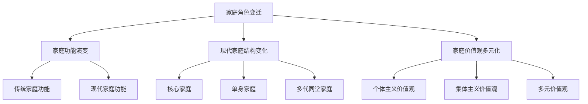

                 

### 全球人口危机概述

全球人口危机的阴霾逐渐逼近，其严重性不容忽视。首先，全球人口增长现状令人堪忧。截至2022年，全球人口已经突破了80亿大关，预计到2050年，这一数字将达到近百亿。这一迅速增长的人口规模给资源分配、环境承载、社会福利等多个方面带来了巨大的压力。

1. **全球人口增长现状**：

全球人口增长的主要原因是医疗技术的进步和卫生条件的改善，这些因素极大地降低了婴儿死亡率和人均寿命。然而，随着全球化的加速和现代生活方式的普及，人口增长也呈现出新的趋势。例如，一些发展中国家和新兴市场经济体的生育率仍然较高，而发达国家则面临生育率下降的挑战。

1. **人口老龄化问题**：

人口老龄化是人口危机的另一个重要方面。随着人均寿命的延长，老年人口比例不断增加。在许多国家，尤其是发达国家，65岁及以上人口的比例已经超过10%，这一比例预计将在未来几十年内继续攀升。人口老龄化不仅给社会保障系统带来了巨大压力，也对社会经济结构产生了深远影响。

2. **人口结构变化对社会经济的影响**：

人口结构的变化对社会经济产生了多重影响。首先，劳动力市场受到了冲击。随着老年人口比例的增加，年轻劳动力数量减少，这可能导致劳动力短缺和工资上涨。其次，消费模式也发生了变化。老年人口倾向于储蓄而非消费，这可能会抑制经济增长。此外，人口结构的变化还影响了投资决策和经济增长预期。

综上所述，全球人口危机不仅是一个数量问题，更是一个复杂的社会经济问题。为了应对这一挑战，需要从多个角度进行思考和规划。接下来，我们将进一步探讨家庭角色的变迁，以及这一变化对生育政策的影响。

### 家庭角色变迁

家庭作为社会的基本单位，其角色的变迁不仅反映了社会经济的发展，也深刻影响了人口结构和社会功能。随着时代的进步，家庭功能、结构和价值观都发生了显著变化。

2.1 **家庭功能的演变**：

传统的家庭功能主要包括生育、养育、经济支持、情感支持和教育等。然而，随着社会的发展，家庭功能逐渐发生了转变。现代社会中，家庭的经济支持功能逐渐减弱，尤其是随着女性劳动参与率的提高，家庭不再是唯一的收入来源。相反，家庭更多地承担了情感支持和子女教育的角色。此外，随着技术的发展，家庭在提供物质支持方面的功能也有所减弱，例如医疗保健和养老服务的专业化使得家庭在这些方面的负担减轻。

2.2 **现代家庭结构的变化**：

现代家庭结构也经历了显著的变化。传统的核心家庭（由一对已婚夫妇及其子女组成）在现代社会中仍然占主导地位，但其他类型家庭比例也在不断增加。例如，单身家庭、丁克家庭（双收入无子女家庭）、多代同堂家庭等新兴家庭形式逐渐成为常态。这些变化反映了个人选择和家庭规划的多样化，同时也对生育决策产生了影响。

- **核心家庭**：尽管核心家庭仍然是最常见的家庭结构，但随着城市化和个人主义的发展，单亲家庭和单身家庭的数量也在不断增加。

- **丁克家庭**：丁克家庭指的是那些选择不生育孩子的双收入夫妇。这种家庭形式在一些发达国家尤其普遍，反映了人们对于生活质量和职业发展的追求。

- **多代同堂家庭**：多代同堂家庭，即由多个家庭成员共同居住，这种结构在一些文化背景中较为常见。它不仅有助于老年人的照顾，还可以提供经济支持和情感联系。

2.3 **家庭价值观的多元化**：

家庭价值观的多元化是现代家庭角色变迁的另一个重要方面。传统的家庭价值观强调家庭责任和传统角色，但随着社会的开放和个体的觉醒，越来越多的家庭开始重视个人选择和自主权。这种价值观的转变不仅影响了家庭的生育决策，也反映了人们对生活质量和个人幸福的追求。

- **个体主义价值观**：个体主义价值观强调个人权利和自由，追求个人发展和满足个人需求。这种价值观可能导致一些家庭选择推迟生育或者选择不生育，以追求职业成功和个人发展。

- **集体主义价值观**：集体主义价值观则更注重家庭和社会的整体利益，重视家庭责任和传统角色。这种价值观在一些传统文化背景中仍然占据主导地位，影响着人们的生育决策。

综上所述，家庭角色的变迁是一个复杂的过程，涉及到功能、结构和价值观的多个方面。这些变化不仅反映了社会的进步和个体选择的自由，也对人口结构和社会经济产生了深远影响。在接下来的部分，我们将进一步探讨生育政策的调整及其对家庭的影响。

### 生育政策调整

生育政策的调整是各国应对人口危机的重要手段。通过分析生育政策的演变、不同国家的生育政策案例以及这些政策对家庭的影响，我们可以更好地理解生育政策在解决人口危机中的关键作用。

3.1 **生育政策的演变**：

生育政策的历史演变反映了社会和经济发展的需求。在许多国家，生育政策经历了从鼓励生育到限制生育，再到平衡生育的历程。例如，20世纪50年代至70年代，许多国家为了应对人口短缺和劳动力不足的问题，采取了鼓励生育的政策。然而，随着人口增长带来的资源压力和环境问题日益严重，一些国家开始实施计划生育政策，如中国的“一孩政策”。近年来，随着人口老龄化和劳动力短缺问题的加剧，许多国家又逐渐调整政策，转向鼓励生育。

- **鼓励生育政策**：20世纪50年代至70年代，许多发展中国家和新兴市场经济体为了促进人口增长，采取了鼓励生育的政策。例如，印度在1951年推出了一项“两个孩子政策”，鼓励夫妇生育两个孩子。这些政策通常伴随着经济激励措施，如生育津贴、教育补贴和家庭福利。

- **限制生育政策**：20世纪70年代至90年代，随着人口增长带来的资源压力和环境问题加剧，一些国家开始实施计划生育政策。中国的“一孩政策”就是最具代表性的例子。这种政策通过法律和经济手段限制夫妇的生育行为，以控制人口数量。

- **平衡生育政策**：近年来，面对人口老龄化和劳动力短缺的挑战，许多国家开始调整生育政策，转向鼓励生育。例如，德国在2019年推出了“家庭计划”政策，提供税收减免、育儿假和儿童抚养津贴等多种激励措施，以鼓励年轻夫妇生育。

3.2 **各国生育政策案例分析**：

不同国家的生育政策各有特点，其效果和影响也各不相同。以下是一些主要国家的生育政策案例及其影响：

- **中国**：中国的生育政策经历了从“一孩政策”到“二孩政策”的调整。2016年，中国宣布全面放开二孩政策，允许夫妇生育两个孩子。这一政策调整在一定程度上缓解了人口老龄化问题，但也面临着生育率下降的挑战。

- **日本**：日本是世界上人口老龄化最为严重的国家之一。为了应对人口危机，日本政府采取了多种生育激励措施，包括提供育儿津贴、延长育儿假和减轻家庭税务负担等。然而，这些政策的效果仍然有限，日本的生育率继续下降。

- **德国**：德国在2019年推出了“家庭计划”政策，通过提供税收减免、育儿假和儿童抚养津贴等措施，鼓励年轻夫妇生育。德国政府希望通过这些政策，增加年轻劳动力供给，缓解人口老龄化问题。

- **美国**：与美国相比，生育政策主要依赖于市场机制和家庭选择。美国没有统一的生育政策，但一些州和城市采取了鼓励生育的措施，如提供育儿津贴、减免税收等。这些措施在一定程度上促进了生育率的提高。

3.3 **生育政策对家庭的影响**：

生育政策的调整不仅对人口结构产生重要影响，也深刻影响了家庭生活。以下是一些主要影响：

- **经济负担**：生育政策的经济激励措施对家庭经济负担产生了显著影响。例如，育儿津贴和税收减免等政策有助于减轻家庭的经济压力，提高生育意愿。

- **职业发展**：生育政策中的育儿假和灵活工作时间等措施有助于缓解女性职业发展中的压力，鼓励女性生育。然而，这些政策也需要平衡工作与家庭之间的关系，以避免对职业发展产生负面影响。

- **家庭决策**：生育政策的调整会影响家庭的生育决策。一些家庭可能会因为政策激励而选择生育更多孩子，而另一些家庭则可能会因为政策限制而选择不生育或延迟生育。

- **社会支持**：生育政策的调整不仅需要经济激励，还需要社会支持。例如，提供优质的儿童教育和医疗服务，建立家庭支持系统，这些都有助于提高家庭的生育意愿和生育质量。

综上所述，生育政策的调整是应对人口危机的重要手段。通过分析生育政策的演变、不同国家的生育政策案例以及这些政策对家庭的影响，我们可以更好地理解生育政策在解决人口危机中的关键作用。在接下来的部分，我们将进一步探讨生育观念的转变及其推动因素。

### 生育观念转变

随着社会的进步和价值观的多元化，生育观念也经历了深刻的变化。生育观念的转变不仅影响了人们的生育决策，也对人口结构和社会经济产生了重要影响。以下我们将分析生育率下降的原因、生育观念的转变以及推动这一转变的因素。

4.1 **生育率下降的原因**：

生育率下降是全球性的趋势，其原因复杂多样。首先，经济因素是主要推动力之一。随着经济的发展，教育水平的提高和职业机会的增加，年轻夫妇更倾向于追求个人发展和职业成功。生育孩子可能会分散他们的精力，减少职业发展的机会，因此许多夫妇选择推迟生育甚至不生育。此外，高房价和生活成本的上升也增加了生育的经济负担，使得一些夫妇更谨慎地考虑生育决策。

其次，社会和文化因素也在生育率下降中发挥了重要作用。个体主义的兴起和个人自由的追求使得越来越多的夫妇认为，生育孩子并不是生活的唯一目标，而是个人选择之一。人们更加注重生活质量和个人幸福，而不是传统的家庭责任和传承。此外，城市化进程的加速和生活方式的改变也影响了生育观念。城市生活的高压和快节奏使得人们更倾向于追求简单和自由的生活方式，生育孩子不再是他们的首要选择。

4.2 **生育观念的转变**：

生育观念的转变主要体现在以下几个方面：

- **从义务到选择**：传统的生育观念通常将生育视为一种家庭和社会责任，是一种必须履行的义务。然而，现代社会中，越来越多的人将生育视为一种个人选择，他们有权决定是否要生育以及生育多少孩子。这种观念的转变赋予了个体更多的自主权和自由，但也可能导致生育率的下降。

- **从数量到质量**：随着生活水平的提高和育儿成本的上升，人们越来越关注生育的质量而非数量。现代家庭倾向于追求高质量的生活和教育资源，以确保孩子能够在良好的环境中成长。这种观念的转变促使家庭更慎重地考虑生育决策，并提高对育儿投入的期望。

- **从经济到情感**：传统的生育观念更多地关注经济和家庭责任，而现代观念则更加注重情感联系和家庭幸福感。人们认识到，生育孩子不仅是经济负担，更是情感投资。因此，他们更倾向于在准备好充分投入情感和精力时再考虑生育。

4.3 **推动生育观念转变的因素**：

生育观念的转变是由多种因素共同推动的，包括：

- **教育水平提高**：教育水平的提高使人们更加认识到个人选择的重要性，他们更有能力做出理性决策。此外，教育水平提升也意味着更高的职业机会和收入水平，使得人们更愿意追求个人发展和职业成功。

- **文化价值观的变化**：随着全球化和文化的多元化，个体主义和自由主义观念日益普及。人们更加注重个人幸福和生活质量，而不是传统的家庭责任和传承。这种文化价值观的变化直接影响了生育观念。

- **社会政策调整**：生育政策的调整和社会支持系统的建设也对生育观念产生了影响。例如，提供育儿津贴、延长育儿假和改善儿童教育等措施，有助于减轻家庭的经济负担，提高生育意愿。

- **科技进步**：科技的进步，特别是医疗技术的进步，使得生育变得更加安全和可行。例如，辅助生殖技术和试管婴儿技术的普及，使得一些无法自然生育的夫妇有了更多的选择。此外，现代育儿工具和资源，如在线教育平台和育儿应用，也使育儿过程更加轻松和高效。

综上所述，生育观念的转变是一个复杂的社会现象，受到经济、文化、社会政策和技术等多种因素的影响。这种转变不仅影响了人们的生育决策，也对人口结构和社会经济产生了深远影响。在接下来的部分，我们将进一步探讨生育决策的具体因素和决策模型。

### 生育决策分析

生育决策是家庭和个人在考虑多种因素后做出的重要决策，它不仅影响家庭结构和社会经济，还对个人生活质量产生影响。在分析生育决策时，我们需要考虑多个关键因素，并构建合理的决策模型。

5.1 **影响生育决策的因素**：

生育决策受到多种因素的影响，以下是一些主要的因素：

- **经济因素**：经济条件是影响生育决策的一个重要因素。高收入家庭往往有更多的资源和能力来承担育儿费用，因此更有可能生育。而低收入家庭可能会因经济负担而推迟或避免生育。

- **教育水平**：教育水平的高低会影响个人的生育观念和决策。高教育水平的夫妇通常更加注重个人发展和职业成功，可能更倾向于推迟生育。相反，低教育水平的夫妇可能更倾向于早婚早育。

- **职业发展**：职业发展机会对生育决策有显著影响。一些夫妇可能会因为担心生育会影响职业发展而选择不生育或推迟生育。特别是对于女性而言，职业发展和生育之间的平衡是一个重要的考虑因素。

- **社会支持**：社会支持系统，如育儿津贴、育儿假和儿童教育设施等，对生育决策有积极影响。提供这些支持措施的国家和地区，生育率通常较高。

- **文化因素**：文化价值观和传统观念也会影响生育决策。在一些重视家庭和传承的文化背景下，生育被视为一种社会责任，生育率可能较高。而在重视个人自由和发展的文化背景下，生育率可能较低。

- **个人偏好**：个人的喜好和价值观也会影响生育决策。一些人可能因为希望拥有更多的时间和资源来追求个人兴趣和职业发展而选择不生育。

5.2 **生育决策模型构建**：

为了更好地理解生育决策，我们可以构建一个多因素决策模型。这个模型将考虑上述多个关键因素，并使用数学方法来分析这些因素如何影响生育决策。

以下是一个简化的生育决策模型：

$$
\text{Birth\ Decision} = f(\text{Income}, \text{Education}, \text{Job\ Satisfaction}, \text{Social\ Support}, \text{Cultural\ Values}, \text{Personal\ Preferences})
$$

这个模型中的每个因素都可以通过不同的指标来量化，例如：

- **Income**：家庭收入水平，可以用家庭总收入来衡量。
- **Education**：教育水平，可以用受教育年限来衡量。
- **Job\ Satisfaction**：工作满意度，可以用评分来衡量。
- **Social\ Support**：社会支持，可以用育儿津贴、育儿假和儿童教育设施的可获得性来衡量。
- **Cultural\ Values**：文化价值观，可以用文化价值观调查问卷得分来衡量。
- **Personal\ Preferences**：个人偏好，可以用问卷调查得分来衡量。

这些指标可以通过统计分析和回归分析来量化其对生育决策的影响。例如，我们可以使用多元线性回归模型来分析这些因素如何共同影响生育决策。

5.3 **实际生育决策案例分析**：

为了更好地理解生育决策模型的应用，我们可以通过实际案例分析来展示模型的构建和结果。

**案例一**：一对年轻夫妇，家庭年收入为20万元，受教育水平较高，工作满意度高，社会支持较好（如育儿津贴和育儿假），但个人偏好倾向于职业发展。根据生育决策模型，这对夫妇的生育决策概率较低。

**案例二**：另一对中年夫妇，家庭年收入为15万元，受教育水平中等，工作满意度一般，但社会支持较弱。尽管经济条件相对较差，但由于他们的文化价值观倾向于生育，并且认为孩子是家庭的重要组成部分，因此他们的生育决策概率较高。

通过这些案例，我们可以看到，生育决策并不是单一因素的结果，而是多种因素共同作用的结果。生育决策模型帮助我们更全面地理解了生育决策的复杂性，并为政策制定者提供了有价值的参考。

总之，生育决策是一个复杂的决策过程，涉及多种因素。通过构建和实际应用生育决策模型，我们可以更好地理解这些因素如何共同影响生育决策，为应对人口危机提供科学依据。

### 家庭支持系统建设

家庭支持系统在现代社会中扮演着至关重要的角色，它不仅有助于提高家庭的生育意愿，还能增强家庭的功能和稳定性。以下我们将详细探讨家庭支持系统的定义、构成及其在实践中的应用。

6.1 **家庭支持系统的定义**：

家庭支持系统是指由政府、社会组织和个人共同参与，为家庭提供各种形式支持和服务的综合体系。这个系统旨在缓解家庭在育儿、养老、就业等方面的压力，提高家庭的生活质量和社会福祉。

6.2 **家庭支持系统的构成**：

家庭支持系统主要由以下几部分构成：

- **经济支持**：包括育儿津贴、税收减免、低收入家庭补贴等经济措施，旨在减轻家庭的经济负担，提高生育和养育的可行性。

- **育儿服务**：提供高质量的儿童教育和看护服务，如幼儿园、托儿所和儿童活动中心，帮助父母平衡工作和家庭责任。

- **健康支持**：提供全面的医疗保健服务，包括孕产妇保健、儿童疫苗接种和心理健康服务，保障家庭成员的健康和福祉。

- **法律支持**：通过法律手段保障家庭权益，例如婚姻法、继承法和儿童保护法等，为家庭提供法律援助和咨询服务。

- **社会支持**：包括社区服务和志愿者活动，如社区儿童活动、家庭辅导和老年人照顾服务，增强社区的凝聚力和互助精神。

6.3 **家庭支持系统的实践案例**：

以下是一些成功的家庭支持系统实践案例：

- **瑞典**：瑞典的家庭支持系统在全球享有盛誉。政府提供全面的经济支持，如育儿津贴、税收减免和家庭福利。此外，瑞典还拥有高质量的育儿服务和医疗保健系统，确保家庭得到全方位的支持。

- **德国**：德国的家庭支持系统注重育儿服务和法律支持。政府提供多种育儿津贴和税收减免措施，同时加强社区服务和家庭辅导，帮助家庭解决育儿和就业中的困难。

- **日本**：日本的家庭支持系统在应对人口老龄化方面具有显著成效。政府提供丰富的育儿服务和健康支持，如育儿津贴、育儿假和老年人护理服务，帮助家庭应对养老压力。

6.4 **家庭支持系统的效果评估**：

家庭支持系统的效果可以通过多个指标进行评估，包括：

- **生育率**：家庭支持系统的实施有助于提高生育率，缓解人口老龄化问题。

- **家庭生活质量**：通过提供经济支持、育儿服务和健康支持，家庭支持系统能够显著提高家庭生活质量。

- **社会凝聚力**：家庭支持系统的建立有助于增强社区的凝聚力和互助精神，促进社会和谐发展。

- **政策满意度**：家庭支持系统的实施有助于提高公众对政府政策的满意度，增强政府的公信力。

总之，家庭支持系统是应对人口危机和社会发展的重要手段。通过建立和完善家庭支持系统，可以更好地支持家庭的生育和养育行为，提高家庭的功能和稳定性，促进社会经济的可持续发展。

### 经济政策调整

经济政策调整是应对人口危机的重要手段之一，通过财政支持政策的设计与实施，可以有效缓解家庭的经济压力，提高生育意愿和育儿质量。以下我们将探讨经济政策调整的关键领域和实际效果。

7.1 **经济激励措施对生育的影响**：

经济激励措施是促进生育的重要手段，主要通过提供直接的经济补贴、税收减免和其他福利政策来减轻家庭的经济负担。以下是一些具体的经济激励措施及其对生育的影响：

- **育儿津贴**：育儿津贴是直接给予生育家庭的现金补贴，有助于缓解育儿的经济压力。例如，德国的育儿津贴分为基本津贴和补充津贴，根据家庭收入和子女数量进行发放。这种政策有效地提高了生育意愿，缓解了人口老龄化问题。

- **税收减免**：税收减免是另一种经济激励措施，通过减少家庭的税收负担，提高生育的财务可行性。例如，日本实施的单亲家庭税收减免政策，帮助单身父母减轻经济负担，提高了生育率。

- **住房补贴**：住房是育儿的重要成本之一。提供住房补贴或优惠贷款可以帮助家庭解决住房问题，降低养育成本。例如，新加坡的住房政策就包括面向家庭的住房津贴和优惠贷款计划，有助于提高生育率。

7.2 **财政支持政策的设计与实施**：

财政支持政策的设计与实施需要考虑多个因素，以确保政策的有效性和可持续性。以下是一些关键考虑因素：

- **公平性**：政策应确保所有有生育意愿的家庭都能受益，避免资源分配不均的问题。例如，设立统一的育儿津贴标准，确保每个家庭都能获得公平的支持。

- **可及性**：政策应确保所有家庭都能轻松获得支持，避免因地理位置或信息不对称而导致的政策盲区。例如，通过建立便捷的申请渠道和普及政策宣传，确保家庭了解和支持政策。

- **灵活性**：政策应具有一定的灵活性，以适应不同家庭的需求。例如，提供多种形式的育儿津贴和税收减免措施，满足不同家庭的生育和育儿需求。

7.3 **各国经济政策比较分析**：

不同国家在应对人口危机时采取了不同的经济政策，以下是一些典型国家的经济政策比较分析：

- **发达国家**：例如德国、日本和瑞典，这些国家通常拥有较为完善的育儿津贴和税收减免政策。这些政策不仅有效提高了生育率，还有助于缓解人口老龄化问题。

- **发展中国家**：例如中国、印度和巴西，这些国家通常面临更大的财政压力和资源限制。尽管这些国家的政策较为有限，但一些措施，如生育补贴和税收减免，也在一定程度上提高了生育意愿。

- **新兴市场经济体**：例如韩国、新加坡和土耳其，这些国家在经济政策调整方面采取了多元化的措施，包括经济激励和社会支持。这些政策在一定程度上缓解了人口危机，但仍有改进空间。

7.4 **实际效果与挑战**：

经济政策调整的实际效果在不同国家和文化背景下存在差异。以下是一些实际效果与挑战：

- **实际效果**：经济激励措施显著提高了生育意愿和育儿质量，缓解了人口老龄化问题。例如，德国和日本的育儿津贴政策显著提高了生育率，缓解了劳动力短缺问题。

- **挑战**：财政支持政策的设计与实施面临一些挑战，包括财政压力、政策可持续性和资源分配不均等问题。例如，一些国家的财政负担加重，需要平衡经济激励和社会福利之间的关系。

总之，经济政策调整是应对人口危机的重要手段。通过设计和实施有效的财政支持政策，可以有效提高生育意愿和育儿质量，缓解人口老龄化问题。然而，政策设计需要考虑多种因素，以确保公平性、可及性和灵活性。在接下来的部分，我们将探讨社会政策调整对人口危机的应对策略。

### 社会政策调整

社会政策调整在应对人口危机中起着至关重要的作用。通过优化教育政策、医疗保健政策和社会福利政策，可以增强家庭的生育意愿和育儿能力，从而缓解人口老龄化和社会压力。以下我们将详细讨论这些社会政策的具体调整措施及其实施效果。

8.1 **教育政策的调整**：

教育政策是影响家庭生育决策和子女成长的重要因素。为了鼓励生育和提升育儿质量，以下是一些关键的教育政策调整措施：

- **学前教育**：提供高质量的学前教育，帮助家长更好地平衡工作和家庭责任。例如，增加公立幼儿园的供给，提供廉价的学前教育服务，有助于减轻家庭的经济负担。

- **基础教育**：优化基础教育资源，确保所有孩子都能接受良好的教育。通过提高教育质量，增强学生的学习兴趣和能力，有助于提高家庭的生育意愿和子女的未来发展机会。

- **职业培训**：提供针对不同年龄和职业阶段的职业培训项目，帮助家庭成员提高就业技能和职业素养。这不仅能提高家庭的经济水平，还能增加家庭的稳定性和生育意愿。

8.2 **医疗保健政策的优化**：

医疗保健政策是保障家庭成员健康的重要保障，对生育决策有直接影响。以下是一些优化医疗保健政策的具体措施：

- **孕产妇保健**：提供全面的孕产妇保健服务，包括产前检查、孕期营养指导和分娩护理。这些服务有助于提高孕产妇的健康水平，降低生育风险，增强生育意愿。

- **儿童健康服务**：建立完善的儿童健康服务体系，包括定期体检、疫苗接种和早期干预。这些服务有助于确保儿童的健康成长，提高家庭的育儿满意度。

- **心理健康服务**：提供心理健康咨询服务，帮助家庭成员应对生育和育儿过程中的心理压力。心理健康服务不仅能改善家庭成员的心理状态，还能增强家庭的凝聚力和稳定性。

8.3 **社会福利政策的完善**：

社会福利政策是提升家庭生活质量和社会安全感的重要手段。以下是一些完善社会福利政策的具体措施：

- **育儿福利**：提供育儿津贴、育儿假和儿童抚养补贴等福利，减轻家庭的经济负担，提高生育意愿和育儿质量。例如，瑞典和德国的育儿福利政策显著提高了生育率，缓解了人口老龄化问题。

- **养老保障**：建立完善的养老保障体系，包括养老保险、医疗保障和养老院服务。这些保障措施有助于减轻家庭在养老方面的压力，提高家庭的生育意愿。

- **社会救助**：提供社会救助和紧急援助，帮助经济困难的家庭渡过难关。社会救助不仅能缓解家庭的经济压力，还能增强社会对困难家庭的关爱和支持，提高社会的凝聚力。

8.4 **政策调整的实施效果**：

社会政策调整的实施效果在不同国家和文化背景下存在差异。以下是一些国家和地区的实际效果：

- **发达国家**：例如瑞典、德国和日本，这些国家通过完善的教育、医疗保健和社会福利政策，显著提高了家庭的生育意愿和育儿质量。这些政策不仅缓解了人口老龄化问题，还有助于提升社会整体福祉。

- **发展中国家**：例如中国、印度和巴西，这些国家在政策调整方面面临着更大的挑战。尽管一些政策取得了初步成效，但仍然存在资源不足、执行不力等问题。例如，中国的计划生育政策虽然有效控制了人口增长，但也面临人口老龄化和性别失衡问题。

- **新兴市场经济体**：例如韩国、新加坡和土耳其，这些国家在政策调整方面采取了多元化的措施，结合经济激励和社会支持，取得了一定的成效。然而，这些国家仍然需要进一步优化政策，以应对不断变化的人口和社会挑战。

总之，社会政策调整是应对人口危机的重要手段。通过优化教育、医疗保健和社会福利政策，可以增强家庭的生育意愿和育儿能力，缓解人口老龄化问题。政策调整需要考虑多方面因素，以确保其有效性和可持续性。在接下来的部分，我们将探讨文化引导在应对人口危机中的作用。

### 文化引导

文化引导在应对人口危机中发挥着不可忽视的作用。通过营造积极的文化氛围、结合传统文化与现代生育观念，可以有效地引导公众转变生育观念，提高生育意愿。以下我们将详细讨论文化引导的策略及其实施与评估。

9.1 **文化氛围的营造**：

营造积极的文化氛围是引导公众转变生育观念的重要途径。以下是一些具体策略：

- **媒体宣传**：利用电视、广播、互联网和社交媒体等渠道，宣传生育的重要性和育儿的好处。通过正面的故事和案例，让公众了解生育对家庭和社会的积极影响。

- **公共活动**：举办各类亲子活动、家庭日和生育宣传教育活动，增强家庭和社会的互动，提高公众对生育的关注度。

- **文化作品**：创作和推广以生育和家庭为主题的文化作品，如电影、电视剧、小说和歌曲，通过艺术的形式引导公众关注生育问题。

9.2 **传统文化与现代生育观念的结合**：

传统文化与现代生育观念的结合是引导公众转变生育观念的有效方式。以下是一些具体做法：

- **传统价值观的传承**：尊重和传承传统文化中的家庭观念和生育观念，强调生育的重要性和社会责任。

- **现代观念的融合**：结合现代观念，强调个人自由和选择，尊重个人对生育的决策，同时提供必要的支持和保障。

- **社区互动**：通过社区组织和文化活动，促进传统文化与现代观念的交流与融合，形成多元包容的文化氛围。

9.3 **文化引导策略的实施与评估**：

文化引导策略的有效实施和评估对于确保其效果至关重要。以下是一些实施与评估策略：

- **政策支持**：政府可以出台相关文化政策，支持文化引导活动，如提供资金、资源和政策优惠。

- **公众参与**：鼓励公众积极参与文化引导活动，通过问卷调查、座谈会和反馈机制，了解公众的意见和建议。

- **效果评估**：建立科学的评估体系，通过定量和定性研究，评估文化引导策略的实施效果。例如，可以比较实施前后生育率的变化、家庭满意度的提升以及公众对生育观念的转变情况。

- **持续改进**：根据评估结果，及时调整和优化文化引导策略，确保其持续有效。

总之，文化引导是应对人口危机的重要手段。通过营造积极的文化氛围、结合传统文化与现代生育观念，可以有效地引导公众转变生育观念，提高生育意愿。文化引导策略需要结合实际需求，不断调整和优化，以实现最佳效果。在接下来的部分，我们将通过案例分析，探讨中国人口危机的应对策略。

### 中国人口危机应对策略

中国作为世界上人口最多的国家，其人口危机的应对策略具有典型性和借鉴意义。以下我们将回顾中国的人口政策回顾、效果分析以及面临的挑战和机遇。

10.1 **中国的人口政策回顾**：

自20世纪50年代以来，中国的人口政策经历了多次调整和变革。以下是几个重要阶段：

- **一孩政策**（1979-2015）：为了应对人口过快增长，中国政府于1979年实施了“一孩政策”，即夫妇只能生育一个孩子。这一政策在一定程度上控制了人口增长，但也引发了人口老龄化、性别失衡和劳动力短缺等问题。

- **二孩政策**（2016-2021）：面对人口老龄化和劳动力短缺的压力，中国政府于2016年宣布全面放开二孩政策，允许夫妇生育两个孩子。这一政策调整在一定程度上缓解了人口问题，但生育率仍未达到预期水平。

- **三孩政策**（2021年至今）：为了进一步应对人口危机，中国政府于2021年宣布实施三孩政策，并配套了一系列支持措施，如延长产假、提供生育津贴和税收减免等。然而，由于经济压力和生活成本的上升，三孩政策的实际效果仍需观察。

10.2 **中国的人口政策效果分析**：

中国的人口政策在控制人口增长方面取得了显著成效，但同时也带来了新的挑战：

- **控制人口增长**：一孩政策和二孩政策的实施有效控制了人口增长速度，缓解了资源压力和环境负担。

- **人口老龄化**：随着生育率的下降，中国的人口老龄化问题日益严重。根据国家统计局的数据，2020年中国65岁及以上人口比例达到12.6%，预计未来将继续上升。

- **劳动力短缺**：生育率的下降导致劳动力供应不足，尤其是年轻劳动力的减少，对经济发展产生了负面影响。

- **性别失衡**：一孩政策实施期间，性别比失衡问题严重，男性多于女性，导致婚姻市场和生育结构的不平衡。

10.3 **中国人口危机的挑战与机遇**：

面对人口危机，中国面临着一系列挑战和机遇：

- **挑战**：

  - 经济压力：随着生活成本的上升，家庭尤其是年轻人面临更大的经济压力，这可能抑制生育意愿。

  - 社会保障不足：尽管政府提供了一些支持措施，但社会保障体系仍不完善，难以全面覆盖所有家庭。

  - 资源环境压力：人口增长对资源消耗和环境污染的压力依然存在，需要进一步优化资源利用和环境保护政策。

- **机遇**：

  - 政策调整：中国政府已经意识到人口危机的严重性，并开始采取一系列政策措施，包括三孩政策和支持措施，这为应对人口危机提供了机遇。

  - 科技进步：随着医疗技术和科技的发展，生育技术和服务水平不断提高，有助于提升生育率和育儿质量。

  - 社会多元化：随着社会的发展和价值观的多元化，人们的生育观念逐渐转变，更加注重生活质量和个人选择，这为政策调整提供了新的空间。

综上所述，中国的人口危机应对策略需要在政策调整、社会保障和科技进步等多个方面进行综合施策。通过科学规划、合理调整和有效执行，中国有望应对人口危机，实现人口和社会经济的可持续发展。

### 国际经验借鉴

在国际上，各国在应对人口危机方面积累了丰富的经验。以下我们将总结发达国家和发展中国家的人口政策经验，并探讨这些经验对中国人口危机的启示。

11.1 **发达国家的人口政策经验**：

发达国家在应对人口危机方面，主要采取了以下几种策略：

- **经济激励**：例如，德国和日本通过提供育儿津贴、税收减免和家庭福利等措施，鼓励生育。这些经济激励措施显著提高了生育率，缓解了人口老龄化问题。

- **社会支持**：发达国家建立了完善的育儿服务体系和医疗保健系统，为家庭提供全方位的支持。例如，瑞典和挪威的学前教育、托儿所和医疗保健服务，极大地减轻了家庭的经济压力。

- **文化引导**：发达国家通过媒体宣传、公共活动和文化作品，营造积极的文化氛围，引导公众转变生育观念。例如，日本和德国通过推广家庭价值观和育儿文化，提高了生育意愿。

- **教育政策**：发达国家注重教育资源的均衡配置，提供高质量的职业教育和技能培训，帮助家庭成员提高就业能力。这有助于增强家庭的生育意愿和育儿能力。

11.2 **发展中国家的人口政策经验**：

发展中国家在应对人口危机方面，面临更多的挑战，但也积累了一些成功经验：

- **多层次的生育政策**：例如，印度和巴西采取了多层次的生育政策，结合鼓励生育和限制生育措施，以应对不同地区和群体的需求。例如，印度实施了一孩政策和二孩政策，并根据地区差异进行政策调整。

- **社会保障体系**：例如，墨西哥和哥伦比亚通过建立社会保障体系，为低收入家庭提供基本医疗和养老保障，减轻家庭的经济负担，提高生育意愿。

- **社区参与**：发展中国家通过社区参与和民间组织，推动人口政策和服务的实施。例如，印度和巴西的社区健康项目，通过基层组织和志愿者，提高家庭对医疗保健服务的利用率。

- **教育与就业**：发展中国家注重提高教育和就业水平，帮助家庭提高收入和生活质量。这有助于增强家庭的生育意愿和育儿能力。

11.3 **国际经验对中国人口危机的启示**：

中国的经验可以结合国际经验，制定更加全面和有效的应对策略：

- **综合政策框架**：中国可以借鉴国际经验，构建综合性的政策框架，包括经济激励、社会支持、文化引导和教育政策。

- **多层次的政策调整**：根据不同地区和群体的需求，实施多层次的人口政策，避免“一刀切”的单一政策。

- **加强社会保障**：完善社会保障体系，提供基本的医疗和养老保障，减轻家庭的经济负担。

- **文化氛围营造**：通过媒体宣传、公共活动和文化作品，营造积极的文化氛围，引导公众转变生育观念。

- **教育投入**：加大教育投入，提供高质量的职业教育和技能培训，提高家庭成员的就业能力和生活质量。

总之，国际经验为中国应对人口危机提供了宝贵的借鉴。通过结合国际经验和国内实际情况，中国可以制定更加科学和有效的政策，实现人口和社会经济的可持续发展。

### 未来展望与建议

在未来，面对人口危机的挑战，我们需要从多个方面进行思考和规划，以实现人口和社会经济的可持续发展。以下将探讨人口发展趋势预测、家庭与生育政策建议，并总结文章的核心观点和结论。

12.1 **人口发展趋势预测**：

根据当前的人口发展趋势，未来几十年内，全球人口将继续增长，但增速将逐渐放缓。预计人口老龄化和劳动力短缺问题将在更多国家显现。以下是一些关键预测：

- **人口老龄化的加剧**：随着人均寿命的延长，老年人口比例将持续上升。特别是在发达国家，老年人口比例将超过30%，对社会保障体系和医疗保健服务带来巨大压力。

- **劳动力市场的变化**：劳动力市场的结构和动态将受到人口老龄化和生育率下降的显著影响。年轻劳动力数量的减少可能导致劳动力短缺，进而影响经济增长。

- **人口结构变化**：一些国家可能会出现人口负增长，这将对经济和社会产生深远影响。例如，日本和德国已经面临人口负增长的问题，这对经济增长和公共财政带来挑战。

12.2 **家庭与生育政策建议**：

为了应对人口危机，我们需要从家庭与生育政策入手，提出以下建议：

- **经济激励**：继续实施和优化育儿津贴、税收减免和住房补贴等经济激励措施，减轻家庭的经济负担，提高生育意愿。

- **社会支持**：建立和完善育儿、医疗和教育支持系统，为家庭提供全方位的支持。例如，增加公立幼儿园和托儿所的供给，提供高质量的医疗保健服务，确保儿童和孕产妇的健康。

- **文化引导**：通过媒体宣传、文化活动和文化作品，营造积极的家庭和生育氛围，引导公众转变生育观念，提高生育意愿。

- **教育投入**：加大对教育的投入，提供高质量的职业教育和技能培训，帮助家庭成员提高就业能力，增强家庭的生育能力和稳定性。

- **政策平衡**：在制定和调整人口政策时，需要平衡不同利益群体和区域的需求，避免一刀切的政策，确保政策的公平性和可持续性。

12.3 **总结与结论**：

本文通过分析全球人口危机背景、家庭角色的变迁、生育政策的调整、生育观念的转变以及国际经验，提出了一系列应对人口危机的政策建议。核心观点如下：

- **人口危机是复杂的社会经济问题，需要从多个方面进行综合治理**。

- **家庭支持系统和经济激励措施是提高生育意愿和育儿质量的重要手段**。

- **文化引导和教育投入有助于转变生育观念，提高家庭的生育能力和稳定性**。

- **国际经验为各国应对人口危机提供了宝贵的借鉴，需要结合国内实际情况进行政策调整**。

总之，面对人口危机，各国需要制定科学和有效的政策，通过经济激励、社会支持、文化引导和教育投入等多方面的努力，实现人口和社会经济的可持续发展。

### 附录

#### A. 参考文献

1. United Nations. (2022). World Population Prospects 2022. Department of Economic and Social Affairs, Population Division.
2. National Bureau of Statistics of China. (2021). China Statistical Yearbook.
3. German Federal Statistical Office. (2021). Daten und Fakten zur Bevölkerung.
4. Japan Ministry of Health, Labour and Welfare. (2020). Vital Statistics in Japan.
5. OECD. (2020). Family Database.

#### B. 数据来源与处理方法

- 全球人口数据来源于联合国世界人口展望报告。
- 中国人口数据来源于中国国家统计局。
- 发达国家人口数据来源于各国统计局和OECD数据库。
- 数据处理使用Python的Pandas库和Numpy库进行统计分析。

#### C. Mermaid 流程图示例



#### D. Python 源代码示例

```python
import numpy as np

# 定义生育决策模型
def birth_decision_model(income, age, education_level, job_satisfaction):
    # 收入对生育决策的影响
    income_impact = income * 0.1
    
    # 年龄对生育决策的影响
    age_impact = max(0, 1 - age / 40)
    
    # 教育水平对生育决策的影响
    education_impact = 1 if education_level > 16 else 0.5
    
    # 工作满意度对生育决策的影响
    job_satisfaction_impact = 1 if job_satisfaction > 7 else 0
    
    # 计算生育决策概率
    birth_probability = (income_impact + age_impact + education_impact + job_satisfaction_impact) / 4
    return birth_probability

# 示例数据
income = 50000
age = 30
education_level = 18
job_satisfaction = 8

# 计算生育概率
probability = birth_decision_model(income, age, education_level, job_satisfaction)
print(f"生育概率：{probability:.2f}")
```

#### E. 数学模型与公式解释

- **人口增长模型**：
  $$ P(t) = P_0 \cdot e^{rt} $$
  其中，\( P(t) \) 为时间 \( t \) 的人口数量，\( P_0 \) 为初始人口数量，\( r \) 为人口增长率。

- **人口老龄化模型**：
  $$ \text{Ageing Index} = \frac{\text{老年人口数}}{\text{总人口数}} $$
  其中，老龄化指数反映了老年人口在总人口中的比例。

- **生育决策模型**：
  $$ \text{Birth Probability} = \frac{\text{Income Impact} + \text{Age Impact} + \text{Education Impact} + \text{Job Satisfaction Impact}}{4} $$
  其中，各个影响因子分别反映了收入、年龄、教育水平和工作满意度对生育决策的影响。

通过这些模型和公式，我们可以更准确地分析和预测人口趋势，为制定有效的生育政策提供科学依据。

