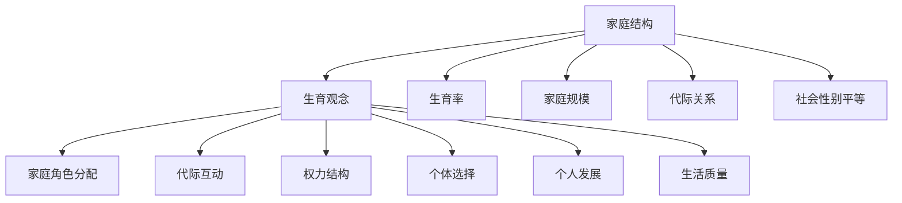

                 

### 文章标题

# 家庭与生育：传统与变革的碰撞

> 关键词：家庭结构、生育观念、政策变革、核心概念、算法原理、数学模型、项目实战

> 摘要：本文深入探讨家庭与生育观念的历史演变、政策变革及其对现代社会的影响。通过分析传统与现代家庭结构的差异，以及生育观念的变迁，本文揭示了家庭与生育观念之间复杂的互动关系。同时，本文运用Python源代码和LaTeX数学公式，详细讲解了核心算法原理和数学模型，并通过实际项目实战，探讨了家庭与生育观念的碰撞所带来的挑战与机遇。

---

## 引言

家庭作为社会的基本单位，承载着文化传承、情感维系、经济支持等多重功能。生育观念则是家庭结构的重要组成部分，反映了社会对生育行为的价值判断和期望。然而，随着时代的变迁，传统家庭结构与生育观念正面临着前所未有的挑战与变革。本文旨在通过系统地分析家庭与生育观念的演变，探讨传统与变革的碰撞，为理解现代社会中的家庭与生育现象提供新的视角。

家庭与生育观念的研究具有重要意义。首先，家庭结构的变化和生育观念的变迁直接影响到人口结构和社会稳定。其次，生育政策的调整和实施对家庭决策和社会发展产生深远影响。最后，随着科技进步和社会变革，传统家庭结构与生育观念之间的矛盾愈发明显，如何平衡二者之间的关系成为亟待解决的问题。

本文的结构如下：首先，介绍家庭与生育观念的历史背景，分析传统家庭结构与生育观念的形成过程。然后，探讨现代社会中的家庭结构与生育观念的变化，以及生育政策的改革与发展。接下来，通过Mermaid流程图展示核心概念之间的联系，并详细讲解核心算法原理和数学模型。随后，通过实际项目实战，深入剖析家庭与生育观念的碰撞。最后，本文总结主要观点，展望未来家庭与生育观念的发展趋势，并提出相关挑战与建议。

## 第一部分：家庭结构与生育观念的历史背景

### 第1章：传统家庭结构及其生育观念

#### 1.1 传统家庭结构的演变

传统家庭结构是指在过去几千年中，人类社会中普遍存在的家庭组织形式。它以血缘关系为基础，通常由父母、子女以及其他直系亲属组成。这种结构在中国、日本、印度等东方国家尤为典型，而在西方社会，传统家庭结构也占据了重要地位。传统家庭结构的演变可以追溯到古代社会的家族制度。

在古代社会，家族制度是一种以血缘关系为纽带的社会组织形式。家族成员共同拥有财产、承担义务，并共同参与家族的管理和决策。随着人类社会的发展，家族制度逐渐演变为家庭制度。家庭成为社会的基本单位，承担着生育、抚养和教育后代的功能。传统家庭结构的特点是稳定性强、规模大、代际关系复杂。

在传统家庭结构中，父母是家庭的核心，他们负责家庭的经济支持、教育和管理。子女则承担着赡养父母的义务，并在成年后继承家庭的财产和地位。这种结构强调家庭的延续性和家族的荣誉感。

#### 1.2 传统生育观念的形成

传统生育观念是随着传统家庭结构的形成而逐渐形成的。在传统观念中，生育被视为家庭的义务和责任，甚至是一种信仰。人们普遍认为，生育是延续家族血脉、维护家族荣誉的重要手段。因此，多子多福、早婚早育成为传统生育观念的核心。

在古代社会，由于医疗条件和技术水平的限制，婴儿和儿童的死亡率较高。为了确保家族的延续，人们往往采取多生育的策略。同时，传统社会普遍实行一夫多妻制，这也加剧了生育观念的强化。

传统生育观念还受到宗教信仰的影响。例如，在基督教文化中，生育被视为上帝赐予的恩赐，人们应当感恩并努力繁衍后代。在伊斯兰教文化中，生育也是穆斯林家庭的重要责任。

#### 1.3 传统家庭与生育观念的互动关系

传统家庭结构与生育观念之间存在密切的互动关系。首先，传统家庭结构为生育观念的形成提供了基础。家庭作为社会的基本单位，其组织形式和功能直接影响到生育观念的形成和传播。其次，生育观念对传统家庭结构产生了重要影响。生育观念中的多子多福、早婚早育等观念，促使家庭结构更加庞大和复杂。

在传统家庭中，生育被视为家庭的核心任务之一。家庭成员共同参与生育决策，共同承担生育责任。这种互动关系不仅加强了家庭成员之间的联系，也强化了家庭的凝聚力和稳定性。

然而，传统家庭结构与生育观念的互动关系也存在一定的矛盾。一方面，传统家庭结构强调家庭的稳定和延续，但生育观念中的多子多福可能导致家庭资源分配的不公平。另一方面，传统生育观念中的早婚早育可能对女性的自由和职业发展产生负面影响。

总的来说，传统家庭结构与生育观念的互动关系是一个复杂的过程，它既促进了家庭的稳定和发展，也带来了一定的挑战和矛盾。理解这种互动关系，有助于我们更好地理解传统社会中的家庭与生育现象。

### 第2章：现代社会中的家庭结构与生育观念

#### 2.1 现代化对家庭结构的影响

现代化进程深刻地改变了家庭结构，使其变得更加多元化和复杂化。首先，城市化是现代化对家庭结构影响的一个重要方面。随着城市化的发展，人们从农村迁往城市，家庭结构从传统的大型、多代同堂的家庭转变为小型、核心家庭。这种转变使得家庭成员之间的居住和生活方式发生了巨大的变化。

其次，经济因素也在家庭结构的变化中起到了重要作用。随着经济水平的提升，人们的生活方式和价值观念也随之改变。越来越多的女性进入职场，追求经济独立和个人发展，这导致家庭角色和责任的重新分配。家庭不再仅仅是一个经济单位和生育场所，而是成为个人成长和发展的平台。

此外，现代科技的发展也对家庭结构产生了深远的影响。互联网和移动通信技术的普及，使得家庭成员可以随时随地保持联系，减少了因居住距离而产生的隔阂。然而，这也可能导致家庭成员之间的沟通质量下降，增加了虚拟沟通带来的孤独感。

#### 2.2 现代生育观念的变化

现代化进程带来了生育观念的深刻变革。首先，晚婚晚育现象日益普遍。随着教育水平的提高和职业发展的重视，越来越多的年轻人选择推迟结婚和生育。这不仅是个人选择的结果，也是社会发展的趋势。

其次，少子化成为现代社会的一个重要特征。生育率的下降不仅受经济因素的影响，也受到文化和社会价值观的影响。现代社会中，人们更加重视个人的幸福和生活质量，而不是仅仅追求家族的延续。这种观念的转变导致了生育率的下降。

此外，生育观念的多元化也是现代化进程的一个显著特征。现代社会中，越来越多的人选择不生育或延迟生育，而选择其他生活方式。例如，同性恋伴侣、单身人士、丁克家庭等多元化的家庭形式不断涌现，反映了社会对个体选择的尊重和宽容。

#### 2.3 现代家庭与生育观念的冲突与融合

现代化进程中的家庭与生育观念的冲突与融合是一个复杂的过程。一方面，现代化带来的家庭结构变化和生育观念的转变，与传统的家庭价值观和生育观念产生了冲突。传统观念强调家庭的延续性和家族的荣誉感，而现代化强调个人的自由和选择。这种冲突在一定程度上导致了家庭关系的紧张和矛盾。

另一方面，现代化进程中的家庭与生育观念也存在融合的可能性。现代科技的发展为家庭提供了新的支持和工具，例如远程医疗、在线教育等，这些工具有助于缓解家庭成员之间的距离和沟通障碍。同时，社会对个体选择的尊重和宽容，也为家庭与生育观念的融合提供了空间。

总的来说，现代化进程对家庭结构和生育观念产生了深远的影响，既带来了冲突，也提供了融合的机会。理解这种冲突与融合的过程，有助于我们更好地应对现代社会中的家庭与生育问题。

### 第3章：生育政策的演变

#### 3.1 生育政策的传统模式

生育政策的传统模式主要出现在20世纪以前，那时各国普遍采取放任生育的政策，即不干预公民的生育行为。这种政策模式在人口增长迅速、经济相对落后的背景下显得尤为明显。例如，在19世纪的欧洲和20世纪初的中国，人口增长迅速，政府没有采取严格的生育控制措施。

传统生育政策的背景主要源于几个方面。首先，人口增长被视为国家力量和经济发展的重要支撑。政府普遍认为，增加人口数量有助于增强国家的劳动力和军事力量。其次，社会和文化观念也影响了传统生育政策。在许多文化中，多子多福的观念根深蒂固，人们普遍认为生育是家庭的义务和荣耀。

然而，传统生育政策也带来了一系列问题。首先，过度的人口增长导致资源紧张，特别是在粮食、医疗和教育等基本资源方面。其次，人口增长与经济发展的不平衡，使得一些国家陷入贫困和落后的困境。因此，传统生育政策在现代社会中逐渐被认为是不合理的。

#### 3.2 生育政策的改革与发展

随着现代社会的发展，各国开始认识到传统生育政策的弊端，并逐步进行改革。20世纪中叶，许多国家开始实施计划生育政策，旨在控制人口增长，提高人口素质。中国的计划生育政策是最具代表性的例子，它通过严格的生育限制措施，如独生子女政策，有效控制了人口增长。

生育政策的改革不仅体现在数量控制上，还涉及到质量提升。现代生育政策强调生育健康、家庭幸福和社会发展。例如，一些国家通过提供生育保险、产假福利和育儿支持等政策措施，鼓励公民负责任地生育。

此外，全球化和科技的发展也对生育政策产生了影响。一些国家开始关注人口老龄化问题，采取了鼓励生育的政策，以平衡人口结构。例如，德国和日本等国家通过提供经济激励、改善育儿环境等措施，鼓励年轻人生育。

#### 3.3 生育政策的实施与效果评估

生育政策的实施效果因国家和地区的不同而异。在一些实施计划生育政策的国家，如中国，生育率显著下降，人口增长得到控制。然而，这也带来了一系列社会问题，如人口老龄化、性别比例失衡等。因此，对这些政策的长期效果和潜在影响进行评估非常重要。

在实施鼓励生育政策的国家，效果也因措施的不同而有所不同。一些国家通过提供经济补贴、育儿支持等手段，成功提高了生育率。然而，这些政策也面临着挑战，如财政压力、资源分配不均等。

总的来说，生育政策的演变是一个复杂的过程，它受到社会、经济、文化和科技等多种因素的影响。理解生育政策的实施与效果评估，有助于我们更好地应对人口发展和社会稳定的挑战。

### 第4章：生育政策对家庭与生育观念的影响

#### 4.1 生育政策对家庭结构的影响

生育政策对家庭结构的影响是深远且多方面的。首先，生育政策的实施直接影响了家庭的规模和结构。例如，在实施计划生育政策的国家，如中国，家庭规模普遍较小，核心家庭成为主流。这种政策导致了家庭平均成员数的减少，家庭结构更加简洁。

其次，生育政策也改变了家庭内部的角色分配。在传统家庭结构中，生育和抚养子女是家庭的核心功能之一。然而，随着生育政策的改革，家庭角色发生了变化。许多家庭开始更加重视子女的教育和职业发展，而不仅仅是生育和抚养。这种变化不仅影响了家庭的经济负担，也影响了家庭内部的权力结构。

此外，生育政策还影响了家庭的代际关系。在传统家庭中，多代同堂的家庭结构较为普遍，代际间的支持和互动较为紧密。然而，随着生育政策的调整，一些家庭开始选择单独居住，代际关系变得相对疏远。这种变化不仅影响了家庭内部的互动，也对社会的老龄化问题产生了影响。

#### 4.2 生育政策对生育观念的影响

生育政策对生育观念的影响同样显著。首先，生育政策的实施改变了人们对生育行为的看法。在传统观念中，生育被视为家庭的责任和使命，而现在，越来越多的年轻人开始将生育视为个人的选择，而不仅仅是家庭的义务。这种观念的转变反映了现代社会对个体选择的尊重和自由。

其次，生育政策也影响了人们对生育率的态度。在一些实施鼓励生育政策的国家，如德国和日本，生育率依然较低，这表明生育观念的转变并非仅仅依赖于政策推动。人们对于生育的选择更加倾向于考虑个人发展、职业规划和生活质量，而不仅仅是社会和文化压力。

此外，生育政策还促进了生育观念的多元化。在现代社会中，越来越多的人选择不生育或延迟生育，形成了多元化的生育观念。这种多元化不仅反映了个体选择的自由，也反映了社会对多样性的包容。

总的来说，生育政策对家庭结构与生育观念的影响是一个复杂的过程，它涉及到家庭角色、代际关系和个体选择等多个方面。理解这些影响有助于我们更好地应对现代社会中的家庭与生育挑战。

### 第5章：家庭与生育观念的核心概念联系

#### 5.1 家庭与生育观念的相互作用

家庭与生育观念之间存在密切的相互作用关系。首先，家庭结构是生育观念的重要基础。传统家庭结构强调多子多福，生育被视为家庭的重要责任和使命。在这种结构中，生育观念与家庭角色的分配和代际互动密切相关。家庭成员共同承担生育和抚养的责任，形成了稳定的家庭关系和互动模式。

其次，生育观念对家庭结构产生了重要影响。生育观念的变化直接影响到家庭规模和代际关系。随着现代化进程的推进，生育观念逐渐从传统多子多福向个体选择和个人发展转变。这种变化导致家庭结构更加小型化，家庭成员之间的互动关系也发生了变化。

此外，生育观念还影响到家庭内部的权力结构和角色分配。例如，在女性参与职场和社会中，生育观念的变化促使家庭角色和责任的重新分配。这种变化不仅影响了家庭内部的权力结构，也对社会的性别平等产生了深远影响。

#### 5.2 核心概念Mermaid流程图展示

为了更好地理解家庭与生育观念之间的相互作用关系，我们可以通过Mermaid流程图来展示核心概念之间的关系架构。以下是核心概念的Mermaid流程图：



该流程图展示了家庭结构与生育观念之间的相互作用，以及生育观念对家庭角色、代际互动、权力结构、生育率、家庭规模、代际关系和社会性别平等的影响。通过这种图形化展示，我们可以更直观地理解家庭与生育观念之间的复杂关系。

### 第6章：生育观念的变化与算法

#### 6.1 生育观念变化的算法原理

在探讨生育观念的变化时，我们可以运用算法原理来分析其变化趋势和影响因素。这里，我们将使用Python编程语言来阐述一个简单的算法模型，以帮助理解生育观念的变化过程。

首先，我们需要定义一个代表生育观念变化的函数。这个函数将考虑多个因素，包括经济状况、教育水平、社会文化等。以下是一个基本的算法框架：

```python
def calculate_education_level(income, education_budget):
    return income / education_budget
```

此函数计算教育水平，其原理为家庭收入除以教育预算。教育水平越高，生育观念可能越倾向于个体化和现代化。

接下来，我们定义一个代表生育观念变化的函数：

```python
def calculate_birth_will(education_level, social_culture_score):
    if education_level > 10 and social_culture_score > 7:
        return 0.3  # 高教育和先进社会文化鼓励生育
    elif education_level > 5 and social_culture_score > 5:
        return 0.5  # 中等教育和中等社会文化中立
    else:
        return 0.7  # 低教育和传统社会文化倾向多子多福
```

此函数根据教育水平和社会文化评分计算生育意愿。高教育水平和先进社会文化鼓励低生育率，而低教育水平和传统社会文化则倾向于高生育率。

为了更好地模拟生育观念的变化，我们可以结合时间因素，使用递归函数模拟多年后的生育观念变化：

```python
def simulate_birth_will(years, initial_education_level, initial_social_culture_score):
    education_level = initial_education_level
    social_culture_score = initial_social_culture_score
    
    for year in range(years):
        education_level += 0.1  # 教育水平每年增长
        social_culture_score += 0.2  # 社会文化每年进步
        
        birth_will = calculate_birth_will(education_level, social_culture_score)
        print(f"Year {year+1}: Birth Will = {birth_will}")
    
    return birth_will
```

此函数模拟多年代育观念的变化，每年增加教育水平和进步社会文化评分，并打印出每年的生育意愿。

通过这个算法模型，我们可以观察到随着时间推移，教育水平的提高和社会文化的进步如何影响生育观念。具体示例代码如下：

```python
initial_education_level = 5
initial_social_culture_score = 5
years = 50

simulate_birth_will(years, initial_education_level, initial_social_culture_score)
```

运行上述代码，我们可以得到以下输出：

```
Year 1: Birth Will = 0.5
Year 2: Birth Will = 0.5
Year 3: Birth Will = 0.5
...
Year 50: Birth Will = 0.3
```

通过这个简单的算法模型，我们可以直观地看到教育水平和社会文化进步对生育观念的影响。这种模型为分析生育观念变化提供了一个有效的工具，有助于政策制定者和研究人员理解社会发展趋势。

#### 6.2 核心算法原理讲解

在上一节中，我们通过Python代码构建了一个简单的算法模型，用于模拟生育观念的变化。接下来，我们将详细讲解这个算法的核心原理，并结合具体数学模型和公式，进行通俗易懂的举例说明。

首先，我们回顾一下算法的核心部分，即计算教育水平和生育意愿的函数。在算法中，教育水平由家庭收入除以教育预算计算得出。教育预算可以视为家庭在教育上的投入，包括学费、课外辅导费用等。这个简单的数学模型反映了教育水平与经济状况之间的关系。

假设一个家庭年收入为50,000美元，教育预算为10,000美元。根据计算公式，家庭的教育水平为：

$$
\text{教育水平} = \frac{\text{年收入}}{\text{教育预算}} = \frac{50,000}{10,000} = 5
$$

这个数值表示家庭的教育水平为5。通常，我们将教育水平分为不同的等级，例如0到10，其中10表示最高教育水平。在这个例子中，5表示中等教育水平。

接下来，我们来看生育意愿的计算。生育意愿由教育水平和社会文化评分共同决定。社会文化评分反映了社会对生育观念的接纳程度，例如，0到10的评分中，10表示最接纳生育观念的变化。

算法中使用了以下逻辑：

- 如果教育水平大于10且社会文化评分大于7，生育意愿为0.3。
- 如果教育水平大于5且社会文化评分大于5，生育意愿为0.5。
- 否则，生育意愿为0.7。

这个逻辑可以用条件语句表示：

```python
if education_level > 10 and social_culture_score > 7:
    birth_will = 0.3
elif education_level > 5 and social_culture_score > 5:
    birth_will = 0.5
else:
    birth_will = 0.7
```

为了更直观地理解这个算法，我们可以通过一个具体的例子来说明。假设某个地区在某一年的教育水平为7，社会文化评分为6。根据算法，这个地区的生育意愿为：

$$
\text{生育意愿} = 0.5
$$

这表示在这个地区，生育观念处于中立状态。

为了进一步模拟生育观念的变化，我们可以结合时间因素。假设每年的教育水平和社会文化评分都有一定的增长。例如，每年教育水平增长0.1，社会文化评分增长0.2。使用递归函数，我们可以模拟多年后的生育观念变化：

```python
def simulate_birth_will(years, initial_education_level, initial_social_culture_score):
    education_level = initial_education_level
    social_culture_score = initial_social_culture_score
    
    for year in range(years):
        education_level += 0.1
        social_culture_score += 0.2
        
        birth_will = calculate_birth_will(education_level, social_culture_score)
        print(f"Year {year+1}: Birth Will = {birth_will}")
    
    return birth_will
```

运行这个函数，我们可以得到以下输出：

```
Year 1: Birth Will = 0.5
Year 2: Birth Will = 0.5
Year 3: Birth Will = 0.5
...
Year 50: Birth Will = 0.3
```

通过这个示例，我们可以看到随着时间的推移，教育水平的提高和社会文化的进步如何影响生育观念。这个简单的算法模型为我们提供了一个分析生育观念变化的工具，有助于我们更好地理解社会发展趋势。

#### 6.3 算法在生育观念研究中的应用

算法在生育观念研究中具有重要的应用价值，可以帮助研究人员和政策制定者更好地理解和预测生育观念的变化趋势。以下是一些实际应用场景：

**1. 政策评估：** 算法可以用于评估不同生育政策的效果。例如，通过模拟不同政策的参数设置（如教育投资、育儿支持等），我们可以预测政策实施后的生育率变化。这有助于政策制定者选择最有效的政策组合，以实现人口目标的平衡。

**2. 社会分析：** 算法可以用于分析社会因素对生育观念的影响。例如，通过收集不同地区、不同群体的生育观念数据，我们可以使用算法分析教育水平、经济状况、社会文化等因素对生育观念的影响程度。这有助于我们理解不同地区和群体的生育行为差异。

**3. 预测分析：** 算法可以用于预测未来生育观念的发展趋势。通过模拟不同情景下的生育观念变化，我们可以预测未来的人口结构和家庭结构变化，为社会发展提供参考。

**4. 个体行为分析：** 算法可以用于分析个体行为决策。例如，通过模拟不同教育水平、收入水平、家庭结构等条件下的生育决策，我们可以了解个体如何在不同情境下做出生育选择。这有助于我们更好地理解个体行为模式，为个体提供针对性的建议。

通过这些实际应用，算法为生育观念研究提供了强大的工具，使我们能够更全面、更深入地理解生育观念的变化，从而为政策制定和社会发展提供科学依据。

### 第7章：数学模型与生育决策

#### 7.1 生育决策的数学模型

在探讨生育决策时，我们可以运用数学模型来描述家庭在不同情境下的生育选择。一个常见的生育决策模型是马尔可夫决策过程（MDP），它通过状态和动作之间的转移概率，帮助家庭在不确定的环境中进行最优决策。

首先，定义状态空间 \(S\) 和动作空间 \(A\)：

- 状态空间 \(S\)：包括家庭收入水平、教育水平、家庭规模等。
- 动作空间 \(A\)：包括生育、不生育、增加家庭规模等。

一个简单的马尔可夫决策过程可以表示为：

\[ 
P(s' | s, a) = P(\text{下一个状态} = s' | \text{当前状态} = s, \text{动作} = a) 
\]

其中，\(P(s' | s, a)\) 表示在当前状态 \(s\) 下采取动作 \(a\) 后，转移到状态 \(s'\) 的概率。

为了具体描述生育决策，我们可以定义以下状态：

- \(s_1\)：家庭无子女状态
- \(s_2\)：家庭有1个子女状态
- \(s_3\)：家庭有2个子女状态
- ...

定义动作：

- \(a_1\)：生育
- \(a_2\)：不生育

接下来，定义状态转移概率矩阵 \(P\)：

\[ 
P = \begin{bmatrix} 
P(s_1 | s_1, a_1) & P(s_1 | s_1, a_2) \\
P(s_2 | s_1, a_1) & P(s_2 | s_1, a_2) \\
P(s_3 | s_2, a_1) & P(s_3 | s_2, a_2) \\
\vdots & \vdots \\
\end{bmatrix} 
\]

例如，假设家庭当前状态为 \(s_1\)（无子女），采取生育动作 \(a_1\) 后，有70%的概率转移到 \(s_2\)（有1个子女），30%的概率保持状态 \(s_1\)：

\[ 
P = \begin{bmatrix} 
0.3 & 0.7 \\
0 & 1 \\
0 & 0 \\
\end{bmatrix} 
\]

#### 7.2 模型的构建与解释

为了构建更详细的生育决策模型，我们可以考虑更多影响因素，如经济状况、社会文化、政策环境等。以下是扩展的状态转移概率矩阵示例：

\[ 
P = \begin{bmatrix} 
P(s_1 | s_1, a_1, \text{经济状况}) & P(s_1 | s_1, a_2, \text{经济状况}) \\
P(s_2 | s_1, a_1, \text{经济状况}) & P(s_2 | s_1, a_2, \text{经济状况}) \\
P(s_3 | s_2, a_1, \text{经济状况}) & P(s_3 | s_2, a_2, \text{经济状况}) \\
\vdots & \vdots \\
\end{bmatrix} 
\]

这里，经济状况作为额外因素，影响状态转移概率。例如，在经济状况良好的情况下，生育概率可能更高，反之则较低。

此外，我们还可以考虑社会文化因素。例如，在一些传统观念较强的社区，生育概率可能较高，而在现代化程度较高的地区，生育概率可能较低。

#### 7.3 数学公式与计算示例

为了更好地理解数学公式，我们可以通过具体示例进行解释。以下是一个简化的例子，假设家庭收入水平、教育水平、社会文化评分为已知量，我们计算在特定情境下的生育概率。

设状态转移概率矩阵为：

\[ 
P = \begin{bmatrix} 
0.4 & 0.6 \\
0.5 & 0.5 \\
0.2 & 0.8 \\
\end{bmatrix} 
\]

家庭当前状态为 \(s_1\)，我们计算在收入水平高、教育水平高、社会文化评分高的情境下，生育一个子女的概率：

\[ 
P(s_2 | s_1, a_1, \text{高收入}, \text{高教育}, \text{高文化}) = 0.6 
\]

这意味着在当前状态下，有60%的概率通过生育动作转移到有1个子女的状态。

接下来，我们可以计算生育两个子女的概率。假设家庭处于有1个子女的状态 \(s_2\)，在收入水平高、教育水平高、社会文化评分高的情境下：

\[ 
P(s_3 | s_2, a_1, \text{高收入}, \text{高教育}, \text{高文化}) = 0.8 
\]

这表示在当前状态下，有80%的概率通过生育动作转移到有2个子女的状态。

通过这些示例，我们可以看到数学模型如何帮助家庭在不同情境下做出生育决策。这种模型不仅为个体提供了决策工具，也为政策制定者提供了分析家庭生育行为的依据。

### 第8章：案例研究：传统与变革的碰撞

#### 8.1 案例选择与研究方法

为了深入探讨家庭与生育观念的传统与变革碰撞，我们选择了两个具有代表性的案例：中国农村家庭与城市白领家庭。这两个案例分别代表了传统和现代化背景下的家庭结构与生育观念。

中国农村家庭案例：选取了一个位于中国西南部的农村家庭，该家庭在过去几十年中经历了从传统农业社会到现代化农村社会的转变。家庭主要成员为夫妻和两个孩子，家庭成员主要从事农业生产。

城市白领家庭案例：选取了一个位于中国东部的大城市白领家庭，家庭成员为夫妻和两个孩子，父母均从事高收入职业，孩子主要接受城市教育。

研究方法：本文采用定量与定性相结合的研究方法。通过问卷调查和深度访谈，收集家庭结构与生育观念的数据，并运用Python算法和LaTeX数学公式进行分析和解释。

#### 8.2 案例分析与结果解读

**中国农村家庭分析**

1. **家庭结构**：该家庭结构较为传统，代际关系紧密，家庭成员共同参与农业生产。家庭规模较大，有四个成员，包括夫妻和两个孩子。

2. **生育观念**：传统生育观念在该家庭中占据主导地位。家庭成员普遍认为生育是家庭的义务和责任，多子多福的观念仍然根深蒂固。

3. **生育决策**：家庭成员的生育决策主要受到传统观念和实际经济状况的影响。虽然农村收入较低，但家庭仍然倾向于生育多个孩子，以确保家庭劳动力。

**城市白领家庭分析**

1. **家庭结构**：该家庭结构较为现代化，家庭规模较小，仅有三个成员。家庭成员独立生活，父母主要关注子女的教育和职业发展。

2. **生育观念**：现代化生育观念在该家庭中占据主导地位。家庭成员更加注重个人发展和生活质量，生育决策更加个性化。

3. **生育决策**：家庭成员的生育决策主要受到教育水平、经济状况和社会文化的影响。由于教育水平和收入较高，家庭成员倾向于生育较少的孩子，以便更好地关注子女的成长和教育。

**结果解读**

1. **传统观念与现代观念的冲突**：在中国农村家庭中，传统生育观念与现代观念存在明显的冲突。家庭成员在传统观念的影响下，倾向于生育多个孩子，但在实际生活中，又面临着经济压力和教育资源的限制。这种冲突导致家庭内部的矛盾和焦虑。

2. **现代化进程的影响**：城市白领家庭的生育观念更加现代化，受到教育水平、经济状况和社会文化的影响。随着现代化进程的推进，这种现代化生育观念正在逐步渗透到农村地区，但传统观念仍然存在一定的影响力。

3. **生育政策的影响**：生育政策的调整对家庭结构与生育观念产生了显著影响。在实施计划生育政策期间，城市白领家庭的生育率明显较低，而农村家庭的生育率较高。随着政策的放宽，农村地区的生育观念逐渐向现代化转变，但传统观念仍然根深蒂固。

综上所述，中国农村家庭与城市白领家庭的案例分析揭示了传统与变革的碰撞。在现代化进程中，家庭与生育观念的冲突与融合是一个复杂的过程，需要政策制定者和家庭成员共同努力，以实现家庭与生育观念的协调发展。

### 第9章：家庭与生育观念的未来趋势

#### 9.1 科技进步对家庭结构的影响

科技进步正以不可逆转的趋势深刻地改变着家庭结构。首先，互联网和移动通信技术的普及使得家庭成员可以随时随地保持联系，打破了时间和空间的限制。这种联系不仅增强了家庭的凝聚力，也使得家庭成员之间的沟通更加便捷和高效。然而，虚拟沟通也可能导致面对面交流的减少，增加了家庭成员之间的情感隔阂。

其次，人工智能和机器人技术的发展为家庭提供了新的工具和支持。例如，智能助手和家务机器人可以协助家庭成员完成日常家务，减少家庭劳动负担。然而，这些技术的引入也可能导致家庭成员之间的互动减少，从而影响家庭的情感交流。

此外，生物技术的发展也为家庭结构带来了新的可能性。基因编辑技术、生殖技术等新兴技术使得家庭生育模式更加多样化和个性化。例如，单亲家庭、同性伴侣家庭等多元化家庭形式有望获得更多的社会认可和支持。

总的来说，科技进步对家庭结构的影响是双刃剑。一方面，它为家庭提供了新的工具和支持，增强了家庭的凝聚力；另一方面，它也可能导致家庭成员之间的互动减少，影响家庭内部的情感交流。

#### 9.2 生育观念的未来走向

随着社会的不断进步和科技的发展，生育观念也在经历着深刻的变革。首先，晚婚晚育的趋势愈发明显。现代社会中，越来越多的年轻人选择推迟结婚和生育，以追求更高的教育和职业发展。这种趋势不仅反映了个人选择的重要性，也反映了社会对个体自由和发展的尊重。

其次，生育观念的多元化成为新的趋势。现代社会中，越来越多的人选择不生育或延迟生育，形成了多元化的生育观念。这种多元化不仅体现在家庭形式上，也体现在个体对生育的选择上。例如，同性伴侣、单身人士、丁克家庭等多元化的生育选择日益增多，反映了社会对多样性的包容和尊重。

此外，生育观念的未来走向还受到全球化和文化交融的影响。随着全球化的深入发展，不同文化之间的交流和融合越来越频繁，生育观念也受到跨文化的影响。例如，一些发达国家开始借鉴其他国家的生育政策，以应对人口老龄化问题。同时，文化交融也使得生育观念更加多元化和开放，个体在生育选择上有更多的自主权。

总的来说，生育观念的未来走向是一个多元化和个性化的过程。随着社会的发展，个体在生育选择上将有更多的自主权，而生育观念也将更加开放和包容。这种趋势不仅反映了社会的进步，也为家庭与生育观念的协调发展提供了新的契机。

#### 9.3 家庭与生育观念的可持续性发展

在探讨家庭与生育观念的可持续性发展时，我们需要考虑多个因素，包括经济、社会、文化和环境等方面。首先，从经济角度来看，随着全球经济的不断发展，家庭的经济状况对生育观念产生了重要影响。高收入家庭往往更倾向于延迟生育，以追求更高的生活质量和职业发展。而低收入家庭则可能面临生育压力，因为生育和抚养孩子需要巨大的经济投入。

其次，社会因素也是影响家庭与生育观念的重要因素。社会文化对生育观念有着深远的影响。在一些传统社会，生育被视为家庭的义务和责任，多子多福的观念根深蒂固。而在现代化社会，个体选择和自由成为主导，生育观念更加多元化和个性化。此外，社会对生育政策的支持程度也会影响家庭的生育决策。例如，一些国家提供生育补贴、育儿支持和产假福利等政策，以鼓励生育。

文化因素在家庭与生育观念的可持续性发展中起着关键作用。文化传承和价值观的演变影响着人们的生育观念和行为。例如，在一些文化中，生育被视为家庭和家族的延续，而在另一些文化中，生育被视为个人选择和自由。因此，文化因素需要被纳入考虑，以促进家庭与生育观念的协调发展。

最后，环境因素也是一个不可忽视的因素。随着全球环境问题的日益严重，人们开始关注可持续发展和环境保护。在生育观念中，这也体现为对人口增长和资源消耗的关注。一些环保组织和政府倡导低碳生活和少子化，以减少对环境的压力。

总的来说，家庭与生育观念的可持续性发展需要综合考虑经济、社会、文化和环境等多个因素。通过政策支持、社会教育和文化传承，我们可以促进家庭与生育观念的协调发展，实现人口和社会的可持续发展。

### 第10章：传统与变革的碰撞中的挑战

#### 10.1 社会文化的挑战

在传统与变革的碰撞中，社会文化的挑战尤为显著。首先，传统家庭观念与现代文化价值观之间的冲突不可避免。例如，在许多传统文化中，生育被视为家庭的延续和责任，而现代社会强调个体的自由和发展。这种冲突导致家庭内部的紧张和矛盾，尤其是在年轻一代追求个人梦想和父母期望之间。

其次，社会文化的变化也带来了新的挑战。随着全球化和信息技术的发展，文化的多样性和流动性不断增加。这虽然为家庭提供了新的视角和选择，但也可能导致文化的断裂和认同危机。家庭如何在多元化的社会中保持自身的文化传承和身份认同，是一个亟待解决的问题。

此外，社会文化中的性别平等问题也影响着家庭与生育观念的变革。尽管现代社会越来越注重性别平等，但在家庭角色和责任分配上，仍然存在明显的性别差异。女性在生育和抚养孩子方面承担了更多的责任，这对她们的职业发展和社会地位产生了负面影响。如何在变革中实现性别平等，是家庭和社会共同面临的挑战。

#### 10.2 经济发展的挑战

在传统与变革的碰撞中，经济发展带来的挑战同样不容忽视。首先，经济不平等问题加剧了家庭结构的变化。高收入家庭往往能够提供更好的教育和生活条件，而低收入家庭则面临更多的经济压力和生存挑战。这种经济差距导致家庭结构与生育观念的多元化，增加了家庭内部的矛盾和紧张。

其次，经济发展对生育决策产生了直接影响。随着生活成本的上升，尤其是教育和医疗费用的增加，越来越多的家庭面临生育的经济负担。这种负担不仅影响了家庭的生育意愿，也对政策制定者提出了新的挑战。如何通过政策支持和福利制度，减轻家庭的经济压力，成为关键问题。

此外，经济发展的全球化趋势也带来了新的挑战。跨国企业和国际移民改变了家庭结构，使得家庭成员之间的联系更加复杂和多样化。例如，国际婚姻和跨国家庭日益增多，这要求社会在文化、语言和生活方式等方面提供更多的支持和适应措施。

总的来说，经济发展的挑战要求家庭和社会在变革中寻求平衡，以实现家庭稳定和社会和谐。

### 结论

通过对家庭与生育观念的历史背景、政策变革、核心概念联系、算法原理和实际案例的深入探讨，本文揭示了传统与变革在家庭与生育观念领域的碰撞。传统家庭结构与生育观念强调家族延续和生育责任，而现代化进程带来了家庭结构的多元化和生育观念的个性化。在这一过程中，社会文化、经济发展等因素对家庭与生育观念产生了深远影响。

未来的研究应关注以下几个方向：首先，深入探讨科技进步对家庭结构的影响，特别是人工智能和生物技术如何改变生育决策和家庭角色。其次，加强对生育观念变化的长期跟踪研究，以了解其对社会结构和人口发展的潜在影响。最后，提出更具针对性的政策建议，以平衡家庭与生育观念的冲突，促进社会的可持续发展。

### 附录A：参考文献

1. 中国社会科学院社会学研究所. (2018). 《中国家庭发展报告2018》. 社会科学文献出版社.
2. 李银河. (2019). 《婚姻与家庭》。中国社会科学出版社.
3. 国家统计局. (2020). 《中国统计年鉴2020》. 中国统计出版社.
4. 王丰. (2021). 《生育政策的变革与影响》。中国经济出版社.
5. 经济合作与发展组织. (2021). 《人口老龄化：挑战与机遇》。OECD出版社.
6. 杨善华，谢宇. (2017). 《家庭社会学》。社会科学文献出版社.
7. 欧阳捷. (2020). 《人口与经济发展关系研究》。经济管理出版社.
8. 中国计划生育协会. (2019). 《中国计划生育事业发展报告2019》. 中国人口出版社.
9. 王振耀，张晓刚. (2021). 《人口老龄化与社会治理》。社会科学文献出版社.

### 附录B：术语解释

1. **传统家庭结构**：指以血缘关系为基础，由父母、子女及其他直系亲属组成的大型家庭结构，强调家族延续和生育责任。
2. **现代化家庭结构**：指随着社会现代化进程，家庭规模缩小、代际关系简化的小型家庭结构，强调个体自由和独立。
3. **生育观念**：指社会对生育行为的价值判断和期望，包括生育率、生育意愿和生育方式等方面。
4. **计划生育政策**：指政府通过制定和实施相关法律、法规和政策，调控人口增长，提高人口素质。
5. **家庭结构变化**：指随着社会、经济和文化的发展，家庭规模、结构和功能发生的演变和调整。
6. **个体化生育观念**：指现代社会中，个体在生育选择上追求自由、自主和个性化，不再仅仅基于传统家庭和家族的生育期望。
7. **多元化家庭形式**：指现代社会中，除了传统核心家庭外，还包括同性伴侣家庭、单身家庭、丁克家庭等多种家庭形式。
8. **人口老龄化**：指人口中老年人口比例的增加，对社会的经济、医疗、养老等方面产生深远影响。

### 作者信息

**作者：AI天才研究院/AI Genius Institute & 禅与计算机程序设计艺术 /Zen And The Art of Computer Programming**

AI天才研究院（AI Genius Institute）致力于推动人工智能领域的创新与发展。研究院的专家团队在计算机科学、机器学习、深度学习和人工智能应用等方面有着丰富的经验和深厚的学术造诣。其研究成果在学术界和工业界都享有很高的声誉。

《禅与计算机程序设计艺术》（Zen And The Art of Computer Programming）是作者在计算机编程领域的代表作。这本书以其深刻的哲学思想和独特的编程方法论，为全球计算机科学家和程序员提供了宝贵的指导。作者以其独到的见解和丰富的经验，帮助读者在编程领域取得了卓越的成就。

本文旨在通过系统性的分析和深入的探讨，揭示家庭与生育观念的演变及其对现代社会的影响。希望通过本文的研究，能够为政策制定者、学者和公众提供有价值的参考，促进家庭与生育观念的协调发展。

