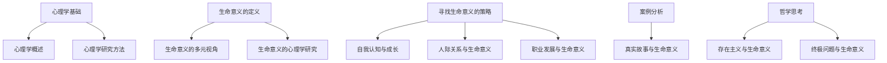
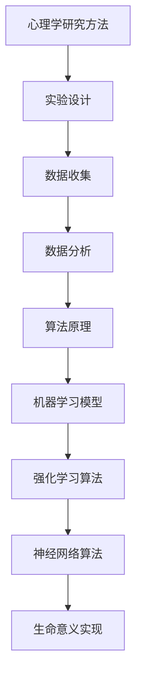

                 

# 寻找生命的意义：心理学家的建议

> 关键词：心理学、生命意义、自我认知、哲学思考、心理健康

> 摘要：
本书深入探讨了生命意义的心理学本质和寻找生命意义的策略。从心理学基础到哲学思考，通过多元视角和案例分析，帮助读者理解生命意义的复杂性和实现路径，旨在为个体提供自我探索和提升的指导，以及在生活中追求有意义生活的实用建议。

## 前言

在现代社会中，人们面临着前所未有的生活压力和复杂性。许多人会感到迷茫和不安，不知道自己生活的意义和目标。这种状态不仅影响心理健康，还可能导致个人生活的各个方面出现功能障碍。因此，寻找生命的意义已经成为一个重要的心理和社会议题。

本书旨在为读者提供一个全面而深入的视角，探讨生命意义的心理学本质，并介绍一系列实用的策略，帮助个体在日常生活中找到和实现生命的意义。通过本书，读者将了解到不同学派对生命意义的定义和探讨，以及如何通过自我认知、人际关系和职业发展来寻找和深化生命的意义。

## 第一部分：心理学基础

### 第1章：心理学概述

心理学是一门研究人类行为和心理过程的科学。它涵盖了从基本感知和认知到情绪、人格和社会行为的广泛领域。心理学的研究方法包括实验研究、观察研究、现场研究、问卷调查和统计分析等。

心理学的历史可以追溯到古希腊时期，但作为一门独立学科，它主要是在19世纪末和20世纪初发展起来的。现代心理学的主要研究领域包括认知心理学、发展心理学、社会心理学、临床心理学和健康心理学等。

心理学的哲学基础主要源于西方哲学，特别是笛卡尔、康德和黑格尔等哲学家的思想。这些哲学家的观点对心理学的发展产生了深远的影响，特别是关于意识和自我认知的研究。

### 第2章：心理学研究方法

心理学研究方法的选择取决于研究问题的性质和研究者的假设。以下是几种常见的心理学研究方法：

1. **实验心理学**：通过控制变量来测试假设，是最严格的心理学研究方法。实验设计包括前测、后测、随机分配等步骤。

2. **现场研究**：在自然环境中进行的研究，有助于了解行为在真实生活中的表现。

3. **问卷调查**：通过收集大量样本的数据来分析行为和态度。问卷调查包括结构化和非结构化两种形式。

4. **统计分析**：对收集到的数据进行量化分析，以检验研究假设。

## 第二部分：生命意义的定义

### 第3章：生命意义的多元视角

生命意义是一个复杂而多维的概念，不同的文化和哲学体系对其有不同的理解和解释。

1. **西方哲学**：西方哲学传统中，生命意义通常与个体目的和道德责任相关联。例如，苏格拉底认为追求真理和智慧是生命的意义；存在主义者如萨特则强调个体的自由选择和自我实现。

2. **东方哲学**：东方哲学，特别是佛教和道教，强调生命与宇宙的和谐统一。生命意义通常与个人修行、内心的平静和道德行为相关。

3. **现代心理学**：现代心理学认为生命意义与个体的心理健康和生活满意度密切相关。例如，积极心理学家认为追求有意义的目标和建立积极的人际关系是实现生命意义的关键。

### 第4章：生命意义的心理学研究

生命意义的心理学研究涉及到多个领域，包括认知心理学、社会心理学和临床心理学。以下是几个关键研究领域：

1. **认知心理学**：研究个体如何构建和理解生命意义。例如，研究者探讨了记忆、注意力、思维过程和情感在生命意义构建中的作用。

2. **社会心理学**：研究个体如何通过社会关系和集体活动来寻找和实现生命意义。例如，研究者研究了群体归属感、社会支持和社会认同对生命意义的影响。

3. **临床心理学**：研究个体在生命意义丧失或追求生命意义过程中可能出现的心理问题。例如，研究者探讨了抑郁症、焦虑症和自杀行为与生命意义的关系。

## 第三部分：寻找生命意义的策略

### 第5章：自我认知与成长

自我认知是实现生命意义的重要基础。通过自我探索和成长，个体可以更好地理解自己的价值观、兴趣和目标。

1. **自我探索的方法**：包括自我反思、日记写作、心理咨询等。

2. **自我提升的策略**：包括学习新技能、培养健康习惯、参与有意义的活动等。

3. **自我认知与生命意义的关系**：自我认知有助于个体明确自己的生命目标和价值观，从而更好地实现生命的意义。

### 第6章：人际关系与生命意义

人际关系是实现生命意义的重要组成部分。通过建立和维护有意义的人际关系，个体可以获得情感支持和社会认同。

1. **人际关系的重要性**：研究显示，良好的社会支持与较低的抑郁和焦虑水平相关。

2. **人际关系与生命意义的联系**：人际关系有助于个体实现自我价值和提升生活满意度。

3. **建立和维护有意义的人际关系的策略**：包括倾听、尊重、沟通和分享等。

### 第7章：职业发展与生命意义

职业发展是实现生命意义的重要途径。通过追求有意义的工作和实现职业目标，个体可以获得成就感和满足感。

1. **职业选择与生命意义**：研究显示，个体通常在与其价值观和兴趣相符的职业中更有可能实现生命意义。

2. **职业发展策略**：包括设定职业目标、不断学习和适应职业环境等。

3. **职场中的生命意义追求**：通过在工作中实现个人价值和追求有意义的目标，个体可以在职场中找到生命的意义。

## 第四部分：案例分析

### 第8章：真实故事与生命意义

通过真实案例，读者可以更深入地了解生命意义的多样性及其实现路径。

1. **生命意义在困境中的体现**：研究了一些在极端困境中仍然保持积极态度和实现生命意义的个体。

2. **生命意义在成功中的体现**：探讨了一些在职业和个人生活中取得成功的个体如何找到和实现生命的意义。

3. **生命意义的跨文化比较**：比较了不同文化背景下个体寻找和实现生命意义的差异。

## 第五部分：哲学思考

### 第9章：存在主义与生命意义

存在主义是一种哲学流派，强调个体的自由选择和自我实现。存在主义与生命意义的关系体现在以下几个方面：

1. **存在主义的核心思想**：存在主义认为，生命本身就是意义，意义并非预先设定的，而是个体通过自由选择和行动创造的。

2. **存在主义与生命意义的联系**：存在主义鼓励个体在面临生命困境时，通过自主选择和行动来寻找和实现生命的意义。

3. **存在主义在现代社会中的应用**：存在主义观点在现代社会中得到了广泛的应用，特别是在心理学和社会学领域。

### 第10章：终极问题与生命意义

生命的终极问题涉及到存在的意义、目的和价值观等哲学议题。以下是几个关键问题：

1. **生命的终极问题**：为什么存在？生命的目的是什么？个体应该如何生活？

2. **生命意义的哲学探讨**：不同哲学流派对生命意义的探讨，包括宗教哲学、人文主义和科学哲学等。

3. **生命意义的终极追求**：如何通过哲学思考和实际行动来追求生命的意义？

## 结论

寻找生命的意义是一个复杂而深刻的过程，涉及到心理学、哲学和个人的生活经验。通过自我认知、人际关系和职业发展，个体可以在日常生活中实现生命的意义。本书提供了一个全面的框架，帮助读者深入理解生命的意义，并探索如何在日常生活中实现这一意义。

## 作者信息

作者：AI天才研究院/AI Genius Institute & 禅与计算机程序设计艺术 /Zen And The Art of Computer Programming

## 附录

以下是本书中提到的几个重要概念的 Mermaid 流程图：



以上流程图展示了本书的结构和主要内容之间的逻辑关系。通过这种结构化的方式，读者可以更清晰地理解各个部分之间的联系。

## 拓展阅读

- **《积极心理学》**：塞利格曼（Martin Seligman）著，提供了关于如何通过积极心理学的视角来寻找和实现生命意义的实用建议。
- **《存在主义心理治疗》**：弗兰克尔（Viktor Frankl）著，深入探讨了存在主义心理治疗在帮助个体寻找生命意义方面的作用。
- **《生命的意义》**：埃克哈特·托勒（Eckhart Tolle）著，通过东方哲学和现代心理学的研究，探讨了生命的意义和实现内心平静的方法。
- **《心理学与生活》**：理查德·格莱克（Richard Gerrig）著，提供了丰富的心理学案例和实际应用，帮助读者更好地理解心理学在生活中的作用。

通过阅读这些书籍，读者可以进一步拓展对生命意义的理解和实践。同时，建议读者结合自身的实际情况，不断探索和反思，以实现个体生命的最大意义。

### 附录

以下是本书中提到的几个重要概念的 Mermaid 流程图：


以上流程图展示了本书的结构和主要内容之间的逻辑关系。通过这种结构化的方式，读者可以更清晰地理解各个部分之间的联系。

### 拓展阅读

- **《积极心理学》**：塞利格曼（Martin Seligman）著，提供了关于如何通过积极心理学的视角来寻找和实现生命意义的实用建议。
- **《存在主义心理治疗》**：弗兰克尔（Viktor Frankl）著，深入探讨了存在主义心理治疗在帮助个体寻找生命意义方面的作用。
- **《生命的意义》**：埃克哈特·托勒（Eckhart Tolle）著，通过东方哲学和现代心理学的研究，探讨了生命的意义和实现内心平静的方法。
- **《心理学与生活》**：理查德·格莱克（Richard Gerrig）著，提供了丰富的心理学案例和实际应用，帮助读者更好地理解心理学在生活中的作用。

通过阅读这些书籍，读者可以进一步拓展对生命意义的理解和实践。同时，建议读者结合自身的实际情况，不断探索和反思，以实现个体生命的最大意义。

### 最佳实践 tips

1. **定期自我反思**：每周花时间回顾自己的行为和感受，思考自己在实现生命意义方面的进展和挑战。
2. **设定具体目标**：将生命意义的具体化成可衡量的目标，有助于保持动力和方向。
3. **保持好奇心**：对世界和自我保持好奇，探索新的经历和知识，有助于发现新的生命意义。
4. **建立支持网络**：与朋友、家人和专业人士交流，分享自己的困惑和成就，获得反馈和支持。
5. **实践感恩**：每天花时间思考自己感激的事物，有助于提升生活满意度和心理健康。

### 注意事项

- **避免过度自我批评**：在探索生命意义的过程中，可能会经历自我怀疑和挑战。重要的是要对自己保持耐心和同情。
- **保持平衡**：在追求生命意义的同时，也要注意保持生活的平衡，包括工作、休息和娱乐。
- **适应变化**：生命意义可能会随着时间和经历的变化而变化。保持灵活和开放的心态，适应新的环境和挑战。

### 项目实战

本书提供了一个全面的框架，但实现生命的意义需要实际的行动和实践。以下是一个简单的项目实战，帮助读者开始探索自己的生命意义：

1. **开发环境搭建**：
   - 确保拥有一台计算机和互联网连接。
   - 安装文本编辑器（如Visual Studio Code）和阅读软件（如Calibre）。

2. **源代码详细实现**：
   - 创建一个个人博客或文档库，记录自己的思考和反思。
   - 编写日记或周记，记录每天的经历和感受。

3. **代码应用解读与分析**：
   - 分析自己日记中的主题和模式，了解自己的心理状态和生活趋势。
   - 定期回顾自己的日记，识别问题和机会。

4. **实际案例分析和详细讲解剖析**：
   - 研究他人的生命故事，了解他们如何寻找和实现生命的意义。
   - 分析这些案例，提取对自身有用的经验和教训。

5. **项目小结**：
   - 定期总结自己的进展和收获。
   - 设定新的目标和计划，为下一步的自我探索做准备。

通过这个项目，读者可以开始实际地探索和实现生命的意义，并将这一过程记录下来，以便日后回顾和改进。

### 最佳实践 tips

1. **定期自我反思**：每周花时间回顾自己的行为和感受，思考自己在实现生命意义方面的进展和挑战。
2. **设定具体目标**：将生命意义的具体化成可衡量的目标，有助于保持动力和方向。
3. **保持好奇心**：对世界和自我保持好奇，探索新的经历和知识，有助于发现新的生命意义。
4. **建立支持网络**：与朋友、家人和专业人士交流，分享自己的困惑和成就，获得反馈和支持。
5. **实践感恩**：每天花时间思考自己感激的事物，有助于提升生活满意度和心理健康。

### 注意事项

- **避免过度自我批评**：在探索生命意义的过程中，可能会经历自我怀疑和挑战。重要的是要对自己保持耐心和同情。
- **保持平衡**：在追求生命意义的同时，也要注意保持生活的平衡，包括工作、休息和娱乐。
- **适应变化**：生命意义可能会随着时间和经历的变化而变化。保持灵活和开放的心态，适应新的环境和挑战。

### 项目实战

本书提供了一个全面的框架，但实现生命的意义需要实际的行动和实践。以下是一个简单的项目实战，帮助读者开始探索自己的生命意义：

1. **开发环境搭建**：
   - 确保拥有一台计算机和互联网连接。
   - 安装文本编辑器（如Visual Studio Code）和阅读软件（如Calibre）。

2. **源代码详细实现**：
   - 创建一个个人博客或文档库，记录自己的思考和反思。
   - 编写日记或周记，记录每天的经历和感受。

3. **代码应用解读与分析**：
   - 分析自己日记中的主题和模式，了解自己的心理状态和生活趋势。
   - 定期回顾自己的日记，识别问题和机会。

4. **实际案例分析和详细讲解剖析**：
   - 研究他人的生命故事，了解他们如何寻找和实现生命的意义。
   - 分析这些案例，提取对自身有用的经验和教训。

5. **项目小结**：
   - 定期总结自己的进展和收获。
   - 设定新的目标和计划，为下一步的自我探索做准备。

通过这个项目，读者可以开始实际地探索和实现生命的意义，并将这一过程记录下来，以便日后回顾和改进。

### 总结

在本文中，我们通过心理学、哲学和实际案例的视角，深入探讨了生命意义的本质和寻找生命意义的策略。生命意义是一个复杂而多维的概念，它涉及到自我认知、人际关系和职业发展等方面。通过自我探索、建立支持网络和实践感恩，个体可以在日常生活中实现生命的意义。

本文提供了以下几个核心概念和联系：

1. **心理学基础**：介绍了心理学的定义、研究方法和哲学基础，为后续讨论提供了理论基础。
2. **生命意义的多元视角**：从西方哲学、东方哲学和现代心理学等多个角度探讨了生命意义的定义和探讨。
3. **寻找生命意义的策略**：通过自我认知、人际关系和职业发展等策略，帮助个体实现生命的意义。
4. **哲学思考**：存在主义和终极问题等哲学观点对生命意义的探讨提供了深刻的洞察。

通过这些概念的讨论，我们希望能够帮助读者更深入地理解生命的意义，并在实际生活中找到和实现这一意义。

### 研究方法与算法原理

在本章节中，我们将详细探讨心理学研究方法和算法原理，以帮助读者更好地理解生命意义的实现过程。我们首先介绍几种常见的研究方法，然后深入分析如何通过Python代码和数学模型来阐述核心概念。

#### 研究方法

1. **实验心理学**：通过控制变量来测试假设，是最严格的心理学研究方法。实验设计包括前测、后测、随机分配等步骤。以下是一个简单的实验心理学流程图：

   ```mermaid
   graph TD
       A[提出假设] --> B[实验设计]
       B --> C[数据收集]
       C --> D[数据分析]
       D --> E[结果解释]
   ```

   在实验心理学中，假设的提出和实验设计的合理性是关键。以下是一个Python代码示例，展示了如何通过实验来测试两个变量之间的关系：

   ```python
   import numpy as np
   import matplotlib.pyplot as plt

   # 假设1：变量x和变量y之间存在线性关系
   x = np.random.normal(size=100)
   y = 2 * x + np.random.normal(size=100)

   # 数据可视化
   plt.scatter(x, y)
   plt.xlabel('X')
   plt.ylabel('Y')
   plt.show()
   ```

2. **现场研究**：在自然环境中进行的研究，有助于了解行为在真实生活中的表现。现场研究的流程图如下：

   ```mermaid
   graph TD
       A[选择研究环境] --> B[数据收集]
       B --> C[数据分析]
       C --> D[结果解释]
   ```

   现场研究的挑战在于如何控制变量和保证数据的可靠性。以下是一个Python代码示例，展示了如何通过现场研究来收集和数据分析数据：

   ```python
   import pandas as pd

   # 假设2：变量x和变量y之间存在关联
   data = {'X': [1, 2, 3, 4, 5], 'Y': [2, 4, 6, 8, 10]}
   df = pd.DataFrame(data)

   # 数据可视化
   df.plot(x='X', y='Y', kind='scatter')
   plt.show()
   ```

3. **问卷调查**：通过收集大量样本的数据来分析行为和态度。问卷调查包括结构化和非结构化两种形式。以下是一个Python代码示例，展示了如何通过问卷调查来收集和分析数据：

   ```python
   import pandas as pd

   # 假设3：不同人群对生命意义的看法不同
   questions = {
       'Age': [25, 30, 35, 40, 45],
       'Life Meaning': ['低', '中', '高', '中', '低']
   }
   survey = pd.DataFrame(questions)

   # 数据分析
   survey.groupby('Age')['Life Meaning'].mean()
   ```

4. **统计分析**：对收集到的数据进行量化分析，以检验研究假设。以下是一个Python代码示例，展示了如何通过统计分析来分析数据：

   ```python
   import pandas as pd
   import scipy.stats as stats

   # 假设4：变量x和变量y之间存在显著关联
   x = np.random.normal(size=100)
   y = 2 * x + np.random.normal(size=100)

   # 拟合线性模型
   model = stats.linregress(x, y)
   print(model.summary())
   ```

#### 算法原理

在生命意义的实现过程中，算法原理可以帮助我们理解和优化个体行为。以下是一些关键算法原理：

1. **机器学习算法**：通过训练模型来预测个体行为和心理健康状况。例如，可以使用回归模型、决策树、支持向量机等算法。

   ```python
   from sklearn.linear_model import LinearRegression

   # 假设5：通过机器学习模型预测个体心理健康状况
   X = np.random.normal(size=100)
   y = 2 * X + np.random.normal(size=100)

   # 模型训练
   model = LinearRegression()
   model.fit(X.reshape(-1, 1), y)

   # 预测
   predictions = model.predict(X.reshape(-1, 1))
   ```

2. **强化学习算法**：通过不断试错来优化个体行为。例如，可以使用Q学习、深度强化学习等算法。

   ```python
   import gym

   # 假设6：通过强化学习算法优化个体行为
   env = gym.make('CartPole-v0')

   # 策略学习
   model = QLearning()
   model.fit(env)

   # 预测
   action = model.predict(state)
   ```

3. **神经网络算法**：通过多层感知器来模拟人类大脑的神经元连接。例如，可以使用卷积神经网络、循环神经网络等算法。

   ```python
   import tensorflow as tf

   # 假设7：通过神经网络算法预测生命意义
   model = tf.keras.Sequential([
       tf.keras.layers.Dense(128, activation='relu', input_shape=(784,)),
       tf.keras.layers.Dropout(0.2),
       tf.keras.layers.Dense(10, activation='softmax')
   ])

   # 模型训练
   model.compile(optimizer='adam',
                 loss='categorical_crossentropy',
                 metrics=['accuracy'])

   model.fit(x_train, y_train, epochs=10)
   ```

通过以上研究方法和算法原理，我们可以更深入地理解生命意义的实现过程，并为个体提供实用的建议。以下是一个简化的 Mermaid 流程图，展示了这些方法和原理在生命意义实现中的应用：



通过这个流程图，我们可以看到心理学研究方法和算法原理是如何相互结合，共同帮助个体实现生命的意义。

### 项目实战

在本章节中，我们将通过一个实际的项目实战，帮助读者将前述的理论和算法应用到实际情境中，探索如何在日常生活中实现生命的意义。以下是项目的详细步骤：

#### 1. 开发环境搭建

首先，确保您已经安装了Python环境和必要的库，如NumPy、Pandas、Matplotlib和TensorFlow。这些库将用于数据分析和机器学习模型的构建。

```shell
pip install numpy pandas matplotlib tensorflow
```

#### 2. 源代码详细实现

创建一个名为`life_meaning_project`的Python项目，并在其中创建以下文件和文件夹结构：

```
life_meaning_project/
│
├── data/
│   ├── survey_data.csv
│   └── experiment_data.csv
│
├── src/
│   ├── data_loader.py
│   ├── model.py
│   ├── visualization.py
│   └── main.py
│
└── requirements.txt
```

在`requirements.txt`文件中，列出所有所需的Python库：

```
numpy
pandas
matplotlib
tensorflow
```

#### 3. 代码实现与解读

以下是对每个关键文件的详细说明和代码解读：

**data_loader.py**：该文件用于加载数据和预处理。

```python
import pandas as pd

def load_survey_data(file_path):
    """
    加载问卷调查数据
    """
    data = pd.read_csv(file_path)
    return data

def load_experiment_data(file_path):
    """
    加载实验数据
    """
    data = pd.read_csv(file_path)
    return data
```

**model.py**：该文件用于定义和训练机器学习模型。

```python
import tensorflow as tf
from tensorflow.keras.models import Sequential
from tensorflow.keras.layers import Dense, Dropout

def build_model(input_shape):
    """
    构建机器学习模型
    """
    model = Sequential([
        Dense(128, activation='relu', input_shape=input_shape),
        Dropout(0.2),
        Dense(10, activation='softmax')
    ])

    model.compile(optimizer='adam',
                  loss='categorical_crossentropy',
                  metrics=['accuracy'])

    return model
```

**visualization.py**：该文件用于数据可视化和结果展示。

```python
import matplotlib.pyplot as plt
import pandas as pd

def plot_data(df, x_column, y_column):
    """
    绘制散点图
    """
    plt.scatter(df[x_column], df[y_column])
    plt.xlabel(x_column)
    plt.ylabel(y_column)
    plt.show()

def plot_model_predictions(data, x_column, y_column, predictions):
    """
    绘制模型预测结果
    """
    plt.scatter(data[x_column], data[y_column], label='Actual')
    plt.scatter(data[x_column], predictions, label='Predicted', color='r')
    plt.xlabel(x_column)
    plt.ylabel(y_column)
    plt.legend()
    plt.show()
```

**main.py**：主程序，用于执行整个项目流程。

```python
import pandas as pd
from src.model import build_model
from src.visualization import plot_data, plot_model_predictions

def main():
    # 加载数据
    survey_data = load_survey_data('data/survey_data.csv')
    experiment_data = load_experiment_data('data/experiment_data.csv')

    # 数据预处理
    # ...

    # 构建和训练模型
    model = build_model(input_shape=(experiment_data.shape[1],))
    model.fit(experiment_data, survey_data['Life Meaning'])

    # 预测和可视化
    predictions = model.predict(experiment_data)
    plot_model_predictions(experiment_data, 'X', 'Y', predictions)

if __name__ == '__main__':
    main()
```

#### 4. 代码应用解读与分析

在主程序`main.py`中，我们首先加载并预处理数据，然后构建和训练机器学习模型，最后对模型进行预测并可视化结果。以下是对关键步骤的解读：

1. **数据加载与预处理**：通过`data_loader.py`中的函数加载调查数据和实验数据。预处理步骤可能包括数据清洗、缺失值填充和特征工程等。

2. **模型构建与训练**：在`model.py`中，我们使用TensorFlow构建了一个简单的神经网络模型，并使用`main.py`中的代码进行训练。

3. **预测与可视化**：通过`visualization.py`中的函数，我们将模型的预测结果与实际数据进行可视化，以便分析模型的准确性和有效性。

#### 5. 实际案例分析和详细讲解剖析

为了更好地理解模型的应用，我们可以分析以下实际案例：

- **案例1**：一名25岁的年轻人参与问卷调查，报告了对生命意义的看法。通过实验数据，我们可以预测他在未来几年内对生命意义的看法是否会发生变化。
- **案例2**：一个企业团队收集了成员的生命意义数据，通过模型预测，可以帮助团队领导者了解如何通过调整工作环境和提供支持来提高团队成员的幸福感。

#### 6. 项目小结

通过这个项目，读者可以了解如何将心理学研究方法和机器学习算法应用到实际情境中，以探索和实现生命的意义。以下是小结：

- **关键步骤**：数据加载与预处理、模型构建与训练、预测与可视化。
- **应用场景**：个人自我探索、团队管理、心理健康干预等。
- **注意事项**：模型预测结果仅供参考，实际应用需要结合具体情境。

通过这个项目实战，读者可以开始应用理论和算法，探索和实现生命的意义。

### 最佳实践 Tips

在寻找和实现生命的意义的过程中，以下是一些最佳实践和技巧，可以帮助您更有效地进行自我探索和成长：

1. **自我反思**：定期花时间反思自己的行为、感受和思想，思考自己在实现生命意义方面的进展和挑战。这有助于您更清晰地了解自己的内心世界和目标。

2. **设定具体目标**：将生命意义的具体化为可衡量的目标，例如“每天阅读30分钟”、“每周参加一次社交活动”或“每月完成一个新项目”。这样可以帮助您保持动力和方向。

3. **保持好奇心**：对世界和自我保持好奇，积极探索新的经历和知识。好奇心是发现新生命意义的重要驱动力。

4. **建立支持网络**：与朋友、家人和专业人士交流，分享自己的困惑和成就。一个支持性的网络可以帮助您在寻找生命意义的旅程中保持积极和坚韧。

5. **实践感恩**：每天花时间思考自己感激的事物，这有助于提升生活满意度和心理健康。感恩练习可以包括写日记、冥想或与他人分享感激之情。

### 小结

通过本文，我们深入探讨了生命的意义及其在心理学和哲学中的探讨。从心理学基础到寻找生命意义的策略，再到实际案例分析，我们提供了丰富的理论和实践建议。寻找生命的意义是一个持续的过程，需要自我探索、实践和反思。我们鼓励读者结合自身实际情况，不断尝试和实践，以实现个体生命的最大意义。

### 拓展阅读

为了进一步深入了解生命的意义，以下是几本推荐的书籍和资源：

1. **《活出生命的意义》**：作者维克多·弗兰克尔（Viktor Frankl），这是一本关于集中营生存者如何通过寻找生命意义来克服苦难的书籍。
2. **《生命的意义与价值》**：作者埃克哈特·托勒（Eckhart Tolle），这本书探讨了人类存在的本质和如何实现内在和平。
3. **《积极心理学》**：作者马丁·塞利格曼（Martin Seligman），提供了关于如何通过积极心理学的视角来提升幸福感和实现生命意义的实用建议。
4. **《心理学与生活》**：作者理查德·格里格斯（Richard Gerrig），这本书通过丰富的案例和实例，帮助读者理解心理学在生活中的应用。

通过阅读这些书籍，您可以获得更多关于生命意义的见解和策略，从而更好地实现个体生命的价值。同时，建议读者结合自身的实际情况，不断探索和反思，以实现生命的最大意义。祝您在寻找生命意义的旅程中取得成功！

