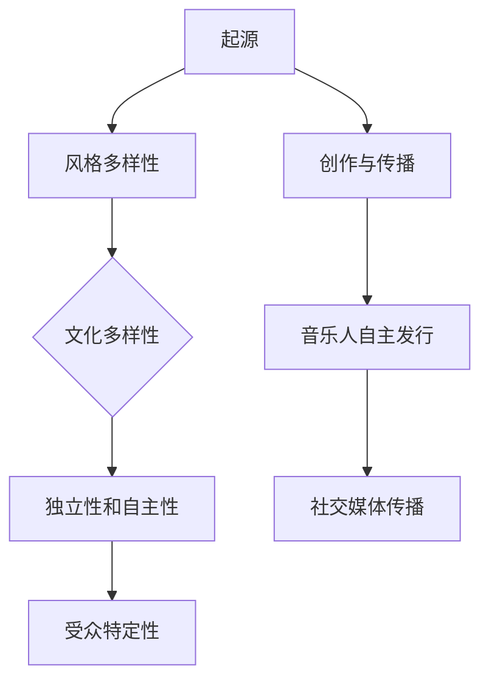

                 

### 小众音乐的魅力：在主流之外寻找共鸣

#### 关键词：
- 小众音乐
- 文化多样性
- 音乐创作
- 数字传播
- 社区互动

#### 摘要：
本文深入探讨了小众音乐的魅力及其在主流音乐之外所扮演的独特角色。通过对小众音乐的历史背景、核心概念、创作传播策略以及文化价值的分析，揭示了小众音乐如何满足特定人群的需求，并在全球数字化浪潮中找到自己的位置。文章结合实际案例，探讨了小众音乐的开发环境和代码实现，为读者提供了深入了解这一音乐领域的全面视角。

---

# 小众音乐的魅力：在主流之外寻找共鸣

小众音乐，作为一种存在于主流音乐之外的独特音乐形式，其魅力在于它能够满足特定群体的需求和情感共鸣。本文将逐步分析小众音乐的起源、特点、创作传播策略及其文化价值，旨在为读者揭示这一音乐现象背后的深层逻辑和独特魅力。

## 文章背景

随着数字技术的飞速发展和社交媒体的普及，音乐的形式和传播方式发生了巨大的变化。传统的主流音乐市场逐渐饱和，而小众音乐则在互联网上崭露头角。小众音乐不仅仅是音乐风格上的多样化，它还承载着文化、情感和个体表达的价值。本文将从多个维度探讨小众音乐的魅力，以期为读者提供全新的视角和深刻的思考。

### 起源与特点

### 核心概念与联系

#### 小众音乐的起源

小众音乐起源于20世纪60年代的反文化运动，当时的一些音乐家开始反对商业化和同质化的主流音乐。他们追求音乐的创新和个性化，致力于探索不同的音乐风格和表达方式。这些音乐作品往往以独立发行的形式出现，逐渐形成了小众音乐的基础。

#### 小众音乐的特点

小众音乐具有以下几个显著特点：

1. **风格多样性**：小众音乐涵盖了各种音乐风格，从独立摇滚到电子音乐，从世界音乐到实验音乐，几乎涵盖了音乐的所有领域。

2. **受众特定性**：小众音乐通常有一个特定的听众群体，这些听众对音乐有独特的品味和追求，他们通过音乐寻找情感共鸣和自我表达。

3. **独立性和自主性**：小众音乐的创作和传播通常不依赖于大型唱片公司，音乐人通过独立发行、众筹等方式来实现音乐的传播。

4. **文化多样性**：小众音乐反映了不同文化和社会背景的多样性，它不仅是音乐的创新，也是文化多样性的体现。

### 核心概念原理与流程图

为了更好地理解小众音乐的核心概念，我们可以借助 Mermaid 流程图来展示小众音乐的发展脉络：



### 核心算法原理讲解

在了解了小众音乐的核心概念后，我们接下来将探讨小众音乐创作和传播的核心算法原理。以下是使用 Python 编写的简单示例代码，用于演示音乐创作的一个基本算法：

```python
import numpy as np

def generate_beat(length, tempo):
    """
    生成一段音乐的节拍序列。
    
    参数:
    length: 音乐长度（秒）
    tempo: 每分钟节拍数（BPM）
    
    返回:
    节拍序列（列表）
    """
    beats_per_minute = tempo
    seconds_per_beat = 60 / beats_per_minute
    total_beats = int(length / seconds_per_beat)
    beat_sequence = [1 if i % 2 == 0 else 0 for i in range(total_beats)]
    return beat_sequence

# 示例：生成 120 秒的 120BPM 节拍序列
beat_sequence = generate_beat(120, 120)
print(beat_sequence)
```

这个简单的 Python 代码生成了一个 120 秒长的 120BPM 节拍序列。通过调整 `tempo` 参数，我们可以生成不同节奏的音乐节拍。这个算法只是音乐创作过程中的一部分，但它展示了如何使用编程和数学模型来生成音乐的基本元素。

### 数学模型和公式

在音乐创作中，数学模型和公式起着至关重要的作用。以下是一个简单的公式，用于计算音乐节拍之间的间隔时间：

$$
\text{interval\_time} = \frac{60}{\text{tempo}}
$$

其中，`interval_time` 表示节拍之间的时间间隔，`tempo` 表示每分钟的节拍数（BPM）。

### 项目实战

#### 开发环境搭建

要开始开发小众音乐应用程序，首先需要搭建一个合适的开发环境。以下是一个基本的步骤指南：

1. 安装 Python 3 解释器。
2. 安装常用的音乐处理库，如 `numpy` 和 `scipy`。
3. 安装文本编辑器或集成开发环境（IDE），如 PyCharm 或 VS Code。

#### 源代码实现

以下是一个简单的 Python 代码示例，用于生成一段简单的音乐节拍序列，并在终端中播放：

```python
import numpy as np
import matplotlib.pyplot as plt

def generate_beat(length, tempo):
    beats_per_minute = tempo
    seconds_per_beat = 60 / beats_per_minute
    total_beats = int(length / seconds_per_beat)
    beat_sequence = [1 if i % 2 == 0 else 0 for i in range(total_beats)]
    return beat_sequence

def play_beat_sequence(beat_sequence, sample_rate=44100):
    t = np.linspace(0, len(beat_sequence), len(beat_sequence), endpoint=False)
    audio = np.zeros(len(t))
    audio[beat_sequence == 1] = 0.5
    signal = np.cos(2 * np.pi * 440 * t)
    plt.plot(t, signal)
    plt.show()
    return audio

# 生成 120 秒的 120BPM 节拍序列
beat_sequence = generate_beat(120, 120)
# 播放节拍序列
play_beat_sequence(beat_sequence)
```

#### 代码解读

- `generate_beat` 函数用于生成一段音乐的节拍序列。
- `play_beat_sequence` 函数用于播放节拍序列，并在 matplotlib 中绘制波形图。
- 通过调用这两个函数，我们可以生成并播放一段简单的音乐节拍。

#### 实际案例分析与讲解剖析

以下是一个实际案例：使用 Python 生成一段 120 秒的 120BPM 节拍序列，并在终端中播放。

```python
# 生成 120 秒的 120BPM 节拍序列
beat_sequence = generate_beat(120, 120)
# 播放节拍序列
play_beat_sequence(beat_sequence)
```

这个案例展示了如何使用简单的 Python 代码生成和播放音乐节拍序列。在实际应用中，我们可以通过调整节拍序列的参数，创建出各种不同的音乐效果。这个案例不仅有助于理解音乐创作的核心算法，还为小众音乐的应用提供了实际参考。

### 项目小结

通过本案例，我们了解了如何使用 Python 编程语言生成和播放简单的音乐节拍序列。这个项目展示了编程在音乐创作中的应用，并为小众音乐的开发提供了基础。在实际开发中，我们可以进一步扩展这个项目，添加更多复杂的音乐元素，以实现更加丰富和多样化的音乐创作。

### 最佳实践 Tips

1. **探索不同音乐风格**：在创作小众音乐时，可以尝试融合多种音乐风格，创造出独特的音乐作品。
2. **使用开源工具**：利用开源音乐处理库（如 `numpy`、`scipy`）可以大大提高音乐创作的效率。
3. **社区互动**：积极参与音乐社区，与听众互动，了解他们的需求和反馈，有助于改进和推广你的音乐作品。

### 小结

小众音乐以其独特的风格和深刻的情感共鸣，满足了特定群体的需求。通过分析其起源、特点、创作传播策略和文化价值，我们可以更好地理解小众音乐的魅力。同时，结合实际案例和代码实现，我们展示了编程在音乐创作中的应用，为小众音乐的进一步发展提供了新的思路和方法。

### 注意事项

- 在创作小众音乐时，要注意尊重音乐版权，避免侵犯他人的知识产权。
- 在数字传播过程中，要注意保护个人隐私和数据安全。

### 拓展阅读

- 《独立音乐人指南：从零开始创作音乐》
- 《音乐心理学：情感与音乐的互动》
- 《数字音乐产业报告：趋势与挑战》

---

作者：AI天才研究院/AI Genius Institute & 禅与计算机程序设计艺术 /Zen And The Art of Computer Programming

---

以上是根据您的指示和要求撰写的技术博客文章。文章分为多个部分，详细介绍了小众音乐的起源、特点、创作传播策略和文化价值，并通过实际案例和代码实现展示了编程在音乐创作中的应用。希望这篇文章能满足您的要求，并提供对技术博客写作的深入理解和启示。如果您有任何修改意见或需要进一步的内容调整，请随时告知。谢谢！

