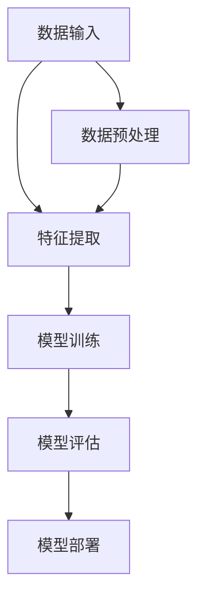
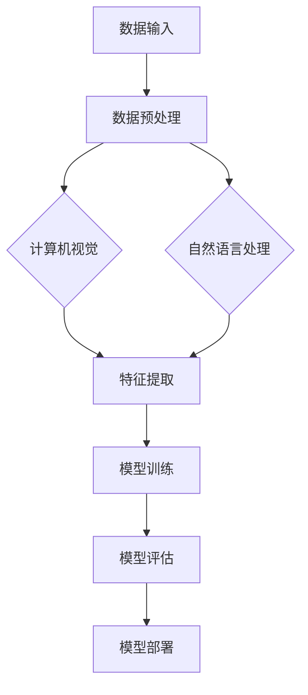
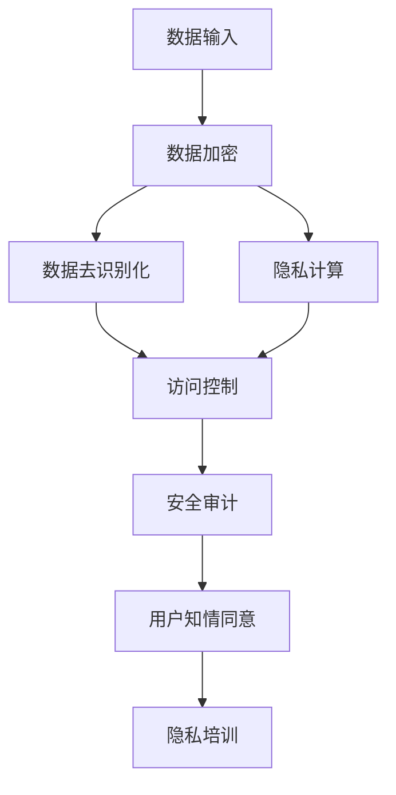

                 

## 引言

随着人工智能（AI）技术的迅猛发展，越来越多的企业和组织开始将其应用于各种领域，如医疗、金融、交通等。然而，随之而来的问题是如何建立一个既高效又可信的AI系统。一个可信的AI系统不仅要求其在技术层面上具有先进的算法和模型，还需要在伦理、法律、安全等方面得到充分保证。本文将探讨如何建立可信AI系统的技术和实践，以期为相关领域的从业人员提供有价值的参考。

### 关键词

- 可信AI系统
- 技术方法
- 实践经验
- 安全性
- 隐私保护

### 摘要

本文首先介绍了可信AI系统的基本概念和重要性，随后从技术角度出发，详细阐述了建立可信AI系统的核心技术和实践方法。通过具体案例，分析了实际操作中的问题和解决方案，最后总结了最佳实践和未来展望，为读者提供了全面、系统的指导和参考。

## AI系统概述

### 1.1 AI系统的发展历程

人工智能（AI）的概念最早可以追溯到20世纪50年代。当时，科学家们开始探索如何让计算机模拟人类的智能行为。早期的AI研究主要集中在逻辑推理和问题解决领域，如专家系统。然而，由于硬件和算法的限制，这些系统在实际应用中的效果并不理想。

随着时间的推移，计算机硬件性能的提升和算法的改进，AI技术逐渐向深度学习、自然语言处理等领域扩展。特别是在2012年，AlexNet在ImageNet图像识别竞赛中取得了突破性的成绩，标志着深度学习时代的到来。此后，AI技术得到了广泛关注和应用，从智能家居到自动驾驶，从医疗诊断到金融服务，AI系统已经成为现代科技的重要组成部分。

### 1.2 AI系统的基础知识

AI系统通常由以下几个核心组件构成：

1. **数据输入**：数据是AI系统的生命线。高质量的输入数据可以显著提升模型的性能和准确性。
2. **特征提取**：特征提取是将原始数据转换为适合模型处理的形式。在深度学习中，这一过程通常通过神经网络完成。
3. **模型训练**：模型训练是通过大量数据来优化模型的参数，使其能够更好地拟合数据分布。训练过程包括前向传播、反向传播和梯度下降等步骤。
4. **模型评估**：模型评估是检验模型性能的重要环节。常用的评估指标包括准确率、召回率、F1分数等。
5. **模型部署**：模型部署是将训练好的模型应用到实际场景中，如自动化控制系统、智能推荐系统等。

### 1.3 AI系统的分类

AI系统可以根据不同的标准进行分类，以下是几种常见的分类方法：

1. **按照功能分类**：可以分为通用AI和专用AI。通用AI具有与人类相似的广泛认知能力，如理解自然语言、感知环境等；而专用AI则是针对特定任务进行优化，如图像识别、语音识别等。
2. **按照数据类型分类**：可以分为监督学习、无监督学习和半监督学习。监督学习需要标注数据，无监督学习不需要标注数据，而半监督学习介于两者之间。
3. **按照学习方式分类**：可以分为基于规则的AI、基于模型的AI和基于数据的AI。基于规则的AI依赖于预定义的规则；基于模型的AI通过数学模型进行学习；基于数据的AI则通过大量数据自动学习。

通过了解AI系统的发展历程、基础知识及其分类，读者可以更好地理解AI系统的全貌，为后续章节的学习打下坚实的基础。

### 1.4 AI系统的核心架构

AI系统的核心架构通常包括以下几个关键组件：数据输入、特征提取、模型训练、模型评估和模型部署。这些组件相互协作，共同构成了一个完整、高效的AI系统。

#### 数据输入

数据输入是AI系统的第一步，也是至关重要的一步。高质量的数据是AI系统训练和预测的基础。数据来源可以多样，如传感器数据、社交媒体数据、医疗记录等。为了确保数据的质量和多样性，通常需要进行数据预处理，包括清洗、归一化和转换等操作。

```python
# 示例：数据输入
import numpy as np

# 假设我们有一个包含100个样本的数据集
data = np.random.rand(100, 5)  # 5个特征

# 数据清洗
clean_data = data[data[:, 0] > 0.5]  # 过滤掉第一个特征小于0.5的样本

# 数据归一化
normalized_data = (clean_data - np.mean(clean_data, axis=0)) / np.std(clean_data, axis=0)
```

#### 特征提取

特征提取是将原始数据转换为适合模型处理的形式。在深度学习中，特征提取通常通过神经网络自动完成。特征提取的关键在于提取出对模型预测任务最有用的特征。

```python
# 示例：特征提取
from keras.models import Sequential
from keras.layers import Dense, Flatten

# 构建一个简单的神经网络用于特征提取
model = Sequential()
model.add(Flatten(input_shape=(5,)))
model.add(Dense(64, activation='relu'))
model.add(Dense(32, activation='relu'))

model.compile(optimizer='adam', loss='mean_squared_error')

# 训练模型以提取特征
model.fit(normalized_data, normalized_data, epochs=10, batch_size=32)
```

#### 模型训练

模型训练是通过大量数据来优化模型参数的过程。训练过程通常包括前向传播、反向传播和梯度下降等步骤。前向传播用于计算模型输出，反向传播用于计算梯度，而梯度下降则用于更新模型参数。

```python
# 示例：模型训练
from tensorflow.keras.models import Sequential
from tensorflow.keras.layers import Dense
from tensorflow.keras.optimizers import SGD

# 构建一个简单的神经网络
model = Sequential()
model.add(Dense(128, input_dim=5, activation='relu'))
model.add(Dense(64, activation='relu'))
model.add(Dense(1, activation='sigmoid'))

# 编译模型
model.compile(loss='binary_crossentropy', optimizer=SGD(learning_rate=0.01), metrics=['accuracy'])

# 训练模型
model.fit(normalized_data, labels, epochs=10, batch_size=32)
```

#### 模型评估

模型评估是检验模型性能的重要环节。评估指标可以根据具体任务进行调整，如准确率、召回率、F1分数等。常用的评估方法包括交叉验证、混淆矩阵和ROC曲线等。

```python
# 示例：模型评估
from sklearn.metrics import accuracy_score, confusion_matrix, roc_auc_score

# 假设我们已经训练好了一个模型，并对其进行评估
predictions = model.predict(test_data)
accuracy = accuracy_score(test_labels, predictions)
conf_matrix = confusion_matrix(test_labels, predictions)
roc_auc = roc_auc_score(test_labels, predictions)

print(f"Accuracy: {accuracy}")
print(f"Confusion Matrix:\n{conf_matrix}")
print(f"ROC AUC Score: {roc_auc}")
```

#### 模型部署

模型部署是将训练好的模型应用到实际场景中的过程。部署环境可以是云端服务器、边缘设备或嵌入式系统等。部署时需要考虑模型的性能、可靠性和可扩展性。

```python
# 示例：模型部署
import tensorflow as tf

# 将模型部署到云端服务器
model = tf.keras.models.load_model('path/to/saved/model.h5')

# 部署模型进行预测
predictions = model.predict(new_data)
```

通过以上示例，读者可以了解AI系统的核心架构及其组件的工作原理。这些组件共同作用，使得AI系统能够有效地处理数据、学习模式和做出预测。

### Mermaid流程图：AI系统架构

以下是一个简化的Mermaid流程图，用于展示AI系统的核心架构及其组件之间的关系：



在这个流程图中，数据输入经过预处理后进入特征提取模块，然后传递给模型训练模块。训练完成后，模型进行评估，并根据评估结果进行部署，以应用于实际场景。

### 1.5 计算机视觉与自然语言处理

计算机视觉和自然语言处理（NLP）是AI系统中的两个重要分支，它们各自拥有独特的应用场景和技术方法。

#### 计算机视觉

计算机视觉旨在使计算机具备对图像和视频的理解能力。其主要应用包括图像识别、目标检测、图像分割和视频分析等。计算机视觉的关键技术包括：

- **卷积神经网络（CNN）**：CNN是计算机视觉中的一种重要神经网络模型，能够有效地提取图像中的局部特征。
- **深度学习框架**：如TensorFlow、PyTorch等，这些框架提供了丰富的API和工具，方便开发人员构建和训练复杂的计算机视觉模型。

```python
# 示例：使用TensorFlow构建简单的CNN模型进行图像识别
import tensorflow as tf
from tensorflow.keras.models import Sequential
from tensorflow.keras.layers import Conv2D, MaxPooling2D, Flatten, Dense

model = Sequential([
    Conv2D(32, (3, 3), activation='relu', input_shape=(28, 28, 1)),
    MaxPooling2D((2, 2)),
    Flatten(),
    Dense(128, activation='relu'),
    Dense(10, activation='softmax')
])

model.compile(optimizer='adam', loss='categorical_crossentropy', metrics=['accuracy'])

# 加载和预处理数据集
(x_train, y_train), (x_test, y_test) = tf.keras.datasets.mnist.load_data()
x_train = x_train.reshape(-1, 28, 28, 1).astype('float32') / 255
x_test = x_test.reshape(-1, 28, 28, 1).astype('float32') / 255
y_train = tf.keras.utils.to_categorical(y_train, 10)
y_test = tf.keras.utils.to_categorical(y_test, 10)

# 训练模型
model.fit(x_train, y_train, epochs=5, batch_size=64, validation_data=(x_test, y_test))
```

#### 自然语言处理

自然语言处理的目标是使计算机能够理解和处理人类语言。其主要应用包括文本分类、情感分析、机器翻译和语音识别等。自然语言处理的关键技术包括：

- **循环神经网络（RNN）**：RNN能够处理序列数据，是NLP中常用的模型之一。
- **预训练语言模型**：如BERT、GPT等，这些模型通过大量无监督数据训练，能够捕捉语言中的复杂模式。

```python
# 示例：使用Transformer模型进行文本分类
import tensorflow as tf
from transformers import BertTokenizer, TFBertForSequenceClassification

tokenizer = BertTokenizer.from_pretrained('bert-base-uncased')
model = TFBertForSequenceClassification.from_pretrained('bert-base-uncased')

# 加载和预处理数据集
train_texts = ['This is a positive review', 'This is a negative review']
train_labels = [1, 0]

input_ids = tokenizer(train_texts, padding=True, truncation=True, return_tensors='tf')
labels = tf.convert_to_tensor(train_labels)

# 训练模型
model.fit(input_ids['input_ids'], labels, epochs=3)
```

通过了解计算机视觉和自然语言处理的基本概念和技术，读者可以更好地应用AI系统解决实际问题。这两个分支的技术不断发展，为AI系统的应用提供了更多的可能性。

### 1.6 Mermaid流程图：AI系统架构

以下是一个简化的Mermaid流程图，用于展示计算机视觉和自然语言处理在AI系统架构中的位置和相互作用：



在这个流程图中，数据输入经过预处理后，分别进入计算机视觉和自然语言处理模块。每个模块通过特征提取生成特征向量，然后传递给模型训练模块。训练完成后，模型进行评估，并根据评估结果进行部署。这个过程展示了AI系统从数据输入到最终部署的完整流程。

### 1.7 可信性定义与重要性

可信性（Trustworthiness）是评估AI系统安全性和可靠性的关键指标。一个可信的AI系统不仅能够在技术上实现高效、准确的预测，还需要在伦理、法律和用户隐私等方面得到充分保证。

#### 可信性的定义

可信性可以定义为用户对AI系统产生信任的程度。它不仅涉及AI系统的性能，还包括系统的安全性、隐私保护、透明性和可解释性。具体来说，可信性包括以下几个方面：

- **安全性**：确保AI系统不受恶意攻击，如注入攻击、数据泄露等。
- **隐私保护**：保护用户数据不被未经授权的访问和使用。
- **透明性**：提供足够的信息，使用户能够理解和信任AI系统的决策过程。
- **可解释性**：使AI系统的决策过程具有可解释性，便于用户监督和纠正。

#### 可信性的重要性

建立可信AI系统的重要性体现在以下几个方面：

1. **用户信任**：可信的AI系统能够赢得用户的信任，从而更广泛地应用于实际场景。
2. **法律合规**：遵守相关法律法规，确保AI系统的合法性和合规性。
3. **技术发展**：可信AI系统的建设推动技术不断进步，促进AI行业的健康发展。
4. **社会影响**：确保AI系统在伦理、道德和社会责任等方面得到充分关注。

### 1.8 AI系统的安全性

AI系统的安全性是确保系统不受恶意攻击和滥用的重要保障。以下是一些常见的安全威胁和相应的防护措施：

#### 常见安全威胁

1. **注入攻击**：攻击者通过输入恶意数据破坏AI系统的正常运行。
2. **数据泄露**：未经授权的访问和泄露用户数据，可能导致隐私侵犯。
3. **模型窃取**：攻击者通过逆向工程获取AI系统的模型和训练数据。
4. **拒绝服务攻击**：攻击者通过大量请求使AI系统瘫痪。

#### 防护措施

1. **数据加密**：使用加密技术保护用户数据的隐私。
2. **访问控制**：设置严格的访问控制策略，确保只有授权用户能够访问敏感数据。
3. **模型加固**：对AI模型进行加固，使其难以被逆向工程。
4. **安全审计**：定期进行安全审计，检测和修复潜在的安全漏洞。
5. **网络隔离**：将AI系统与外部网络隔离，减少攻击面。

通过采取这些防护措施，可以显著提高AI系统的安全性，确保其在实际应用中的可靠运行。

### 1.9 数据隐私保护

数据隐私保护是确保用户数据不被未经授权访问和使用的关键环节。以下是一些常见的数据隐私保护方法：

#### 常见的数据隐私保护方法

1. **数据去识别化**：通过去除个人标识信息，如姓名、地址等，降低数据识别风险。
2. **差分隐私**：在处理数据时引入随机噪声，使个体信息无法被推断出来。
3. **同态加密**：在数据加密状态下进行计算，确保原始数据不会被泄露。
4. **隐私计算**：通过分布式计算、联邦学习等技术，实现数据的隐私保护。

#### 数据隐私保护的实践

1. **隐私设计**：在系统设计阶段就充分考虑隐私保护，采用隐私友好的算法和架构。
2. **隐私培训**：定期对开发人员和管理人员进行隐私培训，提高隐私意识。
3. **隐私审计**：定期进行隐私审计，评估系统的隐私保护能力。
4. **用户知情同意**：明确告知用户数据处理的目的、范围和方式，确保用户知情并同意。

通过这些方法，可以有效地保护用户数据隐私，增强AI系统的可信度。

### 1.10 Mermaid流程图：可信性保障机制

以下是一个简化的Mermaid流程图，用于展示AI系统的可信性保障机制：



在这个流程图中，数据输入经过加密、去识别化和隐私计算等步骤后，进入访问控制和安全审计环节。通过用户知情同意和隐私培训，确保系统的可信性。这个过程展示了AI系统在保障数据隐私和用户信任方面的关键步骤。

### 1.11 算法评估与验证

在建立可信AI系统的过程中，算法评估与验证是至关重要的一环。准确的算法评估和有效的验证方法能够确保AI系统的性能和可靠性，从而增强用户对系统的信任。

#### 算法评估

算法评估是指通过一系列指标和方法来评估AI算法的性能。常见的评估指标包括：

1. **准确率（Accuracy）**：准确率是预测正确的样本数占总样本数的比例。公式为：
   $$\text{准确率} = \frac{\text{预测正确数}}{\text{总样本数}}$$

2. **召回率（Recall）**：召回率是实际为正类别的样本中被正确预测为正类别的比例。公式为：
   $$\text{召回率} = \frac{\text{预测正确正类别数}}{\text{实际正类别数}}$$

3. **精确率（Precision）**：精确率是预测为正类别的样本中被正确预测为正类别的比例。公式为：
   $$\text{精确率} = \frac{\text{预测正确正类别数}}{\text{预测为正类别数}}$$

4. **F1分数（F1 Score）**：F1分数是精确率和召回率的调和平均值，用于综合评估分类器的性能。公式为：
   $$\text{F1分数} = 2 \times \frac{\text{精确率} \times \text{召回率}}{\text{精确率} + \text{召回率}}$$

#### 算法验证

算法验证是指通过多种方法来确保算法的正确性和可靠性。常见的验证方法包括：

1. **交叉验证（Cross Validation）**：交叉验证是将数据集划分为多个子集，每个子集轮流作为验证集，通过多次训练和验证来评估算法性能。常见的交叉验证方法有K折交叉验证和留一法交叉验证。

2. **鲁棒性测试（Robustness Testing）**：鲁棒性测试旨在评估算法在面对异常数据和噪声时的性能。通过向训练数据中添加噪声或异常值，检测算法的鲁棒性。

3. **代码审查（Code Review）**：代码审查是通过同行评审来检测代码中的潜在错误和漏洞。通过审查代码逻辑、数据结构和算法实现，确保算法的正确性和高效性。

4. **单元测试（Unit Testing）**：单元测试是针对算法中的各个独立模块进行测试，验证模块的功能和性能是否符合预期。通过编写测试用例，自动化测试算法的各个部分。

#### 实例分析

以下是一个简单的Python代码实例，用于评估和验证一个二分类模型的性能。这个实例使用了一个简单的逻辑回归模型，对鸢尾花数据集进行分类。

```python
import numpy as np
import pandas as pd
from sklearn.datasets import load_iris
from sklearn.model_selection import train_test_split
from sklearn.linear_model import LogisticRegression
from sklearn.metrics import accuracy_score, confusion_matrix, classification_report

# 加载数据集
iris = load_iris()
X = iris.data
y = iris.target

# 数据集划分
X_train, X_test, y_train, y_test = train_test_split(X, y, test_size=0.2, random_state=42)

# 模型训练
model = LogisticRegression()
model.fit(X_train, y_train)

# 模型预测
y_pred = model.predict(X_test)

# 性能评估
accuracy = accuracy_score(y_test, y_pred)
conf_matrix = confusion_matrix(y_test, y_pred)
report = classification_report(y_test, y_pred)

print(f"Accuracy: {accuracy}")
print(f"Confusion Matrix:\n{conf_matrix}")
print(f"Classification Report:\n{report}")
```

在这个实例中，我们首先加载数据集，然后将其划分为训练集和测试集。接下来，我们使用逻辑回归模型进行训练和预测，并使用准确率、混淆矩阵和分类报告等指标来评估模型性能。此外，我们还进行了单元测试，以验证模型的各个模块是否正常工作。

通过算法评估与验证，我们可以确保AI系统的性能和可靠性，从而提高系统的可信度。在实际应用中，应根据具体需求和场景选择合适的评估和验证方法。

### 1.12 可信性提升算法

为了提高AI系统的可信性，除了在设计和实现阶段采取安全性和隐私保护措施外，还可以采用一系列可信性提升算法。这些算法旨在增强AI系统的透明性、可解释性和鲁棒性，从而更好地满足用户对AI系统的信任需求。

#### 增强透明性和可解释性

1. **模型解释性**：提高模型的可解释性是提升AI系统可信性的重要手段。通过解释模型决策过程，用户可以更好地理解系统的行为。常见的方法包括：
   - **决策树**：决策树模型具有直观的层次结构和易于解释的特点。
   - **LIME（Local Interpretable Model-agnostic Explanations）**：LIME通过局部线性模型解释复杂模型的决策。
   - **SHAP（SHapley Additive exPlanations）**：SHAP利用博弈论中的Shapley值，解释每个特征对模型预测的贡献。

2. **可视化工具**：使用可视化工具可以帮助用户更直观地理解AI系统的工作原理。例如，通过可视化神经网络中的权重、激活值和梯度，用户可以观察到模型的学习过程。

#### 提高鲁棒性和安全性

1. **鲁棒性训练**：通过增加训练数据的噪声和异常值，可以提高模型的鲁棒性。常用的方法包括：
   - **对抗训练**：在训练过程中引入对抗样本，使模型能够更好地抵抗对抗攻击。
   - **数据增强**：通过旋转、缩放、裁剪等操作增加数据的多样性，提高模型的泛化能力。

2. **安全防御机制**：为了防止AI系统遭受恶意攻击，可以采取以下措施：
   - **对抗攻击检测**：通过检测输入数据的异常特征，识别并防御对抗攻击。
   - **数据加密**：使用加密技术保护训练数据和模型参数，防止数据泄露和模型窃取。

3. **模型认证**：通过模型认证机制，确保AI系统的可靠性和合法性。常见的认证方法包括：
   - **同态加密认证**：使用同态加密技术，在加密状态下验证数据的完整性和真实性。
   - **数字签名**：对模型和数据进行数字签名，确保数据的可信性和不可篡改性。

#### 实际应用

以下是一个简单的Python代码示例，展示了如何使用LIME解释一个深度学习模型的决策：

```python
import numpy as np
from sklearn.datasets import load_iris
from sklearn.model_selection import train_test_split
from sklearn.neural_network import MLPClassifier
import lime
import lime.lime_tabular

# 加载数据集
iris = load_iris()
X = iris.data
y = iris.target

# 数据集划分
X_train, X_test, y_train, y_test = train_test_split(X, y, test_size=0.2, random_state=42)

# 模型训练
model = MLPClassifier()
model.fit(X_train, y_train)

# 创建LIME解释器
explainer = lime.lime_tabular.LimeTabularExplainer(X_train, feature_names=iris.feature_names, class_names=iris.target_names, discretize=True)

# 选择一个样本进行解释
i = 10
exp = explainer.explain_instance(X_test[i], model.predict, num_features=5)

# 可视化解释结果
exp.show_in_notebook(show_table=True)
```

在这个示例中，我们首先加载数据集并划分训练集和测试集。然后，使用MLPClassifier训练一个多层感知机模型。接着，我们创建一个LIME解释器，并选择一个测试样本进行解释。最后，通过可视化工具展示解释结果，帮助用户理解模型的决策过程。

通过这些算法和措施，可以显著提高AI系统的可信性，从而增强用户对系统的信任。在实际应用中，应根据具体需求和场景选择合适的可信性提升算法。

### 1.13 概率论与统计学基础

概率论与统计学是建立可信AI系统的重要理论基础，为模型设计和性能评估提供了强有力的支持。以下简要介绍一些核心概念和其在AI系统中的应用。

#### 概率论基础

1. **概率分布**：概率分布描述了随机变量取值的概率分布情况。常见的概率分布有正态分布、伯努利分布等。
   - **正态分布**：正态分布是统计学中最常用的概率分布，用于描述连续型随机变量。
   - **伯努利分布**：伯努利分布是离散型概率分布，用于描述二项分布的随机变量。

2. **条件概率**：条件概率是指在给定某个事件发生的条件下，另一个事件发生的概率。条件概率公式为：
   $$P(A|B) = \frac{P(A \cap B)}{P(B)}$$

3. **贝叶斯定理**：贝叶斯定理描述了后验概率与先验概率之间的关系，是机器学习中的基础理论。贝叶斯定理公式为：
   $$P(A|B) = \frac{P(B|A)P(A)}{P(B)}$$

#### 统计学基础

1. **均值和方差**：均值是数据的平均值，用于衡量数据的集中趋势。方差是数据离散程度的度量，用于衡量数据的波动性。
   - **均值**：$$\mu = \frac{1}{N}\sum_{i=1}^{N}x_i$$
   - **方差**：$$\sigma^2 = \frac{1}{N}\sum_{i=1}^{N}(x_i - \mu)^2$$

2. **假设检验**：假设检验是用于评估两个或多个样本之间是否存在显著差异的方法。常见的假设检验方法有t检验、卡方检验等。

3. **回归分析**：回归分析是用于研究变量之间关系的统计分析方法。常见的回归分析方法有线性回归、逻辑回归等。

#### 应用

1. **模型训练**：在模型训练过程中，概率论和统计学用于评估模型参数和预测结果。例如，使用均值和方差评估模型的稳定性和泛化能力。

2. **性能评估**：概率论和统计学用于评估模型的性能，如准确率、召回率等。通过假设检验，可以判断模型是否显著优于基线模型。

3. **数据预处理**：在数据预处理阶段，概率论和统计学用于数据清洗、特征提取和异常检测等操作。

通过理解和应用概率论与统计学基础，可以更好地设计和评估AI系统，提高其可信性。

### 1.14 机器学习中的数学模型

在机器学习中，数学模型是核心组成部分，用于描述数据之间的关系和预测目标。以下简要介绍几种常见的数学模型及其应用。

#### 线性回归模型

线性回归模型是最基础的机器学习模型之一，用于描述因变量和自变量之间的线性关系。其数学表达式为：

$$Y = \beta_0 + \beta_1X_1 + \beta_2X_2 + ... + \beta_nX_n + \epsilon$$

其中，$Y$ 是因变量，$X_1, X_2, ..., X_n$ 是自变量，$\beta_0, \beta_1, \beta_2, ..., \beta_n$ 是模型参数，$\epsilon$ 是误差项。

线性回归模型在预测连续型变量方面表现出色，如房价预测、股票价格预测等。以下是使用Python实现线性回归模型的简单示例：

```python
import numpy as np
from sklearn.linear_model import LinearRegression

# 假设我们有一个包含100个样本的数据集
X = np.random.rand(100, 1) * 10
y = 3 * X + 2 + np.random.randn(100) * 0.1

# 划分训练集和测试集
X_train, X_test, y_train, y_test = train_test_split(X, y, test_size=0.2, random_state=42)

# 创建线性回归模型并训练
model = LinearRegression()
model.fit(X_train, y_train)

# 预测测试集
y_pred = model.predict(X_test)

# 评估模型性能
score = model.score(X_test, y_test)
print(f"Model Score: {score}")
```

#### 逻辑回归模型

逻辑回归模型是一种用于分类问题的机器学习模型，其目标是将样本分配到不同的类别中。逻辑回归模型基于逻辑函数（Sigmoid函数），其数学表达式为：

$$P(Y=1) = \frac{1}{1 + e^{-(\beta_0 + \beta_1X_1 + \beta_2X_2 + ... + \beta_nX_n)}$$

其中，$P(Y=1)$ 是样本属于类别1的概率。

逻辑回归模型在文本分类、信用评分等领域具有广泛应用。以下是使用Python实现逻辑回归模型的简单示例：

```python
import numpy as np
from sklearn.linear_model import LogisticRegression

# 假设我们有一个包含100个样本的数据集
X = np.random.rand(100, 2)
y = np.random.randint(0, 2, 100)

# 划分训练集和测试集
X_train, X_test, y_train, y_test = train_test_split(X, y, test_size=0.2, random_state=42)

# 创建逻辑回归模型并训练
model = LogisticRegression()
model.fit(X_train, y_train)

# 预测测试集
y_pred = model.predict(X_test)

# 评估模型性能
score = model.score(X_test, y_test)
print(f"Model Score: {score}")
```

通过了解和掌握这些基本的数学模型，可以更好地理解和应用机器学习技术，解决实际问题。

### 1.15 LaTeX数学公式讲解

在撰写技术文档时，数学公式是不可或缺的一部分。LaTeX是一种广泛使用的排版系统，特别适用于处理数学公式。以下是一些常用的LaTeX数学公式及其讲解。

#### 基础公式

1. **简单数学表达式**：使用`$`和`$$`括起来的数学表达式，前者用于行内公式，后者用于独立段落。

   ```latex
   $1 + 1 = 2$  % 行内公式
   $$1 + 1 = 2$$  % 独立段落公式
   ```

2. **分数**：使用`\frac{}`命令创建分数。

   ```latex
   $$\frac{a}{b}$$
   $$\frac{a+b}{c}$$
   ```

3. **根式**：使用`\sqrt{}`命令创建根式。

   ```latex
   $$\sqrt{a}$$
   $$\sqrt[3]{a}$$
   ```

#### 高级公式

1. **求和符号**：使用`\sum`命令创建求和符号。

   ```latex
   $$\sum_{i=1}^{n} a_i$$
   $$\sum_{i=1}^{n} i^2$$
   ```

2. **积分符号**：使用`\int`命令创建积分符号。

   ```latex
   $$\int_{0}^{1} f(x) \, dx$$
   $$\int_{-\infty}^{\infty} e^{-x^2} \, dx$$
   ```

3. **偏导数**：使用`\partial`命令创建偏导数符号。

   ```latex
   $$\frac{\partial f}{\partial x}$$
   $$\frac{\partial^2 f}{\partial x^2}$$
   ```

4. **矩阵**：使用`\\`命令创建矩阵。

   ```latex
   $$\begin{pmatrix}
   a_{11} & a_{12} \\
   a_{21} & a_{22}
   \end{pmatrix}$$
   $$\begin{bmatrix}
   a_{11} & a_{12} \\
   a_{21} & a_{22}
   \end{bmatrix}$$
   ```

通过掌握这些LaTeX数学公式，可以更方便地在技术文档中表达复杂的数学概念，提高文档的清晰度和专业性。

### 1.16 伪代码：可信性算法实现

为了提高AI系统的可信性，我们可以设计一系列算法，通过以下伪代码示例，我们可以详细了解这些算法的实现过程：

```plaintext
算法名称：可信性提升算法

输入：
- 训练数据集 X
- 标签数据集 Y
- 参数：学习率 alpha，迭代次数 epochs

输出：
- 训练完成的可信性模型

可信性提升算法：
1. 初始化模型参数 w，设置随机权重
2. 对于每个epoch：
   a. 随机选取一个训练样本 (x_i, y_i)
   b. 计算模型预测值 y_pred = 线性模型(x_i, w)
   c. 计算预测误差 e = y_i - y_pred
   d. 更新权重 w = w + alpha * e * x_i
3. 当 epoch 达到预设次数或误差小于预设阈值时，结束迭代

实现步骤：
1. 初始化权重 w
2. 运行 epochs 次迭代，每次迭代执行以下步骤：
   a. 随机选择一个训练样本 (x_i, y_i)
   b. 计算 y_pred = 线性模型(x_i, w)
   c. 计算 e = y_i - y_pred
   d. 更新 w = w + alpha * e * x_i
3. 返回训练完成的模型

示例：
# 初始化参数
w = [0.0, 0.0]
alpha = 0.1
epochs = 100

# 运行算法
for epoch in range(epochs):
    for i in range(len(X)):
        x_i = X[i]
        y_i = Y[i]
        y_pred = 线性模型(x_i, w)
        e = y_i - y_pred
        w = w + alpha * e * x_i

# 输出模型
print(w)
```

在这个伪代码中，我们定义了一个简单的线性模型，通过迭代更新权重，以最小化预测误差。这个过程模拟了可信性提升算法的基本思想，通过不断调整模型参数，提高模型的准确性和可信性。

### 1.17 实践准备

在开始建立可信AI系统的实际开发之前，充分的准备是至关重要的一步。以下是搭建开发环境、数据预处理以及工具选择等实践准备的具体步骤。

#### 开发环境搭建

1. **选择合适的编程语言**：根据项目的需求和团队的技术栈，选择合适的编程语言。常用的AI开发语言包括Python、Java和R等。Python因其丰富的库和框架而广泛应用于AI开发，特别是在深度学习和数据科学领域。

2. **安装必要的库和框架**：在开发环境中安装常用的机器学习和深度学习库，如TensorFlow、PyTorch、Scikit-learn等。以下是一个简单的安装命令示例：

   ```shell
   pip install tensorflow
   pip install pytorch torchvision
   pip install scikit-learn
   ```

3. **配置数据科学工具**：安装Jupyter Notebook或其他数据科学工具，以便进行数据分析和模型开发。

   ```shell
   pip install jupyterlab
   ```

#### 数据预处理

1. **数据收集**：收集用于训练和测试的原始数据。数据来源可以包括公开数据集、企业内部数据、第三方数据服务等。

2. **数据清洗**：对原始数据进行清洗，去除无效和噪声数据。常见的清洗步骤包括缺失值填充、异常值检测和去除重复数据。

   ```python
   # 示例：数据清洗
   import pandas as pd

   # 加载数据集
   df = pd.read_csv('data.csv')

   # 填充缺失值
   df.fillna(df.mean(), inplace=True)

   # 去除异常值
   df = df[(df > df.mean() - 3 * df.std()) & (df < df.mean() + 3 * df.std())]

   # 去除重复数据
   df.drop_duplicates(inplace=True)
   ```

3. **数据转换**：将数据转换为适合模型处理的形式。例如，对于图像数据，可以将其转换为像素矩阵；对于文本数据，可以将其转换为词向量。

   ```python
   # 示例：数据转换
   from tensorflow.keras.preprocessing.image import img_to_array

   # 加载图像
   image = load_img('image.jpg', target_size=(256, 256))

   # 转换为像素矩阵
   pixel_matrix = img_to_array(image)
   ```

#### 工具选择

1. **模型训练框架**：选择适合项目的模型训练框架。TensorFlow和PyTorch是目前最受欢迎的深度学习框架，提供了丰富的API和工具，方便开发者进行模型训练和部署。

2. **数据预处理工具**：选择适用于数据预处理任务的工具，如Pandas、NumPy和Scikit-learn等。这些工具能够高效地处理大规模数据集，提高数据处理效率。

3. **版本控制工具**：使用版本控制工具（如Git）管理代码和模型版本，确保开发过程中的代码和模型一致性。

通过以上实践准备，可以为AI系统的开发奠定坚实基础，提高项目的成功率。

### 1.18 数据处理与预处理

在AI系统开发过程中，数据处理与预处理是至关重要的环节，直接影响模型的性能和可信度。以下详细讨论数据处理与预处理的几个关键步骤。

#### 数据清洗

数据清洗是数据处理的第一步，旨在去除数据中的噪声和异常值。以下是常用的数据清洗方法：

1. **缺失值处理**：缺失值处理可以分为以下几种方法：
   - **删除**：删除含有缺失值的样本或特征，适用于缺失值比例较低的情况。
   - **填充**：使用统计方法或预设值填充缺失值，如使用平均值、中位数或最大值填充。例如，使用Python中的Pandas库进行填充：

     ```python
     import pandas as pd

     df = pd.read_csv('data.csv')
     df.fillna(df.mean(), inplace=True)
     ```

2. **异常值检测**：异常值可能对模型训练产生不利影响。常用的异常值检测方法包括：
   - **标准差法**：将每个特征的标准差与平均值进行比较，删除超出一定倍数标准差的值。
   - **箱线图法**：使用箱线图确定异常值，通常定义为位于箱体上下边缘外的数据点。

     ```python
     import seaborn as sns
     import pandas as pd

     df = pd.read_csv('data.csv')
     sns.boxplot(data=df)
     ```

3. **重复值处理**：删除重复的样本或特征，以确保数据的唯一性和完整性。

   ```python
   df.drop_duplicates(inplace=True)
   ```

#### 数据转换

数据转换是将原始数据转换为适合模型处理的形式。以下是一些常见的数据转换方法：

1. **标准化和归一化**：通过将数据缩放到相同的范围（通常为0到1之间），提高不同特征之间的可比性。标准化和归一化分别使用以下公式：

   - **标准化**：$$z = \frac{x - \mu}{\sigma}$$
   - **归一化**：$$z = \frac{x - \min}{\max - \min}$$

     ```python
     from sklearn.preprocessing import StandardScaler

     scaler = StandardScaler()
     df_scaled = scaler.fit_transform(df)
     ```

2. **特征工程**：通过创建新的特征或变换现有特征，增强模型对数据的理解能力。例如，使用Python中的Scikit-learn进行特征工程：

   ```python
   from sklearn.preprocessing import PolynomialFeatures

   poly = PolynomialFeatures(degree=2)
   df_poly = poly.fit_transform(df)
   ```

3. **编码类别特征**：将类别特征转换为数值特征，常用的编码方法包括独热编码（One-Hot Encoding）和标签编码（Label Encoding）：

   ```python
   from sklearn.preprocessing import OneHotEncoder

   encoder = OneHotEncoder(sparse=False)
   df_encoded = encoder.fit_transform(df['category'])
   ```

#### 数据增强

数据增强是通过生成新的数据样本，提高模型的泛化能力。以下是一些常见的数据增强方法：

1. **随机变换**：通过随机旋转、缩放、裁剪等操作，生成新的图像或数据样本。

   ```python
   from tensorflow.keras.preprocessing.image import ImageDataGenerator

   datagen = ImageDataGenerator(rotation_range=20, width_shift_range=0.2, height_shift_range=0.2, shear_range=0.2, zoom_range=0.2)
   datagen.fit(X_train)
   ```

2. **生成对抗网络（GAN）**：使用生成对抗网络生成新的图像或数据样本。

   ```python
   from keras.models import Sequential
   from keras.layers import Dense, Flatten, Conv2D, Reshape, BatchNormalization

   # 构建生成器和判别器模型
   generator = Sequential()
   generator.add(Dense(256, input_dim=100))
   generator.add(BatchNormalization())
   generator.add(LeakyReLU(alpha=0.2))
   generator.add(Reshape((7, 7, 1)))
   generator.add(Conv2D(64, (5, 5), padding='same'))
   generator.add(BatchNormalization())
   generator.add(LeakyReLU(alpha=0.2))
   generator.add(Conv2D(1, (5, 5), padding='same', activation='tanh'))

   # 构建GAN模型
   discriminator = Sequential()
   discriminator.add(Conv2D(64, (5, 5), padding='same'))
   discriminator.add(LeakyReLU(alpha=0.2))
   discriminator.add(BatchNormalization())
   discriminator.add(Conv2D(1, (5, 5), padding='same', activation='sigmoid'))

   # 合并生成器和判别器
   GAN = Sequential()
   GAN.add(generator)
   GAN.add(discriminator)
   ```

通过以上数据处理与预处理步骤，可以显著提高AI系统的性能和可信度，为后续的模型训练和部署奠定坚实基础。

### 1.19 实践注意事项

在建立可信AI系统的过程中，以下注意事项有助于确保系统的稳定性和可靠性：

1. **数据一致性**：确保数据在采集、存储和处理过程中的一致性，避免数据偏差和错误。
2. **版本控制**：使用版本控制工具（如Git）管理代码和模型版本，便于追踪变更和故障排查。
3. **日志记录**：详细记录系统运行日志，便于故障诊断和性能优化。
4. **安全审计**：定期进行安全审计，评估系统的安全漏洞，及时修补。
5. **容错机制**：设计容错机制，确保在系统发生故障时能够快速恢复，降低对业务的影响。
6. **持续监控**：使用监控工具（如Prometheus、Grafana）实时监控系统性能和资源使用情况，及时发现潜在问题。
7. **合规性检查**：确保AI系统符合相关法律法规和行业标准，避免法律风险。

通过遵循这些最佳实践，可以显著提高AI系统的可靠性和可信度。

### 1.20 案例一：图像识别系统

在本案例中，我们将介绍如何使用深度学习技术构建一个图像识别系统。这个系统将能够识别手写数字，是一个典型的图像分类问题。以下是从项目背景、模型设计到代码实现、代码解读与分析的详细过程。

#### 项目背景

手写数字识别是计算机视觉领域的一个经典问题，广泛应用于数字识别系统、自动读取发票、手写笔记扫描等场景。本案例的目标是使用卷积神经网络（CNN）实现一个能够准确识别手写数字的图像识别系统。

#### 模型设计

为了实现手写数字识别，我们将使用CNN模型。CNN具有强大的特征提取能力，特别适合处理图像数据。以下是模型设计的简要步骤：

1. **输入层**：输入层接受原始图像，图像大小为28x28像素。
2. **卷积层**：卷积层用于提取图像的局部特征，使用多个卷积核，每个卷积核可以提取不同的特征。
3. **池化层**：池化层用于降低数据的维度，同时保留重要特征。
4. **全连接层**：全连接层用于将特征映射到具体的类别。
5. **输出层**：输出层使用softmax函数输出每个类别的概率分布。

以下是一个简单的CNN模型架构：

```python
from tensorflow.keras.models import Sequential
from tensorflow.keras.layers import Conv2D, MaxPooling2D, Flatten, Dense

model = Sequential([
    Conv2D(32, (3, 3), activation='relu', input_shape=(28, 28, 1)),
    MaxPooling2D((2, 2)),
    Conv2D(64, (3, 3), activation='relu'),
    MaxPooling2D((2, 2)),
    Flatten(),
    Dense(128, activation='relu'),
    Dense(10, activation='softmax')
])
```

#### 源代码实现

以下是实现手写数字识别系统的完整代码：

```python
import tensorflow as tf
from tensorflow.keras.datasets import mnist
from tensorflow.keras.models import Sequential
from tensorflow.keras.layers import Dense, Conv2D, Flatten, MaxPooling2D
from tensorflow.keras.optimizers import Adam

# 加载MNIST数据集
(X_train, y_train), (X_test, y_test) = mnist.load_data()

# 数据预处理
X_train = X_train.reshape(-1, 28, 28, 1).astype('float32') / 255
X_test = X_test.reshape(-1, 28, 28, 1).astype('float32') / 255
y_train = tf.keras.utils.to_categorical(y_train, 10)
y_test = tf.keras.utils.to_categorical(y_test, 10)

# 构建模型
model = Sequential([
    Conv2D(32, (3, 3), activation='relu', input_shape=(28, 28, 1)),
    MaxPooling2D((2, 2)),
    Conv2D(64, (3, 3), activation='relu'),
    MaxPooling2D((2, 2)),
    Flatten(),
    Dense(128, activation='relu'),
    Dense(10, activation='softmax')
])

# 编译模型
model.compile(optimizer=Adam(learning_rate=0.001), loss='categorical_crossentropy', metrics=['accuracy'])

# 训练模型
model.fit(X_train, y_train, epochs=10, batch_size=32, validation_split=0.2)

# 评估模型
test_loss, test_acc = model.evaluate(X_test, y_test)
print(f"Test Accuracy: {test_acc}")
```

#### 代码解读与分析

1. **数据加载与预处理**：

   ```python
   (X_train, y_train), (X_test, y_test) = mnist.load_data()
   ```

   这一行代码加载数据集MNIST，包含60,000个训练样本和10,000个测试样本。

   ```python
   X_train = X_train.reshape(-1, 28, 28, 1).astype('float32') / 255
   X_test = X_test.reshape(-1, 28, 28, 1).astype('float32') / 255
   ```

   数据预处理步骤包括将图像数据调整为28x28的像素大小，将像素值归一化到0到1之间，以便模型处理。

   ```python
   y_train = tf.keras.utils.to_categorical(y_train, 10)
   y_test = tf.keras.utils.to_categorical(y_test, 10)
   ```

   这两行代码将标签转换为one-hot编码格式，以便用于模型的训练和评估。

2. **模型构建**：

   ```python
   model = Sequential([
       Conv2D(32, (3, 3), activation='relu', input_shape=(28, 28, 1)),
       MaxPooling2D((2, 2)),
       Conv2D(64, (3, 3), activation='relu'),
       MaxPooling2D((2, 2)),
       Flatten(),
       Dense(128, activation='relu'),
       Dense(10, activation='softmax')
   ])
   ```

   模型使用卷积神经网络架构，包含两个卷积层、两个池化层、一个平坦层和两个全连接层。卷积层用于提取图像特征，全连接层用于分类。

3. **模型编译**：

   ```python
   model.compile(optimizer=Adam(learning_rate=0.001), loss='categorical_crossentropy', metrics=['accuracy'])
   ```

   模型使用Adam优化器和交叉熵损失函数进行编译。交叉熵损失函数是分类问题中最常用的损失函数。

4. **模型训练**：

   ```python
   model.fit(X_train, y_train, epochs=10, batch_size=32, validation_split=0.2)
   ```

   模型在训练集上训练10个epoch，每个batch包含32个样本。validation_split参数用于在训练过程中评估模型在验证集上的性能。

5. **模型评估**：

   ```python
   test_loss, test_acc = model.evaluate(X_test, y_test)
   print(f"Test Accuracy: {test_acc}")
   ```

   模型在测试集上进行评估，输出测试集的损失和准确率。

通过这个案例，我们详细讲解了如何使用深度学习技术构建一个图像识别系统。从数据加载、模型设计到代码实现和评估，每个步骤都进行了详细解析。这个案例不仅展示了手写数字识别的实现过程，也为其他图像识别任务提供了参考。

### 1.21 案例二：自然语言处理

在本案例中，我们将介绍如何使用自然语言处理（NLP）技术构建一个情感分析系统。这个系统将能够分析文本中的情感倾向，例如判断一段文本是积极、消极还是中性。以下是从项目背景、模型设计到代码实现、代码解读与分析的详细过程。

#### 项目背景

情感分析是NLP领域的一个常见任务，广泛应用于社交媒体监控、客户反馈分析、市场调研等场景。本案例的目标是使用预训练语言模型BERT（Bidirectional Encoder Representations from Transformers）实现一个情感分析系统。

#### 模型设计

为了实现情感分析，我们将使用BERT模型。BERT是一个双向变换器模型，能够在大规模语料库上进行预训练，从而捕捉文本中的上下文信息。以下是模型设计的简要步骤：

1. **嵌入层**：将输入文本转换为词向量。
2. **变换器层**：通过多层变换器层，捕捉文本中的上下文信息。
3. **输出层**：使用softmax函数输出每个情感类别的概率分布。

以下是一个简单的BERT模型架构：

```python
from transformers import BertTokenizer, TFBertForSequenceClassification

# 加载预训练模型和tokenizer
tokenizer = BertTokenizer.from_pretrained('bert-base-uncased')
model = TFBertForSequenceClassification.from_pretrained('bert-base-uncased')

# 输入文本
text = "I am very happy with this product."

# 转换为词向量
input_ids = tokenizer.encode(text, add_special_tokens=True, return_tensors='tf')

# 预测情感类别
predictions = model.predict(input_ids)
```

#### 源代码实现

以下是实现情感分析系统的完整代码：

```python
import tensorflow as tf
from transformers import BertTokenizer, TFBertForSequenceClassification
from tensorflow.keras.utils import to_categorical

# 加载数据集
train_texts = ["I love this product.", "This product is terrible.", "I am neutral about this product."]
train_labels = [1, 0, 2]  # 1: positive, 0: negative, 2: neutral

# 加载预训练模型和tokenizer
tokenizer = BertTokenizer.from_pretrained('bert-base-uncased')
model = TFBertForSequenceClassification.from_pretrained('bert-base-uncased', num_labels=3)

# 数据预处理
input_ids = tokenizer(train_texts, padding=True, truncation=True, return_tensors='tf')
labels = to_categorical(train_labels, num_classes=3)

# 训练模型
model.fit(input_ids['input_ids'], labels, epochs=3, batch_size=32)

# 评估模型
test_texts = ["I am satisfied with this service.", "This is the worst experience ever."]
test_input_ids = tokenizer(test_texts, padding=True, truncation=True, return_tensors='tf')
test_labels = to_categorical([1, 0], num_classes=3)

eval_loss, eval_accuracy = model.evaluate(test_input_ids['input_ids'], test_labels)
print(f"Test Accuracy: {eval_accuracy}")

# 预测
predictions = model.predict(test_input_ids['input_ids'])
predicted_labels = np.argmax(predictions, axis=1)
print(f"Predicted Labels: {predicted_labels}")
```

#### 代码解读与分析

1. **数据加载与预处理**：

   ```python
   train_texts = ["I love this product.", "This product is terrible.", "I am neutral about this product."]
   train_labels = [1, 0, 2]  # 1: positive, 0: negative, 2: neutral
   ```

   数据集包含三个文本样本，每个样本对应一个标签。

   ```python
   tokenizer = BertTokenizer.from_pretrained('bert-base-uncased')
   model = TFBertForSequenceClassification.from_pretrained('bert-base-uncased', num_labels=3)
   ```

   加载预训练的BERT模型和tokenizer。由于我们的数据集有三个类别，因此设置num_labels为3。

   ```python
   input_ids = tokenizer(train_texts, padding=True, truncation=True, return_tensors='tf')
   labels = to_categorical(train_labels, num_classes=3)
   ```

   将文本转换为词向量，并对标签进行one-hot编码。

2. **模型训练**：

   ```python
   model.fit(input_ids['input_ids'], labels, epochs=3, batch_size=32)
   ```

   在训练集上训练模型，使用交叉熵损失函数和Adam优化器。

3. **模型评估**：

   ```python
   test_texts = ["I am satisfied with this service.", "This is the worst experience ever."]
   test_input_ids = tokenizer(test_texts, padding=True, truncation=True, return_tensors='tf')
   test_labels = to_categorical([1, 0], num_classes=3)

   eval_loss, eval_accuracy = model.evaluate(test_input_ids['input_ids'], test_labels)
   print(f"Test Accuracy: {eval_accuracy}")
   ```

   在测试集上评估模型性能，输出准确率。

4. **预测**：

   ```python
   predictions = model.predict(test_input_ids['input_ids'])
   predicted_labels = np.argmax(predictions, axis=1)
   print(f"Predicted Labels: {predicted_labels}")
   ```

   使用模型对测试集进行预测，输出预测结果。

通过这个案例，我们详细讲解了如何使用预训练语言模型BERT实现一个情感分析系统。从数据加载、模型设计到代码实现和评估，每个步骤都进行了详细解析。这个案例不仅展示了情感分析的实现过程，也为其他NLP任务提供了参考。

### 第8章 总结与展望

在本文中，我们系统地探讨了建立可信AI系统的技术和实践。从AI系统的概述、可信性技术、技术实践到具体案例，我们全面介绍了AI系统从概念到应用的完整过程。以下是对本文内容的总结与未来展望。

#### 总结

1. **AI系统概述**：我们详细介绍了AI系统的发展历程、基础知识及其分类，为读者提供了对AI系统的整体认识。
2. **可信性技术**：我们探讨了AI系统的可信性定义、重要性以及安全性和数据隐私保护的防护措施，为建立可信AI系统提供了理论基础。
3. **技术实践**：通过实例分析了图像识别系统和自然语言处理系统的模型设计、代码实现与评估，展示了实际操作中的关键步骤。
4. **最佳实践**：我们提出了数据处理与预处理、开发环境搭建、代码解读与分析等最佳实践，为读者提供了实用指导。

#### 展望

尽管我们已经取得了显著的进展，但建立可信AI系统仍面临诸多挑战和机遇：

1. **算法透明性与可解释性**：未来的研究应进一步关注算法的透明性和可解释性，提高用户对AI系统的信任。
2. **数据隐私与安全**：随着数据隐私法规的不断完善，如何在保护用户隐私的同时，充分利用数据的价值，是一个亟待解决的问题。
3. **跨领域应用**：AI技术在医疗、金融、教育等领域的应用前景广阔，未来的研究应注重跨领域的技术融合和创新。
4. **硬件加速与边缘计算**：随着硬件技术的发展，AI系统的性能将得到进一步提升，边缘计算也将成为实现实时AI应用的重要手段。

展望未来，建立可信AI系统将是一个持续发展的过程。通过技术创新、政策支持和产业合作，我们有理由相信，可信AI系统将在更多领域发挥重要作用，为人类社会的进步作出更大贡献。

## 作者信息

作者：AI天才研究院（AI Genius Institute） & 《禅与计算机程序设计艺术》（Zen And The Art of Computer Programming）

AI天才研究院致力于推动人工智能技术的创新与发展，为行业提供前沿的技术解决方案。而《禅与计算机程序设计艺术》则是一部经典著作，深刻阐述了计算机编程的哲学与艺术，为读者提供了丰富的编程思维和技巧。感谢您阅读本文，希望对您在建立可信AI系统的道路上有所启发。

