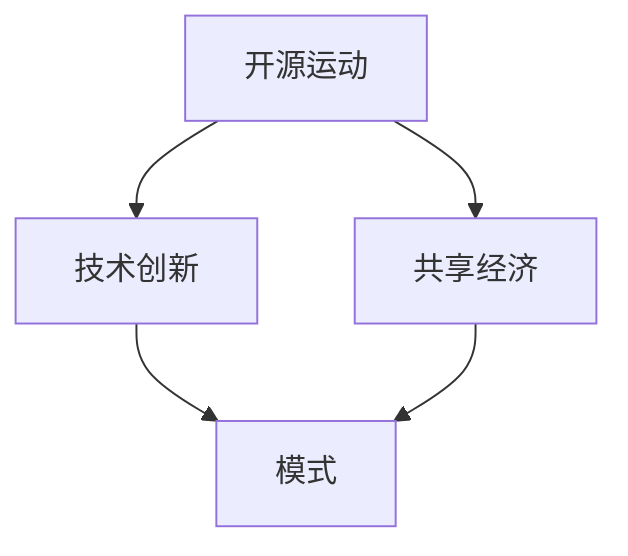

                 

### 《开源运动：共享经济的新模式》

> 关键词：开源运动、共享经济、技术创新、模式、案例、未来趋势

> 摘要：
本文将探讨开源运动如何催生共享经济的新模式。通过分析开源运动的起源与发展，理解开源运动与共享经济的紧密联系，深入探讨开源运动在技术创新、共享经济新模式推动以及实际案例中的应用，最后预测开源运动与共享经济的未来发展趋势。

### 背景介绍

开源运动（Open Source Movement）起源于20世纪80年代，其核心理念是开放源代码，允许任何人自由地使用、修改和分发软件。这一运动的主要推动者是自由软件基金会（Free Software Foundation，FSF）和开源促进会（Open Source Initiative，OSI），它们分别从法律和道德层面为开源运动提供了基础。

共享经济（Sharing Economy）则是在近年来兴起的一种经济模式，其核心在于通过共享闲置资源来提高资源利用效率，降低成本。共享经济的典型代表包括Airbnb、Uber等平台，它们通过互联网技术连接供需双方，实现资源的共享和优化配置。

开源运动和共享经济之间存在着紧密的联系。首先，开源运动为共享经济提供了技术支持。许多共享经济平台都是基于开源技术构建的，如Linux操作系统、Hadoop大数据平台等。其次，开源运动的理念——开放、共享、协作——与共享经济的本质特征高度契合。开源运动鼓励代码的共享和社区的协作，这种协作精神也是共享经济平台运营的关键。

本文将分五个部分进行探讨：

1. **开源运动的起源与发展**：介绍开源运动的起源、发展历程以及核心概念。
2. **开源运动与共享经济的联系**：分析开源运动如何推动共享经济的新模式。
3. **开源运动在技术层面的推动作用**：探讨开源运动在技术创新中的作用。
4. **案例分析**：分享成功的开源运动案例，分析其成功原因。
5. **挑战与未来**：探讨开源运动面临的问题和未来发展的趋势。

### 核心概念与联系

在深入探讨开源运动和共享经济之前，我们需要明确一些核心概念，并分析这些概念之间的关系。

**核心概念**：

- **开源**：指软件的源代码对公众开放，允许任何人自由地使用、修改和分发。
- **共享经济**：指通过共享闲置资源来提高资源利用效率，降低成本。
- **技术创新**：指在技术层面上进行的创新，包括新的算法、工具和架构等。
- **模式**：指共享经济和开源运动的具体实现方式。

**概念实体之间的关系架构**：

我们可以使用Mermaid流程图来展示这些概念实体之间的关系：

在这个流程图中，开源运动和共享经济都推动了技术创新，而技术创新又催生了新的模式。这种模式不仅包括技术层面的创新，还涵盖了商业模式和社会模式的创新。

接下来，我们将详细探讨开源运动的起源、发展以及其与共享经济的联系。

#### 开源运动的起源

开源运动的起源可以追溯到20世纪80年代，当时计算机科学家和程序员开始倡导开放源代码的理念。这个运动的早期倡导者包括理查德·斯托曼（Richard Stallman）和埃里克·雷蒙德（Eric Raymond）。

**理查德·斯托曼**：他是自由软件运动的创始人之一，于1983年成立了自由软件基金会（FSF）。FSF的目标是推广自由软件，确保用户拥有使用、学习、分享和修改软件的自由。斯托曼推出了GNU项目，旨在创建一套自由操作系统，最终与林纳斯·托瓦兹（Linus Torvalds）创建的Linux内核结合，形成了今天的GNU/Linux操作系统。

**埃里克·雷蒙德**：他在其著作《大教堂与市集》（The Cathedral and the Bazaar）中提出了“开源运动”的概念。他认为，开源模式鼓励了大规模的协作和创新，这种协作模式被称为“市集模式”（Bazaar），与传统的集中式开发模式（“大教堂模式”）形成对比。

**开源运动的定义**

开源运动通常被定义为一种软件开发模式，其中软件的源代码对公众开放，允许任何人自由地使用、修改和分发。开源运动的核心原则包括：

1. **自由使用**：任何人都可以自由地使用软件，不受限制。
2. **学习权**：用户有权学习软件的源代码，了解其工作原理。
3. **修改权**：用户有权修改软件源代码，以适应自己的需求。
4. **分享权**：用户有权自由地分享软件，包括修改后的版本。

**开源运动的发展历程**

- **1980年代**：开源运动开始萌芽，自由软件基金会成立，GNU项目启动。
- **1990年代**：Linux内核诞生，自由软件和开源软件开始受到广泛关注。
- **2000年代**：开源运动逐渐成为主流，许多企业和机构开始采用开源软件。
- **2010年代**：GitHub等开源社区平台兴起，开源运动进入一个全新的时代。

#### 开源运动与共享经济的联系

开源运动与共享经济之间的联系可以从多个角度进行分析。

**技术层面**：

开源运动为共享经济提供了强大的技术支持。许多共享经济平台都是基于开源技术构建的，如Linux操作系统、Apache Web服务器、MySQL数据库等。这些开源技术不仅提供了可靠的基础设施，还促进了创新和协作。

**理念层面**：

开源运动的理念——开放、共享、协作——与共享经济的本质特征高度契合。开源运动鼓励代码的共享和社区的协作，这种协作精神也是共享经济平台运营的关键。例如，GitHub等开源社区平台成为共享知识和协作开发的重要工具。

**商业模式层面**：

开源运动不仅推动了共享经济的发展，还创造了一种新的商业模式。许多公司通过提供付费的支持、定制开发和服务来从开源软件中获得收益。例如，红帽公司（Red Hat）通过提供商业支持和咨询服务，成为开源软件领域的领军企业。

#### 开源运动如何推动共享经济的新模式

开源运动推动了共享经济的新模式，主要体现在以下几个方面：

**1. 技术创新**

开源运动鼓励技术创新，促进了新技术的快速发展和普及。许多共享经济平台都是基于这些新技术构建的，如区块链、人工智能、物联网等。这些技术的开源化不仅降低了创新的门槛，还促进了跨领域的合作和协同创新。

**2. 资源共享**

开源运动的理念与共享经济的本质高度契合，鼓励资源的共享和优化配置。开源软件和开源平台为共享经济提供了技术支持，如共享单车平台、共享办公空间等都是基于开源技术构建的。

**3. 共同发展**

开源运动倡导共同发展，鼓励协作和创新。共享经济平台通常需要大量的参与者，而开源运动提供的协作环境促进了这种共同发展的实现。例如，GitHub等开源社区平台不仅提供了代码托管服务，还成为了开发者交流和合作的平台。

#### 开源运动在技术层面的推动作用

开源运动在技术层面上的推动作用不容忽视。它不仅促进了技术的创新和发展，还为共享经济提供了强大的技术支持。

**1. 开源软件的普及**

开源软件的普及为共享经济提供了可靠的基础设施。许多共享经济平台都是基于开源软件构建的，如Linux操作系统、Apache Web服务器、MySQL数据库等。这些开源软件不仅稳定可靠，还不断更新和优化，为共享经济平台提供了坚实的技术保障。

**2. 技术创新的推动**

开源运动鼓励技术创新，促进了新技术的快速发展和普及。许多共享经济平台都是基于这些新技术构建的，如区块链、人工智能、物联网等。这些技术的开源化不仅降低了创新的门槛，还促进了跨领域的合作和协同创新。

**3. 技术共享与协作**

开源运动的理念与共享经济的本质高度契合，鼓励技术的共享和协作。开源社区提供了一个平台，使开发者可以共享代码、知识和经验，共同解决技术难题。这种协作精神不仅提高了技术的创新能力，还为共享经济平台的发展提供了强大的动力。

#### 案例分析

在探讨开源运动如何推动共享经济的新模式时，我们可以通过一些成功的案例来进行分析。

**案例一：GitHub**

GitHub是一家基于开源技术的代码托管平台，它不仅为开发者提供了一个方便的代码存储和协作工具，还成为了开源社区的核心。GitHub的成功在于它不仅提供了可靠的技术支持，还通过构建一个开放、协作的平台，促进了技术的共享和协作。

**成功原因**：

- **开放平台**：GitHub提供了一个完全开放的平台，使开发者可以自由地存储、共享和修改代码。
- **协作机制**：GitHub的协作机制鼓励开发者之间的合作，通过合并请求（Pull Request）和代码审查（Code Review）等方式，共同改进代码。
- **社区文化**：GitHub建立了积极的社区文化，鼓励创新和分享，吸引了大量的开发者参与。

**影响**：

- **技术共享**：GitHub促进了技术的共享，许多开源项目都在GitHub上得到了广泛的关注和支持。
- **创新推动**：GitHub的开放性和协作机制促进了新技术的快速发展和创新。
- **商业机会**：GitHub为许多公司提供了技术支持，促进了共享经济的发展。

**案例二：Linux操作系统**

Linux操作系统是一个基于开源技术的操作系统，它由全球的开发者共同维护和改进。Linux的成功不仅在于其技术优势，还在于其开源的属性，使得它可以自由地被使用和改进。

**成功原因**：

- **开源属性**：Linux的源代码对公众开放，任何人都可以自由地使用、修改和分发。
- **社区支持**：Linux拥有庞大的开发者社区，他们为Linux提供技术支持、文档和培训。
- **技术创新**：Linux的开放性鼓励了技术创新，许多新的技术和特性都首先在Linux上实现。

**影响**：

- **技术普及**：Linux的普及推动了开源技术的普及，许多企业和机构开始采用Linux作为其基础设施。
- **共享经济**：Linux的开源属性促进了技术的共享，许多基于Linux的共享经济平台得以快速发展。
- **商业成功**：Linux的成功为许多公司带来了商业机会，如红帽公司（Red Hat）通过提供Linux的商业支持和咨询服务取得了巨大的成功。

#### 挑战与未来

尽管开源运动和共享经济取得了巨大的成功，但它们也面临着一些挑战和问题。

**1. 法律法规的挑战**

开源运动的发展带来了许多法律问题，如版权、专利和知识产权等。如何平衡开源运动与传统知识产权法之间的关系是一个亟待解决的问题。

**2. 开源社区的治理**

开源社区的成功依赖于良好的治理结构。如何管理社区、处理分歧和确保项目的可持续性是一个重要的挑战。

**3. 开源运动的可持续性**

开源运动的可持续性是一个重要问题。如何确保开源项目的长期发展，如何吸引和保留开发者是一个重要的课题。

**未来趋势**：

- **开源技术的普及**：随着开源技术的不断成熟，越来越多的企业和机构将采用开源技术。
- **共享经济的创新**：共享经济将继续创新，探索新的商业模式和应用场景。
- **开源与共享的结合**：开源运动和共享经济的结合将更加紧密，相互促进，共同推动社会和经济的进步。

### 总结与展望

开源运动和共享经济共同推动了技术和经济的创新。开源运动通过开放源代码、鼓励协作和技术创新，为共享经济提供了强大的技术支持。共享经济通过共享闲置资源、提高资源利用效率，实现了经济的可持续发展。

未来，开源运动和共享经济将继续相互促进，共同推动社会和经济的进步。我们可以期待更多的开源项目和创新模式的出现，为社会带来更大的价值。

### 作者信息

作者：AI天才研究院/AI Genius Institute & 禅与计算机程序设计艺术 /Zen And The Art of Computer Programming

### 最佳实践 Tips

- **积极参与开源项目**：参与开源项目不仅可以提升自己的技术能力，还可以为社区做出贡献。
- **遵循开源协议**：在使用开源技术时，要遵循相应的开源协议，尊重原作者的知识产权。
- **共享与协作**：鼓励共享和协作精神，共同推动技术的创新和发展。

### 小结

开源运动和共享经济是当今社会和技术发展的重要趋势。通过开源运动，我们可以实现技术的共享和协作，推动技术创新；通过共享经济，我们可以提高资源利用效率，实现经济的可持续发展。两者的结合将带来更多的机遇和挑战，值得我们深入研究和探讨。

### 拓展阅读

- 《开源软件运动：自由与共享的力量》
- 《共享经济：从概念到实践》
- 《Linux内核设计与实现》

通过阅读这些书籍和文章，您可以更深入地了解开源运动和共享经济，为自己的技术和商业发展提供新的思路和方向。

