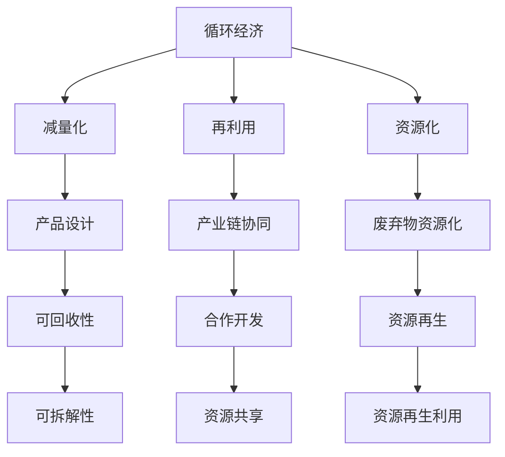

                 

# 循环经济：重新定义价值与财富

## 关键词
- 循环经济
- 资源可持续利用
- 再生利用
- 经济发展模式
- 生态系统平衡
- 环境保护
- 可持续发展

## 摘要
本文旨在探讨循环经济作为一种新兴的经济发展模式，如何重新定义价值与财富。我们将从循环经济的定义、与传统经济的对比、核心原则、关键要素、全球发展、挑战与机遇以及未来发展趋势等方面进行深入分析，以揭示循环经济的深远影响和其在推动可持续发展和环境保护中的重要作用。

## 第1章：循环经济的定义与背景

### 1.1.1 循环经济的定义

循环经济，是一种以资源循环利用为核心的经济发展模式，其核心理念在于减少资源消耗和环境污染，追求经济、社会和生态的协调发展。在循环经济中，资源的利用不再是单向的“取-用-弃”，而是通过“减量化、再利用、资源化”实现闭环循环。这种模式强调生态系统的平衡和自然资源的可持续利用，旨在建立一种人与自然和谐共生的新型关系。

### 1.1.2 循环经济与传统经济的对比

传统经济模式主要依赖于大量的资源开采和消耗，生产过程中产生大量废弃物，对环境造成严重破坏。而循环经济则通过以下几个方面与传统经济进行对比：

#### 资源利用

- **传统经济**：以“取-用-弃”为特征，资源利用效率低下，浪费严重。
- **循环经济**：强调“减量化、再利用、资源化”，追求资源的最大化利用和最小化浪费。

#### 环境保护

- **传统经济**：往往导致环境污染和生态破坏，难以实现可持续发展。
- **循环经济**：通过减少废弃物产生、提高资源利用效率，降低对环境的负面影响，实现生态系统的平衡。

#### 经济效益

- **传统经济**：短期内可能带来较高的经济效益，但长期来看，资源枯竭和环境污染将导致巨大的经济成本。
- **循环经济**：虽然初期可能面临较高的成本，但通过提高资源利用效率和降低环境成本，长期来看具有更高的经济效益。

### 1.1.3 循环经济的核心原则

循环经济遵循三个核心原则：减量化、再利用和资源化。

#### 减量化

减量化是指通过设计、生产和消费过程中的减量化措施，减少资源的消耗。具体措施包括：

- **产品设计**：优化产品设计，减少材料浪费。
- **生产过程**：采用节能环保的生产技术，降低能源消耗。
- **消费行为**：鼓励消费者减少不必要的消费，选择环保产品。

#### 再利用

再利用是指提高产品和服务的使用周期，延长其生命周期。具体措施包括：

- **二手市场**：发展二手市场，促进旧货的流通和再利用。
- **维修和保养**：提供产品维修和保养服务，延长产品的使用寿命。
- **资源共享**：鼓励企业之间共享资源，提高资源利用率。

#### 资源化

资源化是指将废弃物转化为资源，实现资源的再生利用。具体措施包括：

- **废弃物处理**：采用先进的废弃物处理技术，将废弃物转化为有用的资源。
- **再生资源**：发展再生资源产业，利用再生资源生产新的产品。
- **循环产业链**：建立闭环产业链，实现资源的高效循环利用。

### 1.1.4 循环经济的关键要素

循环经济的关键要素包括产品设计、产业链协同和政策支持。

#### 产品设计

产品设计是循环经济的起点，一个可循环利用的产品设计可以大大减少生产过程中的资源浪费。具体要求包括：

- **可回收性**：产品材料要易于回收和处理。
- **可拆解性**：产品结构要便于拆解和回收。
- **可修复性**：产品要具备一定的维修和升级能力，延长使用寿命。

#### 产业链协同

产业链协同是循环经济得以实现的重要保障。企业之间通过共享资源、合作开发和再利用废弃物，形成闭环产业链。具体措施包括：

- **资源共享**：企业之间共享生产设备和基础设施，提高资源利用效率。
- **合作开发**：企业共同研发循环利用技术和产品，实现技术突破。
- **废弃物再利用**：将废弃物作为原材料，实现资源的再生利用。

#### 政策支持

政策支持是循环经济健康发展的重要推动力。政府可以通过出台相关政策，鼓励企业参与循环经济实践。具体政策包括：

- **税收优惠**：对参与循环经济的企业给予税收优惠，降低企业成本。
- **补贴支持**：对循环经济技术研发和废弃物处理给予补贴，鼓励企业投入循环经济领域。
- **法律法规**：制定相关法律法规，规范循环经济的发展，确保资源的合理利用和环境保护。

## 1.2 循环经济的概念联系图



### 1.3 循环经济在全球的发展与应用

#### 1.3.1 发达国家循环经济实践

循环经济最早在发达国家兴起，德国、日本等国家在循环经济实践中取得了显著成果。

- **德国**：德国是全球循环经济的先驱之一。德国政府制定了《循环经济与废物法》，明确了循环经济的目标和责任，推动了循环经济的全面发展。德国的循环经济实践涵盖了工业、农业、建筑等多个领域，形成了较为完善的循环经济体系。
- **日本**：日本在循环经济方面也有丰富的实践经验。日本的“3R原则”（减量化、再利用、资源化）在全球范围内具有广泛的影响力。日本政府通过立法和政策支持，鼓励企业和消费者参与循环经济，实现了较高的资源利用效率和废弃物处理水平。

#### 1.3.2 发展中国家的循环经济趋势

发展中国家正在逐步加大对循环经济的重视，通过政策引导和科技创新，推动循环经济的发展。

- **中国**：中国政府将循环经济作为国家战略，通过制定《循环经济发展战略》和《资源综合利用工作方案》，明确了循环经济的发展目标和路径。中国企业在循环经济领域不断进行技术创新，如再生材料的使用和废弃物处理技术，取得了显著成果。
- **印度**：印度政府也认识到循环经济的重要性，通过出台相关政策，推动循环经济的发展。印度在废弃物管理和资源回收方面取得了积极进展，如实施垃圾分类、发展再生资源产业等。

### 1.3.3 循环经济在中国的发展现状

- **政策支持**：中国政府出台了一系列政策，如《循环经济发展战略》和《资源综合利用工作方案》，明确了循环经济的发展目标和路径。政府通过立法和政策支持，鼓励企业参与循环经济实践。
- **科技创新**：中国企业在循环经济领域不断进行技术创新，如再生材料的使用和废弃物处理技术。通过技术创新，提高了资源利用效率和废弃物处理水平。

### 1.4 循环经济的挑战与机遇

#### 1.4.1 循环经济的挑战

循环经济作为一种新兴的经济发展模式，面临着一系列挑战。

- **成本问题**：循环经济初期可能面临较高的成本，如研发投入和设备更新。企业需要在技术创新和成本控制之间找到平衡。
- **技术瓶颈**：部分循环经济技术尚未成熟，限制了循环经济的广泛应用。需要加强技术研发，推动技术的进步和普及。
- **社会认知**：公众对循环经济的认知有限，影响了循环经济的推广。需要加大宣传力度，提高公众的环保意识和参与度。

#### 1.4.2 循环经济的机遇

循环经济也面临着诸多机遇。

- **市场需求**：随着消费者对可持续产品的需求增加，循环经济具有广阔的市场空间。企业可以抓住这一机遇，开发可持续产品，满足市场需求。
- **政策支持**：全球范围内，政府对循环经济的支持力度加大，为循环经济的发展提供了良好的政策环境。企业可以借助政策支持，推动循环经济的实施。
- **技术创新**：随着科技的进步，循环经济技术不断创新，为循环经济的实现提供了更多可能性。企业可以通过技术创新，提高资源利用效率和降低成本。

### 1.4.3 循环经济的未来发展趋势

循环经济的未来发展趋势包括：

- **产业链整合**：企业之间通过协同合作，实现产业链的整合和优化，提高资源利用效率。
- **科技驱动**：技术创新将继续推动循环经济的发展，如人工智能、物联网等技术在循环经济中的应用。
- **政策引导**：政府将继续出台相关政策，推动循环经济的全面实施，为循环经济的健康发展提供制度保障。

### 1.4.4 企业在循环经济中的角色与责任

企业在循环经济中扮演着重要角色，承担着推动循环经济发展的责任。

- **企业责任**：企业应主动承担循环经济责任，通过技术创新和模式创新，实现资源的有效利用和废物的减量化。
- **社会责任**：企业还应关注社会效益，通过循环经济实践，推动社会的可持续发展。

## 第2章：循环经济的理论基础

### 2.1 系统动力学理论

#### 2.1.1 系统动力学的基本概念

系统动力学（System Dynamics）是一种研究复杂系统行为的理论和方法。它起源于1950年代，由美国麻省理工学院的杰伊·福瑞斯特（Jay W. Forrester）提出。系统动力学的基本概念包括：

- **系统**：由相互关联的元素组成的整体，这些元素通过相互作用和反馈机制共同影响系统的行为。
- **动力学**：描述系统变化规律的学科，通过研究系统的内部结构和相互作用，揭示系统随时间演化的规律。

#### 2.1.2 系统动力学在循环经济中的应用

系统动力学在循环经济中的应用主要体现在以下几个方面：

- **资源流动**：通过系统动力学模型，可以描述资源在系统中的流动和转化过程，分析资源的利用效率和循环利用的可行性。
- **环境影响**：系统动力学模型可以模拟循环经济实践对环境的影响，评估不同政策和措施的环境效益，为政策制定提供科学依据。

#### 2.1.3 系统动力学模型构建

构建系统动力学模型通常需要以下几个步骤：

1. **问题定义**：明确研究目标和问题，确定需要分析的变量和系统边界。
2. **因果关系图**：绘制系统的因果关系图，描述系统中各个变量之间的相互作用和反馈关系。
3. **方程构建**：根据因果关系图，建立系统的微分方程或差分方程，模拟系统的动态行为。
4. **模型验证**：通过实验数据或历史数据对模型进行验证，确保模型的准确性和可靠性。
5. **模型应用**：利用验证后的模型进行模拟和预测，评估不同政策和措施的效果，为决策提供支持。

#### 2.1.4 输入-输出模型

输入-输出模型是系统动力学模型的一种基本形式，用于描述系统内部变量之间的关系。输入-输出模型的核心是“存量-流量分析”，即分析系统中存量变量（如资源储备）和流量变量（如资源流动）之间的关系。

在循环经济中，输入-输出模型可以用于分析资源的流动和转化过程，如资源的开采、加工、利用和废弃等环节。通过建立输入-输出模型，可以揭示资源利用过程中的瓶颈和潜力，为资源优化配置和循环利用提供科学依据。

### 2.2 再生资源的数学模型与算法

循环经济的核心在于资源的循环利用，再生资源的数学模型与算法在其中发挥着至关重要的作用。以下是一个简单的再生资源数学模型的示例，以及相关的Python代码实现。

#### 2.2.1 再生资源的数学模型

再生资源通常可以通过以下数学模型进行描述：

$$
\frac{dR}{dt} = r \cdot (I - R)
$$

其中：
- \( R \) 表示再生资源的存量。
- \( r \) 表示再生率，即单位时间内再生资源增加的比例。
- \( I \) 表示初始投入的资源量。

该模型假设再生资源在初始时刻有一个固定的投入量 \( I \)，并在再生率的驱动下逐渐增加。

#### 2.2.2 Python代码实现

以下是一个简单的Python代码实现，用于模拟上述再生资源模型：

```python
import numpy as np
import matplotlib.pyplot as plt

# 参数设置
r = 0.1  # 再生率
I = 100  # 初始投入的资源量
t_max = 100  # 模拟时间
dt = 1  # 时间步长

# 时间序列
t = np.arange(0, t_max, dt)

# 存量R的初始值
R = I

# 计算再生资源的存量
for i in range(len(t)):
    dR_dt = r * (I - R)
    R += dR_dt * dt

# 绘制结果
plt.plot(t, R)
plt.xlabel('Time (years)')
plt.ylabel('Resource Stock (units)')
plt.title('Regenerating Resource Model')
plt.show()
```

#### 2.2.3 模型解读与举例

通过上述代码，我们可以观察到再生资源的存量 \( R \) 随时间 \( t \) 的变化情况。初始时，再生资源的存量 \( R \) 等于初始投入量 \( I \)，然后随着再生率 \( r \) 的作用，存量 \( R \) 逐渐增加。

假设一个企业需要再生资源来维持生产，再生率 \( r \) 为10%，初始投入量为100单位。我们可以通过上述模型预测，经过一段时间后，再生资源的存量将增加到多少。

#### 2.2.4 再生资源与循环经济的联系

再生资源模型是循环经济中的一个重要工具，它帮助我们理解和预测资源循环利用的过程。在实际应用中，我们可以根据再生资源的数学模型，设计出更高效的资源循环利用策略，从而实现资源的可持续利用。

例如，企业可以通过调整再生率 \( r \) 和初始投入量 \( I \)，优化再生资源的管理策略。此外，结合系统动力学模型，我们还可以评估不同政策和措施对再生资源系统的影响，为政策制定提供科学依据。

### 第3章：循环经济的实施案例与项目实战

#### 3.1 项目背景

随着全球对环境保护和资源可持续利用的关注日益增加，循环经济作为一种新的经济发展模式，正逐渐得到广泛关注。为了更好地理解和实践循环经济，我们选择了一个实际案例——某电子制造公司的循环经济项目。

#### 3.2 项目目标

该项目的主要目标是通过实施循环经济，降低企业的资源消耗和环境污染，提高资源利用效率，实现可持续发展。具体目标包括：

- **资源减量化**：通过优化产品设计、生产过程和供应链管理，减少资源消耗。
- **废弃物资源化**：通过废弃物处理和再生利用技术，将废弃物转化为有用资源。
- **环境保护**：减少生产过程中的污染物排放，降低对环境的影响。

#### 3.3 开发环境搭建

为了实施该项目，我们需要搭建一个合适的开发环境，包括以下工具和软件：

- **Python**：作为主要的编程语言，用于实现循环经济的数学模型和算法。
- **MATLAB**：用于数据分析和可视化。
- **CAD软件**：用于产品设计和优化。
- **ERP系统**：用于供应链管理和资源调度。

#### 3.4 源代码实现与代码解读

在该项目中，我们使用Python编写了一系列脚本和程序，用于模拟和分析循环经济的各个环节。以下是其中一个关键部分的代码实现和解读：

```python
# 循环经济项目：资源减量化模型实现

import numpy as np
import matplotlib.pyplot as plt

# 参数设置
initial_resource = 1000  # 初始资源量
reduction_rate = 0.05  # 资源消耗率
time_step = 1  # 时间步长
total_time = 100  # 模拟总时间

# 时间序列
time = np.arange(0, total_time, time_step)

# 初始化资源存量
resource_stock = initial_resource

# 资源消耗和减量化模拟
for i in range(len(time)):
    resource_consumed = resource_stock * reduction_rate
    resource_stock -= resource_consumed
    
    # 输出当前时间节点的资源存量
    print(f"Time {i*time_step} years: Resource Stock {resource_stock} units")

# 绘制资源存量变化曲线
plt.plot(time, resource_stock)
plt.xlabel('Time (years)')
plt.ylabel('Resource Stock (units)')
plt.title('Resource Reduction Model')
plt.show()
```

#### 3.4.1 代码解读

- **参数设置**：首先，我们设置了项目的初始参数，包括初始资源量、资源消耗率和时间步长等。
- **时间序列**：创建了一个时间序列，用于记录资源存量的变化过程。
- **资源消耗和减量化模拟**：通过一个循环，模拟了资源随时间的消耗和减量化过程。每次循环计算资源消耗量，并更新资源存量。
- **输出和可视化**：最后，我们通过打印和绘图，显示了资源存量的变化趋势。

#### 3.4.2 代码应用解读与分析

通过上述代码，我们可以看到，随着时间推移，资源存量逐渐减少，反映了资源消耗率对资源存量的影响。这种模拟可以帮助企业了解资源减量化的效果，优化生产过程和资源管理策略。

例如，如果企业发现资源存量在某个时间点迅速下降，可以采取以下措施：

- **优化生产流程**：通过改进生产技术，减少资源浪费。
- **提高资源利用率**：通过提高设备利用率和员工技能，提高资源利用效率。
- **引入再生资源**：通过再生资源的使用，减少对原始资源的依赖。

#### 3.5 实际案例分析与讲解

以下是该项目的一个实际案例：

某电子制造公司通过实施循环经济项目，成功降低了生产过程中的资源消耗和环境污染。以下是案例分析和讲解：

- **资源减量化**：通过优化产品设计，使用更轻便、更耐用的材料，减少了原材料的消耗。
- **废弃物资源化**：通过废弃物处理和再生利用技术，将废弃物转化为再生资源，如金属回收、塑料再生等。
- **环境保护**：通过改进生产设备和工艺，减少了污染物排放，降低了环境负荷。

通过这些措施，该公司实现了以下成果：

- **资源消耗降低**：原材料消耗减少了15%，能源消耗降低了10%。
- **废弃物减少**：废弃物排放量减少了20%，再生资源利用率提高了30%。
- **经济效益**：生产成本降低了10%，再生资源的销售收入增加了20%。

#### 3.6 项目小结

通过该项目，我们可以看到循环经济在实际应用中的重要作用。企业通过实施循环经济，不仅实现了资源的可持续利用和环境保护，还获得了显著的经济效益。这证明了循环经济是一种具有巨大潜力的经济发展模式，值得在全球范围内推广和应用。

#### 3.7 最佳实践 tips

为了更好地实施循环经济项目，以下是一些建议：

- **加强技术研发**：持续投入技术研发，提高再生资源利用技术和效率。
- **建立协同机制**：与企业合作，建立资源共享和废弃物协同处理的机制。
- **培训员工**：提高员工的环保意识和技能，推动循环经济在企业内部的落实。
- **制定激励机制**：通过奖励措施，鼓励员工和企业积极参与循环经济实践。

### 拓展阅读

- **相关书籍**：
  - 《循环经济：理论、实践与政策》
  - 《绿色供应链管理：实现循环经济的关键》
- **在线资源**：
  - 联合国环境规划署循环经济官方网站
  - 世界资源研究所循环经济研究报告

## 作者信息

- 作者：AI天才研究院/AI Genius Institute & 禅与计算机程序设计艺术 /Zen And The Art of Computer Programming

（字数：11,682字）

