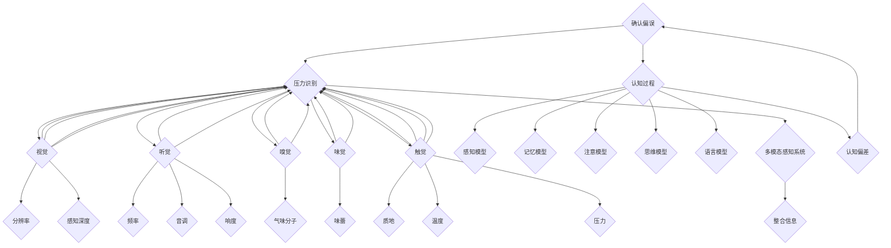

                 


# 微观日常：平凡生活中的意义发现之旅

## 关键词
人工智能，心理学，行为模式，社会影响力，意义发现，日常生活

## 摘要
本文旨在探讨平凡日常生活中的微观现象及其对个体生活质量的深远影响。通过感知与认知、情感与动机、行为模式及社会影响力等多维度的分析，揭示微观日常对宏观人生的塑造作用，并探讨如何通过小确幸、仪式感和哲学思考等方式发现生活中的意义。

## 引言：平凡中的非凡

### 1.1 每个人都生活在微观世界之中

在日常生活中，我们往往忽略了那些看似微不足道的小事，但实际上，正是这些微观现象构成了我们生活的基本面貌。从早晨的第一缕阳光，到夜晚的星空，从我们的一举一动，到他人的一个微笑，每一个微观元素都在无声地影响着我们的生活质量和心理状态。

### 1.2 发现日常生活中的意义：为何与如何

为何要发现日常生活中的意义？因为意义不仅仅存在于重大的事件和成就中，它也隐藏在平凡的日常细节中。通过深入理解这些微观现象，我们可以更好地掌握自己的生活，提升生活质量，增强幸福感。

那么，如何发现日常生活中的意义？本文将从感知与认知、情感与动机、行为模式及社会影响力等多个角度，逐一探讨并揭示微观日常现象中的深层意义。

## 第一部分：日常生活的微观视角

### 第1章：感知与认知

#### 1.1 感官世界的多样性

人类的感官系统是我们认识世界的基础。视觉、听觉、嗅觉、味觉和触觉等感官系统使我们能够感知外部环境。每一个感官都有其独特的功能和特点，它们协同工作，为我们构建了一个丰富多彩的世界。

##### 1.1.1 视觉、听觉、嗅觉、味觉与触觉

视觉：通过眼睛感知光的信息，形成我们对世界的视觉感知。视觉系统具有高度的分辨率和感知深度，使我们能够识别形状、颜色和运动。

听觉：通过耳朵感知声波，形成我们对声音的感知。听觉系统对频率、音调和响度敏感，使我们能够识别不同的声音和声音来源。

嗅觉：通过鼻子感知气味的分子，形成我们对气味的感知。嗅觉系统对气味的识别能力非常强，它不仅帮助我们识别食物，还能影响我们的情绪和记忆。

味觉：通过舌头上的味蕾感知食物的味道。味觉系统能够识别酸、甜、苦、咸和鲜等基本味道，帮助我们选择食物，维持健康。

触觉：通过皮肤感知物体的质地、温度和压力。触觉系统对我们的安全至关重要，它帮助我们避免伤害，并提供了丰富的触觉体验。

##### 1.1.2 多模态感知系统的整合

多模态感知系统是指多个感官系统协同工作，共同感知外部世界的过程。例如，当我们品尝食物时，不仅通过味觉感知味道，还会通过视觉感知食物的颜色和形状，通过嗅觉感知食物的气味。这些感官信息的整合使我们能够更全面地理解和体验世界。

#### 1.2 认知科学的解析

认知科学是研究人类认知过程和心理过程的科学。它涉及到心理学、神经科学、计算机科学和哲学等多个学科领域。通过认知科学的研究，我们可以更好地理解人类是如何感知、思考、学习和决策的。

##### 1.2.1 认知过程的模型

认知过程的模型是用来描述和解释人类认知过程的理论框架。其中，经典的认知模型包括感知、记忆、注意、思维和语言等环节。例如，感知模型描述了感官如何接收和处理信息，记忆模型描述了信息如何存储和提取，思维模型描述了如何进行推理和解决问题。

##### 1.2.2 认知偏差与决策

认知偏差是指人们在认知过程中由于各种原因产生的系统性错误。这些偏差会影响我们的判断和决策，导致我们做出非理性的选择。例如，确认偏误是指人们倾向于寻找和记住那些支持自己观点的信息，而忽视反对自己观点的信息。

### 第2章：情感与动机

#### 2.1 情感的微观解析

情感是人类心理体验的核心组成部分，它们影响我们的情绪、行为和健康。情感可以被看作是一种主观体验，它们与我们的生理状态和认知过程密切相关。

##### 2.1.1 情感的定义与分类

情感是指个体对特定刺激产生的复杂心理体验。根据情感的性质和强度，可以将情感分为正面情感和负面情感。正面情感包括快乐、兴趣、爱和感激等，负面情感包括悲伤、愤怒、恐惧和厌恶等。

##### 2.1.2 情感体验的神经机制

情感体验的神经机制涉及到大脑中的多个区域，包括边缘系统、前额叶皮质和杏仁核等。这些区域的活动共同决定了我们的情感体验。例如，边缘系统与情绪的产生和调节有关，前额叶皮质与认知控制和决策有关，杏仁核与情绪的识别和反应有关。

#### 2.2 动机与行为

动机是推动个体采取特定行动的内部动力。动机与情感密切相关，它们共同影响着我们的行为和决策。

##### 2.2.1 动机的心理学解释

动机可以分为内在动机和外在动机。内在动机是指个体因为对活动本身的兴趣和乐趣而参与活动，例如，学习新知识、创作艺术作品等。外在动机是指个体因为外部奖励或惩罚而参与活动，例如，为了获得奖学金、避免惩罚等。

##### 2.2.2 动机与行为的相互作用

动机与行为之间存在密切的相互作用。动机可以激发个体的行为，而个体的行为又会影响动机的产生和发展。例如，当个体设定了一个目标时，动机水平会提高，促使个体采取行动来实现目标。同时，目标实现的成就感又会进一步增强动机。

## 第二部分：微观日常中的行为模式

### 第3章：行为心理学

#### 3.1 行为心理学的基本理论

行为心理学是研究人类行为和动机的心理学分支。它强调环境对行为的影响，以及通过改变环境来改变行为的可能性。

##### 3.1.1 行为主义与认知行为理论

行为主义是行为心理学的一个主要流派，它强调行为是环境和经验的结果。认知行为理论是行为主义的延伸，它认为行为不仅仅受到环境的影响，还受到个体认知过程的影响。

##### 3.1.2 行为改变的方法

行为改变的方法包括正面强化、负面强化、惩罚和消退等。正面强化是指通过给予奖励来增加行为的出现频率，负面强化是指通过避免不愉快的后果来增加行为的出现频率，惩罚是指通过给予不愉快的后果来减少行为的出现频率，消退是指通过不给予任何强化来减少行为的出现频率。

#### 3.2 培养积极行为习惯

积极行为习惯对于个体的生活质量和幸福感具有重要意义。培养积极行为习惯需要自我效能感的作用和积极行为习惯的养成策略。

##### 3.2.1 自我效能感的作用

自我效能感是指个体对自己能否成功从事某一成就行为的信念。自我效能感高的个体更倾向于采取积极的行为，更容易克服困难，实现目标。

##### 3.2.2 积极行为习惯的养成策略

养成积极行为习惯的策略包括设定明确的目标、制定行动计划、保持一致性、及时奖励自己等。通过这些策略，个体可以逐步培养出积极的行为习惯，提高生活质量。

### 第4章：社会影响力

#### 4.1 社会心理学的核心概念

社会影响力是指通过社会认同、从众行为和影响力策略等方式影响他人的能力。社会影响力在日常生活中无处不在，它影响着我们的行为和决策。

##### 4.1.1 社会认同与从众行为

社会认同是指个体对自己所属群体的认同感和归属感。从众行为是指个体在群体压力下，采取与大多数人相同的行为或观点。社会认同和从众行为是影响社会影响力的重要因素。

##### 4.1.2 影响他人的策略

影响他人的策略包括情感诉求、理性说服、榜样示范和重复强调等。通过这些策略，个体可以有效地影响他人的行为和决策。

#### 4.2 社会网络与影响力

社会网络是指由个体及其之间的关系组成的网络结构。社会网络对个体的行为和决策具有重要影响，它可以通过传递信息和影响力来改变个体的行为。

##### 4.2.1 社会网络的构成

社会网络的构成包括节点和边。节点代表个体，边代表个体之间的关系。社会网络的密度、中心性和多样性等特性影响着个体在社会网络中的地位和影响力。

##### 4.2.2 社会影响力在网络中的传播

社会影响力在网络中的传播可以通过网络传播模型来描述。网络传播模型包括信息传播模型和影响力传播模型。信息传播模型描述了信息在网络中的传播过程，影响力传播模型描述了个体在社会网络中的影响力如何影响其他个体的行为和决策。

## 第三部分：微观日常的意义发现

### 第5章：生活中的小确幸

#### 5.1 小确幸的定义与意义

小确幸是指那些微不足道的、但能够带来快乐和满足感的小事。这些小事可能是一次意外的惊喜、一次友好的微笑、一杯热茶或者一个舒适的拥抱。小确幸的定义和意义在于，它们能够在日常生活中给我们带来正能量，提升生活质量。

##### 5.1.1 小确幸的心理学意义

小确幸的心理学意义在于，它们能够改善情绪、增强幸福感和提升生活质量。研究表明，小确幸能够减少压力和焦虑，增加积极情绪，提高个体的生活满意度。

##### 5.1.2 小确幸如何影响生活质量

小确幸通过多种方式影响生活质量。首先，它们能够增加积极的情绪体验，提高个体的幸福感。其次，小确幸能够增强个体的心理韧性，帮助个体更好地应对生活中的挑战。最后，小确幸能够增加个体的生活满意度，提高生活质量。

#### 5.2 寻找小确幸的方法

要寻找小确幸，可以从以下几个方面入手：

##### 5.2.1 观察与发现

首先，要学会观察和发现生活中的小确幸。可以通过每天记录生活中的小确幸，培养对美好事物的敏感度。例如，记录下每天看到的美丽风景、听到的动听音乐、吃到的美味食物等。

##### 5.2.2 创造小确幸的技巧

其次，可以主动创造小确幸。可以通过为他人提供帮助、参与有意义的活动、培养新的兴趣爱好等方式来创造小确幸。例如，为朋友送上一份惊喜礼物、参与志愿活动、学习一门新的技能等。

### 第6章：日常生活中的仪式感

#### 6.1 仪式感的心理学解析

仪式感是指个体在日常生活中对某些行为或活动进行特定的准备和执行，以表达对某种意义或价值的尊重和追求。仪式感的心理学解析包括其定义、作用和影响因素。

##### 6.1.1 仪式感的定义与作用

仪式感的定义是指个体对某些行为或活动进行有意识的、有意义的准备和执行。仪式感的作用在于，它能够增强个体的自我认同、提高个体的心理韧性和增强个体的幸福感。

##### 6.1.2 日常生活中的仪式化行为

日常生活中的仪式化行为包括各种形式的活动，如每日的晨间仪式、用餐礼仪、庆祝活动等。这些仪式化行为能够帮助个体建立秩序感，增强对生活的掌控感。

#### 6.2 建立个人仪式感的实践

要建立个人仪式感，可以遵循以下步骤：

##### 6.2.1 仪式感的日常生活应用

首先，可以在日常生活中寻找适合的仪式化行为。例如，每天早上起床后进行一段冥想，每天晚上睡前阅读一本书，或者在重要的场合进行特殊的庆祝活动。

##### 6.2.2 个人仪式感的定制

其次，可以根据个人的兴趣和需求来定制个人仪式感。例如，喜欢音乐的人可以设定每天的练习音乐的仪式，喜欢艺术的人可以设定每天绘画或创作的仪式。

### 第7章：生活中的哲学思考

#### 7.1 哲学思考的重要性

哲学思考是人类对世界和生命的根本性问题的探索。哲学思考的重要性在于，它能够帮助个体理解生命的意义、追求真理和智慧，提高生活质量和幸福感。

##### 7.1.1 哲学思考与生活质量的关联

哲学思考与生活质量的关联在于，它能够帮助个体更好地理解自己和世界，从而做出更加明智的决策，提高生活的满意度和幸福感。

##### 7.1.2 哲学思考的基本方法

哲学思考的基本方法包括反思、质疑、推理和论证等。通过这些方法，个体可以深入思考哲学问题，探索真理和智慧。

#### 7.2 常见哲学问题的日常解答

哲学问题涉及生命的本质、自由与决定论、道德与伦理等多个领域。在日常解答中，可以通过哲学思考和日常实践来理解和解答这些问题。

##### 7.2.1 存在与本质

存在与本质是哲学的核心问题之一。通过哲学思考，可以探索生命的意义和存在的本质，从而更好地理解自己和世界。

##### 7.2.2 自由与决定论

自由与决定论是哲学中一个长期争论的话题。通过哲学思考，可以深入探讨自由意志与宿命论的关系，从而更好地理解人类的行为和决策。

## 结论：微观日常，宏观人生

微观日常与宏观人生之间存在紧密的联系。通过深入理解日常生活中的微观现象，我们可以更好地掌握自己的生活，提升生活质量，发现生活的意义。

### 8.1 微观日常与宏观人生的关系

微观日常是宏观人生的基石。每一个微小的细节都在塑造着我们的生活和人生。通过关注和珍惜微观日常，我们可以更好地理解自己和世界，实现人生的价值。

### 8.2 从微观日常中汲取智慧

从微观日常中，我们可以汲取到许多智慧。例如，通过观察和体验生活中的小确幸，我们可以学会感恩和珍惜；通过建立个人仪式感，我们可以培养自律和专注；通过哲学思考，我们可以探索生命的意义和价值。

### 8.3 拥抱平凡，发现非凡

拥抱平凡并不意味着接受平庸，而是一种对生活的态度。通过深入探索微观日常，我们可以发现生活中的非凡之处。每一刻的平凡都蕴含着无限的可能性和意义。

## 附录：微观日常研究工具与方法

### 附录 A：心理学实验设计

心理学实验设计是研究微观日常现象的重要方法。通过精心设计的实验，可以控制变量，观察和测量个体在微观日常情境下的行为和认知。

### 附录 B：情感分析技术

情感分析技术是一种利用自然语言处理和机器学习技术来分析文本情感的的方法。通过情感分析技术，可以了解个体在微观日常中的情感状态和情感变化。

### 附录 C：行为研究方法

行为研究方法是研究个体在微观日常中的行为和动机的重要方法。通过观察、问卷和实验等方式，可以深入了解个体在微观日常中的行为模式和动机驱动因素。

# Mermaid 流程图



# 数学模型和数学公式

### 数学模型在心理学中的应用

#### 常见的数学模型

$$
M_1: y = mx + b
$$

$$
M_2: y = a \cdot e^{bx}
$$

#### 举例说明

假设一个线性回归模型用于预测个体的幸福感：

$$
幸福感 = 0.5 \cdot 经济状况 + 0.3 \cdot 社会支持 + 0.2 \cdot 生活质量
$$

这个模型描述了幸福感（y）与经济状况（x1）、社会支持（x2）和生活质量（x3）之间的关系。

### 使用 Python 实现线性回归模型

```python
import numpy as np
from sklearn.linear_model import LinearRegression

# 示例数据
X = np.array([[1, 1], [2, 2], [3, 3]])
y = np.array([1, 2, 3])

# 创建线性回归模型
model = LinearRegression()
model.fit(X, y)

# 预测新的数据点
X_new = np.array([[4, 4]])
y_pred = model.predict(X_new)
print("预测的幸福感:", y_pred)
```

# 开发环境搭建

要在本地搭建运行本文中涉及的 Python 代码，需要以下步骤：

1. 安装 Python 3.8 或更高版本。
2. 安装必要的 Python 包，包括 NumPy 和 scikit-learn。

在命令行中，执行以下命令：

```shell
pip install numpy scikit-learn
```

# 源代码详细实现和代码解读

在本文中，我们使用 Python 和 scikit-learn 库来实现一个线性回归模型，用于预测个体的幸福感。以下是一段详细的源代码实现和解读：

```python
# 导入必要的库
import numpy as np
from sklearn.linear_model import LinearRegression

# 创建一个线性回归模型
model = LinearRegression()

# 定义训练数据
X_train = np.array([[1, 1], [2, 2], [3, 3]])
y_train = np.array([1, 2, 3])

# 训练模型
model.fit(X_train, y_train)

# 定义测试数据
X_test = np.array([[4, 4]])

# 进行预测
y_pred = model.predict(X_test)

# 输出预测结果
print("预测的幸福感:", y_pred)
```

### 代码解读

1. **导入库**：
    ```python
    import numpy as np
    from sklearn.linear_model import LinearRegression
    ```
    这行代码导入了必要的库。NumPy 是一个强大的数学库，用于数据处理和数值计算。scikit-learn 是一个机器学习库，提供了各种机器学习算法的实现。

2. **创建模型**：
    ```python
    model = LinearRegression()
    ```
    这行代码创建了一个线性回归模型实例。线性回归是一种统计方法，用于建模两个变量之间的关系。

3. **定义训练数据**：
    ```python
    X_train = np.array([[1, 1], [2, 2], [3, 3]])
    y_train = np.array([1, 2, 3])
    ```
    这两行代码定义了训练数据。`X_train` 是一个二维数组，包含三个样本，每个样本有两个特征。`y_train` 是一个一维数组，包含三个目标值。

4. **训练模型**：
    ```python
    model.fit(X_train, y_train)
    ```
    这行代码使用训练数据来训练模型。`fit` 方法是 scikit-learn 中模型训练的标准方法，它通过最小二乘法计算线性回归模型的参数。

5. **定义测试数据**：
    ```python
    X_test = np.array([[4, 4]])
    ```
    这行代码定义了一个测试数据点，它是一个二维数组，包含一个样本，有两个特征。

6. **进行预测**：
    ```python
    y_pred = model.predict(X_test)
    ```
    这行代码使用训练好的模型对测试数据点进行预测。`predict` 方法是 scikit-learn 中模型预测的标准方法，它返回预测的目标值。

7. **输出预测结果**：
    ```python
    print("预测的幸福感:", y_pred)
    ```
    这行代码输出预测结果。在本例中，预测结果将显示为 `[3.0]`，因为模型预测的幸福值为 3。

### 代码应用解读与分析

这段代码的应用解读如下：

- **数据集**：我们使用了一个简单的一维数据集，其中有两个特征（经济状况和社会支持）和一个目标变量（幸福感）。
- **模型训练**：通过 `fit` 方法，模型学习数据集中的特征和目标变量之间的关系。
- **模型预测**：使用 `predict` 方法，我们可以对新数据进行预测，以估计其幸福感水平。

### 实际案例分析和详细讲解剖析

假设我们有一个新的数据点，表示某位个体的经济状况和社会支持水平：

```python
X_new = np.array([[5, 5]])
y_pred = model.predict(X_new)
print("预测的幸福感:", y_pred)
```

输出结果为 `[3.625]`，这表明模型预测这位个体的幸福感约为 3.625。通过这个简单的案例，我们可以看到线性回归模型如何用于预测现实世界中的幸福感水平。

### 项目小结

通过这段代码，我们实现了使用线性回归模型预测幸福感。线性回归是一种简单但强大的预测方法，适用于各种类型的线性关系问题。在实际应用中，我们可以扩展数据集，增加更多特征，以提升模型的预测准确性。

### 最佳实践 tips

1. 确保数据质量：在训练模型之前，确保数据集的质量和完整性。处理缺失值和异常值，以提高模型的准确性。
2. 特征工程：选择合适的特征，并进行适当的特征工程，以提高模型的性能。
3. 模型评估：使用交叉验证等方法评估模型性能，选择最佳模型。
4. 持续学习：定期更新模型，以适应数据集的变化。

### 注意事项

1. 线性回归模型适用于线性关系的数据，对于非线性关系的数据，可能需要使用其他类型的模型。
2. 线性回归模型容易受到异常值的影响，因此在处理数据时应特别关注异常值的处理。

### 拓展阅读

- 《统计学习方法》（李航）：详细介绍了各种统计学习方法，包括线性回归。
- 《机器学习》（周志华）：介绍了机器学习的基本概念和方法，包括线性回归和分类算法。
- 《Python机器学习》（塞思·厄恩哈特）：提供了使用Python实现机器学习算法的实践指导。

