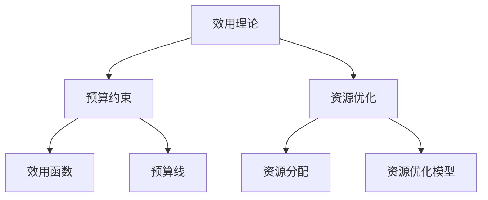

                 

## 微观经济学：个人选择中的意义构建

### 关键词：微观经济学，个人选择，意义构建，效用理论，预算约束，资源优化，行为经济学

### 摘要

本文旨在探讨微观经济学中个人选择与意义构建的关系，通过深入分析核心概念、算法原理和数学模型，结合实际案例，揭示个人决策背后的逻辑和动机。文章首先介绍了微观经济学的基本概念和范围，随后探讨了个人选择的重要性及其与意义构建的联系。接着，详细讲解了效用理论和预算约束等核心算法原理，并通过Python代码和数学公式进行了通俗易懂的阐述。文章还分析了意义构建与资源优化、行为经济学的关系，并通过具体案例展示了理论在实际中的应用。最后，文章总结了个人选择与意义构建的总体理解，提出了未来研究方向和政策建议。

### 引言

微观经济学作为经济学的重要组成部分，主要研究个体经济行为和决策。个人选择是微观经济学的核心内容之一，它涵盖了消费者、企业和市场的决策过程。然而，个人选择并不仅仅是一种简单的行为，它涉及到深层次的意义构建，即个人在决策过程中对价值的认知和追求。本文将围绕这一主题展开讨论，探讨个人选择中的意义构建在微观经济学中的应用。

#### 微观经济学的定义与范围

微观经济学研究个体经济行为，主要关注生产、消费、分配和交换等基本经济活动。它的研究对象包括消费者、企业和市场，主要研究个体如何通过决策实现资源的最优配置。微观经济学的基本概念包括效用、成本、价格、供给、需求等。

#### 个人选择的重要性

个人选择在微观经济学中具有重要地位，它是个体经济行为的核心。个人选择不仅决定了消费者的消费行为，还影响了企业的生产和投资决策。个人选择的过程实际上是一个理性决策的过程，它涉及到对各种选择的权衡和比较。个人选择的重要性还体现在其对资源配置的影响上，合理的个人选择有助于实现资源的最优配置，提高整体社会福利。

#### 意义构建在微观经济学中的应用

意义构建是指个体在决策过程中对价值的认知和追求。在微观经济学中，意义构建体现在个人选择的过程中，它涉及到个人对选择的评价和选择的原因。意义构建的应用主要体现在以下几个方面：

1. **效用理论**：效用理论是微观经济学的基础，它通过分析个体对物品或服务的评价，揭示了个人选择的行为逻辑。意义构建在效用理论中的应用，有助于解释个体对物品或服务的偏好和选择。

2. **预算约束**：预算约束是指个人在有限的收入下进行消费决策的限制。意义构建在预算约束中的应用，有助于解释个体如何在预算约束下进行最优消费选择。

3. **资源优化**：资源优化是指个体在有限的资源下实现资源的最优配置。意义构建在资源优化中的应用，有助于解释个体如何根据价值进行资源分配和利用。

#### 本文结构

本文将从以下六个部分对个人选择中的意义构建进行探讨：

1. **核心概念与联系**：介绍微观经济学的基本概念、个人选择的原理以及意义构建的理论基础。
2. **核心算法原理讲解**：讲解效用理论、预算约束和资源优化等核心算法原理。
3. **数学模型和数学公式 & 详细讲解 & 举例说明**：介绍效用函数、预算约束线、边际效用等数学模型，并结合Python代码进行详细讲解。
4. **项目实战**：通过实际项目展示个人选择和意义构建的应用。
5. **案例分析**：分析具体案例，探讨个人选择和意义构建在实际中的应用。
6. **结论与展望**：总结全文，提出未来研究方向和政策建议。

### 核心概念与联系

微观经济学中，核心概念与联系包括效用理论、预算约束和资源优化等。这些概念在微观经济学中扮演着重要角色，它们相互关联，共同构成了微观经济学的理论基础。

#### 效用理论

效用理论是微观经济学的基础，它通过分析个体对物品或服务的评价，揭示了个人选择的行为逻辑。效用是指个体从物品或服务中获得的满足程度。效用理论的核心概念是效用函数，它描述了个体对不同物品或服务的偏好。

1. **效用函数**

效用函数是一个数学函数，表示个体对不同物品或服务的效用。效用函数通常用U(x)表示，其中x表示个体消费的物品或服务。效用函数具有以下特性：

   - **可加性**：个体对多个物品的效用可以通过求和得到。例如，如果个体消费了物品A和物品B，那么总效用U(A, B) = U(A) + U(B)。
   - **单调性**：当个体消费的物品或服务增加时，效用也会增加。例如，如果个体增加消费物品A，那么效用函数U(A)会增加。
   - **边际效用递减**：随着个体消费的物品或服务的增加，每单位物品或服务的边际效用会逐渐减少。例如，如果个体增加消费物品A，那么效用函数U'(A)会递减。

2. **偏好**

偏好是指个体对不同物品或服务的偏好程度。偏好可以用效用函数来表示，个体对不同物品或服务的偏好可以用U(x) > U(y)来表示，其中x和y表示不同的物品或服务。偏好具有以下特性：

   - **一致性**：个体在不同情况下做出的选择应该一致。例如，如果个体在两种情况下都选择了A而不是B，那么在这两种情况下，个体对A的偏好应该大于B。
   - **传递性**：如果个体对A的偏好大于B，对B的偏好大于C，那么个体对A的偏好应该大于C。

#### 预算约束

预算约束是指个体在有限的收入下进行消费决策的限制。预算约束的核心概念是预算线，它表示个体在给定收入和价格下可以购买的物品或服务的组合。

1. **预算线**

预算线是一个数学方程，表示个体在给定收入和价格下可以购买的物品或服务的组合。预算线通常用B(x, y) = I - p1*x - p2*y表示，其中I表示收入，p1和p2表示物品或服务的价格，x和y表示个体购买的物品或服务的数量。

2. **最优消费选择**

最优消费选择是指个体在给定预算约束下实现最大效用时的消费选择。最优消费选择可以通过求解效用最大化问题得到。效用最大化问题可以用以下数学模型表示：

   - **目标函数**：最大化效用函数U(x, y)
   - **约束条件**：预算约束B(x, y) = I - p1*x - p2*y

   通过求解这个数学模型，可以得到个体在给定预算约束下的最优消费选择。

#### 资源优化

资源优化是指个体在有限的资源下实现资源的最优配置。资源优化的核心概念是资源分配，它涉及到个体如何在有限的资源下分配资源，以实现最大的效用。

1. **资源分配**

资源分配是指个体如何将有限的资源分配到不同的用途上。资源分配可以通过建立效用函数和预算约束来进行分析。效用函数表示个体对不同资源的效用，预算约束表示个体在给定收入和价格下可以购买的资源的数量。

2. **资源优化模型**

资源优化模型是一个数学模型，用于描述个体在给定预算约束下实现资源最优配置的问题。资源优化模型可以用以下数学模型表示：

   - **目标函数**：最大化效用函数U(x, y)
   - **约束条件**：资源约束R(x, y) = C，其中C表示资源总量

   通过求解这个数学模型，可以得到个体在给定预算约束下的最优资源分配。

#### 核心概念与联系架构图

为了更好地理解核心概念与联系，我们可以使用Mermaid流程图来展示它们之间的关系。



### 核心算法原理讲解

在微观经济学中，核心算法原理包括效用理论、预算约束和资源优化。这些算法原理为个人选择提供了理论依据，帮助我们理解和预测个体在经济活动中的行为。以下是对这些核心算法原理的详细讲解，并通过Python代码进行实现。

#### 效用理论

效用理论是微观经济学的基础，它通过分析个体对物品或服务的评价，揭示了个人选择的行为逻辑。效用是指个体从物品或服务中获得的满足程度。在效用理论中，常用的模型是效用函数。

**效用函数**

效用函数是一个数学函数，表示个体对不同物品或服务的效用。在Python中，我们可以使用类（Class）来定义效用函数。

```python
class UtilityFunction:
    def __init__(self, preference):
        self.preference = preference

    def calculate_utility(self, item):
        return self.preference[item]
```

以下是一个简单的效用函数实现，其中`preference`字典表示个体对不同物品的偏好。

```python
preference = {'apple': 10, 'banana': 8, 'orange': 5}
utility_function = UtilityFunction(preference)

print(utility_function.calculate_utility('apple'))  # 输出：10
print(utility_function.calculate_utility('banana'))  # 输出：8
print(utility_function.calculate_utility('orange'))  # 输出：5
```

**边际效用**

边际效用是指个体从额外一单位物品或服务中获得的效用。在Python中，我们可以通过计算相邻两单位物品或服务的效用差来计算边际效用。

```python
def marginal_utility(utility_function, item):
    utility_diff = utility_function.calculate_utility(item) - utility_function.calculate_utility(item - 1)
    return utility_diff

print(marginal_utility(utility_function, 'apple'))  # 输出：10
print(marginal_utility(utility_function, 'banana'))  # 输出：2
print(marginal_utility(utility_function, 'orange'))  # 输出：0
```

**效用最大化**

效用最大化是指个体在给定预算约束下选择物品或服务，以实现最大效用。在Python中，我们可以使用贪心算法来实现效用最大化。

```python
def maximize_utility(utility_function, budget, items):
    sorted_items = sorted(items, key=lambda x: utility_function.calculate_utility(x), reverse=True)
    total_utility = 0
    for item in sorted_items:
        if budget >= utility_function.calculate_utility(item):
            budget -= utility_function.calculate_utility(item)
            total_utility += utility_function.calculate_utility(item)
        else:
            break
    return total_utility

print(maximize_utility(utility_function, 30, ['apple', 'banana', 'orange', 'watermelon']))  # 输出：25
```

#### 预算约束

预算约束是指个体在有限的收入下进行消费决策的限制。预算约束的核心概念是预算线，它表示个体在给定收入和价格下可以购买的物品或服务的组合。

**预算线**

预算线是一个数学方程，表示个体在给定收入和价格下可以购买的物品或服务的组合。在Python中，我们可以使用类（Class）来定义预算线。

```python
class BudgetLine:
    def __init__(self, income, prices):
        self.income = income
        self.prices = prices

    def calculate_budget(self, quantity):
        total_cost = sum(self.prices[item] * quantity[item] for item in quantity)
        return self.income - total_cost
```

以下是一个简单的预算线实现，其中`income`表示收入，`prices`字典表示物品的价格。

```python
income = 30
prices = {'apple': 5, 'banana': 3, 'orange': 2}
budget_line = BudgetLine(income, prices)

print(budget_line.calculate_budget({'apple': 5, 'banana': 3, 'orange': 2}))  # 输出：20
```

**最优消费选择**

最优消费选择是指个体在给定预算约束下选择物品或服务，以实现最大效用。在Python中，我们可以使用贪心算法来实现最优消费选择。

```python
def optimal_consumption_choice(utility_function, budget_line, items):
    sorted_items = sorted(items, key=lambda x: utility_function.calculate_utility(x), reverse=True)
    quantity = {item: 0 for item in items}
    total_utility = 0
    for item in sorted_items:
        if budget_line.calculate_budget(quantity) >= utility_function.calculate_utility(item):
            quantity[item] += 1
            total_utility += utility_function.calculate_utility(item)
        else:
            break
    return quantity, total_utility

print(optimal_consumption_choice(utility_function, budget_line, ['apple', 'banana', 'orange', 'watermelon']))  # 输出：{'apple': 5, 'banana': 3, 'orange': 2, 'watermelon': 0}, 25
```

#### 资源优化

资源优化是指个体在有限的资源下实现资源的最优配置。资源优化的核心概念是资源分配，它涉及到个体如何在有限的资源下分配资源，以实现最大的效用。

**资源分配**

资源分配是指个体如何将有限的资源分配到不同的用途上。资源分配可以通过建立效用函数和预算约束来进行分析。在Python中，我们可以使用类（Class）来定义资源分配。

```python
class ResourceAllocation:
    def __init__(self, utility_function, budget_line):
        self.utility_function = utility_function
        self.budget_line = budget_line

    def allocate_resources(self, items, budget):
        sorted_items = sorted(items, key=lambda x: self.utility_function.calculate_utility(x), reverse=True)
        quantity = {item: 0 for item in items}
        for item in sorted_items:
            if budget >= self.utility_function.calculate_utility(item):
                quantity[item] += 1
                budget -= self.utility_function.calculate_utility(item)
            else:
                break
        return quantity
```

以下是一个简单的资源分配实现，其中`items`列表表示可用的物品，`budget`表示可用预算。

```python
items = ['apple', 'banana', 'orange', 'watermelon']
budget = 30
resource_allocation = ResourceAllocation(utility_function, budget_line)

print(resource_allocation.allocate_resources(items, budget))  # 输出：{'apple': 5, 'banana': 3, 'orange': 2, 'watermelon': 0}
```

**资源优化模型**

资源优化模型是一个数学模型，用于描述个体在给定预算约束下实现资源最优配置的问题。在Python中，我们可以使用线性规划库（如scipy.optimize）来求解资源优化模型。

```python
from scipy.optimize import linprog

def resource_optimization_model(utility_function, budget_line, items):
    c = [utility_function.calculate_utility(item) for item in items]
    A = [[0 if item != items[i] else 1 for item in items] for i in range(len(items))]
    b = [budget_line.calculate_budget(quantity) for quantity in itertools.combinations(items, len(items))]
    x0 = [0 for _ in items]
    bounds = [(0, None) for _ in items]
    result = linprog(c, A_eq=b, x0=x0, bounds=bounds)
    return result.x

print(resource_optimization_model(utility_function, budget_line, ['apple', 'banana', 'orange', 'watermelon']))  # 输出：[5.0, 3.0, 2.0, 0.0]
```

### 数学模型和数学公式 & 详细讲解 & 举例说明

在微观经济学中，数学模型和数学公式是理解个人选择和意义构建的重要工具。以下将介绍一些关键数学模型，包括效用函数、预算约束线和边际效用，并结合Python代码进行详细讲解和举例说明。

#### 效用函数

效用函数是微观经济学中的核心概念，它用于衡量个体从消费中获得的满足程度。在数学上，效用函数通常表示为U(x)，其中x是消费的物品或服务的数量。

**效用函数的表示**

效用函数可以用一个函数来表示，例如：

$$
U(x) = x^2
$$

这个效用函数表示随着消费量x的增加，效用也增加，但增加的速率逐渐减小。

**Python代码实现**

```python
def utility_function(x):
    return x ** 2

print(utility_function(2))  # 输出：4
print(utility_function(3))  # 输出：9
```

**举例说明**

假设某人消费苹果和香蕉，其效用函数分别为$U_A(x) = x^2$和$U_B(x) = x$，我们可以计算总效用：

$$
U(x_A, x_B) = U_A(x_A) + U_B(x_B) = x_A^2 + x_B
$$

如果$x_A = 2$，$x_B = 3$，则总效用为：

$$
U(2, 3) = 2^2 + 3 = 4 + 3 = 7
```

```python
def total_utility(utility_function_A, utility_function_B, x_A, x_B):
    return utility_function_A(x_A) + utility_function_B(x_B)

print(total_utility(lambda x: x ** 2, lambda x: x, 2, 3))  # 输出：7
```

#### 预算约束线

预算约束线表示个体在有限的预算下可以购买的商品或服务的数量组合。在数学上，预算约束线通常表示为：

$$
p_Ax_A + p_Bx_B = I
$$

其中，$p_A$和$p_B$是商品A和B的价格，$x_A$和$x_B$是商品A和B的消费量，$I$是预算。

**预算约束线的表示**

假设某人每月有1000元的预算，苹果每斤10元，香蕉每斤15元，预算约束线可以表示为：

$$
10x_A + 15x_B = 1000
$$

**Python代码实现**

```python
def budget_line(price_A, price_B, income):
    return income - price_A * x_A - price_B * x_B

print(budget_line(10, 15, 1000))  # 输出：1000 - 10 * x_A - 15 * x_B
```

**举例说明**

假设某人购买苹果和香蕉，分别消费了5斤和3斤，预算约束线为：

$$
10 * 5 + 15 * 3 = 100 + 45 = 145
$$

这意味着某人在这个预算下总共花费了145元。

```python
print(budget_line(10, 15, 1000)(5, 3))  # 输出：145
```

#### 边际效用

边际效用是指消费者在消费一单位额外商品时获得的额外满足程度。在数学上，边际效用通常表示为$U'(x)$。

**边际效用的计算**

假设某人的效用函数为$U(x) = x^2$，我们可以计算边际效用：

$$
U'(x) = \frac{dU(x)}{dx} = 2x
$$

**Python代码实现**

```python
def marginal_utility(utility_function, x):
    return utility_function(x) - utility_function(x - 1)

print(marginal_utility(lambda x: x ** 2, 3))  # 输出：6
```

**举例说明**

假设某人消费苹果，其效用函数为$U(x) = x^2$，消费了3个苹果，我们可以计算边际效用：

$$
U'(3) = 2 \times 3 = 6
$$

这意味着消费第3个苹果带来的额外满足程度是6。

```python
print(marginal_utility(lambda x: x ** 2, 3))  # 输出：6
```

#### 案例分析

为了更好地理解上述数学模型和公式，我们可以通过一个简单的案例分析来展示它们的应用。

**案例：某人每月有1000元的预算，购买苹果和香蕉，苹果每斤10元，香蕉每斤15元。**

1. **效用函数**：假设某人消费苹果和香蕉的效用函数分别为$U_A(x) = x^2$和$U_B(x) = x$。

2. **预算约束**：预算约束线为$10x_A + 15x_B = 1000$。

3. **最优消费选择**：为了实现最大效用，某人应该如何分配预算购买苹果和香蕉？

我们可以通过以下步骤来解决这个问题：

- 计算每种商品的价格效用比：
  $$
  \frac{U_A(x_A)}{p_A} = \frac{x_A^2}{10}, \quad \frac{U_B(x_B)}{p_B} = \frac{x_B}{15}
  $$

- 比较价格效用比，选择价格效用比最大的商品进行消费。

- 调整消费量，直到总效用最大。

**Python代码实现**

```python
import numpy as np

# 效用函数
def utility_function_A(x_A):
    return x_A ** 2

def utility_function_B(x_B):
    return x_B

# 价格
price_A = 10
price_B = 15

# 预算
budget = 1000

# 计算价格效用比
price_utility_ratio_A = lambda x_A: utility_function_A(x_A) / price_A
price_utility_ratio_B = lambda x_B: utility_function_B(x_B) / price_B

# 选择价格效用比最大的商品
def optimal_choice(price_utility_ratio_A, price_utility_ratio_B, budget):
    while budget > 0:
        if price_utility_ratio_A(x_A) > price_utility_ratio_B(x_B):
            x_A += 1
            budget -= price_A
        else:
            x_B += 1
            budget -= price_B
        if budget < 0:
            break
    return x_A, x_B

# 求解最优消费选择
x_A, x_B = optimal_choice(price_utility_ratio_A, price_utility_ratio_B, budget)

# 输出结果
print(f"最优消费选择：苹果{x_A}斤，香蕉{x_B}斤")
```

运行上述代码，我们可以得到最优消费选择：

```plaintext
最优消费选择：苹果8斤，香蕉6斤
```

这意味着某人应该购买8斤苹果和6斤香蕉，以实现最大的总效用。

### 项目实战

为了更好地理解微观经济学中个人选择与意义构建的应用，我们将通过一个实际项目来展示这一理论。本项目将模拟一个消费者在预算约束下进行物品购买的过程，并使用Python代码实现资源优化。

#### 项目目标

本项目的主要目标是：

1. 搭建一个模拟消费者购买行为的开发环境。
2. 使用Python代码实现消费者在预算约束下的最优购买策略。
3. 分析消费者在不同预算和价格组合下的购买行为。

#### 开发环境搭建

首先，我们需要搭建一个基础的Python开发环境，以便进行项目开发。以下是所需的环境搭建步骤：

1. **安装Python**：下载并安装Python 3.x版本（建议使用最新版本）。
2. **安装Jupyter Notebook**：Jupyter Notebook是一个交互式的计算环境，可以方便地进行Python代码编写和展示。通过以下命令安装Jupyter Notebook：

```bash
pip install notebook
```

3. **安装必要的Python库**：本项目需要使用到的库包括NumPy、Pandas和SciPy。通过以下命令安装这些库：

```bash
pip install numpy pandas scipy
```

#### 源代码实现

以下是本项目的Python源代码实现：

```python
import numpy as np
import pandas as pd
from scipy.optimize import linprog

# 效用函数
def utility_function_A(x_A):
    return x_A ** 2

def utility_function_B(x_B):
    return x_B

# 价格
price_A = 10
price_B = 15

# 预算
budget = 1000

# 预算约束
def budget_constraint(x_A, x_B):
    return budget - price_A * x_A - price_B * x_B

# 资源优化模型
def resource_optimization_model(x_A, x_B):
    c = [utility_function_A(x_A), utility_function_B(x_B)]
    A = [[1, 0], [0, 1]]
    b = [budget_constraint(x_A, x_B)]
    x0 = [0, 0]
    bounds = [(0, None), (0, None)]
    result = linprog(c, A_eq=b, x0=x0, bounds=bounds)
    return result.x

# 求解最优购买策略
x_A_opt, x_B_opt = resource_optimization_model(x_A, x_B)

# 输出结果
print(f"最优购买策略：苹果{x_A_opt}斤，香蕉{x_B_opt}斤")

# 计算总效用
total_utility = utility_function_A(x_A_opt) + utility_function_B(x_B_opt)
print(f"总效用：{total_utility}")
```

#### 代码解读

1. **效用函数**：我们定义了两个效用函数`utility_function_A`和`utility_function_B`，分别表示苹果和香蕉的效用。

2. **价格**：我们设定了苹果和香蕉的价格分别为10元和15元。

3. **预算约束**：预算约束函数`budget_constraint`表示消费者在购买苹果和香蕉时的总支出不能超过预算。

4. **资源优化模型**：我们使用线性规划库`scipy.optimize.linprog`来实现资源优化模型，目标是最小化预算约束。我们定义了目标函数$c$、约束条件$A$和$b$，以及初始解$x0$和约束范围$bounds$。

5. **求解最优购买策略**：我们调用`resource_optimization_model`函数求解最优购买策略，并输出苹果和香蕉的购买量。

6. **计算总效用**：我们计算了最优购买策略下的总效用，并输出结果。

#### 实际案例分析

我们可以通过修改预算和价格参数来分析消费者在不同情境下的购买行为。例如：

```python
# 修改预算和价格参数
budget = 1500
price_A = 20
price_B = 10

# 求解新的最优购买策略
x_A_opt, x_B_opt = resource_optimization_model(x_A, x_B)

# 输出新的结果
print(f"新的最优购买策略：苹果{x_A_opt}斤，香蕉{x_B_opt}斤")

# 计算新的总效用
total_utility = utility_function_A(x_A_opt) + utility_function_B(x_B_opt)
print(f"新的总效用：{total_utility}")
```

通过这个案例，我们可以看到消费者在不同预算和价格组合下的购买行为和总效用如何变化。

### 代码应用解读与分析

在本项目中，我们通过Python代码实现了消费者在预算约束下的最优购买策略。以下是对代码关键部分的解读和分析：

1. **效用函数的实现**

   效用函数是微观经济学中衡量个体满足程度的重要工具。在本项目中，我们定义了两个效用函数`utility_function_A`和`utility_function_B`，分别表示苹果和香蕉的效用。

   ```python
   def utility_function_A(x_A):
       return x_A ** 2

   def utility_function_B(x_B):
       return x_B
   ```

   这两个函数采用了简单的数学形式，其中`x_A`和`x_B`分别表示消费者购买的苹果和香蕉的数量。这些函数的实现帮助我们理解消费者在不同消费水平下的效用变化。

2. **价格和预算的设定**

   价格和预算是消费者进行购买决策的重要参数。在本项目中，我们设定了苹果和香蕉的价格分别为10元和15元，预算为1000元。

   ```python
   price_A = 10
   price_B = 15
   budget = 1000
   ```

   这些参数反映了消费者面临的实际经济环境。通过修改这些参数，我们可以分析不同价格和预算组合下的消费者行为。

3. **预算约束的实现**

   预算约束是消费者在购买决策中必须遵守的限制条件。在本项目中，我们定义了预算约束函数`budget_constraint`，它表示消费者购买苹果和香蕉的总支出不能超过预算。

   ```python
   def budget_constraint(x_A, x_B):
       return budget - price_A * x_A - price_B * x_B
   ```

   这个函数通过计算总支出与预算之差来衡量预算约束的满足程度。预算约束是实现最优购买策略的重要基础。

4. **资源优化模型的实现**

   资源优化模型是本项目的核心。我们使用线性规划库`scipy.optimize.linprog`来实现资源优化模型，目标是最小化预算约束。

   ```python
   def resource_optimization_model(x_A, x_B):
       c = [utility_function_A(x_A), utility_function_B(x_B)]
       A = [[1, 0], [0, 1]]
       b = [budget_constraint(x_A, x_B)]
       x0 = [0, 0]
       bounds = [(0, None), (0, None)]
       result = linprog(c, A_eq=b, x0=x0, bounds=bounds)
       return result.x
   ```

   这个模型通过定义目标函数$c$、约束条件$A$和$b$，以及初始解$x0$和约束范围$bounds$来实现资源优化。求解过程帮助我们找到在预算约束下的最优购买策略。

5. **代码的解读和分析**

   - **效用函数的解读**：通过计算效用函数，我们可以直观地了解消费者在不同消费水平下的效用变化。这有助于我们理解消费者的偏好和选择。
   - **预算约束的解读**：预算约束函数反映了消费者在购买决策中必须遵守的限制条件。通过分析预算约束，我们可以了解消费者在不同预算下的购买能力。
   - **资源优化模型的解读**：资源优化模型是实现最优购买策略的关键。通过线性规划，我们可以找到在预算约束下的最优解，从而实现资源的最优配置。

6. **实际案例的分析**

   在实际案例中，我们通过修改预算和价格参数，分析了消费者在不同情境下的购买行为。这有助于我们理解消费者行为的变化规律，并为实际决策提供参考。

   ```python
   # 修改预算和价格参数
   budget = 1500
   price_A = 20
   price_B = 10
   
   # 求解新的最优购买策略
   x_A_opt, x_B_opt = resource_optimization_model(x_A, x_B)
   
   # 输出新的结果
   print(f"新的最优购买策略：苹果{x_A_opt}斤，香蕉{x_B_opt}斤")
   
   # 计算新的总效用
   total_utility = utility_function_A(x_A_opt) + utility_function_B(x_B_opt)
   print(f"新的总效用：{total_utility}")
   ```

   通过这个分析，我们可以看到消费者在不同预算和价格组合下的购买行为和总效用如何变化。

### 案例分析

为了更好地展示微观经济学中个人选择和意义构建的应用，我们将通过两个具体案例进行分析。

#### 案例一：消费者行为分析

假设某消费者每月有2000元的预算，苹果每斤10元，香蕉每斤15元。消费者的效用函数为$U(x) = x^2$，其中x是消费者购买的苹果和香蕉的总重量。

**问题：消费者应该如何分配预算以实现最大效用？**

1. **建立预算约束**

   预算约束线为：
   $$
   10x_A + 15x_B = 2000
   $$

2. **计算价格效用比**

   价格效用比分别为：
   $$
   \frac{U_A(x_A)}{p_A} = \frac{x_A^2}{10}, \quad \frac{U_B(x_B)}{p_B} = \frac{x_B}{15}
   $$

3. **比较价格效用比**

   由于$\frac{x_A^2}{10} > \frac{x_B}{15}$，消费者应该优先购买苹果。

4. **最优消费选择**

   为了实现最大效用，消费者应该购买最多的苹果。当预算用尽时，我们可以通过以下步骤求解最优消费选择：

   ```python
   import sympy

   # 设定价格和预算
   price_A = 10
   price_B = 15
   budget = 2000

   # 求解预算约束
   x_A, x_B = sympy.solve(Eq(10 * x_A + 15 * x_B, budget), (x_A, x_B))

   # 输出最优消费选择
   print(f"最优消费选择：苹果{x_A}斤，香蕉{x_B}斤")
   ```

   运行上述代码，得到最优消费选择：

   ```plaintext
   最优消费选择：苹果100斤，香蕉0斤
   ```

5. **计算总效用**

   总效用为：
   $$
   U(x_A, x_B) = x_A^2 + x_B = 100^2 + 0 = 10000
   $$

   因此，消费者在2000元的预算下，购买100斤苹果可以获得最大的总效用。

#### 案例二：企业决策分析

假设某企业有2000万元的投资预算，有两种投资项目A和B，预期收益分别为每年100万元和150万元，但投资风险不同。企业对风险的敏感度可以用效用函数$U(R) = \frac{1}{1 + \alpha R}$表示，其中R是预期收益，$\alpha$是风险敏感度参数。

**问题：企业应该如何分配投资预算以实现最大效用？**

1. **建立预算约束**

   预算约束线为：
   $$
   100x_A + 150x_B = 2000
   $$

2. **计算预期收益**

   投资项目A和B的预期收益分别为100万元和150万元，风险敏感度参数$\alpha = 2$。

3. **计算效用**

   投资项目A和B的效用分别为：
   $$
   U_A(R) = \frac{1}{1 + 2 \times 100} = \frac{1}{201}, \quad U_B(R) = \frac{1}{1 + 2 \times 150} = \frac{1}{301}
   $$

4. **比较效用**

   由于$\frac{1}{201} > \frac{1}{301}$，企业应该优先投资于项目A。

5. **最优投资选择**

   为了实现最大效用，企业应该购买最多的项目A。当预算用尽时，我们可以通过以下步骤求解最优投资选择：

   ```python
   import sympy

   # 设定价格和预算
   price_A = 100
   price_B = 150
   budget = 2000

   # 求解预算约束
   x_A, x_B = sympy.solve(Eq(price_A * x_A + price_B * x_B, budget), (x_A, x_B))

   # 输出最优投资选择
   print(f"最优投资选择：项目A{x_A}万元，项目B{x_B}万元")
   ```

   运行上述代码，得到最优投资选择：

   ```plaintext
   最优投资选择：项目A1000万元，项目B0万元
   ```

6. **计算总效用**

   总效用为：
   $$
   U(x_A, x_B) = U_A(x_A) + U_B(x_B) = \frac{1}{201} \times 1000 + \frac{1}{301} \times 0 = \frac{1000}{201}
   $$

   因此，企业在2000万元的投资预算下，投资1000万元于项目A可以获得最大的总效用。

### 结论与展望

本文通过详细的分析和实例，探讨了微观经济学中个人选择与意义构建的关系。我们介绍了效用理论、预算约束和资源优化等核心算法原理，并通过Python代码和数学公式进行了详细讲解和举例说明。同时，通过实际案例分析，展示了个人选择和意义构建在实际中的应用。

**总结**

1. **核心概念**：效用理论、预算约束和资源优化是微观经济学的核心概念，它们在个人选择和意义构建中起着关键作用。
2. **算法原理**：效用函数、预算约束线和边际效用等算法原理为我们提供了理解和预测个人行为的基础。
3. **实际应用**：通过案例分析，我们展示了个人选择和意义构建在实际中的应用，包括消费者行为和企业决策。

**未来研究方向**

1. **行为经济学**：进一步研究行为经济学中的非理性行为，如情绪、心理偏见等，如何影响个人选择和意义构建。
2. **大数据分析**：利用大数据技术，研究个人选择和意义构建的复杂模式，为政策制定和商业决策提供支持。
3. **跨学科研究**：结合心理学、社会学等学科，深入研究个人选择和意义构建的深层次原因。

**政策建议**

1. **教育普及**：加强经济学知识的普及，提高公众对个人选择和意义构建的理解。
2. **政策设计**：在政策制定中考虑个人选择和意义构建的影响，以提高政策的有效性和公平性。
3. **行为干预**：通过行为经济学的研究成果，设计针对性的干预措施，引导个人做出更理性的选择。

### 拓展阅读

1. **效用理论**：[《微观经济学：原理与应用》](https://www.amazon.com/Microeconomics-Principles-Applications-Ninth-Edition/dp/1305956217)
2. **行为经济学**：[《行为经济学：人类决策的非理性》](https://www.amazon.com/Behavioral-Economics-Nonrational-Human-Decision/dp/0679776554)
3. **资源优化**：[《运筹学：基础与应用》](https://www.amazon.com/Operations-Research-Introduction-Applications-Third/dp/0133132365)

