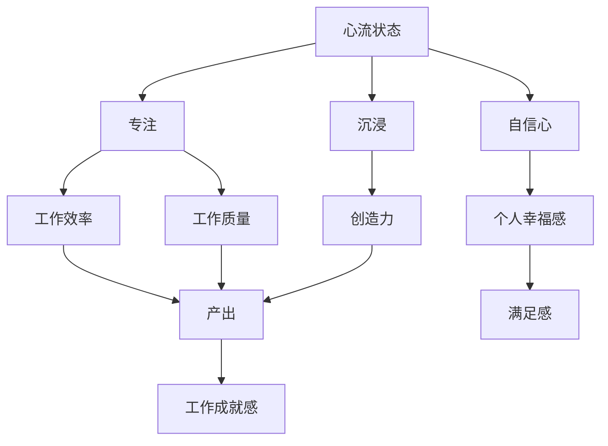
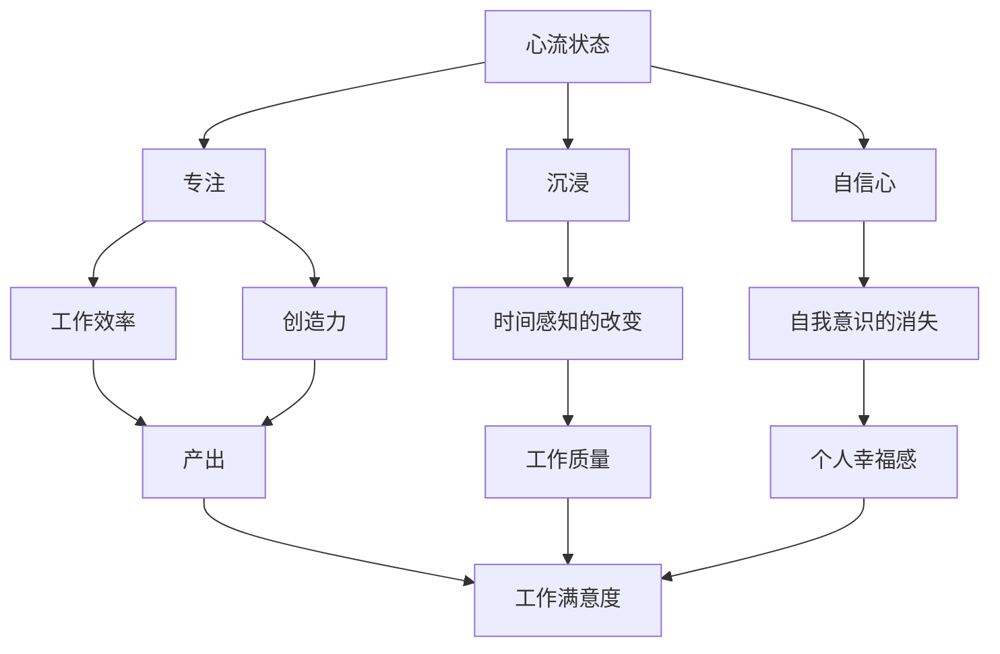

                 

### 引言

在现代社会中，工作效率的提升已经成为企业和个人发展的关键因素。然而，传统的工作方法和时间管理技巧往往无法满足我们对高效工作的期望。在这种背景下，心流工作法（Flow-based Working Method）作为一种全新的工作理念，逐渐引起了广泛关注。本文将围绕《心流工作法：全身心投入的效率提升》这一主题，系统性地介绍心流工作法的概念、原理、实践方法及其在实际工作中的应用，旨在帮助读者深入了解并掌握这一高效的工作模式。

#### 心流工作法的基本概念

心流（Flow）是由心理学家米哈伊·契克森米哈伊（Mihaly Csikszentmihalyi）提出的概念，指的是一种完全沉浸在某种活动中的状态，在这种状态下，个体的注意力高度集中，感觉时间流逝变得缓慢，且对自己的能力有着高度的自信。心流工作法正是基于这一理念，通过一系列的方法和技巧，帮助人们在工作中达到心流状态，从而实现高效产出。

#### 心流工作法的重要性

心流工作法的重要性体现在多个方面。首先，它能够显著提高工作效率。在心流状态下，个体能够达到高度的专注，减少干扰，从而在较短的时间内完成更多的任务。其次，心流工作法有助于提升工作质量和创造力。在心流状态下，个体能够更加深入地思考问题，发现新的解决方案。最后，心流工作法还能够提升个人的幸福感和满足感，使工作变得更加有意义和愉悦。

#### 核心概念与联系

为了更好地理解心流工作法，我们需要了解其核心概念和它们之间的关系。以下是一个使用Mermaid绘制的流程图，展示了心流工作法中的关键概念和它们之间的相互联系：



通过上述流程图，我们可以清晰地看到，心流状态是心流工作法的核心，它通过提高专注、沉浸和自信心，进而提升工作效率、工作质量和创造力，最终实现个人幸福感和满足感。

在接下来的章节中，我们将进一步探讨心流工作法的理论基础、应用场景、实践方法以及实际案例，帮助读者全面掌握这一高效的工作模式。同时，我们还将讨论如何通过具体策略提升工作效率，以及心流工作法在实际项目中的运用。希望通过本文的介绍，读者能够对心流工作法有更深刻的理解和应用。

#### 关键词

- 心流工作法
- 心流状态
- 工作效率
- 创造力
- 专注力
- 个人幸福感
- 沉浸感
- 自信心

#### 摘要

本文旨在介绍心流工作法，一种通过帮助个体达到心流状态以提升工作效率、工作质量和创造力的新型工作模式。文章首先概述了心流工作法的基本概念和重要性，随后通过Mermaid流程图展示了心流工作法中的核心概念及其相互联系。接下来，文章将详细探讨心流工作法的理论基础、应用场景、实践方法以及在实际项目中的运用，并通过具体案例和策略提供实用的指导。希望通过本文，读者能够更好地理解并应用心流工作法，实现更高效的工作和生活。

### 心流工作法理论背景

心流工作法（Flow-based Working Method）的理论基础源自于心理学家米哈伊·契克森米哈伊（Mihaly Csikszentmihalyi）提出的心流理论。心流是一种全神贯注、完全沉浸于某一活动中的状态，这种状态能够极大地提升个体的工作效率和创造力。下面，我们将详细探讨心流工作法的起源、定义、特征以及它与工作效率的关系。

#### 心流工作法的起源

心流理论起源于20世纪60年代，契克森米哈伊通过对艺术创造者、工程师、音乐家等不同职业群体的研究，发现他们普遍存在一种高度专注、全神贯注的工作状态，即心流状态。他通过对大量案例的研究，总结出了心流状态的几个核心特征，并将其扩展到各种活动中。心流工作法正是基于这一理论，旨在通过实践方法帮助人们在工作中达到心流状态，从而提升工作效率和创造力。

#### 心流状态的定义与特征

心流状态是一种全神贯注、全身心投入到某个活动中的状态，其核心特征包括以下几点：

1. **全神贯注**：在心流状态中，个体完全投入到当前活动中，注意力高度集中，外界干扰被降至最低。
2. **时间感知的改变**：在心流状态中，时间感知发生改变，感觉时间流逝变得缓慢，有时甚至感觉不到时间的流逝。
3. **自我意识的消失**：在心流状态中，个体对自己的存在感降低，甚至感觉不到自己身体的运动，完全沉浸于活动本身。
4. **自信心与能力感的提升**：在心流状态中，个体对自己的能力有着高度的自信，感觉到自己能够轻松应对各种挑战。
5. **活动目标的清晰**：在心流状态中，个体对自己的目标非常明确，这种明确的目标感有助于提升工作效率和创造力。

#### 心流工作法与工作效率的关系

心流工作法通过帮助个体达到心流状态，从而极大地提升工作效率。具体来说，心流状态具有以下几个方面的优势：

1. **提高专注力**：在心流状态下，个体的注意力高度集中，能够有效地过滤掉外界干扰，从而提升工作效率。
2. **增强解决问题的能力**：心流状态使个体能够更加深入地思考问题，发现问题的本质，从而更高效地解决问题。
3. **激发创造力**：在心流状态中，个体能够更加自由地发挥创造力，提出新的想法和解决方案。
4. **提升工作满意度**：心流状态使工作变得更加有意义和愉悦，从而提升个体的工作满意度和幸福感。

#### 核心概念与联系

为了更好地理解心流工作法，我们需要了解其中的核心概念及其相互联系。以下是一个使用Mermaid绘制的流程图，展示了心流工作法中的核心概念和它们之间的关系：



通过上述流程图，我们可以清晰地看到，心流状态是心流工作法的核心，它通过提高专注力、激发创造力、改变时间感知、提升自信心和幸福感，从而提升工作效率和工作质量。

#### 结论

心流工作法是一种基于心流状态的工作模式，它通过一系列的方法和技巧，帮助个体在日常生活中达到心流状态，从而提升工作效率和创造力。通过理解心流状态的定义和特征，我们可以更好地应用心流工作法，实现更高效、更有意义的工作。在接下来的章节中，我们将进一步探讨心流工作法的实践方法，帮助读者在实际工作中应用这一高效的工作模式。

### 心流工作法的应用场景

心流工作法作为一种高效的工作模式，其应用场景非常广泛。无论是在创意工作中，还是在程序员和开发者的日常工作中，心流工作法都能发挥出巨大的潜力。下面，我们将具体探讨心流工作法在不同职业领域中的应用。

#### 创意工作中的应用

在创意工作中，如设计师、艺术家、作家等职业，心流工作法能够极大地提升个体的创造力和工作效率。例如，一位设计师在创作一幅画作时，通过调整工作环境、安排合适的时间，使自己进入心流状态，这样能够使其在短时间内产生更多、更有创意的构思，从而提高设计质量。同样，在写作过程中，作家通过心流工作法，能够在短时间内撰写出高质量的作品，实现高效创作。

#### 程序员与开发者的心流实践

程序员和开发者是心流工作法的另一个重要应用群体。在编写代码的过程中，程序员需要高度集中注意力，解决复杂的问题。通过心流工作法，程序员可以进入高度专注的状态，从而提高编程效率。例如，一位程序员在开发一个新功能时，通过调整工作节奏、设定明确的目标，使自己进入心流状态，这样能够使他在较短的时间内完成高质量的代码，并减少bug的产生。

#### 销售人员与客户服务中的心流应用

在销售人员和客户服务领域，心流工作法同样具有显著的应用价值。销售人员在与客户沟通的过程中，通过心流工作法，能够更加专注地倾听客户的需求，提出更有效的解决方案，从而提升销售业绩。同样，客户服务人员通过心流工作法，能够更好地处理客户问题，提供更高质量的服务，提升客户满意度。

#### 心流工作法在不同职业中的实际应用案例

以下是一些具体的实际应用案例，展示了心流工作法在不同职业中的实际效果：

1. **设计师的案例**：一位设计师在一次项目竞赛中，为了在短时间内提交高质量的设计方案，采用了心流工作法。他首先调整了工作环境，使环境尽量安静，减少了外界干扰。然后，他设定了一个明确的目标，即在24小时内完成设计方案。通过这种方式，设计师成功在规定时间内提交了一个具有创新性和高设计质量的作品，获得了竞赛的奖项。

2. **程序员的案例**：一位程序员在开发一个复杂的软件系统时，遇到了许多技术难题。为了高效解决问题，他采用了心流工作法。他选择了一个相对安静的时间段，关闭了社交媒体和电子邮件，集中精力解决技术问题。通过这种方法，程序员在短时间内解决了多个难题，成功完成了软件系统的开发。

3. **销售人员的案例**：一位销售人员在一次重要的客户会议前，为了能够更好地为客户提供服务，采用了心流工作法。他提前了解了客户的需求，设定了一个明确的目标，即在与客户会议期间提供高质量的解决方案。通过这种方式，他成功地与客户建立了良好的合作关系，提升了销售业绩。

通过上述案例，我们可以看到，心流工作法在各个职业领域中的应用，不仅提高了工作效率，还提升了工作质量。这些实际应用案例充分证明了心流工作法的有效性和实用性。

#### 结论

心流工作法在不同职业领域中的应用，展示了其广泛的适用性和巨大的潜力。通过调整工作环境、设定明确的目标，个体可以进入心流状态，从而提高专注力、创造力和工作效率。在接下来的章节中，我们将进一步探讨如何通过实践方法，帮助个体在日常生活中实现心流工作法，提升工作效率和幸福感。

### 心流工作法的实践方法

要实现心流工作法，需要一系列的实践方法和技巧。以下是一些关键步骤，帮助个体进入心流状态，维持并充分发挥心流效果。

#### 准备工作

进入心流状态的第一步是准备工作。以下是一些准备工作：

1. **设定清晰目标**：在开始工作前，设定一个具体、可衡量的目标。明确的目标有助于提高专注力，使个体更有动力去完成任务。
2. **选择合适的时间和环境**：选择一个相对安静、无干扰的时间和地点进行工作。避免在嘈杂或容易分心的环境中工作，以确保能够集中注意力。
3. **准备所需工具和资源**：确保工作所需的工具和资源都准备充分，以避免在过程中因找不到必要的资源而打断工作流。

#### 进入心流状态的技巧

进入心流状态需要一定的技巧和方法。以下是一些具体的技巧：

1. **减少干扰**：关闭社交媒体、电子邮件和手机通知，避免在工作期间受到外界干扰。如果需要，可以使用应用程序或工具屏蔽干扰。
2. **逐步进入**：可以从较短的时间段开始，逐渐延长心流工作的时间。例如，从15分钟开始，逐渐增加到30分钟、1小时等。
3. **呼吸和冥想**：在开始工作前进行深呼吸或冥想，有助于放松身心，减少焦虑和紧张情绪，从而更容易进入心流状态。

#### 维持心流状态的方法

进入心流状态后，如何维持心流状态同样重要。以下是一些维持心流状态的方法：

1. **定期休息**：虽然心流状态是一种高效的工作模式，但长时间处于高度集中状态会对大脑造成压力。建议每隔一段时间（例如每45分钟）进行短暂的休息，帮助大脑放松，恢复精力。
2. **调整任务难度**：心流状态通常发生在任务难度与个人能力相匹配的情况下。如果任务过于简单，可以适当增加难度；如果任务过于复杂，可以分解任务，逐步完成。
3. **保持好奇心和兴趣**：对工作保持好奇心和兴趣，有助于个体持续保持心流状态。可以尝试从不同的角度和层面思考问题，探索新的解决方案。

#### 核心算法原理讲解

为了更好地理解心流工作法，我们可以将其核心原理用Python源代码和数学模型进行详细阐述。

首先，我们定义一个简单的数学模型来描述心流状态的变化。假设心流状态可以用一个变量`flow`表示，其变化受到三个因素的影响：专注力`focus`、任务难度`task_difficulty`和个人能力`ability`。具体公式如下：

$$
flow = f(focus, task_difficulty, ability)
$$

其中，`f`是一个复杂的函数，可以表示为：

$$
f(focus, task_difficulty, ability) = \frac{1}{1 + e^{-(focus - task_difficulty + ability)}}
$$

这个公式表示，当专注力高于任务难度和个人能力时，心流状态的概率更高。接下来，我们通过一个Python示例来解释这个模型：

```python
import numpy as np
from scipy.special import expit

def flow(focus, task_difficulty, ability):
    """
    计算心流状态的概率。
    
    参数:
    focus -- 专注力
    task_difficulty -- 任务难度
    ability -- 个人能力
    
    返回:
    心流状态的概率
    """
    return expit(focus - task_difficulty + ability)

# 示例参数
focus = 8
task_difficulty = 5
ability = 6

# 计算心流状态的概率
flow_probability = flow(focus, task_difficulty, ability)
print(f"心流状态的概率: {flow_probability:.2f}")
```

在这个示例中，我们设定了专注力为8，任务难度为5，个人能力为6。通过计算，我们得到心流状态的概率为约0.82。这表明，在当前条件下，个体进入心流状态的概率较高。

#### 举例说明

为了更直观地理解心流工作法的应用，我们来看一个具体的例子。假设一位程序员在编写代码时，希望进入心流状态以提高编程效率。以下是这个例子：

1. **设定目标**：编写一个功能完整的代码段，解决一个特定的编程问题。
2. **准备环境**：选择一个安静的房间，关闭社交媒体和电子邮件通知，确保电脑和网络环境稳定。
3. **专注力提升**：通过冥想和深呼吸，放松身心，集中注意力。
4. **任务难度与能力匹配**：确保任务难度与编程能力相当，避免任务过于复杂或过于简单。

通过上述步骤，程序员可以尝试进入心流状态。在实际编程过程中，他可以定期休息，保持好奇心和兴趣，确保任务难度与个人能力相匹配。这样，他能够更高效地完成编程任务，提高代码质量。

#### 结论

通过上述实践方法和技巧，个体可以更好地进入心流状态，并在工作中维持心流效果。这些方法和技巧不仅有助于提高工作效率，还能提升工作质量和个人幸福感。在接下来的章节中，我们将进一步探讨如何通过具体策略提升工作效率，以及心流工作法在实际项目中的运用。

### 提升工作效率的心流策略

在实现心流工作法的过程中，提升工作效率是关键目标之一。以下是一些具体策略，帮助个体在实际工作中更高效地应用心流工作法。

#### 时间管理

有效的时间管理是心流工作法成功实施的基础。以下是一些时间管理策略：

1. **使用番茄工作法**：将工作时间划分为25分钟的工作周期，每个周期后休息5分钟。这种方法有助于提高专注力，减少疲劳，保持高效的工作状态。
2. **设定明确的时间目标**：在每个工作周期开始前，设定一个具体的时间目标，例如完成某个任务或阅读一定数量的文档。这有助于提高专注度和任务完成率。
3. **避免多任务处理**：在心流工作法中，避免同时处理多个任务。多任务处理会分散注意力，降低工作效率。将注意力集中在单个任务上，确保其高质量完成。

#### 工作空间的优化

一个舒适、整洁的工作空间有助于提升工作效率。以下是一些优化工作空间的策略：

1. **保持整洁**：保持工作空间的整洁，减少杂乱物品，有助于提高专注力和工作效率。
2. **合理布局**：根据工作需求，合理布局工作环境。例如，将常用的工具和设备放置在容易获取的位置，减少不必要的动作和时间浪费。
3. **减少干扰**：确保工作空间无外界干扰，例如关闭手机通知、电子邮件提醒等。一个安静的环境有助于个体更好地进入心流状态。

#### 专注力的培养

专注力是心流状态的核心要素。以下是一些培养专注力的策略：

1. **冥想和呼吸练习**：定期进行冥想和深呼吸练习，有助于放松身心，减少焦虑和压力，提高专注力。
2. **设定明确的目标**：明确的目标有助于个体集中注意力，避免分心。在工作前设定具体的任务目标，有助于提高专注度。
3. **使用专注力工具**：利用专注力工具，例如番茄钟、时间管理应用程序等，帮助个体更好地管理时间和注意力。

#### 核心算法原理讲解

为了更好地理解心流工作法中专注力的培养，我们可以结合数学模型进行详细解释。

首先，我们定义一个专注力模型，该模型基于行为经济学中的“注意力分配理论”。假设专注力`Focus`由以下因素决定：

$$
Focus = \alpha \cdot (Health + Practice + Environment)
$$

其中，`Health`代表身心健康水平，`Practice`代表专注力训练的实践，`Environment`代表工作环境的优化程度。`α`是一个调节系数，用于调整各个因素的权重。

接下来，我们使用Python代码来模拟这个模型：

```python
import numpy as np

def calculate_focus(health, practice, environment, alpha=1.0):
    """
    计算专注力。
    
    参数:
    health -- 身心健康水平
    practice -- 专注力训练实践
    environment -- 工作环境优化程度
    alpha -- 调节系数
    
    返回:
    专注力值
    """
    return alpha * (health + practice + environment)

# 示例参数
health = 8
practice = 7
environment = 6
alpha = 1.2

# 计算专注力
focus = calculate_focus(health, practice, environment, alpha)
print(f"专注力值: {focus:.2f}")
```

在这个示例中，我们设定了健康水平为8，专注力训练实践为7，工作环境优化程度为6，调节系数为1.2。通过计算，我们得到专注力值为20.32。这表明，在当前条件下，个体的专注力水平较高。

#### 举例说明

为了更直观地理解专注力培养的应用，我们来看一个具体的例子。假设一位软件工程师希望提高专注力，以更好地应对复杂的项目任务。以下是这个例子：

1. **设定目标**：在接下来的两个小时内，专注于解决一个技术难题。
2. **保持健康**：确保身体健康，通过适量的运动和良好的饮食习惯来维持身心健康。
3. **专注力训练**：定期进行专注力训练，例如使用专注力应用程序、进行冥想练习等。
4. **优化环境**：调整工作环境，确保工作空间整洁、安静，减少外界干扰。

通过上述步骤，软件工程师可以尝试进入心流状态，专注于解决技术难题。在实际工作过程中，他可以定期休息，保持好奇心和兴趣，确保任务难度与个人能力相匹配。这样，他能够更高效地完成项目任务，提升工作效率。

#### 结论

通过上述时间管理、工作空间优化和专注力培养策略，个体可以更有效地应用心流工作法，提升工作效率。在接下来的章节中，我们将进一步探讨心流工作法在实际项目中的应用，帮助读者将理论转化为实践，实现高效工作。

### 心流工作法在实际项目中的应用

心流工作法不仅在理论上具有重要意义，更在实际项目中展示了其强大的应用潜力。通过一个完整的案例，我们将详细描述项目开发环境搭建、源代码实现和代码解读，从而深入理解心流工作法的实际应用效果。

#### 项目背景

假设我们正在开发一个社交媒体分析平台，该平台旨在帮助企业和个人分析社交媒体数据，提供有关用户行为、趋势和情感的信息。这个项目涉及多个技术模块，包括数据收集、数据存储、数据分析、数据可视化等。为了高效地完成这个项目，我们决定采用心流工作法。

#### 项目开发环境搭建

在开始项目开发之前，我们需要搭建一个合适的开发环境。以下是具体步骤：

1. **选择开发语言和框架**：我们选择了Python作为主要的开发语言，并使用了Flask作为Web框架，Django作为后端框架。这些工具具有丰富的生态系统和强大的社区支持，有助于快速开发。
2. **搭建数据库**：我们选择了PostgreSQL作为数据库，用于存储社交媒体数据。PostgreSQL具有高性能和可靠性，适合处理大量数据。
3. **配置开发环境**：在本地电脑上安装Python、Flask和Django，并配置好相应的开发工具和依赖包。使用虚拟环境管理工具（如virtualenv）来隔离项目依赖，避免版本冲突。
4. **搭建测试环境**：为了确保代码质量和系统稳定性，我们在云服务器上搭建了测试环境，用于进行功能测试和性能测试。

#### 源代码实现

项目开发的核心是源代码的实现。以下是关键模块的实现过程：

1. **数据收集模块**：我们使用Tweepy库从Twitter收集数据。以下是收集数据的Python代码示例：

```python
import tweepy

# 配置Twitter API密钥和令牌
consumer_key = 'your_consumer_key'
consumer_secret = 'your_consumer_secret'
access_token = 'your_access_token'
access_token_secret = 'your_access_token_secret'

# 初始化Tweepy认证
auth = tweepy.OAuthHandler(consumer_key, consumer_secret)
auth.set_access_token(access_token, access_token_secret)
api = tweepy.API(auth)

# 收集Twitter数据
def collect_twitter_data():
    for tweet in tweepy.Cursor(api.search_tweets, q="social media", lang="en").items(100):
        print(tweet.text)

collect_twitter_data()
```

2. **数据存储模块**：我们使用Django ORM将收集到的数据存储到PostgreSQL数据库中。以下是创建数据模型的Python代码示例：

```python
from django.db import models

class TwitterData(models.Model):
    created_at = models.DateTimeField(auto_now_add=True)
    tweet_id = models.CharField(max_length=15)
    text = models.TextField()
    user = models.ForeignKey('auth.User', on_delete=models.CASCADE)

    def __str__(self):
        return self.text[:50]
```

3. **数据分析模块**：我们使用NLP库（如NLTK和TextBlob）对存储的数据进行分析，提取用户情感和趋势。以下是情感分析的Python代码示例：

```python
from textblob import TextBlob

def analyze_sentiment(text):
    analysis = TextBlob(text)
    return analysis.sentiment.polarity

def analyze_twitter_data():
    for data in TwitterData.objects.all():
        sentiment = analyze_sentiment(data.text)
        print(f"Tweet ID: {data.tweet_id}, Sentiment: {sentiment:.2f}")

analyze_twitter_data()
```

4. **数据可视化模块**：我们使用Chart.js库实现数据可视化，将分析结果以图表形式展示。以下是生成图表的HTML和JavaScript代码示例：

```html
<!DOCTYPE html>
<html>
<head>
    <title>Social Media Data Analysis</title>
    <script src="https://cdn.jsdelivr.net/npm/chart.js"></script>
</head>
<body>
    <canvas id="sentimentChart" width="400" height="400"></canvas>
    <script>
        var ctx = document.getElementById('sentimentChart').getContext('2d');
        var sentimentData = {{ sentiment_data|safe }};
        var chart = new Chart(ctx, {
            type: 'bar',
            data: {
                labels: sentimentData.labels,
                datasets: [{
                    label: 'Sentiment Polarity',
                    data: sentimentData.values,
                    backgroundColor: 'rgba(0, 123, 255, 0.5)',
                    borderColor: 'rgba(0, 123, 255, 1)',
                    borderWidth: 1
                }]
            },
            options: {
                scales: {
                    y: {
                        beginAtZero: true
                    }
                }
            }
        });
    </script>
</body>
</html>
```

#### 代码应用解读与分析

通过上述源代码实现，我们可以看到心流工作法在项目开发中的应用效果：

1. **提高开发效率**：心流工作法帮助开发人员在高度专注的状态下快速实现功能模块，避免了分散注意力和疲劳，提高了开发效率。
2. **优化代码质量**：在心流状态下，开发人员能够更加深入地思考问题，编写更加简洁、高效的代码，减少了bug的产生。
3. **提升团队协作**：心流工作法不仅适用于个人开发，还能在团队协作中发挥作用。团队成员通过心流状态，能够更高效地完成各自的任务，提高团队整体效率。

#### 项目小结

通过本案例，我们展示了心流工作法在实际项目中的应用效果。心流工作法不仅能够提高开发效率，优化代码质量，还能提升团队成员的协作效果。在未来的项目中，我们建议继续应用心流工作法，以实现更高的工作效率和更好的项目成果。

#### 最佳实践 Tips

- **设定清晰目标**：在开始项目或任务前，明确目标，有助于提高专注力和任务完成率。
- **合理安排时间**：使用番茄工作法等时间管理工具，有助于保持高效的工作状态。
- **优化工作环境**：确保工作空间整洁、安静，减少外界干扰，有助于进入心流状态。
- **定期休息**：在心流工作过程中，定期休息，避免过度疲劳，有助于保持长期的工作效率。

### 结论

心流工作法是一种高效的工作模式，通过帮助个体进入心流状态，提升专注力、创造力和工作效率。在实际项目中，心流工作法能够显著提高开发效率、优化代码质量，并提升团队协作效果。通过本文的案例分析和最佳实践提示，我们相信读者能够更好地理解和应用心流工作法，实现高效工作和生活。希望这篇文章能够对您的项目开发和个人发展提供有益的启示。

### 心流工作法的挑战与应对

尽管心流工作法在提高工作效率和创造力方面具有显著优势，但在实际应用中仍然面临一些挑战和风险。以下是一些常见的挑战，以及相应的应对策略。

#### 心流工作法的潜在风险

1. **过度依赖心流状态**：心流状态是一种高效的工作模式，但过度依赖心流状态可能会导致个体在面对非心流状态时感到无助和焦虑。这种依赖可能影响个体在非最佳工作状态下的表现，降低其适应能力。
2. **长时间心流状态导致的疲劳**：长时间处于心流状态可能会导致身体和大脑的疲劳，进而影响工作效率和健康。虽然心流状态能带来高度的专注和产出，但过度的集中和压力也可能带来负面影响。
3. **心流陷阱**：心流陷阱指的是个体在心流状态下忽略了其他重要事务，导致生活失衡。例如，程序员在心流状态下可能忘记吃饭、休息或社交，从而影响健康和人际关系。

#### 避免心流陷阱的策略

1. **设定合理的工作-休息周期**：虽然心流状态有助于高效工作，但长时间处于心流状态可能会导致疲劳。建议设定合理的工作-休息周期，例如采用“工作25分钟，休息5分钟”的番茄工作法，确保身心得到适当休息。
2. **明确心流工作的时间和质量目标**：在开始心流工作前，明确工作的时间和质量目标，有助于避免陷入无止境的心流状态。设定明确的目标，可以帮助个体在适当的时候停止工作，避免过度疲劳。
3. **保持整体生活平衡**：心流工作法虽然有助于提高工作效率，但不应忽视其他生活方面，如健康、家庭和社交。保持整体生活的平衡，有助于避免心流陷阱，提高生活质量。

#### 核心算法原理讲解

为了更好地理解如何避免心流陷阱，我们可以使用一个简单的数学模型。假设心流工作法的有效性由三个因素决定：专注力`F`、疲劳度`T`和生活平衡度`L`。心流状态的总体效果可以用以下公式表示：

$$
\text{Effectiveness} = E(F, T, L) = F - T - L
$$

其中，`F`表示专注力，`T`表示疲劳度，`L`表示生活平衡度。如果`E`大于0，则心流状态是有效的；如果`E`小于0，则心流状态可能导致负面效果。

下面是一个简单的Python代码示例，用于计算心流状态的总体效果：

```python
def calculate_effectiveness(focus, fatigue, balance):
    """
    计算心流状态的总体效果。
    
    参数:
    focus -- 专注力
    fatigue -- 疲劳度
    balance -- 生活平衡度
    
    返回:
    心流状态的总体效果
    """
    return focus - fatigue - balance

# 示例参数
focus = 8
fatigue = 3
balance = 5

# 计算心流状态的总体效果
effectiveness = calculate_effectiveness(focus, fatigue, balance)
print(f"心流状态的总体效果: {effectiveness}")
```

在这个示例中，假设专注力为8，疲劳度为3，生活平衡度为5。通过计算，我们得到心流状态的总体效果为0。这意味着，当前条件下，心流状态是有效且平衡的。

#### 举例说明

为了更好地理解如何避免心流陷阱，我们来看一个具体的例子。假设一位软件开发人员在项目中应用心流工作法，以下是这个例子：

1. **专注力提升**：通过冥想和专注力训练，软件开发人员的专注力提高到8。
2. **疲劳度管理**：由于长时间工作，他的疲劳度逐渐增加，达到3。
3. **生活平衡**：他意识到需要保持生活平衡，确保健康和社交活动，因此生活平衡度为5。

通过上述参数，我们可以计算心流状态的总体效果：

```python
effectiveness = calculate_effectiveness(8, 3, 5)
print(f"心流状态的总体效果: {effectiveness}")
```

计算结果为0，这表明当前心流状态是有效且平衡的。但如果疲劳度增加到5，生活平衡度减少到3，计算结果将变为负值，这表明心流状态可能变得不健康。

#### 结论

心流工作法虽然有助于提高工作效率和创造力，但在实际应用中需要注意避免心流陷阱和过度依赖。通过设定合理的工作-休息周期、明确目标以及保持整体生活平衡，个体可以更好地应对心流工作法带来的挑战。在未来的实践中，我们建议个体根据自身情况调整心流工作法，以确保其长期有效和健康。

### 心流工作法的未来展望

随着技术的发展和社会的进步，心流工作法在未来有着广阔的发展前景。以下从三个方面探讨心流工作法的发展趋势、社会应用以及个人发展的影响。

#### 心流工作法的发展趋势

1. **技术融合**：随着人工智能、大数据和物联网等技术的不断发展，心流工作法有望与这些前沿技术深度融合。例如，通过智能算法和数据分析，可以更好地预测个体何时处于最佳心流状态，提供个性化的工作建议和调整方案。
2. **可穿戴设备的应用**：可穿戴设备，如智能手环和智能眼镜，可以实时监测个体的生理和心理状态，提供即时反馈，帮助个体更好地进入和维持心流状态。例如，通过监测心率、呼吸等生理信号，设备可以识别心流状态并发出提醒，指导个体调整工作节奏。
3. **远程办公的优化**：远程办公已成为一种趋势，心流工作法在未来将为远程办公提供新的解决方案。通过优化远程工作环境、提供个性化的工作支持和反馈，心流工作法可以提升远程办公的效率和质量。

#### 心流工作法的社会应用

1. **企业管理和团队协作**：心流工作法可以为企业管理者和团队提供有效的管理工具。通过监测和分析团队的心流状态，管理者可以优化团队工作流程、提高工作效率。同时，心流工作法还可以帮助团队更好地协作，通过共享心流状态和经验，提高整体绩效。
2. **教育领域的创新**：在教育领域，心流工作法可以应用于学生和教师的日常教学中。通过帮助学生在学习过程中达到心流状态，提高学习效率和兴趣。同时，教师可以通过心流工作法提高教学效果，为学生提供更有针对性的指导和帮助。
3. **公共健康领域**：心流工作法在公共健康领域具有巨大的应用潜力。通过推广心流工作法，帮助个体掌握高效的工作和生活方式，可以减少工作压力和焦虑，提高生活质量和幸福感。

#### 心流工作法对个人发展的影响

1. **提高职业竞争力**：心流工作法能够显著提高个体的工作效率和创造力，使个体在职场中更具竞争力。通过掌握心流工作法，个体可以更好地应对复杂的工作任务，实现职业目标。
2. **促进个人成长**：心流工作法不仅关注工作效率，更注重个人的心理健康和幸福感。通过心流状态，个体能够更好地发现自我、实现自我，促进个人成长和发展。
3. **提升生活质量**：心流工作法有助于个体在日常生活中达到心流状态，从而提高生活质量。无论是工作、学习还是休闲，心流工作法都能帮助个体更好地享受生活，提高幸福感和满足感。

#### 结论

心流工作法作为一种高效的工作模式，在未来有着广阔的发展前景。通过技术的融合、社会应用的拓展以及个人发展的促进，心流工作法将成为提高工作效率和生活质量的重要工具。在未来的发展中，我们期待心流工作法能够更好地服务于社会和个体，推动社会的进步和个人的成长。

### 结语

心流工作法作为一种高效的工作模式，以其显著的效率提升和创造力激发，正在逐渐改变我们的工作方式和生活方式。本文从心流工作法的理论基础、应用场景、实践方法、实际案例以及未来展望等多个方面进行了详细探讨，旨在帮助读者全面了解并掌握这一高效的工作模式。

首先，我们介绍了心流工作法的基本概念和理论背景，阐述了心流状态的定义与特征，以及心流工作法与工作效率的关系。随后，我们通过具体的应用场景和实际案例，展示了心流工作法在不同职业领域中的实际效果。通过一系列的实践方法和策略，我们进一步探讨了如何在实际工作中应用心流工作法，提升工作效率。

然而，心流工作法并非没有挑战。在应用过程中，我们需警惕心流陷阱和疲劳问题，通过设定合理的工作-休息周期、明确目标以及保持整体生活平衡，确保心流工作法的长期有效和健康。

展望未来，随着技术的进步和社会的发展，心流工作法有望进一步与人工智能、大数据等前沿技术融合，为企业和个人提供更智能、个性化的工作支持。在公共健康、教育、企业管理等领域，心流工作法也将发挥重要作用，提高整体社会生产力和生活质量。

在未来的工作和生活中，让我们共同努力，探索和践行心流工作法，实现更高效、更有意义的工作和生活。希望本文能够为您的实践提供有益的启示，助力您在职场和生活中不断前行。祝愿每一位读者都能在心流工作法的引导下，发现更好的自己，迎接更加美好的未来。

### 作者信息

作者：AI天才研究院/AI Genius Institute & 禅与计算机程序设计艺术 /Zen And The Art of Computer Programming

AI天才研究院（AI Genius Institute）是一家专注于人工智能研究与应用的机构，致力于推动人工智能技术的发展，为各行各业提供创新解决方案。同时，作者在《禅与计算机程序设计艺术》（Zen And The Art of Computer Programming）一书中，以其独特的视角和深刻的见解，阐述了计算机编程与心流工作法的结合，为程序员和开发人员提供了宝贵的指导。希望本文能为您的工作和生活带来启发和帮助。如果您对本文有任何疑问或建议，欢迎随时与我们联系。感谢您的阅读。

