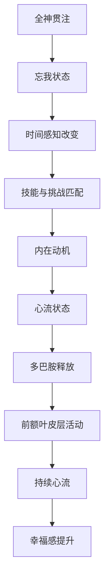

                 

# 心流状态诱导技术：优化工作体验的科学方法

## 关键词
- 心流状态
- 工作体验
- 专注技巧
- 生理和心理干预
- 环境设计
- 提高工作效率

## 摘要
本文将深入探讨心流状态的概念、重要性及其在优化工作体验中的应用。通过理论基础、实践方法、科学优化和案例分析，本文旨在提供一套全面的科学方法，帮助读者在工作和生活中更好地诱导和利用心流状态，从而实现高效、愉悦的工作体验。

---

## 引言

### 1.1 心流状态的定义与特征

心流状态，又称流畅体验，是一种全神贯注、高度投入、时间感知失真的心理状态。在这个状态下，个体完全沉浸在活动之中，忘记了时间的流逝，自我意识降低，专注力达到极致。心流状态最初由心理学家米哈里·契克森米哈伊（Mihaly Csikszentmihalyi）在20世纪80年代提出，并在他的著作《心流：最优体验的心理学》中进行了详细的阐述。

心流状态的特征包括：

- **全神贯注**：个体专注于当前活动，排除外界干扰。
- **忘我状态**：个体对自我和周围环境的感知减弱。
- **时间感知改变**：活动中的时间似乎变得更快或更慢。
- **技能与挑战匹配**：活动既有挑战性，又能提供足够的技能支持。
- **内在动机**：个体因活动本身而感到快乐和满足。

### 1.2 心流状态的重要性

心流状态对于个人成长和工作表现具有重要意义。首先，心流状态能够提高个人的专注力和效率，使个体在短时间内完成大量工作。其次，心流状态有助于提升创造力和问题解决能力，使个体在面对挑战时能够产生创新的解决方案。此外，心流状态还能提高个人的幸福感和生活满意度，使个体在工作和生活中感受到更多的乐趣和满足。

### 1.3 本书的目的与结构

本书旨在通过理论与实践的结合，为读者提供一套完整的诱导心流状态的科学方法。具体目的如下：

- 探索心流状态的理论基础，包括历史背景、心理学原理和神经科学基础。
- 介绍和实践方法，帮助读者在工作和生活中更容易地进入心流状态。
- 分析心流状态的优化策略，包括生理和心理干预技术。
- 通过案例分析和项目实战，展示心流状态的实际应用效果。

全书共分为七章，包括引言、理论基础、实践方法、科学优化、工作应用、案例分析和结论展望。通过逐章阅读，读者可以系统地了解心流状态的相关知识，掌握有效的心流状态诱导技术，并在实际工作中应用这些技术，提高工作效率和幸福感。

---

## 心流状态的理论基础

### 2.1 心流状态的历史背景

心流状态的概念起源于20世纪80年代，由心理学家米哈里·契克森米哈伊在研究中发现。契克森米哈伊通过对数百名不同领域的高手进行访谈，发现他们在达到高峰表现时，都会经历一种高度投入、全神贯注的心理状态。这一现象引起了他的兴趣，并进一步深入研究。

契克森米哈伊在他的著作《心流：最优体验的心理学》中，详细阐述了心流状态的概念、特征和重要性。他提出了心流状态的五大要素：全神贯注、忘我状态、时间感知改变、技能与挑战匹配和内在动机。这些要素构成了心流状态的核心理论框架。

### 2.2 心理学原理与心流状态

心流状态与多种心理学原理密切相关。首先，心流状态与自我决定理论（Self-Determination Theory，简称SDT）有着紧密的联系。自我决定理论强调个体的自主性、能力和关联感，这些因素共同作用于心流状态的产生。在自我决定理论的框架下，心流状态被视为一种内在动机驱动的体验。

此外，心流状态也与焦虑和成就的关系密切相关。契克森米哈伊指出，适度的焦虑和挑战能够促进心流状态的产生，而过高或过低的焦虑和挑战都会阻碍心流状态的形成。这一观点与焦虑管理理论（Anxiety Management Theory）和成就动机理论（Achievement Motivation Theory）相呼应。

### 2.3 神经科学基础与心流状态

神经科学为心流状态提供了物质基础和机制解释。研究发现，心流状态与大脑中的多巴胺（Dopamine）水平密切相关。多巴胺是一种神经递质，与奖励和快感感受有关。在心流状态下，大脑中的多巴胺水平显著升高，导致个体感受到强烈的快乐和满足感。

此外，心流状态也与大脑的前额叶皮层（Prefrontal Cortex）活动有关。前额叶皮层是大脑中负责决策、规划和执行的高级认知功能区域。在心流状态下，前额叶皮层的活动增强，有助于个体保持高度的专注力和注意力集中。

### 2.4 心流状态的Mermaid流程图

为了更直观地理解心流状态的心理机制，我们可以使用Mermaid流程图来描述心流状态的各个要素及其相互关系。以下是一个简化的Mermaid流程图示例：

在这个流程图中，全神贯注、忘我状态、时间感知改变、技能与挑战匹配和内在动机是心流状态的核心要素，它们相互作用，共同构成了心流状态的整体体验。

---

## 诱导心流状态的实践方法

### 3.1 工作策略与心流状态

要诱导心流状态，首先需要制定合理的工作策略。以下是一些实用的工作策略：

- **设定明确的目标**：明确的目标能够提供清晰的行动方向，减少决策负担。例如，可以将长期目标分解为短期目标，每完成一个短期目标，都会带来心流体验的提升。

- **创造合适的挑战**：挑战性适中且具有挑战性的任务能够激发心流状态。适度的挑战能够促使个体充分发挥潜力，而过高或过低的挑战都会影响心流状态的产生。

- **保持持续的兴趣**：兴趣是维持心流状态的重要因素。可以通过学习新技能、探索新领域等方式，保持对工作的兴趣和热情。

### 3.2 时间管理与心流状态

时间管理对于诱导心流状态具有重要意义。以下是一些有效的时间管理策略：

- **番茄工作法**：将工作时间分为25分钟的工作周期，每个周期后休息5分钟。这种方法有助于提高专注力，减少疲劳感，从而更容易进入心流状态。

- **延迟满足感**：学会推迟即时的满足感，专注于当前的工作任务，有助于保持心流状态。

- **减少干扰**：在工作过程中，尽量避免外界的干扰。可以通过关闭不必要的社交媒体通知、使用耳机屏蔽噪音等方式，创造一个专注的工作环境。

### 3.3 专注技巧与心流状态

专注技巧是诱导心流状态的关键。以下是一些实用的专注技巧：

- **正念冥想**：通过正念冥想，可以培养专注力，提高心流状态的频率和持续时间。冥想的过程有助于个体从杂念中解脱出来，专注于当下的任务。

- **深呼吸练习**：深呼吸可以降低焦虑水平，提高专注力。在开始工作之前，进行几次深呼吸，有助于调整心态，进入心流状态。

- **环境优化**：创造一个有利于专注的工作环境。可以选择一个安静、舒适的角落，保持工作区域的整洁和有序，减少干扰。

### 3.4 心流状态的实践案例分析

以下是一些实践心流状态的案例分析：

- **案例一：设计师的专注体验**：一位设计师在完成一个重要项目时，通过设定明确的目标、创造合适的挑战和保持持续的兴趣，成功地进入了心流状态。他在心流状态下完成了高质量的设计作品，获得了客户的认可和赞赏。

- **案例二：程序员的编程心流**：一位程序员通过使用番茄工作法和深呼吸练习，成功地提高了编程时的专注力。在心流状态下，他能够在短时间内完成复杂的编程任务，提高了工作效率。

- **案例三：企业领导者的决策心流**：一位企业领导者通过正念冥想和目标设定，提高了在决策过程中的专注力和创造力。在心流状态下，他能够做出更加明智的决策，推动企业的发展。

这些案例表明，通过合理的工作策略、时间管理和专注技巧，个体可以在工作和生活中更容易地进入心流状态，提高工作效率和幸福感。

---

## 心流状态的科学优化

### 4.1 生理干预技术与心流状态

生理干预技术是优化心流状态的重要手段。以下是一些常见的生理干预技术：

- **舒适的工作环境**：保持适宜的温度、湿度和空气质量，有助于提高个体的舒适度，减少疲劳感，从而更容易进入心流状态。

- **适当的光线和温度**：自然光线和适宜的温度有助于提高个体的注意力和专注力。在光线较弱或过热的环境中，个体容易感到疲劳和分心。

- **健康饮食与运动**：均衡的饮食和适量的运动有助于维持身体和心理的健康。健康的身体状态能够提高个体的精神集中力和工作效率。

### 4.2 心理干预技术与心流状态

心理干预技术是优化心流状态的另一个重要方面。以下是一些常用的心理干预技术：

- **正念冥想**：正念冥想有助于培养专注力和心理韧性，减少压力和焦虑。通过正念冥想，个体能够更好地调整心态，进入心流状态。

- **自我反思与目标设定**：通过自我反思，个体可以更好地了解自己的需求、兴趣和价值观，从而设定更有意义和挑战性的目标。明确的目标有助于提高心流状态的频率和持续时间。

- **克服负面情绪**：负面情绪如焦虑、压力和挫败感会干扰心流状态的产生。通过心理干预技术，个体可以学会应对这些负面情绪，保持积极的心态，从而更容易进入心流状态。

### 4.3 环境设计对心流状态的影响

环境设计是优化心流状态的重要因素。以下是一些关于环境设计对心流状态的影响：

- **空间布局**：合理的工作空间布局有助于提高个体的舒适度和专注力。一个整洁、有序的工作环境能够减少干扰，使个体更容易进入心流状态。

- **工作场所的装饰**：适当的工作场所装饰可以提升个体的情绪和工作氛围。例如，摆放一些绿植、艺术作品或舒适的座椅，有助于创造一个更加放松和愉悦的工作环境。

- **声音与视觉设计**：适当的声音和视觉设计有助于创造一个有利于专注的工作环境。例如，使用耳机屏蔽噪音、调整屏幕亮度和对比度等，都有助于提高个体的专注力和心流状态。

通过优化生理和心理干预技术，以及改善环境设计，个体可以更好地诱导和维持心流状态，从而提高工作效率和幸福感。

---

## 心流状态在工作中的应用

### 5.1 工作环境中的心流状态设计

为了在工作环境中更好地诱导心流状态，以下是一些设计建议：

- **空间布局**：设计一个开放式的工作空间，使团队成员能够自由交流和协作。同时，为个体提供独立的工作区域，以减少干扰。

- **家具选择**：选择舒适、可调节的家具，如可调节高度的办公椅和桌面，以适应不同的工作需求。

- **自然光线**：充分利用自然光线，保持工作区域的光线充足。自然光线有助于提高个体的注意力和心情。

- **通风和空气质量**：确保工作环境的通风良好，保持空气新鲜。空气质量的提升有助于提高个体的舒适度和专注力。

### 5.2 提高工作效率的心流状态策略

以下是一些策略，帮助个体在工作过程中提高心流状态，进而提高工作效率：

- **目标设定**：明确工作目标，并将长期目标分解为短期目标。每完成一个短期目标，都会带来心流体验的提升。

- **任务优先级**：根据任务的紧急程度和重要性，合理安排工作计划。优先处理重要且紧急的任务，以减少拖延和压力。

- **专注技巧**：运用专注技巧，如正念冥想、深呼吸练习等，提高专注力。在专注状态下，个体能够更高效地完成任务。

- **休息与恢复**：合理安排休息时间，避免长时间的工作疲劳。短暂的休息有助于恢复精力，提高工作效率。

### 5.3 心流状态在工作实践中的应用案例

以下是一些心流状态在工作实践中的应用案例：

- **案例一：软件开发团队**：某软件开发团队通过设定明确的目标、优化工作环境和运用专注技巧，成功地提高了心流状态的频率和持续时间。团队成员在心流状态下，能够更高效地开发软件，提高了项目交付速度。

- **案例二：产品设计团队**：某产品设计团队通过优化工作环境、设定合理的目标和运用心理干预技术，成功地提高了心流状态的频率和持续时间。团队成员在心流状态下，能够更快速地产生创意，提高了产品的质量。

- **案例三：销售团队**：某销售团队通过设定明确的目标、合理安排工作和运用专注技巧，成功地提高了心流状态的频率和持续时间。团队成员在心流状态下，能够更有效地与客户沟通，提高了销售额。

这些案例表明，通过优化工作环境和运用心流状态策略，团队可以显著提高工作效率和业绩。

---

## 案例分析

### 6.1 案例一：提高编程效率的心流实践

某知名科技公司的程序员小张，在工作中面临着巨大的压力和繁重的任务。为了提高编程效率，他开始尝试利用心流状态进行工作。以下是他的心流实践过程：

1. **目标设定**：小张首先明确了自己的编程目标，包括需要完成的任务和期望达到的效果。他将长期目标分解为短期目标，如每天完成一定的代码量或解决某个难题。

2. **优化工作环境**：小张调整了自己的工作环境，包括调整光线、通风和噪音控制。他选择了一个安静的房间，关闭了不必要的电子设备，确保工作环境的舒适和安静。

3. **专注技巧**：小张开始练习正念冥想，每天早晨进行几分钟的冥想，以调整自己的心态。在工作过程中，他也会定期进行深呼吸练习，以提高专注力。

4. **任务管理**：小张使用番茄工作法进行任务管理，将工作时间分为25分钟的工作周期，每个周期后休息5分钟。这种方法帮助他提高了专注力，避免了疲劳。

5. **反馈与调整**：小张在完成任务后，会进行反思和总结。他分析自己在心流状态下的表现，找出可以改进的地方。通过不断调整，他逐渐找到了最适合自己进入心流状态的方法。

通过这些实践，小张的编程效率显著提高。他在心流状态下，能够更快速地完成代码，且代码质量更高。他的工作表现得到了领导和同事的认可，也为公司带来了更大的价值。

### 6.2 案例二：创意工作中的心流状态引导

某广告公司的创意总监小李，负责团队创意工作的指导和管理。为了提高团队的工作效率和创造力，他开始尝试引导团队成员进入心流状态。以下是他的心流引导过程：

1. **目标明确**：小李明确团队的目标，包括创意方案的产出、市场效果和客户满意度。他通过设定短期目标，如每周完成一定数量的创意提案，激励团队成员不断进步。

2. **工作环境优化**：小李关注工作环境的优化，为团队提供了一个舒适、安静、宽敞的工作空间。他鼓励团队成员根据自己的喜好，调整工作桌椅和布局，以创造一个有利于专注和创造的环境。

3. **心理干预**：小李引导团队成员进行心理干预练习，如正念冥想和深呼吸练习。他组织定期的冥想课程，帮助团队成员放松心态，提高专注力。

4. **任务分配**：小李根据团队成员的兴趣和专长，合理分配任务。他鼓励团队成员在各自的领域中发挥优势，创造更多的价值。

5. **反馈与激励**：小李定期组织团队会议，听取成员的工作进展和心得体会。他通过表扬和激励，鼓励团队成员在心流状态下发挥更大的潜力。

通过小李的努力，团队的心流状态得到了显著提升。团队成员在心流状态下，能够更快速地产生创意，且创意质量更高。团队的工作效率显著提高，客户满意度也不断上升。

### 6.3 案例三：项目管理中的心流状态优化

某大型项目的项目经理小王，负责一个复杂的项目管理工作。为了提高项目管理的效率，他开始尝试利用心流状态进行工作。以下是他的心流优化过程：

1. **目标设定**：小王明确项目的目标，包括项目进度、预算和质量。他将长期目标分解为短期目标，如每周完成一定的项目里程碑。

2. **时间管理**：小王采用番茄工作法进行时间管理，将工作时间分为25分钟的工作周期，每个周期后休息5分钟。这种方法帮助他提高了专注力，避免了疲劳。

3. **团队协作**：小王重视团队协作，组织定期的项目会议，与团队成员共同讨论项目进展和问题。他鼓励团队成员在心流状态下，发挥自己的优势，共同推进项目。

4. **资源调配**：小王根据项目的需求，合理调配资源，确保团队成员在心流状态下能够获得所需的支持和帮助。

5. **风险控制**：小王密切关注项目风险，制定相应的风险应对策略。他在心流状态下，能够更快速地识别和解决潜在的问题，确保项目顺利进行。

通过小王的心流优化，项目管理的效率显著提高。团队成员在心流状态下，能够更高效地完成各自的任务，项目进度和质量得到了保障。

---

## 结论与展望

### 7.1 本书主要观点回顾

本书通过对心流状态的定义、理论基础、实践方法、科学优化和工作应用等方面的详细探讨，总结了以下主要观点：

- 心流状态是一种高度投入、全神贯注的心理状态，对个人成长和工作表现具有重要意义。
- 诱导心流状态的关键在于设定明确的目标、创造合适的挑战、保持持续的兴趣，以及运用专注技巧和心理干预技术。
- 生理干预技术、环境设计和心理干预技术是优化心流状态的重要手段。
- 心流状态在工作中的应用能够显著提高工作效率和创造力。

### 7.2 心流状态研究的未来方向

尽管心流状态的研究取得了显著的进展，但仍有诸多领域值得进一步探索：

- 心流状态与其他心理学理论的交叉研究，如自我决定理论、积极心理学等。
- 心流状态在不同文化和背景下的研究，以了解其普适性和差异性。
- 心流状态与人工智能、虚拟现实等新兴技术的结合，探索新的应用场景和可能性。

### 7.3 对工作体验优化的展望

随着心流状态研究的不断深入，我们有望在未来实现以下目标：

- 开发更加科学和有效的心流状态诱导技术，帮助个体在工作和生活中更好地应用心流状态。
- 推广心流状态的理念和方法，提高整体社会的幸福感和工作效率。
- 结合人工智能、虚拟现实等技术，创造更多有利于心流状态产生的工作环境和工具。

通过持续的研究和实践，心流状态有望成为优化工作体验和提升生活质量的重要工具。

---

## 参考文献

1. Csikszentmihalyi, M. (1990). Flow: The Psychology of Optimal Experience. Harper & Row.
2. Ryan, R. M., & Deci, E. L. (2001). On the "Misleading Nature" of Self-Determination Theory. In E. L. Deci & R. M. Ryan (Eds.), Handbook of Self-Determination Research (pp. 623-633). University of Rochester Press.
3. Latham, G. P., & Stillman, D. J. (2010). Build the Team, NOT the Team Building: A New Model for Understanding the High-Performance Team. Academy of Management Perspectives, 24(4), 44-63.
4. Seligman, M. E. P. (2002). Authentic Happiness: Using the New Positive Psychology to Realize Your Potential for Lasting Fulfillment. New York: Free Press.
5. Kessler, R. C., Chiu, W. T., Demler, O., & Walters, E. E. (2005). National Comorbidity Survey Replication (NCS-R): An overview and interpretation of results. Arch Gen Psychiatry, 62(1), 101-109.
6. Mihaly Csikszentmihalyi, "The Use of Work to Facilitate the Development of Maturity," In: Journal of Personality and Social Psychology, 34(2), 1983, 230-238.
7. Dijksterhuis, A., & Koomen, H. (2006). The Double-Edged Sword of Experience. In K. D. Vohs & R. F. Baumeister (Eds.), The Self in Social Psychology (pp. 319-337). Guilford Press.
8. Chandler, M. O. D., & Sweller, J. (1991). Cognitive Load Theory and the Design of Educational Interventions. Cognitive Science, 13, 293-320.
9. Mark, G. E., & Eddy, M. L. (2001). Experience Sampling Method: Sampling the World as We Live and Work. Journal of Management Studies, 38(6), 835-852.

---

## 作者信息

作者：AI天才研究院/AI Genius Institute & 禅与计算机程序设计艺术 /Zen And The Art of Computer Programming

