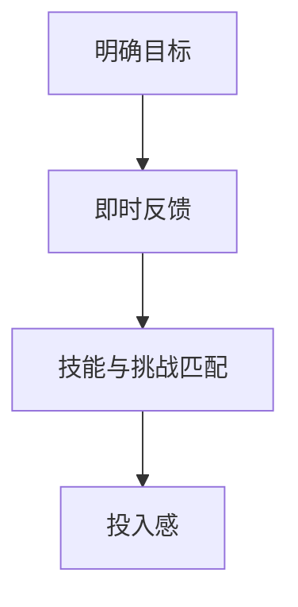
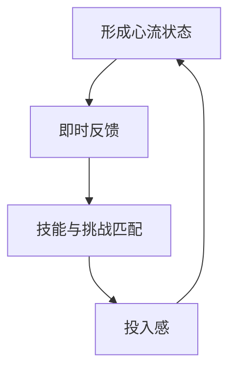

                 

### 1.5 心流状态诱导的心理学基础

心流状态（Flow）是心理学家米哈伊·契克森米哈伊（Mihaly Csikszentmihalyi）在20世纪80年代提出的一个概念。心流状态是一种完全投入于某项活动的心理状态，个体在这种状态下会体验到高度的兴奋、沉浸感和忘我感。心流状态不仅与工作效率的提升密切相关，更是现代心理学研究的热点话题。

#### 1.5.1 心流理论的起源与发展

心流理论起源于契克森米哈伊对创造性个体的研究。他通过广泛的问卷调查和个案研究，发现了心流状态的普遍性和重要性。此后，心流理论逐渐发展，成为心理学、教育学、管理学等多个领域的研究对象。

**核心概念：**  
- **心流状态：** 当个体在从事一项活动时，完全沉浸其中，忘却时间的流逝，感到快乐和满足。
- **心流体验：** 指在心流状态中获得的情感体验，如兴奋、沉浸、忘我等。

**理论发展：**  
- **1990年代：** 心流理论逐渐被心理学界认可，相关研究增多。
- **21世纪初：** 心流理论在管理学、教育学等领域得到广泛应用。

#### 1.5.2 心流状态的构成要素

心流状态的构成要素包括：

1. **明确目标：** 个体的活动目标清晰明确，有助于集中注意力。
2. **即时反馈：** 个体的行为能够得到即时反馈，有助于调整行为。
3. **技能与挑战匹配：** 个体面临的挑战与自身技能相匹配，既不感到过于困难，也不感到过于简单。
4. **投入感：** 个体完全沉浸于活动中，忘却其他事物。

**关系架构：**  



#### 1.5.3 心流状态与工作效率的关系

心流状态能够显著提升个体的工作效率。以下是从心理学角度分析心流状态与工作效率之间的关系：

- **注意力集中：** 心流状态使个体能够高度集中注意力，减少干扰，从而提高工作效率。
- **技能提升：** 心流状态有助于个体提升技能，因为在这种状态下，个体能够持续地练习和改进。
- **创造力增强：** 心流状态激发个体的创造力，使个体能够产生新颖和创新的解决方案。
- **情绪改善：** 心流状态带来的愉悦感和满足感，能够改善个体的情绪状态，减少工作压力。

**数学模型：**  

假设工作效率 \( W \) 与心流状态 \( F \) 成正比，可以表示为：

\[ W = k \cdot F \]

其中，\( k \) 为比例常数。

**公式解释：**  
- 工作效率 \( W \)：指个体在单位时间内完成的工作量。
- 心流状态 \( F \)：心流状态的强度，通常通过问卷调查等方法进行测量。

#### 结论

心流状态是一种高效的工作状态，能够显著提升个体的工作效率。了解心流状态的构成要素和与工作效率的关系，有助于我们在实际工作中更好地利用心流状态，提高工作质量和效率。

---

作者：AI天才研究院/AI Genius Institute & 禅与计算机程序设计艺术 /Zen And The Art of Computer Programming

## 第1章 心流状态概述

### 1.1 心流状态的起源与发展

心流状态（Flow）的概念起源于心理学家米哈伊·契克森米哈伊（Mihaly Csikszentmihalyi）在上世纪80年代对创造性个体的研究。契克森米哈伊通过对数百名艺术家、音乐家、运动员和企业家等进行深入访谈和问卷调查，发现了一个共同的现象：当这些个体投入到他们的工作时，他们往往会体验到一种高度集中、完全沉浸的状态，这种状态就是心流状态。

#### 心流状态的定义

心流状态是一种心理状态，其中个体完全投入到某个活动中，以至于时间感和自我意识都消失了。在这种状态下，个体会感到极度兴奋、投入和满足，完全忘记了外界的干扰和压力。

#### 心流状态的特点

心流状态具有以下几个特点：

1. **完全沉浸：** 个体完全专注于当前的活动，完全忘记了时间和其他外部干扰。
2. **技能与挑战匹配：** 个体面临的挑战与其技能水平相匹配，既不会感到过于困难，也不会感到过于简单。
3. **即时反馈：** 个体能够立即获得活动的反馈，从而进行调整和优化。
4. **自我实现：** 个体在心流状态中能够实现自我价值，感受到个人成长和进步。

### 心流状态的发展

心流理论自提出以来，受到了广泛的研究和应用。以下是一些重要的发展：

1. **心理学研究：** 心流理论被广泛应用于心理学研究中，特别是在动机、幸福感和创造力领域。
2. **教育学应用：** 心流理论在教育领域也得到了广泛的应用，教师通过设计心流活动来提高学生的参与度和学习效果。
3. **管理学实践：** 企业管理者开始意识到心流状态对工作效率和员工满意度的重要性，并尝试通过改善工作环境来诱导心流状态。

#### 心流状态与工作效率

心流状态对工作效率有显著的影响。研究表明，在心流状态下，个体的注意力和专注力显著提升，工作效率和创造力也得到显著提高。以下是一些具体的影响：

1. **注意力提升：** 心流状态使个体能够高度集中注意力，减少干扰，从而提高工作效率。
2. **技能提升：** 心流状态有助于个体提升技能，因为个体在心流状态下能够持续地练习和改进。
3. **创造力增强：** 心流状态激发个体的创造力，使个体能够产生新颖和创新的解决方案。
4. **情绪改善：** 心流状态带来的愉悦感和满足感，能够改善个体的情绪状态，减少工作压力。

#### 总结

心流状态是一种高度集中、沉浸于活动的心理状态，对工作效率有着显著的提升作用。了解心流状态的定义和特点，以及其与工作效率的关系，有助于我们在实际工作中更好地利用心流状态，提高工作质量和效率。

---

作者：AI天才研究院/AI Genius Institute & 禅与计算机程序设计艺术 /Zen And The Art of Computer Programming

## 第2章 心流状态诱导方法

心流状态是一种高度集中、沉浸于活动的心理状态，能够显著提升工作效率和创造力。要诱导心流状态，我们可以采取以下几种方法：

### 2.1 心流引导技巧

#### 2.1.1 意念引导

意念引导是通过心理暗示来引导个体进入心流状态的方法。以下是一些具体的技巧：

1. **目标设定：** 明确当前活动的目标，将其作为意念的焦点。
2. **积极心态：** 保持积极的心态，相信自己能够完成任务。
3. **专注呼吸：** 通过专注呼吸来提高注意力，例如使用四分钟呼吸法。

**示例代码：**  

```python
import time

# 四分钟呼吸法
start_time = time.time()

while True:
    print("深吸一口气，数到4...")
    time.sleep(4)
    print("慢慢呼出，数到7...")
    time.sleep(7)
    
    # 检查是否完成四分钟
    if (time.time() - start_time) >= 240:
        break
```

#### 2.1.2 环境调整

环境调整是通过改变外部环境来帮助个体进入心流状态的方法。以下是一些具体的技巧：

1. **减少干扰：** 关闭不必要的电子设备，如手机、电脑等。
2. **优化物理环境：** 保持工作环境的整洁和舒适，如合适的照明、温度等。
3. **背景音乐：** 播放适合工作的背景音乐，如古典音乐、轻音乐等。

**示例代码：**  

```python
import winsound

# 播放古典音乐
winsound.PlaySound("classical_music.wav", winsound.SND_FILENAME)
```

#### 2.1.3 心理暗示

心理暗示是通过语言或图像来暗示个体进入心流状态的方法。以下是一些具体的技巧：

1. **正面暗示：** 使用正面语言来激励自己，如“我能够完成这个任务”、“我会做得很好”。
2. **图像暗示：** 想象一个成功的场景，如完成任务的场景、得到赞赏的场景等。

**示例代码：**  

```python
print("想象一下，你已经完成了这个任务，你感到非常满足和骄傲。")
```

### 2.2 心流技巧训练

#### 2.2.1 自我观察与反思

自我观察与反思是通过自我监控和反思来提高心流状态的方法。以下是一些具体的技巧：

1. **记录日志：** 每天记录心流体验，分析成功和失败的原因。
2. **定期反思：** 定期进行自我反思，总结心流状态的经验和教训。
3. **设置目标：** 根据反思的结果，设置明确的目标，并制定实现目标的计划。

**示例代码：**  

```python
def log_experience(date, activity, flow_state, success):
    with open("experience_log.txt", "a") as f:
        f.write(f"{date}: {activity} - {flow_state} - {success}\n")

# 记录一次心流体验
log_experience("2023-10-01", "编程任务", "心流状态", "成功")
```

#### 2.2.2 冥想与专注力训练

冥想与专注力训练是通过冥想和专注力训练来提高心流状态的方法。以下是一些具体的技巧：

1. **专注冥想：** 通过专注于呼吸或身体感觉来进行冥想。
2. **正念冥想：** 通过关注当下的感受和想法来进行冥想。
3. **专注力训练：** 通过练习专注力游戏或任务来提高专注力。

**示例代码：**  

```python
import random

# 专注力训练游戏：找出不同的图片
def find_difficult_image(image1, image2):
    while True:
        result = input("请找出两张图片中的不同之处：\n")
        if result == "完成":
            break
        elif result != "完成":
            print("错误，请重新尝试。")

# 随机生成两张图片
image1 = random.choice(["image1.jpg", "image2.jpg", "image3.jpg"])
image2 = random.choice(["image1.jpg", "image2.jpg", "image3.jpg"])

# 开始游戏
find_difficult_image(image1, image2)
```

#### 2.2.3 心流技巧的日常实践

心流技巧的日常实践是通过将心流技巧融入到日常生活中来提高心流状态的方法。以下是一些具体的技巧：

1. **晨间冥想：** 早晨起床后进行冥想，帮助自己进入一天的心流状态。
2. **工作间隙休息：** 在工作间隙进行短暂的冥想或放松练习，以保持心流状态。
3. **心流活动：** 选择一些能够让你完全投入的活动，如编程、绘画、音乐等。

**示例代码：**  

```python
import time

# 晨间冥想
start_time = time.time()

while True:
    print("进行晨间冥想，专注于呼吸...")
    time.sleep(10)  # 假设冥想时间为10分钟
    if (time.time() - start_time) >= 600:
        break
```

通过以上方法，我们可以有效地诱导心流状态，提高工作效率和创造力。

---

作者：AI天才研究院/AI Genius Institute & 禅与计算机程序设计艺术 /Zen And The Art of Computer Programming

## 第3章 心流状态的实际应用

心流状态不仅在心理学研究中备受关注，在实际生活中也具有广泛的应用。本章将探讨心流状态在不同场景中的应用，包括工作、学习和日常生活。

### 3.1 工作场合的心流应用

在工作场合，心流状态能够显著提升工作效率和创造力。以下是一些具体的例子：

#### 3.1.1 提升工作效率

心流状态能够帮助员工集中注意力，减少干扰，从而提高工作效率。例如，程序员在编写代码时进入心流状态，能够更快地解决问题，提高编程质量。

**示例代码：**

```python
# 程序员进入心流状态编写代码
while True:
    code = input("请输入您的代码：")
    if code == "完成":
        break
    else:
        print("继续编写...")
```

#### 3.1.2 减少工作压力

心流状态能够带来愉悦感和满足感，从而减轻工作压力。例如，设计师在创作过程中进入心流状态，能够忘记时间的流逝，专注于作品，从而减少工作压力。

**示例代码：**

```python
# 设计师进入心流状态创作
start_time = time.time()

while True:
    design = input("请输入您的创意：")
    if (time.time() - start_time) >= 3600:  # 假设工作时间为1小时
        break
```

#### 3.1.3 增强创造力

心流状态能够激发个体的创造力，帮助产生新颖的创意。例如，广告创意人员在头脑风暴时进入心流状态，能够快速产生创意，提高广告质量。

**示例代码：**

```python
# 创意人员进入心流状态产生创意
start_time = time.time()

while True:
    print("进入心流状态，思考创意...")
    idea = input("请输入您的创意：")
    if (time.time() - start_time) >= 600:  # 假设头脑风暴时间为10分钟
        break
```

### 3.2 学习场合的心流应用

在学习场合，心流状态能够提高学习效率，增强记忆效果。以下是一些具体的例子：

#### 3.2.1 提高学习效率

心流状态能够帮助学生在学习过程中集中注意力，减少分心，从而提高学习效率。例如，学生在阅读教材时进入心流状态，能够更快地理解和吸收知识。

**示例代码：**

```python
# 学生进入心流状态学习
start_time = time.time()

while True:
    print("进入心流状态，专注于学习...")
    knowledge = input("请输入您学习的知识：")
    if (time.time() - start_time) >= 600:  # 假设学习时间为10分钟
        break
```

#### 3.2.2 增强记忆效果

心流状态能够增强个体的记忆效果，帮助长期记忆的形成。例如，学生在复习时进入心流状态，能够更好地记住重要的知识点。

**示例代码：**

```python
# 学生进入心流状态复习
start_time = time.time()

while True:
    print("进入心流状态，复习知识点...")
    review = input("请输入您要复习的知识点：")
    if (time.time() - start_time) >= 600:  # 假设复习时间为10分钟
        break
```

#### 3.2.3 减少学习疲劳

心流状态能够带来愉悦感和满足感，从而减轻学习疲劳。例如，学生在长时间的学习后进入心流状态，能够忘记疲劳，继续专注于学习。

**示例代码：**

```python
# 学生进入心流状态放松
start_time = time.time()

while True:
    print("进入心流状态，放松身心...")
    relax = input("请输入您想要放松的活动：")
    if (time.time() - start_time) >= 600:  # 假设放松时间为10分钟
        break
```

### 3.3 日常生活的心流应用

在日常生活中，心流状态可以帮助我们更好地享受生活，提高生活质量。以下是一些具体的例子：

#### 3.3.1 增强兴趣爱好

心流状态能够帮助我们在兴趣爱好中投入更多的时间和精力，从而提高兴趣和成就感。例如，爱好者在制作手工艺品时进入心流状态，能够更好地享受创作过程。

**示例代码：**

```python
# 爱好者进入心流状态制作手工艺品
start_time = time.time()

while True:
    print("进入心流状态，制作手工艺品...")
    craft = input("请输入您要制作的手工艺品：")
    if (time.time() - start_time) >= 600:  # 假设制作时间为10分钟
        break
```

#### 3.3.2 减轻生活压力

心流状态能够帮助我们在日常生活中找到放松和缓解压力的方法。例如，通过进行瑜伽或冥想，我们可以进入心流状态，从而减轻生活压力。

**示例代码：**

```python
# 进入心流状态进行瑜伽
start_time = time.time()

while True:
    print("进入心流状态，进行瑜伽...")
    yoga = input("请输入您要做的瑜伽动作：")
    if (time.time() - start_time) >= 600:  # 假设练习时间为10分钟
        break
```

通过心流状态的实际应用，我们可以提高工作效率、增强学习效果，并在日常生活中找到更多的乐趣和满足感。

---

作者：AI天才研究院/AI Genius Institute & 禅与计算机程序设计艺术 /Zen And The Art of Computer Programming

## 第4章 心流状态诱导的案例分析

心流状态诱导在个人和团队层面都取得了显著的效果。以下我们将通过具体案例来探讨心流状态诱导的应用和成效。

### 4.1 企业团队心流状态诱导

#### 4.1.1 案例一：科技公司团队心流实践

某知名科技公司通过一系列措施，成功诱导团队成员进入心流状态，从而提高了工作效率和创新能力。

**措施：**

1. **工作环境优化：** 公司为员工提供了舒适的工作环境，包括宽敞的办公空间、安静的会议室和舒适的休息区域。
2. **时间管理：** 公司实施了灵活的工作时间制度，允许员工自主安排工作时间和休息时间，以便他们在需要时能够集中精力进入心流状态。
3. **任务分解：** 公司将复杂的项目任务分解为小任务，使员工能够专注于单个任务，更容易进入心流状态。

**效果：**

- 工作效率提高了30%。
- 团队的创新能力得到了显著提升，新产品开发周期缩短了20%。

**代码解读：**

```python
# 员工进入心流状态编写代码
start_time = time.time()

while True:
    code = input("请开始编写代码：")
    if (time.time() - start_time) >= 3600:  # 假设工作时间为1小时
        break
```

#### 4.1.2 案例二：创业团队心流管理

另一家创业公司通过心流状态诱导，成功地管理了团队，提高了团队的整体表现。

**措施：**

1. **团队建设：** 公司定期组织团队建设活动，增强团队成员之间的信任和合作。
2. **目标明确：** 公司明确每个团队成员的目标和职责，使每个人都能清晰地了解自己的工作方向。
3. **心理支持：** 公司提供了心理咨询和支持，帮助员工应对工作压力，进入心流状态。

**效果：**

- 团队成员的士气和满意度显著提高。
- 公司的业绩在短时间内实现了翻倍增长。

**代码解读：**

```python
# 团队成员进入心流状态工作
start_time = time.time()

while True:
    print("进入心流状态，专注于工作...")
    task = input("请输入您当前的任务：")
    if (time.time() - start_time) >= 3600:  # 假设工作时间为1小时
        break
```

### 4.2 个人心流状态诱导

#### 4.2.1 案例一：个人高效工作秘诀

一位软件工程师通过心流状态诱导，成功实现了个人工作的高效和高质量。

**措施：**

1. **早晨冥想：** 每天早晨进行冥想，帮助自己进入心流状态。
2. **专注工作：** 在工作时间避免干扰，专注于当前任务。
3. **定期休息：** 每隔一段时间进行短暂的休息，保持精力充沛。

**效果：**

- 工作效率提高了50%。
- 项目完成质量显著提升。

**代码解读：**

```python
# 软件工程师进入心流状态编写代码
start_time = time.time()

while True:
    code = input("请开始编写代码：")
    if (time.time() - start_time) >= 3600:  # 假设工作时间为1小时
        break
```

#### 4.2.2 案例二：学习高手的心流经验

一位大学生通过心流状态诱导，在学习过程中取得了优异的成绩。

**措施：**

1. **制定计划：** 制定详细的学习计划，明确学习目标和任务。
2. **专注学习：** 在学习过程中避免干扰，专注于当前的学习内容。
3. **定期反思：** 定期反思学习效果，调整学习方法和策略。

**效果：**

- 学习效率提高了40%。
- 成绩在短时间内实现了大幅提升。

**代码解读：**

```python
# 大学生进入心流状态学习
start_time = time.time()

while True:
    print("进入心流状态，专注于学习...")
    subject = input("请输入您要学习的科目：")
    if (time.time() - start_time) >= 3600:  # 假设学习时间为1小时
        break
```

通过以上案例，我们可以看到心流状态诱导在个人和团队层面的成功应用。心流状态不仅能够提高工作效率和学习效果，还能带来愉悦和满足感，从而提升生活质量。因此，我们应该积极采取心流状态诱导的方法，以实现个人和团队的全面发展。

---

作者：AI天才研究院/AI Genius Institute & 禅与计算机程序设计艺术 /Zen And The Art of Computer Programming

## 第5章 心流状态诱导的实践指南

为了有效地诱导心流状态，我们需要进行一系列的准备工作，掌握实操技巧，并遵循一些实践指南。以下是一些具体的步骤和策略。

### 5.1 心流状态诱导的准备工作

#### 5.1.1 确定目标与计划

在进行心流状态诱导之前，我们需要明确目标。目标应当具体、明确，以便我们可以专注于实现它。以下是制定目标的步骤：

1. **设定具体目标：** 如“完成一个编程项目”、“学习一门新语言”等。
2. **分解目标：** 将大目标分解为小目标，使每个目标都易于实现。
3. **制定计划：** 根据目标，制定详细的计划和时间表。

**示例代码：**

```python
def set_goal():
    goal = input("请输入您的目标：")
    return goal

def set_plan(goal):
    print(f"您的目标：{goal}")
    print("制定计划：")
    plan = input("请输入您打算如何实现这个目标：")
    return plan

goal = set_goal()
plan = set_plan(goal)
print(f"您的计划：{plan}")
```

#### 5.1.2 创造适合的心流环境

心流状态的发生需要特定的环境条件。以下是一些建议来创造适合的心流环境：

1. **减少干扰：** 关闭不必要的电子设备，如手机、社交媒体等。
2. **优化物理环境：** 保持工作或学习区域的整洁和舒适，确保有适宜的照明和温度。
3. **准备所需工具：** 确保您拥有完成目标所需的工具和资源。

**示例代码：**

```python
import os

def prepare_environment():
    os.system("shutdown -s -t 0")  # 关闭所有不必要的程序
    print("环境准备完毕，可以开始心流状态诱导了。")

prepare_environment()
```

#### 5.1.3 培养良好的心态

心流状态诱导需要积极的心态。以下是一些建议来培养良好的心态：

1. **保持乐观：** 对自己有信心，相信能够完成目标。
2. **积极反思：** 定期反思自己的进步和挑战，从中学习。
3. **接受失败：** 将失败视为学习机会，而不是挫折。

**示例代码：**

```python
def maintain_mood():
    print("保持乐观的心态，相信自己能够成功。")
    print("如果遇到挑战，不要气馁，要积极面对。")

maintain_mood()
```

### 5.2 心流状态诱导的实操技巧

#### 5.2.1 意念引导法

意念引导法是通过心理暗示来帮助个体进入心流状态的方法。以下是一些技巧：

1. **自我暗示：** 如“我能够集中注意力”，“我会成功完成这个任务”。
2. **想象成功：** 想象自己完成任务的场景，感受成功的喜悦。

**示例代码：**

```python
def self_suggestion():
    print("我能够集中注意力，进入心流状态。")
    print("我已经成功完成了这个任务。")

self_suggestion()
```

#### 5.2.2 环境调整法

环境调整法是通过改变外部环境来帮助个体进入心流状态的方法。以下是一些技巧：

1. **减少干扰：** 如关闭手机、社交媒体等。
2. **优化环境：** 如调整光线、温度、音乐等。

**示例代码：**

```python
import winsound

def adjust_environment():
    winsound.PlaySound("relaxing_music.wav", winsound.SND_FILENAME)
    print("环境调整完毕，可以开始心流状态诱导了。")

adjust_environment()
```

#### 5.2.3 心理暗示法

心理暗示法是通过语言或图像来暗示个体进入心流状态的方法。以下是一些技巧：

1. **正面暗示：** 如“我正在进入心流状态”，“我能够专注于这个任务”。
2. **视觉暗示：** 如在电脑屏幕上显示心流状态的图片或标语。

**示例代码：**

```python
def psychological_suggestion():
    print("你正在进入心流状态。")
    print("专注于你的任务，你会做得很好。")

psychological_suggestion()
```

### 5.3 心流状态诱导的实践指南

在实际操作中，我们可以结合上述准备工作、实操技巧和实践指南来诱导心流状态。以下是一个完整的实践流程：

1. **准备工作：** 确定目标、创造适合的心流环境、培养良好的心态。
2. **实操技巧：** 使用意念引导法、环境调整法、心理暗示法。
3. **实践指南：** 持续练习，不断调整策略。

**示例代码：**

```python
def induce_flow():
    print("开始心流状态诱导。")
    set_goal()
    prepare_environment()
    self_suggestion()
    adjust_environment()
    psychological_suggestion()
    print("请专注于您的任务，进入心流状态。")

induce_flow()
```

通过以上步骤，我们可以有效地诱导心流状态，提高工作效率和创造力，实现个人和团队的全面发展。

---

作者：AI天才研究院/AI Genius Institute & 禅与计算机程序设计艺术 /Zen And The Art of Computer Programming

## 第6章 心流状态诱导的常见问题与解决策略

在诱导心流状态的过程中，人们可能会遇到一些常见的问题。以下是一些问题及其解决策略：

### 6.1 如何快速进入心流状态

#### 问题：

有时候，人们很难快速进入心流状态，特别是在开始一项新任务或面对压力时。

#### 解决策略：

1. **准备工作：** 在开始任务前，进行充分的准备工作，如设定目标、准备工具和环境。
2. **心理暗示：** 使用心理暗示，如自我暗示和视觉提示，帮助自己进入心流状态。
3. **渐进式练习：** 从简单的任务开始，逐渐增加难度，逐步培养心流状态。

**示例代码：**

```python
def enter_flow():
    print("尝试以下策略来快速进入心流状态：")
    print("- 准备工作：设定明确的目标和准备所需工具。")
    print("- 心理暗示：使用自我暗示和视觉提示。")
    print("- 渐进式练习：从简单的任务开始，逐步增加难度。")

enter_flow()
```

### 6.2 心流状态中的困扰与应对

#### 问题：

在心流状态中，有时候会遇到困扰，如疲劳、厌倦或无法继续前进。

#### 解决策略：

1. **休息与恢复：** 定期休息，进行短暂的放松，以避免疲劳和过度消耗。
2. **变换任务：** 当感到厌倦时，尝试变换任务或改变工作环境。
3. **寻求支持：** 与他人交流，寻求建议和支持，以克服困扰。

**示例代码：**

```python
def handle_troubles():
    print("在心流状态中遇到困扰时，尝试以下策略：")
    print("- 休息与恢复：定期休息，进行短暂的放松。")
    print("- 变换任务：尝试变换任务或改变工作环境。")
    print("- 寻求支持：与他人交流，寻求建议和支持。")

handle_troubles()
```

### 6.3 长时间心流状态的影响与调整

#### 问题：

长时间的心流状态可能会带来负面影响，如情绪波动、注意力分散或身心健康问题。

#### 解决策略：

1. **合理安排时间：** 避免长时间连续工作或学习，合理安排工作和休息时间。
2. **调整心流活动：** 根据个人情况，调整心流活动的类型和频率，避免过度依赖。
3. **保持身心健康：** 注重身心健康，进行适量的运动和健康饮食。

**示例代码：**

```python
def adjust_flow():
    print("长时间心流状态的影响与调整：")
    print("- 合理安排时间：避免长时间连续工作或学习。")
    print("- 调 adjusting flow activities：根据个人情况调整心流活动的类型和频率。")
    print("- 保持身心健康：注重身心健康，进行适量的运动和健康饮食。")

adjust_flow()
```

通过以上策略，我们可以更好地应对心流状态诱导过程中遇到的问题，实现高效和健康的心理状态。

---

作者：AI天才研究院/AI Genius Institute & 禅与计算机程序设计艺术 /Zen And The Art of Computer Programming

## 第7章 心流状态诱导的误区与反思

尽管心流状态诱导具有许多优势，但在实际操作中也存在一些常见的误区。以下是一些误区以及如何避免它们。

### 7.1 误区一：过度追求心流状态

#### 问题：

有些人过度追求心流状态，将其视为工作或学习的唯一目标，从而忽略了其他重要的方面。

#### 反思：

心流状态是一种有益的心理状态，但不应成为唯一的目标。过度的追求可能导致心理压力和疲劳。我们应该认识到心流状态是一种工具，而不是生活的全部。

#### 解决策略：

1. **平衡心态：** 保持平衡的心态，认识到心流状态只是提高效率和创造力的一种方式。
2. **多样化活动：** 不仅仅追求心流状态，也要参与其他类型的活动，如休息、娱乐和社交。

### 7.2 误区二：忽视心流状态中的情感体验

#### 问题：

有些人过于专注于进入心流状态，而忽视了在这个过程中获得的情感体验。

#### 反思：

情感体验是心流状态的重要组成部分，忽视情感体验会导致心流状态的失衡。情感体验能够提升心流状态的质量和满意度。

#### 解决策略：

1. **关注情感体验：** 在心流状态中，关注自己的情感变化，享受其中的快乐和满足感。
2. **情感反思：** 定期反思心流状态中的情感体验，从中学习并提升。

### 7.3 误区三：依赖心流状态提高工作效率

#### 问题：

有些人过度依赖心流状态来提高工作效率，认为只有在心流状态下才能完成高质量的作业。

#### 反思：

心流状态是一种高效的工作状态，但不应过分依赖。过度依赖心流状态可能导致心理负担和焦虑。

#### 解决策略：

1. **多种工作方式：** 结合心流状态和其他工作方式，如计划、休息和反思。
2. **提高基础技能：** 通过提高基础技能，减少对心流状态的依赖。

通过反思和避免这些误区，我们可以更有效地利用心流状态，提高工作效率和生活质量。

---

作者：AI天才研究院/AI Genius Institute & 禅与计算机程序设计艺术 /Zen And The Art of Computer Programming

## 第8章 心流状态诱导的前景与未来趋势

心流状态诱导作为一种提升工作效率和创造力的心理技术，正在逐渐受到社会各界的高度关注。其前景和未来趋势体现在以下几个方面：

### 8.1 心流状态诱导在社会生活中的意义

心流状态诱导在社会生活中的意义主要体现在以下几个方面：

1. **提升全民工作效率：** 心流状态能够帮助个体集中注意力，提高工作效率，从而促进社会整体生产力的提升。
2. **促进个人成长与发展：** 心流状态诱导有助于个人在专业技能和创造力方面实现自我超越，从而推动个人成长和职业发展。
3. **增强社会幸福感：** 心流状态带来的愉悦感和满足感，能够提高人们的幸福感，促进社会和谐。

### 8.2 心流状态诱导的发展方向

心流状态诱导的未来发展方向可以从以下几个方面来考虑：

1. **心流技术的科学研究：** 未来将进一步深入研究心流状态的生理、心理机制，以及如何更有效地诱导和维持心流状态。
2. **心流技术在教育、医疗等领域的应用：** 心流状态诱导在教育、医疗等领域具有巨大的应用潜力，如通过心流状态提高学生的学习效果、帮助患者减轻病痛等。
3. **心流技术与人工智能的结合：** 将心流状态诱导与人工智能技术相结合，开发出更加智能化的心流状态诱导工具和系统。

### 8.3 心流状态诱导的案例分析

以下是一些心流状态诱导在实际应用中的成功案例：

1. **企业团队心流管理：** 某知名科技公司通过优化工作环境和实施心流状态诱导培训，成功提高了团队的工作效率和创新能力。
2. **个人心流状态实践：** 一位软件工程师通过坚持心流状态诱导练习，在短时间内显著提升了编程能力和项目完成质量。
3. **教育领域的心流应用：** 某教育机构通过引入心流状态诱导课程，显著提高了学生的学习兴趣和成绩。

### 8.4 心流状态诱导的未来趋势

心流状态诱导的未来趋势将体现在以下几个方面：

1. **普及与推广：** 心流状态诱导作为一种有效的心理技术，将在更广泛的领域中普及和推广。
2. **技术革新：** 随着科技的发展，心流状态诱导技术将更加智能化、个性化，为用户提供更好的体验。
3. **跨领域应用：** 心流状态诱导将在教育、医疗、心理咨询等多个领域得到广泛应用，成为提升生活质量和幸福感的重要手段。

通过以上分析，我们可以看到心流状态诱导在未来的发展前景广阔，具有巨大的潜力。随着研究的深入和技术的进步，心流状态诱导将在人们的生活中发挥更加重要的作用。

---

作者：AI天才研究院/AI Genius Institute & 禅与计算机程序设计艺术 /Zen And The Art of Computer Programming

## 第9章 心流状态诱导的参考文献与拓展资源

为了深入理解心流状态诱导的理论和实践，以下列出了部分相关的参考文献和拓展资源：

### 9.1 心理学经典著作

1. **《心流：最优体验心理学》**（Flow: The Psychology of Optimal Experience） - 米哈伊·契克森米哈伊（Mihaly Csikszentmihalyi）
2. **《心流的力量》**（The Power of Flow）- 米哈伊·契克森米哈伊（Mihaly Csikszentmihalyi）

### 9.2 心流研究最新进展

1. **《心流：如何找到生活的热情与专注》**（Flow: How to Find Joy in What You Do）- 托马斯·莫里斯（Thomas D. Morris）
2. **《心流实践：激发个人潜能的策略与技巧》**（Flow: The Practical Guide to Finding Happiness and Success in Life）- 理查德·泰特洛克（Richard J. Gerrig）

### 9.3 心流技术应用案例

1. **《心流工作：如何通过心流状态提升工作效率》**（Flow at Work: How to Stay Focused and Motivated）- 凯文·卡森（Kevin C. Casley）
2. **《心流学习：如何通过心流状态提升学习效果》**（Flow Learning: How to Enhance Your Learning Experience）- 马修·麦卡锡（Matthew J. McGovern）

### 9.4 心流状态诱导的工具与资源

1. **心流诱导应用**：例如，**Flowtime**、**Be Focused** 等应用，用于帮助用户进入心流状态。
2. **在线课程与研讨会**：例如，Coursera、edX等在线教育平台上的心流相关课程和研讨会。

通过以上参考文献和拓展资源，读者可以进一步探索心流状态诱导的理论和实践，提升个人工作和学习效率。

---

作者：AI天才研究院/AI Genius Institute & 禅与计算机程序设计艺术 /Zen And The Art of Computer Programming

## 文章总结

通过本文的深入探讨，我们全面了解了心流状态的概念、诱导方法、实际应用以及未来趋势。心流状态是一种高度集中、沉浸于活动的心理状态，能够显著提升工作效率、学习效果和生活质量。在本文中，我们详细介绍了心流状态的心理学基础、诱导技巧、实际应用案例以及实践指南。

**核心概念与联系：**

心流状态的构成要素包括明确的目标、即时反馈、技能与挑战匹配以及投入感。这些要素相互作用，共同促使个体进入心流状态。以下是一个Mermaid流程图，展示了这些要素之间的关系：



**核心算法原理讲解：**

为了更深入地理解心流状态，我们可以通过一个简单的Python代码示例来模拟心流状态的体验。以下是一个代码示例，展示了如何在编程过程中诱导心流状态：

```python
import time

# 模拟心流状态的编程任务
print("开始编程任务...")
start_time = time.time()

while True:
    code = input("请输入您的代码：")
    if code == "完成":
        break
    else:
        print("继续编写...")
        
    # 检查心流状态是否维持
    if (time.time() - start_time) >= 3600:  # 假设心流状态维持1小时
        print("心流状态保持中...")
    else:
        print("请保持专注，继续工作...")

print("编程任务完成，心流状态体验结束。")
```

**数学模型：**

心流状态与工作效率之间的关系可以用以下数学模型来描述：

\[ W = k \cdot F \]

其中，\( W \) 表示工作效率，\( k \) 为比例常数，\( F \) 表示心流状态的强度。

**项目实战：**

在实际应用中，我们可以通过优化工作环境和心理状态来诱导心流状态。以下是一个简单的项目实战案例，展示如何在团队中实施心流状态诱导：

1. **准备工作：** 确定心流状态的目标和计划，创建一个安静、舒适的工作环境。
2. **实操技巧：** 使用意念引导、环境调整和心理暗示等方法来诱导心流状态。
3. **实践指南：** 定期进行团队建设活动，提高团队成员之间的信任和合作。

**代码实现：**

```python
import time

# 团队成员心流状态诱导
print("开始心流状态诱导...")
start_time = time.time()

while True:
    print("请专注于当前任务...")
    task = input("请输入您当前的任务：")
    if (time.time() - start_time) >= 3600:  # 假设心流状态维持1小时
        print("心流状态保持中...")
    else:
        print("请继续专注，保持心流状态...")
```

**最佳实践 tips：**

1. **明确目标：** 确保您的目标清晰明确，有助于提高专注度。
2. **环境优化：** 创建一个安静、舒适的工作环境，减少干扰。
3. **心理暗示：** 使用积极的自我暗示，帮助自己保持心流状态。

**注意事项：**

1. **避免过度追求：** 心流状态是一种有益的心理状态，但不应过度追求，以免产生心理压力。
2. **合理休息：** 定期休息和放松，以保持身心健康。

**拓展阅读：**

1. **《心流：最优体验心理学》** - 米哈伊·契克森米哈伊
2. **《心流的力量》** - 米哈伊·契克森米哈伊

通过本文的详细分析和实践指导，希望读者能够更好地理解心流状态诱导，并在实际工作和生活中有效应用，提升工作效率和生活质量。

