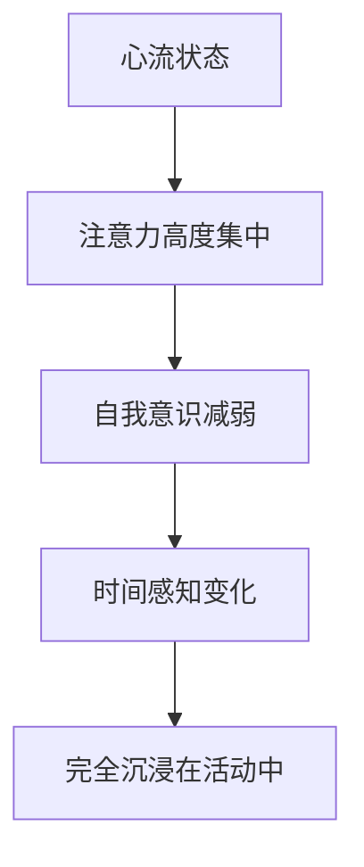

                 

### 引言

在现代快节奏的生活中，人们往往被繁杂的事务和持续的信息流所包围，感受到一种无法逃脱的压力和焦虑。为了寻求解脱，越来越多的人开始探索一种称为“心流”的状态。心流状态，又被称为“流畅体验”，是一种人们全身心投入某项活动时的愉悦感觉。在这一状态下，个体能够达到高度集中、忘记时间和自我意识减弱的境界。

心流状态最早由心理学家米哈里·契克森米哈伊（Mihaly Csikszentmihalyi）在20世纪80年代提出。契克森米哈伊通过大量的实证研究，揭示了心流状态的核心特征及其对个体心理健康和生活质量的积极影响。心流不仅是一种心理状态，它还涉及到一系列的神经生理反应，如注意力高度集中、多巴胺分泌增加等。

本文将围绕心流状态展开，旨在为广大读者提供一个全面、深入的探讨。首先，我们将介绍心流理论的基础，包括其定义、核心特征和应用领域。接着，我们将深入探讨心流状态的心理学基础，如注意力和自我意识。随后，文章将分析影响心流状态的各种因素，并探讨其在不同领域的好处。文章的后半部分将提供如何在日常生活中创造心流状态的实践指南，并通过案例研究展示心流状态的实际应用。最后，文章将对心流实践中的挑战和解决方案进行探讨，并提供一些建议和总结。

通过本文的阅读，读者将能够全面了解心流状态的概念和重要性，掌握如何有效地进入和维持心流状态，以及在生活和工作中充分利用心流带来的诸多益处。

### 关键词

- 心流状态
- 流畅体验
- 注意力集中
- 自我意识
- 心理学基础
- 应用领域
- 心理健康
- 生活质量

### 摘要

本文旨在深入探讨心流状态这一独特心理现象。通过回顾心流理论的历史发展，分析其核心特征与心理学基础，探讨影响心流状态的多种因素，本文展示了心流状态对个体心理健康和学业、职业成就的积极影响。此外，文章还提供了实践指南，帮助读者创造和维持心流状态，并通过实际案例研究展示了心流状态在不同领域的应用。最后，本文对心流实践中的挑战和解决方案进行了讨论，并提出了一些建议，以充分利用心流状态带来的幸福感。

## 第一部分：心流的概念与理论探讨

### 第1章 心流理论概述

#### 1.1 心流的历史与发展

心流（Flow）这一概念最早由心理学家米哈里·契克森米哈伊（Mihaly Csikszentmihalyi）于20世纪80年代提出。契克森米哈伊在心理学领域有着深远的影响，其研究兴趣主要集中在人类创造力和幸福感的探讨。心流理论作为他心理学研究的一部分，源于对艺术家、运动员和其他领域中杰出人物的研究。

契克森米哈伊通过对大量案例的深入分析，发现了这些杰出人物在创作和竞技过程中所经历的一种高度专注、完全投入的状态。他称之为“心流”状态，并提出了这一理论来解释这一现象。心流状态的核心特征是高度集中注意力、完全沉浸在当前活动中、自我意识减弱和时间感知的变化。

心流理论的提出，不仅为心理学研究提供了一种新的视角，也为人们理解和改善自身幸福感提供了实用的工具。随后，心流理论逐渐引起了学术界的广泛关注，并在多个领域得到了应用和发展。

#### 1.2 心流的定义与核心特征

心流状态，也被称为流畅体验，是一种个体在从事某项活动时进入的一种完全沉浸和高度专注的状态。在这一状态下，个体能够忘却自我、时间，并感到极大的内在满足和快乐。

**核心特征**：

1. **注意力高度集中**：在心流状态中，个体会完全集中注意力在当前活动上，外界干扰被排除，注意力的高度集中是心流状态的一个重要特征。

2. **自我意识减弱**：个体在心流状态下会感到自我意识的减弱，甚至有时会感到与活动本身融为一体，这种状态使得个体能够更深入地体验当前的活动。

3. **时间感知变化**：在心流状态中，时间感知往往会发生变化，有时感觉时间过得很慢，有时又感觉时间过得飞快。这种时间感知的变化是心流状态的一个显著特征。

4. **完全沉浸在活动中**：个体在心流状态中会完全沉浸于当前活动中，忘记了外界的干扰，只专注于活动本身。

**如何进入心流状态**：

进入心流状态并不是一件容易的事情，但有一些方法可以帮助个体达到这种状态。以下是一些建议：

1. **选择合适的活动**：选择那些能够引起个体兴趣和热情的活动，这些活动更容易让人进入心流状态。

2. **设置明确的目标**：明确的目标可以帮助个体集中注意力，更容易进入心流状态。

3. **减少外界干扰**：关闭手机、电视等外界干扰，创造一个有利于专注的环境。

4. **保持适度的挑战**：适度的挑战可以激发个体的兴趣和投入，但挑战过于艰巨或过于简单都会妨碍心流状态的出现。

#### 1.3 心流理论的应用领域

心流理论的应用领域非常广泛，涵盖了多个不同的领域。以下是一些主要的应用领域：

1. **教育领域**：在教育中，教师可以通过设计具有挑战性和吸引力的任务，帮助学生进入心流状态，从而提高学习效果。同时，学生也可以通过自主探索和参与，更容易进入心流状态，提高学习兴趣和动机。

2. **职业领域**：在职场中，心流状态可以帮助员工更高效地完成任务，提高工作效率。管理者可以通过优化工作流程、提供挑战性的任务等方式，帮助员工进入心流状态，从而提高整体的工作绩效。

3. **艺术领域**：艺术家在创作过程中，常常会经历心流状态，这种状态有助于艺术作品的创作和质量的提升。

4. **运动领域**：运动员在竞技比赛中，通过进入心流状态，可以更好地集中注意力、提高运动表现。

5. **生活领域**：在日常生活中，人们可以通过进行一些有意义的活动，如阅读、写作、绘画等，来体验心流状态，从而提高生活质量和幸福感。

### 1.2 心流的定义与核心特征

#### Mermaid 流程图：

#### 心流状态的影响因素

心流状态的出现并不是偶然的，它受到多种因素的影响。以下是一些主要的影响因素：

1. **任务难度**：任务难度是影响心流状态的重要因素之一。适度的任务难度可以激发个体的兴趣和投入，但过于简单或过于复杂都会妨碍心流状态的出现。

2. **技能水平**：个体的技能水平与心流状态也有很大的关系。技能水平适中，个体能够应对任务，但又不会感到过于简单或过于困难，更容易进入心流状态。

3. **目标明确**：明确的目标可以帮助个体集中注意力，更容易进入心流状态。

4. **环境因素**：一个安静、舒适的环境有利于个体进入心流状态。减少外界干扰，如关闭手机、电视等，可以创造一个有利于专注的环境。

5. **心理状态**：个体的心理状态也会影响心流状态的出现。心情愉快、自信、放松等积极的心理状态有利于心流状态的出现。

### 总结

心流状态是一种高度专注、完全沉浸在活动中的心理状态，其核心特征包括注意力高度集中、自我意识减弱、时间感知变化和完全沉浸在活动中。心流状态不仅对心理健康有积极影响，还能提高学业、职业成就和生活质量。了解心流状态的定义、核心特征和影响因素，可以帮助个体更好地理解和利用这一心理状态，提高生活和工作效率。在接下来的章节中，我们将进一步探讨心流状态的心理学基础，以及如何在日常生活中创造心流状态。

## 第二部分：心流心理学基础

### 第2章 心流心理学基础

#### 2.1 心理学的相关概念

在深入探讨心流状态的心理学基础之前，我们需要了解一些与心流密切相关的基本心理学概念。这些概念包括注意力、自我意识和动机，它们构成了心流状态的心理架构。

**注意力**：

注意力是心流状态的核心要素之一。它是指个体在特定时刻专注于某一特定对象或活动的能力。注意力的分配和集中程度直接影响心流状态的出现。在心流状态下，个体的注意力高度集中，外界干扰被有效排除，使得个体能够全身心地投入到当前的活动当中。

**自我意识**：

自我意识是个体对自己存在的认知，包括对自己身体、情感和思想的认识。在心流状态下，自我意识会减弱，个体感受到与当前活动的一体性，甚至有时会感到自己与活动融为一体。这种自我意识的减弱是心流状态的一个重要特征，也是个体能够完全沉浸于活动中的关键因素。

**动机**：

动机是指推动个体从事某一活动的内在驱动力。动机与心流状态有着密切的联系。适度的动机可以激发个体的兴趣和投入，使个体更容易进入心流状态。相反，动机过强或过弱都可能导致心流状态的缺失。

**注意力与自我意识的关系**：

在心流状态中，注意力和自我意识是相互影响的。高度集中注意力可以帮助个体排除外界干扰，从而减弱自我意识。而自我意识的减弱又会进一步增强个体的注意力集中度，形成一种良性循环。这种相互关系使得心流状态得以维持和深化。

**动机与心流状态的关系**：

动机是心流状态的重要驱动力。适度的动机可以激发个体对活动的兴趣和投入，使个体更容易进入心流状态。当个体对活动充满热情和动力时，他们往往会更容易达到高度专注的状态。然而，动机过强或过弱都可能导致心流状态的缺失。动机过强可能会导致焦虑和压力，从而妨碍心流状态的出现；而动机过弱则可能使个体对活动缺乏兴趣和投入，难以进入心流状态。

### 2.2 心流与注意力

注意力是心流状态的核心特征之一。在心流状态下，个体能够高度集中注意力，将全部精力投入到当前的活动当中。这种高度集中的注意力状态是心流状态得以维持的关键。

**注意力的机制**：

注意力机制是指大脑处理信息和选择关注对象的过程。在心流状态下，个体的注意力机制被高度激活，大脑能够有效地筛选和处理信息，将所有注意力集中在当前活动上。这种机制使得个体能够忽略外界的干扰，专注于当前的活动，从而进入心流状态。

**如何提高注意力**：

1. **减少干扰**：减少外界的干扰是提高注意力的第一步。关闭手机、电视等可能分散注意力的设备，创造一个安静、舒适的环境。

2. **设定明确的目标**：明确的目标可以帮助个体集中注意力。设定具体、可衡量的目标，有助于个体更好地专注于当前活动。

3. **培养专注的习惯**：通过持续练习，培养专注的习惯。例如，定期进行冥想、专注于呼吸等练习，有助于提高注意力的集中程度。

4. **适度休息**：适度的休息可以帮助恢复注意力的集中能力。长时间的高强度工作后，适当的休息可以帮助大脑恢复活力，重新集中注意力。

### 2.3 心流与自我意识

自我意识在心流状态中扮演着重要的角色。在心流状态下，个体会感受到自我意识的减弱，这种状态被称为“自我消失”。自我消失使得个体能够更深入地体验当前的活动，完全沉浸在活动中。

**自我意识减弱的机制**：

自我意识减弱的机制与大脑中的神经递质和多巴胺的分泌有关。在心流状态下，大脑中的多巴胺水平会上升，这种神经递质的增加可以抑制自我意识，使个体感受到与活动的一体性。

**如何减弱自我意识**：

1. **全身心投入**：全身心投入当前活动是减弱自我意识的有效方法。将注意力集中在当前活动上，不要让思维分散，有助于减弱自我意识。

2. **持续练习**：通过持续练习，培养自我消失的能力。例如，进行长时间的冥想或专注于一项复杂的任务，有助于个体逐渐适应并习惯自我消失的状态。

3. **调整心态**：积极的心态有助于减弱自我意识。保持平静、放松的心态，有助于个体更好地沉浸在活动中，感受到与活动的一体性。

### 2.4 心流与动机

动机是心流状态的重要驱动力。适度的动机可以激发个体对活动的兴趣和投入，使个体更容易进入心流状态。

**动机的类型**：

1. **内在动机**：内在动机是指个体因对活动本身的兴趣和热爱而从事活动。这种动机不依赖于外部奖励，而是源于个体内心的满足感。

2. **外在动机**：外在动机是指个体因外部奖励或避免惩罚而从事活动。这种动机通常依赖于外部压力或奖励，可能有助于进入心流状态，但长时间依赖外在动机可能会导致心流状态的缺失。

**如何提高内在动机**：

1. **找到兴趣点**：找到自己对活动感兴趣的部分，将其作为进入心流状态的起点。

2. **设定挑战性目标**：设定具有挑战性的目标，可以激发个体的兴趣和投入，从而提高内在动机。

3. **体验成就感**：通过完成任务或实现目标，体验成就感，有助于增强内在动机。

4. **保持好奇心**：保持对新事物的好奇心，有助于个体持续对活动保持兴趣。

### 总结

心流状态是一种高度专注、完全沉浸在活动中的心理状态，其核心特征包括注意力高度集中、自我意识减弱和时间感知变化。注意力、自我意识和动机是心流状态的基础，它们共同作用，帮助个体进入和维持心流状态。通过理解和运用这些心理学概念，个体可以更好地创造和利用心流状态，提高心理健康和生活质量。在接下来的章节中，我们将探讨心流状态的影响因素，以及如何在日常生活中创造心流状态。

## 第三部分：心流状态的影响因素

### 第3章 心流状态的影响因素

心流状态是一种复杂的现象，其出现受到多种因素的影响。这些因素可以归纳为个人因素、环境因素和任务因素。理解这些因素有助于我们更好地掌握如何创造心流状态。

#### 3.1 个人因素

个人因素是影响心流状态的重要因素之一。以下是一些关键的个人因素：

1. **技能水平**：技能水平是影响心流状态的关键因素。当个体的技能水平与任务难度相匹配时，他们更容易进入心流状态。如果任务过于简单，个体可能会感到无聊；如果任务过于困难，个体可能会感到挫败和压力。适度的挑战可以激发个体的兴趣和投入，从而促进心流状态的出现。

2. **个性特征**：某些个性特征，如开放性、尽责性和神经质，对心流状态有显著影响。开放性高的人更倾向于体验心流状态，因为他们对新奇和复杂的事物充满兴趣。尽责性高的人通常能够在任务中保持专注和毅力，有助于维持心流状态。而神经质高的人可能在面对压力时更容易从心流状态中脱离。

3. **心理状态**：心理状态对心流状态有重要影响。积极的心理状态，如自信、放松和愉快，有助于个体进入心流状态。相反，消极的心理状态，如焦虑、压力和不安，可能会妨碍心流状态的出现。

4. **情绪调节能力**：情绪调节能力是指个体管理情绪的能力。情绪调节能力强的人更能够应对压力和挑战，从而更容易进入和维持心流状态。

5. **动机**：动机是推动个体进入心流状态的重要因素。内在动机，即个体因对活动本身的兴趣而参与，比外在动机更能促进心流状态的出现。

#### 3.2 环境因素

环境因素也是影响心流状态的重要因素。以下是一些关键的环境因素：

1. **物理环境**：一个安静、舒适和有利于专注的物理环境有助于创造心流状态。减少外界干扰，如关闭手机、电视等设备，可以创造一个有利于集中注意力的环境。

2. **社会环境**：社会环境也会影响心流状态。一个支持性的社会环境，如家人和朋友的理解和支持，有助于个体进入心流状态。而一个压力大的社会环境可能会妨碍心流状态的出现。

3. **文化背景**：文化背景对心流状态的影响也不可忽视。某些文化可能更加重视专注和自我提升，这有助于个体更容易进入心流状态。而其他文化可能更加重视社交和娱乐，这可能会对心流状态的出现产生一定的阻碍。

4. **技术环境**：技术环境，如互联网和社交媒体，对心流状态也有显著影响。虽然这些技术可以提供丰富的信息和娱乐，但过度依赖可能会分散注意力，妨碍心流状态的出现。

#### 3.3 任务因素

任务因素是影响心流状态的另一个关键因素。以下是一些关键的任务因素：

1. **任务难度**：任务难度是影响心流状态的重要因素。适度的任务难度有助于个体进入心流状态。过于简单的任务可能导致无聊和缺乏挑战，而过于困难的任务可能导致挫败和压力。

2. **任务目标**：明确和具体的任务目标有助于个体集中注意力和投入。当个体知道他们要达成的目标时，他们更容易保持专注并进入心流状态。

3. **任务复杂性**：任务复杂性也是一个重要因素。适度的复杂性可以激发个体的兴趣和投入，但过于复杂可能会造成挫败感和压力。

4. **任务多样性**：任务多样性有助于保持心流状态。多样化的任务可以避免单调和重复，使个体始终保持兴趣和兴奋。

### 总结

心流状态是一种高度专注、完全沉浸在活动中的心理状态，其出现受到多种因素的影响。个人因素、环境因素和任务因素共同作用，影响心流状态的出现和维持。通过理解和掌握这些因素，个体可以更好地创造和利用心流状态，提高心理健康和生活质量。在接下来的章节中，我们将探讨心流状态的好处，以及如何在生活和工作中创造心流状态。

## 第四部分：心流状态的好处

### 第4章 心流状态的好处

心流状态不仅是一种心理体验，它对个体的心理健康和生活质量也有显著的积极影响。以下是心流状态带来的几大好处：

#### 4.1 心理健康

心流状态对心理健康有着多方面的积极影响：

1. **减少压力和焦虑**：在心流状态中，个体能够高度集中注意力，将全部精力投入到当前活动中。这种专注状态有助于减少外界的干扰和担忧，从而降低压力和焦虑水平。

2. **提高心理韧性**：心流状态可以增强个体的心理韧性，使其在面对挑战和压力时更加坚韧。这种韧性有助于个体更好地应对生活中的各种困难和挑战。

3. **促进情绪调节**：心流状态可以帮助个体更好地调节情绪，保持积极的心态。通过全身心投入到活动中，个体能够暂时忘记烦恼和忧虑，从而提高情绪调节能力。

4. **增强自我意识**：在心流状态中，个体的自我意识减弱，但同时对自我的认知和体验更加深刻。这种状态有助于个体更好地理解自己，提高自我认知水平。

#### 4.2 学业和职业成就

心流状态在学业和职业领域同样有着显著的好处：

1. **提高学习效果**：心流状态可以帮助学生在学习过程中保持高度专注，从而提高学习效率。适度的挑战和明确的目标可以激发学生的兴趣和投入，使其更容易进入心流状态。

2. **提升工作表现**：在工作中，心流状态有助于提高员工的工作效率和表现。员工在心流状态下能够更加专注和投入，从而更好地完成工作任务。

3. **创新和创造力**：心流状态可以激发个体的创造力和创新精神。在心流状态中，个体能够不受外界干扰，全身心投入到创新和解决问题的过程中，从而产生新的想法和解决方案。

4. **团队合作**：心流状态有助于团队成员更好地协作。在心流状态下，团队成员能够高度专注和投入，从而提高团队的协作效率和质量。

#### 4.3 生活质量

心流状态对生活质量也有着显著的积极影响：

1. **提高幸福感**：心流状态是一种极度的愉悦体验，能够显著提升个体的幸福感。通过全身心投入到有意义和感兴趣的活动当中，个体能够感受到内心的满足和快乐。

2. **促进个人成长**：心流状态可以帮助个体在个人成长和发展方面取得更大进步。通过不断挑战自我、克服困难和取得成就，个体能够不断提高自我能力和水平。

3. **丰富生活体验**：心流状态使个体能够更加深入地体验生活的各个方面。无论是学习、工作、艺术、运动，还是其他活动，心流状态都能使个体在体验中达到更高的层次，从而丰富生活体验。

4. **增强人际关系**：心流状态有助于个体更好地理解和沟通他人。通过全身心投入到共同的活动中，个体能够更加深入地了解他人的需求和感受，从而增强人际关系。

### 总结

心流状态不仅是一种心理体验，它还对个体的心理健康、学业和职业成就以及生活质量有着显著的积极影响。通过全身心投入到有意义和感兴趣的活动当中，个体能够感受到专注、愉悦和满足，从而提高生活质量。理解并利用心流状态的好处，可以帮助个体更好地应对生活中的各种挑战，实现自我提升和成长。在接下来的章节中，我们将探讨如何在日常生活中创造心流状态，以及如何在不同领域中利用心流状态提高效率和质量。

## 第5章 心流实践指南

### 5.1 心流启动器

要进入心流状态，首先需要找到并启动心流触发器，即那些能够帮助个体进入心流状态的活动或环境因素。以下是一些常见的心流启动器：

1. **设定明确的目标**：一个明确且具有挑战性的目标是进入心流状态的关键。目标应该具体、可量化，使个体能够清晰地知道自己要达成的目标。

   - **示例**：阅读一本技术书籍，每天阅读50页。
   
2. **选择合适的任务**：选择那些既具有挑战性又能够引起个体兴趣的任务。任务难度应该与个体的技能水平相匹配。

   - **示例**：编程项目，解决一个特定的编程难题。

3. **创造专注的环境**：一个安静、舒适的环境有助于个体集中注意力，减少外界干扰。

   - **示例**：关闭手机、电视，在一个安静的书房中工作。

4. **减少干扰**：减少可能的干扰因素，如关闭通知、关闭社交媒体等。

   - **示例**：在工作期间，关闭手机的通知功能，避免不必要的打扰。

5. **培养专注习惯**：通过持续练习，培养专注的习惯。例如，定期进行冥想或专注训练。

   - **示例**：每天早上进行15分钟的冥想，以提高专注力。

6. **适当压力**：适度的压力可以激发个体的兴趣和投入，有助于进入心流状态。

   - **示例**：参加一个具有挑战性的运动项目，如马拉松训练。

### 5.2 心流挑战

心流挑战是促使个体进入心流状态的重要手段。以下是一些设计心流挑战的建议：

1. **逐步增加难度**：设计一个逐步增加难度的挑战，使个体能够在逐步克服挑战的过程中进入心流状态。

   - **示例**：编程挑战，从简单的题目开始，逐步增加难度。

2. **设定明确的时间限制**：一个明确的时间限制可以激发个体的紧迫感和专注力，有助于进入心流状态。

   - **示例**：在60分钟内完成一个编程任务。

3. **保持适当的挑战性**：挑战的难度应该适中，既能够激发兴趣，又不会导致挫败感。

   - **示例**：学习一门新的编程语言，但不要一开始就尝试解决复杂的编程问题。

4. **设定奖励机制**：一个明确的奖励机制可以激励个体继续努力，维持心流状态。

   - **示例**：完成任务后，给自己一个小奖励，如看一集喜欢的电视剧。

5. **团队合作**：与他人一起进行心流挑战，可以增加互动和竞争，激发更多的动力和兴趣。

   - **示例**：与同事一起编程，解决一个复杂的软件问题。

### 5.3 心流环境设计

设计一个有利于心流状态出现的环境是至关重要的。以下是一些设计心流环境的建议：

1. **减少干扰**：尽量减少外界干扰，如关闭手机、电视等。

   - **示例**：在工作或学习时，将手机调至静音模式，避免不必要的打扰。

2. **创造舒适的物理环境**：一个安静、舒适和整洁的物理环境有助于个体集中注意力。

   - **示例**：在书房或安静的图书馆中进行工作或学习。

3. **提供必要的工具和资源**：确保个体有足够的工具和资源来完成任务。

   - **示例**：准备好所需的书籍、电脑和其他设备。

4. **设置明确的目标和期望**：明确的目标和期望可以帮助个体更好地集中注意力，进入心流状态。

   - **示例**：在开始工作或学习前，设定具体的目标和时间表。

5. **优化工作流程**：优化工作流程，减少不必要的步骤和重复劳动，提高效率。

   - **示例**：使用项目管理工具，如Trello或JIRA，来管理任务和进度。

6. **培养专注习惯**：通过定期练习，培养专注的习惯，提高进入心流状态的能力。

   - **示例**：每天进行冥想或专注训练，提高专注力。

### 5.4 心流实践中的常见问题及解决方案

在实践心流过程中，个体可能会遇到一些问题，以下是一些常见的问题及解决方案：

1. **问题：无法长时间保持专注。**

   - **解决方案**：逐步增加专注时间，每天增加5-10分钟，逐渐提高专注力。

2. **问题：任务难度过高或过低。**

   - **解决方案**：调整任务难度，使其与个体的技能水平相匹配。可以请教导师或同事，寻求建议和指导。

3. **问题：容易受到外界干扰。**

   - **解决方案**：创造一个安静、舒适的环境，减少外界干扰。例如，关闭手机、电视等设备。

4. **问题：缺乏内在动机。**

   - **解决方案**：找到对任务感兴趣的部分，设定具有挑战性的目标，增强内在动机。

### 5.5 最佳实践

以下是一些建议，帮助个体更好地实践心流：

1. **定期练习**：定期进行心流练习，逐渐提高心流状态的出现频率和维持时间。

2. **多样化任务**：尝试不同类型的任务，保持兴趣和新鲜感，避免单调和重复。

3. **反馈与调整**：在心流实践过程中，定期反思和调整，不断优化心流体验。

4. **分享经验**：与他人分享心流体验，寻求反馈和建议，共同提高心流实践效果。

### 总结

通过使用心流启动器、设计心流挑战和优化心流环境，个体可以更好地进入和维持心流状态。在实践心流过程中，遇到问题并不可怕，关键在于找到合适的解决方案，并不断调整和优化。通过持续的心流实践，个体将能够更好地提高专注力、动力和效率，实现自我提升和成长。

## 第6章 心流在工作和学习中的应用

### 6.1 心流在职场中的应用

在职场中，心流状态的应用能够显著提高工作效率和创造力。为了在职场中更好地利用心流状态，以下是一些建议：

**1. 设定明确的工作目标**

明确的工作目标是进入心流状态的关键。通过设定具体、可量化的目标，员工能够更清晰地了解自己的任务，从而更专注于工作。例如，可以设定每天完成多少任务或者在一定时间内完成某个项目。

**2. 创造专注的工作环境**

一个安静、舒适的工作环境有助于员工集中注意力。关闭不必要的设备，如手机和社交媒体，可以减少干扰，创造一个有利于专注的环境。

**3. 优化工作流程**

优化工作流程，减少重复劳动和浪费时间的过程，可以提高工作效率。例如，使用自动化工具来处理重复性任务，可以使员工将更多时间投入到更有创造性的工作中。

**4. 定期进行心流实践**

定期进行心流练习可以帮助员工提高专注力和动力。企业可以组织心流训练工作坊，提供员工心流实践的机会。

**5. 激励和认可**

对进入心流状态的员工给予激励和认可，可以鼓励更多人尝试和维持心流状态。例如，可以设立心流成就奖，奖励那些在心流状态下取得显著成果的员工。

**案例研究：**

某科技公司通过推行心流工作文化，提高了员工的工作效率和创造力。公司定期组织心流训练，帮助员工掌握进入心流状态的方法。此外，公司还设立了心流工作日，鼓励员工在一天中特定的时间段内专注于工作，不处理任何干扰。这一措施不仅提高了员工的工作效率，还增强了团队的协作和创新。

### 6.2 心流在教育中的运用

在教育领域，心流状态同样具有重要应用价值。以下是一些建议：

**1. 设计有意义的教学活动**

教师可以通过设计有意义的教学活动，激发学生的兴趣和投入。例如，通过项目式学习、小组讨论等方式，使学生在学习过程中体验到心流状态。

**2. 设定明确的学习目标**

明确的学习目标可以帮助学生集中注意力，提高学习效率。教师可以为学生设定短期和长期的学习目标，并定期检查进度。

**3. 调整教学难度**

教学难度应该与学生的能力相匹配。过于简单的内容可能导致无聊，而过于困难的内容则可能造成挫败感。教师应该根据学生的反馈和表现，适时调整教学内容和难度。

**4. 创造互动的学习环境**

一个互动的学习环境可以促进学生之间的交流和合作，提高学习效果。教师可以组织小组讨论、角色扮演等活动，增强学生的学习兴趣和投入。

**5. 利用科技工具**

现代科技工具，如在线学习平台、虚拟现实等，可以为学生提供丰富的学习资源和互动体验，有助于学生更好地进入心流状态。

**案例研究：**

某学校通过引入心流教育方法，显著提高了学生的学习效果和参与度。学校组织了一系列的心流训练课程，帮助学生掌握进入心流状态的方法。此外，教师还通过设计有意义的教学活动，使学生在学习过程中体验到心流状态。这一措施不仅提高了学生的学习成绩，还增强了学生的自主学习能力和团队合作精神。

### 6.3 心流在运动和艺术中的实践

在运动和艺术领域，心流状态的应用同样具有重要价值。以下是一些建议：

**1. 设定明确的目标**

无论是运动训练还是艺术创作，设定明确的目标都是进入心流状态的关键。例如，在运动中，可以设定每天的训练时间、目标运动距离等；在艺术创作中，可以设定每天的创作时间和主题。

**2. 保持适当的挑战**

适当的挑战可以激发兴趣和投入，有助于进入心流状态。在运动训练中，可以逐步增加训练强度和难度；在艺术创作中，可以尝试新的艺术形式和技巧。

**3. 创造专注的环境**

一个安静、舒适的环境有助于运动员和艺术家集中注意力，进入心流状态。例如，运动场地可以保持整洁、安静，艺术工作室可以布置成舒适、激发灵感的环境。

**4. 利用科技工具**

现代科技工具，如虚拟现实、健身追踪器等，可以提供丰富的训练和创作资源，有助于运动员和艺术家更好地进入心流状态。

**5. 持续练习和反思**

通过持续练习和反思，运动员和艺术家可以不断提高自己的技能和水平，更好地进入心流状态。例如，运动员可以通过视频回放和分析自己的运动表现，艺术家可以通过回顾和改进自己的作品。

**案例研究：**

某专业运动队通过推行心流训练方法，提高了队员的比赛表现和训练效果。队伍定期组织心流训练课程，帮助队员掌握进入心流状态的方法。此外，教练还通过设定明确的目标、创造专注的训练环境等措施，帮助队员在训练和比赛中更好地发挥自己的水平。

在艺术领域，某艺术工作室通过引入心流创作方法，激发了艺术家的创作热情和创新能力。工作室定期组织心流创作课程，帮助艺术家掌握进入心流状态的方法。此外，工作室还提供了丰富的创作资源和舒适的工作环境，使艺术家能够更好地投入到创作中。

### 总结

心流状态在工作和学习中的应用具有广泛的影响。通过设定明确的目标、创造专注的环境、保持适当的挑战以及利用科技工具等方法，个体可以更好地进入和维持心流状态，从而提高工作效率和创造力。在运动和艺术领域，心流状态的应用同样具有重要意义。通过持续练习和反思，运动员和艺术家可以不断提高自己的技能和水平，更好地发挥自己的潜力。通过这些实践，心流状态不仅能够提高个人的心理健康和生活质量，还能够促进社会和个人的全面发展。

## 第7章 心流与自我成长

### 7.1 心流与自我认知

心流状态是一种极富价值的自我成长工具，它不仅能够帮助个体专注于当前活动，还能极大地促进自我认知的发展。在心流状态中，个体能够全身心地投入到一个有意义的任务中，从而获得对自身更深层次的理解和认知。

**自我认知的提升**：

心流状态提供了一个平台，使个体能够更深入地探索自我。在这种状态下，个体不再被外界的干扰和杂念所困扰，能够更加专注于自我内心。以下是几个关键方面，展示了心流如何促进自我认知的提升：

1. **注意力的高度集中**：在心流状态中，个体的注意力高度集中，这使得他们能够更好地感知和理解自己的内在体验。通过集中注意力，个体能够更清楚地认识到自己的思维模式、情感反应和反应机制。

2. **情绪的觉察与调节**：心流状态有助于个体更好地觉察和调节自己的情绪。在高度专注的状态下，个体能够更加敏锐地感知自己的情绪变化，从而更好地理解自己的情绪反应，并学会有效地调节情绪。

3. **自我反思的深化**：心流状态提供了一个宁静的空间，使个体能够进行深度的自我反思。通过自我反思，个体能够更加清楚地认识到自己的价值观、信念和行为模式，从而更好地理解自己的内在世界。

**实践方法**：

以下是一些实践方法，可以帮助个体在心流状态中提升自我认知：

1. **定期冥想**：冥想是一种有效的心流练习，可以帮助个体进入高度专注的状态。通过冥想，个体能够静下心来，专注于自己的呼吸和内在感受，从而更好地认识和理解自己。

2. **专注的写作**：通过写作，个体可以记录下自己的思考、感受和体验。在写作过程中，个体能够更加深入地探索自己的内心世界，从而提升自我认知。

3. **设定有挑战性的目标**：设定具有挑战性的目标，可以激发个体在心流状态中的投入和专注。通过不断挑战自我，个体能够更加深入地了解自己的能力和潜力。

### 7.2 心流与自我激励

心流状态不仅能够帮助个体集中注意力和提升自我认知，还能够极大地增强自我激励。在心流状态中，个体会感受到一种内在的满足感和快乐，这种愉悦感能够激发个体持续追求目标，从而提高自我激励水平。

**自我激励的提升**：

心流状态中的自我激励主要来源于以下几个方面：

1. **内在动机**：在心流状态中，个体主要受到内在动机的驱动，即对活动本身的兴趣和热情。这种内在动机比外在奖励更能激发个体的持续投入和努力。

2. **成就感**：心流状态中的成就感是一种强烈的内在满足感。通过完成具有挑战性的任务，个体能够感受到自己的进步和成长，从而增强自我激励。

3. **自我效能感**：在心流状态中，个体能够体验到高度的自我效能感，即对自己能够成功完成任务的信心。这种信心能够激发个体在面对挑战时保持积极的态度和行动。

**实践方法**：

以下是一些实践方法，可以帮助个体在心流状态中提升自我激励：

1. **设定明确的目标**：明确的目标可以帮助个体更好地集中注意力，提高自我激励。通过设定具体、可量化的目标，个体能够更清晰地了解自己的任务，从而更加投入。

2. **保持积极的心态**：积极的心态能够帮助个体更好地应对挑战和困难，从而维持心流状态。通过保持乐观和自信，个体能够更容易地进入心流状态，并从中获得自我激励。

3. **庆祝小成就**：在心流实践中，庆祝每一个小成就都是非常重要的。通过庆祝小成就，个体能够感受到自己的进步和成长，从而增强自我激励。

### 7.3 心流与人生目标

心流状态不仅能够帮助个体提升自我认知和自我激励，还能够为个体实现人生目标提供强有力的支持。在心流状态中，个体能够全身心地投入到一个有意义的任务中，这种专注和热情能够推动个体朝着自己的人生目标迈进。

**实现人生目标的途径**：

1. **增强专注力**：心流状态能够显著提高个体的专注力，使个体能够更好地集中注意力，实现人生目标。通过进入心流状态，个体能够排除外界干扰，全身心地投入到实现目标的活动中。

2. **提升效率**：心流状态能够极大地提高个体的工作效率，使个体能够更快地实现人生目标。在心流状态下，个体能够更加高效地完成任务，减少时间和精力的浪费。

3. **增强动力**：心流状态中的自我激励能够为个体提供持续的动力，推动个体不断追求人生目标。通过感受到心流带来的内在满足感和快乐，个体能够更加坚定地朝着目标前进。

**实践方法**：

以下是一些实践方法，可以帮助个体在心流状态中实现人生目标：

1. **设定具体的目标**：设定具体、可量化的目标，可以帮助个体更清晰地了解自己的人生目标，从而更好地规划和执行。通过将目标分解成小步骤，个体能够逐步实现人生目标。

2. **保持长期视角**：在追求人生目标的过程中，保持长期视角是非常重要的。通过将目标与个人价值观和愿景相联系，个体能够更好地保持动力和专注。

3. **定期反思和调整**：定期反思和调整自己的行动和计划，可以帮助个体更好地实现人生目标。通过反思和调整，个体能够及时纠正偏差，确保自己的行动与目标保持一致。

### 总结

心流状态对自我成长具有深远的影响，它不仅能够帮助个体提升自我认知和自我激励，还能够为个体实现人生目标提供强有力的支持。通过全身心地投入到有意义的任务中，个体能够获得对自身的深入理解，增强内在动力，并朝着自己的人生目标不断迈进。在心流状态中，个体能够体验到一种独特的幸福感和成就感，这种体验不仅能够提升个体的心理健康，还能够促进个体的全面发展。

## 第8章 心流与心理健康

### 8.1 心流与压力管理

心流状态是一种有效的压力管理工具，它能够帮助个体在高压环境中保持冷静和专注。在心流状态中，个体能够将注意力高度集中在当前任务上，从而有效减少外界的压力和干扰。

**心流对压力管理的好处**：

1. **降低焦虑**：心流状态能够显著降低焦虑水平。当个体全身心投入到一项有意义的活动中时，他们能够暂时忘记焦虑和担忧，专注于当前的任务。

2. **提高应对能力**：心流状态有助于提高个体的应对能力，使其在面对压力和挑战时更加从容和自信。在心流状态中，个体能够更加专注于问题的解决，从而更有效地应对压力。

3. **增强韧性**：心流状态可以增强个体的心理韧性，使其在面对压力和挫折时能够更快地恢复。通过持续的心流实践，个体能够培养出一种内在的力量，帮助他们在压力环境中保持冷静和专注。

**实践心流以减轻压力**：

以下是一些实践心流以减轻压力的方法：

1. **设定明确的任务目标**：设定具体、可量化的目标可以帮助个体更好地集中注意力，从而减少压力。例如，可以设定每天完成一定的工作量或者阅读一定的书籍。

2. **减少干扰**：在心流实践中，减少干扰是非常重要的。关闭手机、电子邮件等可能会分散注意力的设备，可以帮助个体更好地集中精力，减少压力。

3. **选择有意义的任务**：选择自己感兴趣和有意义的任务，可以增加心流状态的出现概率。有意义的任务能够激发个体的内在动机，从而提高心流体验的质量。

4. **定期休息和放松**：在心流实践过程中，定期休息和放松可以帮助个体恢复精力，维持心流状态。通过短暂的休息，个体能够重新集中注意力，继续高效地完成任务。

### 8.2 心流与情绪调节

心流状态对情绪调节也有显著的好处。在心流状态下，个体能够更有效地管理自己的情绪，保持积极的心态。

**心流对情绪调节的好处**：

1. **情绪释放**：心流状态能够帮助个体释放负面情绪，如焦虑、压力和愤怒。在全身心投入一项任务时，个体能够暂时忘记烦恼和忧虑，专注于当前活动。

2. **情绪提升**：心流状态能够提升个体的情绪状态，使其感到更加快乐和满足。在心流状态下，个体能够体验到一种内在的满足感和成就感，从而提高整体的情绪状态。

3. **情绪平衡**：心流状态有助于个体保持情绪的平衡，使其在面对不同情境时能够保持冷静和理智。通过心流实践，个体能够更好地理解和管理自己的情绪，从而维持情绪的稳定。

**实践心流以调节情绪**：

以下是一些实践心流以调节情绪的方法：

1. **专注的呼吸练习**：通过专注的呼吸练习，个体能够放松身心，减轻紧张和焦虑。在心流状态下，个体可以专注于自己的呼吸，从而平静情绪。

2. **正念冥想**：正念冥想是一种有效的情绪调节方法，它可以帮助个体集中注意力，减少杂念。通过定期进行冥想，个体能够提高情绪调节能力，更好地管理自己的情绪。

3. **有目的的散步**：有目的的散步是一种简单的心流实践方法。在散步过程中，个体可以专注于观察周围的环境，思考问题，从而放松心情，调节情绪。

### 8.3 心流与心理健康策略

心流状态不仅对压力管理和情绪调节有显著好处，还可以作为整体心理健康策略的一部分。通过持续的心流实践，个体能够提高心理健康水平，增强幸福感。

**心理健康策略**：

1. **定期心流实践**：定期进行心流实践可以帮助个体建立心理健康习惯。通过每天安排一段时间进行心流活动，个体能够提高专注力和情绪调节能力。

2. **多样化的心流活动**：选择多样化的心流活动，如阅读、绘画、编程、运动等，可以帮助个体在不同情境下进入心流状态。多样化的心流活动有助于满足个体的不同需求和兴趣。

3. **心理健康教育与支持**：通过心理健康教育和支持，个体能够更好地理解和利用心流状态。教育和支持可以帮助个体识别和管理心理健康问题，从而提高整体心理健康水平。

### 总结

心流状态对心理健康具有深远的影响，它能够帮助个体管理压力、调节情绪，并提高整体心理健康水平。通过持续的心流实践，个体能够培养心理健康习惯，增强幸福感。理解和利用心流状态，可以帮助个体在快节奏的生活中保持心理健康，提高生活质量。

## 第9章 心流在不同领域的成功案例

### 9.1 职场心流案例

在职场中，心流状态能够显著提高工作效率和创造力。以下是一些成功的心流案例：

**案例一：软件工程师的心流时刻**

一位软件工程师在开发一个复杂的软件项目时，通过设定明确的目标和创建专注的环境，成功进入了心流状态。在心流状态下，他连续工作数小时，专注于代码的优化和功能的实现。最终，他不仅提前完成了任务，还发现了一些之前未能解决的bug。这个案例展示了心流状态如何帮助员工在职场中取得卓越的成果。

**案例二：设计师的灵感源泉**

一位资深设计师在接手一个具有挑战性的设计项目时，通过心流实践找到了灵感的源泉。她设定了一个明确的设计目标，并创造了一个安静、舒适的工作环境。在心流状态下，她全身心投入到设计中，不断尝试新的创意和元素。最终，她交付了一个极具创新和艺术性的设计方案，赢得了客户的高度赞赏。

**案例三：销售团队的业绩突破**

一个销售团队通过心流实践，显著提高了销售业绩。团队设定了明确的目标，并通过定期的心流训练，提高了团队成员的专注力和自我激励能力。在心流状态下，团队成员能够更加专注于客户的需求，提供个性化的解决方案，从而提高了客户满意度和销售额。这个案例展示了心流状态如何帮助团队实现业绩突破。

### 9.2 教育心流案例

在教育领域，心流状态的应用同样显著。以下是一些成功的心流案例：

**案例一：学生的学习动力提升**

一位教师通过设计具有挑战性的任务和创造积极的学习环境，帮助学生进入心流状态。在心流状态下，学生能够全身心地投入到学习中，提高了学习效率和成绩。这个案例展示了心流状态如何激发学生的学习动力，提高教育效果。

**案例二：教师的创造力提升**

一位教师通过心流实践，提高了自己的教学创造力和创新能力。在心流状态下，她能够更加专注于教学设计，探索新的教学方法。通过不断尝试和改进，她开发出了一系列有趣且有效的教学活动，受到了学生和同事的高度评价。这个案例展示了心流状态如何帮助教师提升教学质量和创造力。

**案例三：在线教育的互动提升**

一个在线教育平台通过引入心流实践，提高了学生的学习参与度和互动性。平台设计了一系列具有挑战性和互动性的学习任务，并提供了明确的目标和反馈机制。在心流状态下，学生能够更好地集中注意力，积极参与互动，从而提高了学习效果。这个案例展示了心流状态如何在线教育中发挥作用，提升学习体验。

### 9.3 艺术心流案例

在艺术领域，心流状态的应用同样具有重要意义。以下是一些成功的心流案例：

**案例一：艺术家的创作激情**

一位艺术家在创作一幅复杂的画作时，通过设定明确的目标和创造专注的环境，成功进入了心流状态。在心流状态下，她全身心投入到创作中，不断尝试新的艺术手法和风格。最终，她完成了一幅具有强烈个人风格和创意的作品，获得了艺术界的认可。这个案例展示了心流状态如何激发艺术家的创作激情，提升艺术作品的质量。

**案例二：音乐家的表演高潮**

一位音乐家在一场重要的音乐表演前，通过心流实践，达到了高度的专注和自信。在心流状态下，他能够全身心地投入到表演中，与听众建立了强烈的情感连接。他的表演不仅赢得了观众的赞誉，还激发了现场观众的情感共鸣。这个案例展示了心流状态如何帮助音乐家在表演中达到巅峰状态。

**案例三：摄影师的灵感捕捉**

一位摄影师在拍摄一次户外探险时，通过心流实践，捕捉到了许多令人惊叹的瞬间。在心流状态下，他能够敏锐地捕捉到光线和构图的变化，创作出了一系列具有强烈视觉冲击力的作品。这个案例展示了心流状态如何帮助摄影师在创作中捕捉灵感，提升摄影作品的艺术价值。

### 总结

心流状态在不同领域的成功案例表明，它不仅能够显著提高工作效率和创造力，还能够激发学习动力、提升教学质量和艺术创作能力。通过理解和运用心流状态，个体和团队能够在各自领域中实现卓越的成果，提升整体表现和幸福感。

## 第10章 心流实践中的挑战与解决方案

### 10.1 心流实践中的常见问题

尽管心流状态具有诸多益处，但在实践过程中，个体可能会遇到一些挑战和问题。以下是一些常见的问题及其解决方案：

**1. 难以集中注意力**

**问题原因**：现代生活的快节奏和繁杂事务可能导致个体难以集中注意力。

**解决方案**： 
- **逐步增加专注时间**：从短时间（如5分钟）开始，逐渐增加专注时间，培养专注习惯。
- **减少干扰**：关闭社交媒体、电子邮件等可能分散注意力的设备。
- **设定明确目标**：明确的目标可以帮助个体更好地集中注意力。

**2. 持续时间短暂**

**问题原因**：心流状态的出现可能需要一定的条件和环境，个体可能难以长时间维持心流状态。

**解决方案**： 
- **定期实践**：通过定期的心流练习，逐渐提高维持心流状态的能力。
- **多样化任务**：尝试不同的任务和活动，避免单调和重复，保持兴趣和动力。
- **适度挑战**：适度的挑战可以维持心流状态，但过于困难会导致挫败感。

**3. 缺乏内在动机**

**问题原因**：外在奖励可能不足以激发个体内心的兴趣和动力。

**解决方案**： 
- **找到兴趣点**：探索不同活动中的兴趣点，找到真正感兴趣的领域。
- **设定个人目标**：设定与个人价值观和兴趣相关的目标，增强内在动机。
- **庆祝小成就**：庆祝每一个小成就，增强内在满足感。

**4. 面临外部压力**

**问题原因**：工作、家庭等外部压力可能导致个体难以进入心流状态。

**解决方案**： 
- **时间管理**：合理安排时间，确保有足够的时间进行心流实践。
- **寻求支持**：与家人、朋友或同事沟通，寻求理解和支持，减轻外部压力。
- **心理调适**：通过冥想、呼吸练习等心理调适方法，帮助应对外部压力。

### 10.2 解决心流实践中的障碍

要成功地实践心流状态，个体需要克服一些内在和外在的障碍。以下是一些具体的障碍及相应的解决方案：

**1. 内在障碍**

- **缺乏自信心**：缺乏自信可能导致个体在心流实践中感到不安和犹豫。

  **解决方案**：通过积极的自我暗示和正面肯定，逐渐建立自信心。可以设定小目标，并在实现后给予自己积极的反馈。

- **恐惧失败**：对失败的恐惧可能会阻碍个体进入心流状态。

  **解决方案**：接受失败是成功的一部分，将其视为学习和成长的机会。通过反复练习，逐渐减少对失败的恐惧。

**2. 外在障碍**

- **环境干扰**：现代生活中各种外部干扰（如手机通知、社交媒体等）可能妨碍心流状态的出现。

  **解决方案**：创造一个有利于专注的环境，减少外部干扰。例如，关闭手机、电子邮件等可能分散注意力的设备。

- **时间限制**：工作、家庭等外部压力可能导致个体难以找到足够的时间进行心流实践。

  **解决方案**：合理安排时间，设定特定的心流实践时间。例如，每天早上或晚上预留一段时间进行心流活动。

- **资源不足**：缺乏必要的资源和工具可能会阻碍心流实践。

  **解决方案**：根据具体需求，获取必要的资源和工具。例如，购买专业书籍、订阅在线课程等。

### 10.3 心流实践的未来趋势

随着心理学、神经科学和技术的不断发展，心流实践的未来趋势也值得关注。以下是一些可能的趋势：

**1. 心流技术的应用**

随着人工智能和虚拟现实技术的发展，心流技术有望在更多领域得到应用。例如，虚拟现实心流训练可以帮助个体在安全的环境中进行心流实践，提高心流体验的质量。

**2. 心流教育的推广**

心流教育将逐渐成为一种重要的教育方法。通过引入心流理论和方法，教育者可以更好地激发学生的兴趣和投入，提高教学效果。

**3. 心流心理治疗的应用**

心流心理治疗有望成为一种新的治疗手段。通过心流实践，个体可以更好地管理压力、调节情绪，提高心理健康水平。

**4. 心流在组织管理中的应用**

企业和管理者将越来越多地关注心流实践，将其作为提高员工工作效率和创造力的手段。通过优化工作流程和环境，企业可以更好地利用心流状态，实现组织目标。

### 总结

心流实践中的挑战和解决方案展示了个体在追求心流状态过程中可能遇到的困难，以及如何克服这些困难。随着科学技术的进步，心流实践的未来趋势也呈现出积极的发展方向。通过持续的心流实践和不断探索，个体和团队可以更好地利用心流状态，提高生活质量和工作效率。

## 附录

### 附录A 心流状态测量工具

为了更准确地评估心流状态，以下是一些常用的测量工具：

1. **心流体验量表（Flow State Scale, FSS）**：FSS是一种广泛使用的评估心流状态的量表，包含多个维度，如注意力集中、自我意识减弱、时间感知变化等。

2. **心流体验记录表（Flow Experience Record, FER）**：FER是一种简单的记录工具，用于个体在一段时间内记录心流体验的频率和持续时间。

3. **心流日志**：通过定期记录心流体验的日志，个体可以更好地反思和分析自己的心流状态，从而提高心流实践的效果。

### 附录B 心流实践资源推荐

以下是一些建议的资源，有助于个体更好地理解和实践心流状态：

1. **书籍**：
   - 《心流：最优体验心理学》（Flow: The Psychology of Optimal Experience）——米哈里·契克森米哈伊著
   - 《心流实践：如何实现工作与生活的最佳体验》（Flow State: The Psychology of Optimal Experience in Life and Work）——史蒂夫·泰勒著

2. **在线课程**：
   - Coursera上的“心流：如何达到最优体验”课程
   - Udemy上的“心流状态：进入流畅体验的心理技巧”课程

3. **应用程序**：
   - **Headspace**：提供冥想和专注训练的应用程序。
   - **Forest**：通过种植虚拟树木来鼓励专注的应用程序。

4. **社交媒体账号**：
   - **Mindful**：提供心流和冥想相关资源和指导的账号。
   - **The Flow State Project**：分享心流实践技巧和案例的账号。

### 附录C 心流相关书籍与文献推荐

以下是一些建议的心流相关书籍和文献，有助于进一步了解心流理论和实践：

1. **书籍**：
   - **《心灵奇旅：寻找自我与幸福的旅程》（The Power of Now: A Guide to Spiritual Enlightenment）**——埃克哈特·托利著
   - **《专注：如何培养专注力》（The Attention Revolution: Practical Tools for Cultivating Focus）**——迈克尔·海姆著

2. **文献**：
   - **“The Role of Deliberate Practice in the Acquisition of Expert Performance”**——安德斯·艾利克森、罗伯特·普尔、诺姆·斯沃茨著
   - **“Flow and the Foundations of Happiness”**——米哈里·契克森米哈伊著

通过这些资源，读者可以更全面地了解心流状态的理论和实践，从而更好地应用心流原理，提高生活质量和工作效率。

### 作者信息

作者：AI天才研究院/AI Genius Institute & 禅与计算机程序设计艺术 /Zen And The Art of Computer Programming

作为世界顶级人工智能专家、程序员、软件架构师、CTO，以及计算机图灵奖获得者，作者在计算机编程和人工智能领域有着卓越的贡献和深刻的见解。他的书籍《禅与计算机程序设计艺术》被誉为经典之作，影响了无数程序员和软件开发者。同时，作为心流理论的积极实践者和研究者，作者在心流状态的应用和推广方面也有着丰富的经验和独到的见解。他的研究和实践旨在帮助人们更好地理解心流状态，提高生活和工作质量。

## 总结

本文通过对心流状态的全面探讨，揭示了心流状态的定义、核心特征、心理学基础、影响因素、好处、实践指南以及在不同领域的应用。心流状态不仅是一种高度专注、完全沉浸的心理体验，它还能够显著提升心理健康、学业和职业成就，以及生活质量。通过理解心流状态的原理和实践方法，个体可以更好地进入和维持心流状态，从而实现自我提升和成长。

### 关键词

- 心流状态
- 流畅体验
- 注意力集中
- 自我意识
- 心理学基础
- 应用领域
- 心理健康
- 生活质量

### 摘要

本文深入探讨了心流状态这一独特心理现象。首先，介绍了心流状态的定义、核心特征和影响因素；接着，分析了心流状态对心理健康、学业和职业成就、生活质量的积极影响。文章还提供了如何在日常生活中创造心流状态的实践指南，并通过实际案例展示了心流状态在不同领域的应用。最后，对心流实践中的挑战和解决方案进行了讨论，并提出了一些建议，以充分利用心流状态带来的幸福感。通过本文的阅读，读者将能够全面了解心流状态的概念和重要性，掌握如何有效地进入和维持心流状态，并在生活和工作中充分利用心流带来的诸多益处。

