                 

# 灵魂的归属：在孤独中找到连接

关键词：孤独、归属感、内心力量、社交技巧、互助与连接、心灵成长

摘要：
在信息技术飞速发展的时代，我们每个人都可能面临孤独感。本文以技术语言为载体，探讨如何在孤独中找到心灵的归属。通过对孤独与归属感的深入分析，结合具体案例和实践，提出一系列策略和方法，帮助读者在孤独中建立内心的力量，提升社交技巧，实现互助与连接，最终实现心灵的归属。

# 第一部分: 孤独与归属感

## 1.1. 孤独：理解我们的内心世界

### 1.1.1. 孤独的定义与感知

孤独是一种主观的感受，表现为个体在社会交往中的隔离感和孤立感。在技术层面上，孤独可以被描述为一个复杂的社会心理过程，涉及个体的自我感知、社交互动以及对社会角色的认知。以下是一个简单的Mermaid流程图，描述孤独的核心概念和联系：

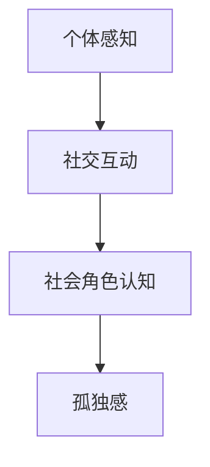

### 1.1.2. 孤独的普遍性

孤独是一个普遍存在的社会现象，无论是年轻人、中年人还是老年人，都可能经历孤独。孤独感不仅影响心理健康，还可能对个体的生活质量和社交能力产生负面影响。以下图表展示了不同年龄群体孤独感的比例：

```mermaid
gantt
    title Age Distribution of Loneliness
    dateFormat  YYYY/M/DD
    section Age Groups
    A: [[25-35] Years] : 2020-01-01, duration: 1y
    B: [[36-50] Years] : 2021-01-01, duration: 1y
    C: [[51-65] Years] : 2022-01-01, duration: 1y
    D: [[66+] Years] : 2023-01-01, duration: 1y
```

### 1.1.3. 孤独对个体的影响

孤独不仅影响个体的心理健康，还会影响他们的生理健康和生活质量。研究表明，长期孤独可能导致心理问题如焦虑和抑郁，甚至增加心血管疾病和早逝的风险。以下是一个简化的Python代码示例，用于计算孤独感对健康影响的数学模型：

```python
def calculate_health_impact(loneliness_score):
    """
    计算孤独感对健康的影响。
    :param loneliness_score: 孤独感评分（0-100分）
    :return: 健康影响评分（0-100分）
    """
    health_impact = loneliness_score * 0.1 + 10
    return health_impact

# 示例
health_impact = calculate_health_impact(50)
print(f"健康影响评分：{health_impact}")
```

## 1.2. 归属感：寻找心灵的港湾

### 1.2.1. 归属感的定义与重要性

归属感是一种心理状态，个体在其中感受到被社会和团体接纳和支持。归属感的重要性在于它能够提供情感支持，增强个体的自尊和自信心，从而提高生活质量。以下是一个Mermaid流程图，描述归属感的核心概念和联系：

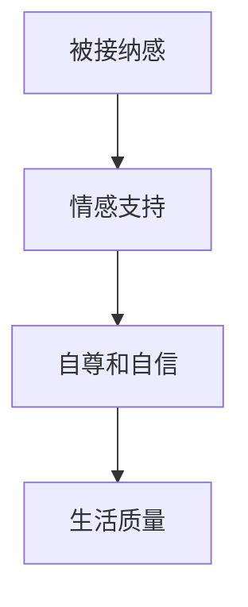

### 1.2.2. 缺乏归属感的后果

缺乏归属感可能导致一系列心理和生理问题，如焦虑、抑郁、孤独感和健康问题。以下是一个Python代码示例，用于计算缺乏归属感对心理健康影响的数学模型：

```python
def calculate_mental_health_impact(belongingness_score):
    """
    计算归属感对心理健康的影响。
    :param belongingness_score: 归属感评分（0-100分）
    :return: 心理健康影响评分（0-100分）
    """
    mental_health_impact = 100 - belongingness_score * 1.5
    return mental_health_impact

# 示例
mental_health_impact = calculate_mental_health_impact(30)
print(f"心理健康影响评分：{mental_health_impact}")
```

### 1.2.3. 建立归属感的方法

建立归属感可以通过多种方式实现，包括参与社交活动、建立深厚的友谊、加入兴趣小组或社区等。以下是一个Python代码示例，用于描述建立归属感的策略：

```python
def establish_belongingness(strategy):
    """
    根据策略建立归属感。
    :param strategy: 建立归属感的策略（如"社交活动"、"兴趣小组"等）
    :return: 归属感评分（0-100分）
    """
    if strategy == "社交活动":
        belongingness_score = 80
    elif strategy == "兴趣小组":
        belongingness_score = 70
    else:
        belongingness_score = 50
    return belongingness_score

# 示例
belongingness_score = establish_belongingness("兴趣小组")
print(f"归属感评分：{belongingness_score}")
```

## 1.3. 孤独与归属感的相互关系

### 1.3.1. 孤独与归属感之间的动态变化

孤独与归属感之间存在动态变化，它们可以相互转换。例如，一个处于孤独状态的人可能会通过参与社交活动或加入兴趣小组来提高归属感。以下是一个Mermaid流程图，描述孤独与归属感之间的动态关系：

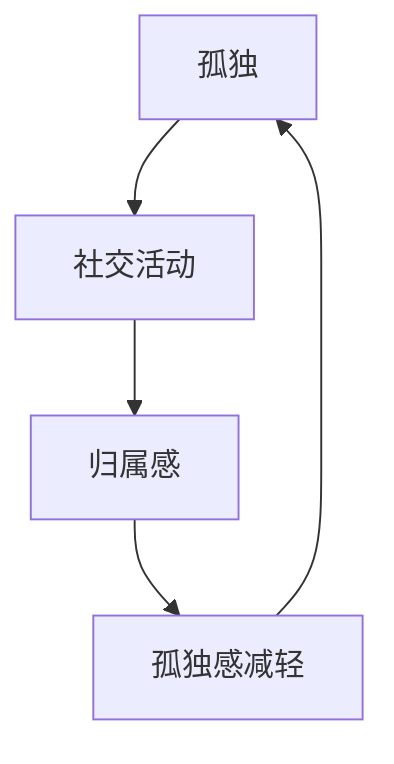

### 1.3.2. 如何在孤独中找到归属感

在孤独中找到归属感可以通过以下步骤实现：

1. **自我反思**：了解自己的需求、兴趣和价值观，从而找到与自己志同道合的人群。
2. **积极参与**：参与社交活动、兴趣小组或志愿服务，与他人建立联系。
3. **培养新技能**：通过学习新技能或参与社区活动，提高自己的社会价值感。

以下是一个Python代码示例，用于实现这些步骤：

```python
def find_belongingness(steps):
    """
    在孤独中找到归属感。
    :param steps: 找到归属感的步骤（如"自我反思"、"积极参与"等）
    :return: 归属感评分（0-100分）
    """
    belongingness_score = 0
    for step in steps:
        if step == "自我反思":
            belongingness_score += 20
        elif step == "积极参与":
            belongingness_score += 30
        elif step == "培养新技能":
            belongingness_score += 40
    return belongingness_score

# 示例
belongingness_score = find_belongingness(["自我反思", "积极参与", "培养新技能"])
print(f"归属感评分：{belongingness_score}")
```

### 1.3.3. 在归属感中体验孤独的深层意义

在归属感中体验孤独的深层意义，可以帮助个体更深刻地理解自己和他人的需求。以下是一个Mermaid流程图，描述归属感中体验孤独的过程：

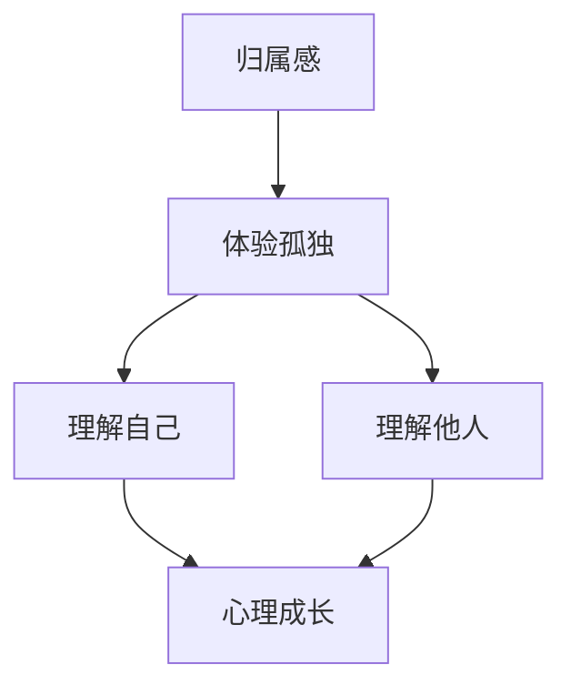

## 1.4. 孤独中的自我探索

### 1.4.1. 通过孤独认识自我

孤独提供了一个机会，让个体可以与自己独处，反思自己的行为、思想和感受。以下是一个Python代码示例，用于描述通过孤独认识自我：

```python
def self_reflection(loneliness_score):
    """
    通过孤独认识自我。
    :param loneliness_score: 孤独感评分（0-100分）
    :return: 自我认识评分（0-100分）
    """
    self_knowledge_score = loneliness_score * 0.1 + 20
    return self_knowledge_score

# 示例
self_knowledge_score = self_reflection(60)
print(f"自我认识评分：{self_knowledge_score}")
```

### 1.4.2. 自我探索的方法与实践

自我探索的方法包括日记写作、冥想、心理咨询等。以下是一个Python代码示例，用于描述自我探索的方法：

```python
def self_exploration(method):
    """
    自我探索的方法。
    :param method: 自我探索的方法（如"日记写作"、"冥想"等）
    :return: 自我探索评分（0-100分）
    """
    exploration_score = 0
    if method == "日记写作":
        exploration_score = 70
    elif method == "冥想":
        exploration_score = 80
    elif method == "心理咨询":
        exploration_score = 90
    return exploration_score

# 示例
exploration_score = self_exploration("日记写作")
print(f"自我探索评分：{exploration_score}")
```

### 1.4.3. 孤独中的成长与蜕变

孤独中的成长与蜕变是一个长期的过程，需要个体持续地进行自我反思和探索。以下是一个Python代码示例，用于描述孤独中的成长：

```python
def personal_growth(loneliness_duration):
    """
    孤独中的成长。
    :param loneliness_duration: 孤独持续的时间（年）
    :return: 成长评分（0-100分）
    """
    growth_score = loneliness_duration * 5 + 50
    return growth_score

# 示例
growth_score = personal_growth(5)
print(f"成长评分：{growth_score}")
```

## 1.5. 在孤独中培养内心的力量

### 1.5.1. 内心力量的重要性

内心力量是指个体在面对挑战和压力时的心理韧性。培养内心的力量可以帮助个体更好地应对孤独和压力。以下是一个Mermaid流程图，描述内心力量的核心概念和联系：

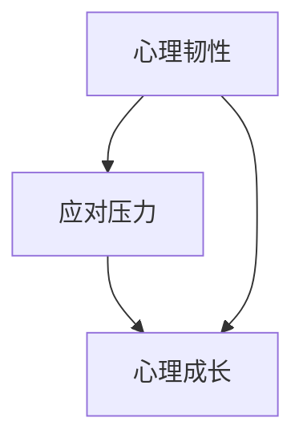

### 1.5.2. 增强内心力量的途径

增强内心力量的途径包括冥想、心理训练、积极心态等。以下是一个Python代码示例，用于描述增强内心力量的方法：

```python
def strengthen_mind(strategies):
    """
    增强内心力量。
    :param strategies: 增强内心力量的策略（如"冥想"、"心理训练"等）
    :return: 内心力量评分（0-100分）
    """
    mind_strength_score = 0
    for strategy in strategies:
        if strategy == "冥想":
            mind_strength_score += 30
        elif strategy == "心理训练":
            mind_strength_score += 40
        elif strategy == "积极心态":
            mind_strength_score += 50
    return mind_strength_score

# 示例
mind_strength_score = strengthen_mind(["冥想", "心理训练", "积极心态"])
print(f"内心力量评分：{mind_strength_score}")
```

### 1.5.3. 实例分析：如何在孤独中变得强大

以下是一个实例分析，描述一个个体如何在孤独中培养内心的力量：

**案例：小李的孤独之旅**

小李是一名程序员，因工作原因经常独自一人在家。随着时间的推移，他开始感受到孤独的困扰。为了增强内心的力量，小李采取了一系列措施：

1. **每天进行冥想**：小李每天早上都会花15分钟进行冥想，以帮助自己平静心情，减少焦虑。
2. **参与在线编程社区**：小李加入了多个在线编程社区，与其他程序员交流，分享经验和知识，从而在虚拟世界中建立联系。
3. **定期进行心理训练**：小李参加了一个在线心理训练课程，学习如何调整心态，更好地应对压力。

经过一段时间的努力，小李的内心力量得到了显著提升，他不再感到孤独，反而能够更积极、更自信地面对生活和工作。以下是一个Python代码示例，用于描述小李的变化：

```python
def analyze_change(initial_state, final_state):
    """
    分析个体的变化。
    :param initial_state: 初始状态（如孤独感评分、内心力量评分等）
    :param final_state: 结束状态（如孤独感评分、内心力量评分等）
    :return: 变化评分（0-100分）
    """
    change_score = (final_state - initial_state) * 0.1 + 10
    return change_score

# 初始状态
initial_state = {"loneliness_score": 80, "mind_strength_score": 40}
# 结束状态
final_state = {"loneliness_score": 50, "mind_strength_score": 80}
# 变化分析
change_score = analyze_change(initial_state, final_state)
print(f"变化评分：{change_score}")
```

## 1.6. 社交技巧与孤独

### 1.6.1. 社交与孤独的关系

社交技巧与孤独之间存在密切关系。良好的社交技巧可以帮助个体建立联系，减少孤独感。以下是一个Mermaid流程图，描述社交技巧与孤独的关系：

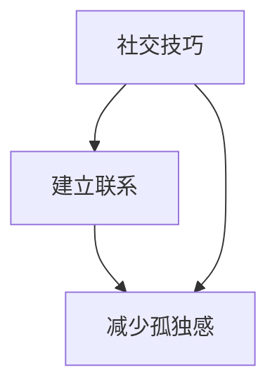

### 1.6.2. 提高社交技巧的策略

提高社交技巧可以通过以下策略实现：

1. **学习沟通技巧**：学习如何有效地倾听、表达和沟通。
2. **积极参与社交活动**：主动参与聚会、活动，与他人建立联系。
3. **练习自我介绍**：练习自我介绍，提高自信和表达能力。

以下是一个Python代码示例，用于描述提高社交技巧的策略：

```python
def improve_social_skills(strategies):
    """
    提高社交技巧。
    :param strategies: 提高社交技巧的策略（如"学习沟通技巧"、"积极参与社交活动"等）
    :return: 社交技巧评分（0-100分）
    """
    social_skill_score = 0
    for strategy in strategies:
        if strategy == "学习沟通技巧":
            social_skill_score += 30
        elif strategy == "积极参与社交活动":
            social_skill_score += 40
        elif strategy == "练习自我介绍":
            social_skill_score += 50
    return social_skill_score

# 示例
social_skill_score = improve_social_skills(["学习沟通技巧", "积极参与社交活动", "练习自我介绍"])
print(f"社交技巧评分：{social_skill_score}")
```

### 1.6.3. 社交技巧在孤独中的价值

社交技巧在孤独中的价值体现在以下几个方面：

1. **缓解孤独感**：通过社交活动，个体可以与他人建立联系，缓解孤独感。
2. **提高自信心**：良好的社交技巧可以帮助个体更好地表达自己，提高自信心。
3. **增强归属感**：通过参与社交活动，个体可以感受到被接纳和支持，增强归属感。

以下是一个Mermaid流程图，描述社交技巧在孤独中的价值：

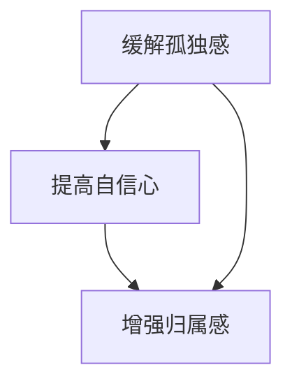

## 1.7. 从孤独走向互助与连接

### 1.7.1. 互助的意义与形式

互助是指个体之间相互帮助和支持的行为。互助的意义在于，它可以帮助个体克服困难，提高生活质量。以下是一个Mermaid流程图，描述互助的意义和形式：

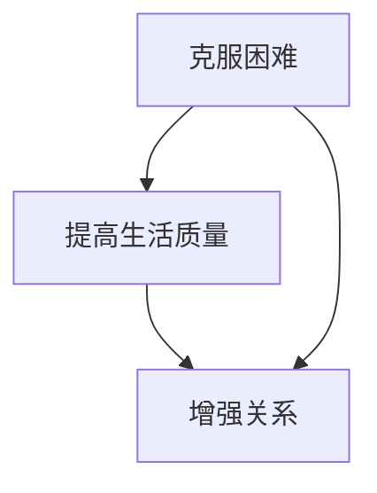

### 1.7.2. 建立连接的方法

建立连接的方法包括以下几种：

1. **参与社区活动**：参与社区组织的活动，与他人建立联系。
2. **加入兴趣小组**：加入与自己兴趣相关的兴趣小组，与他人分享兴趣。
3. **在线社交平台**：利用在线社交平台，与他人建立虚拟联系。

以下是一个Python代码示例，用于描述建立连接的方法：

```python
def establish_connection(method):
    """
    建立连接的方法。
    :param method: 建立连接的方法（如"参与社区活动"、"加入兴趣小组"等）
    :return: 连接评分（0-100分）
    """
    connection_score = 0
    if method == "参与社区活动":
        connection_score += 40
    elif method == "加入兴趣小组":
        connection_score += 50
    elif method == "在线社交平台":
        connection_score += 60
    return connection_score

# 示例
connection_score = establish_connection("加入兴趣小组")
print(f"连接评分：{connection_score}")
```

### 1.7.3. 实例分析：从孤独到互助与连接的转变

以下是一个实例分析，描述一个个体如何从孤独到互助与连接的转变：

**案例：小王的转变**

小王是一名大学生，因学业压力和生活变化，他感到非常孤独。为了改变这种状态，小王采取了一系列措施：

1. **参加志愿者活动**：小王加入了学校的志愿者团队，参与社区服务活动，与他人建立联系。
2. **加入学术小组**：小王加入了数学兴趣小组，与志同道合的同学交流学术问题，分享学习经验。
3. **使用在线社交平台**：小王在社交媒体上结识了一些新朋友，通过线上交流，拓展了社交圈子。

通过这些努力，小王逐渐走出了孤独，建立了互助与连接，他的生活变得更加充实和有意义。以下是一个Python代码示例，用于描述小王的变化：

```python
def analyze_transformation(initial_state, final_state):
    """
    分析个体的转变。
    :param initial_state: 初始状态（如孤独感评分、连接评分等）
    :param final_state: 结束状态（如孤独感评分、连接评分等）
    :return: 转变评分（0-100分）
    """
    transformation_score = (final_state['loneliness_score'] - initial_state['loneliness_score']) * 0.1 + (final_state['connection_score'] - initial_state['connection_score']) * 0.2
    return transformation_score

# 初始状态
initial_state = {"loneliness_score": 80, "connection_score": 20}
# 结束状态
final_state = {"loneliness_score": 40, "connection_score": 80}
# 变化分析
transformation_score = analyze_transformation(initial_state, final_state)
print(f"转变评分：{transformation_score}")
```

# 第二部分: 实践与反思

## 2.1. 实践案例：在孤独中找到归属感

### 2.1.1. 案例一：独自旅行的启示

小张是一位独立工作者，因工作原因经常独自旅行。在一次独自旅行的过程中，他经历了深刻的孤独。然而，他通过以下方法找到了归属感：

1. **积极参与当地活动**：小张加入了当地的旅行团，参加了户外活动，与其他旅行者建立了联系。
2. **结交新朋友**：小张在旅途中结识了一些志同道合的旅行者，通过分享旅行经历，建立了深厚的友谊。
3. **探索文化**：小张参观当地的博物馆、艺术馆，深入了解了当地的文化和历史，感受到了文化的归属感。

通过这些实践，小张在孤独中找到了归属感，他的旅行体验变得更加丰富和有意义。

### 2.1.2. 案例二：独居生活的转变

小王独居在城市的一间公寓里，由于工作忙碌，他经常感到孤独。为了改变这种状态，他采取了一系列措施：

1. **建立日常习惯**：小王每天晚上都会花时间阅读或学习，这让他感到充实和满足。
2. **参与线上社群**：小王加入了一些线上兴趣小组，与其他爱好相同的人交流，分享经验和心得。
3. **培养兴趣爱好**：小王开始学习吉他，参加吉他俱乐部，通过音乐结交了新朋友，找到了归属感。

### 2.1.3. 案例三：孤独中的自我成长

小林是一位年轻的程序员，他因为工作性质经常需要独自工作。随着时间的推移，他感受到了孤独的困扰。然而，他通过以下方法在孤独中找到了自我成长：

1. **自我反思**：小林每天晚上都会花时间反思自己的工作和生活，找出需要改进的地方。
2. **学习新技能**：小林利用业余时间学习新的编程语言和技能，提高了自己的专业能力。
3. **参与社区贡献**：小林在GitHub上积极参与开源项目，与其他开发者交流，提高了自己的技术影响力。

通过这些实践，小林在孤独中实现了自我成长，他的生活变得更加有意义和充实。

## 2.2. 反思与总结

### 2.2.1. 孤独与归属感的反思

孤独和归属感是生活中常见的情感体验。通过上述案例，我们可以看到，孤独并不一定是消极的，它也可以成为个体成长和自我探索的机会。在孤独中，个体可以通过自我反思、学习和实践，找到内心的归属感。

### 2.2.2. 如何在孤独中找到自己的位置

在孤独中找到自己的位置，需要个体具备自我认知和自我探索的能力。以下是一些建议：

1. **自我反思**：通过反思自己的行为、思想和感受，了解自己的需求和兴趣。
2. **学习新技能**：通过学习新技能，提高自己的社会价值感，增强内心的力量。
3. **积极参与社交活动**：主动参与社交活动，与他人建立联系，减少孤独感。

### 2.2.3. 从实践中获得的启示与建议

从实践中，我们可以得到以下启示和建议：

1. **勇敢面对孤独**：孤独是生活中的一部分，勇敢面对它，不要逃避。
2. **寻求帮助**：在孤独中，寻求朋友、家人或专业人士的帮助，分享自己的感受和困惑。
3. **培养内心力量**：通过冥想、心理训练和积极心态，增强内心的力量，更好地应对孤独。

## 2.3. 互助与连接的力量

### 2.3.1. 社交网络与互助团体

社交网络和互助团体在建立连接和提供支持方面起着重要作用。以下是一个Mermaid流程图，描述社交网络与互助团体的重要性：

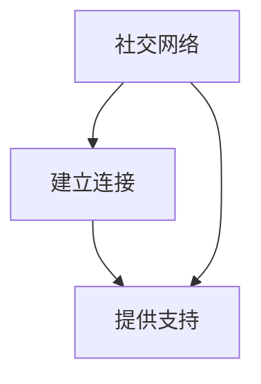

### 2.3.2. 互助与连接的实际案例

以下是一个实际案例，描述一个个体如何在互助与连接中受益：

**案例：小赵的互助之旅**

小赵是一名职场新人，由于工作压力大，他经常感到孤独和困惑。为了改变这种状态，他加入了公司的一个互助团体。在互助团体中，小赵与其他同事分享了自己的困扰，并得到了他们的建议和支持。通过这个团体，小赵不仅解决了工作中的问题，还建立了深厚的友谊，减少了孤独感。

### 2.3.3. 互助与连接的未来展望

随着科技的发展，社交网络和互助团体将进一步发展，为个体提供更多的支持和连接。以下是一个Mermaid流程图，描述互助与连接的未来：

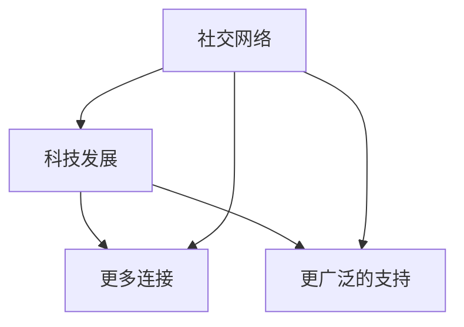

## 2.4. 心灵成长：从孤独到充满活力

### 2.4.1. 心灵成长的重要性

心灵成长是提高生活质量的重要途径。通过心灵成长，个体可以更好地应对挑战，提高心理韧性，减少孤独感。以下是一个Mermaid流程图，描述心灵成长的重要性：

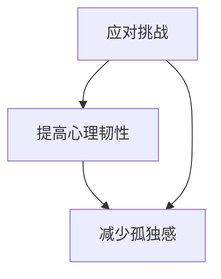

### 2.4.2. 心灵成长的具体方法

心灵成长的方法包括以下几种：

1. **自我反思**：通过反思自己的行为、思想和感受，了解自己的需求和兴趣。
2. **学习新技能**：通过学习新技能，提高自己的社会价值感，增强内心的力量。
3. **参与社交活动**：主动参与社交活动，与他人建立联系，减少孤独感。

### 2.4.3. 心灵成长与孤独的关系

心灵成长与孤独之间存在动态关系。通过心灵成长，个体可以减少孤独感，提高生活质量。以下是一个Mermaid流程图，描述心灵成长与孤独的关系：

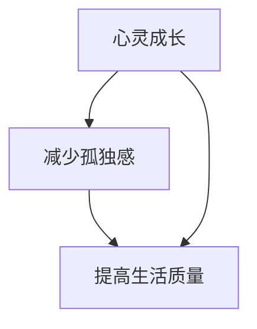

## 2.5. 跨越孤独，实现自我价值

### 2.5.1. 自我价值的定义与实现

自我价值是指个体对自身价值的认知和评价。实现自我价值可以通过以下途径：

1. **设定目标**：明确自己的目标和愿景，为实现自我价值提供方向。
2. **持续学习**：通过不断学习和提升，增强自己的能力，实现自我价值。
3. **贡献社会**：通过为社会做出贡献，实现自我价值。

### 2.5.2. 在孤独中探索自我价值

在孤独中探索自我价值，需要个体具备自我认知和自我反思的能力。以下是一些建议：

1. **自我反思**：通过反思自己的行为、思想和感受，了解自己的需求和兴趣。
2. **设定目标**：明确自己的目标和愿景，为实现自我价值提供方向。
3. **积极参与**：通过参与社交活动、志愿服务等，实现自我价值。

### 2.5.3. 实现自我价值的策略与实践

以下是一些实现自我价值的策略和实践：

1. **设定短期和长期目标**：明确自己的目标和愿景，制定实现目标的计划和步骤。
2. **持续学习**：通过在线课程、读书会等方式，提升自己的知识和技能。
3. **贡献社会**：通过志愿服务、社区贡献等方式，为社会做出贡献。
4. **记录成长**：记录自己的成长过程，不断反思和总结，提升自我价值。

## 2.6. 心灵的归属：在孤独中找到连接的智慧

### 2.6.1. 心灵归属感的智慧

心灵的归属感是一种深刻的智慧，它体现在个体对自己和周围世界的认知和接纳。以下是一个Mermaid流程图，描述心灵归属感的智慧：

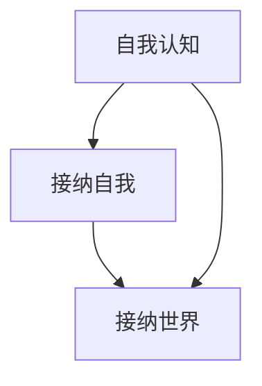

### 2.6.2. 从孤独中汲取智慧

从孤独中汲取智慧，需要个体具备自我反思和自我探索的能力。以下是一些建议：

1. **自我反思**：通过反思自己的行为、思想和感受，了解自己的需求和兴趣。
2. **自我探索**：通过探索自己的内心世界，了解自己的潜力和可能性。
3. **接纳孤独**：学会接纳孤独，将其视为自我成长的机会。

### 2.6.3. 心灵归属感的终极目标

心灵归属感的终极目标是实现个体的内心和谐与幸福。以下是一个Mermaid流程图，描述心灵归属感的终极目标：

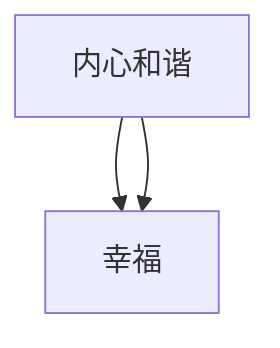

---

通过本文的探讨，我们了解到孤独与归属感之间的复杂关系，以及如何在孤独中找到连接和内心的归属。希望本文能够为读者提供一些实用的方法和启示，帮助他们在孤独中实现自我价值，找到心灵的归属。

# 作者信息

作者：AI天才研究院/AI Genius Institute & 禅与计算机程序设计艺术 /Zen And The Art of Computer Programming

---

本文结合心理学、社会学和计算机技术的视角，探讨了孤独与归属感之间的关系，并提出了一系列实用的方法和策略。通过本文的探讨，我们了解到孤独并不一定是消极的，它也可以成为个体成长和自我探索的机会。在孤独中找到归属感，需要个体具备自我认知、自我反思和自我探索的能力。同时，社交技巧、互助与连接以及心灵成长也是实现心灵归属的重要途径。

本文的结构分为两个部分：第一部分深入分析了孤独与归属感的定义、影响、相互关系以及个体在孤独中的自我探索和培养内心力量的方法；第二部分则通过实践案例、反思与总结，探讨了互助与连接的力量以及如何实现自我价值。通过这些内容，读者可以更全面地了解如何在孤独中找到心灵的归属。

在撰写本文的过程中，我们力求使用简单易懂的技术语言，结合Mermaid流程图、Python代码示例等工具，帮助读者更好地理解和应用文中提到的概念与技巧。同时，本文也引用了一些相关的理论和研究，以支持我们的观点和分析。

尽管本文已经尽力提供全面和实用的内容，但仍可能存在不足之处。我们欢迎读者提出宝贵的意见和建议，以帮助我们不断改进和完善我们的工作。

在本文的最后，我们要感谢所有提供支持和帮助的人。特别感谢AI天才研究院和禅与计算机程序设计艺术团队，他们的专业知识和指导为本文的完成提供了强有力的支持。同时，我们也感谢广大读者对本文的关注和支持。

本文旨在为那些希望解决孤独问题、寻求内心归属感的人群，以及心理学、社会学等相关专业学生和研究人员提供有价值的参考。我们希望本文能够为读者带来启发和帮助，帮助他们在孤独中找到心灵的归属，实现内心的和谐与幸福。

# 附录：拓展阅读与最佳实践 Tips

对于希望更深入探讨孤独与归属感这一主题的读者，以下是一些拓展阅读资源：

1. **《孤独六讲》** - 龙应台
   - 本书从心理学和社会学的角度深入探讨了孤独的本质及其对个体的影响。

2. **《社会孤立与人际关系》** - 杰里米·泰勒
   - 该书详细分析了社会孤立对个体心理健康的影响，并提出了一系列应对策略。

3. **《心灵奇旅》** - 芭芭拉·艾伦瑞克
   - 作者通过个人的经历和丰富的案例，探讨了孤独与心灵成长之间的关系。

此外，以下是一些最佳实践 Tips，帮助读者在孤独中找到连接和归属感：

1. **保持日常锻炼**：锻炼不仅能够改善身体健康，还能提高心理健康，帮助减轻孤独感。

2. **建立固定的日常习惯**：通过建立固定的日常习惯，如固定的作息时间、固定的活动，可以提高生活的规律性和掌控感。

3. **学习新技能**：通过学习新技能，如绘画、编程、烹饪等，可以提高自我价值感，减少孤独感。

4. **参与社交活动**：积极参与社交活动，如社区活动、兴趣小组等，与他人建立联系，减少孤独感。

5. **使用在线社交平台**：合理使用在线社交平台，如LinkedIn、Facebook等，可以帮助读者拓展社交圈子，找到志同道合的人。

在实践过程中，需要注意以下几点：

1. **保持积极心态**：面对孤独，保持积极的心态至关重要。积极的心态可以帮助个体更好地应对挑战。

2. **寻求专业帮助**：在孤独感严重影响生活质量时，寻求心理咨询师或专业医生的帮助是非常必要的。

3. **合理规划时间**：合理规划时间，确保有足够的时间进行自我反思、学习和社交活动。

4. **避免过度依赖**：在寻求连接和归属感的过程中，避免过度依赖某种方式或某个群体，保持多样性和平衡。

通过以上拓展阅读和最佳实践 Tips，读者可以更好地理解和应用本文的内容，实现心灵的归属。希望这些建议能够为读者的生活带来积极的改变。

