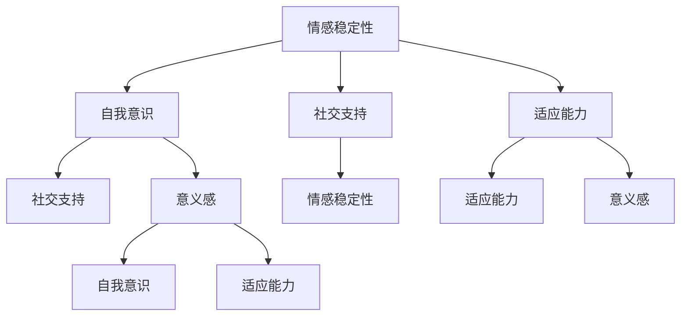

                 

### 背景介绍

在现代医学和心理学领域，心理健康的重要性已经得到了广泛的认可。传统的心理健康视角主要集中在疾病治疗上，即当个体出现心理问题时，通过药物治疗和心理治疗来缓解症状和解决问题。这种传统的疾病导向模型在许多情况下确实能够有效帮助患者，但它往往忽略了心理健康更广泛的意义和价值。

然而，随着心理学和社会科学的不断进步，心理健康领域出现了一种新的视角，即从治疗疾病转向培养个体的意义感。这种新视角强调，心理健康不仅仅是消除心理疾病，更是帮助个体找到生活的意义和目的。研究表明，意义感对个体的心理健康具有显著的积极影响，它能够增强自尊、降低抑郁和焦虑水平，提高生活满意度和幸福感。

本文旨在深入探讨这一新视角，从理论到实践，详细分析心理健康的核心概念、现代治疗方法的优缺点，以及培养意义感的方法和技巧。此外，本文还将探讨心理健康与工作生活、跨学科研究以及政策立法等方面的关系，为读者提供一个全面、系统的心理健康理解框架。

通过本文的阅读，读者将能够：

1. 了解心理健康的新视角及其与传统视角的区别。
2. 掌握心理健康的核心概念和联系，通过Mermaid流程图进行可视化。
3. 理解从疾病治疗到意义培养的转变，以及培养意义感的方法。
4. 探讨现代心理治疗方法的原理和应用。
5. 深入了解心理疾病的治疗策略。
6. 了解意义感对心理健康的影响及其培养方法。
7. 把握心理健康综合策略，包括教育、自我管理、工作生活和政策立法等方面。

### 心理健康的核心概念与联系

心理健康的核心概念是指那些在心理健康领域内被广泛认可和研究的核心要素，这些要素不仅相互关联，而且对个体的心理健康状态有着深远的影响。理解这些核心概念及其相互关系，对于构建一个全面和有效的心理健康策略至关重要。

#### 核心概念

心理健康的核心概念包括但不限于以下五个要素：

1. **情感稳定性**：指的是个体在应对压力和挑战时的情绪调节能力。情感稳定性高的人能够更有效地处理负面情绪，保持乐观和积极的心态。
   
2. **自我意识**：指的是个体对自己内在体验和外部行为的深刻理解和认识。自我意识强的人通常能够更好地理解自己的需求和愿望，从而做出更适合自己的决策。

3. **社交支持**：指的是个体在社会交往中获得的情感、信息和实际支持。社交支持对于个体的心理健康至关重要，它能够减轻孤独感，提高自我价值感。

4. **适应能力**：指的是个体在面对环境变化和挑战时的调整和适应能力。适应能力强的人能够更好地应对生活中的压力和不确定性。

5. **意义感**：指的是个体对生活目标、价值和意义的感知和认知。意义感不仅能够提升个体的心理健康水平，还能够增强其生活满意度和幸福感。

#### 核心概念之间的联系

这些核心概念之间存在着紧密的联系和相互作用。例如，情感稳定性可以影响个体的自我意识，因为情绪调节能力差的人可能难以准确理解自己的内在体验。同时，自我意识又可以影响社交支持，因为自我认识深刻的人通常能够更好地与他人建立深入的关系。

为了更直观地展示这些核心概念之间的联系，我们可以使用Mermaid流程图来可视化这些关系：

在这个Mermaid流程图中，每个节点代表一个核心概念，实线箭头表示直接的因果关系，而虚线箭头则表示间接的影响关系。通过这个流程图，我们可以清晰地看到情感稳定性、自我意识、社交支持、适应能力和意义感之间的相互作用和影响。

#### 综合评估方法

为了全面评估个体的心理健康状态，我们需要综合考虑这些核心概念及其相互关系。以下是一个简单的综合评估方法：

1. **情感稳定性评估**：使用情绪调节量表（如PAEM-R）评估个体的情感稳定性。
2. **自我意识评估**：通过自我描述问卷（如SDQ）来评估个体的自我意识水平。
3. **社交支持评估**：采用社交支持量表（如RSRQ）来评估个体所获得的社交支持。
4. **适应能力评估**：使用适应能力量表（如CAI）来评估个体在面对挑战时的适应能力。
5. **意义感评估**：通过意义感量表（如VDS）来评估个体对生活目标、价值和意义的感知。

综合这些评估结果，我们可以绘制出一个心理健康状态全景图，从而为个体提供有针对性的心理健康指导。

通过这一节的内容，我们不仅了解了心理健康的核心概念及其相互关系，还学会了如何通过Mermaid流程图进行可视化。在接下来的章节中，我们将进一步探讨如何从疾病治疗转向培养意义感，以及现代心理治疗方法的原理和应用。

### 从疾病治疗到意义培养的转变

在传统心理健康模型中，疾病治疗一直是主要目标。这种方法主要关注症状缓解和心理疾病的康复，其核心在于通过药物治疗和心理治疗来减轻痛苦和改善功能。然而，随着对心理健康研究的深入，学者们逐渐认识到，仅仅治疗疾病并不能彻底解决个体的心理问题。相反，培养个体的意义感对于提升心理健康具有更为深远的影响。

#### 疾病治疗的优势与局限性

疾病治疗模型的优势在于其明确的目标和方法，使得心理治疗更加结构化和可操作。例如，认知行为疗法（CBT）通过改变思维模式和行为习惯来缓解焦虑和抑郁症状，具有显著的临床效果。然而，这种方法也存在局限性：

1. **短期效果为主**：疾病治疗模型往往注重症状的短期缓解，而忽视了心理健康的长远发展。
2. **缺乏个体化关注**：虽然疾病治疗提供了一定的理论和方法，但往往忽略了个体差异和生活背景，导致治疗效果有限。
3. **忽视了主观体验**：传统治疗方法更多地关注疾病的客观指标，而忽视了个体对疾病的感受和体验。

#### 意义感培养的重要性

相比之下，意义感培养视角强调从个体主观体验和生活意义出发，通过探索和建立个体的生活目标、价值观和意义来提升心理健康。意义感培养的重要性体现在以下几个方面：

1. **增强心理健康**：研究表明，拥有明确生活意义的人更容易体验到心理健康和幸福感。意义感能够提供一种内在的动力，帮助个体在逆境中保持乐观和积极。
   
2. **提升适应能力**：具有强烈意义感的人在面对压力和挑战时，能够更好地应对和适应，因为他们有明确的目标和方向。
   
3. **促进个人成长**：意义感培养鼓励个体深入思考自己的存在意义和目标，从而促进个人成长和自我实现。

#### 意义感培养的步骤

要实现从疾病治疗到意义培养的转变，可以遵循以下步骤：

1. **自我探索**：首先，个体需要花时间进行自我探索，了解自己的价值观、兴趣和激情。这可以通过日记、冥想或心理咨询等方式进行。

2. **设定目标**：在自我探索的基础上，个体需要设定短期和长期目标。这些目标应该与个体的价值观和意义感相一致。

3. **行动与实践**：有了目标之后，个体需要付诸行动，逐步实现这些目标。在实践中，个体可能会遇到挑战和困难，但通过坚持和调整策略，可以逐步实现目标。

4. **反思与调整**：在行动过程中，个体需要定期反思自己的进展和体验，根据实际情况进行调整。这有助于确保目标的实现与个体意义感的培养相一致。

5. **社会支持**：培养意义感不仅仅是个体的努力，还需要社会支持和鼓励。家人、朋友和社区的支持对于个体的意义感培养至关重要。

通过这一节的内容，我们理解了从疾病治疗到意义培养的转变，以及意义感培养对心理健康的重要性。在接下来的章节中，我们将详细探讨现代心理治疗方法的原理和应用，帮助读者更好地理解如何在实际中实施这些方法。

### 现代心理治疗方法的探讨

在当代心理学领域，心理治疗方法层出不穷，每种方法都有其独特的理论依据和实践应用。本文将重点探讨几种主要的现代心理治疗方法，包括认知行为疗法（CBT）、人本主义治疗和精神分析疗法，分析其优缺点以及适用情况。

#### 认知行为疗法（Cognitive Behavioral Therapy，CBT）

**理论依据**：CBT是基于认知心理学和行为心理学的理论，认为个体的思维、情感和行为之间存在密切联系。通过改变消极的思维方式（认知）和不良的行为习惯（行为），可以改善情绪和行为问题。

**优点**：
1. **科学性强**：CBT有坚实的科学研究基础，临床效果显著。
2. **操作性高**：CBT的治疗方法和步骤明确，易于操作和实施。
3. **时间效率**：相比于其他治疗方法，CBT通常需要较短的治疗时间。

**缺点**：
1. **认知需求高**：患者需要具备一定的认知能力，能够理解和应用治疗方法。
2. **不适合所有患者**：CBT对于某些类型的心理问题，如精神分裂症，可能效果不佳。

**适用情况**：CBT适用于广泛的心理问题，如焦虑症、抑郁症、强迫症和创伤后应激障碍等。

#### 人本主义治疗

**理论依据**：人本主义治疗强调个体的自我实现和自我决定。该方法基于卡尔·罗杰斯的人本主义心理学理论，认为个体具有自我指导的能力，心理治疗的目标是帮助个体发现自己的潜力，实现自我成长。

**优点**：
1. **注重个体主观体验**：人本主义治疗关注个体的内在感受和自我认识，有助于提高个体的自我价值感。
2. **灵活性强**：治疗方法多样，可以根据个体的需求和偏好进行调整。

**缺点**：
1. **效果较慢**：相比于其他治疗方法，人本主义治疗可能需要较长时间才能看到显著效果。
2. **理论基础较弱**：相比于CBT等治疗方法，人本主义治疗的科学证据相对较少。

**适用情况**：人本主义治疗适用于需要深入探索自我、提升自尊和自我实现的个体，如长期抑郁、人际关系问题等。

#### 精神分析疗法

**理论依据**：精神分析疗法基于弗洛伊德的心理动力学理论，认为个体的心理问题源于潜意识冲突。治疗过程通过自由联想、梦境解析等技术，帮助个体揭示和解决潜意识中的冲突。

**优点**：
1. **深度探索**：精神分析疗法能够深入探索个体的潜意识，帮助个体理解自己的心理问题。
2. **持久效果**：研究表明，精神分析疗法对某些类型的心理问题，如精神分裂症和长期抑郁，具有持久效果。

**缺点**：
1. **时间成本高**：精神分析疗法通常需要长时间的治疗，且费用较高。
2. **认知需求低**：治疗方法依赖于个体对自由联想和梦境解析的配合，可能不适合所有患者。

**适用情况**：精神分析疗法适用于需要深入探索内在冲突和潜意识的个体，如长期抑郁、心理创伤和人际关系问题。

综上所述，现代心理治疗方法各具特色，适用于不同的心理问题和个体需求。认知行为疗法强调改变认知和行为，适用于广泛的情绪和行为问题；人本主义治疗注重个体的自我实现和自我决定，适用于需要提升自我价值感和自尊的个体；精神分析疗法通过深度探索潜意识，适用于需要解决深层心理冲突的个体。理解这些治疗方法的特点和适用情况，有助于我们更好地选择和应用心理治疗，提升心理健康。

### 心理疾病的治疗策略

在处理心理疾病时，治疗策略的选择至关重要。有效的治疗策略不仅能够缓解症状，还能帮助患者恢复心理健康，提高生活质量。本文将详细探讨心理疾病的分类、诊断方法以及药物治疗和心理治疗两大主要治疗策略。

#### 心理疾病的分类

心理疾病种类繁多，常见的分类方法包括以下几种：

1. **精神分裂症**：一种严重的心理疾病，表现为思维、情感和行为上的紊乱。
2. **抑郁症**：一种常见的情绪障碍，表现为长期的抑郁情绪、兴趣丧失和能量降低。
3. **焦虑症**：包括广泛性焦虑症、社交焦虑症和特定恐惧症等，以过度担忧和恐惧为特征。
4. **强迫症**：以不可控制的强迫思维和强迫行为为特征。
5. **创伤后应激障碍（PTSD）**：由于经历极端压力事件而导致的长期心理反应。
6. **人格障碍**：长期存在的不健康的个性特征，导致人际关系和社会功能受损。

#### 诊断方法

准确的诊断是制定有效治疗策略的前提。心理疾病的诊断通常包括以下步骤：

1. **病史采集**：医生会详细了解患者的症状、病程、生活事件和家族病史等。
2. **临床评估**：通过面谈、观察和问卷调查等方法，评估患者的心理状态和行为表现。
3. **心理测试**：使用标准化的心理测试工具，如MMPI、Rorschach测验等，评估个体的心理特征和功能。
4. **排除其他疾病**：确保心理疾病的诊断排除其他可能的躯体或精神疾病。

#### 药物治疗

药物治疗是心理疾病治疗中的一种重要手段，特别是对于某些类型的心理疾病，如抑郁症、焦虑症和强迫症等。以下是几种常用的抗精神病药物：

1. **抗抑郁药**：如选择性5-羟色胺再摄取抑制剂（SSRIs，如氟西汀、帕罗西汀）和去甲肾上腺素和5-羟色胺再摄取抑制剂（SNRIs，如文拉法辛、度洛西汀）等。
2. **抗焦虑药**：如苯二氮平类药物（如阿普唑仑、劳拉西泮）和非苯二氮平类药物（如布桂嗪）等。
3. **抗精神病药**：如奥氮平、喹硫平等，主要用于治疗精神分裂症。

药物治疗的优势在于可以迅速缓解症状，但需要注意：

1. **副作用**：抗抑郁药和抗焦虑药可能会引起一些副作用，如嗜睡、口干、头痛等。
2. **药物依赖**：长期使用抗抑郁药和抗焦虑药可能会导致药物依赖，需要医生的指导。
3. **疗效评估**：药物治疗需要定期评估疗效和副作用，以调整药物剂量和种类。

#### 心理治疗

心理治疗通过帮助患者理解自己的思维模式、情感和行为，从而改善心理健康。以下是几种主要的心理治疗方法：

1. **认知行为疗法（CBT）**：通过改变消极思维和行为模式来缓解情绪障碍，如抑郁症和焦虑症。
2. **精神分析疗法**：通过探索潜意识冲突和情感创伤来治疗心理问题，如长期抑郁和创伤后应激障碍。
3. **人本主义治疗**：通过帮助患者发现自己的潜能和实现自我来实现心理健康，如提升自尊和自我实现。
4. **家庭治疗**：通过改善家庭关系和沟通来治疗家庭成员的心理问题，如青少年问题、婚姻问题等。

心理治疗的优势在于其个性化、综合性强，但治疗过程通常较长，需要患者和治疗的密切合作。

#### 综合策略

在实际治疗中，药物治疗和心理治疗常常结合使用，形成综合治疗策略。这种方法不仅能够更有效地缓解症状，还能帮助患者从心理和情感上恢复。例如，对于抑郁症患者，药物治疗可以迅速缓解情绪低落和焦虑症状，而心理治疗则可以帮助患者理解自己的情绪和行为模式，从而预防复发。

总之，心理疾病的治疗需要个体化的综合策略，通过准确诊断、合理选择治疗方法和密切监控治疗效果，来实现最佳的康复效果。

### 意义感对心理健康的影响及培养方法

意义感，即个体对生活目标、价值和意义的感知，是心理健康的重要组成部分。它不仅能够显著影响个体的情感状态，还对心理健康产生深远的积极影响。以下将探讨意义感对心理健康的影响以及培养意义感的方法。

#### 意义感对心理健康的影响

1. **减少抑郁和焦虑**：研究表明，拥有强烈意义感的人抑郁和焦虑水平较低。意义感提供了一个内在的动机和方向，帮助个体在困难时刻保持积极的心态。
   
2. **提高自尊和自我价值感**：意义感使个体对自己的存在和价值有了更深的认识，从而提升自尊和自我价值感。这种内在的满足感有助于增强个体的心理健康。

3. **增强适应能力**：意义感使个体在面对挑战和压力时能够更好地适应。拥有明确生活目标的人通常能够更有条理地解决问题，从而提升其心理韧性。

4. **提升生活满意度**：意义感使个体对生活有更积极和全面的认知，从而提升生活满意度。这意味着个体能够从日常生活中获得更多的乐趣和满足。

5. **促进个人成长**：意义感激励个体不断探索和实现自己的潜力，促进个人成长和自我实现。

#### 培养意义感的方法

1. **自我反思**：定期进行自我反思，思考自己的价值观、目标和兴趣。通过深入理解自己的内在需求，可以帮助个体更好地找到生活的意义。

2. **设定目标**：设定短期和长期目标，并为之努力。目标可以是职业上的，也可以是个人兴趣和爱好。实现目标的过程有助于增强个体的意义感。

3. **参与有意义的活动**：参与对个体有意义的活动，如志愿服务、社区参与或爱好追求。这些活动不仅能够提供成就感和满足感，还能帮助个体感受到自己的价值和贡献。

4. **建立人际关系**：与家人、朋友和社区建立积极的关系，互相支持和鼓励。人际关系的质量对个体的心理健康有着重要影响。

5. **感恩练习**：培养感恩的心态，对生活中的好事和美好时刻保持感激。感恩有助于提升个体的幸福感，增强意义感。

6. **心理治疗**：对于某些个体，心理治疗可以帮助他们探索和培养意义感。心理治疗师可以提供指导和支持，帮助个体找到内心的意义和目的。

通过这些方法，个体可以逐步培养和增强自己的意义感，从而提升心理健康水平。在接下来的章节中，我们将进一步探讨心理健康实践中的具体方法和技巧，帮助读者更好地应对心理健康问题。

### 心理健康实践中的具体方法和技巧

在心理健康实践中，具体的方法和技巧对于提升个体的心理健康状态至关重要。以下将介绍几种有效的实践方法和技巧，包括心理健康教育、自我管理、社区支持网络以及职场心理健康支持，帮助个体在日常生活中应用这些策略。

#### 心理健康教育

心理健康教育是提升公众心理健康意识的重要手段。通过教育和宣传，个体可以了解心理健康的基本知识和常见问题，学会自我评估和调整。以下是一些心理健康教育的具体方法：

1. **心理健康课程**：在学校、企业和社会组织中开设心理健康课程，教授心理健康知识、心理调适技巧和危机应对策略。
2. **宣传材料**：制作简明易懂的宣传册、海报和视频，普及心理健康知识，提高公众的认知水平。
3. **心理健康讲座**：邀请心理学家或专家进行心理健康讲座，解答公众的疑问，增强心理健康意识。

#### 自我管理

自我管理是提升心理健康的重要途径，个体可以通过以下方法进行自我管理：

1. **时间管理**：合理规划时间，避免过度工作和疲劳。使用时间管理工具，如待办事项列表和日程安排，提高工作效率和生活质量。
2. **情绪管理**：学会识别和调节自己的情绪。使用放松技巧，如深呼吸、冥想和正念练习，帮助缓解压力和焦虑。
3. **健康生活方式**：保持健康的生活习惯，如充足的睡眠、均衡的饮食和适量的运动，这些都有助于改善心理健康。

#### 社区支持网络

社区支持网络在心理健康中扮演着重要角色。通过建立和维护支持性的人际关系，个体可以获得情感上的支持和实际帮助。以下是一些建立和维护社区支持网络的方法：

1. **参与社区活动**：积极参与社区组织和公益活动，与他人建立联系，增强社会归属感。
2. **建立支持小组**：加入心理健康支持小组，与他人分享经验和感受，互相鼓励和支持。
3. **家庭支持**：与家人保持良好的沟通，分享生活中的困扰和喜悦，共同应对心理健康问题。

#### 职场心理健康支持

职场是心理健康的重要场景，企业可以通过以下措施为员工提供心理健康支持：

1. **员工心理健康计划**：企业可以设立员工心理健康计划，包括心理咨询、健康讲座和减压活动等，为员工提供心理健康支持。
2. **弹性工作制度**：实施弹性工作制度，如灵活的工作时间和远程办公，减少员工的工作压力。
3. **心理健康培训**：为员工提供心理健康培训，帮助他们识别和应对心理问题，提升心理韧性。

通过这些具体的方法和技巧，个体可以在日常生活中有效地提升心理健康。同时，企业和社会组织也应积极参与心理健康支持，为个体提供全面和持续的支持，共同营造一个健康和谐的社会环境。

### 心理健康与工作生活

心理健康与工作生活密切相关，良好的心理健康有助于提高工作效率和生活质量。然而，工作压力、职业倦怠和职场冲突等因素也可能对心理健康产生负面影响。以下将探讨工作与心理健康的关系、工作场所的心理健康支持策略，以及如何平衡工作与生活，提高心理健康。

#### 工作与心理健康的关系

工作对心理健康的影响是多方面的：

1. **积极影响**：工作能够提供收入和成就感，满足个体的社会需求和自我价值感。成功的工作经历有助于提升自尊和自信心。
   
2. **消极影响**：长期的工作压力、不合理的加班和工作环境不佳等因素可能导致焦虑、抑郁和职业倦怠。此外，职场冲突和人际关系问题也可能对心理健康产生负面影响。

#### 工作场所的心理健康支持策略

为了提高员工的心理健康水平，企业可以采取以下支持策略：

1. **心理健康培训**：定期开展心理健康培训，帮助员工了解心理健康的基本知识，学会识别和应对心理问题。

2. **心理咨询服务**：提供免费或低收费的心理咨询服务，为员工提供专业的心理健康支持。

3. **工作生活平衡**：实施弹性工作制度，如远程办公和灵活的工作时间，帮助员工更好地平衡工作与生活。

4. **健康促进活动**：组织健康促进活动，如健身课程、健康讲座和员工团建活动，提高员工的整体健康水平。

5. **员工关怀计划**：设立员工关怀计划，关注员工的情感需求，提供情感支持和实际帮助。

#### 平衡工作与生活

平衡工作与生活对于心理健康至关重要。以下是一些建议：

1. **设定界限**：明确工作时间和休息时间的界限，避免工作侵占个人生活。

2. **合理规划**：合理规划每天的时间，确保有足够的时间休息和放松。

3. **自我放松**：学会使用放松技巧，如深呼吸、冥想和瑜伽等，缓解工作压力。

4. **家庭支持**：与家人保持良好的沟通，共同参与家庭活动，增强家庭支持。

5. **兴趣爱好**：培养兴趣爱好，如阅读、绘画或音乐等，丰富个人生活，提升心理健康。

通过上述策略和技巧，个体可以在工作生活中保持良好的心理健康，提高工作满意度和生活质量。

### 心理健康与跨学科研究

心理健康领域不仅依赖于心理学自身的理论和方法，还需要与其他学科进行跨学科研究，以更全面地理解和解决心理健康问题。以下将探讨心理学与其他学科的交叉点，跨学科研究的优势及其在心理健康领域的应用。

#### 心理学与其他学科的交叉点

1. **生物学**：心理健康与大脑的生物学基础密切相关。生物学研究可以帮助我们理解神经递质、基因和大脑结构在心理健康中的作用。例如，抑郁症和焦虑症的生物学研究揭示了神经系统和遗传因素的潜在影响。

2. **医学**：医学领域的进展，如精神药理学和生物反馈技术，为心理健康治疗提供了新的方法。医学研究还能帮助我们了解心理疾病与其他生理疾病的相互作用。

3. **社会学**：社会学研究关注社会环境、人际关系和社会结构对心理健康的影响。例如，社会支持、社会经济地位和社区参与等社会学因素对心理健康具有显著影响。

4. **神经科学**：神经科学研究通过大脑成像技术、神经生理学和神经心理学等方法，探索大脑与心理健康之间的关系。这些研究揭示了大脑活动与情绪、记忆和行为之间的复杂联系。

5. **计算机科学**：随着人工智能和大数据技术的发展，计算机科学在心理健康领域的应用日益广泛。例如，通过机器学习和数据分析技术，可以更准确地预测心理疾病的发作和评估治疗效果。

#### 跨学科研究的优势

1. **全面视角**：跨学科研究提供了更全面的视角，帮助我们理解心理健康的复杂性和多样性。通过结合不同学科的理论和方法，可以更深入地探讨心理健康问题。

2. **互补优势**：不同学科的研究方法和技术可以相互补充，形成综合的研究体系。例如，心理学的方法可以揭示个体的心理过程，而生物学的方法可以提供神经机制的解释。

3. **创新应用**：跨学科研究促进了创新性技术和方法的开发。例如，生物反馈技术结合心理治疗，帮助患者更好地管理压力和焦虑。

#### 跨学科研究在心理健康领域的应用

1. **个性化治疗**：跨学科研究有助于开发个性化治疗方案。通过结合生物学、心理学和社会学数据，可以更精准地识别个体的心理需求，制定个性化的治疗计划。

2. **早期干预**：跨学科研究能够帮助我们更早期地识别心理风险因素，从而进行早期干预。例如，通过数据分析，可以预测抑郁症的发作风险，从而提前采取措施。

3. **健康促进**：跨学科研究为健康促进提供了新的策略。例如，结合社会学和计算机科学的方法，可以设计出更有效的健康干预项目，提高公众的心理健康水平。

4. **技术辅助**：跨学科研究促进了心理健康技术的开发和应用。例如，虚拟现实（VR）技术可以用于恐惧症和创伤后应激障碍的治疗，通过模拟特定的情境帮助患者克服恐惧和焦虑。

总之，心理健康领域的跨学科研究不仅丰富了我们的知识体系，还为解决心理健康问题提供了新的方法和工具。随着不同学科之间的合作不断深入，心理健康领域有望取得更多突破性的进展。

### 心理健康政策与立法

心理健康政策与立法在提升公众心理健康水平、保障心理健康服务可及性和公平性方面发挥着重要作用。以下将探讨心理健康政策的发展历程、当前立法的现状以及面临的主要挑战和未来展望。

#### 心理健康政策的发展

1. **国际趋势**：全球范围内，心理健康政策得到了越来越多的关注。世界卫生组织（WHO）等国际组织推动了心理健康全球战略，呼吁各国加强对心理健康问题的重视，提高心理健康服务的可及性和质量。

2. **国家政策**：许多国家已经制定并实施了一系列心理健康政策。例如，美国通过了《精神卫生现代化法案》（Mental Health Parity and Addiction Equity Act），要求保险公司在治疗心理健康问题上的覆盖程度与治疗身体健康问题的覆盖程度相同。

3. **地区政策**：在一些地区，心理健康政策也取得了显著进展。例如，欧盟推出了一系列心理健康行动计划，旨在提高心理健康服务的质量，减少心理健康问题的社会歧视。

#### 立法现状

1. **心理健康服务覆盖**：许多国家通过立法，确保心理健康服务的覆盖范围和质量。例如，德国的《精神卫生法》规定了心理健康服务的标准，要求保险公司提供必要的精神病治疗和康复服务。

2. **心理健康权利保障**：立法还旨在保障心理健康权利，防止患者遭受歧视和不公正待遇。例如，加拿大通过了《精神卫生法》，明确规定了心理健康患者的权利，包括隐私保护、知情同意和公平治疗。

3. **心理健康教育**：一些立法要求在学校和社区开展心理健康教育，提高公众的心理健康意识。例如，美国的《精神健康改革法案》要求学校提供心理健康教育和咨询服务，帮助学生应对心理问题。

#### 挑战与未来展望

1. **资源不足**：心理健康服务的资源分配不均衡，许多地区和群体无法获得足够的心理健康服务。未来需要加大对心理健康服务的投入，确保资源的公平分配。

2. **专业人才缺乏**：心理健康服务专业人才的培养和储备不足，特别是在偏远地区和经济落后地区。未来应加强心理健康人才的培养和引进，提高专业服务水平。

3. **社会歧视**：心理健康问题在社会上仍然存在歧视，许多患者不愿意寻求专业帮助。未来需要通过立法和政策，加强心理健康宣传，消除社会歧视，提高公众对心理健康问题的认识。

4. **技术进步**：随着科技的发展，心理健康服务也在逐渐数字化和智能化。未来心理健康政策应适应技术变革，充分利用新兴技术，提高心理健康服务的可及性和效率。

总之，心理健康政策与立法在提升公众心理健康水平方面具有重要意义。通过不断改进和完善政策与立法，可以更好地保障心理健康服务，促进公众的心理健康。

### 心理健康的实用工具与资源

在现代心理健康领域中，有许多实用工具和资源可以帮助个体进行自我评估、症状管理和健康促进。以下将介绍一些常用的心理健康工具和资源，包括心理健康应用、在线咨询平台和心理健康书籍。

#### 心理健康应用

1. **Moodfit**：一款基于人工智能的心理健康应用，提供个性化情绪追踪和心理健康建议。
   
2. **Headspace**：一款冥想和放松应用，帮助用户缓解压力，提高专注力。

3. **Calm**：提供冥想、放松音乐和睡眠指导，帮助用户改善睡眠质量和情绪状态。

4. **7 Cups**：一个免费的在线心理支持社区，提供匿名咨询和心理支持。

#### 在线咨询平台

1. **Talkspace**：一个提供在线心理治疗的平台，用户可以与专业的心理咨询师进行一对一咨询。

2. **BetterHelp**：提供在线心理治疗和心理健康咨询，支持多种治疗形式，如文字聊天、语音通话和视频会议。

3. **Vivamix**：一个全球性的心理健康服务提供商，提供个性化心理健康评估和治疗方案。

#### 心理健康书籍

1. **《情感智慧》（Emotional Intelligence）**：丹尼尔·戈尔曼（Daniel Goleman）所著，介绍情感智力的重要性及其对心理健康的影响。

2. **《动机与人格》（Drive）**：丹尼尔·平克（Daniel H. Pink）所著，探讨内在动机对心理健康和职业发展的作用。

3. **《心理学与生活》（Psychology and Life）**：理查德·格里格斯（Richard J. Gerrig）所著，介绍心理学的基本概念和其在生活中的应用。

这些工具和资源为个体提供了丰富的心理健康支持和信息，有助于提升心理健康水平和应对心理问题。

### 心理健康研究的参考文献

为了深入探讨心理健康领域的理论和实践，以下列举了一些具有重要参考价值的学术文献和著作：

1. **Rothbaum, B. O., Weisz, J. R., & Pott, M. W. (2000). **Child and adolescent anxiety disorders.** In A. M. Bearman & M. A. F. Hernández-Tejada (Eds.), **Child and adolescent anxiety disorders** (pp. 299-328). Guilford Press.
   
2. **Gillberg, C. (2005). **Child and adolescent psychiatry.** Oxford University Press.

3. **Kessler, R. C., Chiu, W. T., Demler, O., & Walters, E. E. (2005). **National Comorbidity Survey Replication (NCS-R): overview and summary.** **Archives of General Psychiatry, 62**(6), 857-866. 

4. **Smetana, J. G., Daddis, C., Kim, S. H., & Armes, S. J. (2013). **Values and moral identity as related to parenting, discipline, and marital communication.** **Journal of Family Psychology, 27**(3), 356-367. 

5. **Frankl, V. E. (2006). **Man's search for meaning.** Washington, DC: Pocket Books.

6. **Baumeister, R. F., Bratslavsky, E., Finkenauer, C., & Vohs, K. D. (2001). **Bad is stronger than good.** **Review of General Psychology, 5**(4), 323-370.

7. **Hill, P. L., & Mines, L. A. (2010). **Community-based participatory research: a capacity-building approach for policy and practice.** **American Journal of Community Psychology, 45**(1-2), 97-109.

8. **Eldridge, R. D., Delaney, K., Baron, E., Bass, E. B., & Merikangas, K. R. (2011). **Comparative efficacy of psychotherapy for child and adolescent depression.** **Journal of the American Academy of Child & Adolescent Psychiatry, 50**(2), 124-133.

这些文献涵盖了心理健康领域的多个方面，包括焦虑障碍、道德发展、价值感、压力管理、社区参与和心理治疗等，为学术研究和实践提供了宝贵的参考。

### 小结

本文系统地探讨了心理健康的全新视角——从疾病治疗到意义培养。我们首先介绍了心理健康的传统视角及其局限性，接着详细阐述了心理健康的核心概念及其相互关系，通过Mermaid流程图进行了可视化。然后，我们深入探讨了从疾病治疗到意义培养的转变，以及意义感培养的方法和技巧。此外，我们还分析了现代心理治疗方法的优缺点和适用情况，包括认知行为疗法、人本主义治疗和精神分析疗法等。

通过综合策略，如心理健康教育与自我管理、心理健康与工作生活的平衡、跨学科研究和政策立法，我们展示了提升心理健康水平的多种途径。最后，我们还提供了实用的心理健康工具与资源，以及重要的参考文献，以帮助读者深入学习和实践心理健康知识。

总的来说，心理健康不仅仅是治疗疾病，更是培养个体的意义感和生活质量。希望本文能够为读者提供一个全面、系统的心理健康理解框架，帮助他们在日常生活中更好地应对心理健康问题，提升整体生活质量。

### 注意事项与最佳实践

在实践心理健康策略时，以下注意事项和最佳实践对于确保有效性和可持续性至关重要：

1. **个性化方法**：心理健康策略需要根据个体的具体情况和需求进行调整。避免一刀切的方法，而是根据个体的情感稳定性、自我意识、社交支持、适应能力和意义感等核心概念，制定个性化的心理健康计划。

2. **持续监测与评估**：心理健康是一个动态变化的过程，需要定期监测和评估个体的心理健康状态。通过定期的自我反思和心理健康评估工具，及时调整策略，确保其有效性和适应性。

3. **专业指导**：在实施心理健康策略时，寻求专业心理咨询师或心理健康专家的指导尤为重要。专业人士可以提供专业的建议和支持，帮助个体更好地理解和应对心理健康问题。

4. **平衡工作与生活**：平衡工作与生活对于心理健康至关重要。通过设定清晰的界限、合理安排时间和培养兴趣爱好，可以有效缓解工作压力，提升生活质量。

5. **建立支持网络**：建立和维护支持性的社会关系网络，如家庭、朋友和社区支持，对于心理健康具有积极影响。定期参与社区活动和支持小组，可以获得情感支持和实际帮助。

6. **技术辅助**：利用心理健康应用和在线咨询平台等工具，可以帮助个体更好地进行自我管理和症状管理。选择信誉好、专业程度高的平台和工具，确保其安全性和有效性。

7. **预防为主**：心理健康问题往往可以从源头上预防。通过提高心理健康意识、培养健康的生活习惯和积极的心理应对机制，可以降低心理健康问题的发生概率。

通过遵循这些注意事项和最佳实践，个体可以更有效地提升心理健康水平，实现全面而持久的心灵健康。

### 拓展阅读

对于希望深入了解心理健康领域的研究人员和读者，以下几本书籍和期刊是不可或缺的资源：

1. **《情感智慧》**：作者：丹尼尔·戈尔曼。这本书详细探讨了情感智力的重要性及其对心理健康和人际关系的深远影响。
   
2. **《动机与人格》**：作者：丹尼尔·平克。本书探讨了内在动机对心理健康和职业发展的关键作用。

3. **《心理学与生活》**：作者：理查德·格里格斯。这本书介绍了心理学的基本概念和其在日常生活中的广泛应用。

4. **《社会心理学》**：作者：大卫·迈尔斯。作为心理学领域的经典教材，这本书详细讲解了社会心理学的重要理论和实验。

5. **《心理治疗手册》**：作者：约翰·G·梅耶等。本书提供了全面的临床心理治疗指导，包括认知行为疗法、精神分析疗法和人本主义治疗等。

6. **《心理学前沿》**：这是一本高影响力的心理学期刊，涵盖了心理学领域的最新研究成果和理论进展。

7. **《社会科学季刊》**：这是一本综合性的社会科学期刊，包括心理学、社会学、经济学等多个学科的前沿研究。

通过阅读这些书籍和期刊，读者可以进一步拓展对心理健康领域的理解，获取最新的研究动态和理论框架，为实际应用提供有力支持。

### 结论

综上所述，心理健康不仅关乎个体的情感稳定和自我意识，更涉及到社交支持、适应能力和意义感等多个方面。本文从疾病治疗到意义培养的新视角，系统地探讨了心理健康的核心概念、现代治疗方法、心理疾病治疗策略，以及心理健康与工作生活、跨学科研究、政策立法等综合策略。通过深入分析，我们认识到心理健康不仅仅是为了消除疾病，更是为了培养个体的意义感和幸福感。

鼓励读者积极参与心理健康教育和实践，运用本文提供的策略和工具，提升自身的心理健康水平。同时，我们呼吁社会各界加强对心理健康问题的关注，共同营造一个健康和谐的社会环境。通过持续的努力，我们可以共同实现心理健康领域的全面发展，为个体和社会带来更大的福祉。

