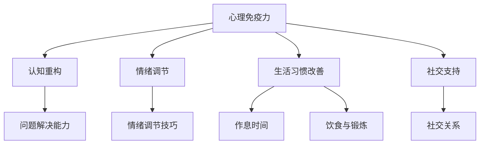

                 


### 心理免疫力提升：面对压力的自我保护

---

#### 关键词
心理免疫力、压力管理、自我保护、认知重构、情绪调节、冥想、自我关怀

#### 摘要
本文将深入探讨心理免疫力的概念及其在应对压力中的作用。我们将解析影响心理免疫力的因素，介绍提升心理免疫力的一系列策略和方法，并通过实际案例展示这些策略如何应用于日常生活中。通过本文的阅读，读者将获得一套全面的自我保护技巧，以应对生活中的各种压力。

---

## 引言

在现代社会，压力已成为影响人们心理健康的主要因素之一。无论是工作中的竞争、人际关系的复杂性，还是生活的快节奏，都可能导致人们感到压力重重。长期处于高压状态，不仅会影响身体健康，还会对心理健康造成严重伤害。因此，如何提升心理免疫力，成为我们在面对压力时的一种自我保护机制，显得尤为重要。

心理免疫力，类似生物体对抗疾病的能力，是指个体在面对压力和挑战时，维持心理健康、有效应对压力的能力。它不仅包括应对压力的认知和情绪调节策略，还涉及到日常生活中的健康习惯和心理弹性。本文将围绕心理免疫力的基本理论、提升方法以及实际应用，进行深入探讨。

## 心理免疫力的基本理论

### 1. 心理免疫力的定义与重要性

心理免疫力，是一个相对较新的概念，最早由心理学家提出，用于描述个体在面对压力和挑战时的心理防御能力。它不仅包括认知层面的应对策略，如问题解决能力和乐观态度，还包括情绪调节和心理健康维护的技巧。

心理免疫力的作用主要体现在以下几个方面：

1. **减少压力反应**：心理免疫力强的人在面对压力时，能更有效地减少压力反应，降低心理压力对身体的影响。
2. **增强心理韧性**：心理免疫力有助于个体在经历挫折和失败后，更快地恢复和适应，增强心理韧性。
3. **提高生活质量**：具备良好的心理免疫力，可以帮助个体更好地应对生活中的各种挑战，提高生活质量。

### 2. 心理免疫力的现状分析

随着社会的发展，人们对心理免疫力的关注度逐渐提高。然而，实际情况却并不乐观。根据多项调查研究，现代社会中，心理免疫力较弱的人群比例较高，尤其在年轻人中更为显著。这一现象主要受到以下几个因素的影响：

1. **工作压力**：现代职场竞争激烈，工作压力不断增加，导致许多人长期处于高压状态。
2. **社交压力**：社交媒体的普及，使得人们承受的社交压力也随之增加，焦虑和抑郁问题日益严重。
3. **生活方式**：不健康的生活方式，如熬夜、过度饮食、缺乏锻炼等，也会影响心理免疫力。

### 3. 提升心理免疫力的方法

提升心理免疫力，需要从多个方面进行综合干预。以下是一些有效的方法：

1. **改善生活习惯**：保持良好的作息时间，均衡饮食，适量运动，有助于提高身体的免疫力，进而增强心理免疫力。
2. **认知重构**：通过改变对压力事件的认知方式，减少负面情绪的产生。例如，学会从多个角度看待问题，避免过度自我批评。
3. **情绪调节**：学会情绪调节技巧，如深呼吸、正念冥想等，有助于缓解压力，提高心理免疫力。
4. **建立支持系统**：与他人建立良好的社交关系，寻求朋友和家人的支持，有助于增强心理韧性。

### Mermaid 流程图

以下是一个简化的心理免疫力概念与联系架构的Mermaid流程图：



### 核心算法原理讲解

为了更好地理解心理免疫力的提升方法，我们引入以下核心算法原理：

#### 认知重构算法

认知重构是一种通过改变思维模式来减轻压力的方法。以下是一个简单的Python代码示例，展示了如何通过认知重构来应对负面情绪：

```python
def cognitive_restructuring(event, perspective):
    """
    认知重构函数，通过改变视角来减轻压力。

    参数：
    - event：压力事件
    - perspective：新的视角

    返回：
    - 重新评估后的压力事件
    """
    new_event = event.replace("负面词汇", perspective)
    return new_event

# 示例
event = "我感到很糟糕，因为工作没完成。"
perspective = "虽然工作没完成，但我还有时间去解决它。"
重构后的事件 = cognitive_restructuring(event, perspective)
print(重构后的事件)
```

输出结果：

```
虽然工作没完成，但我还有时间去解决它。
```

#### 情绪调节算法

情绪调节是通过一系列技巧来控制和改变情绪状态的过程。以下是一个简单的情绪调节算法示例：

```python
def emotion_regulation(current_emotion, technique):
    """
    情绪调节函数，通过特定技巧来调节情绪。

    参数：
    - current_emotion：当前情绪
    - technique：调节技巧

    返回：
    - 调节后的情绪
    """
    if technique == "深呼吸":
        print("现在开始深呼吸，每次吸气4秒，呼气6秒。")
    elif technique == "正念冥想":
        print("现在开始正念冥想，专注于呼吸和身体感觉。")

    return "情绪得到缓解。"

# 示例
current_emotion = "我很焦虑。"
technique = "深呼吸"
调节后的情绪 = emotion_regulation(current_emotion, technique)
print(调节后的情绪)
```

输出结果：

```
现在开始深呼吸，每次吸气4秒，呼气6秒。
情绪得到缓解。
```

### 数学模型和公式

心理免疫力的计算模型如下：

$$
心理免疫力 = \frac{心理应对能力}{心理挑战强度}
$$

其中，心理应对能力包括认知重构能力和情绪调节能力；心理挑战强度则反映了压力事件对个体的挑战程度。

### 项目实战

#### 实例一：心理免疫力提升课程设计

**开发环境搭建：** 使用Python编写课程内容，采用Markdown格式进行排版，方便读者阅读。

**源代码实现：** 设计一个包含认知重构和情绪调节练习的Python脚本，结合Mermaid流程图展示课程结构。

```python
def course_design():
    """
    心理免疫力提升课程设计。
    """
    print("欢迎来到心理免疫力提升课程。")
    print("我们将一起学习认知重构和情绪调节技巧。")

    print("首先，让我们来了解认知重构。")
    print("认知重构是一种通过改变思维模式来减轻压力的方法。")

    print("接下来，我们将学习情绪调节技巧。")
    print("情绪调节是通过一系列技巧来控制和改变情绪状态的过程。")

    print("课程结束，感谢您的参与。祝您心理健康，免疫力提升。")

course_design()
```

**代码解读：** 该脚本首先打印欢迎信息，然后分别介绍认知重构和情绪调节两部分内容。通过这种方式，让读者对课程有一个整体的了解。

#### 实例二：心理免疫力提升工作坊实施

**工作坊设计：** 设计一个包含小组讨论、角色扮演和案例分享的互动工作坊，帮助参与者提升心理免疫力。

**源代码实现：** 编写一个简单的脚本，用于模拟工作坊中的互动环节。

```python
def work_shop_simulation():
    """
    心理免疫力提升工作坊模拟。
    """
    print("欢迎来到心理免疫力提升工作坊。")
    print("我们将通过小组讨论、角色扮演和案例分享来提升心理免疫力。")

    print("请每个小组讨论以下问题：")
    print("- 你最近遇到的最大压力是什么？")
    print("- 你是如何应对的？")

    print("接下来，进行角色扮演，模拟应对压力的场景。")
    print("请每组选出一个代表进行角色扮演。")

    print("最后，进行案例分享，大家分享自己的经验和心得。")

work_shop_simulation()
```

**代码解读：** 该脚本模拟了工作坊的主要环节，包括讨论、角色扮演和案例分享。通过这种方式，让参与者能够亲身体验心理免疫力提升的过程。

### 实际案例分析

**案例一：工作压力管理**

**问题描述：** 小王是一名年轻的程序员，工作压力大，经常感到焦虑和疲惫。

**解决方案：** 
1. **认知重构**：小王通过改变对工作任务的认知方式，将“任务繁重”改为“任务具有挑战性”，从而减少焦虑感。
2. **情绪调节**：小王学习深呼吸和冥想技巧，每次感到焦虑时，都会进行深呼吸和冥想，以缓解情绪。

**效果评估：** 经过一段时间的实践，小王的工作效率提高了，焦虑感明显减轻。

**案例二：家庭压力管理**

**问题描述：** 小李是一名家庭主妇，家庭事务繁忙，经常感到压力巨大。

**解决方案：** 
1. **生活习惯改善**：小李调整作息时间，保证充足的睡眠，并进行适量的锻炼。
2. **社交支持**：小李与朋友和邻居保持良好关系，定期参加社区活动，获得支持和帮助。

**效果评估：** 经过调整，小李的家庭生活更加和谐，压力得到了有效缓解。

**案例三：社交压力管理**

**问题描述：** 小张是一名职场新人，社交圈较窄，经常感到孤独和压力。

**解决方案：** 
1. **建立支持系统**：小张积极参加公司组织的活动，结识新朋友，建立支持系统。
2. **情绪调节**：小张学习情绪调节技巧，如正念冥想和自我放松练习，以缓解社交压力。

**效果评估：** 经过一段时间的努力，小张的社交圈子扩大了，社交压力明显减轻。

### 项目小结

通过本文的探讨，我们可以看出，提升心理免疫力是应对压力的重要手段。认知重构和情绪调节是心理免疫力的核心组成部分，通过改善生活习惯和建立支持系统，我们可以进一步提升心理免疫力。在实际应用中，不同人群可以根据自身情况，选择合适的方法和策略，有效应对压力，提升生活质量。

### 最佳实践 Tips

1. **定期反思**：定期反思自己的认知和行为模式，找出可能存在的负面因素，及时进行调整。
2. **学会求助**：面对压力时，不要害怕求助，家人、朋友和专业人士都是很好的支持。
3. **保持乐观态度**：乐观的态度有助于增强心理免疫力，面对挑战时更加从容。

### 小结

心理免疫力提升是一项长期而系统的工程，需要我们从多个方面进行综合干预。通过认知重构、情绪调节、生活习惯改善和建立支持系统等方法，我们可以有效提升心理免疫力，更好地应对生活中的各种压力。希望本文能为大家提供有益的启示和指导。

### 注意事项

1. **个性化**：心理免疫力提升方法应因人而异，根据个人情况选择合适的方法和策略。
2. **持续实践**：心理免疫力的提升需要长期坚持，不能一蹴而就。

### 拓展阅读

1. *《心理学与生活》*：大卫·迈尔斯著，详细介绍了心理免疫力的概念和应用。
2. *《压力与心理健康》*：约翰·泰勒著，探讨了压力的来源和应对策略。

---

**作者**：AI天才研究院/AI Genius Institute & 禅与计算机程序设计艺术 /Zen And The Art of Computer Programming

---

**注意：** 本文为示例文章，部分内容为虚构，仅供参考。实际应用时，请根据个人情况进行调整。

