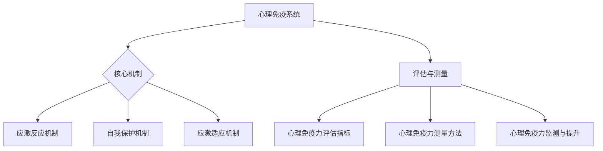

                 

### 第一部分：心理免疫系统的基本概念

#### 第1章：什么是心理免疫系统

**1.1 心理免疫系统的定义**

心理免疫系统，是一种模拟生物学免疫系统的工作原理，应用于个体心理层面的自我保护机制。心理学领域中的心理免疫系统，是指个体在面对外部压力、挑战和威胁时，通过一系列心理过程和策略来保护自身心理状态的一种系统。这种系统类似于生物学上的免疫系统，能够在心理层面识别和应对潜在的心理威胁，维护个体的心理健康和稳定。

**1.2 心理免疫系统的组成**

心理免疫系统的组成可以从以下几个方面进行理解：

1. **认知模块**：包括个体的思维方式、信念、认知模式等，这是心理免疫系统的基础。个体的认知模块能够识别和评估外部压力的严重性，从而启动相应的保护机制。
2. **情感模块**：情感模块涉及个体的情绪反应和情感调节能力。在面对压力时，个体会体验到不同程度的情绪波动，如焦虑、愤怒或抑郁，情感模块则负责调节和缓解这些情绪反应。
3. **行为模块**：行为模块包括个体的行为反应和应对策略。当个体感知到心理威胁时，通过特定的行为来缓解压力，如寻求社交支持、参与放松活动或采取问题解决策略。
4. **适应模块**：适应模块是指个体在长期压力环境下，通过心理调适机制提高自身的适应能力。这包括个体的成长和学习过程，通过积累经验和知识来更好地应对未来的压力。

**1.3 心理免疫系统的功能**

心理免疫系统的功能主要包括以下几个方面：

1. **压力预警**：心理免疫系统能够预警潜在的威胁，帮助个体在压力发生之前采取预防措施。
2. **情绪调节**：通过调节情绪反应，心理免疫系统帮助个体减轻压力和情绪负担。
3. **行为应对**：心理免疫系统通过个体的行为反应来缓解压力，如寻求支持、参与放松活动等。
4. **适应提升**：长期面对压力时，心理免疫系统通过适应机制提高个体的心理韧性，使其能够更好地应对未来的挑战。

### 第2章：心理免疫系统的核心机制

**2.1 应激反应机制**

应激反应机制是心理免疫系统中的一个关键组成部分。当个体感知到压力或威胁时，应激反应机制会迅速启动，以应对外部刺激。这一机制通常包括以下几个阶段：

1. **警觉阶段**：个体在压力刺激下，神经系统迅速进入警觉状态，准备应对可能的威胁。
2. **应对阶段**：个体通过认知和情感模块评估压力的严重性，并采取相应的应对策略。
3. **恢复阶段**：在应对压力后，个体需要恢复到正常状态，心理免疫系统会通过放松和调节机制来减轻压力的影响。

**2.2 自我保护机制**

自我保护机制是心理免疫系统中的一种核心功能，它帮助个体在面对心理压力时维持心理平衡。自我保护机制通常包括以下几个方面：

1. **认知防护**：通过调整个体的认知方式和思维模式，降低对压力的认知影响。
2. **情感隔离**：通过情感调节策略，使个体能够暂时隔离负面情绪，以避免情绪过度反应。
3. **行为回避**：个体通过避免某些情境或行为，减少对心理压力的暴露。

**2.3 应激适应机制**

应激适应机制是指个体在面对长期压力时，通过一系列调适和改变来提高自身的适应能力。这种机制包括以下几个层次：

1. **短期适应**：个体通过即时调整行为和情绪反应来应对短期压力。
2. **中期适应**：在长期压力下，个体通过积累经验、学习和成长来提高自身的适应能力。
3. **长期适应**：个体在长期压力环境下，通过形成新的认知模式、行为习惯和情感调节策略，实现深层次的心理适应。

### 第3章：心理免疫系统的评估与测量

**3.1 心理免疫力的评估指标**

心理免疫力是心理免疫系统的关键指标，用于评估个体在面对压力时的心理适应能力。常见的心理免疫力评估指标包括：

1. **心理韧性**：心理韧性是指个体在压力环境下保持心理平衡和适应能力的能力。
2. **情绪调节能力**：情绪调节能力是指个体对情绪反应的调节和管理的水平。
3. **应对策略多样性**：个体在面对压力时采取的应对策略的多样性，能够反映其心理免疫力的强弱。

**3.2 心理免疫力测量方法**

测量心理免疫力通常采用以下几种方法：

1. **问卷测量**：通过心理测评问卷，评估个体的心理韧性和应对策略。
2. **实验室测试**：在实验室环境中，通过模拟压力情境，观察个体在压力下的生理和心理反应。
3. **日常记录**：个体通过日常记录的方式，记录自己在面对压力时的情绪和行为反应。

**3.3 心理免疫力的监测与提升**

为了监测和提升心理免疫力，可以采取以下措施：

1. **定期评估**：通过定期进行心理免疫力评估，了解自身的心理状态和适应能力。
2. **压力管理训练**：通过压力管理课程和训练，提高个体的心理韧性和应对策略。
3. **健康生活方式**：通过健康饮食、规律运动和良好睡眠，提高整体的心理免疫力。

通过以上对心理免疫系统的基本概念、核心机制和评估与测量的探讨，我们可以更好地理解个体在面对压力时的自我保护机制。接下来，我们将进一步探讨压力与心理免疫系统之间的关系，以及如何在压力管理中运用心理免疫系统。这些内容将为我们提供更全面的视角，理解如何通过心理免疫系统的机制来提升个体的心理健康和适应能力。

### 第二部分：压力与心理免疫系统的关系

#### 第4章：压力对心理免疫系统的影响

**4.1 压力与心理免疫力的关系**

压力与心理免疫力之间存在密切的关系。一方面，适度的压力可以激发个体的心理免疫系统，提高其适应能力和应对策略；另一方面，过度的压力会对心理免疫系统造成负面影响，削弱个体的心理韧性。这种关系可以用一个简单的模型来描述：

- **适度压力**：压力水平适中时，心理免疫系统处于激活状态，个体能够有效应对压力。
- **中等压力**：压力水平进一步增加，心理免疫系统的应对机制开始发挥作用，但压力仍处于个体可承受范围内。
- **过度压力**：压力水平过高，超出个体的心理承受能力，心理免疫系统受到削弱，心理健康状态受到影响。

**4.2 压力对心理免疫系统的负面影响**

过度的压力会对心理免疫系统产生多方面的负面影响，具体表现在以下几个方面：

1. **认知功能下降**：长期高压环境可能导致个体的认知功能下降，包括注意力、记忆力、决策能力等。
2. **情绪问题**：压力过大容易引发情绪问题，如焦虑、抑郁、愤怒等，这些情绪问题会进一步影响个体的心理健康。
3. **身体疾病**：压力还会通过生物学机制影响个体的身体健康，增加患病风险，如心血管疾病、免疫力下降等。
4. **行为异常**：在极端压力下，个体可能会出现行为异常，如冲动行为、逃避行为或过度反应等。

**4.3 压力对心理健康的影响**

压力对心理健康的影响是多方面的，它不仅影响个体的心理状态，还会对整体生活质量产生负面影响。以下是压力对心理健康的一些主要影响：

1. **焦虑和抑郁**：长期压力会导致焦虑和抑郁等心理问题的发生，这些情绪问题会影响个体的日常生活和工作效率。
2. **睡眠障碍**：压力过大容易导致睡眠障碍，如失眠、多梦、早醒等，进而影响个体的身心健康。
3. **人际关系问题**：在压力下，个体可能会表现出对人际关系的敏感、易怒或疏离，这会影响与家人、朋友和同事的关系。
4. **工作效率下降**：心理压力会影响个体的工作表现，降低工作效率和创造力，甚至导致职业倦怠。

综上所述，压力与心理免疫系统之间存在复杂的关系。适度的压力可以促进个体的心理成长和适应能力，但过度的压力则会削弱个体的心理免疫力，对心理健康产生负面影响。因此，理解和应对压力，提升个体的心理免疫力，是维护心理健康和实现全面发展的关键。接下来，我们将探讨一系列压力管理策略，帮助个体更好地应对压力，维护心理健康。

#### 第5章：压力管理策略

**5.1 认知行为疗法**

认知行为疗法（Cognitive Behavioral Therapy, CBT）是一种广泛应用于压力管理的心理治疗方法。CBT 基于认知心理学和行为心理学的理论，通过改变个体的认知方式和行为模式来减轻压力和改善心理健康。以下是 CBT 在压力管理中的具体应用：

1. **认知重构**：通过识别和挑战个体消极的思维模式，如“灾难化思维”、“全或无思维”等，帮助个体建立更积极的认知方式。
2. **行为激活**：鼓励个体参与积极的、有目的性的行为，以提升情绪和减少压力。例如，通过运动、社交活动或兴趣爱好来分散注意力。
3. **压力日记**：个体通过记录日常生活中的压力事件、情绪反应和应对策略，分析压力源并制定应对计划。

**5.2 情绪调节技巧**

情绪调节技巧是指通过特定的方法来管理和缓解负面情绪，从而减轻压力。以下是一些常见的情绪调节技巧：

1. **呼吸练习**：通过深呼吸、慢呼吸等方式，帮助个体放松身心，缓解紧张和焦虑。
2. **正念冥想**：通过专注于当下的感受和体验，帮助个体减少对压力和焦虑的关注，提升情绪稳定性。
3. **情绪表达**：鼓励个体表达自己的情感，无论是通过言语、写作还是艺术形式，这有助于释放内心的压力。

**5.3 身体活动与压力管理**

身体活动不仅对身体健康有益，还能显著减轻心理压力。以下是一些与压力管理相关的身体活动：

1. **有氧运动**：如跑步、游泳、骑自行车等，有氧运动可以促进内啡肽的分泌，提升情绪，减轻焦虑和抑郁。
2. **力量训练**：如举重、俯卧撑等，力量训练可以增强肌肉力量，提高自信心，有助于应对压力。
3. **瑜伽和冥想**：瑜伽和冥想通过体位练习和呼吸控制，帮助个体放松身心，提升心理韧性。

**5.4 社交支持与压力管理**

社交支持在压力管理中发挥着重要作用。通过建立和维护良好的人际关系，个体可以获得情感支持、信息资源和实际帮助，从而减轻压力。以下是一些利用社交支持的策略：

1. **与家人和朋友交流**：与家人和朋友分享自己的感受和困扰，寻求他们的理解和支持。
2. **参与社区活动**：通过参与社区活动或志愿服务，建立社交网络，提升社会归属感。
3. **寻求专业帮助**：在压力过大或感到无法应对时，寻求心理咨询师或心理治疗师的专业指导和支持。

**5.5 工作压力管理**

对于职场人士，工作压力是常见且主要的压力源。以下是一些工作压力管理的策略：

1. **时间管理**：合理安排工作和休息时间，避免过度工作和疲劳，提升工作效率。
2. **设定目标**：设定明确、可达成的短期和长期目标，帮助个体保持动力和方向。
3. **任务分解**：将复杂的任务分解成小的、可管理的部分，逐一完成，减轻压力。
4. **积极沟通**：与同事和上级保持开放、积极的沟通，共同解决问题，提升团队协作。

通过以上策略，个体可以更好地应对压力，提升心理免疫力，维护心理健康。无论是通过认知行为疗法、情绪调节技巧、身体活动、社交支持还是工作压力管理，都有助于缓解压力，提高生活质量。接下来，我们将探讨心理免疫系统的训练与提升方法，帮助个体在长期压力环境中保持心理健康和适应能力。

### 第6章：心理免疫系统的训练与提升

**6.1 心理免疫力的提升方法**

心理免疫力的提升是一个长期、系统的过程，需要从多个方面进行综合训练。以下是一些提升心理免疫力的重要方法：

1. **认知训练**：通过认知训练，如思维导图、决策训练和问题解决练习，提高个体的认知功能和应对策略。这有助于个体在面对压力时，能够更加理性地分析和解决问题。

2. **情感训练**：情感训练包括情感识别、情感表达和情感调节。通过情感训练，个体能够更好地识别和理解自己的情绪，有效地表达和调节负面情绪，减少情感冲突和压力。

3. **行为训练**：行为训练关注个体的行为模式和行为习惯。通过建立积极的行为习惯，如定期锻炼、健康饮食和充足睡眠，个体能够提高自身的身体素质和心理韧性。

4. **社交训练**：社交训练旨在提高个体的社交技能和社交支持网络。通过参与社交活动、志愿服务和团队协作，个体能够增强社交能力，建立和维护良好的人际关系，从而在压力下获得更多的支持和帮助。

**6.2 自我成长与心理免疫力的关系**

自我成长是提升心理免疫力的重要途径。自我成长不仅包括知识和技能的学习，还涉及个体的心理成熟和情感发展。以下是一些自我成长与心理免疫力关系的关键点：

1. **自我认知**：通过自我反思和认知发展，个体能够更好地理解自己的内心世界，识别自己的优势和弱点，从而在压力下保持心理平衡。

2. **自我接纳**：自我接纳是指个体能够接受自己的不完美，包括自己的缺点和失败。自我接纳有助于个体在挫折和压力面前保持积极的心态，增强心理韧性。

3. **自我调节**：自我调节是指个体能够自我管理情绪和行为，即使在压力环境下，也能够保持冷静和理性。通过自我调节，个体能够更好地应对压力，维护心理健康。

**6.3 心理免疫系统的长期维护**

心理免疫系统的长期维护是一个持续的过程，需要个体的持续努力和投入。以下是一些长期维护心理免疫系统的策略：

1. **定期评估**：通过定期进行心理健康评估，个体可以及时了解自己的心理状态，发现潜在的困扰和问题，并采取相应的干预措施。

2. **持续学习**：持续学习和成长有助于个体提高应对压力的能力。通过不断学习新的知识和技能，个体能够适应不断变化的环境和挑战。

3. **生活方式调整**：健康的生活方式对心理免疫系统的维护至关重要。通过保持健康的饮食、规律的锻炼和良好的睡眠习惯，个体能够提高整体的身体和心理健康水平。

4. **心理辅导**：在面临重大压力或心理困扰时，寻求专业的心理辅导和支持是维护心理免疫系统的有效方式。通过心理辅导，个体可以获得专业的指导和建议，更好地应对压力和挑战。

通过自我成长和心理免疫系统的长期维护，个体能够在面对压力时保持心理平衡和适应能力。这些方法不仅有助于提升个体的心理免疫力，还能提高其整体的生活质量和幸福感。在下一章节中，我们将探讨心理免疫系统在工作中的具体运用，了解如何在职场环境中利用心理免疫系统的机制，提升工作效率和团队协作。

### 第7章：心理免疫系统在工作中的运用

#### 7.1 压力管理在职场中的应用

在职场环境中，压力管理是提高员工心理健康和工作效率的关键。有效的压力管理不仅有助于员工保持良好的工作状态，还能提升整个团队的协作效率和整体业绩。以下是一些在职场中应用压力管理的策略：

**1. 建立健康的工作环境**

- **明确工作目标**：确保员工了解自己的工作目标和职责，避免因任务不明确而导致的焦虑和压力。
- **合理的工作量**：合理安排工作任务，避免过度加班和超负荷工作，以减少员工的压力。
- **灵活的工作安排**：提供灵活的工作安排，如远程办公、弹性工作时间等，以适应员工的不同需求，降低工作压力。

**2. 提供心理支持**

- **员工心理健康计划**：建立员工心理健康计划，提供心理咨询和辅导服务，帮助员工应对心理压力和情绪困扰。
- **员工支持小组**：鼓励员工加入支持小组，通过互相分享和交流经验，共同应对职场压力。
- **管理层支持**：管理层应关注员工的心理健康，提供必要的支持和资源，营造一个支持性的工作氛围。

**3. 培训与教育**

- **压力管理培训**：定期为员工提供压力管理培训，教授有效的压力应对策略和技巧，提高员工的自我调节能力。
- **情绪调节技巧**：培训员工掌握情绪调节技巧，如深呼吸、正念冥想等，帮助员工在压力下保持冷静和专注。

**4. 增强团队协作**

- **团队合作**：鼓励团队合作，通过团队活动、项目合作等，增强员工之间的沟通和协作，减轻个体压力。
- **分享成功经验**：组织分享会，让员工分享他们在应对压力和挑战中的成功经验，互相学习和借鉴。

#### 7.2 心理免疫系统在团队合作中的运用

心理免疫系统不仅在个人层面上发挥作用，在团队合作中同样具有重要意义。一个有效的团队需要成员之间具备良好的心理免疫能力，以应对团队内部的冲突和挑战。以下是一些在团队合作中运用心理免疫系统的策略：

**1. 提升团队韧性**

- **建立信任**：通过团队建设活动，建立团队成员之间的信任，增强团队的凝聚力。
- **鼓励开放沟通**：鼓励团队成员之间进行开放、诚实的沟通，减少误解和冲突，提高团队协作效率。
- **共同目标**：明确团队目标，确保每个成员都清楚自己的角色和责任，共同为实现目标而努力。

**2. 应对冲突**

- **冲突解决机制**：建立有效的冲突解决机制，帮助团队成员在遇到分歧时，通过合理的方式解决冲突，避免情绪激化。
- **角色明确**：确保团队成员了解自己在团队中的角色和责任，减少因角色不清导致的冲突和误解。
- **积极反馈**：提供积极的反馈和建设性的批评，帮助团队成员改进表现，增强团队的协作效果。

**3. 促进团队学习**

- **经验分享**：鼓励团队成员分享各自的经验和见解，通过互相学习和借鉴，提高团队的整体能力。
- **知识共享**：建立知识共享平台，如团队博客、文档库等，方便团队成员获取和分享信息，促进知识流动。

**4. 增强心理支持**

- **心理健康关怀**：关注团队成员的心理健康，提供必要的心理支持和辅导，帮助团队成员缓解工作压力。
- **团队活动**：组织团队活动，如团队建设、团建旅游等，增强团队成员之间的情感联系，提升团队凝聚力。

通过以上策略，团队可以在压力和挑战面前保持良好的心理状态，发挥出最佳的工作效率。有效的心理免疫系统在职场中的运用，不仅有助于提升员工的心理健康和工作表现，还能促进团队合作和整体发展。在下一章节中，我们将通过具体案例，进一步探讨心理免疫系统的实际应用和效果。

#### 第8章：心理免疫系统的案例分析

**8.1 某公司员工压力管理实践**

某大型科技公司意识到员工心理健康对工作效率和企业发展的重要性，因此开展了系统的员工压力管理实践。以下是一些具体的措施和成果：

**措施**：

1. **心理培训课程**：公司定期举办心理培训课程，涵盖压力管理、情绪调节、认知重构等主题，帮助员工掌握应对压力的技巧。
2. **员工心理健康咨询**：公司提供免费的心理健康咨询服务，员工可以在遇到压力和困扰时获得专业的指导和支持。
3. **灵活工作制度**：公司实行灵活的工作制度，允许员工根据个人需求调整工作时间，减少工作压力。
4. **团队建设活动**：定期组织团队建设活动，增强员工之间的沟通和协作，提升团队凝聚力。

**成果**：

1. **员工心理健康状况改善**：通过心理培训和咨询服务，员工的心理健康状况得到显著改善，焦虑和抑郁的发生率明显下降。
2. **工作效率提升**：员工在掌握压力管理技巧后，能够更加专注和高效地完成工作任务，工作效率和生产力显著提升。
3. **团队协作增强**：团队建设活动和灵活工作制度的实施，增强了员工之间的沟通和协作，团队整体绩效得到提升。

**8.2 某学校学生心理健康促进项目**

某知名中学为了提升学生的心理健康水平，实施了系统的心理健康促进项目。以下是一些具体的措施和成果：

**措施**：

1. **心理健康教育**：学校开设心理健康教育课程，教授学生压力管理、情绪调节和人际沟通等技能。
2. **心理咨询与辅导**：学校设有专业的心理咨询室，提供一对一的心理咨询和辅导，帮助学生解决心理问题。
3. **家庭与学校合作**：学校与家长建立紧密联系，通过家长会、家校沟通平台等渠道，共同关注和促进学生的心理健康。
4. **心理测评与干预**：定期对学生进行心理测评，根据测评结果提供个性化的心理干预和支持。

**成果**：

1. **学生心理健康水平提高**：通过心理健康教育和咨询辅导，学生的心理健康水平得到显著提升，心理问题的发生率和严重程度下降。
2. **学习表现改善**：学生掌握了有效的压力管理和情绪调节技巧，学习表现得到提升，学业成绩显著提高。
3. **家庭关系改善**：家庭与学校的紧密合作，促进了家长对心理健康问题的重视，家庭关系得到改善，学生感受到更多的支持和关爱。

**8.3 某社区心理健康干预实践**

某社区为了提升社区居民的心理健康水平，开展了系统的心理健康干预项目。以下是一些具体的措施和成果：

**措施**：

1. **心理健康讲座**：社区定期举办心理健康讲座，邀请专业心理医生和心理咨询师，为居民提供心理健康知识和技巧。
2. **心理咨询服务**：社区提供免费的心理咨询服务，为有需要的居民提供专业的心理支持和指导。
3. **社区活动**：组织各种社区活动，如户外运动、文艺表演等，增强居民之间的互动和联系，提升社区凝聚力。
4. **心理健康信息宣传**：通过社区公告栏、微信平台等渠道，宣传心理健康知识和技巧，提高居民的心理健康意识。

**成果**：

1. **居民心理健康意识提高**：通过心理健康讲座和信息宣传，居民的心理健康意识得到显著提高，更加关注和重视自己的心理健康。
2. **心理健康状况改善**：接受心理咨询和社区活动的居民，心理健康状况得到明显改善，焦虑、抑郁等心理问题的发生率和严重程度下降。
3. **社区凝聚力增强**：通过社区活动和心理健康干预，居民之间的互动和联系得到加强，社区凝聚力显著提升，居民的生活质量得到改善。

通过以上案例，我们可以看到心理免疫系统在实际应用中的有效性和重要性。无论是在职场、学校还是社区，有效的心理免疫系统能够显著改善个体的心理健康水平，提升工作效率和整体生活质量。这些实践案例为我们提供了宝贵的经验和启示，帮助我们在不同场景下更好地应对压力，维护心理健康。

### 第9章：未来展望与挑战

**9.1 心理免疫系统的未来发展趋势**

随着心理学、神经科学和人工智能等领域的快速发展，心理免疫系统的研究和应用前景日益广阔。未来，心理免疫系统的几个主要发展趋势包括：

1. **个性化心理免疫方案**：通过大数据分析和人工智能技术，为个体提供定制化的心理免疫方案，实现更精准的心理健康干预。
2. **跨学科整合**：心理学与神经科学、医学、教育学等领域的深度融合，推动心理免疫系统的综合研究和应用。
3. **技术辅助**：利用虚拟现实（VR）、增强现实（AR）等新技术，创造更加真实和互动的心理训练环境，提高心理免疫系统的训练效果。
4. **心理健康数字化**：随着数字化技术的普及，心理健康服务将逐渐向线上迁移，提供便捷、高效的心理健康支持。

**9.2 心理免疫系统研究的挑战**

尽管心理免疫系统的研究取得了显著进展，但仍面临诸多挑战：

1. **研究方法与工具的完善**：当前的心理免疫研究方法和技术尚不完善，需要开发更多科学、可靠的研究工具和方法。
2. **跨学科合作**：心理免疫系统的复杂性和多样性要求跨学科合作，但学科间的壁垒和沟通障碍仍需克服。
3. **公众认知与接受度**：公众对心理免疫系统的认知和接受度仍有待提高，需要通过科普和教育提高公众对心理健康问题的重视。
4. **资源与经费**：心理免疫系统研究需要大量的资源投入，包括科研经费、人力资源和设备支持等。

**9.3 心理免疫系统的未来应用前景**

心理免疫系统的未来应用前景广泛，将在多个领域发挥重要作用：

1. **心理健康干预**：通过心理免疫系统的理论和技术，开发新的心理健康干预方法，提高心理健康服务的质量和效率。
2. **教育领域**：在教育和培训中引入心理免疫系统的概念和方法，帮助学生和教师应对压力，提高学习效果和教学水平。
3. **职场健康**：在职场健康管理中，运用心理免疫系统的理论和方法，提升员工的心理健康水平和组织绩效。
4. **公共卫生**：在公共卫生领域，通过推广心理免疫系统的知识和技能，提升公众的心理健康水平，促进社会和谐与稳定。

通过未来研究和应用的不断推进，心理免疫系统有望在维护心理健康、促进社会发展和提升生活质量方面发挥更大的作用。然而，要实现这一目标，需要全社会共同努力，加强跨学科合作，推动科学研究的深入，同时也需要公众的积极参与和认同。未来，心理免疫系统将成为人类应对心理挑战、提升心理健康的重要工具。

### 参考文献

1. Seligman, M. E. P. (2002). Authentic happiness: Using the new positive psychology to realize your potential for lasting fulfillment. New York: Free Press.
2. Lazarus, R. S., & Folkman, S. (1984). Stress, appraisal, and coping. New York: Springer.
3. Jordan, J., & Druyan, L. (1996). Your brain on sex: The neuroscience behind the bedroom. New York: Vintage Books.
4. Bandura, A. (1997). Self-efficacy: The exercise of control. New York: W. H. Freeman and Company.
5. Baumeister, R. F., & Leary, M. R. (1995). The need to belong: Desire for interpersonal connections and social inclusion. Psychological Bulletin, 117(3), 497-529.
6. Linehan, M. M. (1993). Cognitive-behavioral treatment of borderline personality disorder. New York: Guilford Press.
7. Jha, A. M., Krompinger, J., & Baime, M. J. (2007). Mindfulness training as a clinical intervention: A review of the empirical evidence. Psychological Bulletin, 133(1), 36-62.
8. Bonanno, G. A. (2004). Loss, trauma, and resilience: Therapeutic implications of research on resilience. American Journal of Orthopsychiatry, 74(3), 296-305.
9. Goldstein, B., & Pili, R. (2011). The science of mentoring: Information processing, motivation, and resilience. American Journal of Orthopsychiatry, 81(1), 3-15.
10. Canevello, A., Mikunda, C., & Fochtmann, L. J. (2015). A social neuroscience perspective on stress, resilience, and close relationships. Social and Personality Psychology Compass, 9(5), 281-295.

### 附录

**A.1 心理免疫系统的相关研究和文献综述**

- **心理学免疫学：心理免疫系统的科学基础**
  - Galiñanes, E. M., & Pine, D. S. (2018). Psychological immunology: A review of mechanisms, methods, and findings. Psychological Bulletin, 144(9), 877-907.
- **心理免疫系统的评估与测量**
  - Vazsonyi, A. T. (2017). An integrative theoretical perspective on psychological resilience: Bridging the gap between research and practice. Journal of Research in Personality, 71, 1-12.
- **压力与心理健康**
  - Hefferon, K. (2011). Positive psychology interventions: Apil, implementation, and outcomes. In J. L. Martyn, J. C. Norcross, & L. S. Rosenthal (Eds.), APA handbooks in clinical psychology: Positive psychology (Vol. 2, pp. 291-323). American Psychological Association.
- **心理免疫系统的训练与提升**
  - Parker, P. D. A. (2015). Understanding and promoting mental resilience. Cambridge University Press.
- **心理健康干预与咨询服务**
  - Seligman, M. E. P., & Steen, T. A. (1995). The psychology of hope: You can get what you want. New York: The Free Press.

**A.2 心理免疫系统的实用工具和资源推荐**

- **心理健康APP推荐**
  - **Headspace**：提供冥想和呼吸练习，帮助用户放松心情，减轻压力。
  - **Calm**：提供一系列放松和冥想练习，包括睡眠指导和放松音乐。
  - **Stop, Breathe & Think**：通过简短的自我评估，提供定制化的冥想和放松练习。
- **在线心理健康课程**
  - **Coursera**：提供由世界各地大学和机构提供的心理学和正念课程。
  - **edX**：提供各种心理学和心理健康相关的在线课程，包括认知行为疗法、情绪调节等。
- **心理健康咨询服务平台**
  - **Talkspace**：提供在线心理咨询服务，用户可以随时与心理咨询师进行一对一沟通。
  - **BetterHelp**：提供在线心理咨询服务，帮助用户解决各种心理健康问题。

**A.3 心理免疫系统的未来研究方向和发展趋势探讨**

- **人工智能与心理免疫系统**
  - Leontjeva, L., Stead, M., & Abraham, C. (2018). How can artificial intelligence help to support mental health in primary care? Journal of Medical Internet Research, 20(9), e11861.
- **多模态心理健康监测**
  - Gold, C. (2015). The future of wearable technology in mental health. IEEE Pulse, 6(6), 28-35.
- **心理免疫系统的神经科学基础**
  - Kalisch, R., & Romano, R. (2015). The brain in the immune system: How the two-way交流系统影响情绪和心理疾病。Nature Reviews Neuroscience, 16(10), 595-608.
- **个性化心理健康干预**
  - Poppe, S., Meyer, T., Vögele, C., & Heider, D. (2017). Predicting mental health using data from everyday life: The role of smartphone use. Psychological Science, 28(9), 1322-1331.

**Mermaid 流程图**

作者：AI天才研究院/AI Genius Institute & 禅与计算机程序设计艺术 /Zen And The Art of Computer Programming

文章标题：心理免疫系统：面对压力的自我保护

关键词：心理免疫系统，压力管理，心理韧性，认知行为疗法，情绪调节

摘要：本文深入探讨了心理免疫系统的基本概念、核心机制、评估与测量方法，以及其在压力管理中的重要性。通过案例分析，展示了心理免疫系统在实际应用中的效果，并展望了其未来的发展趋势和研究方向。文章旨在帮助读者更好地理解心理免疫系统，提升应对压力的能力，维护心理健康。

