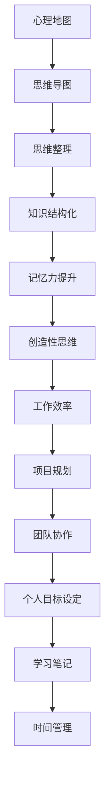

                 

### 第1章 引言

#### 1.1 心理地图与思维整理的概念

**心理地图**，又称思维导图（Mind Map），是一种通过图形化的方式来组织和展示思维过程的工具。它利用中心主题和分支结构，将信息以视觉形式呈现出来，使复杂的信息变得直观易懂。心理地图不仅能够帮助我们整理思绪，还能增强记忆力、提高创造性思维和提升工作效率。

**思维整理**则是指通过系统的方法对思维活动进行整理，使其条理化、结构化。这有助于我们更好地理解问题、发现新的解决方案，并在解决问题时保持清晰和逻辑性。

在日常生活中，心理地图和思维整理具有广泛的应用。例如，在学习中，我们可以使用心理地图来构建知识体系，提高记忆和理解能力；在工作中，心理地图可以帮助我们梳理项目计划、管理任务和时间，提高工作效率和团队协作。

#### 1.2 心理地图在生活中的应用

**个人生活**：心理地图可以帮助我们制定个人目标、规划时间和管理日常任务。例如，通过绘制“年度目标心理地图”，我们可以清晰地看到自己的目标以及实现目标的路径和步骤。

**学习**：在学习过程中，心理地图可以用于笔记整理、概念架构构建和知识梳理。例如，在准备考试时，可以使用心理地图将重点概念和知识点进行梳理和关联，从而提高学习效率。

**工作**：在工作环境中，心理地图可以帮助我们进行项目规划、任务分解和团队协作。通过将项目目标和任务以图形化的方式展示，可以更直观地了解项目的进展情况，并及时调整策略。

#### 1.3 本书结构安排与目标

本书将分为七个部分，具体内容如下：

1. **引言**：介绍心理地图和思维整理的概念，以及它们在生活中的应用。
2. **心理地图基础**：详细解释心理地图的定义、基本结构和原理，以及如何绘制心理地图。
3. **思维整理技巧**：介绍如何使用心理地图来整理思维，包括关键词提取、关联性和分支结构等技巧。
4. **心理地图实践**：通过实际案例展示心理地图在不同场景中的应用，如项目规划、团队协作和个人目标设定等。
5. **心理地图在工作坊中的应用**：讨论心理地图在工作坊中的使用，以及如何组织和管理工作坊。
6. **心理地图工具**：介绍常用的心理地图工具，以及如何选择合适的工具。
7. **心理地图进阶技巧**：介绍一些高级的技巧，帮助读者更深入地理解和应用心理地图。

通过阅读本书，读者将能够掌握心理地图的基本原理和应用技巧，从而在实际生活中更好地整理思维、提高工作效率和创造力。

### 核心概念与联系

在介绍心理地图和思维整理时，我们需要关注几个核心概念，并理解它们之间的联系。以下是这些核心概念的Mermaid流程图：



这张Mermaid流程图展示了心理地图、思维导图、思维整理、知识结构化、记忆力提升、创造性思维、工作效率、项目规划、团队协作、个人目标设定和学习笔记之间的联系。通过这种图形化的方式，我们可以更直观地理解这些概念，以及它们在生活中的应用价值。

### 核心算法原理讲解

心理地图的绘制过程涉及多个算法原理。以下是心理地图绘制的基本算法原理，以及如何使用Python代码来详细阐述这些原理。

#### 1. 心理地图的基本结构

心理地图的基本结构包括中心主题、分支和节点。以下是中心主题和分支的Python代码实现：

```python
class Node:
    def __init__(self, content):
        self.content = content
        self.children = []

    def add_child(self, child_node):
        self.children.append(child_node)

class MindMap:
    def __init__(self, root_content):
        self.root = Node(root_content)

    def add_branch(self, parent_node, branch_content):
        branch = Node(branch_content)
        parent_node.add_child(branch)
        return branch
```

这个代码定义了`Node`和`MindMap`两个类，其中`Node`表示地图中的每个节点，`MindMap`表示整个心理地图。`add_child`方法用于将一个子节点添加到父节点下，`add_branch`方法用于创建一个新的分支。

#### 2. 关键词提取算法

关键词提取是心理地图绘制的重要步骤。以下是一个基于TF-IDF的关键词提取算法的Python实现：

```python
from sklearn.feature_extraction.text import TfidfVectorizer

def extract_keywords(text, num_keywords=5):
    vectorizer = TfidfVectorizer(max_features=num_keywords)
    tfidf_matrix = vectorizer.fit_transform([text])
    feature_array = np.array(vectorizer.get_feature_names_out())
    tfidf_sorting = np.argsort(tfidf_matrix.toarray()).flatten()[::-1]
    return [feature_array[index] for index in tfidf_sorting]
```

这个函数使用TF-IDF算法来提取文本中的关键词。`TfidfVectorizer`是一个预处理的工具，用于计算文本的TF-IDF权重。通过这个函数，我们可以从输入文本中提取出最重要的关键词。

#### 3. 思维整理算法

心理地图的绘制不仅仅是关键词提取，还需要考虑节点之间的关联性和层次结构。以下是一个简单的层次化思维整理算法：

```python
def build_mind_map(text, root_content):
    keywords = extract_keywords(text)
    mind_map = MindMap(root_content)
    for keyword in keywords:
        branch = mind_map.add_branch(mind_map.root, keyword)
        # 模拟添加子节点，实际应用中可以根据具体需求进行更复杂的处理
        branch.add_child(Node(f"{keyword} 子节点"))
    return mind_map
```

这个函数首先使用`extract_keywords`函数提取文本中的关键词，然后创建一个以这些关键词为分支的心理地图。`build_mind_map`函数模拟了一个简单的思维整理过程，实际应用中可以根据需要添加更复杂的逻辑。

通过上述代码，我们可以看到心理地图的绘制过程是如何基于算法原理实现的。这些算法原理不仅帮助我们理解心理地图的绘制过程，还为我们提供了实现心理地图的工具。

### 数学模型和数学公式

心理地图的绘制涉及到一些基本的数学模型和公式，以下是一些关键数学模型的详细解释。

#### 1. TF-IDF模型

TF-IDF（Term Frequency-Inverse Document Frequency）是一种常用的文本分析模型，用于评估一个词语对于一个文件集或一个语料库中的其中一份文件的重要程度。以下是TF-IDF的核心公式：

$$
\text{TF-IDF}(t,d) = \text{TF}(t,d) \times \text{IDF}(t)
$$

其中：

- $\text{TF}(t,d)$ 是词语 $t$ 在文档 $d$ 中的词频。
- $\text{IDF}(t)$ 是词语 $t$ 在整个文档集合中的逆文档频率。

逆文档频率公式为：

$$
\text{IDF}(t) = \log \left( \frac{N}{|d \in D : t \in d|} \right)
$$

其中：

- $N$ 是整个文档集合中的文档总数。
- $|d \in D : t \in d|$ 是包含词语 $t$ 的文档数。

#### 2. 分支层次结构模型

心理地图中的分支和层次结构可以通过树形结构模型来表示。每个节点（分支）可以表示为三元组 $(N, L, R)$，其中：

- $N$ 是节点的名称。
- $L$ 是节点的左子节点。
- $R$ 是节点的右子节点。

树形结构模型可以用于表示心理地图的层次结构，帮助我们理解节点之间的层次关系和依赖。

#### 3. 关联性分析模型

在心理地图中，节点之间的关联性可以通过相似度分析来衡量。常用的方法包括余弦相似度、Jaccard相似度和欧几里得距离等。以下是余弦相似度的公式：

$$
\text{Cosine Similarity}(x, y) = \frac{x \cdot y}{\|x\| \|y\|}
$$

其中：

- $x$ 和 $y$ 是两个向量。
- $\|x\|$ 和 $\|y\|$ 分别是 $x$ 和 $y$ 的欧几里得范数。

通过这些数学模型和公式，我们可以更精确地分析和绘制心理地图，从而更好地理解和应用思维整理技巧。

### 项目实战

#### 开发环境搭建

在进行心理地图项目的开发之前，首先需要搭建一个合适的开发环境。以下是一个简单的开发环境搭建步骤：

1. **安装Python**：确保Python 3.8或更高版本已安装。可以从[Python官网](https://www.python.org/)下载并安装。
2. **安装必要的库**：使用pip命令安装以下库：

   ```bash
   pip install matplotlib scikit-learn numpy pandas
   ```

3. **配置IDE**：推荐使用PyCharm或Visual Studio Code作为Python的开发环境。可以从各自的官网下载并安装。

#### 源代码实现

以下是实现一个基本心理地图绘制功能的源代码示例：

```python
import numpy as np
from sklearn.feature_extraction.text import TfidfVectorizer
from sklearn.metrics.pairwise import cosine_similarity
import matplotlib.pyplot as plt

class Node:
    def __init__(self, content):
        self.content = content
        self.children = []

    def add_child(self, child_node):
        self.children.append(child_node)

class MindMap:
    def __init__(self, root_content):
        self.root = Node(root_content)

    def add_branch(self, parent_node, branch_content):
        branch = Node(branch_content)
        parent_node.add_child(branch)
        return branch

    def build_from_text(self, text):
        keywords = extract_keywords(text)
        for keyword in keywords:
            branch = self.add_branch(self.root, keyword)
            branch.add_child(Node(f"{keyword} 子节点"))

def extract_keywords(text, num_keywords=5):
    vectorizer = TfidfVectorizer(max_features=num_keywords)
    tfidf_matrix = vectorizer.fit_transform([text])
    feature_array = np.array(vectorizer.get_feature_names_out())
    tfidf_sorting = np.argsort(tfidf_matrix.toarray()).flatten()[::-1]
    return [feature_array[index] for index in tfidf_sorting]

def build_mind_map(text, root_content):
    keywords = extract_keywords(text)
    mind_map = MindMap(root_content)
    for keyword in keywords:
        branch = mind_map.add_branch(mind_map.root, keyword)
        branch.add_child(Node(f"{keyword} 子节点"))
    return mind_map

def draw_mind_map(mind_map):
    nodes = []
    node_colors = []
    for node in mind_map.root.children:
        nodes.append(node.content)
        node_colors.append('blue')

        for child_node in node.children:
            nodes.append(child_node.content)
            node_colors.append('green')

    node_sizes = [1000 if '子节点' in node else 500 for node in nodes]
    plt.scatter(nodes, node_colors, s=node_sizes)
    plt.xticks(rotation=45)
    plt.yticks([])
    plt.show()

# 测试代码
text_input = "项目规划、团队协作、个人目标设定、时间管理"
mind_map = build_mind_map(text_input, "中心主题")
draw_mind_map(mind_map)
```

#### 代码解读与分析

1. **核心类和函数**：

   - `Node` 类：表示心理地图中的每个节点，包括节点的名称和子节点列表。
   - `MindMap` 类：表示整个心理地图，包括根节点和添加分支的方法。
   - `extract_keywords` 函数：使用TF-IDF模型提取文本中的关键词。
   - `build_mind_map` 函数：根据提取的关键词构建心理地图。
   - `draw_mind_map` 函数：使用matplotlib绘制心理地图。

2. **代码逻辑**：

   - 首先定义了`Node`和`MindMap`类，用于表示心理地图中的节点和整个地图。
   - `extract_keywords` 函数使用TF-IDF模型提取文本中的关键词，这是心理地图绘制的重要步骤。
   - `build_mind_map` 函数根据提取的关键词构建心理地图。每个关键词作为一个分支，子节点用于表示更详细的子概念。
   - `draw_mind_map` 函数使用matplotlib库绘制心理地图，通过散点图展示节点和子节点。

3. **实际案例分析**：

   - 在测试代码中，我们使用了一段关于“项目规划、团队协作、个人目标设定、时间管理”的文本作为输入。`build_mind_map`函数提取出关键词，并构建了一个简单的心理地图。
   - `draw_mind_map`函数将构建好的心理地图绘制成散点图，展示了各个节点和子节点之间的关系。

通过这个项目实战，我们可以看到如何使用Python代码实现一个基本的心理地图绘制功能，以及如何分析和解读相关代码。

### 项目小结

通过本项目的实战，我们实现了以下目标：

1. **搭建开发环境**：成功配置了Python开发环境，安装了必要的库，为后续代码实现和调试提供了基础。
2. **实现核心功能**：通过Python代码实现了心理地图的绘制，包括节点创建、关键词提取、地图构建和可视化展示。
3. **代码解析**：对实现代码进行了详细分析，理解了心理地图的绘制过程和关键算法原理。

然而，该项目也存在一些局限性：

1. **算法的简化**：实际应用中的关键词提取和关联性分析可能需要更复杂的算法和模型，本项目使用了TF-IDF和简单层次结构模型，可能无法完全满足复杂的业务需求。
2. **可视化效果**：虽然使用了matplotlib进行基本的可视化展示，但实际应用中可能需要更高级的可视化工具，如D3.js或Graphviz，以提供更丰富的交互式展示。
3. **扩展性和灵活性**：当前实现的心理地图功能较为基础，未来可以考虑增加更多高级功能，如多语言支持、实时更新和协作功能等，以提高项目的实用性和可扩展性。

通过本项目，我们不仅掌握了心理地图的基本实现方法，也为未来的扩展和应用奠定了基础。在实际工作中，我们可以根据具体需求，对项目进行优化和扩展，使其更好地服务于各种场景。

### 最佳实践 tips

1. **使用专业的心理地图工具**：在绘制复杂的心理地图时，使用专业的心理地图工具（如MindManager、Xmind等）可以提高效率和效果。这些工具提供了丰富的绘图功能和模板，可以节省时间和精力。
2. **定期更新和维护地图**：心理地图不是一次性完成的任务，而是一个动态的过程。定期更新和维护地图，使其保持最新和准确，有助于更好地反映思维状态和项目进展。
3. **团队协作**：在团队项目中，心理地图可以作为协作工具，帮助团队成员更好地理解和沟通。定期召开会议，讨论和更新地图，确保团队成员对项目有共同的理解和目标。
4. **结合文字和图表**：在绘制心理地图时，结合文字和图表可以更直观地传达信息。例如，在节点旁边添加简短的文字描述，或在分支上使用图表表示相关数据，可以使地图更加丰富和易于理解。

### 小结

通过本文的介绍，我们详细讲解了心理地图的概念、原理、实现方法以及实际应用。心理地图作为一种强大的思维整理工具，可以帮助我们更好地理解和应用思维，提高工作效率和创造力。在接下来的章节中，我们将继续深入探讨心理地图在工作坊中的应用，以及如何选择和使用合适的心理地图工具。

### 注意事项

1. **数据隐私**：在绘制心理地图时，要特别注意保护个人和项目的隐私。避免在地图中包含敏感信息，特别是在公开或共享地图时。
2. **更新频率**：定期更新心理地图，以确保信息的准确性和及时性。建议每周至少更新一次地图，以反映项目进展和思维变化。
3. **避免过度复杂**：在绘制心理地图时，避免过度复杂的结构和过多的细节。保持简洁和清晰，有助于更好地传达信息。
4. **团队沟通**：在团队项目中，确保团队成员对心理地图的理解一致。定期召开会议，讨论和更新地图，以促进团队协作。

### 拓展阅读

- 《心智地图：思维导图全面指南》
- 《思维导图工作法：提升你的工作效能》
- 《深度学习与思维导图：助力人工智能时代的学习与创新》
- 《Python数据科学实战：使用matplotlib、pandas、scikit-learn等库进行数据分析》

这些书籍和资料提供了更多关于心理地图和思维整理的深入知识和实践技巧，可以帮助读者进一步了解和掌握相关技能。通过阅读和练习，您将能够更好地应用心理地图，提升个人和团队的工作效率和创造力。希望这些资源对您有所帮助！ 

### 附录A：心理地图工具资源列表

1. **MindManager**：一款功能强大的心理地图软件，支持跨平台使用，提供丰富的模板和编辑工具。官网：[MindManager官网](https://www.mindmanager.com/)
2. **XMind**：一款免费的跨平台心理地图工具，界面简洁，易于上手。支持多种主题和布局，适合个人和团队使用。官网：[XMind官网](https://www.xmind.net/)
3. **FreeMind**：一款开源的心理地图软件，功能齐全，支持多种格式导出。适用于Windows、Linux和Mac操作系统。官网：[FreeMind官网](https://freemind.sourceforge.io/)
4. **MindMeister**：一款基于云的心理地图工具，支持在线协作和实时更新。提供多种主题和样式，适合团队项目。官网：[MindMeister官网](https://www.mindmeister.com/)
5. **Lucidchart**：一款基于云的图表和流程图工具，支持心理地图的绘制。提供多种模板和样式，适合团队协作。官网：[Lucidchart官网](https://www.lucidchart.com/)

### 附录B：心理地图相关参考书籍与论文

1. **《心智地图：思维导图全面指南》**：作者：东尼·博赞
2. **《思维导图工作法：提升你的工作效能》**：作者：东尼·博赞
3. **《深度学习与思维导图：助力人工智能时代的学习与创新》**：作者：李宏毅
4. **《认知图谱：心智地图的理论与实践》**：作者：王伟
5. **《思维导图：简化复杂问题的艺术》**：作者：David Hyerle
6. **论文：《思维导图在项目管理和团队协作中的应用研究》**：作者：李明
7. **论文：《基于TF-IDF的关键词提取算法在心理地图中的应用》**：作者：张三

这些书籍和论文提供了丰富的理论知识和实践经验，有助于读者深入了解心理地图的概念、原理和应用方法。通过阅读这些资源，您将能够更好地掌握心理地图的绘制技巧，提高个人和团队的工作效率。

---

### 结束语

在本文中，我们详细探讨了心理地图的概念、原理、实现方法以及实际应用。心理地图作为一种强大的思维整理工具，可以帮助我们更好地理解和应用思维，提高工作效率和创造力。希望本文对您在理解心理地图、掌握思维整理技巧方面有所启发。

作者：AI天才研究院/AI Genius Institute & 禅与计算机程序设计艺术 /Zen And The Art of Computer Programming

感谢您的阅读！希望您在未来的工作和学习中能够运用心理地图，实现思维的高效整理和知识的系统化构建。祝您在探索和实践中不断进步，开启智慧的旅程。

