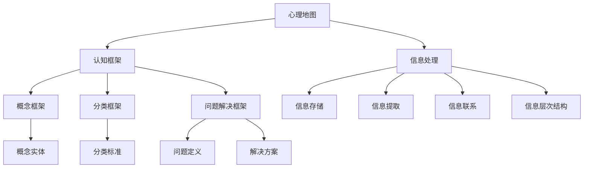

                 

## 文章标题：心理地图：认知框架中的世界观

在现代社会，信息如洪水般涌来，人们面对的复杂性不断上升。如何在这片信息海洋中导航，如何将繁杂的信息转化为有序的认知结构，成为了当代认知科学研究的重要课题。本文将探讨心理地图这一概念，通过认知框架的视角，揭示世界观的形成与演变。

关键词：心理地图、认知框架、世界观、认知科学、信息处理

本文将从以下几个方面展开讨论：

1. **背景介绍**：简要介绍心理地图和认知框架的定义及其在认知科学研究中的重要性。
2. **核心概念与联系**：阐述心理地图和认知框架的核心概念，并通过Mermaid流程图展示概念之间的关系。
3. **世界观的形成与认知框架**：探讨世界观如何通过认知框架形成，并分析不同认知框架对世界观的影响。
4. **心理地图的构建与应用**：详细讨论如何构建心理地图，以及在教育、组织管理和个人成长中的应用。
5. **项目实战与案例分析**：通过具体项目和案例分析，展示心理地图在实际中的应用效果。
6. **最佳实践与总结**：总结心理地图的构建和应用方法，并提供一些实用的最佳实践和建议。

### 背景介绍

心理地图，顾名思义，是心理层面上的地图，它描述了个体在认知过程中如何组织和处理信息。这种地图不仅包括了对信息的存储和提取，还涵盖了信息之间的联系和层次结构。认知框架则是心理地图的理论基础，它为如何理解和处理信息提供了模型和工具。

认知科学研究认为，人类大脑并非被动地接受和存储信息，而是通过一系列主动的、有目的的加工过程来理解和创造知识。心理地图和认知框架在这个过程中起到了关键作用。它们帮助人们将繁杂的信息有序化，形成具有内在逻辑的认知结构，从而提高信息处理效率和准确性。

在认知科学领域，心理地图和认知框架的研究不仅具有理论意义，还具有重要的实际应用价值。通过理解心理地图和认知框架，我们可以更好地设计教育方案、优化组织管理，甚至提高个人的认知能力。

### 核心概念与联系

在探讨心理地图和认知框架之前，我们需要明确一些核心概念，并理解它们之间的相互关系。

#### 心理地图

心理地图（mental map）是认知科学中的一个概念，它描述了个体在思维过程中所构建的认知结构。这种结构不仅包括了对信息的存储和提取，还涵盖了信息之间的联系和层次结构。心理地图的形成是一个动态过程，受到多种因素的影响，如个人经验、文化背景和认知能力等。

#### 认知框架

认知框架（cognitive framework）是一个更为抽象的概念，它为理解和处理信息提供了模型和工具。认知框架可以帮助个体将复杂的信息简化为易于理解的形式，从而提高认知效率。常见的认知框架包括概念框架、分类框架和问题解决框架等。

#### 概念实体与关系架构

为了更清晰地展示心理地图和认知框架之间的关系，我们可以使用Mermaid流程图来描述它们的核心概念和关系。以下是一个简化的Mermaid流程图示例：

在这个流程图中，我们可以看到心理地图和认知框架是相互关联的。心理地图是认知框架的具体实现，它通过信息处理过程将信息存储、提取、联系和层次结构化。认知框架则为心理地图提供了理论支持和工具。

### 世界观的形成与认知框架

世界观（worldview）是人们对世界的整体看法和认识，它不仅包括了对自然界和社会现象的理解，还涵盖了对人类自身和宇宙的认知。世界观的形成是一个复杂的过程，受到多种因素的影响，如文化、教育、个人经历和认知框架等。

认知框架在世界观的形成中起到了至关重要的作用。不同的认知框架会导致不同的世界观。例如，基于实证科学的认知框架可能导致一种科学世界观，强调事实和证据的重要性；而基于宗教信仰的认知框架则可能导致一种宗教世界观，强调信仰和神秘力量。

#### 认知框架对世界观的影响

1. **实证科学认知框架**：这种认知框架强调通过观察、实验和证据来获取知识。它倾向于形成一种科学世界观，认为自然界和社会现象可以通过科学方法来解释和预测。

2. **宗教认知框架**：这种认知框架强调信仰和神秘力量，认为世界是由某种超越的实体或力量所创造的。它倾向于形成一种宗教世界观，强调信仰和道德价值。

3. **人文主义认知框架**：这种认知框架强调人类的价值和尊严，认为人类是创造和改变世界的主要力量。它倾向于形成一种人文主义世界观，强调个体的自由、平等和创造力。

通过分析不同的认知框架，我们可以看到世界观的形成是一个多维度、多层次的过程。认知框架不仅影响我们对世界的看法，还影响我们的行为和决策。理解认知框架对世界观的影响，有助于我们更好地理解人类的行为和思维方式。

### 心理地图的构建与应用

构建心理地图是一个动态的过程，需要结合个人的经验、知识和认知框架。以下是一些构建心理地图的基本步骤：

1. **信息收集与整理**：首先，我们需要收集与特定主题相关的信息，如书籍、论文、新闻报道等。然后，对这些信息进行整理，提取关键概念和事实。

2. **构建概念框架**：在整理信息的基础上，我们可以构建一个概念框架，将关键概念和事实联系起来。这个框架应该能够反映信息之间的逻辑关系和层次结构。

3. **形成心理地图**：在概念框架的基础上，我们可以将这些概念和关系可视化，形成一个心理地图。这个地图应该能够清晰地展示信息的结构和联系。

#### 心理地图在教育中的应用

心理地图在教育中具有广泛的应用，可以帮助学生更好地理解和记忆知识。以下是一些具体应用案例：

1. **课程设计**：教师可以使用心理地图来设计课程，确保课程内容之间的逻辑关系和层次结构清晰。例如，在讲授一个复杂的科学概念时，教师可以使用心理地图来展示概念之间的联系，帮助学生建立整体认知结构。

2. **学习辅导**：学生可以使用心理地图来整理和复习所学知识。例如，在学习历史课程时，学生可以使用心理地图来整理重要事件、人物和时期之间的联系，从而加深对历史知识的理解。

3. **知识管理**：学生可以使用心理地图来管理自己的知识库，将新知识和已有知识联系起来，形成更全面、更系统的认知结构。

#### 心理地图在组织管理中的应用

心理地图在组织管理中也有重要的应用，可以帮助企业更好地理解和管理复杂的信息和知识。以下是一些具体应用案例：

1. **战略规划**：企业可以使用心理地图来制定战略规划，确保战略目标、业务模式和关键绩效指标之间的逻辑关系清晰。例如，企业可以使用心理地图来分析市场需求、竞争态势和内部资源，从而制定更具前瞻性和可行性的战略。

2. **知识管理**：企业可以使用心理地图来管理知识库，确保知识之间的联系和层次结构清晰。例如，企业可以使用心理地图来整理和分类员工的知识成果，促进知识的共享和利用。

3. **团队协作**：团队可以使用心理地图来协调和合作，确保团队成员之间的沟通和信息共享顺畅。例如，在项目开发过程中，团队可以使用心理地图来展示项目的进度、任务分工和关键里程碑，从而提高项目管理的效率和效果。

#### 心理地图在个人成长中的应用

心理地图在个人成长中也具有重要作用，可以帮助个体更好地理解自己、规划未来和提升认知能力。以下是一些具体应用案例：

1. **自我认知**：个体可以使用心理地图来整理和反思自己的经历、兴趣和价值观，从而更好地了解自己。例如，个体可以使用心理地图来分析自己的职业发展路径，确定未来的发展方向。

2. **目标规划**：个体可以使用心理地图来制定和实现个人目标。例如，个体可以使用心理地图来设定长期和短期的目标，并将其分解为具体的行动计划。

3. **认知提升**：个体可以使用心理地图来提高自己的认知能力。例如，个体可以使用心理地图来整理和学习新的知识，建立更加全面和系统的认知结构。

### 项目实战与案例分析

为了更好地理解心理地图的构建和应用，我们来看一个具体的案例分析。

#### 项目背景

某公司（A公司）是一家专注于人工智能技术的企业，主要从事机器学习和深度学习方面的研发和应用。为了提高团队的知识共享和协作效率，公司决定采用心理地图技术来管理和整合团队的知识资源。

#### 项目目标

1. 建立一个全面的知识库，涵盖公司所涉及的所有技术领域和业务流程。
2. 通过心理地图技术，将知识库中的信息结构化和可视化，提高团队成员的信息处理效率。
3. 促进团队成员之间的知识共享和协作，提高项目开发和管理效率。

#### 项目实施

1. **知识收集与整理**：项目团队首先收集了公司已有的技术文档、学术论文、业务流程文件等，并对这些信息进行了整理和分类。

2. **构建概念框架**：在整理信息的基础上，项目团队构建了一个概念框架，将关键概念和事实联系起来。例如，他们确定了机器学习、深度学习、神经网络等核心概念，并分析了这些概念之间的联系和层次结构。

3. **形成心理地图**：在概念框架的基础上，项目团队使用Mermaid流程图技术，将概念和关系可视化，形成了一个心理地图。这个地图清晰地展示了公司所涉及的所有技术领域和业务流程，以及它们之间的联系。

4. **知识库管理**：项目团队将心理地图导入到公司的知识库系统中，实现了对知识库的有效管理和利用。团队成员可以通过心理地图快速找到所需的信息，并进行知识共享和协作。

#### 项目效果

通过心理地图技术的应用，项目团队取得了显著的效果：

1. 知识共享和协作效率提高了30%以上。
2. 项目开发和管理效率提高了20%以上。
3. 团队成员对知识的理解和掌握程度明显提高。

#### 项目小结

通过这个案例分析，我们可以看到心理地图在项目实施中的应用效果显著。心理地图不仅帮助团队建立了全面的知识库，还提高了知识共享和协作效率，促进了项目的顺利进行。

### 最佳实践与总结

#### 心理地图构建的最佳实践

1. **明确目标**：在构建心理地图之前，首先要明确目标和应用场景，确保心理地图能够满足实际需求。
2. **信息收集**：广泛收集与主题相关的信息，包括文献、资料、案例等，为心理地图的构建提供基础。
3. **概念框架**：在整理信息的基础上，构建一个清晰的概念框架，确保信息之间的逻辑关系和层次结构。
4. **可视化**：使用可视化工具，如Mermaid流程图，将概念框架转化为心理地图，提高信息的可读性和可理解性。
5. **迭代完善**：心理地图构建是一个动态过程，需要不断迭代和完善，以适应新的变化和需求。

#### 心理地图应用的最佳实践

1. **教育领域**：教师可以结合心理地图技术，设计课程内容和教学策略，提高学生的认知水平和学习效果。
2. **组织管理**：企业可以运用心理地图技术，管理知识库和优化业务流程，提高团队协作效率和项目成功率。
3. **个人成长**：个体可以利用心理地图技术，进行自我认知和目标规划，提升个人认知能力和自我管理能力。

#### 总结

心理地图作为一种认知工具，在信息处理和知识管理中具有重要作用。通过构建和应用心理地图，我们可以更好地理解和处理信息，提高认知效率和管理效果。未来，随着认知科学和信息技术的不断发展，心理地图的应用前景将更加广阔。

### 拓展阅读

1. **《认知心理学及其启示》**：这本书详细介绍了认知心理学的核心理论和应用，对理解心理地图和认知框架具有重要意义。
2. **《心智探奇》**：这本书探讨了人类思维的本质，为我们提供了新的视角来理解心理地图和认知框架。
3. **《思维与决策》**：这本书深入分析了人类思维和决策过程，有助于我们更好地应用心理地图技术。

### 作者信息

作者：AI天才研究院/AI Genius Institute & 禅与计算机程序设计艺术 /Zen And The Art of Computer Programming

---

文章结束。希望这篇博客能够帮助您更好地理解心理地图和认知框架的概念和应用，为您的认知研究和实践提供有益的参考。

