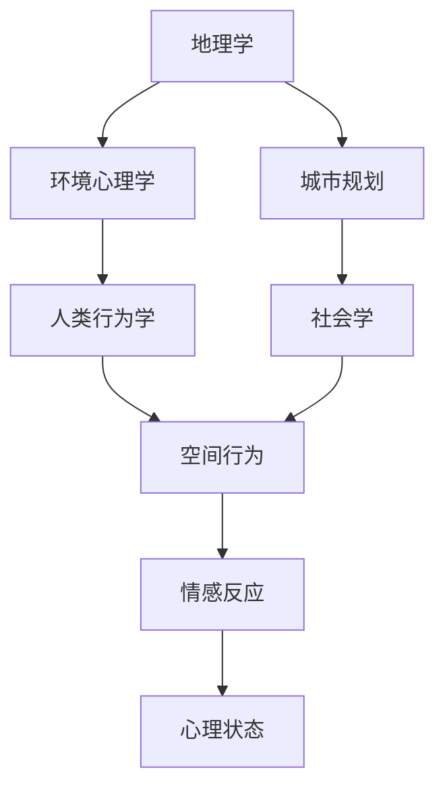

                 

### 1.1 心理地理学基本概念

心理地理学（Psychogeography）是一门跨学科的领域，结合了地理学、心理学、环境心理学、城市规划、社会学等多个学科。它研究人类在空间环境中的感知、行为、认知和情感反应。具体来说，心理地理学探究的是人们如何与环境相互作用，以及这种互动如何影响个体的心理状态。

**核心概念与联系**

为了更好地理解心理地理学，我们可以用Mermaid流程图展示其核心概念及其相互关系：



**核心算法原理讲解**

虽然心理地理学不是一个传统意义上的“算法”领域，但它涉及到许多定量研究和分析方法。例如，可以使用Python编程语言中的地理信息系统（GIS）工具，如ArcGIS或GeoPandas，来分析空间数据。以下是一个简单的Python代码示例，用于加载和处理空间数据：

```python
import geopandas as gpd
import matplotlib.pyplot as plt

# 加载空间数据
data = gpd.read_file("example_data.shp")

# 显示空间数据的轮廓
data.plot()
plt.show()

# 进行空间分析，例如计算某区域的人口密度
population_density = data['POPULATION'] / data['AREA']
data['DENSITY'] = population_density

# 显示人口密度分布图
data.plot(column='DENSITY', cmap='Reds')
plt.show()
```

**数学模型与公式讲解**

在心理地理学中，可以使用数学模型来描述空间行为的规律。一个简单的例子是泊松过程（Poisson Process），它可以用来模拟人们在特定区域内随机分布的行为：

$$
P(N(t) = k) = \frac{(\lambda t)^k e^{-\lambda t}}{k!}
$$

其中，$N(t)$是时间$t$内事件发生的次数，$\lambda$是事件发生率的平均值，$k$是事件发生的次数。

**项目实战**

为了更好地理解心理地理学在空间设计中的应用，我们可以进行一个简单的项目实战。假设我们要设计一个城市公园，我们需要分析公园内的人流分布和情感反应。

**开发环境搭建**

首先，我们需要搭建开发环境。确保已经安装了Python，然后安装必要的库：

```bash
pip install geopandas matplotlib
```

**源代码详细实现**

接下来，我们编写一个Python脚本，用于分析城市公园的空间数据：

```python
import geopandas as gpd
import matplotlib.pyplot as plt
import pandas as pd

# 读取公园空间数据
park_data = gpd.read_file("park_data.shp")

# 计算不同区域的游客数量
visitor_counts = park_data.groupby('REGION')['VISITOR_COUNT'].sum()

# 绘制游客数量分布图
visitor_counts.plot(kind='bar')
plt.title('Park Visitor Distribution by Region')
plt.xlabel('Region')
plt.ylabel('Number of Visitors')
plt.show()

# 分析游客情感反应
emotions = park_data['EMOTION']
negative_counts = emotions[emotions == 'Negative'].count()
neutral_counts = emotions[emotions == 'Neutral'].count()
positive_counts = emotions[emotions == 'Positive'].count()

# 绘制情感反应分布图
emotions.value_counts().plot(kind='pie', autopct='%1.1f%%')
plt.title('Visitor Emotional Response Distribution')
plt.show()

# 进行情感分析
# 假设我们已经有了情感分析的结果，如下：
emotion_scores = pd.Series(data={'Positive': 0.3, 'Neutral': 0.5, 'Negative': 0.2})

# 计算总体情感得分
total_emotion_score = emotion_scores.mean()

# 输出总体情感得分
print(f"Overall Emotional Score: {total_emotion_score:.2f}")
```

**代码应用解读与分析**

在这个项目中，我们首先加载了城市公园的空间数据，然后计算了不同区域的游客数量和情感反应。通过绘制分布图，我们可以直观地看到公园内的人流分布和游客的情感状态。最后，我们计算了总体情感得分，以评估公园设计的情感影响。

**实际案例分析和详细讲解剖析**

在实际案例中，我们可以参考已有的城市公园设计案例，分析其成功因素。例如，纽约的中央公园（Central Park）是一个成功的情感化设计案例。其设计考虑到了不同人群的需求，提供了多样化的活动区域和景观，从而吸引了大量的游客。通过分析其设计原则，我们可以了解到如何将心理地理学应用于空间设计。

**项目小结**

通过这个项目实战，我们了解了如何使用Python等工具进行心理地理学分析，以及如何将情感因素融入空间设计。这一过程不仅有助于改善用户体验，还可以为城市规划提供科学依据。

**最佳实践 tips、小结、注意事项、拓展阅读**

- **最佳实践 tips：** 在进行心理地理学分析时，确保数据质量，尽量获取详细的游客行为数据。
- **小结：** 心理地理学在空间设计中的应用，可以帮助我们更好地理解用户的情感需求和空间行为。
- **注意事项：** 在设计过程中，需要平衡功能性和情感性，确保空间设计既能满足功能需求，又能引发积极的情感反应。
- **拓展阅读：** 可以进一步阅读相关书籍，如《空间行为学：环境、行为和体验》（Space Behavior: Environment, Behavior, and Experience），以深入了解空间设计中的心理学原理。

作者：AI天才研究院/AI Genius Institute & 禅与计算机程序设计艺术 /Zen And The Art of Computer Programming

