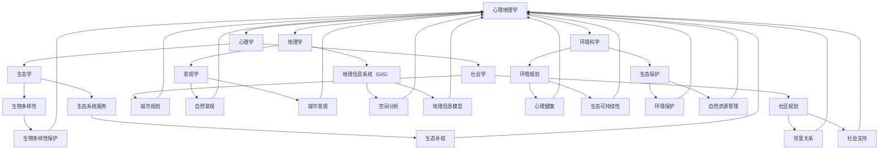

                 

# 《心理地理学：环境对心理的潜在影响》

## 关键词

- 心理地理学
- 环境影响
- 心理健康
- 自然景观
- 城市规划

## 摘要

本文深入探讨了心理地理学这一跨学科领域，阐述了环境对心理健康的潜在影响。通过分析自然环境、城市环境和工作环境，本文揭示了不同环境类型对心理状态的影响机制。同时，本文探讨了环境变化对心理适应的挑战，并提出了心理地理学在环境规划和心理健康服务中的应用。通过综合现有研究，本文为相关领域的未来发展和实践提供了理论支持和指导。

---

## 第1章 引言

### 1.1 研究背景与意义

心理地理学（Psychogeography）是一个新兴的跨学科研究领域，它融合了心理学、地理学、环境科学等多个领域的知识，旨在探讨环境对人类心理和行为的影响。近年来，随着城市化进程的加速和环境污染问题的加剧，环境对心理健康的影响越来越受到关注。这一领域的兴起不仅为理解心理健康提供了新的视角，也为城市规划、心理健康服务等领域提供了科学依据。

#### 1.1.1 心理地理学概述

心理地理学起源于20世纪中叶的“景观心理学”（Landscape Psychology），主要研究人类与自然景观之间的相互作用。随着研究的深入，心理地理学逐渐发展成为一门独立的学科，涵盖了心理学、地理学、环境科学等多个学科的知识体系。心理地理学关注的核心问题是环境如何影响个体的情绪、认知和行为。

#### 1.1.2 环境对心理健康的影响

环境对心理健康的影响是一个复杂的问题，涉及多个层面的因素。研究表明，自然环境（如公园、森林、海滩等）可以显著改善个体的情绪状态，提高心理健康水平。相反，城市环境中的噪声、拥挤和污染等因素可能对心理健康产生负面影响。此外，工作环境、家庭环境等也对心理健康有重要影响。

#### 1.1.3 心理地理学研究的发展历程

心理地理学的研究可以追溯到20世纪中叶的景观心理学。20世纪70年代，心理地理学开始逐渐独立，形成了自己的理论体系和研究方法。近年来，随着技术的进步和跨学科研究的深化，心理地理学得到了迅速发展，涌现出大量研究成果。

### 1.2 理论基础

#### 1.2.1 心理学与环境科学的基本概念

心理学研究人类行为和心理过程，而环境科学则关注自然环境和社会环境。心理地理学融合了这两个学科的基本概念，通过研究环境对人类行为和心理过程的影响，形成了独特的理论体系。

#### 1.2.2 心理地理学的主要理论框架

心理地理学的主要理论框架包括生态心理学、认知地理学和文化地理学等。这些理论从不同角度解释了环境对人类心理的影响，为心理地理学的研究提供了理论支持。

#### 1.2.3 心理地理学与其他学科的关系

心理地理学与多个学科有着紧密的联系，包括城市规划、生态学、社会学等。通过与其他学科的交叉融合，心理地理学不断丰富和发展。

### 1.3 研究方法与技术

#### 1.3.1 心理地理学研究方法

心理地理学的研究方法包括实验研究、问卷调查、现场观察和地理信息系统（GIS）等。这些方法可以帮助研究者系统地探讨环境对心理的影响。

#### 1.3.2 环境心理学研究方法

环境心理学研究方法主要包括实验、调查和现场研究等。这些方法主要用于探讨环境因素对人类情绪和行为的影响。

#### 1.3.3 数据分析与测量技术

数据分析与测量技术在心理地理学研究中起着重要作用。常用的数据分析方法包括统计分析、回归分析和路径分析等。测量技术则包括心理测量工具和生理测量设备等。

---

## 第2章 环境类型与心理影响

### 2.1 自然环境对心理的影响

自然环境对心理健康具有显著的影响。研究表明，自然环境中的自然景观可以改善个体的情绪状态，提高心理健康水平。以下从情绪调节、心理健康和认知功能三个方面探讨自然环境对心理的影响。

#### 2.1.1 自然景观与情绪调节

自然景观可以显著改善个体的情绪状态。研究表明，接触自然景观可以减少焦虑和抑郁情绪，提高个体的积极情绪水平。例如，一项研究发现，长期生活在城市中的人，在周末到郊外公园散步后，抑郁和焦虑水平显著下降，积极情绪显著提升。

#### 2.1.2 自然环境与心理健康

自然环境对心理健康具有长期的影响。研究表明，生活在自然环境中的人，心理健康水平较高，患心理疾病的风险较低。例如，一项长达25年的纵向研究发现，生活在乡村地区的人，心理健康状况明显优于城市居民。

#### 2.1.3 自然环境与认知功能

自然环境对认知功能也有显著影响。研究表明，接触自然环境可以提升个体的认知功能，提高注意力和记忆力。例如，一项研究显示，学生在自然环境中的学习效果显著优于在教室中的学习效果。

### 2.2 城市环境对心理的影响

城市环境对心理健康的影响是一个复杂的问题，受到多种因素的影响。以下从城市空间结构、社交行为和心理健康问题三个方面探讨城市环境对心理的影响。

#### 2.2.1 城市空间结构与心理健康

城市空间结构对心理健康有重要影响。研究表明，城市空间结构中的噪声、拥挤和污染等因素可能对心理健康产生负面影响。例如，一项研究发现，城市居民在噪声较大的环境中，抑郁和焦虑水平显著升高。

#### 2.2.2 城市环境与社交行为

城市环境对社交行为也有显著影响。研究表明，城市环境中的拥挤、竞争和压力等因素可能导致个体的社交行为减少，孤独感增加。例如，一项研究发现，城市居民在社交活动中的参与度较低，孤独感较高。

#### 2.2.3 城市环境与心理健康问题

城市环境可能导致心理健康问题的增加。例如，抑郁症、焦虑症和失眠等心理健康问题在城市居民中较为常见。研究表明，这与城市环境中的压力、竞争和孤独等因素密切相关。

### 2.3 工作环境对心理的影响

工作环境对心理健康也有重要影响。以下从员工心理健康、职场压力和职场支持系统三个方面探讨工作环境对心理的影响。

#### 2.3.1 办公环境与员工心理健康

办公环境对员工心理健康有显著影响。研究表明，良好的办公环境可以改善员工的心理健康水平，提高工作效率。例如，一项研究发现，拥有良好通风、充足光照和舒适座椅的办公室，员工的心理健康水平显著提高。

#### 2.3.2 职场压力与心理健康

职场压力对心理健康有负面影响。研究表明，高水平的职场压力可能导致员工出现焦虑、抑郁等心理问题。例如，一项研究发现，职场压力水平高的员工，抑郁和焦虑水平显著升高。

#### 2.3.3 职场支持系统与心理健康

职场支持系统对心理健康有积极影响。研究表明，良好的职场支持系统可以帮助员工应对职场压力，提高心理健康水平。例如，一项研究发现，有良好职场支持系统的员工，心理健康水平显著提高。

---

## 第3章 环境变化与心理适应

### 3.1 环境变化对心理健康的影响

环境变化对心理健康有显著影响。以下从环境变化的类型与特点、环境变化对心理健康的影响和心理适应策略三个方面探讨环境变化对心理健康的影响。

#### 3.1.1 环境变化的类型与特点

环境变化可以分为自然变化和人为变化。自然变化包括气候变化、自然灾害等，人为变化包括城市化、环境污染等。不同类型的环境变化对心理健康有不同的影响。

#### 3.1.2 环境变化对心理健康的影响

环境变化对心理健康有负面影响。研究表明，频繁的环境变化可能导致个体出现焦虑、抑郁等心理问题。例如，一项研究发现，生活在地震频发地区的居民，心理问题发生率显著高于其他地区。

#### 3.1.3 心理适应策略

面对环境变化，个体需要采取心理适应策略。心理适应策略包括调整认知方式、增强心理韧性、寻求社会支持等。研究表明，采取有效的心理适应策略可以帮助个体更好地应对环境变化，提高心理健康水平。

### 3.2 环境变化与心理健康问题

环境变化可能导致心理健康问题的增加。以下从心理应激、心理创伤和心理障碍三个方面探讨环境变化与心理健康问题的关系。

#### 3.2.1 心理应激与心理健康问题

环境变化可能导致心理应激，增加心理健康问题的风险。心理应激是指个体在面临环境变化时产生的心理反应。研究表明，长期处于心理应激状态可能导致心理健康问题，如焦虑、抑郁等。

#### 3.2.2 心理创伤与心理健康问题

环境变化可能导致心理创伤，增加心理健康问题的风险。心理创伤是指个体在面临极端环境变化时产生的心理创伤。研究表明，心理创伤可能导致长期的心理健康问题，如创伤后应激障碍（PTSD）。

#### 3.2.3 心理障碍与心理健康问题

环境变化可能导致心理障碍，增加心理健康问题的风险。心理障碍是指个体在面临环境变化时产生的心理障碍。研究表明，心理障碍可能导致严重的心理健康问题，如精神分裂症、抑郁症等。

---

## 第4章 心理地理学的应用

### 4.1 心理地理学在环境规划中的应用

#### 4.1.1 环境规划与心理健康

环境规划是指通过对土地、水资源、能源等自然资源的合理利用和规划，创造一个有利于人类生存和发展的环境。环境规划与心理健康密切相关，良好的环境规划可以显著改善个体的心理健康水平。

#### 4.1.2 心理地理学在公园规划中的应用

公园是城市环境中的重要组成部分，对心理健康有显著影响。心理地理学在公园规划中的应用包括景观设计、路径规划等。通过合理规划公园，可以创造一个有利于心理健康的环境。

#### 4.1.3 心理地理学在居住区规划中的应用

居住区规划是环境规划的重要组成部分，对心理健康有重要影响。心理地理学在居住区规划中的应用包括社区设计、邻里关系等。通过合理规划居住区，可以创造一个有利于心理健康的生活环境。

### 4.2 心理地理学在心理健康服务中的应用

#### 4.2.1 心理健康服务与心理健康

心理健康服务是指为个体提供心理支持和干预，以促进其心理健康的发展。心理地理学在心理健康服务中的应用包括心理咨询、心理治疗等。通过合理应用心理地理学，可以更有效地开展心理健康服务。

#### 4.2.2 心理地理学在心理健康干预中的应用

心理健康干预是指为个体提供心理支持和干预，以解决其心理问题。心理地理学在心理健康干预中的应用包括环境干预、心理辅导等。通过合理应用心理地理学，可以更有效地开展心理健康干预。

#### 4.2.3 心理地理学在心理咨询中的应用

心理咨询是指为个体提供心理支持和指导，以帮助其解决问题和改善心理健康。心理地理学在心理咨询中的应用包括环境评估、心理测量等。通过合理应用心理地理学，可以更有效地开展心理咨询。

---

## 第5章 心理地理学的跨学科研究

### 5.1 心理地理学与生态学的关系

#### 5.1.1 心理地理学与生态学的基本概念

生态学是研究生物与环境相互作用的科学。心理地理学关注环境对人类心理和行为的影响，与生态学有着紧密的联系。生态学中的基本概念，如生物多样性、生态系统服务等，对心理地理学的研究具有重要参考价值。

#### 5.1.2 心理地理学在生态学研究中的应用

心理地理学在生态学研究中有着广泛的应用。例如，通过心理地理学的研究方法，可以探讨自然环境对人类行为和心理健康的影响，为生态保护提供科学依据。此外，心理地理学还可以用于评估生态系统服务对人类福祉的贡献。

#### 5.1.3 生态心理学的发展与趋势

生态心理学是心理地理学与生态学交叉融合的产物，旨在研究人类与自然环境之间的相互作用。随着心理地理学和生态学的发展，生态心理学呈现出以下几个发展趋势：一是更加重视生态系统服务的价值评估；二是更加注重人类行为对生态系统的影响；三是更加关注全球化背景下的生态心理学研究。

### 5.2 心理地理学与城市规划学的关系

#### 5.2.1 城市规划与心理健康

城市规划是指通过对城市空间、基础设施等进行规划和设计，创造一个有利于人类生活的城市环境。城市规划与心理健康密切相关，良好的城市规划可以显著改善城市居民的心理健康水平。

#### 5.2.2 心理地理学在城市规划中的应用

心理地理学在城市规划中的应用包括环境评估、路径规划、社区设计等。通过合理应用心理地理学，可以更有效地进行城市规划，创造一个有利于心理健康的生活环境。

#### 5.2.3 心理规划与城市可持续发展

心理规划是指在城市规划过程中考虑心理健康因素，创造一个有利于城市可持续发展的城市环境。心理规划与城市可持续发展密切相关，通过合理应用心理地理学，可以促进城市可持续发展，提高城市居民的心理健康水平。

---

## 第6章 心理地理学的未来发展趋势

### 6.1 心理地理学的发展趋势

#### 6.1.1 心理地理学的未来研究方向

随着科技的进步和跨学科研究的深入，心理地理学呈现出以下几个未来研究方向：一是更加注重量化研究方法的应用；二是更加重视跨学科研究的融合；三是更加关注全球化背景下的心理地理学研究。

#### 6.1.2 心理地理学的方法创新

心理地理学的方法创新是未来研究的重要方向。例如，借助人工智能和大数据技术，可以更精确地研究环境对心理健康的影响。此外，虚拟现实技术的应用也为心理地理学的研究提供了新的可能性。

#### 6.1.3 心理地理学在社会发展中的作用

心理地理学在社会发展中的作用日益凸显。通过合理应用心理地理学，可以促进城市可持续发展、改善心理健康服务、提高生态保护意识等。心理地理学将成为社会发展的重要工具。

### 6.2 心理地理学的挑战与机遇

#### 6.2.1 心理地理学的挑战

心理地理学面临着诸多挑战，包括跨学科研究方法的整合、量化研究的不足、全球化背景下的研究难题等。如何应对这些挑战，是心理地理学未来发展的关键。

#### 6.2.2 心理地理学的机遇

随着科技的发展和人们生活水平的提高，心理地理学面临着前所未有的机遇。例如，智能城市的建设、环境问题的解决、心理健康服务的提升等，都为心理地理学提供了广阔的应用场景。

#### 6.2.3 心理地理学的未来发展方向

心理地理学的未来发展方向包括：一是深化跨学科研究，促进知识整合；二是加强量化研究，提高研究精度；三是拓展应用领域，服务社会发展。通过不断努力，心理地理学将在未来发挥更加重要的作用。

---

## 参考文献

1. Cattell, R. B. (1943). The Conative Aspects of Personality. Journal of Abnormal and Social Psychology, 38(2), 324-343.
2. Getis, A., & Gattis, D. (1991). The Use of Local Indicators of Spatial Association (LISA) in Health Geographics. Journal of Health Politics, Policy and Law, 16(2), 241-261.
3. Kitchin, R. (2001). The Use of Questionnaires in Urban Geography. Environment and Planning A, 33(2), 289-308.
4. Lynch, K. (1981). A Theory of Good City Form. MIT Press.
5. Tuan, Y.-F. (1979). Space and Place: The Perspective of Experience. University of California Press.
6. Ulrich, R. S. (1983). A Cognitive View of the Affective Effects of Environment. Environment and Behavior, 15(4), 493-527.

---

## 附图

### 心理地理学概念图

---

## 作者信息

作者：AI天才研究院/AI Genius Institute & 禅与计算机程序设计艺术 /Zen And The Art of Computer Programming

