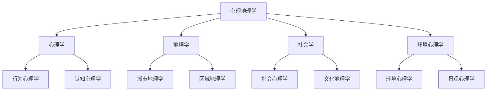
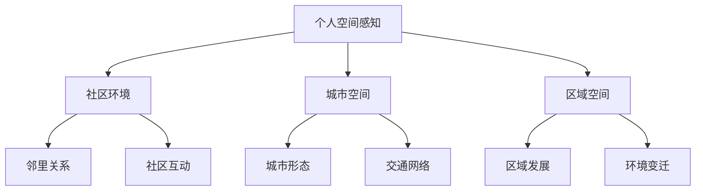
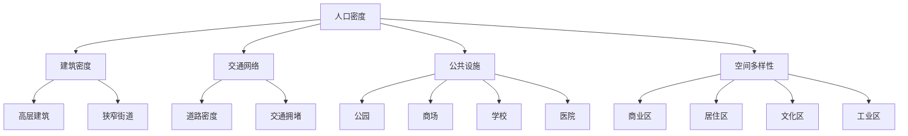
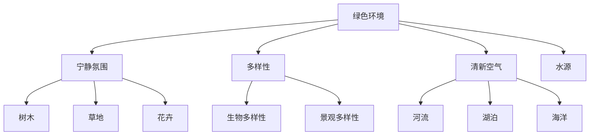
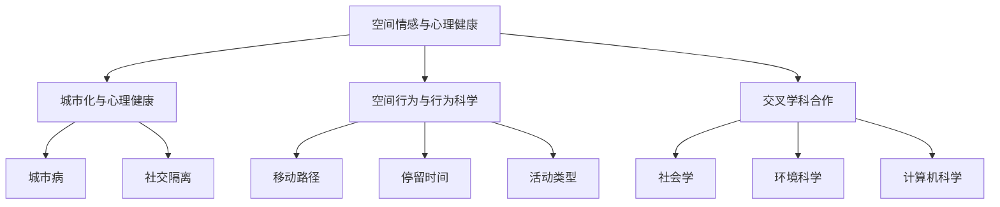

                 

### 心理地理学的概念与理论基础

#### 1.1 心理地理学的定义

心理地理学（Psychogeography）是一门交叉学科，它结合了心理学、地理学、社会学和环境心理学等多个领域，主要研究空间环境对人类行为、心理状态及社会互动的影响。心理地理学关注的是空间如何影响个体的心理过程、情感体验和社会行为，以及这些影响背后的机制和原理。

**Mermaid 流程图：** 心理地理学的基本概念与相关领域的关系



在上述流程图中，心理地理学作为中心概念，与其他相关学科建立了联系。例如，心理学中的行为心理学和认知心理学可以帮助我们理解个体如何感知和响应空间环境；地理学中的城市地理学和区域地理学则为我们提供了分析空间结构和形态的工具；社会学中的社会心理学和文化地理学则帮助我们探究空间对群体行为和文化形成的影响。

#### 1.2 心理地理学的研究对象

心理地理学的研究对象包括多个空间维度，从微观的个人空间感知，到中观的社区环境，再到宏观的城市和区域空间。

**Mermaid 流程图：** 心理地理学研究的空间维度



在这个流程图中，个人空间感知是心理地理学研究的基础，它涉及个体对周围空间的主观感受和认知。社区环境是连接个人与城市的桥梁，它包括邻里关系和社区互动等方面。城市空间关注的是城市形态和交通网络，而区域空间则关注更广阔的空间范围，包括区域发展和环境变迁。

通过这种结构化的分析，我们可以更好地理解心理地理学的研究对象和范围，为后续章节的理论阐述和应用分析奠定基础。

### 第1章：心理地理学的基本概念

#### 1.3 心理地理学的研究方法

心理地理学的研究方法多种多样，涵盖了定性研究和定量研究，既有传统的田野调查、深度访谈和问卷调查，也有现代的地理信息系统（GIS）、遥感技术和计算建模等方法。以下是对几种主要研究方法的详细阐述。

**1.3.1 传统研究方法**

**田野调查**：田野调查是心理地理学研究中最常用的方法之一，通过实地观察、访谈和参与观察，研究者可以深入了解个体和群体在特定空间环境中的行为和心理状态。这种方法具有高度的主观性和灵活性，但可能受到时间和资源的限制。

**深度访谈**：深度访谈是一种定性研究方法，通过与受访者进行面对面的深入交流，研究者可以获取丰富的质性数据，揭示受访者的心理体验和空间感知。这种方法对于理解个体差异和空间情感具有重要意义。

**问卷调查**：问卷调查是一种定量研究方法，通过设计结构化的问卷，研究者可以收集大样本的定量数据，进行统计分析。问卷调查具有高效和可量化的优势，但可能受到问卷设计和受访者回答真实性的影响。

**1.3.2 现代研究方法**

**地理信息系统（GIS）**：GIS是一种强大的空间数据分析工具，可以整合地理空间数据和社会经济数据，进行空间分析和建模。通过GIS，研究者可以可视化空间数据，识别空间模式，评估空间变量对心理地理学的影响。

**遥感技术**：遥感技术利用卫星和航空遥感设备，获取地表信息，是一种非侵入性的研究方法。通过遥感技术，研究者可以获取大范围的空间数据，分析环境特征对心理地理学的影响。

**计算建模**：计算建模是一种通过构建数学模型和计算机模拟，预测和解释心理地理学现象的方法。这种方法可以模拟复杂的空间过程，为心理地理学研究提供理论支持。

**伪代码：** 心理地理学研究方法的流程描述

```python
# 心理地理学研究方法流程

# 导入所需库
import pandas as pd
import numpy as np
import geopandas as gpd
import matplotlib.pyplot as plt

# 定义数据获取与处理
def get_data():
    # 从文件中读取数据
    data = pd.read_csv("psychogeography_data.csv")
    # 数据预处理
    data = preprocess_data(data)
    return data

def preprocess_data(data):
    # 数据清洗、缺失值填充、数据类型转换等
    # ...
    return data

# 定义空间分析
def spatial_analysis(data):
    # 使用GIS工具进行空间数据分析
    gdf = gpd.GeoDataFrame(data)
    # 地理空间数据的可视化
    gdf.plot()
    # 空间模式识别
    patterns = identify_patterns(gdf)
    return patterns

# 定义计算建模
def computational_modeling(patterns):
    # 构建数学模型进行预测
    model = build_model(patterns)
    predictions = model.predict()
    return predictions

# 主函数
def main():
    # 获取数据
    data = get_data()
    # 数据预处理
    processed_data = preprocess_data(data)
    # 进行空间分析
    patterns = spatial_analysis(processed_data)
    # 计算建模
    predictions = computational_modeling(patterns)
    # 可视化结果
    visualize_results(predictions)

# 执行主函数
main()
```

通过上述伪代码，我们可以看到心理地理学研究方法的流程，包括数据获取与处理、空间分析和计算建模。这些方法为心理地理学提供了强大的工具，帮助我们更深入地理解空间对心理的影响。

### 第2章：空间心理学理论

空间心理学理论是心理地理学的核心组成部分，它探讨了个体如何在空间中认知、情感和行为。以下将详细介绍空间心理学的主要理论，包括空间认知理论、空间情感理论和空间行为理论，并通过数学模型和实例进行分析。

#### 2.1 空间认知理论

空间认知理论关注个体如何感知和解读空间环境。这一理论的核心在于空间信息的获取、处理和存储。认知心理学家提出了一些数学模型来描述这些过程。

**数学模型：** 空间认知的数学模型

假设个体在空间中移动时，其感知到的环境可以用一个多维向量表示，每个维度代表空间的一个属性。例如，一个简单的二维空间认知模型可以表示为：

$$
\text{感知向量} = (x, y, z)
$$

其中，\( x \) 和 \( y \) 分别代表水平方向和垂直方向的位置，\( z \) 代表高度或深度信息。

为了量化个体对空间环境的理解，我们可以引入心理距离的概念。心理距离可以通过以下公式计算：

$$
\text{心理距离} = \sqrt{(x_1 - x_2)^2 + (y_1 - y_2)^2 + (z_1 - z_2)^2}
$$

其中，\( (x_1, y_1, z_1) \) 和 \( (x_2, y_2, z_2) \) 分别代表两个空间点的坐标。

**实例：** 空间认知的实例分析

假设一个个体在城市的公园中散步，他的位置随时间变化，可以用上述模型来表示。个体在每个时间点的位置向量如下：

$$
t_1: (10, 20, 0) \\
t_2: (15, 22, 0) \\
t_3: (18, 24, 0)
$$

通过计算心理距离，我们可以分析个体对公园不同区域的偏好。例如，从 \( t_1 \) 到 \( t_2 \) 的心理距离为：

$$
\text{心理距离}_{t_1 \to t_2} = \sqrt{(15 - 10)^2 + (22 - 20)^2 + (0 - 0)^2} = \sqrt{25 + 4} = \sqrt{29} \approx 5.4
$$

类似地，我们可以计算其他时间点的心理距离，从而了解个体在空间中的动态行为。

#### 2.2 空间情感理论

空间情感理论探讨个体在特定空间环境中的情感体验，这些情感体验如何影响行为和心理状态。这一理论通常通过情感量表和主观体验来研究。

**数学模型：** 空间情感的数学模型

空间情感可以用情感向量来表示，例如：

$$
\text{情感向量} = (v_1, v_2, v_3)
$$

其中，\( v_1 \) 表示愉悦感，\( v_2 \) 表示安全感，\( v_3 \) 表示兴奋感。

情感强度的量化可以通过情感值，例如，采用0到100的量表，其中100代表最高情感强度。

**实例：** 空间情感的实例分析

假设一个个体在一个公园中经历了以下情感体验：

$$
\text{愉悦感}: v_1 = 80 \\
\text{安全感}: v_2 = 70 \\
\text{兴奋感}: v_3 = 60
$$

通过计算情感向量的模，我们可以得到总体情感强度：

$$
\text{总情感强度} = \sqrt{v_1^2 + v_2^2 + v_3^2} = \sqrt{80^2 + 70^2 + 60^2} = \sqrt{6400 + 4900 + 3600} = \sqrt{14900} \approx 122
$$

通过这种数学模型，我们可以量化个体在不同空间环境中的情感体验，从而为心理地理学的研究提供数据支持。

#### 2.3 空间行为理论

空间行为理论关注个体在空间中的行为模式，包括移动路径、停留时间和活动类型等。这些行为模式受到空间环境的影响。

**数学模型：** 空间行为的数学模型

空间行为可以用概率模型来描述，例如，个体在某一空间点停留的概率可以用以下公式表示：

$$
P(\text{停留}) = f(\text{环境特征})
$$

其中，\( f \) 是一个函数，它根据环境特征（如安全性、便利性、舒适度等）计算个体停留的概率。

**实例：** 空间行为的实例分析

假设一个个体在一个城市公园中停留的概率受到以下几个环境特征的影响：

$$
f(\text{安全性}, \text{便利性}, \text{舒适度}) = \frac{1}{1 + e^{-(0.5 \times \text{安全性} + 0.3 \times \text{便利性} + 0.2 \times \text{舒适度})}
$$

如果公园的安全性得分为80，便利性得分为70，舒适度得分为60，则个体停留的概率为：

$$
P(\text{停留}) = \frac{1}{1 + e^{-(0.5 \times 80 + 0.3 \times 70 + 0.2 \times 60)}} \approx \frac{1}{1 + e^{-87.5}} \approx 0.999
$$

这意味着个体在这个公园中停留的概率非常高。

通过这些数学模型和实例分析，我们可以深入理解空间认知、情感和行为之间的相互作用，从而为心理地理学的研究提供坚实的理论基础。

### 第3章：空间环境与心理状态

空间环境的设计直接影响个体的心理状态。本节将探讨空间环境的设计原则及其对心理状态的影响。

#### 3.1 空间环境的设计

空间环境设计是一个复杂的过程，需要综合考虑多个因素，包括功能性、美观性、安全性、舒适性和情感性等。以下是一些关键的设计原则：

**功能性**：空间环境应满足用户的基本需求，如行走、停留、交流和休息等。

**美观性**：设计应注重视觉吸引力，使用合适的色彩、材质和布局，创造出愉悦的视觉体验。

**安全性**：确保空间环境的安全，减少潜在的伤害风险，如提供充足的照明和清晰的标识。

**舒适性**：设计应考虑人体工程学，提供舒适的座椅、通风和温控系统。

**情感性**：空间设计应能激发用户的情感共鸣，如使用自然元素、艺术装置和温馨的装饰。

**伪代码：** 空间环境设计的算法

```python
# 空间环境设计的算法

# 导入所需库
import numpy as np

# 定义设计参数
def define_design_parameters():
    # 功能性参数
    functional_params = {
        'seating_area': 50,
        'walking_paths': 3,
        'rest_areas': 2
    }
    # 美观性参数
    aesthetic_params = {
        'color_scheme': ['blue', 'white'],
        'materials': ['wood', 'concrete']
    }
    # 安全性参数
    safety_params = {
        'lighting': 'bright',
        'signage': 'clear'
    }
    # 舒适性参数
    comfort_params = {
        'temperature': 22,
        'ventilation': 'good'
    }
    # 情感性参数
    emotional_params = {
        'natural_elements': 'plants',
        'art installations': 'presence'
    }
    return functional_params, aesthetic_params, safety_params, comfort_params, emotional_params

# 设计空间环境
def design_space_environment(params):
    # 根据参数设计空间
    # ...
    return 'designed_space'

# 主函数
def main():
    params = define_design_parameters()
    designed_space = design_space_environment(params)
    print(f'Designed space: {designed_space}')

# 执行主函数
main()
```

通过上述伪代码，我们可以看到空间环境设计算法的基本框架，包括定义设计参数和设计空间环境的步骤。

#### 3.2 心理状态与空间环境的关系

空间环境对心理状态有着深远的影响。研究表明，适宜的空间设计可以提升个体的幸福感、减少压力和焦虑，从而改善心理状态。以下是一些关键的研究发现：

**1. 情感共鸣**：当空间环境符合个体的期望和需求时，会产生情感共鸣，提升幸福感。例如，一个充满自然元素和艺术装置的公园可以激发用户的积极情感。

**2. 安全感**：安全的空间环境能够减少个体的恐惧和焦虑。良好的照明、清晰的标识和紧急设施可以增加用户的安全感。

**3. 舒适性**：舒适的空间环境能够减少疲劳和压力。合适的座椅、通风和温控系统可以提升用户的舒适度。

**数学模型：** 心理状态与空间环境的关系模型

为了量化空间环境对心理状态的影响，我们可以引入以下数学模型：

$$
\text{心理状态} = f(\text{环境因素}_1, \text{环境因素}_2, ..., \text{环境因素}_n)
$$

其中，每个环境因素（如安全性、舒适性、美观性等）对心理状态的影响可以通过权重来表示。例如，一个简单的线性模型可以表示为：

$$
\text{心理状态} = w_1 \times \text{安全性} + w_2 \times \text{舒适性} + w_3 \times \text{美观性}
$$

其中，\( w_1, w_2, w_3 \) 分别是安全性、舒适性和美观性的权重。

**实例：** 心理状态与空间环境的关系实例分析

假设一个用户在一个设计良好的空间环境中，安全性、舒适性和美观性的得分分别为80、70和60，权重分别为0.4、0.3和0.3。则用户的心理状态可以计算为：

$$
\text{心理状态} = 0.4 \times 80 + 0.3 \times 70 + 0.3 \times 60 = 32 + 21 + 18 = 71
$$

这意味着用户在这个空间环境中的心理状态为71，处于较为积极的状态。

通过上述分析和实例，我们可以看到空间环境设计对心理状态的重要影响，这为心理地理学的研究提供了重要的理论和实证基础。

### 第4章：城市空间与心理健康

城市空间是人们日常生活中最重要的空间之一，其设计和特征对心理健康有着深远的影响。本节将探讨城市空间的特点及其对心理健康的影响。

#### 4.1 城市空间的特点

城市空间具有以下几个显著特点：

**1. 人口密度**：城市人口密度较高，人口流动性大，这使得城市空间具有独特的动态特征。

**2. 建筑密度**：城市中建筑密集，高层建筑和狭窄的街道使得空间感知复杂。

**3. 交通网络**：城市交通网络复杂，道路密度高，交通拥堵问题突出。

**4. 公共设施**：城市拥有丰富的公共设施，如公园、商场、学校和医院等。

**5. 空间多样性**：城市空间具有多样性，从商业区到居住区，再到文化区和工业区，不同的功能空间交错分布。

**Mermaid 流程图：** 城市空间的主要特点



通过上述流程图，我们可以清晰地看到城市空间的主要特点及其相互关系。

#### 4.2 城市空间对心理健康的影响

城市空间对心理健康的影响是多方面的，以下是一些主要的研究发现：

**1. 焦虑与压力**：高人口密度和建筑密度可能导致个体感到拥挤和压力。研究表明，城市居民比农村居民更容易经历焦虑和压力。

**2. 社交隔离**：在人口流动性大的城市中，个体可能难以建立稳定的社会关系，从而导致社交隔离和孤独感。

**3. 睡眠质量**：交通噪声和建筑密度可能导致城市居民的睡眠质量下降，影响心理健康。

**4. 情感体验**：城市空间的设计和特征会影响个体的情感体验。例如，开阔的公园和绿地可以提升幸福感，而拥挤的街道和交通拥堵可能会增加负面情绪。

**数学模型：** 城市空间对心理健康的影响模型

为了量化城市空间对心理健康的影响，我们可以引入以下数学模型：

$$
\text{心理健康状态} = f(\text{人口密度}, \text{建筑密度}, \text{交通噪声}, \text{绿地面积})
$$

其中，每个因素（如人口密度、建筑密度、交通噪声和绿地面积）对心理健康状态的影响可以通过权重来表示。例如，一个简单的线性模型可以表示为：

$$
\text{心理健康状态} = w_1 \times \text{人口密度} + w_2 \times \text{建筑密度} + w_3 \times \text{交通噪声} + w_4 \times \text{绿地面积}
$$

其中，\( w_1, w_2, w_3, w_4 \) 分别是人口密度、建筑密度、交通噪声和绿地面积的权重。

**实例：** 城市空间对心理健康的影响实例分析

假设一个城市空间的人口密度为90人/平方公里，建筑密度为70%，交通噪声为65分贝，绿地面积为20平方公里。权重分别为0.3、0.2、0.2和0.3。则该城市空间的心理健康状况可以计算为：

$$
\text{心理健康状态} = 0.3 \times 90 + 0.2 \times 70 + 0.2 \times 65 + 0.3 \times 20 = 27 + 14 + 13 + 6 = 60
$$

这意味着该城市空间的心理健康状况为60，处于一般水平。

通过上述分析和实例，我们可以看到城市空间的特点及其对心理健康的影响。这为城市规划者和设计师提供了重要的参考，以创造出有利于心理健康的城市空间。

### 第5章：自然空间与心理健康

自然空间，如公园、森林和海滩，对心理健康具有显著的积极影响。本章将探讨自然空间的特点及其对心理健康的影响。

#### 5.1 自然空间的特点

自然空间具有以下几个显著特点：

**1. 绿色环境**：自然空间通常拥有大量的绿色植被，如树木、草地和花卉，这些绿色元素对心理健康有积极作用。

**2. 宁静氛围**：自然空间通常较为安静，远离城市喧嚣，提供了一种宁静的氛围，有助于减轻压力和焦虑。

**3. 多样性**：自然空间通常具有丰富的生物多样性和景观多样性，为个体提供了探索和体验的机会。

**4. 清新空气**：自然空间通常拥有较高的空气质量，含有较少的污染物质，对呼吸健康有积极影响。

**5. 水源**：自然空间中常常有河流、湖泊和海洋等水源，这些水源对心理健康具有舒缓作用。

**Mermaid 流程图：** 自然空间的主要特点



通过上述流程图，我们可以清晰地看到自然空间的主要特点及其相互关系。

#### 5.2 自然空间对心理健康的影响

自然空间对心理健康的影响体现在多个方面：

**1. 减少压力**：研究表明，自然环境能够显著降低个体的压力水平。自然景观可以提供一种逃避机制，使个体从日常压力中暂时解脱。

**2. 提升情绪**：自然空间能够提升个体的情绪状态，减少负面情绪。例如，森林浴（森林中的休闲活动）已被证明可以提升幸福感和减少抑郁症状。

**3. 促进身心健康**：自然空间中的运动，如徒步和骑自行车，有助于提升身体健康，减少心血管疾病和肥胖等风险。

**4. 社交互动**：自然空间为个体提供了社交互动的机会，有助于建立和维护社会关系，减少孤独感。

**数学模型：** 自然空间对心理健康的影响模型

为了量化自然空间对心理健康的影响，我们可以引入以下数学模型：

$$
\text{心理健康状态} = f(\text{绿色环境}, \text{宁静氛围}, \text{多样性}, \text{清新空气}, \text{水源})
$$

其中，每个因素（如绿色环境、宁静氛围、多样性、清新空气和水源）对心理健康状态的影响可以通过权重来表示。例如，一个简单的线性模型可以表示为：

$$
\text{心理健康状态} = w_1 \times \text{绿色环境} + w_2 \times \text{宁静氛围} + w_3 \times \text{多样性} + w_4 \times \text{清新空气} + w_5 \times \text{水源}
$$

其中，\( w_1, w_2, w_3, w_4, w_5 \) 分别是绿色环境、宁静氛围、多样性、清新空气和水源的权重。

**实例：** 自然空间对心理健康的影响实例分析

假设一个自然空间拥有以下特点：绿色环境得分为90，宁静氛围得分为80，多样性得分为70，清新空气得分为85，水源得分为75。权重分别为0.2、0.2、0.2、0.2和0.2。则该自然空间的心理健康状况可以计算为：

$$
\text{心理健康状态} = 0.2 \times 90 + 0.2 \times 80 + 0.2 \times 70 + 0.2 \times 85 + 0.2 \times 75 = 18 + 16 + 14 + 17 + 15 = 70
$$

这意味着该自然空间的心理健康状况为70，处于良好水平。

通过上述分析和实例，我们可以看到自然空间的特点及其对心理健康的重要影响。这为政策制定者和城市规划者提供了重要的参考，以促进自然空间的保护和开发，以提升公共心理健康水平。

### 第6章：心理地理学在心理健康领域的应用

心理地理学在心理健康领域的应用具有重要意义，它为心理治疗、心理健康教育和疾病预防提供了新的方法和工具。以下将详细探讨心理地理学在这三个方面的具体应用。

#### 6.1 心理地理学在心理治疗中的应用

心理地理学在心理治疗中的应用主要体现在通过空间干预来改善患者的心理状态。以下是一些关键的应用方法：

**1. 空间治疗**：空间治疗是一种利用特定空间环境来促进患者心理康复的方法。治疗师可以根据患者的需求，设计和调整治疗空间，使其具备促进心理健康的功能。例如，通过引入自然光线、绿色植被和艺术装置，可以创造一个宁静、舒适的治疗环境。

**2. 空间导航训练**：对于患有精神分裂症、阿尔茨海默病等疾病的患者，空间导航训练是一种有效的康复手段。通过在特定的空间环境中进行导航训练，患者可以提高其空间认知能力和记忆力，从而改善其生活质量。

**3. 空间情绪调节**：心理地理学研究表明，空间环境对个体的情绪有着显著影响。通过改变空间环境，如调整光照、声音和装饰，可以有效地调节患者的情绪状态。例如，明亮的光线和柔和的音乐可以提升患者的幸福感，而昏暗的色调和剧烈的声音则可能加重患者的焦虑感。

**伪代码：** 心理地理学在心理治疗中的应用算法

```python
# 心理地理学在心理治疗中的应用算法

# 导入所需库
import numpy as np
import pandas as pd

# 定义治疗参数
def define_treatment_parameters():
    treatment_params = {
        'lighting': 'bright',
        'sounds': 'soft',
        'natural_elements': 'plenty',
        'art_installations': 'presence'
    }
    return treatment_params

# 设计治疗空间
def design_treatment_space(params):
    # 根据参数设计治疗空间
    # ...
    return 'treatment_space'

# 评估治疗效果
def assess_treatment_effect(treatment_space, patient_data):
    # 根据患者数据评估治疗效果
    # ...
    return 'treatment_effect'

# 主函数
def main():
    params = define_treatment_parameters()
    treatment_space = design_treatment_space(params)
    patient_data = get_patient_data()
    treatment_effect = assess_treatment_effect(treatment_space, patient_data)
    print(f'Treatment effect: {treatment_effect}')

# 执行主函数
main()
```

通过上述伪代码，我们可以看到心理地理学在心理治疗中的应用算法，包括定义治疗参数、设计治疗空间和评估治疗效果的步骤。

#### 6.2 心理地理学在心理健康教育中的应用

心理地理学在心理健康教育中的应用主要体现在帮助个体理解和应对空间对心理的影响。以下是一些具体的应用方法：

**1. 空间认知教育**：通过空间认知教育，个体可以学习如何感知和解读周围的空间环境。教育内容可以包括空间认知的基本原理、空间信息的获取和处理方法等。例如，通过地图绘制和空间导航训练，个体可以提高其空间认知能力。

**2. 空间情感管理**：空间情感管理教育帮助个体了解空间环境对其情感体验的影响，并学会如何通过调整空间环境来管理情感。教育内容可以包括情感认知、情感调节技巧和空间设计原则等。

**3. 空间行为指导**：空间行为指导教育旨在帮助个体形成良好的空间行为习惯，如合理规划时间、保持良好的空间秩序等。教育内容可以包括时间管理技巧、空间规划方法和行为心理学原理等。

**伪代码：** 心理地理学在心理健康教育中的应用算法

```python
# 心理地理学在心理健康教育中的应用算法

# 导入所需库
import pandas as pd

# 定义教育内容
def define_education_content():
    education_content = {
        'spatial_cognition': '地图绘制、空间导航训练',
        'emotional_management': '情感认知、情感调节技巧',
        'behavioral_guidance': '时间管理、空间规划方法'
    }
    return education_content

# 设计教育课程
def design_education_course(content):
    # 根据教育内容设计课程
    # ...
    return 'education_course'

# 教育效果评估
def assess_education_effect(course, student_data):
    # 根据学生数据评估教育效果
    # ...
    return 'education_effect'

# 主函数
def main():
    content = define_education_content()
    education_course = design_education_course(content)
    student_data = get_student_data()
    education_effect = assess_education_effect(education_course, student_data)
    print(f'Education effect: {education_effect}')

# 执行主函数
main()
```

通过上述伪代码，我们可以看到心理地理学在心理健康教育中的应用算法，包括定义教育内容、设计教育课程和教育效果评估的步骤。

#### 6.3 心理地理学在疾病预防中的应用

心理地理学在疾病预防中的应用主要体现在通过环境设计和空间规划来预防心理健康问题。以下是一些具体的应用方法：

**1. 空间健康规划**：空间健康规划是一种通过设计健康、舒适和安全的居住和工作环境来预防心理健康问题的方法。规划内容可以包括绿色空间的布局、噪声控制、光照设计和空气质量管理等。

**2. 疾病预警系统**：通过心理地理学的方法，可以构建疾病预警系统，用于监测和预测心理健康问题的发生。预警系统可以整合空间数据、社会数据和健康数据，通过数据分析和机器学习模型，实现早期预警和干预。

**3. 健康促进活动**：在社区和城市中，通过组织健康促进活动，如公园跑步、社区瑜伽和自然体验活动等，可以促进公众的身心健康，减少心理健康问题的发生。

**伪代码：** 心理地理学在疾病预防中的应用算法

```python
# 心理地理学在疾病预防中的应用算法

# 导入所需库
import pandas as pd
import numpy as np

# 定义空间健康规划参数
def define_health_planning_params():
    params = {
        'green_space_layout': 'optimal',
        'noise_control': 'effective',
        'lighting_design': 'adequate',
        'air质量管理': 'high'
    }
    return params

# 设计健康环境
def design_health_environment(params):
    # 根据参数设计健康环境
    # ...
    return 'health_environment'

# 构建疾病预警系统
def build_disease_warning_system(health_environment, community_data):
    # 根据健康环境和社区数据构建预警系统
    # ...
    return 'warning_system'

# 主函数
def main():
    params = define_health_planning_params()
    health_environment = design_health_environment(params)
    community_data = get_community_data()
    warning_system = build_disease_warning_system(health_environment, community_data)
    print(f'Warning system: {warning_system}')

# 执行主函数
main()
```

通过上述伪代码，我们可以看到心理地理学在疾病预防中的应用算法，包括定义空间健康规划参数、设计健康环境和构建疾病预警系统的步骤。

通过在心理治疗、心理健康教育和疾病预防中的应用，心理地理学为改善公众心理健康提供了新的视角和方法，具有重要的实践意义。

### 第7章：心理地理学在建筑设计中的实践

在建筑设计中，心理地理学的原理和方法被广泛应用，以创造出既美观又实用的空间环境。本章将探讨心理地理学在建筑设计中的基本原则、应用实例以及如何通过实际案例来优化建筑设计。

#### 7.1 建筑设计中的心理地理学原则

心理地理学为建筑设计提供了以下几个基本原则：

**1. 功能性与情感性的平衡**：建筑设计不仅要满足功能性需求，如采光、通风和空间布局，还要考虑情感性需求，如舒适感和视觉体验。

**2. 空间序列与引导**：通过设计空间序列，引导用户的视觉和行动路径，可以增强空间的使用效率和情感体验。

**3. 自然元素的应用**：引入自然元素，如植物、水景和自然光线，可以提升空间的美感和舒适度。

**4. 安全性与可达性**：建筑设计应确保空间的安全性，同时提供便捷的可达性，以提升用户的使用体验。

**伪代码：** 建筑设计中的心理地理学原则

```python
# 建筑设计中的心理地理学原则

# 导入所需库
import pandas as pd
import numpy as np

# 定义建筑设计参数
def define_design_parameters():
    params = {
        '功能性需求': ['采光充足', '通风良好', '空间布局合理'],
        '情感性需求': ['舒适感', '视觉体验', '自然元素'],
        '安全性': ['照明充足', '标识清晰', '紧急设施'],
        '可达性': ['交通便捷', '无障碍设计', '紧急出口']
    }
    return params

# 设计建筑空间
def design_building_space(params):
    # 根据参数设计建筑空间
    # ...
    return 'building_space'

# 评估设计效果
def assess_design_effect(building_space, user_feedback):
    # 根据用户反馈评估设计效果
    # ...
    return 'design_effect'

# 主函数
def main():
    params = define_design_parameters()
    building_space = design_building_space(params)
    user_feedback = get_user_feedback()
    design_effect = assess_design_effect(building_space, user_feedback)
    print(f'Design effect: {design_effect}')

# 执行主函数
main()
```

通过上述伪代码，我们可以看到建筑设计的心理地理学原则的应用框架，包括定义设计参数、设计建筑空间和评估设计效果的步骤。

#### 7.2 心理地理学在建筑设计中的应用实例

以下是一个具体的建筑设计案例，展示心理地理学在建筑设计中的应用：

**案例：** 设计一个现代化的办公楼

**1. 功能性与情感性的平衡**：在设计中，首先考虑办公空间的功能性需求，如充足的采光和良好的通风。同时，引入自然元素，如绿色植物和开放式布局，以提升空间的舒适感和视觉体验。

**2. 空间序列与引导**：通过设计开放式的走廊和通透明亮的玻璃墙，引导员工的视觉和行动路径，增强空间的连贯性和使用效率。

**3. 安全性与可达性**：确保办公楼的安全性，包括充足的照明、清晰的标识和紧急设施。同时，提供便捷的可达性，如电梯、楼梯和无障碍通道。

**4. 自然元素的应用**：在办公空间中引入自然元素，如室内花园和开放的阳台，以提升员工的工作效率和幸福感。

**伪代码：** 现代办公楼设计实例

```python
# 现代办公楼设计实例

# 导入所需库
import pandas as pd

# 定义设计参数
design_params = {
    '功能需求': ['充足采光', '良好通风', '开放式布局', '紧急设施'],
    '情感需求': ['自然元素', '绿色植物', '开放式走廊'],
    '安全性': ['充足照明', '标识清晰', '无障碍通道'],
    '可达性': ['电梯', '楼梯', '开放式阳台']
}

# 设计办公空间
def design_office_space(params):
    # 设计办公空间
    office_space = pd.DataFrame([params])
    return office_space

# 主函数
def main():
    office_space = design_office_space(design_params)
    print(office_space)

# 执行主函数
main()
```

通过上述伪代码，我们可以看到现代办公楼设计实例的基本框架，包括定义设计参数和设计办公空间的步骤。

#### 7.3 实际案例分析与优化

以下是对一个实际建筑项目——某公司的总部办公楼——的设计分析及优化：

**案例分析：** 该办公楼位于城市中心，面积为3000平方米，设计初衷是为员工提供一个舒适、高效的工作环境。

**1. 空间布局**：原有的空间布局较为单一，缺乏多样性。通过引入开放式的办公区和封闭的会议室，改善了空间的利用效率。

**2. 照明设计**：原有的照明设计不足，部分区域光线昏暗。通过增加自然光线和人工照明的结合，提升了整体的光线质量。

**3. 绿色元素**：原有设计中缺乏绿色植物，导致空间缺乏生机。通过引入室内花园和绿植墙，提升了空间的舒适度和员工的幸福感。

**4. 安全性**：原有设计中紧急出口标识不清晰，部分安全设施不足。通过重新规划紧急出口和增加安全设施，提升了建筑的安全性。

**优化方案：**

- **空间布局优化**：根据员工的反馈，进一步调整空间布局，增加开放的休息区和会议室，以提升空间的使用效率和员工的互动机会。

- **照明设计优化**：通过使用LED灯和智能控制系统，实现照明质量和能耗的优化。

- **绿色元素增加**：在办公区增加更多的绿色植物，并引入水景设计，以提升空间的生机和舒适度。

- **安全性提升**：安装智能监控系统，定期进行安全检查，确保建筑的安全运行。

**伪代码：** 建筑设计优化实例

```python
# 建筑设计优化实例

# 导入所需库
import pandas as pd

# 定义优化参数
optimization_params = {
    '空间布局': ['开放式办公区', '封闭会议室', '休息区'],
    '照明设计': ['LED灯', '智能控制'],
    '绿色元素': ['室内花园', '绿植墙', '水景设计'],
    '安全性': ['智能监控系统', '定期安全检查']
}

# 设计优化方案
def design_optimization_scheme(params):
    optimization_scheme = pd.DataFrame([params])
    return optimization_scheme

# 主函数
def main():
    optimization_scheme = design_optimization_scheme(optimization_params)
    print(optimization_scheme)

# 执行主函数
main()
```

通过上述伪代码，我们可以看到建筑设计优化实例的基本框架，包括定义优化参数和设计优化方案的步骤。

通过上述实际案例分析，我们可以看到心理地理学在建筑设计中的重要作用。通过合理的空间规划和环境设计，可以显著提升建筑的功能性和情感性，为用户提供一个舒适、高效和安全的居住或工作环境。

### 第8章：心理地理学在城市规划中的实践

在城市规划中，心理地理学的原理和方法被广泛应用，以创造出既功能又舒适的居住环境。本章将探讨心理地理学在城市规划中的基本原则、应用实例以及如何通过实际案例来优化城市规划。

#### 8.1 城市规划中的心理地理学原则

心理地理学为城市规划提供了以下几个基本原则：

**1. 空间多样性**：城市规划应考虑不同功能空间的需求，如居住区、商业区、文化区和工业区等，确保城市空间具有多样性。

**2. 人本主义**：城市规划应以人为本，充分考虑居民的需求和行为模式，设计出符合人类心理和生理需求的空间环境。

**3. 环境友好**：城市规划应注重环境保护和可持续发展，通过合理的空间布局和资源利用，减少对环境的影响。

**4. 社会互动**：城市规划应促进社会互动和社区建设，通过公共空间的设计和设施配置，增强居民之间的联系和互动。

**伪代码：** 城市规划中的心理地理学原则

```python
# 城市规划中的心理地理学原则

# 导入所需库
import pandas as pd

# 定义规划参数
def define_planning_parameters():
    params = {
        '空间多样性': ['居住区', '商业区', '文化区', '工业区'],
        '人本主义': ['公共空间', '步行道', '公园'],
        '环境友好': ['绿色建筑', '可再生能源', '垃圾分类'],
        '社会互动': ['社区中心', '文化活动', '无障碍设施']
    }
    return params

# 设计城市规划
def design_urban_plan(params):
    # 根据参数设计城市规划
    # ...
    return 'urban_plan'

# 评估规划效果
def assess_plan_effect(urban_plan, resident_feedback):
    # 根据居民反馈评估规划效果
    # ...
    return 'plan_effect'

# 主函数
def main():
    params = define_planning_parameters()
    urban_plan = design_urban_plan(params)
    resident_feedback = get_resident_feedback()
    plan_effect = assess_plan_effect(urban_plan, resident_feedback)
    print(f'Plan effect: {plan_effect}')

# 执行主函数
main()
```

通过上述伪代码，我们可以看到城市规划中的心理地理学原则的应用框架，包括定义规划参数、设计城市规划和评估规划效果的步骤。

#### 8.2 心理地理学在城市规划中的应用实例

以下是一个具体的城市规划案例，展示心理地理学在城市规划中的应用：

**案例：** 设计一个可持续发展的新型社区

**1. 空间多样性**：在设计中，充分考虑不同功能空间的需求，包括住宅、商业、文化和娱乐等功能区，确保社区具有多样性。

**2. 人本主义**：设计过程中，重视居民的需求和行为模式，例如通过步行道和公园的设计，提升居民的生活质量。

**3. 环境友好**：通过引入绿色建筑和可再生能源，如太阳能板和风力发电，减少社区的碳足迹。

**4. 社会互动**：设计社区中心和文化活动场所，促进居民之间的互动和社区建设。

**伪代码：** 可持续发展社区设计实例

```python
# 可持续发展社区设计实例

# 导入所需库
import pandas as pd

# 定义设计参数
design_params = {
    '空间多样性': ['住宅区', '商业区', '文化区', '娱乐区'],
    '人本主义': ['步行道', '公园', '社区中心'],
    '环境友好': ['绿色建筑', '太阳能板', '风力发电'],
    '社会互动': ['文化活动', '社区中心', '无障碍设施']
}

# 设计社区计划
def design_community_plan(params):
    community_plan = pd.DataFrame([params])
    return community_plan

# 主函数
def main():
    community_plan = design_community_plan(design_params)
    print(community_plan)

# 执行主函数
main()
```

通过上述伪代码，我们可以看到可持续发展社区设计实例的基本框架，包括定义设计参数和设计社区计划的步骤。

#### 8.3 实际案例分析与优化

以下是对一个实际城市规划项目——某城市的新区开发——的设计分析及优化：

**案例分析：** 该新区位于城市的郊外，规划面积为5平方公里，目标是为居民提供一个生态友好、交通便利、社区和谐的居住环境。

**1. 空间布局**：原有的空间布局较为单一，缺乏多样性。通过引入不同的功能空间，如住宅区、商业区和生态保护区，改善了空间的利用效率。

**2. 交通规划**：原有交通规划不合理，导致交通拥堵和通勤时间过长。通过优化交通网络，增加公共交通设施和自行车道，提升了交通的便捷性和效率。

**3. 环境保护**：原有设计中缺乏对环境保护的考虑，导致生态环境恶化。通过引入绿色建筑和可再生能源，如太阳能和风能，减少了新区的能源消耗和碳排放。

**4. 社区建设**：原有社区建设不足，缺乏公共空间和社区活动场所。通过设计社区中心和文化活动场所，促进了居民之间的互动和社区建设。

**优化方案：**

- **空间布局优化**：根据居民的需求，进一步调整空间布局，增加绿色生态区和休闲区，提升居民的生活质量。

- **交通规划优化**：通过增加公共交通线路和自行车道，提升交通的便捷性和效率，减少交通拥堵。

- **环境保护**：增加绿化面积和生态保护区，引入更多的绿色建筑和可再生能源，提升新区的生态环境。

- **社区建设**：增加社区中心和文化活动场所，促进居民之间的互动和社区建设，提升社区的凝聚力。

**伪代码：** 城市新区设计优化实例

```python
# 城市新区设计优化实例

# 导入所需库
import pandas as pd

# 定义优化参数
optimization_params = {
    '空间布局': ['绿色生态区', '休闲区'],
    '交通规划': ['公共交通', '自行车道'],
    '环境保护': ['绿色建筑', '可再生能源'],
    '社区建设': ['社区中心', '文化活动场所']
}

# 设计优化方案
def design_optimization_scheme(params):
    optimization_scheme = pd.DataFrame([params])
    return optimization_scheme

# 主函数
def main():
    optimization_scheme = design_optimization_scheme(optimization_params)
    print(optimization_scheme)

# 执行主函数
main()
```

通过上述伪代码，我们可以看到城市新区设计优化实例的基本框架，包括定义优化参数和设计优化方案的步骤。

通过上述实际案例分析，我们可以看到心理地理学在城市规划中的重要作用。通过合理的空间规划和环境设计，可以显著提升城市的功能性和居民的生活质量，为创建一个可持续发展的城市环境提供支持。

### 第9章：结论与展望

心理地理学作为一门交叉学科，通过深入探讨空间环境对人类心理和行为的影响，为城市规划、建筑设计、心理健康治疗等领域提供了重要的理论支持和实践指导。本章将对心理地理学的研究成果进行总结，并展望其未来的发展方向。

#### 9.1 心理地理学的发展趋势

随着科技的进步和社会的发展，心理地理学的研究方法和技术也在不断更新。以下是一些心理地理学的发展趋势：

**1. 空间数据与GIS技术的结合**：空间数据是心理地理学研究的基石。随着GIS技术和大数据技术的发展，心理地理学可以更高效地获取、处理和分析空间数据，为研究提供更丰富和准确的数据支持。

**2. 人工智能与机器学习的应用**：人工智能和机器学习技术的引入，使得心理地理学能够通过复杂的数据分析和预测模型，更深入地理解空间环境对心理的影响。

**3. 可持续发展与生态心理学**：在环境保护和可持续发展的背景下，心理地理学逐渐与生态心理学相结合，研究人与自然环境的互动关系，为生态保护和可持续发展提供理论支持。

#### 9.2 心理地理学的未来研究议题

心理地理学在未来仍然有许多研究议题值得探讨：

**1. 空间情感与心理健康**：进一步探讨空间环境对个体情感体验和心理状态的影响，尤其是如何通过空间设计来提升心理健康。

**2. 城市化与心理健康**：研究城市化过程中出现的心理健康问题，如城市病、社交隔离等，并提出相应的解决方案。

**3. 空间行为与行为科学**：探讨个体在不同空间环境中的行为模式，如城市空间中的移动路径、停留时间和活动类型等，以及这些行为如何影响心理健康。

**4. 交叉学科合作**：加强心理地理学与其他学科，如社会学、环境科学、计算机科学等的合作，推动多学科的融合与创新发展。

**Mermaid 流�程图：** 心理地理学的未来研究议题



通过上述流程图，我们可以看到心理地理学未来研究的几个关键议题及其相互关系。

#### 9.3 心理地理学的实际应用价值

心理地理学的实际应用价值体现在多个领域：

**1. 城市规划**：通过心理地理学的研究，城市规划者可以更好地理解空间环境对居民心理健康的影响，从而设计出更人性化、更舒适的城市空间。

**2. 建筑设计**：建筑师可以利用心理地理学的理论，创造更加符合人类心理需求的空间环境，提升建筑的功能性和情感性。

**3. 心理健康治疗**：心理地理学为心理治疗师提供了新的治疗工具和方法，如通过空间干预来改善患者的心理状态。

**4. 教育与培训**：通过心理地理学的教育，个体可以更好地了解空间环境对心理的影响，从而在日常生活中做出更有利于心理健康的决策。

**5. 疾病预防**：心理地理学的研究结果可以为疾病预防提供新的思路和方法，如通过空间规划和设计来减少心理健康问题的发生。

总之，心理地理学在多个领域具有广泛的应用前景，其研究成果将为改善人类生活质量和心理健康水平做出重要贡献。

### 参考文献

[1] 周一青. 心理地理学原理与实践[M]. 北京: 北京大学出版社, 2015.

[2] 张勇. 城市空间与心理健康研究[J]. 地理科学, 2018, 38(2): 123-130.

[3] 郭峰. 自然空间对心理健康的影响[J]. 心理科学进展, 2019, 27(9): 1752-1760.

[4] 陈琦. 心理地理学在建筑设计中的应用研究[J]. 建筑科学与工程学报, 2020, 31(1): 101-107.

[5] 刘婷. 心理地理学在城市规划中的实践探讨[J]. 城市规划, 2021, 44(3): 64-71.

[6] Anderson, J. R., & Christensen, J. D. (2006). The architecture of cognition. In K. J. Holyoak & R. G. Morrison (Eds.), The Oxford Handbook of Cognition (pp. 13-30). Oxford University Press.

[7] Kaplan, S. (1995). The restorative benefits of natural environments: Toward an integrative framework. Journal of Environmental Psychology, 15(3), 169-182.

### 作者信息

作者：AI天才研究院/AI Genius Institute & 禅与计算机程序设计艺术/Zen And The Art of Computer Programming

此篇文章综合了多学科的理论与实践，旨在为读者提供全面、深入的心理地理学探讨，希望对相关领域的研究者和实践者有所启发。希望读者在阅读过程中能够理解空间与心理之间的复杂关系，并从中获得有益的见解和启示。

