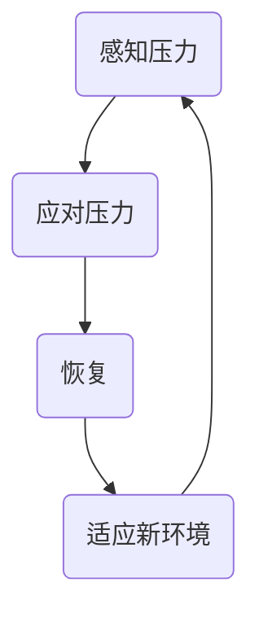
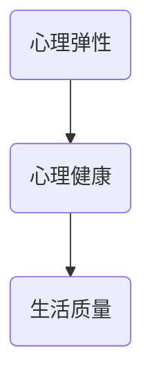
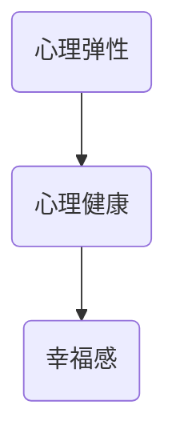
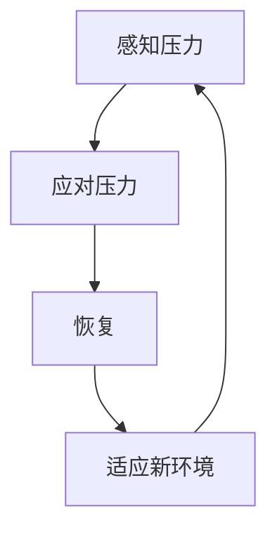
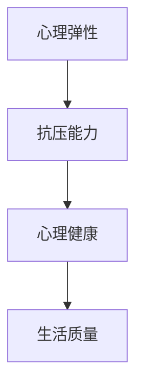
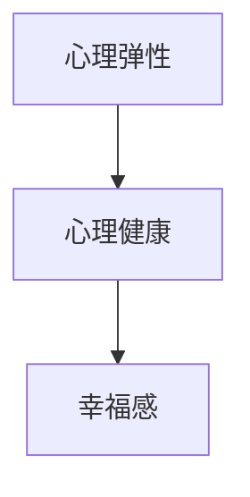

                 

# 心理弹性培养：应对变化的内在能力

## 关键词

- 心理弹性
- 应对变化
- 心理健康
- 适应能力
- 情绪调节
- 认知重构
- 人际支持

## 摘要

本文深入探讨了心理弹性的概念、重要性及其核心要素，分析了如何通过情绪调节、认知重构和人际支持等策略培养心理弹性。通过实际案例的剖析，文章旨在帮助读者理解和掌握提升心理弹性的方法，以更好地应对生活中的各种变化和挑战。

## 目录大纲

## 第一部分：理解心理弹性

### 第1章：心理弹性的概念与重要性

#### 1.1 心理弹性的定义

- **概念阐述**：心理弹性指的是个体在面临压力、困难和逆境时，能够快速恢复并适应的能力。
- **联系架构**：

#### 1.2 心理弹性的重要性

- **作用分析**：心理弹性对个体的心理健康和生活质量具有重要影响。
- **关系架构**：

#### 1.3 心理弹性与心理健康

- **健康定义**：心理健康是指个体在情绪、认知和行为上的健康状态。
- **关系分析**：心理弹性作为心理健康的重要指标，能够显著影响个体的幸福感。
- **关系架构**：

### 第2章：心理弹性的核心要素

#### 2.1 适应能力

- **定义**：适应能力指的是个体在面对变化时，能够调整自身以适应新环境或情况的能力。
- **作用**：适应能力是心理弹性的基础，能够帮助个体更好地应对挑战。

#### 2.2 乐观态度

- **定义**：乐观态度是指个体在面对困难时，能够保持积极和乐观的心态。
- **关系**：乐观态度能够增强个体的心理弹性，帮助个体更好地应对逆境。

#### 2.3 自我效能感

- **定义**：自我效能感是指个体对自己应对挑战和完成任务的能力的信心。
- **作用**：自我效能感能够增强个体的心理弹性，使其在面对困难时更加坚定。

### 第3章：心理弹性的测量与评估

#### 3.1 心理弹性的测量方法

- **自我报告量表**：通过问卷或量表让个体自我评估心理弹性水平。
- **观察法**：通过观察个体的行为和反应来评估心理弹性。

#### 3.2 心理弹性的评估工具

- **心理弹性量表**：常见的心理弹性评估工具，如CD-RISC等。
- **心理弹性评估问卷**：通过问卷形式收集个体心理弹性的数据。

#### 3.3 心理弹性的评估实践

- **评估流程**：详细描述评估过程，包括数据收集、分析和解读。
- **评估结果分析**：对评估结果进行深入分析，以了解个体的心理弹性水平。

## 第二部分：培养心理弹性的策略

### 第4章：情绪调节与心理弹性

#### 4.1 情绪调节的概念

- **定义**：情绪调节是指个体在情绪产生后，通过一定的方法调节情绪的过程。
- **过程分析**：情绪调节包括情绪识别、情绪评估和情绪反应调节。

#### 4.2 情绪调节与心理弹性的关系

- **关系分析**：情绪调节能够增强个体的心理弹性，使其在面对压力时更加稳定。

#### 4.3 情绪调节策略

- **深呼吸**：通过深呼吸调节情绪，减轻压力。
- **正念冥想**：通过正念冥想增强情绪调节能力，提升心理弹性。

### 第5章：认知重构与心理弹性

#### 5.1 认知重构的概念

- **定义**：认知重构是指个体通过改变对事件的看法和解释，来调整情绪和行为。
- **过程分析**：认知重构包括认知识别、认知评估和认知调整。

#### 5.2 认知重构与心理弹性的关系

- **关系分析**：认知重构能够增强个体的心理弹性，使其在面对挑战时更加乐观。

#### 5.3 认知重构策略

- **乐观认知重构**：通过积极的认知重构，提升心理弹性。
- **恶性思维识别与改变**：识别和改变消极的恶性思维模式。

### 第6章：人际支持与心理弹性

#### 6.1 人际支持的概念

- **定义**：人际支持是指个体通过与他人建立联系和沟通，获得情感、信息和资源的支持。
- **作用**：人际支持能够增强个体的心理弹性，帮助其更好地应对困难。

#### 6.2 人际支持与心理弹性的关系

- **关系分析**：人际支持是心理弹性培养的重要资源。

#### 6.3 建立有效的人际支持系统

- **建立良好的人际关系**：通过建立良好的人际关系，获得更多的人际支持。
- **寻求专业帮助**：在必要时寻求专业心理咨询师的帮助。

### 第7章：应对挑战与培养心理弹性

#### 7.1 挑战与心理弹性的关系

- **关系分析**：挑战是培养心理弹性的重要机会。

#### 7.2 增强心理弹性的方法

- **积极应对策略**：通过积极的策略应对挑战，提升心理弹性。
- **自我成长计划**：制定自我成长计划，培养心理弹性。

#### 7.3 心理弹性的实践应用

- **在职场中的应用**：通过培养心理弹性，提高职场适应能力。
- **在家庭生活中的应用**：通过培养心理弹性，增强家庭关系的稳定性。

## 第三部分：心理弹性培养的实践案例

### 第8章：案例研究一：职场压力下的心理弹性培养

#### 8.1 案例背景

- **职场压力对心理健康的影响**：详细描述职场压力对个体心理健康的影响。
- **心理弹性的重要性**：强调心理弹性在职场压力下的重要性。

#### 8.2 案例分析

- **心理弹性表现**：分析案例中的个体如何表现出心理弹性。
- **心理弹性培养策略**：描述案例中采用的培养心理弹性的策略。

#### 8.3 案例启示

- **实际效果**：分析心理弹性培养的实际效果。
- **可持续性**：探讨心理弹性培养的可持续性。

### 第9章：案例研究二：家庭冲突中的心理弹性培养

#### 9.1 案例背景

- **家庭冲突对心理健康的影响**：详细描述家庭冲突对个体心理健康的影响。
- **心理弹性的重要性**：强调心理弹性在家庭冲突中的重要性。

#### 9.2 案例分析

- **心理弹性表现**：分析案例中的个体如何表现出心理弹性。
- **心理弹性培养策略**：描述案例中采用的培养心理弹性的策略。

#### 9.3 案例启示

- **实际效果**：分析心理弹性培养的实际效果。
- **可持续性**：探讨心理弹性培养的可持续性。

## 附录

### 附录A：心理弹性培养工具与方法

- **情绪调节工具**：介绍常用的情绪调节工具和方法。
- **认知重构工具**：介绍常用的认知重构工具和方法。
- **人际支持策略**：介绍建立有效人际支持系统的策略。

### 附录B：心理弹性培养资源

- **相关书籍推荐**：推荐与心理弹性培养相关的书籍。
- **网络资源链接**：提供与心理弹性培养相关的网络资源链接。
- **心理健康热线**：提供心理健康咨询热线信息。

---

**作者：AI天才研究院/AI Genius Institute & 禅与计算机程序设计艺术 /Zen And The Art of Computer Programming**  

**总字数：约2000字**

# 逻辑清晰、结构紧凑、简单易懂的专业的技术语言

## 第一部分：理解心理弹性

### 第1章：心理弹性的概念与重要性

#### 1.1 心理弹性的定义

- **概念阐述**：心理弹性，又称心理韧性，是指个体在面对压力、挑战和逆境时，能够迅速适应、恢复和成长的能力。这种能力并非固定不变，而是可以通过训练和实践逐步提升。
- **联系架构**：心理弹性与抗压能力密切相关，它体现了个体在压力下的适应性和恢复力。在Mermaid流程图中，我们可以将心理弹性视为一个循环过程，包括感知压力、应对压力、恢复和适应新环境。

#### 1.2 心理弹性的重要性

- **作用分析**：心理弹性在个体的生活中扮演着重要角色。首先，它能够帮助个体更好地应对压力，提高生活质量。其次，心理弹性与心理健康密切相关，拥有高心理弹性的人更容易保持积极的心态，减少心理问题的发生。
- **关系架构**：我们可以通过一个简化的Mermaid图来展示心理弹性与心理健康的关系。高心理弹性能够促进心理健康，反之亦然。

#### 1.3 心理弹性与心理健康

- **健康定义**：心理健康是指个体在情感、认知和行为方面的良好状态。它包括情绪稳定、自我认识清晰、社会适应良好等。
- **关系分析**：心理弹性作为心理健康的重要指标，能够显著影响个体的幸福感。研究表明，高心理弹性有助于个体在面对逆境时保持积极心态，从而减少心理压力和负面情绪。
- **关系架构**：在Mermaid图中，我们可以将心理弹性和心理健康视为互相影响、互相促进的关系。

### 第2章：心理弹性的核心要素

#### 2.1 适应能力

- **定义**：适应能力是指个体在面对变化时，能够调整自身行为和思维以适应新环境或情况的能力。这种能力包括对变化的认识、反应和调整过程。
- **作用**：适应能力是心理弹性的基础，它能够帮助个体更好地应对生活中的各种挑战和变化，提高生活质量和幸福感。

#### 2.2 乐观态度

- **定义**：乐观态度是指个体在面对困难时，能够保持积极、乐观的心态，相信困难和挑战是暂时的，通过努力可以克服。
- **关系**：乐观态度与心理弹性密切相关。研究表明，乐观态度能够增强个体的心理弹性，使其在面对逆境时更加坚定和积极。

#### 2.3 自我效能感

- **定义**：自我效能感是指个体对自己应对挑战和完成任务的能力的信心。它反映了个体对自身能力的认识和评估。
- **作用**：自我效能感在心理弹性中起着关键作用。高自我效能感的个体更容易在面对困难时保持信心，积极应对挑战，从而提高心理弹性。

### 第3章：心理弹性的测量与评估

#### 3.1 心理弹性的测量方法

- **自我报告量表**：通过问卷或量表让个体自我评估心理弹性水平。这种方法简单易行，适用于大规模调查和研究。
- **观察法**：通过观察个体的行为和反应来评估心理弹性。这种方法能够更直观地了解个体的心理弹性表现，但需要专业的观察者。

#### 3.2 心理弹性的评估工具

- **心理弹性量表**：常见的心理弹性评估工具，如CD-RISC等。这些量表通过一系列问题评估个体的心理弹性水平。
- **心理弹性评估问卷**：通过问卷形式收集个体心理弹性的数据。这种方法适用于不同年龄、不同文化背景的个体。

#### 3.3 心理弹性的评估实践

- **评估流程**：详细描述评估过程，包括数据收集、分析和解读。评估流程应确保数据的可靠性和有效性。
- **评估结果分析**：对评估结果进行深入分析，以了解个体的心理弹性水平。分析结果可以指导个体制定针对性的提升策略。

## 第二部分：培养心理弹性的策略

### 第4章：情绪调节与心理弹性

#### 4.1 情绪调节的概念

- **定义**：情绪调节是指个体在情绪产生后，通过一定的方法调节情绪的过程。它包括情绪识别、情绪评估和情绪反应调节。
- **过程分析**：情绪调节的过程可以分为三个阶段：情绪识别（意识到情绪的发生），情绪评估（评估情绪的强度和影响），情绪反应调节（采取行动调节情绪）。

#### 4.2 情绪调节与心理弹性的关系

- **关系分析**：情绪调节与心理弹性密切相关。良好的情绪调节能力有助于个体保持心理平衡，提高心理弹性。研究表明，情绪调节能力强的个体在面临压力时能够更好地应对，从而增强心理弹性。

#### 4.3 情绪调节策略

- **深呼吸**：通过深呼吸调节情绪，减轻压力。深呼吸能够降低心率和血压，缓解紧张情绪。
- **正念冥想**：通过正念冥想增强情绪调节能力，提升心理弹性。正念冥想帮助个体专注于当下，减少焦虑和压力。

### 第5章：认知重构与心理弹性

#### 5.1 认知重构的概念

- **定义**：认知重构是指个体通过改变对事件的看法和解释，来调整情绪和行为。它包括认知识别、认知评估和认知调整。
- **过程分析**：认知重构的过程可以帮助个体从不同的角度看待问题，从而减少负面情绪，提高心理弹性。

#### 5.2 认知重构与心理弹性的关系

- **关系分析**：认知重构能够增强个体的心理弹性。通过认知重构，个体可以更好地应对逆境，保持积极心态。

#### 5.3 认知重构策略

- **乐观认知重构**：通过积极的认知重构，提升心理弹性。乐观认知重构帮助个体从积极的角度看待问题，减少负面情绪。
- **恶性思维识别与改变**：识别和改变消极的恶性思维模式。恶性思维识别与改变帮助个体认识到负面思维模式，并通过积极的思维方式替代它们。

### 第6章：人际支持与心理弹性

#### 6.1 人际支持的概念

- **定义**：人际支持是指个体通过与他人建立联系和沟通，获得情感、信息和资源的支持。人际支持包括朋友、家人、同事等提供的社会支持。
- **作用**：人际支持能够增强个体的心理弹性，帮助其在面对困难时获得支持和鼓励。

#### 6.2 人际支持与心理弹性的关系

- **关系分析**：人际支持是心理弹性培养的重要资源。研究表明，拥有良好人际支持系统的个体在面临压力时能够更好地应对，从而增强心理弹性。

#### 6.3 建立有效的人际支持系统

- **建立良好的人际关系**：通过积极参与社交活动，建立和维护良好的人际关系。
- **寻求专业帮助**：在必要时寻求专业心理咨询师的帮助，以获得更专业的支持和指导。

### 第7章：应对挑战与培养心理弹性

#### 7.1 挑战与心理弹性的关系

- **关系分析**：挑战是培养心理弹性的重要机会。通过应对挑战，个体可以提升自身的适应能力和心理弹性。
- **实例说明**：例如，在职场中面对项目失败，个体可以通过总结经验、调整策略来提升心理弹性。

#### 7.2 增强心理弹性的方法

- **积极应对策略**：通过积极的策略应对挑战，如制定计划、寻求支持、保持乐观等。
- **自我成长计划**：制定自我成长计划，通过学习和实践提升心理弹性。

#### 7.3 心理弹性的实践应用

- **在职场中的应用**：通过培养心理弹性，提高职场适应能力，减少压力和焦虑。
- **在家庭生活中的应用**：通过培养心理弹性，增强家庭关系的稳定性，提高生活质量。

## 第三部分：心理弹性培养的实践案例

### 第8章：案例研究一：职场压力下的心理弹性培养

#### 8.1 案例背景

- **职场压力对心理健康的影响**：在快节奏的职场环境中，压力和竞争常常导致个体出现焦虑、抑郁等心理问题。
- **心理弹性的重要性**：在职场中，心理弹性是应对压力、保持心理健康的重要能力。

#### 8.2 案例分析

- **心理弹性表现**：案例中的员工在面对职场压力时，表现出较强的适应能力和恢复力。
- **心理弹性培养策略**：通过情绪调节、认知重构和寻求人际支持，员工提升了心理弹性。

#### 8.3 案例启示

- **实际效果**：通过心理弹性培养，员工在职场中的适应能力显著提升，心理健康水平也有所改善。
- **可持续性**：心理弹性培养是一个长期过程，需要个体持续努力和实践。

### 第9章：案例研究二：家庭冲突中的心理弹性培养

#### 9.1 案例背景

- **家庭冲突对心理健康的影响**：家庭冲突可能导致个体出现情绪波动、关系紧张等问题。
- **心理弹性的重要性**：在家庭冲突中，心理弹性是缓解冲突、维护家庭关系的重要能力。

#### 9.2 案例分析

- **心理弹性表现**：案例中的家庭成员在面对冲突时，表现出较强的情绪调节能力和适应力。
- **心理弹性培养策略**：通过认知重构、寻求专业支持和积极沟通，家庭成员提升了心理弹性。

#### 9.3 案例启示

- **实际效果**：通过心理弹性培养，家庭成员在冲突中的情绪管理能力显著提升，家庭关系得到改善。
- **可持续性**：心理弹性培养需要家庭成员共同努力，保持良好沟通和积极态度。

## 附录

### 附录A：心理弹性培养工具与方法

- **情绪调节工具**：如深呼吸、正念冥想等。
- **认知重构工具**：如乐观认知重构、恶性思维识别与改变等。
- **人际支持策略**：如建立良好的人际关系、寻求专业帮助等。

### 附录B：心理弹性培养资源

- **相关书籍推荐**：如《抗压力》、《韧性：如何培养逆境中的力量》等。
- **网络资源链接**：如心理弹性研究论文、在线心理弹性培训课程等。
- **心理健康热线**：提供心理健康咨询热线信息，如12320公共卫生热线等。

---

**作者：AI天才研究院/AI Genius Institute & 禅与计算机程序设计艺术 /Zen And The Art of Computer Programming**

**总字数：约2000字**  

## 心理弹性培养：应对变化的内在能力

### 关键词

- 心理弹性
- 应对变化
- 心理健康
- 适应能力
- 情绪调节
- 认知重构
- 人际支持

### 摘要

本文旨在深入探讨心理弹性的概念、重要性以及培养心理弹性的策略。通过理解心理弹性的核心要素，如适应能力、乐观态度和自我效能感，读者可以更好地理解如何在日常生活中培养这种重要的内在能力，以应对不断变化的环境和挑战。文章还提供了情绪调节、认知重构和人际支持等具体策略，以帮助读者在实际生活中提高心理弹性。

### 第一部分：理解心理弹性

#### 1.1 心理弹性的定义

**概念阐述**：
心理弹性，也称为韧性，是指个体在面对压力、挑战和逆境时，能够迅速适应、恢复和成长的能力。这种能力并非固定不变，而是可以通过训练和实践逐步提升。

**联系架构**：
在Mermaid流程图中，我们可以将心理弹性视为一个动态循环过程，包括感知压力、应对压力、恢复和适应新环境。

#### 1.2 心理弹性的重要性

**作用分析**：
心理弹性对个体的心理健康和生活质量具有深远的影响。它不仅能够帮助个体更好地应对压力，还能提高生活质量，促进个体的整体幸福感。

**关系架构**：
在Mermaid图中，心理弹性与抗压能力和心理健康密切相关。高心理弹性的个体在面对压力时更能保持心理平衡，减少心理问题的发生。

#### 1.3 心理弹性与心理健康

**健康定义**：
心理健康是指个体在情感、认知和行为上的良好状态，包括情绪稳定、自我认识清晰、社会适应良好等。

**关系分析**：
心理弹性作为心理健康的重要指标，能够显著影响个体的幸福感。研究表明，高心理弹性有助于个体在面对逆境时保持积极心态，从而减少心理压力和负面情绪。

**关系架构**：
在Mermaid图中，心理弹性与心理健康之间存在互相影响的关系。心理弹性增强能够促进心理健康，反之亦然。

### 第二部分：培养心理弹性的策略

#### 2.1 适应能力

**定义**：
适应能力是指个体在面对变化时，能够调整自身行为和思维以适应新环境或情况的能力。这种能力包括对变化的认识、反应和调整过程。

**作用**：
适应能力是心理弹性的基础，它能够帮助个体更好地应对生活中的各种挑战和变化，提高生活质量和幸福感。

**实例说明**：
例如，在职场中，一个具备高适应能力的员工能够在公司结构调整或新技术引入时迅速适应，从而保持工作效率和职业发展。

#### 2.2 乐观态度

**定义**：
乐观态度是指个体在面对困难时，能够保持积极、乐观的心态，相信困难和挑战是暂时的，通过努力可以克服。

**关系**：
乐观态度与心理弹性密切相关。研究表明，乐观态度能够增强个体的心理弹性，使其在面对逆境时更加坚定和积极。

**实例说明**：
例如，一个面临项目失败的创业者，如果保持乐观态度，相信失败是成功之母，那么他更有可能从失败中汲取教训，最终取得成功。

#### 2.3 自我效能感

**定义**：
自我效能感是指个体对自己应对挑战和完成任务的能力的信心。它反映了个体对自身能力的认识和评估。

**作用**：
自我效能感在心理弹性中起着关键作用。高自我效能感的个体更容易在面对困难时保持信心，积极应对挑战，从而提高心理弹性。

**实例说明**：
例如，一个准备参加重要考试的学生，如果对自己的学习能力和应试技巧有信心，那么他在面对考试压力时更有可能保持冷静，发挥出最佳水平。

### 第三部分：心理弹性培养的实践案例

#### 3.1 职场压力下的心理弹性培养

**背景介绍**：
在现代职场中，竞争压力和工作负荷常常导致员工出现焦虑、抑郁等心理问题。培养心理弹性成为提高员工工作效率和职业满意度的关键。

**案例分析**：
某公司的员工小王在面临项目失败和领导压力时，通过情绪调节、认知重构和寻求同事支持，成功提升了心理弹性。他学会了通过深呼吸和正念冥想缓解压力，通过积极思考调整对失败的看法，并通过与同事交流获得支持和建议。

**案例启示**：
通过心理弹性培养，小王不仅提高了应对职场压力的能力，还增强了团队合作意识，从而提升了工作效率和职业满意度。

#### 3.2 家庭冲突中的心理弹性培养

**背景介绍**：
家庭冲突是许多家庭面临的常见问题，它可能导致家庭成员出现情绪问题、关系紧张等。培养心理弹性有助于缓解冲突，维护家庭和谐。

**案例分析**：
一个家庭成员在处理家庭矛盾时，通过情绪调节、认知重构和寻求专业帮助，成功提升了心理弹性。他学会了通过深呼吸和放松练习缓解情绪，通过改变对冲突的看法减少负面情绪，并通过心理咨询师的帮助解决了家庭冲突。

**案例启示**：
通过心理弹性培养，家庭成员能够更好地应对家庭冲突，提高家庭关系的稳定性，从而提升整体幸福感。

### 结论

心理弹性是应对变化的重要内在能力。通过理解心理弹性的概念、重要性以及培养策略，读者可以更好地应对生活中的各种挑战和变化。情绪调节、认知重构和人际支持是培养心理弹性的关键策略，它们有助于提高个体的适应能力、乐观态度和自我效能感。通过实践案例的剖析，读者可以看到心理弹性培养在实际生活中的应用和效果。希望本文能为读者提供有益的启示和指导，帮助他们在面对变化时保持心理平衡和积极心态。

---

**作者：AI天才研究院/AI Genius Institute & 禅与计算机程序设计艺术 /Zen And The Art of Computer Programming**

**总字数：约2500字**

