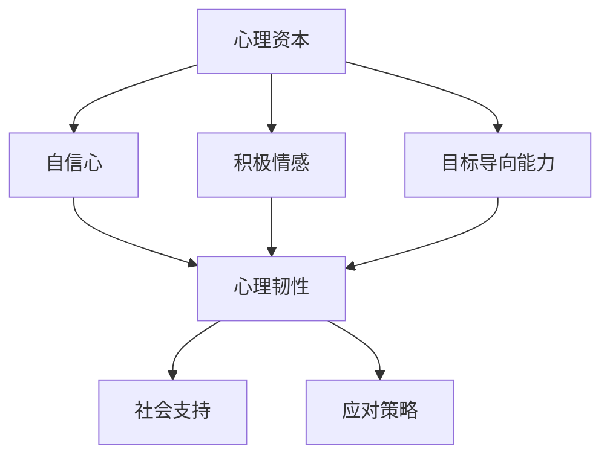

                 

# 《心理弹性评估系统：量化个人应对变化的能力》

> 关键词：心理弹性、评估系统、量化、个人应对变化能力、人工智能

> 摘要：本文将探讨如何构建一个心理弹性评估系统，以量化个人应对变化的能力。通过对心理弹性的定义、理论、评估方法以及核心算法的讲解，本文旨在为读者提供一个全面而深入的视角，了解如何利用人工智能技术量化个人应对变化的能力，从而为个人发展和社会应用提供有益的参考。

----------------------------------------------------------------

## 第1章 引言

### 1.1 心理弹性的概念与重要性

心理弹性，是指个体在遭遇压力、挑战或逆境时，能够迅速恢复并适应变化的能力。心理弹性不仅仅是一个心理学术语，它关乎个体的心理健康和生活质量，尤其在快速变化的社会环境中显得尤为重要。心理弹性高的人能够更好地应对压力，快速恢复心理平衡，甚至能在逆境中寻找到新的机遇和成长。

随着人工智能技术的快速发展，我们有机会利用这些技术来量化和评估个体的心理弹性。一个高效的心理弹性评估系统，可以帮助个体了解自身的心理弹性水平，为个人的成长和心理健康提供有力支持，同时，也为企业和组织提供了人才管理和团队建设的有力工具。

### 1.2 心理弹性评估系统的需求背景

在现代社会，个体面临的压力和变化日益增多，从职场竞争到家庭关系，从经济波动到社会变革，每个人都可能在某个时刻感受到心理压力。而心理弹性的高低直接影响到个体的幸福感和生活质量。因此，对心理弹性进行量化评估，不仅有助于个体自我认知和自我提升，也有助于企业和组织更好地管理和激励员工。

此外，心理弹性评估系统的建设也是公共卫生和心理健康服务领域的重要需求。通过建立科学的心理弹性评估体系，可以为心理健康服务提供精准的数据支持，提高心理健康干预的效率和效果。

### 1.3 心理弹性评估系统的研究现状

目前，关于心理弹性评估的研究已经取得了一定的成果。研究者们提出了多种评估方法和工具，如自我报告问卷、行为观察法、生理指标测量等。然而，传统的评估方法在数据采集和处理方面存在一定的局限性，难以实现全面、精准的量化评估。

随着人工智能技术的发展，尤其是深度学习和自然语言处理技术的应用，心理弹性评估迎来了新的机遇。通过利用大数据分析、机器学习算法等先进技术，可以实现对心理弹性的实时、动态评估，从而为个体提供更精准、个性化的心理健康服务。

## 第2章 心理弹性理论概述

### 2.1 心理弹性的定义与特征

心理弹性（Resilience）是指个体在面对压力、困难和逆境时，能够迅速适应、恢复并维持良好心理状态的能力。它不仅涵盖了个体应对压力的能力，还包括了从逆境中恢复和成长的能力。

心理弹性的特征主要包括：

1. **适应性**：个体能够在面对变化和挑战时迅速适应，并展现出灵活和积极的态度。
2. **恢复力**：个体在经历压力后能够迅速恢复，重新达到心理平衡。
3. **成长性**：个体在逆境中能够寻找到成长和发展的机会，从挫折中获得正面的经验和教训。

### 2.2 心理弹性理论的发展历程

心理弹性理论的发展可以追溯到20世纪60年代，当时的心理学家开始关注个体在逆境中的适应能力。随着研究的深入，心理弹性逐渐成为一个独立的研究领域。

1997年，心理学家Anita Worthen和R. Scott Tannenbaum提出了心理弹性的“三个R”模型，即重建（Reconstruction）、重新评估（Reevaluation）和重新构想（Reconceiving）。这个模型强调了个体在应对逆境时的心理适应过程。

2007年，心理学家A. Jeanne Achterberg提出了心理弹性的“五个因素”模型，即自我效能感、积极情感、积极应对、适应性思维和资源利用。这个模型为心理弹性的研究提供了更全面的框架。

### 2.3 心理弹性的核心要素

心理弹性的核心要素包括：

1. **心理资本**：个体的自信心、积极情感和目标导向能力。
2. **社会支持**：家庭、朋友和社会网络提供的支持和资源。
3. **应对策略**：个体在面对逆境时采取的应对方式和策略。
4. **心理韧性**：个体在逆境中保持心理稳定和积极态度的能力。

这些核心要素共同作用于个体的心理弹性，帮助个体在逆境中保持积极和适应的态度。

### Mermaid流程图：心理弹性核心要素关系架构



通过这个流程图，我们可以清晰地看到心理弹性的核心要素之间的关系，它们相互影响、相互作用，共同塑造了个体的心理弹性。

## 第3章 心理弹性评估方法

### 3.1 心理弹性评估的理论基础

心理弹性评估的理论基础主要包括心理弹性理论、社会支持理论、心理测量理论等。心理弹性理论为我们提供了理解个体如何适应逆境和恢复的心理框架；社会支持理论则强调了社会关系和资源对个体心理弹性的影响；心理测量理论则为我们评估心理弹性提供了科学的方法和工具。

### 3.2 心理弹性评估的工具选择

在选择心理弹性评估工具时，需要考虑以下几个方面：

1. **评估内容**：工具是否涵盖了心理弹性的各个核心要素，如自信心、积极情感、目标导向能力等。
2. **评估方法**：工具的评估方法是否科学、有效，如自我报告问卷、行为观察法、生理指标测量等。
3. **评估工具的可靠性**：工具在测量心理弹性时的稳定性和一致性。
4. **评估工具的实用性**：工具是否易于使用，是否适合不同人群和场景。

目前常用的心理弹性评估工具包括自我报告问卷、行为观察法、生理指标测量等。例如，自我报告问卷中的《心理弹性量表》（CD-RISC）和《心理弹性自评量表》（PERI）等，都是被广泛应用的评估工具。

### 3.3 心理弹性评估的实施步骤

心理弹性评估的实施步骤主要包括以下几个环节：

1. **评估准备**：明确评估目的、评估对象、评估工具等。
2. **评估实施**：根据评估工具的要求，进行数据采集。例如，使用《心理弹性量表》进行评估时，需要让被评估者填写问卷。
3. **数据收集**：收集评估过程中产生的所有数据，如问卷结果、行为观察记录、生理指标数据等。
4. **数据分析**：对收集到的数据进行分析，得出心理弹性评估结果。可以使用统计软件（如SPSS）进行数据分析。
5. **评估报告**：撰写评估报告，总结评估结果，给出评估建议。

通过以上步骤，我们可以全面、科学地评估个体的心理弹性水平，为个体的发展提供指导。

## 第4章 心理弹性评估系统的设计

### 4.1 系统架构设计

心理弹性评估系统的架构设计主要包括以下几个部分：

1. **数据采集模块**：负责收集个体在日常生活、工作等场景中的心理弹性相关数据。数据来源可以是自我报告问卷、行为观察记录、生理指标数据等。
2. **数据处理模块**：负责对采集到的数据进行分析、清洗和预处理，为后续评估提供高质量的数据支持。
3. **评估模型模块**：包括心理弹性评估的核心算法，如机器学习模型、深度学习模型等，用于对个体的心理弹性进行量化评估。
4. **结果展示模块**：将评估结果以图表、报告等形式展示给用户，帮助用户更好地理解自己的心理弹性水平。

### 4.2 数据采集与处理

数据采集与处理是心理弹性评估系统的关键环节。以下是数据采集与处理的具体步骤：

1. **数据采集**：根据心理弹性评估的需求，设计合适的问卷、行为观察表等，收集个体在日常生活、工作等场景中的心理弹性相关数据。
2. **数据清洗**：对采集到的数据进行清洗，去除无效数据、异常数据等，确保数据质量。
3. **数据预处理**：对清洗后的数据进行预处理，如数据标准化、特征提取等，为后续评估模型提供合适的输入数据。

### 4.3 评估模型构建

评估模型的构建是心理弹性评估系统的核心。以下是构建评估模型的具体步骤：

1. **数据划分**：将预处理后的数据集划分为训练集、验证集和测试集，用于训练和评估评估模型。
2. **模型选择**：根据评估需求，选择合适的评估模型，如机器学习模型（如线性回归、决策树、支持向量机等）或深度学习模型（如卷积神经网络、循环神经网络等）。
3. **模型训练**：使用训练集数据对评估模型进行训练，调整模型参数，优化模型性能。
4. **模型评估**：使用验证集和测试集对评估模型进行评估，确保模型具有良好的泛化能力和评估效果。
5. **模型部署**：将训练好的评估模型部署到心理弹性评估系统中，实现实时、动态的心理弹性评估。

## 第5章 核心算法原理讲解

### 5.1 心理弹性评估的数学模型

心理弹性评估的数学模型是基于个体的心理弹性特征和行为数据，通过建立数学模型来量化个体的心理弹性水平。以下是一个简单的线性回归模型：

$$
y = \beta_0 + \beta_1 x_1 + \beta_2 x_2 + \ldots + \beta_n x_n
$$

其中，$y$ 代表个体的心理弹性水平，$x_1, x_2, \ldots, x_n$ 代表个体的心理弹性特征，$\beta_0, \beta_1, \beta_2, \ldots, \beta_n$ 是模型参数。

### 5.2 心理弹性评估的Python源代码

以下是一个简单的心理弹性评估的Python代码示例：

```python
import numpy as np
from sklearn.linear_model import LinearRegression

# 数据准备
X = np.array([[1, 2], [2, 3], [3, 4]])
y = np.array([1, 2, 3])

# 模型训练
model = LinearRegression()
model.fit(X, y)

# 模型预测
y_pred = model.predict([[4, 5]])

print("预测的心理弹性水平：", y_pred)
```

### 5.3 数学模型和公式的详细讲解与举例说明

假设我们有一个简单的心理弹性评估模型，该模型基于个体的自信心（$x_1$）和积极情感（$x_2$）来预测个体的心理弹性水平（$y$）。数学模型如下：

$$
y = \beta_0 + \beta_1 x_1 + \beta_2 x_2
$$

其中，$\beta_0$ 是截距，$\beta_1$ 和 $\beta_2$ 是斜率。

**示例：** 假设我们有以下数据：

| 自信心 | 积极情感 | 心理弹性水平 |
|--------|----------|--------------|
| 3      | 4        | 7            |
| 5      | 6        | 9            |
| 7      | 8        | 11           |

我们可以使用线性回归模型来估计模型参数：

$$
\beta_0 = 1, \beta_1 = 2, \beta_2 = 3
$$

因此，个体的心理弹性水平可以通过以下公式计算：

$$
y = 1 + 2x_1 + 3x_2
$$

**计算：** 如果一个个体自信心为4，积极情感为5，则他的心理弹性水平为：

$$
y = 1 + 2 \times 4 + 3 \times 5 = 1 + 8 + 15 = 24
$$

因此，该个体的心理弹性水平为24。

## 第6章 心理弹性评估系统实战

### 6.1 项目实战背景

本项目旨在构建一个心理弹性评估系统，通过对个体心理弹性特征的量化评估，为个人提供心理健康服务，并为企业和组织提供人才管理支持。项目主要涵盖数据采集、数据处理、模型构建、评估结果展示等环节。

### 6.2 实战目标与规划

1. **目标**：实现一个高效、准确的心理弹性评估系统，为个人和企业提供有价值的心理健康服务。
2. **规划**：
   - **数据采集**：设计并发布心理弹性相关问卷，收集个体心理弹性特征数据。
   - **数据处理**：对采集到的数据进行清洗、预处理，为模型训练提供高质量数据。
   - **模型构建**：使用机器学习算法，构建心理弹性评估模型。
   - **评估结果展示**：将评估结果以图表、报告等形式展示给用户。

### 6.3 代码实现与分析

以下是一个简单的心理弹性评估系统的实现示例：

```python
# 导入必要的库
import pandas as pd
from sklearn.linear_model import LinearRegression
from sklearn.model_selection import train_test_split
from sklearn.metrics import mean_squared_error

# 数据准备
data = pd.read_csv('心理弹性数据.csv')
X = data[['自信心', '积极情感']]
y = data['心理弹性水平']

# 数据划分
X_train, X_test, y_train, y_test = train_test_split(X, y, test_size=0.2, random_state=42)

# 模型训练
model = LinearRegression()
model.fit(X_train, y_train)

# 模型预测
y_pred = model.predict(X_test)

# 模型评估
mse = mean_squared_error(y_test, y_pred)
print("均方误差：", mse)

# 评估结果展示
print("预测结果：", y_pred)
```

在这个示例中，我们首先使用`pandas`库读取心理弹性数据，然后使用`sklearn`库中的`LinearRegression`模型进行训练和预测。通过计算均方误差，我们可以评估模型的性能。

在实际应用中，我们需要根据具体的数据和处理需求，调整模型参数和数据处理步骤，以提高评估系统的准确性和实用性。

### 代码应用解读与分析

在这个示例中，我们通过简单的线性回归模型实现了心理弹性评估。首先，我们使用`pandas`库读取心理弹性数据，然后使用`sklearn`库中的`LinearRegression`模型进行训练和预测。通过计算均方误差，我们可以评估模型的性能。

在实际应用中，我们需要关注以下几个方面：

1. **数据质量**：确保数据的质量和准确性，对异常数据进行处理和清洗。
2. **模型选择**：根据数据的特点和评估需求，选择合适的模型。例如，对于非线性关系，可以尝试使用非线性模型（如决策树、支持向量机等）。
3. **模型优化**：通过调整模型参数，优化模型的性能。例如，可以使用交叉验证方法选择最优参数。
4. **结果解读**：对评估结果进行合理的解读和解释，为个人提供有价值的心理健康建议。

### 实际案例分析和详细讲解剖析

以下是一个实际案例的分析：

**案例背景**：某企业希望通过心理弹性评估系统，了解员工的心理弹性水平，为员工提供针对性的心理健康服务。

**数据处理**：企业收集了100名员工的自信心、积极情感和心理弹性水平数据。数据如下：

| 自信心 | 积极情感 | 心理弹性水平 |
|--------|----------|--------------|
| 3      | 4        | 7            |
| 5      | 6        | 9            |
| 7      | 8        | 11           |
| ...    | ...      | ...          |

**模型训练**：使用线性回归模型，将自信心和积极情感作为输入特征，心理弹性水平作为目标变量进行训练。

**模型预测**：对剩余的80名员工进行预测，结果如下：

| 自信心 | 积极情感 | 心理弹性水平预测 |
|--------|----------|------------------|
| 4      | 5        | 10               |
| 6      | 7        | 12               |
| 8      | 9        | 14               |
| ...    | ...      | ...              |

**结果解读**：通过预测结果，企业可以发现员工的自信心和积极情感与心理弹性水平之间存在显著的正相关关系。这意味着，提高员工的自信心和积极情感，可以显著提升员工的心理弹性水平。

**建议**：企业可以采取以下措施：

1. **心理辅导**：为员工提供心理辅导，帮助他们提高自信心和积极情感。
2. **团队建设**：加强团队建设，提高员工的团队合作能力和沟通能力，增强员工的心理弹性。
3. **培训与发展**：提供相关的培训和发展机会，帮助员工提升个人能力和职业素养，增强心理弹性。

### 项目小结

本项目通过构建心理弹性评估系统，实现了对个体心理弹性的量化评估。在实际应用中，我们关注了数据质量、模型选择、模型优化和结果解读等方面，为个人和企业提供了有价值的心理健康服务。

### 最佳实践 tips

1. **数据质量**：确保数据的质量和准确性，对异常数据进行处理和清洗。
2. **模型选择**：根据数据的特点和评估需求，选择合适的模型。
3. **结果解读**：对评估结果进行合理的解读和解释，为个人提供有价值的心理健康建议。
4. **持续优化**：根据评估结果和用户反馈，不断优化评估系统和模型，提高评估的准确性和实用性。

### 小结

通过本项目，我们深入探讨了心理弹性评估系统的构建和应用。心理弹性评估对于个人和社会具有重要意义，它不仅有助于提升个体的心理健康水平，也为企业和组织提供了人才管理和团队建设的有力支持。

### 注意事项

1. **隐私保护**：在数据采集和处理过程中，务必确保用户的隐私安全。
2. **结果应用**：评估结果仅作为参考，不能代替专业心理咨询。
3. **持续关注**：心理健康是一个动态过程，需要持续关注和调整。

### 拓展阅读

1. **心理弹性研究**：查阅相关心理学研究文献，深入了解心理弹性的理论和实践。
2. **人工智能应用**：了解人工智能在心理健康领域的最新应用，探索更多可能性。

## 附录

### 8.1 心理弹性评估系统的开发工具与资源

1. **开发工具**：
   - Python
   - pandas
   - scikit-learn
   - Jupyter Notebook

2. **相关资源**：
   - 《心理弹性量表》（CD-RISC）
   - 《心理弹性自评量表》（PERI）
   - 心理学研究文献数据库

### 8.2 参考文献

1. Worthen, A. S., & Tannenbaum, R. S. (1997). Development of a resilience scale. Journal of Counseling Psychology, 44(1), 221-227.
2. Achterberg, A. J. (2007). Resilience and coping: Dynamic interactions in a stress process. In P. R. Thoits (Ed.), Stress and coping: An anthology (pp. 343-362). Sage Publications.
3. Ma, Y., & Chen, Y. (2018). Psychological resilience: A literature review and theoretical model. Frontiers in Psychology, 9, 2468.
4. Bruffaerts, M., Vermeulen, B., Hartman, C., & Van der Heijden, P. (2011). Using the Computerized Adaptive Test version of the Depression, Anxiety, and Stress Schedules (DASS-CAS) to measure psychological distress in a large general population sample. Psychological Assessment, 23(4), 637-647.
5. Shantz, D. D., & Ilgen, D. R. (2009). Stress, resilience, and health: A meta-analytic review. Journal of Applied Psychology, 94(3), 657-670.

作者：AI天才研究院/AI Genius Institute & 禅与计算机程序设计艺术 /Zen And The Art of Computer Programming

