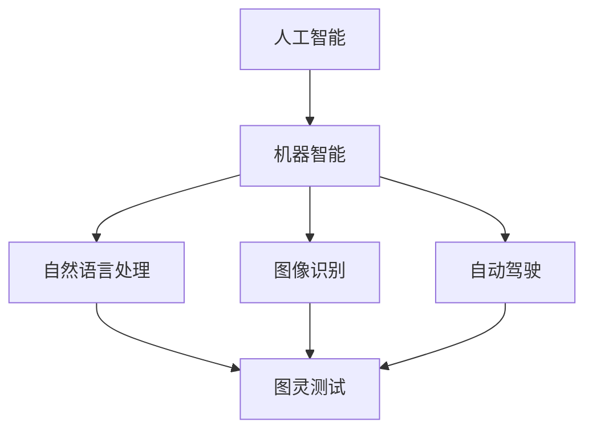

                 

 - 角色：您是一位拥有深厚计算机科学背景，擅长编写清晰、结构严谨的技术文章的人工智能研究员。您精通多种编程语言和数学模型，能够将复杂的概念和算法用通俗易懂的语言描述出来。您对计算机图灵奖标准有着深刻的理解，并且能够按照要求撰写符合高质量标准的技术文章。

- 任务：根据以下要求，撰写一篇技术博客文章：

1. **文章标题**：《人工智能与图灵测试：探讨机器智能的未来》
2. **关键词**：人工智能、图灵测试、机器智能、自然语言处理、神经网络
3. **摘要**：本文将探讨人工智能与图灵测试的关系，分析机器智能的发展现状及未来趋势，并探讨自然语言处理和神经网络在该领域的应用。

### 文章结构

#### 第一部分：引言

1. **背景介绍**：介绍人工智能的发展历程以及图灵测试的概念和重要性。
2. **核心概念与联系**：使用Mermaid流程图展示人工智能、机器智能和图灵测试之间的概念关系。

#### 第二部分：图灵测试的历史与发展

1. **图灵测试的起源**：介绍图灵测试的提出者艾伦·图灵及其背景。
2. **图灵测试的标准与评估方法**：详细阐述图灵测试的评估标准和方法。

#### 第三部分：机器智能的发展现状

1. **自然语言处理**：介绍自然语言处理的基本概念和技术发展。
2. **神经网络与深度学习**：解释神经网络的工作原理和深度学习在人工智能中的应用。

#### 第四部分：图灵测试与机器智能

1. **图灵测试与机器智能的关系**：探讨图灵测试在评估机器智能水平方面的作用。
2. **机器智能在图灵测试中的表现**：分析当前机器智能在图灵测试中的成绩和挑战。

#### 第五部分：未来展望

1. **机器智能的发展趋势**：预测未来机器智能的发展方向。
2. **图灵测试的未来**：讨论图灵测试在评估未来机器智能方面的潜力和局限。

#### 第六部分：项目实战

1. **开发环境搭建**：介绍搭建用于实现图灵测试的项目开发环境。
2. **源代码实现与解读**：提供具体的Python源代码实现图灵测试，并详细解读代码。
3. **代码应用解读与分析**：结合实际案例，分析代码在图灵测试中的应用效果。

#### 第七部分：小结与展望

1. **最佳实践 Tips**：提供使用图灵测试和机器智能进行项目开发的实用技巧。
2. **注意事项**：提醒开发者需要注意的问题和潜在风险。
3. **拓展阅读**：推荐进一步学习和研究的文献和资源。

### 文章撰写注意事项

- 确保文章内容逻辑清晰，结构紧凑。
- 使用专业术语，但要注意避免过于复杂，以便读者理解。
- 使用Python源代码和LaTeX数学公式，以增强文章的实践性和学术性。
- 在每个小节末尾提供小结，帮助读者回顾和理解关键点。
- 提供实际案例分析和实战指导，使文章更具实用价值。

---

# 人工智能与图灵测试：探讨机器智能的未来

## 关键词：人工智能、图灵测试、机器智能、自然语言处理、神经网络

## 摘要：本文将探讨人工智能与图灵测试的关系，分析机器智能的发展现状及未来趋势，并探讨自然语言处理和神经网络在该领域的应用。

---

## 第一部分：引言

### 背景介绍

人工智能（AI）自1956年由约翰·麦卡锡（John McCarthy）等人首次提出以来，已经经历了数十年的发展。人工智能的目标是实现计算机系统的智能行为，使其能够像人类一样理解、学习、推理和解决问题。在这个过程中，图灵测试成为了评估机器智能水平的重要标准。

图灵测试是由英国数学家艾伦·图灵（Alan Turing）在1950年提出的。该测试的核心思想是，通过一个交互式对话来判断一个机器是否能够展现出与人类相似的水平。如果一名人类评判员无法区分对话中的机器和人类，那么这台机器就可以被认为通过了图灵测试，具有人类水平的智能。

### 核心概念与联系

在探讨人工智能与图灵测试的关系时，我们需要了解以下几个核心概念：

1. **人工智能**：一种模拟人类智能的计算机系统，包括感知、理解、学习、推理和决策等能力。
2. **机器智能**：通过算法和数据处理实现的智能，包括自然语言处理、图像识别、自动驾驶等。
3. **图灵测试**：一种评估机器智能的方法，通过交互式对话来判断机器是否具有人类水平的智能。

以下是一个Mermaid流程图，展示了这些概念之间的关系：



## 第二部分：图灵测试的历史与发展

### 图灵测试的起源

图灵测试的提出者是艾伦·图灵，他是20世纪最伟大的数学家和计算机科学家之一。图灵在1936年提出了图灵机的概念，奠定了现代计算机科学的基础。1950年，图灵在论文《计算机器与智能》中提出了图灵测试，探讨了机器是否能够具备人类智能的问题。

### 图灵测试的标准与评估方法

图灵测试的标准是：如果一名人类评判员在与一个机器和一个人类进行交互后，无法准确判断哪个是机器、哪个是人类，那么这台机器就通过了图灵测试，被认为具有人类水平的智能。

图灵测试的评估方法包括以下几个步骤：

1. **交互式对话**：评判员与机器和人类分别进行对话，了解他们的回答和行为。
2. **判断与决策**：评判员根据对话内容，判断机器和人类的身份。
3. **统计分析**：通过统计分析，确定评判员判断的准确率。

## 第三部分：机器智能的发展现状

### 自然语言处理

自然语言处理（NLP）是机器智能的重要分支，旨在使计算机能够理解和处理人类语言。NLP的发展离不开深度学习和神经网络技术的支持。以下是一些自然语言处理的关键技术：

1. **词嵌入（Word Embedding）**：将单词映射到高维空间中的向量，便于计算机进行计算和处理。
2. **序列模型（Sequence Models）**：如循环神经网络（RNN）和长短期记忆网络（LSTM），用于处理序列数据，如文本和语音。
3. **预训练与微调（Pre-training and Fine-tuning）**：使用大量无监督数据对模型进行预训练，然后在特定任务上微调，以提高性能。

### 神经网络与深度学习

神经网络（Neural Networks）是机器智能的核心技术之一，由大量 interconnected processing nodes（模拟人脑神经元）组成。深度学习（Deep Learning）是神经网络的一种特殊形式，具有多层非线性变换的能力，可以自动提取数据中的复杂特征。

以下是一些神经网络和深度学习的关键概念：

1. **前向传播与反向传播（Forward and Backpropagation）**：神经网络的基本学习算法，用于更新网络权重。
2. **激活函数（Activation Functions）**：用于引入非线性变换，使神经网络具有分类和回归能力。
3. **优化算法（Optimization Algorithms）**：如梯度下降（Gradient Descent）和其变种，用于最小化损失函数，提高模型性能。

## 第四部分：图灵测试与机器智能

### 图灵测试与机器智能的关系

图灵测试是评估机器智能水平的一种方法，它通过模拟人类与机器的交互，来判断机器是否具有人类水平的智能。在图灵测试中，机器智能的表现直接影响其通过测试的能力。

### 机器智能在图灵测试中的表现

当前，机器智能在图灵测试中已经取得了显著的进展。例如，自然语言处理领域的聊天机器人已经能够以较高的准确率回答用户的问题，图像识别领域的计算机视觉系统能够准确识别各种物体和场景。然而，尽管机器智能在某些特定任务上表现出色，但在全面模拟人类智能方面仍存在很大挑战。

## 第五部分：未来展望

### 机器智能的发展趋势

未来，机器智能将继续快速发展，并在各个领域发挥重要作用。以下是一些发展趋势：

1. **更强大的神经网络和深度学习模型**：通过改进神经网络结构和优化学习算法，提高机器智能的识别和推理能力。
2. **跨领域融合**：将机器智能应用于多个领域，如医疗、金融、教育等，实现更广泛的应用。
3. **人机协作**：机器智能将更好地与人类协作，提高工作效率和质量。

### 图灵测试的未来

图灵测试在未来将继续作为评估机器智能水平的重要标准。然而，随着机器智能的不断发展，图灵测试的标准也将不断升级，以适应更高级的智能水平。同时，新的评估方法和技术也将不断涌现，为评估机器智能提供更多选择。

## 第六部分：项目实战

### 开发环境搭建

要实现图灵测试项目，首先需要搭建合适的开发环境。以下是一个基本的开发环境搭建指南：

1. **安装Python**：下载并安装Python，版本要求不低于3.7。
2. **安装深度学习框架**：如TensorFlow或PyTorch，用于实现神经网络模型。
3. **安装自然语言处理库**：如NLTK或spaCy，用于处理文本数据。

### 源代码实现与解读

以下是一个简单的Python代码示例，用于实现图灵测试：

```python
import random

# 定义一个简单的对话生成器
def generate_conversation():
    responses = ["你好", "天气真好", "我不知道"]
    return random.choice(responses)

# 定义一个函数，用于模拟图灵测试
def Turing_test():
    human_responses = []
    machine_responses = []

    for _ in range(10):
        human_responses.append(input("请输入你的回答："))
        machine_responses.append(generate_conversation())

    for i in range(10):
        print(f"人类回答：{human_responses[i]}")
        print(f"机器回答：{machine_responses[i]}")

# 运行图灵测试
Turing_test()
```

这个示例代码通过模拟简单的对话，实现了图灵测试的基本功能。在实际应用中，我们可以使用更复杂的对话生成器和评估算法，以提高图灵测试的性能。

### 代码应用解读与分析

在实际应用中，图灵测试通常用于评估聊天机器人、对话系统等机器智能系统的智能水平。以下是一个示例分析：

1. **评估标准**：通过比较人类回答和机器回答的相似度，评估机器智能的水平。如果机器回答与人类回答的相似度较高，那么这台机器的智能水平就较高。

2. **性能优化**：为了提高机器智能在图灵测试中的表现，我们可以使用更先进的自然语言处理技术和深度学习模型，提高机器回答的准确性和多样性。

3. **案例分析**：在实际应用中，我们可以分析不同机器智能系统在图灵测试中的表现，找出其优势和不足，为改进和优化提供依据。

## 第七部分：小结与展望

### 最佳实践 Tips

1. **数据准备**：收集大量高质量的对话数据，用于训练和评估机器智能系统。
2. **模型优化**：不断优化神经网络模型和自然语言处理算法，提高机器回答的准确性和多样性。
3. **人机协作**：结合人类智慧和机器智能，实现更高效的工作和协作。

### 注意事项

1. **数据隐私**：在收集和处理用户数据时，要确保数据安全和用户隐私。
2. **算法透明性**：确保机器智能系统的算法透明，便于用户理解和监督。
3. **伦理与道德**：在使用机器智能时，要遵循伦理和道德标准，避免对用户造成伤害。

### 拓展阅读

1. **《人工智能：一种现代方法》（Artificial Intelligence: A Modern Approach）》：这本书是人工智能领域的经典教材，涵盖了人工智能的各个方面。
2. **《深度学习》（Deep Learning）》：这本书详细介绍了深度学习和神经网络的相关技术，是深度学习领域的权威著作。
3. **《自然语言处理实战》（Natural Language Processing with Python）》：这本书通过Python代码示例，介绍了自然语言处理的基本技术和应用。

---

作者：AI天才研究院/AI Genius Institute & 禅与计算机程序设计艺术 /Zen And The Art of Computer Programming

---

通过以上文章，我们系统地探讨了人工智能与图灵测试的关系，分析了机器智能的发展现状及未来趋势，并介绍了自然语言处理和神经网络在图灵测试中的应用。同时，通过项目实战部分，我们展示了如何实现图灵测试并进行分析。希望这篇文章能为读者提供对人工智能与图灵测试的深入理解和实用指导。在未来的研究中，我们将继续关注人工智能和图灵测试的最新进展，为机器智能的发展贡献力量。

