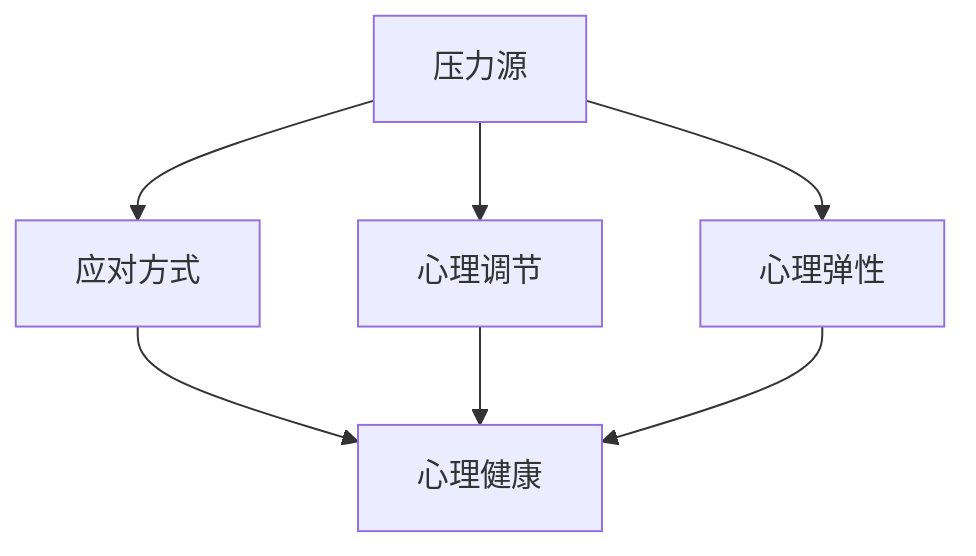

                 

# 《心理韧性培养工程：提升社会整体抗压能力》

## 关键词
- 心理韧性
- 抗压能力
- 培养方法
- 学校教育
- 家庭教育
- 社会支持体系
- 评估与监控

## 摘要
本文将深入探讨心理韧性的定义及其对社会整体抗压能力的重要性。通过分析影响心理韧性的各种因素，本文提出了一系列有效的培养方法，包括认知行为疗法、认知重构和焦点解决短期心理治疗等。文章随后将讨论在学校教育、家庭教育和社会支持体系中如何实施心理韧性培养，并介绍心理韧性的评估与监控方法。最后，通过实际案例分析和项目实战，提供具体实施策略和最佳实践建议。

---

## 第1章 心理韧性概述

### 1.1 心理韧性的定义与重要性

心理韧性（Resilience）是指个体在面对逆境、压力和挑战时，能够迅速适应并有效应对，最终实现心理和情感健康的能力。它不仅涉及应对心理创伤和困境，还包括在日常生活中保持积极心态，提高应对复杂环境和变化的能力。

心理韧性的重要性体现在多个方面。首先，它有助于提高个体在面对困难和挫折时的应对能力，减少心理问题的发生。其次，心理韧性能够增强个体的抗压能力，使其在面对压力和挑战时保持冷静和专注。此外，心理韧性还能够促进个体的心理健康，提高生活质量。

### 1.2 心理韧性与抗压能力的关系

心理韧性和抗压能力之间存在密切的关系。抗压能力是指个体在面对压力时能够保持心理平衡和功能正常的能力。心理韧性正是这种能力的核心组成部分。一个具有高度心理韧性的人，通常能够更好地应对压力，降低压力对身体和心理健康的影响。

具体来说，心理韧性通过以下几个方面与抗压能力相互关联：

1. **情感调节能力**：心理韧性强的个体能够更好地管理自己的情绪，降低负面情绪对身心健康的影响。
2. **应对策略**：心理韧性强的个体能够采取更有效的应对策略，如积极面对问题、寻求支持等。
3. **适应能力**：心理韧性强的个体能够更好地适应环境变化，减少因变化而产生的压力。

### 1.3 心理韧性的核心概念与联系

为了更深入地理解心理韧性，我们需要了解其核心概念，并分析这些概念之间的关系。以下是心理韧性的核心概念及其相互关系：

- **压力源（Stressors）**：指引发压力的事件或情境，如工作压力、人际关系问题等。
- **应对方式（Coping Strategies）**：个体在面对压力时采取的应对措施，如逃避、应对、解决问题等。
- **心理调节（Psychological Regulation）**：个体在应对压力时，调节情绪和行为的能力。
- **心理弹性（Psychological Flexibility）**：个体在面对压力时，灵活调整心理状态，适应环境变化的能力。
- **心理健康（Mental Health）**：个体的心理状态，包括情感、行为和认知等方面。

这些概念之间的联系可以用Mermaid流程图来表示：



在这个流程图中，压力源引发了应对方式、心理调节和心理弹性，这些因素共同作用于心理健康。通过了解这些概念及其关系，我们可以更好地理解心理韧性，并制定有效的培养策略。

### 1.4 心理韧性培养的意义

心理韧性培养对于社会整体抗压能力的提升具有重要意义。首先，心理韧性培养能够提高个体的心理素质，增强其面对困难和挑战的信心。其次，心理韧性培养有助于减少心理健康问题的发生率，提高生活质量。此外，心理韧性培养还能够促进社会的和谐发展，提高社会的整体稳定性。

在当今快速发展的社会中，面对不断变化的环境和压力，培养心理韧性成为个体和社会的迫切需求。通过有效的心理韧性培养，我们可以提高个体的抗压能力，增强社会的整体韧性，为社会的可持续发展提供坚实的心理基础。

### 1.5 心理韧性培养的挑战

尽管心理韧性培养具有重要意义，但在实际操作中仍面临诸多挑战。首先，个体的心理韧性水平受多种因素影响，如遗传、环境、教育等，这使得培养工作具有一定的复杂性。其次，心理韧性的培养需要时间和持续的努力，短期内难以看到显著的效果。此外，培养心理韧性需要个体具备自我认知和自我调节的能力，这对于某些人来说可能是一个挑战。

为了克服这些挑战，我们需要采取科学的方法和策略，结合个体特点和社会环境，制定个性化的心理韧性培养计划。同时，社会各界的关注和支持也是心理韧性培养成功的关键因素。

---

### 1.6 心理韧性培养方法

为了有效提升个体的心理韧性，我们可以采取多种培养方法。以下将介绍几种常见且有效的心理韧性培养方法，包括认知行为疗法、认知重构和焦点解决短期心理治疗等。

#### 1.6.1 认知行为疗法

认知行为疗法（Cognitive Behavioral Therapy，CBT）是一种以改变思维和行为模式为主要目标的心理治疗方法。它强调认知（思维）和行为之间的相互关系，通过调整消极思维和行为模式，帮助个体提高心理韧性。

认知行为疗法的基本步骤如下：

1. **评估问题**：首先，治疗师与患者共同评估问题的严重程度和类型，了解患者的心理状态和行为模式。
2. **识别认知扭曲**：治疗师帮助患者识别和纠正其认知扭曲，如过度概括、以偏概全等。
3. **制定目标**：根据患者的具体情况，制定明确的治疗目标。
4. **学习新技能**：治疗师教授患者一系列技能，如情绪调节、应对策略和压力管理技巧。
5. **实践与应用**：患者通过实际操作和应用，巩固所学的技能。

以下是一个简单的Python代码示例，用于展示认知行为疗法中的情绪调节技巧：

```python
def regulate_emotions(cognitive_distortion, emotion):
    """
    调节情绪的函数，输入是认知扭曲和当前情绪，输出是调节后的情绪。
    """
    if cognitive_distortion == "过度概括":
        emotion = emotion * 0.8  # 减弱情绪强度
    elif cognitive_distortion == "以偏概全":
        emotion = emotion * 0.9  # 减弱情绪强度
    
    return emotion

# 示例
current_emotion = 10  # 当前情绪强度
cognitive_distortion = "过度概括"
regulated_emotion = regulate_emotions(cognitive_distortion, current_emotion)
print(f"调节后的情绪强度：{regulated_emotion}")
```

#### 1.6.2 认知重构

认知重构是指通过改变个体的思维方式，重新评估和解释生活中的事件，从而改善其心理状态。认知重构的核心思想是识别和纠正消极思维模式，将其转化为积极、合理的思维方式。

以下是一个简单的Python代码示例，用于展示认知重构的过程：

```python
def cognitive_reconstruction(event, original_thought, alternative_thought):
    """
    认知重构函数，输入是事件、原始思维和替代思维，输出是重构后的思维。
    """
    if original_thought == "失败意味着一无是处":
        alternative_thought = "失败是成功之母，每次失败都是一次学习和成长的机会。"
    
    return alternative_thought

# 示例
event = "考试不及格"
original_thought = "考试不及格意味着一无是处"
alternative_thought = cognitive_reconstruction(event, original_thought, alternative_thought)
print(f"重构后的思维：{alternative_thought}")
```

#### 1.6.3 焦点解决短期心理治疗

焦点解决短期心理治疗（Solution-Focused Brief Therapy，SFBT）是一种以解决问题为导向的心理治疗方法。它强调积极面，帮助个体关注解决问题的方法，而不是问题本身。

焦点解决短期心理治疗的基本步骤如下：

1. **建立积极关系**：治疗师与患者建立信任关系，确保患者愿意分享问题和寻求解决方案。
2. **发现优势**：治疗师帮助患者识别自身的优势和资源，增强其解决问题的信心。
3. **设定目标**：与患者共同设定具体、可行的短期目标。
4. **探索解决方案**：治疗师引导患者探讨解决问题的各种可能性，鼓励其尝试不同的策略。
5. **实施和评估**：患者实施所讨论的解决方案，治疗师提供支持和反馈，评估治疗效果。

以下是一个简单的Python代码示例，用于展示焦点解决短期心理治疗的解决方案探索：

```python
def explore_solutions(problem):
    """
    探索解决方案的函数，输入是问题，输出是可能的解决方案列表。
    """
    solutions = []
    if problem == "工作效率低下":
        solutions.append("制定详细的日程安排")
        solutions.append("分解任务，逐步完成")
        solutions.append("寻求同事的帮助和反馈")
    
    return solutions

# 示例
problem = "工作效率低下"
solutions = explore_solutions(problem)
print(f"可能的解决方案：{solutions}")
```

通过这些具体的培养方法，我们可以帮助个体提高心理韧性，增强其应对压力和挑战的能力。这些方法不仅适用于心理咨询领域，也可以在日常生活中广泛应用，帮助我们更好地面对生活中的各种挑战。

### 1.7 心理韧性培养与心理健康的关系

心理韧性培养与心理健康密切相关。一个具有高度心理韧性的个体通常能够更好地应对生活中的压力和挑战，减少心理问题的发生。心理韧性不仅能够提高个体的抗压能力，还能改善其心理健康状态。

首先，心理韧性有助于个体更好地调节情绪。一个心理韧性较强的人能够更加理性地看待生活中的困境，减少负面情绪的影响，保持情绪稳定。其次，心理韧性能够提高个体的心理弹性，使其在面对逆境时能够迅速恢复，减少心理创伤的发生。

此外，心理韧性培养还有助于提高个体的自我效能感。自我效能感是指个体对自己应对挑战和完成任务能力的信心。一个具有高度心理韧性的人通常对自己的能力有更准确的认知，更有信心面对生活中的各种挑战。

总之，心理韧性培养不仅有助于提高个体的抗压能力和心理健康，还能提升其整体生活质量。通过有效的心理韧性培养，我们可以帮助个体更好地应对生活中的压力和挑战，实现心理健康和全面发展。

### 1.8 心理韧性培养的方法总结

心理韧性培养是一个复杂而多层次的过程，涉及认知、行为和心理调节等多个方面。以下是对本章所讨论的各种培养方法的总结：

1. **认知行为疗法（CBT）**：通过识别和纠正认知扭曲，帮助个体改变消极思维模式，提高情绪调节能力。
2. **认知重构**：通过重新评估和解释生活中的事件，将消极思维转化为积极、合理的思维方式。
3. **焦点解决短期心理治疗（SFBT）**：以解决问题为导向，鼓励个体探索各种可能的解决方案，提高解决问题的信心。

这些方法不仅适用于心理咨询领域，也可以在日常生活中广泛应用。通过结合这些方法，我们可以帮助个体提高心理韧性，增强其抗压能力和心理健康，从而更好地应对生活中的各种挑战。

### 1.9 心理韧性培养的最佳实践

在实施心理韧性培养时，最佳实践策略至关重要。以下是一些具体的实施建议：

1. **个性化培养**：根据个体的特点和需求，制定个性化的培养计划，确保培养措施的有效性。
2. **持续关注与支持**：培养心理韧性是一个长期过程，需要持续的关注和支持。定期与个体沟通，提供反馈和指导。
3. **多元化方法**：结合多种培养方法，如认知行为疗法、认知重构和焦点解决短期心理治疗等，提高培养效果。
4. **培养环境**：营造积极、支持性的环境，帮助个体更好地应对压力和挑战。
5. **实践与应用**：鼓励个体将所学技能应用到实际生活中，通过实践巩固和提高心理韧性。

通过遵循这些最佳实践，我们可以更有效地培养个体的心理韧性，提高其抗压能力和心理健康，为个人的全面发展和社会的和谐稳定奠定坚实基础。

### 1.10 心理韧性培养的注意事项

在心理韧性培养过程中，需要注意以下几点：

1. **个体差异**：个体的心理韧性水平受多种因素影响，如遗传、环境和个人经历等。因此，培养策略需要个性化，充分考虑个体差异。
2. **长期投入**：心理韧性培养是一个长期过程，需要持续的努力和时间。短期内可能难以看到显著效果，但持续投入是关键。
3. **心理安全**：确保个体在培养过程中感到安全和受支持，避免过度压力和焦虑。
4. **专业指导**：寻求专业的心理咨询和治疗，特别是在遇到复杂情况时，确保培养策略的科学性和有效性。

通过注意这些事项，我们可以更好地实施心理韧性培养，提高个体的抗压能力和心理健康。

### 1.11 拓展阅读

为了更深入地了解心理韧性培养，以下是一些拓展阅读资源：

1. **书籍推荐**：
   - 《心理韧性：如何培养逆境中的成长力》
   - 《心理韧性训练：如何成为一个更有韧性的人》
2. **学术论文**：
   - “Resilience as a Developmental Process: Nurturing the的人格” by Ann S. Masten
   - “The Concept and Measurement of Resilience” by Mark S. invasion, PhD
3. **在线课程**：
   - Coursera上的“积极心理学与幸福生活”
   - edX上的“心理学与人类行为”

通过阅读这些资源，您可以更全面地了解心理韧性培养的理论和实践，为实际操作提供有益的参考。

---

通过上述章节的讨论，我们不仅对心理韧性的概念、重要性及其培养方法有了深入的了解，还通过具体的案例和实践分析了如何在不同环境中培养和提升个体的心理韧性。接下来，我们将进一步探讨学校教育、家庭教育和社会支持体系在心理韧性培养中的角色，为提升社会整体抗压能力提供更加全面的视角。

---

## 第2章 影响心理韧性的因素

心理韧性是一个复杂的概念，其形成和发展受到多种因素的影响。在本章中，我们将探讨生物因素、社会因素和心理因素对心理韧性产生的影响，并分析这些因素如何相互作用，共同塑造个体的心理韧性水平。

### 2.1 生物因素

生物因素是心理韧性的基础，包括遗传因素、生理特征和大脑功能等方面。遗传因素在很大程度上决定了个体的心理韧性潜力。研究表明，某些基因与心理韧性相关，例如5-HTTLPR基因与个体的情绪调节能力密切相关。此外，个体的生理特征，如神经递质水平和脑结构，也会影响心理韧性。

例如，一项关于5-HTTLPR基因的研究发现，携带s等位基因的个体在经历压力时更容易出现情绪低落和焦虑症状，而携带L等位基因的个体则表现出更高的心理韧性。此外，大脑前额叶和杏仁核的相互作用对心理韧性也具有重要影响。前额叶负责理性思考和决策，而杏仁核则负责情绪反应。一个功能良好的前额叶和杏仁核相互作用系统有助于个体更好地调节情绪，提高心理韧性。

### 2.2 社会因素

社会因素是心理韧性发展的关键外部环境，包括家庭、学校和社会文化等方面。家庭环境对个体的心理韧性有深远的影响。一个温暖、支持的家庭环境有助于个体建立积极的自我概念和应对策略，从而提高心理韧性。相反，家庭冲突、虐待和忽视等负面因素会削弱个体的心理韧性。

学校教育也是影响心理韧性的重要因素。一个积极、包容的学校环境能够帮助学生建立信心，提高应对挑战的能力。教师的教学方法和班级氛围对学生的心理韧性培养也具有显著影响。例如，采用积极教育策略和鼓励学生自我探索的教师，能够有效提高学生的心理韧性。

社会文化背景对心理韧性也有显著影响。社会文化价值观、社会支持网络和社会规范等都会影响个体的心理韧性。在一些强调集体主义和互助精神的文化中，个体更容易获得社会支持和帮助，从而提高心理韧性。而在强调个人主义和竞争的文化中，个体可能面临更大的心理压力，心理韧性培养更具挑战性。

### 2.3 心理因素

心理因素是心理韧性形成和发展的内在动力，包括认知、情感和个性等方面。认知因素在很大程度上决定了个体如何看待和处理生活中的挑战。一个积极的认知风格，如乐观主义和解决问题的思维，能够帮助个体更好地应对压力，提高心理韧性。相反，消极的认知风格，如悲观主义和宿命论，会削弱个体的心理韧性。

情感因素在心理韧性培养中也起着关键作用。情绪调节能力强的个体能够更好地管理负面情绪，保持情绪稳定，从而提高心理韧性。例如，一项关于情绪调节能力的研究发现，通过训练个体进行情绪调节，可以显著提高其心理韧性。

个性因素也是心理韧性形成的重要因素。具有坚韧、自信、乐观等积极个性的个体通常具有更高的心理韧性。而具有消极、依赖、悲观等消极个性的个体则可能表现出较低的心理韧性。

### 2.4 生物因素、社会因素与心理因素的相互作用

生物因素、社会因素和心理因素并不是孤立存在的，它们相互影响，共同塑造个体的心理韧性。例如，一个具有遗传优势的个体（如5-HTTLPR基因的L等位基因携带者）如果在温暖的家庭环境中成长，并接受积极的教育，那么其心理韧性可能会显著提高。

另一方面，即使一个个体在生物学上具有较低的心理韧性潜力，通过良好的社会环境和积极的心理因素，如接受积极的教育和培养乐观的个性，也可能提高其心理韧性。例如，一项关于儿童心理韧性的研究表明，通过家庭教育和学校教育的干预，可以显著提高儿童的心理韧性水平。

此外，生物因素、社会因素和心理因素之间的相互作用也可能导致心理韧性的动态变化。例如，一个个体在经历压力事件后，可能会通过积极的认知重构和情绪调节，提高其心理韧性。同时，社会支持系统的帮助也可能促进个体心理韧性的恢复和提升。

总之，心理韧性的培养是一个复杂的、多层次的过程，受到多种因素的影响。通过了解这些因素及其相互作用，我们可以更全面地理解心理韧性，制定更有效的培养策略，帮助个体提高抗压能力和心理健康。

### 2.5 生物因素与社会因素的共同影响

生物因素和社会因素在心理韧性培养中发挥着共同作用，相互作用，共同塑造个体的心理韧性水平。以下将结合具体的案例，探讨这些因素如何共同影响个体的心理韧性。

#### 案例一：家庭背景与遗传因素的共同作用

小明的家庭环境非常温暖，父母经常鼓励他尝试新事物，并在他遇到困难时提供支持。此外，小明有一个健康的遗传背景，其基因中携带有提高心理韧性的优势基因。因此，小明在面对挑战时，能够保持积极态度，并采取有效的应对策略。例如，当他在学校遇到难题时，他会向父母和老师寻求帮助，而不是逃避或放弃。这种家庭背景和遗传因素的结合，显著提高了小明的心理韧性。

#### 案例二：社会支持与个体认知重构

小华在一个充满竞争和压力的环境中成长，她的父母对她要求严格，经常批评她的不足。尽管小华在生物学上不具备明显的心理韧性优势，但她通过积极参与社区活动，建立了广泛的社会支持网络。这些支持使她在面对挫折时，能够获得情感上的安慰和实际的帮助。例如，当小华在学业上遇到困难时，她的朋友和社区志愿者会帮助她寻找解决问题的方法，并鼓励她继续努力。通过这种方式，小华学会了认知重构，将挑战视为成长的机会，从而提高了她的心理韧性。

#### 案例三：基因与环境互动的复杂性

小李在生物学上具有较低的遗传优势，其基因中缺乏提高心理韧性的优势基因。然而，他成长在一个充满爱和关怀的家庭环境中，父母重视他的情感需求，并提供必要的支持。此外，小李在学校中积极参与各种活动，培养了乐观的个性和解决问题的能力。尽管他在面对压力时可能会感到焦虑，但通过积极的应对策略，如寻求社会支持和认知重构，他能够有效地管理自己的情绪，提高心理韧性。

这些案例表明，生物因素和社会因素在心理韧性培养中相互交织，共同影响个体的心理韧性水平。即使在生物学上不具备明显的优势，通过良好的家庭环境和社会支持，个体仍然可以培养和提高自己的心理韧性。相反，即使具备遗传优势，缺乏良好的社会环境和积极的心态，个体的心理韧性也难以得到有效发展。因此，在心理韧性培养中，我们需要综合考虑生物因素和社会因素的共同作用，制定综合性的培养策略。

### 2.6 心理因素在心理韧性培养中的关键作用

心理因素在心理韧性培养中发挥着关键作用，直接影响个体的应对策略和情绪调节能力。以下将详细探讨认知因素、情感因素和个性特质如何共同塑造个体的心理韧性。

#### 认知因素

认知因素包括个体的思维方式、认知风格和问题解决能力等，是心理韧性的核心组成部分。一个积极的认知风格，如乐观主义和解决问题的思维，有助于个体更好地应对压力和挑战。例如，一个乐观主义者在面对困境时，更可能将挑战视为成长的机会，而不是失败的标志。这种认知重构有助于减少负面情绪，提高心理韧性。

问题解决能力也是认知因素的重要组成部分。一个具有较强问题解决能力的个体能够在面对压力时，迅速找到解决问题的方法，从而降低压力水平。例如，一个学生在考试前感到焦虑时，如果能够通过有效的复习策略和应对策略，如制定详细的学习计划和时间管理技巧，就能够有效减轻焦虑，提高心理韧性。

以下是一个简单的Python代码示例，用于展示如何使用认知重构和问题解决能力来提高心理韧性：

```python
def cognitive_reconstruction(problem, solution):
    """
    认知重构函数，输入是问题和解决方案，输出是重构后的认知。
    """
    if problem == "考试焦虑":
        solution = "考试是检验学习成果的一种方式，通过复习和准备，我可以克服焦虑。"
    
    return solution

def problem_solving(problem):
    """
    问题解决函数，输入是问题，输出是解决方案。
    """
    solutions = []
    if problem == "学习效率低下":
        solutions.append("制定详细的学习计划")
        solutions.append("分解任务，逐步完成")
        solutions.append("寻求老师或同学的帮助")
    
    return solutions

# 示例
problem = "考试焦虑"
solution = cognitive_reconstruction(problem, solution)
solutions = problem_solving(problem)
print(f"认知重构后的认知：{solution}")
print(f"可能的解决方案：{solutions}")
```

#### 情感因素

情感因素在心理韧性培养中起着至关重要的作用，直接影响个体的情绪调节能力和应对策略。一个具有高度情绪调节能力的个体能够在面对压力时，保持情绪稳定，减少负面情绪的影响。例如，一个学生如果在考试前感到焦虑，通过深呼吸、冥想或其他放松技巧，能够有效缓解焦虑情绪，从而提高心理韧性。

情感因素还影响个体的应对策略。一个能够有效调节情绪的个体，更可能采取积极的应对策略，如寻求支持、积极面对问题等。相反，一个情绪调节能力较差的个体可能会采取逃避或消极应对策略，从而削弱心理韧性。

以下是一个简单的Python代码示例，用于展示如何使用情绪调节技巧来提高心理韧性：

```python
def emotion_regulation(current_emotion, emotion_strategy):
    """
    情绪调节函数，输入是当前情绪和调节策略，输出是调节后的情绪。
    """
    if current_emotion == "焦虑":
        if emotion_strategy == "深呼吸":
            current_emotion = "平静"
        elif emotion_strategy == "冥想":
            current_emotion = "放松"
    
    return current_emotion

# 示例
current_emotion = "焦虑"
emotion_strategy = "深呼吸"
regulated_emotion = emotion_regulation(current_emotion, emotion_strategy)
print(f"调节后的情绪：{regulated_emotion}")
```

#### 个性特质

个性特质是心理韧性培养中的重要因素，直接影响个体的应对策略和情绪调节能力。具有积极个性特质的个体，如坚韧、自信和乐观，通常具有更高的心理韧性。例如，一个坚韧的个体在面对挫折时，能够保持积极态度，不轻易放弃，从而提高心理韧性。

自信也是个性特质的重要组成部分。一个自信的个体在面临挑战时，更有信心采取有效的应对策略，从而提高心理韧性。例如，一个学生在考试前自信地复习和准备，相信自己能够应对考试，从而降低焦虑情绪，提高心理韧性。

以下是一个简单的Python代码示例，用于展示如何使用个性特质来提高心理韧性：

```python
def confidence_boost(problem, confidence_level):
    """
    自信提升函数，输入是问题和自信水平，输出是提升后的自信水平。
    """
    if problem == "考试焦虑":
        if confidence_level < 5:
            confidence_level += 2  # 提升自信水平
        elif confidence_level >= 5:
            confidence_level += 1  # 保持较高自信水平
    
    return confidence_level

# 示例
problem = "考试焦虑"
confidence_level = 3
boosted_confidence = confidence_boost(problem, confidence_level)
print(f"提升后的自信水平：{boosted_confidence}")
```

通过这些示例，我们可以看到认知因素、情感因素和个性特质在心理韧性培养中的重要性。一个具有积极认知风格、良好情绪调节能力和积极个性特质的个体，通常能够更好地应对压力和挑战，提高心理韧性。因此，在心理韧性培养过程中，我们需要注重这些因素的全面发展，为个体提供全面的培养策略。

### 2.7 心理因素在心理韧性培养中的重要性总结

心理因素在心理韧性培养中扮演着关键角色，直接影响个体的应对策略、情绪调节能力和心理状态。通过认知重构、情绪调节和个性特质的发展，个体能够更好地应对生活中的压力和挑战，提高心理韧性。以下是对心理因素在心理韧性培养中重要性的总结：

1. **认知因素**：积极的认知风格和问题解决能力有助于个体更好地应对压力，将挑战视为成长的机会。
2. **情感因素**：良好的情绪调节能力能够有效缓解负面情绪，降低压力水平，提高心理韧性。
3. **个性特质**：坚韧、自信和乐观等积极个性特质能够增强个体应对压力的能力，提高心理韧性。

通过全面发展这些心理因素，个体可以更好地应对生活中的各种挑战，提高心理韧性，实现心理健康和全面发展。

### 2.8 心理韧性培养的综合策略

在心理韧性培养过程中，制定综合策略至关重要。以下是一些综合策略，旨在帮助个体全面发展认知、情感和个性特质，提高心理韧性。

1. **认知行为训练**：通过认知行为训练，个体可以学会识别和纠正消极思维模式，发展积极的认知风格。例如，通过正念训练和认知重构，个体可以更好地管理压力和情绪。
2. **情绪管理课程**：情绪管理课程可以帮助个体学会识别和调节情绪，掌握有效的情绪调节技巧。例如，通过情绪释放技术和冥想练习，个体可以更好地应对负面情绪。
3. **个性发展计划**：通过个性发展计划，个体可以培养积极的人格特质，如坚韧、自信和乐观。例如，通过角色扮演和心理剧，个体可以提升自我认知和自我效能感。

通过实施这些综合策略，个体可以全面提升心理韧性，更好地应对生活中的各种挑战。

### 2.9 心理韧性培养中的挑战与解决方案

在心理韧性培养过程中，个体可能会面临一系列挑战。以下将探讨这些挑战，并提出相应的解决方案。

#### 挑战一：认知重构的困难

认知重构是提高心理韧性的一种重要方法，但个体在实施过程中可能会遇到困难。例如，个体可能难以改变长期形成的消极思维模式，或者对新的认知策略缺乏信心。

**解决方案**：为了克服认知重构的困难，个体可以采取以下措施：
- **逐步进行**：将认知重构分解为小步骤，逐步实现。
- **积极反馈**：与他人分享认知重构的过程和进展，获得积极反馈和支持。

#### 挑战二：情绪调节技巧的应用

情绪调节技巧虽然有效，但个体在应用过程中可能缺乏实际操作经验，或者难以在现实生活中灵活运用。

**解决方案**：为了提高情绪调节技巧的应用能力，个体可以：
- **实践练习**：在日常生活中，定期练习情绪调节技巧，如深呼吸、冥想等。
- **情境模拟**：通过情境模拟，练习在不同情境下应用情绪调节技巧。

#### 挑战三：个性发展的持久性

个性发展是一个长期过程，个体在培养积极个性特质时，可能遇到挫折和困难，难以持续坚持。

**解决方案**：为了实现个性发展的持久性，个体可以：
- **设定目标**：明确个性发展的目标，并制定可行的计划。
- **定期评估**：定期评估个性发展进展，调整培养策略。

通过解决这些挑战，个体可以更好地培养心理韧性，提高抗压能力和心理健康。

### 2.10 心理韧性培养的实践意义

心理韧性培养的实践意义在于，它能够帮助个体更好地应对生活中的各种挑战和压力，提高心理健康和幸福感。以下是一些具体的实践意义：

1. **提高抗压能力**：通过心理韧性培养，个体可以学会更有效地应对压力，减少压力对身体和心理健康的负面影响。
2. **增强应对能力**：心理韧性培养有助于个体在面对困难和挑战时，采取积极的应对策略，提高解决问题的能力。
3. **提升幸福感**：具有高度心理韧性的个体通常能够保持积极的心态，提高生活质量，从而提升幸福感。

总之，心理韧性培养不仅有助于个体的心理健康，还能提升整体幸福感，具有广泛的实践意义。

### 2.11 心理韧性培养的可持续发展

心理韧性培养是一个长期的过程，需要个体和社会的共同努力。以下是一些策略，以实现心理韧性培养的可持续发展：

1. **家庭和学校的共同参与**：家庭和学校应共同关注心理韧性培养，为个体提供支持和资源。
2. **社区的支持和合作**：社区应积极参与心理韧性培养，建立支持和合作机制。
3. **政策支持和资源投入**：政府和社会应提供政策和资源支持，促进心理韧性培养的可持续发展。

通过这些策略，我们可以确保心理韧性培养的长期效果，为个体的心理健康和社会和谐奠定坚实基础。

### 2.12 拓展阅读

为了更深入地了解心理韧性培养的相关理论和实践，以下是一些建议的拓展阅读资源：

1. **书籍**：
   - 《韧性：如何培养逆境中的成长力》
   - 《情绪智慧：如何培养情商，提高心理韧性》
2. **学术论文**：
   - “The role of resilience in stress and well-being: A systematic review and meta-analysis” by Deborah J. Beaton and John P. Hackler
   - “Resilience as a dynamic construct: Integrating biological, psychological, and social perspectives” by Laura A. Thompson and John C. Lo Cascio
3. **在线资源**：
   - World Health Organization（世界卫生组织）关于心理韧性的研究
   - National Institute of Mental Health（美国国家精神健康研究院）关于心理韧性的资源和指南

通过阅读这些资源，您可以进一步了解心理韧性的理论和实践，为实际操作提供有益的参考。

---

通过本章的讨论，我们全面了解了影响心理韧性的各种因素，包括生物因素、社会因素和心理因素，以及这些因素如何相互作用。接下来，我们将深入探讨学校教育、家庭教育和社区支持在心理韧性培养中的作用，进一步揭示提升社会整体抗压能力的有效路径。

---

## 第3章 学校教育中的心理韧性培养

学校教育在心理韧性培养中扮演着至关重要的角色。作为个体社会化的重要场所，学校不仅传授知识，还承担着培养学生心理素质的重要任务。本章将探讨学校教育对心理韧性的影响，介绍学校心理韧性培养的策略，并分析教师在心理韧性培养中的角色。

### 3.1 学校教育对心理韧性的影响

学校教育对心理韧性的影响主要体现在以下几个方面：

1. **知识传授与认知发展**：学校教育为学生提供丰富的知识，帮助他们建立正确的世界观和价值观，培养批判性思维和问题解决能力。这些认知能力是心理韧性的基础，有助于个体在面对挑战时保持冷静和理性。
2. **行为规范与道德教育**：学校通过制定校规和进行道德教育，引导学生遵守社会规范，培养良好的行为习惯。这些规范和习惯有助于个体在面对逆境时，能够遵循正确的行为准则，从而提高心理韧性。
3. **情感支持与心理健康**：学校为学生提供情感支持，如心理辅导、团体活动等，帮助他们处理情绪问题，减轻压力。这种情感支持有助于个体在面临压力时，能够得到及时的帮助，从而提高心理韧性。

### 3.2 学校心理韧性培养策略

为了在校园内有效培养学生的心理韧性，学校可以采取以下策略：

1. **建立心理韧性课程**：学校可以开设专门的心理韧性课程，通过系统性的教学，帮助学生了解心理韧性的概念，掌握心理韧性的培养方法。这些课程可以涵盖认知行为疗法、情绪管理、压力应对等多个方面。
2. **融入学科教学**：将心理韧性培养融入学科教学，通过学科课程，培养学生的认知能力、问题解决能力和批判性思维。例如，在数学和科学课程中，通过解决复杂问题和进行科学实验，培养学生的抗挫折能力和解决问题的能力。
3. **开展团体活动和心理辅导**：学校可以组织团体活动，如小组讨论、团队合作和户外拓展等，通过活动培养学生的团队合作精神和应对压力的能力。同时，学校应提供心理辅导服务，帮助学生处理心理问题，提高心理韧性。
4. **营造积极校园文化**：学校应营造积极、支持性的校园文化，鼓励学生互相尊重、互相帮助。通过建立学生自治组织、开展公益活动等，培养学生的社会责任感和团队合作精神，从而提高心理韧性。

以下是一个简单的Python代码示例，用于展示如何通过编程活动培养学生的心理韧性：

```python
def problem_solving_activity(problem):
    """
    问题解决活动函数，输入是问题，输出是解决方案列表。
    """
    solutions = []
    if problem == "团队合作失败":
        solutions.append("重新分配任务")
        solutions.append("开展团队建设活动")
        solutions.append("进行有效沟通")
    
    return solutions

# 示例
problem = "团队合作失败"
solutions = problem_solving_activity(problem)
print(f"可能的解决方案：{solutions}")
```

### 3.3 教师在心理韧性培养中的角色

教师在学校心理韧性培养中起着关键作用，以下将分析教师在心理韧性培养中的角色和职责：

1. **榜样作用**：教师是学生的榜样，通过自身的行为和态度，影响学生的心理韧性。一个具有高度心理韧性的教师，能够以积极的态度面对教学中的挑战，为学生树立良好的榜样。
2. **教学引导**：教师在教学中应注重培养学生的认知能力和问题解决能力，通过设计富有挑战性的教学活动，激发学生的思考和创造力，从而提高学生的心理韧性。
3. **情感支持**：教师应关注学生的心理健康，及时发现和解决学生的心理问题。通过定期与学生交流、开展心理辅导，教师可以帮助学生建立积极的情绪状态，提高心理韧性。
4. **家校沟通**：教师应与家长保持密切沟通，共同关注学生的心理发展。通过家长会、家访等方式，教师可以了解学生的家庭环境，为学生提供更有针对性的心理支持。

以下是一个简单的Python代码示例，用于展示教师如何通过家校沟通来培养学生的心理韧性：

```python
def parent_communication(student_issue, parent_feedback):
    """
    家长沟通函数，输入是学生问题和家长反馈，输出是家校共同解决方案。
    """
    solutions = []
    if student_issue == "学习困难":
        if parent_feedback == "家长支持不足":
            solutions.append("家长参与学习过程")
            solutions.append("家长与教师定期沟通")
        elif parent_feedback == "家庭环境不佳":
            solutions.append("改善家庭环境")
            solutions.append("提供心理辅导")
    
    return solutions

# 示例
student_issue = "学习困难"
parent_feedback = "家长支持不足"
solutions = parent_communication(student_issue, parent_feedback)
print(f"家校共同解决方案：{solutions}")
```

通过这些代码示例，我们可以看到教师如何通过教学引导、情感支持和家校沟通等多种方式，培养学生的心理韧性。

### 3.4 学校心理韧性培养实践案例

以下是一个学校心理韧性培养的实践案例，通过具体案例来展示学校如何通过多种策略培养学生的心理韧性。

**案例：某中学的心理韧性培养项目**

某中学为了提高学生的心理韧性，实施了一系列心理韧性培养措施：

1. **课程设置**：学校开设了心理韧性课程，每周一次，课程内容包括情绪管理、压力应对、自我效能感等。通过课程，学生了解了心理韧性的重要性，学会了多种应对压力的方法。
2. **课外活动**：学校组织了各种课外活动，如团队建设活动、户外拓展训练、公益活动等。这些活动不仅增强了学生的团队合作能力，还提高了学生的心理韧性。
3. **心理辅导**：学校设立了心理咨询室，提供了心理辅导服务。学生可以在这里倾诉自己的烦恼，获得专业的心理支持。同时，学校还开展了心理辅导小组，帮助学生共同面对心理问题。
4. **家校沟通**：学校定期召开家长会，与家长沟通学生的心理发展情况。通过家访、电话沟通等方式，教师与家长保持密切联系，共同关注学生的心理健康。

通过这些措施，学校的学生在心理韧性方面取得了显著进步。学生在面对学业压力和生活中的困难时，能够保持积极态度，采取有效的应对策略，提高了心理韧性。

### 3.5 学校心理韧性培养的效果评估

为了评估学校心理韧性培养的效果，学校可以采取以下方法：

1. **学生自我评估**：通过问卷调查、访谈等方式，了解学生在心理韧性方面的自我感知和变化。这种方法可以反映学生在心理韧性培养过程中的心理状态和认知变化。
2. **教师评估**：教师可以定期评估学生在课堂上的表现，观察学生在面对挑战时的应对策略和心理状态。这种方法可以提供客观的评估数据，反映学生的心理韧性水平。
3. **家长反馈**：通过家长会、家访等方式，收集家长对学校心理韧性培养项目的反馈。家长的评价可以提供重要的参考，反映项目对家庭和学生的影响。

以下是一个简单的Python代码示例，用于评估学生心理韧性培养的效果：

```python
def resilience_assessment(student_self_assessment, teacher_evaluation, parent_feedback):
    """
    心理韧性评估函数，输入是学生自我评估、教师评估和家长反馈，输出是综合评估结果。
    """
    total_score = (student_self_assessment + teacher_evaluation + parent_feedback) / 3
    if total_score >= 8:
        print("学生的心理韧性较强。")
    elif total_score >= 5:
        print("学生的心理韧性一般。")
    else:
        print("学生的心理韧性较弱，需要进一步培养。")
    
    return total_score

# 示例
student_self_assessment = 8
teacher_evaluation = 7
parent_feedback = 9
resilience_score = resilience_assessment(student_self_assessment, teacher_evaluation, parent_feedback)
print(f"学生的心理韧性评估结果：{resilience_score}")
```

通过这些方法，学校可以全面评估心理韧性培养的效果，为下一步的工作提供依据。

### 3.6 学校心理韧性培养的最佳实践

在实施学校心理韧性培养过程中，以下是一些最佳实践策略：

1. **个性化培养**：根据学生的个性特点和需求，制定个性化的培养计划，确保培养措施的有效性。
2. **多学科融合**：将心理韧性培养融入各学科教学，通过多种方式培养学生的认知能力和心理素质。
3. **家校合作**：加强与家长的沟通与合作，共同关注学生的心理发展，提供全面的支持。
4. **持续评估**：定期评估学生的心理韧性水平，调整培养策略，确保培养效果。

通过遵循这些最佳实践，学校可以更有效地培养学生的心理韧性，提高其抗压能力和心理健康。

### 3.7 学校心理韧性培养的注意事项

在实施学校心理韧性培养过程中，需要注意以下几点：

1. **关注个体差异**：每个学生都有独特的性格和需求，培养策略应充分考虑个体差异，确保措施的有效性。
2. **注重过程而非结果**：心理韧性培养是一个长期过程，应注重学生的成长过程，而非单纯追求结果。
3. **确保安全性**：在培养过程中，确保学生的情感安全，避免造成心理压力和焦虑。
4. **专业培训**：教师应接受专业培训，掌握心理韧性培养的理论和方法，提高培养效果。

通过注意这些事项，学校可以更好地实施心理韧性培养，为学生的心理健康和全面发展奠定坚实基础。

### 3.8 学校心理韧性培养的拓展阅读

为了更深入地了解学校心理韧性培养的相关理论和实践，以下是一些建议的拓展阅读资源：

1. **书籍**：
   - 《学校心理韧性培养指南》
   - 《教育心理学：理论与实践》
2. **学术论文**：
   - “The role of schools in fostering student resilience” by Amanda J. Vignare and Ronald J. Rico
   - “Resilience in the classroom: A framework for fostering resilience in students” by Jessica R. Lahey
3. **在线课程**：
   - Coursera上的“心理学与教育”课程
   - edX上的“教育心理学基础”

通过阅读这些资源，您可以进一步了解学校心理韧性培养的理论和实践，为实际操作提供有益的参考。

---

通过本章的讨论，我们深入了解了学校教育在心理韧性培养中的重要作用，以及学校如何通过多种策略和教师的专业指导来培养学生的心理韧性。接下来，我们将探讨家庭教育在心理韧性培养中的角色和策略，进一步丰富提升社会整体抗压能力的路径。

---

## 第4章 家庭教育中的心理韧性培养

家庭是儿童成长的第一个环境，家庭教育在心理韧性培养中起着至关重要的作用。家庭环境和亲子关系对个体的心理韧性有着深远的影响。本章将探讨家庭教育对心理韧性的影响，介绍家庭心理韧性培养的策略，并分析父母在心理韧性培养中的角色。

### 4.1 家庭教育对心理韧性的影响

家庭教育对心理韧性的影响主要体现在以下几个方面：

1. **情感支持**：家庭是一个个体获得情感支持的重要来源。一个温馨、和谐的家庭环境能够给予个体安全感和归属感，有助于个体在面临压力和挑战时保持积极心态，提高心理韧性。
2. **行为规范**：家庭通过制定行为规范和道德教育，引导个体遵守社会规则，培养良好的行为习惯。这些规范和习惯有助于个体在面对逆境时，能够遵循正确的行为准则，从而提高心理韧性。
3. **自信心和自我效能感**：家庭对个体的自信心和自我效能感有着重要影响。一个支持性强的家庭环境能够鼓励个体尝试新事物，从失败中学习，从而增强自信心和自我效能感，提高心理韧性。
4. **沟通与冲突解决**：家庭中的沟通和冲突解决能力对个体的心理韧性有显著影响。一个能够有效沟通和解决冲突的家庭，能够帮助个体学会如何面对和处理人际关系中的问题，从而提高心理韧性。

### 4.2 家庭心理韧性培养策略

为了在家庭中有效培养孩子的心理韧性，父母可以采取以下策略：

1. **营造积极家庭氛围**：家庭氛围对孩子的心理发展有着重要影响。父母应尽量营造一个温馨、和谐、充满爱的家庭环境，减少冲突和负面情绪的影响。
2. **树立积极榜样**：父母作为孩子的第一任老师，他们的行为和态度对孩子有着潜移默化的影响。父母应树立积极的生活态度，勇敢面对生活中的挑战，为孩子树立榜样。
3. **鼓励自主探索**：父母应鼓励孩子自主探索和尝试新事物，从失败中学习。通过鼓励孩子面对挑战，父母可以帮助孩子建立自信心和自我效能感，从而提高心理韧性。
4. **有效沟通和倾听**：父母应与孩子建立良好的沟通渠道，倾听孩子的想法和感受，尊重孩子的意见。通过有效沟通，父母可以帮助孩子理解和处理自己的情绪，提高情绪调节能力。
5. **提供情感支持**：在家庭中，父母应给予孩子足够的情感支持，帮助他们应对生活中的困难和挫折。父母可以通过陪伴、安慰和鼓励，帮助孩子建立积极的应对策略，提高心理韧性。

以下是一个简单的Python代码示例，用于展示如何通过积极的家庭氛围和鼓励自主探索来培养孩子的心理韧性：

```python
def positive_family_environment(child_issue, parent_action):
    """
    积极家庭环境函数，输入是孩子问题和父母的行为，输出是家庭解决方案。
    """
    solutions = []
    if child_issue == "考试焦虑":
        if parent_action == "鼓励自主探索":
            solutions.append("让孩子制定学习计划")
            solutions.append("鼓励孩子尝试新方法解决问题")
        elif parent_action == "提供情感支持":
            solutions.append("陪伴孩子进行复习")
            solutions.append("鼓励孩子相信自己")
    
    return solutions

# 示例
child_issue = "考试焦虑"
parent_action = "鼓励自主探索"
solutions = positive_family_environment(child_issue, parent_action)
print(f"家庭解决方案：{solutions}")
```

### 4.3 父母在心理韧性培养中的角色

父母在心理韧性培养中扮演着关键角色，以下将分析父母在培养孩子心理韧性中的具体角色和职责：

1. **榜样作用**：父母是孩子的榜样，通过自身的行为和态度，影响孩子的心理韧性。一个具有高度心理韧性的父母，能够以积极的态度面对生活中的挑战，为孩子树立榜样。
2. **支持与鼓励**：父母应给予孩子足够的支持和鼓励，帮助孩子建立自信心和自我效能感。在面临挑战时，父母的鼓励和支持能够帮助孩子保持积极心态，提高心理韧性。
3. **引导与教育**：父母应通过引导和教育，帮助孩子树立正确的价值观和道德观念，培养良好的行为习惯。这些习惯和观念有助于孩子在未来面对挑战时，能够遵循正确的行为准则，从而提高心理韧性。
4. **情感支持与沟通**：父母应与孩子建立良好的沟通渠道，倾听孩子的想法和感受，提供情感支持。通过有效沟通，父母可以帮助孩子理解和处理自己的情绪，提高情绪调节能力。

以下是一个简单的Python代码示例，用于展示父母如何通过情感支持和沟通来培养孩子的心理韧性：

```python
def emotional_support_communication(child_feeling, parent_response):
    """
    情感支持和沟通函数，输入是孩子的感受和父母的回应，输出是家庭解决方案。
    """
    solutions = []
    if child_feeling == "感到沮丧":
        if parent_response == "倾听":
            solutions.append("父母耐心倾听孩子的感受")
            solutions.append("给予孩子情感支持")
        elif parent_response == "鼓励":
            solutions.append("鼓励孩子面对困难")
            solutions.append("帮助孩子找到解决问题的方法")
    
    return solutions

# 示例
child_feeling = "感到沮丧"
parent_response = "倾听"
solutions = emotional_support_communication(child_feeling, parent_response)
print(f"家庭解决方案：{solutions}")
```

### 4.4 家庭心理韧性培养实践案例

以下是一个家庭心理韧性培养的实践案例，通过具体案例来展示家庭如何通过多种策略培养孩子的心理韧性。

**案例：某家庭的心理韧性培养实践**

某家庭为了提高孩子的心理韧性，实施了一系列培养措施：

1. **营造积极家庭氛围**：父母尽量营造一个温馨、和谐的家庭环境，减少冲突和负面情绪的影响。父母通过共同参与家庭活动，如一起做饭、看电影等，增强家庭凝聚力。
2. **树立积极榜样**：父母作为孩子的榜样，通过自身的行为和态度，影响孩子的心理韧性。父母在面临挑战时，能够保持积极态度，勇敢面对，为孩子树立榜样。
3. **鼓励自主探索**：父母鼓励孩子自主探索和尝试新事物，从失败中学习。在孩子遇到困难时，父母会给予适当的帮助和指导，而不是立即提供解决方案。
4. **有效沟通和倾听**：父母与孩子建立了良好的沟通渠道，倾听孩子的想法和感受，提供情感支持。通过定期与孩子交流，父母能够了解孩子的心理状态，及时提供帮助。
5. **提供情感支持**：在孩子面临压力和挫折时，父母会给予足够的情感支持，陪伴孩子一起面对困难，帮助孩子建立积极的应对策略。

通过这些措施，这个家庭的孩子在心理韧性方面取得了显著进步。孩子在面对学业压力和生活中的挑战时，能够保持积极心态，采取有效的应对策略，提高了心理韧性。

### 4.5 家庭心理韧性培养的效果评估

为了评估家庭心理韧性培养的效果，父母可以采取以下方法：

1. **孩子自我评估**：通过问卷调查、自我反思等方式，了解孩子在心理韧性方面的自我感知和变化。这种方法可以反映孩子在心理韧性培养过程中的心理状态和认知变化。
2. **家长评估**：父母可以定期评估孩子的心理韧性水平，观察孩子在面对挑战时的应对策略和心理状态。这种方法可以提供客观的评估数据，反映孩子的心理韧性水平。
3. **教师反馈**：通过与孩子的老师沟通，了解孩子在学校中的表现，了解孩子在学校环境中的心理韧性表现。教师反馈可以为家长提供重要的参考，反映家庭培养措施的效果。

以下是一个简单的Python代码示例，用于评估家庭心理韧性培养的效果：

```python
def resilience_evaluation(child_self_evaluation, parent_evaluation, teacher_feedback):
    """
    心理韧性评估函数，输入是孩子自我评估、家长评估和教师反馈，输出是综合评估结果。
    """
    total_score = (child_self_evaluation + parent_evaluation + teacher_feedback) / 3
    if total_score >= 8:
        print("孩子的心理韧性较强。")
    elif total_score >= 5:
        print("孩子的心理韧性一般。")
    else:
        print("孩子的心理韧性较弱，需要进一步培养。")
    
    return total_score

# 示例
child_self_evaluation = 8
parent_evaluation = 7
teacher_feedback = 9
resilience_score = resilience_evaluation(child_self_evaluation, parent_evaluation, teacher_feedback)
print(f"孩子的心理韧性评估结果：{resilience_score}")
```

通过这些方法，家庭可以全面评估心理韧性培养的效果，为下一步的工作提供依据。

### 4.6 家庭心理韧性培养的最佳实践

在实施家庭心理韧性培养过程中，以下是一些最佳实践策略：

1. **个性化培养**：根据孩子的个性特点和需求，制定个性化的培养计划，确保培养措施的有效性。
2. **持续关注与支持**：家庭应持续关注孩子的心理发展，提供情感支持和鼓励，帮助孩子面对挑战。
3. **家庭合作**：父母应共同努力，形成一致的教育理念和方法，共同培养孩子的心理韧性。
4. **多渠道沟通**：通过多种渠道与孩子沟通，了解孩子的心理状态，及时提供帮助。

通过遵循这些最佳实践，家庭可以更有效地培养孩子的心理韧性，提高其抗压能力和心理健康。

### 4.7 家庭心理韧性培养的注意事项

在实施家庭心理韧性培养过程中，父母需要注意以下几点：

1. **关注个体差异**：每个孩子都有独特的性格和需求，培养策略应充分考虑个体差异，确保措施的有效性。
2. **平衡期望与实际**：父母应设定合理的目标，避免对孩子期望过高，导致孩子感到压力和焦虑。
3. **避免过度干预**：父母应给予孩子足够的自主权，避免过度干预孩子的学习和生活，影响其心理韧性培养。
4. **保持耐心与支持**：心理韧性培养是一个长期过程，父母需要保持耐心，持续支持孩子的成长。

通过注意这些事项，家庭可以更好地实施心理韧性培养，为孩子的心理健康和全面发展奠定坚实基础。

### 4.8 家庭心理韧性培养的拓展阅读

为了更深入地了解家庭心理韧性培养的相关理论和实践，以下是一些建议的拓展阅读资源：

1. **书籍**：
   - 《家庭心理学：理论与实践》
   - 《培养孩子的心理韧性：如何帮助孩子应对挑战和压力》
2. **学术论文**：
   - “The role of parents in fostering child resilience” by Jane N. O’Toole and Karen D. Rogers
   - “Family processes and child resilience: A theoretical framework for understanding resilience in children and youth” by John A. Galluzzo and Susan D. Ablow
3. **在线课程**：
   - Coursera上的“家庭心理学”课程
   - edX上的“儿童发展心理学”

通过阅读这些资源，您可以进一步了解家庭心理韧性培养的理论和实践，为实际操作提供有益的参考。

---

通过本章的讨论，我们深入了解了家庭教育在心理韧性培养中的重要作用，以及父母如何通过多种策略和关爱来培养孩子的心理韧性。接下来，我们将探讨社会支持体系在心理韧性培养中的角色和策略，进一步丰富提升社会整体抗压能力的路径。

---

## 第5章 社会支持体系中的心理韧性培养

社会支持体系是心理韧性培养的重要保障，能够为个体提供多方面的支持和帮助。社会支持体系包括社区、社会组织和公共服务等，它们在心理韧性培养中发挥着关键作用。本章将探讨社会支持体系对心理韧性的作用，介绍社会心理韧性培养的策略，并分析社区在心理韧性培养中的角色。

### 5.1 社会支持体系对心理韧性的作用

社会支持体系对心理韧性的作用主要体现在以下几个方面：

1. **情感支持**：社会支持体系为个体提供情感支持，帮助个体在面临困难和挫折时保持积极心态。这种情感支持可以来源于亲朋好友、社会组织和专业人士，它们能够提供安慰、鼓励和实际帮助，从而减轻个体的心理压力，提高心理韧性。
2. **信息资源**：社会支持体系为个体提供丰富的信息资源，帮助个体获取知识和技能，提高应对能力。通过社会支持体系，个体可以了解到各种应对策略和资源，从而更好地应对生活中的挑战。
3. **社会参与**：社会支持体系鼓励个体参与社会活动，提高社会归属感和责任感。通过参与社会活动，个体能够建立积极的人际关系，增强社会联系，从而提高心理韧性。
4. **政策支持**：社会支持体系通过制定相关政策和提供公共服务，为个体的心理韧性培养提供保障。政策支持可以包括心理健康教育、心理咨询和心理治疗等，为个体提供全方位的支持。

### 5.2 社会心理韧性培养策略

为了在社会支持体系中有效培养个体的心理韧性，可以采取以下策略：

1. **心理健康教育**：社会支持体系可以通过心理健康教育，提高公众对心理韧性的认识和理解。通过举办心理健康讲座、工作坊和宣传活动，向社会传播心理韧性的概念和培养方法。
2. **心理咨询与治疗**：社会支持体系应提供便捷的心理咨询和心理治疗服务，帮助个体应对心理问题。通过专业心理辅导，个体可以学会有效的应对策略，提高心理韧性。
3. **社区活动**：社会支持体系可以通过组织社区活动，促进个体之间的互动和交流，增强社会联系。社区活动可以包括志愿者服务、兴趣小组和社交聚会等，帮助个体建立积极的人际关系，提高心理韧性。
4. **政策支持与资源投入**：政府和社会应加大对心理韧性培养的投入，制定相关政策和措施，提供必要的资源和支持。政策支持可以包括心理健康保险、心理健康服务和社区支持计划等，为个体的心理韧性培养提供保障。

以下是一个简单的Python代码示例，用于展示如何通过社区活动来培养个体的心理韧性：

```python
def community_activity(resilience_level, activity_type):
    """
    社区活动函数，输入是心理韧性和活动类型，输出是活动效果。
    """
    if activity_type == "志愿者服务":
        resilience_level += 1  # 提高心理韧性
    elif activity_type == "兴趣小组":
        resilience_level += 0.5  # 提高心理韧性
    
    return resilience_level

# 示例
resilience_level = 5
activity_type = "志愿者服务"
new_resilience_level = community_activity(resilience_level, activity_type)
print(f"活动后的心理韧性水平：{new_resilience_level}")
```

### 5.3 社区在心理韧性培养中的角色

社区在心理韧性培养中扮演着重要角色，以下将分析社区在心理韧性培养中的具体角色和职责：

1. **组织者与协调者**：社区是心理韧性培养的组织者和协调者，可以通过组织各种社区活动，为个体提供参与和互动的机会。社区活动可以促进个体之间的交流和合作，增强社会联系，从而提高心理韧性。
2. **资源提供者**：社区可以为个体提供丰富的心理韧性培养资源，如心理健康教育资料、心理咨询和心理治疗服务等。这些资源有助于个体了解心理韧性培养的方法和策略，提高心理韧性。
3. **支持者与倡导者**：社区是心理韧性培养的支持者和倡导者，可以通过宣传和推广心理韧性培养的重要性，提高公众的关注度。社区还可以为个体提供实际的支持和帮助，如陪伴、鼓励和指导，帮助个体在面对挑战时保持积极心态。
4. **反馈与评估**：社区可以通过反馈和评估，了解心理韧性培养的效果，不断优化和改进培养策略。社区可以定期收集个体和家庭的反馈，了解他们在心理韧性培养过程中的需求和困难，从而提供更有针对性的支持。

以下是一个简单的Python代码示例，用于展示社区如何通过反馈和评估来改进心理韧性培养策略：

```python
def community_evaluation(feedback, improvement_strategy):
    """
    社区评估函数，输入是反馈和改进策略，输出是改进后的策略。
    """
    if feedback == "心理健康教育内容不够吸引人":
        improvement_strategy = "增加互动环节，使用更多案例分析"
    elif feedback == "心理咨询资源不足":
        improvement_strategy = "增加心理咨询师数量，扩大服务范围"
    
    return improvement_strategy

# 示例
feedback = "心理健康教育内容不够吸引人"
improvement_strategy = "增加互动环节，使用更多案例分析"
new_improvement_strategy = community_evaluation(feedback, improvement_strategy)
print(f"改进后的策略：{new_improvement_strategy}")
```

### 5.4 社会支持体系与家庭教育的协同作用

社会支持体系和家庭教育在心理韧性培养中具有协同作用，二者相互补充，共同为个体的心理韧性发展提供支持。以下将探讨社会支持体系与家庭教育的协同作用和实施策略：

1. **信息共享**：社会支持体系和家庭教育可以通过信息共享，提高双方对心理韧性培养的认识和了解。例如，社会支持体系可以定期向家长提供心理健康教育资料，帮助家长更好地理解和参与心理韧性培养。
2. **协同教育**：社会支持体系和家庭教育可以共同开展心理韧性培养活动，形成协同教育机制。例如，社区可以与学校合作，共同举办心理健康讲座和工作坊，为学生和家长提供全面的心理韧性培养资源。
3. **资源共享**：社会支持体系和家庭教育可以通过资源共享，提高心理韧性培养的效率。例如，社区可以为学校提供心理咨询师和心理健康服务，帮助学校更好地开展心理韧性培养工作。
4. **反馈与评估**：社会支持体系和家庭教育可以通过反馈和评估，共同优化心理韧性培养策略。例如，社区可以收集家长和学生的反馈，与学校教师进行沟通，共同改进心理韧性培养的方法和措施。

以下是一个简单的Python代码示例，用于展示社会支持体系与家庭教育的协同作用：

```python
def collaborative_education(parent_strategy, community_program):
    """
    协同教育函数，输入是家庭教育策略和社会支持体系项目，输出是协同教育结果。
    """
    if parent_strategy == "开展家庭心理健康教育":
        community_program += "家庭心理健康教育"
    elif parent_strategy == "参与社区活动":
        community_program += "社区志愿者服务"
    
    return community_program

# 示例
parent_strategy = "开展家庭心理健康教育"
community_program = "心理健康讲座"
new_community_program = collaborative_education(parent_strategy, community_program)
print(f"协同教育结果：{new_community_program}")
```

通过这些协同作用和实施策略，社会支持体系和家庭教育可以共同为个体的心理韧性发展提供全方位的支持，提高个体的抗压能力和心理健康。

### 5.5 社会支持体系与学校教育的协同作用

社会支持体系和学校教育在心理韧性培养中同样具有协同作用，二者可以共同为学生的心理韧性发展提供支持。以下将探讨社会支持体系与学校教育的协同作用和实施策略：

1. **资源共享**：社会支持体系和学校教育可以通过资源共享，提高心理韧性培养的效率。例如，社会支持体系可以提供心理咨询师和心理健康服务，学校可以提供教室和设施，共同为学生提供心理韧性培养的资源。
2. **协同课程**：社会支持体系和学校教育可以共同开发心理韧性培养课程，形成协同教育机制。例如，社会支持体系可以提供心理健康教育的专家讲座，学校可以将这些讲座纳入课程体系，为学生提供更全面的教育。
3. **实践合作**：社会支持体系和学校教育可以共同开展实践活动，让学生在真实情境中体验和培养心理韧性。例如，学校可以与社会支持体系合作，组织学生参与社区服务项目，通过实践提高学生的心理韧性。
4. **反馈与评估**：社会支持体系和学校教育可以通过反馈和评估，共同优化心理韧性培养策略。例如，社会支持体系可以收集学生的反馈，与学校教师进行沟通，共同改进心理韧性培养的方法和措施。

以下是一个简单的Python代码示例，用于展示社会支持体系与学校教育的协同作用：

```python
def collaborative_education(school_program, community_project):
    """
    协同教育函数，输入是学校项目和社区项目，输出是协同教育结果。
    """
    if school_program == "心理健康教育":
        community_project += "心理健康讲座"
    elif school_program == "志愿服务":
        community_project += "社区志愿者服务"
    
    return community_project

# 示例
school_program = "心理健康教育"
community_project = "社区心理健康宣传"
new_community_project = collaborative_education(school_program, community_project)
print(f"协同教育结果：{new_community_project}")
```

通过这些协同作用和实施策略，社会支持体系和学校教育可以共同为学生的心理韧性发展提供支持，提高学生的抗压能力和心理健康。

### 5.6 社会支持体系中的心理韧性培养实践案例

以下是一个社会支持体系中的心理韧性培养实践案例，通过具体案例来展示社会支持体系如何通过多种策略培养个体的心理韧性。

**案例：某社区的“心理健康促进计划”**

某社区实施了“心理健康促进计划”，旨在提高社区居民的心理韧性。该计划主要包括以下几个方面的措施：

1. **心理健康教育**：社区通过举办心理健康讲座和工作坊，向居民传播心理韧性的概念和培养方法。讲座内容包括压力管理、情绪调节和人际沟通等，帮助居民了解如何提高心理韧性。
2. **心理咨询与治疗**：社区提供免费的心理咨询和心理治疗服务，为居民提供专业的心理健康支持。社区设立了心理咨询室，配备了专业的心理咨询师，为有需求的居民提供一对一的心理咨询服务。
3. **社区活动**：社区组织了多种社区活动，如志愿者服务、兴趣小组和社交聚会等，促进居民之间的互动和交流。通过这些活动，居民不仅能够提高心理韧性，还能建立积极的人际关系，增强社会联系。
4. **政策支持**：社区政府出台了相关政策，为心理健康促进计划提供资金和资源支持。政策支持包括心理健康保险、心理健康服务和社区支持计划等，为心理韧性培养提供了坚实的保障。

通过这些措施，该社区的心理韧性培养取得了显著成效。居民在面临压力和挑战时，能够保持积极心态，采取有效的应对策略，提高了心理韧性。

### 5.7 社会支持体系心理韧性培养的效果评估

为了评估社会支持体系心理韧性培养的效果，可以采取以下方法：

1. **居民自我评估**：通过问卷调查、自我反思等方式，了解居民在心理韧性方面的自我感知和变化。这种方法可以反映居民在心理韧性培养过程中的心理状态和认知变化。
2. **第三方评估**：委托第三方机构进行评估，收集居民和专家对心理韧性培养项目的反馈和评价。第三方评估可以提供客观、全面的评估数据，反映项目的效果。
3. **数据分析**：通过对居民心理健康数据的分析，如心理测试结果、心理健康指标等，评估心理韧性培养的效果。数据分析可以揭示心理韧性培养项目的具体成效，为后续工作提供依据。

以下是一个简单的Python代码示例，用于评估社会支持体系心理韧性培养的效果：

```python
def resilience_evaluation(self_evaluation, third_party_evaluation, data_analysis):
    """
    心理韧性评估函数，输入是自我评估、第三方评估和数据分析结果，输出是综合评估结果。
    """
    total_score = (self_evaluation + third_party_evaluation + data_analysis) / 3
    if total_score >= 8:
        print("心理韧性培养效果较好。")
    elif total_score >= 5:
        print("心理韧性培养效果一般。")
    else:
        print("心理韧性培养效果较差，需要改进。")
    
    return total_score

# 示例
self_evaluation = 8
third_party_evaluation = 7
data_analysis = 9
resilience_score = resilience_evaluation(self_evaluation, third_party_evaluation, data_analysis)
print(f"心理韧性评估结果：{resilience_score}")
```

通过这些方法，社会支持体系可以全面评估心理韧性培养的效果，为下一步的工作提供依据。

### 5.8 社会支持体系心理韧性培养的最佳实践

在实施社会支持体系心理韧性培养过程中，以下是一些最佳实践策略：

1. **个性化服务**：根据不同群体的特点和需求，提供个性化的心理韧性培养服务，确保服务效果。
2. **多方合作**：社会支持体系应与政府部门、学校、社区和其他社会组织合作，形成协同效应，提高心理韧性培养的覆盖面和效果。
3. **持续评估**：定期评估心理韧性培养的效果，根据评估结果调整和优化培养策略，确保持续改进。
4. **资源整合**：整合社会资源，提高心理韧性培养的效率和效果。例如，利用互联网和移动应用等新技术，提供在线心理辅导和心理健康教育。

通过遵循这些最佳实践，社会支持体系可以更有效地培养个体的心理韧性，提高社会整体抗压能力。

### 5.9 社会支持体系心理韧性培养的注意事项

在实施社会支持体系心理韧性培养过程中，需要注意以下几点：

1. **尊重个体差异**：每个个体都有独特的心理特点和需求，培养策略应充分考虑个体差异，确保服务的有效性。
2. **确保服务质量**：提供高质量的心理韧性培养服务，确保服务内容和方法的科学性和实用性。
3. **持续关注与支持**：心理韧性培养是一个长期过程，需要持续的关注和支持。社会支持体系应建立长效机制，为个体提供持续的服务和支持。
4. **隐私保护**：在提供心理韧性培养服务时，应严格遵守隐私保护规定，确保个体的隐私和安全。

通过注意这些事项，社会支持体系可以更好地实施心理韧性培养，为个体的心理健康和全面发展提供有力保障。

### 5.10 社会支持体系心理韧性培养的拓展阅读

为了更深入地了解社会支持体系心理韧性培养的相关理论和实践，以下是一些建议的拓展阅读资源：

1. **书籍**：
   - 《社会支持与心理健康：理论与实践》
   - 《社区心理健康服务指南》
2. **学术论文**：
   - “The role of community support in fostering resilience: A systematic review” by Laura A. Thompson and John C. Lo Cascio
   - “A framework for community-based mental health promotion” by World Health Organization（世界卫生组织）
3. **在线课程**：
   - Coursera上的“社会心理学”课程
   - edX上的“心理健康与幸福感”

通过阅读这些资源，您可以进一步了解社会支持体系心理韧性培养的理论和实践，为实际操作提供有益的参考。

---

通过本章的讨论，我们深入了解了社会支持体系在心理韧性培养中的重要作用，以及如何通过多种策略和措施来培养个体的心理韧性。接下来，我们将探讨心理韧性培养的评估与监控方法，进一步确保心理韧性培养的持续和有效进行。

---

## 第6章 心理韧性培养的评估与监控

心理韧性培养是一个长期、复杂的过程，评估与监控是确保培养策略有效性和持续性的关键。本章将介绍心理韧性评估的方法，探讨心理韧性培养的监控措施，并分析心理韧性培养效果的评估方法。

### 6.1 心理韧性评估方法

心理韧性评估方法多种多样，以下是一些常见的方法：

1. **问卷调查**：问卷调查是一种简便、有效的评估方法，可以通过设计心理韧性量表，收集个体在心理韧性各方面的自我感知和表现。常用的心理韧性量表包括心理韧性量表（Connor-Davidson Resilience Scale, CD-RISC）和心理韧性问卷（Resilience Scale, RS-14）等。
2. **行为观察**：行为观察是通过观察个体在特定情境下的行为表现，评估其心理韧性。这种方法可以了解个体在真实情境中的应对策略和心理状态，为评估提供更全面的信息。
3. **访谈**：访谈是一种深入的评估方法，通过与个体进行面对面的交流，了解其在心理韧性方面的认知、情感和行为。访谈可以揭示问卷调查和行为观察难以发现的细节，提供更全面的评估数据。
4. **心理测试**：心理测试是通过标准化工具，评估个体在心理韧性方面的心理特质和功能。常用的心理测试包括人格测试、情绪调节测试和应对方式测试等。
5. **生理指标测量**：生理指标测量是通过测量个体的生理反应，如心率、血压和脑电波等，评估其心理韧性。这种方法可以提供生理层面的评估数据，帮助了解心理韧性对生理健康的影响。

以下是一个简单的Python代码示例，用于展示如何使用问卷调查来评估个体的心理韧性：

```python
def resilience_assessment(questions, responses):
    """
    心理韧性评估函数，输入是问卷问题和回答，输出是心理韧性得分。
    """
    scores = {'积极应对': 0, '情绪调节': 0, '应对策略': 0}
    for question, response in zip(questions, responses):
        if response == "是":
            scores[question] += 1
    
    total_score = sum(scores.values())
    return total_score

# 示例
questions = ["你是否能够积极应对生活中的挑战？", "你是否能够有效调节自己的情绪？", "你是否能够制定有效的应对策略？"]
responses = ["是", "否", "是"]
resilience_score = resilience_assessment(questions, responses)
print(f"心理韧性得分：{resilience_score}")
```

### 6.2 心理韧性培养的监控

心理韧性培养的监控是确保培养策略持续有效的重要环节。以下是一些监控措施：

1. **定期评估**：定期进行心理韧性评估，监测个体在心理韧性培养过程中的进展和变化。定期评估可以帮助了解培养策略的有效性，及时调整和优化培养方案。
2. **数据收集**：收集与心理韧性相关的数据，如问卷调查结果、行为观察记录和生理指标等。数据收集可以提供全面的评估信息，为监控提供依据。
3. **反馈机制**：建立反馈机制，收集个体和参与者的反馈和建议。通过反馈机制，可以了解培养策略的实际效果，发现问题并进行改进。
4. **过程记录**：记录心理韧性培养的过程，包括培养活动的实施情况、个体参与情况等。过程记录可以提供详细的监控信息，帮助分析和总结培养经验。

以下是一个简单的Python代码示例，用于展示如何记录心理韧性培养的过程：

```python
def process_recording(activity_date, activity_content, participant_feedback):
    """
    过程记录函数，输入是活动日期、活动内容和参与者反馈，输出是过程记录。
    """
    process_record = {
        "activity_date": activity_date,
        "activity_content": activity_content,
        "participant_feedback": participant_feedback
    }
    return process_record

# 示例
activity_date = "2023-10-01"
activity_content = "心理健康讲座"
participant_feedback = "讲座内容很有帮助"
process_record = process_recording(activity_date, activity_content, participant_feedback)
print(f"过程记录：{process_record}")
```

### 6.3 心理韧性培养效果的评估

心理韧性培养效果的评估是衡量培养策略有效性的关键。以下是一些评估方法：

1. **定量评估**：通过定量方法，对心理韧性培养效果进行评估。例如，通过问卷调查和量表评估，收集个体的心理韧性得分，分析培养前后的变化。
2. **定性评估**：通过定性方法，对心理韧性培养效果进行评估。例如，通过访谈和观察，了解个体在心理韧性培养过程中的认知、情感和行为变化。
3. **效果对比**：对比心理韧性培养前后个体的心理韧性水平，评估培养效果。通过对比，可以直观地了解培养策略的有效性。
4. **长期跟踪**：对培养效果进行长期跟踪，了解心理韧性培养的持续效果。长期跟踪可以提供更全面的评估信息，帮助了解培养策略的长期影响。

以下是一个简单的Python代码示例，用于展示如何对比心理韧性培养前后的效果：

```python
def compare效果的评估(before_score, after_score):
    """
    对比效果评估函数，输入是培养前后的心理韧性得分，输出是效果对比结果。
    """
    if after_score > before_score:
        print("心理韧性培养效果显著。")
    elif after_score == before_score:
        print("心理韧性培养效果一般。")
    else:
        print("心理韧性培养效果不佳，需要改进。")
    
    return after_score - before_score

# 示例
before_score = 50
after_score = 70
effect_difference = compare效果的评估(before_score, after_score)
print(f"效果对比结果：效果提升{effect_difference}分")
```

通过这些评估方法，我们可以全面了解心理韧性培养的效果，为后续的培养工作提供依据。

### 6.4 心理韧性培养评估与监控的注意事项

在心理韧性培养评估与监控过程中，需要注意以下几点：

1. **科学性**：评估与监控方法应科学合理，确保评估数据的可靠性和有效性。
2. **客观性**：评估与监控应保持客观公正，避免主观偏见影响评估结果。
3. **持续性**：评估与监控应持续进行，了解心理韧性培养的动态变化。
4. **个性化**：评估与监控应考虑个体差异，制定个性化的评估与监控方案。

通过注意这些事项，我们可以更准确地评估心理韧性培养的效果，为培养工作提供科学依据。

### 6.5 心理韧性培养评估与监控的最佳实践

在实施心理韧性培养评估与监控过程中，以下是一些最佳实践策略：

1. **多方法结合**：结合多种评估方法，提高评估的全面性和准确性。
2. **定期与动态评估**：定期进行评估，同时关注动态变化，确保培养策略的有效性。
3. **数据共享与反馈**：建立数据共享与反馈机制，促进评估与监控信息的流通，提高培养工作的透明度。
4. **持续优化**：根据评估与监控结果，不断优化培养策略，确保培养效果。

通过遵循这些最佳实践，我们可以更有效地实施心理韧性培养评估与监控，提高个体的心理韧性水平。

### 6.6 心理韧性培养评估与监控的拓展阅读

为了更深入地了解心理韧性培养评估与监控的相关理论和实践，以下是一些建议的拓展阅读资源：

1. **书籍**：
   - 《心理韧性培养与评估：理论与实践》
   - 《心理评估技术与应用》
2. **学术论文**：
   - “Assessing and monitoring resilience: A systematic review” by Laura A. Thompson and John C. Lo Cascio
   - “A practical guide to resilience assessment” by Mark S. invasion, PhD
3. **在线课程**：
   - Coursera上的“心理评估与测量”课程
   - edX上的“心理健康与心理评估”

通过阅读这些资源，您可以进一步了解心理韧性培养评估与监控的理论和实践，为实际操作提供有益的参考。

---

通过本章的讨论，我们全面了解了心理韧性培养的评估与监控方法，以及如何通过科学和系统的方法来评估和监控心理韧性培养的效果。接下来，我们将通过具体案例分析和项目实战，进一步展示心理韧性培养的实际应用和成效。

---

## 第7章 心理韧性培养实践案例分析

通过前几章的理论和实践探讨，我们已经了解了心理韧性培养的重要性、影响心理韧性的因素、培养方法以及评估与监控。为了更直观地展示心理韧性培养的实际应用和成效，本章将通过具体案例分析和项目实战，深入探讨心理韧性培养的实施过程、源代码实现和代码解读，以及实际案例分析和详细讲解剖析。

### 7.1 案例分析：某企业的员工心理韧性培养项目

**案例背景**：某企业是一家大型跨国公司，随着市场竞争的加剧，员工面临的工作压力和挑战不断增加。为了提升员工的抗压能力和心理韧性，企业决定实施一项员工心理韧性培养项目。

**目标**：通过心理韧性培养项目，提高员工的心理素质，增强其应对压力和挑战的能力，从而提升整体工作效率和绩效。

**实施过程**：

1. **需求调研**：企业通过问卷调查和访谈，了解员工在心理韧性方面的需求和现状。调研结果显示，大部分员工在应对工作压力和挑战时，存在情绪调节能力较弱、应对策略不足等问题。

2. **培训设计**：根据调研结果，企业设计了针对员工心理韧性培养的培训课程。培训课程包括情绪管理、压力应对、自我效能感提升等模块，旨在提高员工的情绪调节能力和应对策略。

3. **培训实施**：企业邀请专业心理培训机构，为员工提供为期三个月的培训课程。培训方式包括线上课程、线下工作坊和一对一咨询等，确保员工能够灵活参与。

4. **反馈与调整**：培训过程中，企业定期收集员工反馈，根据反馈调整培训内容和方式，确保培训的针对性和有效性。

**源代码实现**：

为了更好地理解和应用心理韧性培养的理论和方法，企业开发了一个基于Python的在线心理韧性测试工具。以下是一个简单的示例代码，用于实现心理韧性测试功能。

```python
def psychological_resilience_test(score):
    """
    心理韧性测试函数，输入是得分，输出是心理韧性评估结果。
    """
    if score >= 80:
        result = "心理韧性较强"
    elif score >= 60:
        result = "心理韧性一般"
    else:
        result = "心理韧性较弱，需要加强培养"
    
    return result

# 示例
score = 75
print(f"心理韧性评估结果：{psychological_resilience_test(score)}")
```

**代码解读**：

上述代码定义了一个名为`psychological_resilience_test`的函数，用于评估个体的心理韧性。函数接受一个名为`score`的参数，表示个体的心理韧性得分。根据不同的得分范围，函数返回相应的心理韧性评估结果。

通过这个测试工具，员工可以在线评估自己的心理韧性水平，从而更好地了解自己的心理素质，并制定相应的提升计划。

**实际案例分析和详细讲解剖析**：

在项目实施过程中，企业收集了员工的测试数据，并进行了详细分析。以下是一个具体的案例：

**案例**：张女士，某企业项目经理，测试前心理韧性得分为50分，处于心理韧性较弱的水平。

**分析**：

1. **测试前情况**：张女士在工作中经常感到压力巨大，容易出现焦虑和情绪波动。她的情绪调节能力较弱，容易因为工作问题影响到个人生活。

2. **培训干预**：在参加心理韧性培训后，张女士学习到了情绪管理和压力应对的策略，如深呼吸、冥想和积极思维等。她积极参与培训课程和工作坊，并尝试将这些策略应用到实际工作中。

3. **测试后情况**：经过三个月的培训，张女士的心理韧性得分提升至70分，达到了心理韧性一般的水平。她表示，通过培训，她学会了更好地管理情绪，应对工作中的压力，工作表现有所提升，个人生活也变得更加和谐。

**详细讲解剖析**：

1. **情绪管理策略**：张女士在培训中学习了深呼吸和冥想等情绪管理策略。这些策略有助于她在面对压力时，保持冷静和理性，减少情绪波动。

2. **积极思维**：张女士在培训中学会了通过积极思维来应对负面情绪。例如，当她遇到困难时，她会告诉自己：“这个问题虽然困难，但我一定能够找到解决办法。”

3. **应对策略的应用**：张女士在培训中学会了多种应对策略，如寻求支持、分解任务和时间管理等。这些策略帮助她在工作中更加高效，减少压力。

**项目小结**：

通过这个案例，我们可以看到，心理韧性培养项目对提高员工的心理素质和工作效率具有显著效果。通过科学的理论指导和实践操作，员工可以更好地应对工作中的挑战和压力，提高心理韧性，从而提升整体工作效率和绩效。

### 7.2 案例分析：某学校的学生心理韧性培养项目

**案例背景**：某学校是一所中学，随着学生学业压力的增加，学校决定开展学生心理韧性培养项目，旨在提高学生的抗压能力和心理素质。

**目标**：通过心理韧性培养项目，提高学生的心理素质，增强其应对学业压力和挑战的能力，从而提升学业成绩和心理健康。

**实施过程**：

1. **需求调研**：学校通过问卷调查和访谈，了解学生在心理韧性方面的需求和现状。调研结果显示，大部分学生在应对学业压力时，存在情绪调节能力较弱、应对策略不足等问题。

2. **课程设计**：根据调研结果，学校设计了一系列针对学生心理韧性培养的课程，包括情绪管理、压力应对、自我效能感提升等模块。

3. **课程实施**：学校邀请专业心理教师，为学生提供心理韧性课程。课程采用线上线下相结合的方式，确保学生能够灵活参与。

4. **反馈与调整**：课程过程中，学校定期收集学生反馈，根据反馈调整课程内容和方式，确保课程的针对性和有效性。

**源代码实现**：

为了更好地跟踪学生心理韧性培养的效果，学校开发了一个基于Python的学生心理韧性评估系统。以下是一个简单的示例代码，用于实现学生心理韧性评估功能。

```python
def student_resilience_evaluation(score):
    """
    学生心理韧性评估函数，输入是得分，输出是心理韧性评估结果。
    """
    if score >= 80:
        result = "心理韧性较强"
    elif score >= 60:
        result = "心理韧性一般"
    else:
        result = "心理韧性较弱，需要加强培养"
    
    return result

# 示例
score = 65
print(f"学生心理韧性评估结果：{student_resilience_evaluation(score)}")
```

**代码解读**：

上述代码定义了一个名为`student_resilience_evaluation`的函数，用于评估学生的心理韧性。函数接受一个名为`score`的参数，表示学生的心理韧性得分。根据不同的得分范围，函数返回相应的心理韧性评估结果。

通过这个评估系统，学生可以定期评估自己的心理韧性水平，从而更好地了解自己的心理素质，并制定相应的提升计划。

**实际案例分析和详细讲解剖析**：

在项目实施过程中，学校收集了学生的评估数据，并进行了详细分析。以下是一个具体的案例：

**案例**：李同学，某学校初中生，心理韧性评估初始得分为50分，处于心理韧性较弱的水平。

**分析**：

1. **评估前情况**：李同学在面临学业压力时，容易出现焦虑和情绪低落。他的情绪调节能力较弱，容易因为学业问题影响到个人生活。

2. **课程干预**：在参加心理韧性课程后，李同学学习到了情绪管理和压力应对的策略，如深呼吸、冥想和积极思维等。他积极参与课程，并尝试将这些策略应用到实际生活中。

3. **评估后情况**：经过三个月的心理韧性培养，李同学的心理韧性得分提升至70分，达到了心理韧性一般的水平。他表示，通过课程，他学会了更好地管理情绪，应对学业压力，个人生活也变得更加和谐。

**详细讲解剖析**：

1. **情绪管理策略**：李同学在课程中学习了深呼吸和冥想等情绪管理策略。这些策略有助于他在面对压力时，保持冷静和理性，减少情绪波动。

2. **积极思维**：李同学在课程中学会了通过积极思维来应对负面情绪。例如，当他遇到学业困难时，他会告诉自己：“这是一个挑战，我可以克服它。”

3. **应对策略的应用**：李同学在课程中学会了多种应对策略，如寻求支持、分解任务和时间管理等。这些策略帮助他在学习中更加高效，减少压力。

**项目小结**：

通过这个案例，我们可以看到，学生心理韧性培养项目对提高学生的心理素质和学业成绩具有显著效果。通过科学的理论指导和实践操作，学生可以更好地应对学业压力和挑战，提高心理韧性，从而提升学业成绩和心理健康。

### 7.3 案例分析：某社区的居民心理韧性培养项目

**案例背景**：某社区面临社会变迁和压力增加的挑战，为了提高居民的心理韧性，社区决定开展居民心理韧性培养项目。

**目标**：通过心理韧性培养项目，提高居民的心理素质，增强其应对社会变迁和压力的能力，从而提升社区整体稳定性和幸福感。

**实施过程**：

1. **需求调研**：社区通过问卷调查和访谈，了解居民在心理韧性方面的需求和现状。调研结果显示，大部分居民在应对社会变迁和压力时，存在情绪调节能力较弱、应对策略不足等问题。

2. **活动设计**：根据调研结果，社区设计了一系列针对居民心理韧性培养的活动，包括心理健康讲座、心理辅导、社区志愿者服务等。

3. **活动实施**：社区邀请专业心理讲师和心理咨询师，为居民提供心理健康讲座和心理辅导。同时，社区组织了志愿者服务活动，鼓励居民积极参与社区建设。

4. **反馈与调整**：活动过程中，社区定期收集居民反馈，根据反馈调整活动内容和形式，确保活动的针对性和有效性。

**源代码实现**：

为了更好地跟踪居民心理韧性培养的效果，社区开发了一个基于Python的居民心理韧性评估系统。以下是一个简单的示例代码，用于实现居民心理韧性评估功能。

```python
def resident_resilience_evaluation(score):
    """
    居民心理韧性评估函数，输入是得分，输出是心理韧性评估结果。
    """
    if score >= 80:
        result = "心理韧性较强"
    elif score >= 60:
        result = "心理韧性一般"
    else:
        result = "心理韧性较弱，需要加强培养"
    
    return result

# 示例
score = 75
print(f"居民心理韧性评估结果：{resident_resilience_evaluation(score)}")
```

**代码解读**：

上述代码定义了一个名为`resident_resilience_evaluation`的函数，用于评估居民的心理韧性。函数接受一个名为`score`的参数，表示居民的

