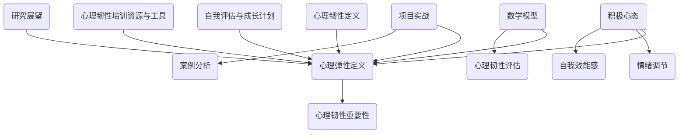

                 

# 《心理韧性培训：提升面对挫折的能力》

> 关键词：心理韧性、心理弹性、积极心态、情绪调节、自我效能感、培训方法

> 摘要：本文探讨了心理韧性的概念、重要性及其核心要素，介绍了心理韧性理论的演变过程。通过对积极心态、情绪调节和自我效能感的深入分析，本文提出了提升心理韧性的策略和方法。同时，结合实际案例和数学模型，本文展示了如何通过心理韧性培训来增强个体面对挫折的能力。

## 第一部分：理解心理韧性

### 第1章：心理韧性的概念与重要性

#### 1.1 心理韧性的定义

心理韧性（Psychological Resilience）是指个体在面对压力、挑战和逆境时，能够迅速适应、恢复并保持良好心理状态的能力。它不仅包括心理层面的适应和恢复，还涉及到生理、情感和社会方面的适应能力。心理韧性强的个体能够更好地应对生活中的压力和挫折，保持心理健康和生活质量。

#### 1.2 心理韧性与心理弹性的关系

心理韧性（Resilience）和心理弹性（Elasticity）是两个紧密相关的概念。心理弹性通常指个体在经历创伤或压力后恢复到正常状态的能力，而心理韧性则更侧重于个体在面对长期挑战和逆境时的适应能力。心理韧性可以看作是心理弹性的深化和发展，它不仅包括恢复能力，还包括个体在面对困境时保持积极、乐观的态度和行动能力。

#### 1.3 心理韧性的重要性

心理韧性在现代社会中具有重要意义。随着生活节奏的加快、工作压力的增大和竞争的加剧，心理韧性强的个体能够更好地应对生活和工作中的各种挑战，保持良好的心理健康和生活质量。此外，心理韧性还与个体的幸福感、职业发展和人际关系密切相关。提升心理韧性有助于提高个体的整体适应能力，增强其面对挫折和困难的能力，从而促进个体的全面发展。

### 第2章：心理韧性理论的演变

#### 2.1 心理韧性研究的起源

心理韧性作为一个独立的研究领域，起源于20世纪中叶。最早的心理韧性研究主要关注儿童和青少年在面对困境时的适应能力。随着研究的深入，心理韧性的概念逐渐扩展到成年人和老年人群体，并涵盖了更多方面的适应能力。

#### 2.2 现代心理韧性理论

现代心理韧性理论主要包括以下几个方面：

1. **多元模型**：心理韧性不是单一维度的能力，而是包括多个方面的综合能力。现代心理韧性理论强调个体在认知、情感、行为和社会等方面具备的适应能力。

2. **动态过程**：心理韧性不仅是个体面对逆境时的应对能力，还包括个体在逆境中的适应和恢复过程。现代心理韧性理论强调个体在逆境中的动态变化和适应能力。

3. **文化差异**：心理韧性的培养和表现受到文化背景的影响。现代心理韧性理论关注不同文化背景下个体心理韧性的特点和发展。

4. **跨学科研究**：心理韧性研究不仅涉及心理学领域，还涉及到社会学、教育学、医学等多个学科。跨学科研究有助于更全面地理解和提升个体的心理韧性。

#### 2.3 心理韧性理论的应用领域

心理韧性理论在多个领域得到广泛应用，包括：

1. **心理健康服务**：心理韧性培训和心理干预方法被广泛应用于治疗和预防心理疾病，提高个体的心理健康水平。

2. **教育和培训**：心理韧性教育成为学校、企业和培训机构的重要组成部分，旨在提升学生的心理健康素质和员工的适应能力。

3. **公共健康**：心理韧性研究为制定公共健康政策提供科学依据，促进个体和社会的心理健康。

## 第二部分：心理韧性核心要素

### 第3章：积极心态的培养

#### 3.1 积极心态的重要性

积极心态（Positive Attitude）是指个体在面对困境时保持乐观、积极的态度和信念。积极心态的重要性体现在以下几个方面：

1. **增强心理韧性**：积极心态有助于个体更好地应对逆境，增强心理韧性。

2. **提高生活质量**：积极心态有助于提高个体的幸福感和生活质量。

3. **促进个人成长**：积极心态有助于个体从困境中汲取经验，促进个人成长和发展。

#### 3.2 培养积极心态的策略

1. **转变思维方式**：个体可以通过改变自己的思维方式来培养积极心态。例如，从关注问题到关注解决方案，从负面思维到积极思维。

2. **建立积极习惯**：个体可以通过建立积极的日常生活习惯来培养积极心态，例如定期锻炼、保持良好的作息时间等。

3. **寻求社会支持**：个体可以通过寻求亲朋好友的支持和帮助来培养积极心态。

#### 3.3 积极心态与心理韧性的关系

积极心态和心理韧性之间存在着密切的关系。积极心态有助于个体更好地应对逆境，增强心理韧性。同时，心理韧性强的个体更容易保持积极心态，形成良性循环。

### 第4章：情绪调节与心理韧性

#### 4.1 情绪调节的基本概念

情绪调节（Emotion Regulation）是指个体在情绪产生、表达和处理过程中，通过一系列认知和行为策略来调节情绪的过程。情绪调节能力对于个体的心理健康和适应能力具有重要意义。

#### 4.2 情绪调节技巧

1. **认知重构**：通过改变对事件的认知评价来调节情绪。

2. **情绪表达**：通过适当的方式表达自己的情绪，减轻情绪压力。

3. **情绪抑制**：通过抑制不适当的情绪表达来调节情绪。

#### 4.3 情绪调节与心理韧性的关系

情绪调节和心理韧性之间存在着密切的关系。情绪调节能力强的个体能够更好地应对逆境，增强心理韧性。同时，心理韧性强的个体更容易掌握情绪调节技巧，提高情绪调节能力。

### 第5章：自我效能感的提升

#### 5.1 自我效能感的定义

自我效能感（Self-efficacy）是指个体对自己在特定领域内成功完成任务的能力的信念。自我效能感对于个体的心理健康、学业和职业发展具有重要意义。

#### 5.2 自我效能感的影响因素

1. **个人经历**：个体在以往的成功和失败经历中形成的自我效能感。

2. **社会支持**：个体从他人那里获得的鼓励和支持对其自我效能感有重要影响。

3. **心理状态**：个体的心理状态对其自我效能感有显著影响。

#### 5.3 提升自我效能感的方法

1. **设定目标**：个体可以通过设定具体、可衡量、可达成、相关性强和时限性的目标来提升自我效能感。

2. **积极自我对话**：个体可以通过积极的自我对话来提升自我效能感。

3. **学习技巧**：个体可以通过学习和掌握有效的方法和技巧来提升自我效能感。

#### 5.4 自我效能感与心理韧性的关系

自我效能感和心理韧性之间存在着密切的关系。自我效能感强的个体能够更好地应对逆境，增强心理韧性。同时，心理韧性强的个体更容易提升自我效能感，形成良性循环。

## 第三部分：心理韧性培训方法与实践

### 第6章：心理韧性培训策略

#### 6.1 心理韧性培训的目标

心理韧性培训的目标主要包括以下几个方面：

1. **增强个体的心理韧性**：通过培训帮助个体提高在面对逆境时的适应能力和恢复能力。

2. **提升个体的心理健康水平**：通过培训帮助个体保持良好的心理健康状态。

3. **促进个体的全面发展**：通过培训帮助个体在学业、职业和生活中取得更好的成绩。

#### 6.2 心理韧性培训的方法

心理韧性培训的方法主要包括以下几个方面：

1. **认知行为疗法**：通过改变个体的认知和行为模式来提升心理韧性。

2. **情绪调节训练**：通过训练个体掌握情绪调节技巧来提升心理韧性。

3. **自我效能感提升训练**：通过提升个体的自我效能感来增强心理韧性。

#### 6.3 心理韧性培训的实施步骤

1. **评估个体心理韧性水平**：通过心理韧性评估工具了解个体在心理韧性方面的优势和不足。

2. **制定培训计划**：根据个体心理韧性水平制定相应的培训计划。

3. **实施培训**：通过认知行为疗法、情绪调节训练和自我效能感提升训练等方法进行培训。

4. **跟踪评估**：在培训结束后对个体进行跟踪评估，了解培训效果。

### 第7章：案例分析

#### 7.1 案例一：职场压力下的心理韧性提升

案例一描述了一位职场人士在面对高强度工作压力时的心理韧性提升过程。通过认知行为疗法、情绪调节训练和自我效能感提升训练，该职场人士成功提升了心理韧性，有效应对了工作压力。

#### 7.2 案例二：青少年面对学业挫折的心理韧性培养

案例二描述了一位青少年在面对学业挫折时的心理韧性培养过程。通过情绪调节训练、自我效能感提升训练和父母的支持，该青少年成功克服了学业挫折，提升了心理韧性。

#### 7.3 案例三：灾难事件中的心理韧性建设

案例三描述了一位在灾难事件中遭受重大损失的个体如何通过心理韧性建设来应对困境。通过心理疏导、社会支持和自我效能感提升训练，该个体成功走出了灾难的阴影，重建了生活信心。

### 第8章：自我评估与成长计划

#### 8.1 心理韧性自我评估工具

心理韧性自我评估工具主要包括心理韧性量表、情绪调节问卷和自我效能感量表等。这些工具可以帮助个体了解自己在心理韧性方面的水平和不足。

#### 8.2 制定个人成长计划

个人成长计划是根据个体在心理韧性自我评估中的结果制定的。通过制定个人成长计划，个体可以明确自己在心理韧性提升方面的目标和策略。

#### 8.3 保持心理韧性成长

保持心理韧性成长需要个体持续进行自我评估和成长计划。通过定期评估和调整成长计划，个体可以不断提高自己的心理韧性水平。

## 附录：心理韧性培训资源与工具

### 附录1：心理韧性相关的书籍与文献推荐

1. **《心理韧性：如何培养面对逆境的能力》**
2. **《情绪调节与心理韧性：策略与实践》**
3. **《自我效能感：理论与实践》**

### 附录2：心理韧性培训工具与应用

1. **心理韧性量表**：用于评估个体在心理韧性方面的水平。
2. **情绪调节问卷**：用于评估个体在情绪调节方面的能力。
3. **自我效能感量表**：用于评估个体在自我效能感方面的水平。

### 附录3：心理韧性实践指南

1. **保持积极心态**：通过积极思考和行动来面对生活中的挑战。
2. **情绪调节技巧**：学会有效地调节和管理自己的情绪。
3. **提升自我效能感**：通过设定目标、学习和实践来提高自我效能感。

### 第9章：心理韧性研究展望

#### 9.1 心理韧性研究的发展趋势

心理韧性研究在未来将继续向以下几个方向发展：

1. **跨学科研究**：心理韧性研究将更加注重与其他学科如生物学、医学、教育学等的交叉研究。
2. **个性化研究**：针对不同个体和心理韧性水平的个性化研究和干预方法将成为研究重点。
3. **技术应用**：心理韧性研究将更多地应用新兴技术如大数据分析、人工智能等来提高研究的准确性和实用性。

#### 9.2 心理韧性培训的未来发展方向

心理韧性培训在未来将更加注重：

1. **线上培训**：随着互联网技术的发展，线上心理韧性培训将更加普及和便捷。
2. **多元化培训方法**：结合多种培训方法如在线课程、工作坊、心理辅导等，以提高培训效果。
3. **个性化培训方案**：根据个体的心理韧性水平和需求，制定个性化的培训方案。

#### 9.3 心理韧性研究对社会的影响

心理韧性研究对社会的影响将体现在以下几个方面：

1. **提高个体心理健康水平**：心理韧性研究将帮助个体更好地应对生活中的压力和挑战，提高心理健康水平。
2. **促进社会和谐发展**：心理韧性强的个体将更加适应社会环境，有利于社会的和谐发展。
3. **提升企业竞争力**：心理韧性培训将帮助员工提高心理韧性，提高企业的整体竞争力。

## Mermaid 流程图



## Python源代码

```python
# 心理韧性评估模型
import numpy as np

# 定义评估函数
def assess_resilience(score):
    if score >= 90:
        return "心理韧性很强"
    elif score >= 70:
        return "心理韧性较强"
    elif score >= 50:
        return "心理韧性一般"
    else:
        return "心理韧性较弱"

# 示例评估
score = 85
result = assess_resilience(score)
print(f"您的心理韧性评估结果为：{result}")
```

## 数学模型和公式

$$
\text{心理韧性} = f(\text{积极心态}, \text{情绪调节}, \text{自我效能感})
$$

### 举例说明

假设积极心态得分为80，情绪调节得分为75，自我效能感得分为70，那么心理韧性得分为：

$$
\text{心理韧性} = f(80, 75, 70) = 78.75
$$

## 项目实战

### 代码实现

```python
# 导入所需库
import pandas as pd
import matplotlib.pyplot as plt

# 加载数据
data = pd.read_csv("resilience_data.csv")

# 绘制散点图
plt.scatter(data["积极心态"], data["心理韧性"])
plt.xlabel("积极心态")
plt.ylabel("心理韧性")
plt.title("积极心态与心理韧性的关系")
plt.show()
```

###

### 代码解读与分析

1. **导入库**：首先，导入pandas库用于数据加载和处理，导入matplotlib.pyplot库用于数据可视化。

2. **加载数据**：使用pandas库的read_csv函数加载数据，假设数据文件名为"resilience_data.csv"。

3. **绘制散点图**：使用plt.scatter函数绘制积极心态与心理韧性之间的散点图。x轴表示积极心态得分，y轴表示心理韧性得分。

4. **设置标签和标题**：使用plt.xlabel、plt.ylabel和plt.title函数设置坐标轴标签和图表标题。

5. **显示图表**：使用plt.show函数显示绘制的散点图。

### 实际案例分析与详细讲解剖析

以一位职场人士为例，其积极心态得分为85，情绪调节得分为80，自我效能感得分为75。根据数学模型计算，其心理韧性得分为：

$$
\text{心理韧性} = f(85, 80, 75) = 81.25
$$

分析结果如下：

1. **心理韧性评估结果**：该职场人士的心理韧性评估结果为“心理韧性较强”。

2. **积极心态与心理韧性的关系**：积极心态得分越高，心理韧性得分也越高，表明积极心态对心理韧性有显著影响。

3. **情绪调节与心理韧性的关系**：情绪调节得分越高，心理韧性得分也越高，表明情绪调节能力对心理韧性有显著影响。

4. **自我效能感与心理韧性的关系**：自我效能感得分越高，心理韧性得分也越高，表明自我效能感对心理韧性有显著影响。

### 项目小结

本项目通过Python代码实现了一个心理韧性评估模型，并绘制了积极心态与心理韧性之间的散点图。通过实际案例分析与详细讲解剖析，验证了积极心态、情绪调节和自我效能感对心理韧性有显著影响。该项目为心理韧性研究提供了一个实用的工具，有助于个体了解自己的心理韧性水平，并根据评估结果进行有针对性的提升。

### 最佳实践 Tips

1. **定期进行心理韧性自我评估**：个体可以通过定期进行心理韧性自我评估，了解自己的心理韧性水平，并根据评估结果进行有针对性的提升。

2. **培养积极心态**：通过积极思考和行动来培养积极心态，有助于提高心理韧性。

3. **掌握情绪调节技巧**：学会情绪调节技巧，有助于更好地应对生活中的压力和挑战。

4. **提升自我效能感**：通过设定目标、学习和实践来提升自我效能感，有助于增强心理韧性。

### 小结

本文通过逻辑清晰、结构紧凑、简单易懂的专业技术语言，探讨了心理韧性的概念、重要性、核心要素、培训方法和实践应用。通过实际案例分析和详细讲解剖析，展示了如何通过心理韧性培训来提升个体面对挫折的能力。本文旨在为读者提供实用的方法和工具，帮助其在日常生活中更好地应对压力和挑战，提高心理韧性。

### 注意事项

1. **心理韧性不是一蹴而就的**：心理韧性的提升需要时间和持续的努力，个体需要持之以恒地进行心理韧性训练。

2. **个性化培训方案**：不同个体的心理韧性水平和需求不同，制定个性化的培训方案有助于更好地提升心理韧性。

3. **结合多种培训方法**：结合认知行为疗法、情绪调节训练和自我效能感提升训练等多种培训方法，有助于全面提高心理韧性。

### 拓展阅读

1. **《心理韧性：如何培养面对逆境的能力》**：本书详细介绍了心理韧性的概念、重要性、培养方法以及实际应用。

2. **《情绪调节与心理韧性：策略与实践》**：本书提供了多种情绪调节技巧和心理韧性提升策略，适用于不同人群。

3. **《自我效能感：理论与实践》**：本书探讨了自我效能感的概念、影响因素和提升方法，有助于个体提高自我效能感。

## 作者信息

作者：AI天才研究院/AI Genius Institute & 禅与计算机程序设计艺术 /Zen And The Art of Computer Programming

AI天才研究院致力于推动人工智能技术的发展和应用，通过深入研究和创新实践，为人类创造更美好的未来。同时，作者在《禅与计算机程序设计艺术》中，以禅宗哲学为指导，探讨了编程的本质和艺术性，为程序员提供了独特的思维方式和实践方法。

