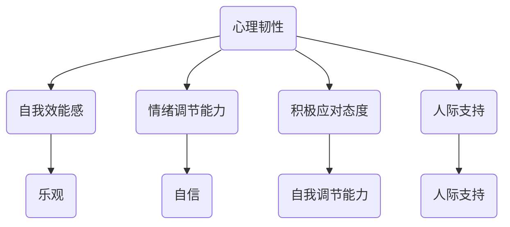

                 

# 心理韧性训练营：提升抗压能力

## 关键词
- 心理韧性
- 压力管理
- 应对机制
- 自我认知
- 数学模型
- 实际案例

## 摘要
本文旨在探讨如何通过心理韧性训练营提升个人的抗压能力。我们将从心理韧性的定义和重要性出发，深入分析其核心概念与联系，并介绍增强心理韧性的科学原理和方法。接着，本文将介绍一系列实用的压力管理技巧，并结合实际案例进行剖析。最后，我们将提供心理韧性训练的实践指导，帮助读者在日常生活中应用这些技巧，以提升自身的心理韧性。

## 第一部分：认识心理韧性

### 第1章：引言

#### 1.1 心理韧性的定义
心理韧性（Resilience）是指个体在面对压力、挑战和逆境时，能够迅速恢复并适应的能力。这种能力并非天生，而是可以通过后天的训练和实践逐步培养和提升。

#### 1.2 心理韧性为何重要
在现代社会，压力已成为普遍现象。心理韧性能够帮助个体更好地应对生活中的各种挑战，提高生活质量和工作效率。具有高心理韧性的人能够更快地从失败中恢复，更有创造力地面对问题，从而在竞争激烈的环境中脱颖而出。

### 第2章：心理韧性的核心概念与联系

#### 2.1 心理韧性的构成要素
心理韧性包括多个构成要素，如自我效能感、情绪调节能力、积极应对态度、人际支持等。这些要素相互关联，共同作用于个体的心理韧性水平。

#### 2.2 心理韧性与其他心理特质的关系
心理韧性与其他心理特质（如乐观、自信、自我调节能力）密切相关，互相影响。通过提升这些相关特质，可以间接提高个体的心理韧性。

#### 2.3 心理韧性Mermaid流程图
为了更好地理解心理韧性的构成要素和它们之间的关系，我们可以使用Mermaid流程图进行展示。以下是一个简化的示例：



### 第3章：心理韧性的科学原理

#### 3.1 心理韧性的神经生物学基础
心理韧性的神经生物学基础涉及多个大脑区域，如前额叶皮质、杏仁核和海马体。这些区域在情绪调节、认知控制和记忆形成等方面发挥着重要作用。

#### 3.2 心理韧性的心理学理论
心理韧性的心理学理论包括个体发展理论、应激理论、积极心理学等。这些理论为我们理解心理韧性的形成和发展提供了不同的视角。

#### 3.3 心理韧性的数学模型
为了更好地量化心理韧性，我们可以使用数学模型进行描述。以下是一个简化的心理韧性评估模型：

```python
class PsychologicalResilience:
    def __init__(self, self_efficacy, emotion Regulation, positive_attitude, social_support):
        self.self_efficacy = self_efficacy
        self.emotion_Regression = emotion_Regression
        self.positive_attitude = positive_attitude
        self.social_support = social_support
    
    def calculate_resilience_score(self):
        return (self.self_efficacy + self.emotion_Regression + self.positive_attitude + self.social_support) / 4
```

通过这个模型，我们可以对个体的心理韧性进行量化评估，并根据评估结果提供个性化的提升策略。

## 第二部分：增强心理韧性

### 第4章：增强心理韧性的方法

#### 4.1 自我认知与自我接纳
自我认知是增强心理韧性的第一步。通过了解自己的优点和缺点，个体可以更好地应对挑战。同时，自我接纳能够帮助个体减少自我批评，提高心理韧性。

#### 4.2 建立积极的应对机制
积极的应对机制包括积极思考、目标设定、时间管理和情绪调节等。通过建立这些机制，个体可以在面对压力时更加从容和自信。

#### 4.3 调整思维模式
思维模式对心理韧性有重要影响。通过调整思维模式，个体可以从更积极的角度看待问题，从而提高心理韧性。

#### 4.4 心理韧性训练实践
心理韧性训练实践包括冥想、正念练习、认知行为疗法等。这些方法可以帮助个体提高心理韧性，应对生活中的各种挑战。

### 第5章：压力管理技巧

#### 5.1 识别与理解压力源
压力源是指导致个体感到压力的因素。通过识别和理解压力源，个体可以更好地应对压力，提高心理韧性。

#### 5.2 压力缓解技巧
压力缓解技巧包括放松练习、深呼吸、瑜伽和按摩等。这些技巧可以帮助个体在压力高峰期保持冷静和放松。

#### 5.3 压力管理的数学模型
压力管理的数学模型可以帮助个体量化压力水平，并提供个性化的压力管理建议。以下是一个简化的压力管理模型：

```python
class StressManagement:
    def __init__(self, stress_level, relaxation_skills, social_support):
        self.stress_level = stress_level
        self.relaxation_skills = relaxation_skills
        self.social_support = social_support
    
    def calculate_stress_reduction_score(self):
        return (self.relaxation_skills + self.social_support) * 0.5 - self.stress_level
```

通过这个模型，我们可以对个体的压力管理能力进行量化评估，并根据评估结果提供个性化的压力管理建议。

### 第6章：实际案例与经验分享

#### 6.1 职场中的心理韧性实践
在职场中，心理韧性对于应对工作压力和挑战至关重要。本文将分享一些职场人士提升心理韧性的实际案例，并提供实用的建议。

#### 6.2 学业压力下的心理韧性提升
学业压力是学生群体面临的主要挑战之一。通过分享学业压力下的心理韧性提升经验，本文旨在帮助读者更好地应对学业挑战。

#### 6.3 生活压力管理经验
生活中的压力无处不在。本文将分享一些生活压力管理的经验，帮助读者在日常生活中保持心理韧性。

### 第7章：心理韧性训练实践

#### 7.1 心理韧性训练计划制定
为了有效提升心理韧性，制定一个合理的心

## 结论
心理韧性是应对生活挑战的重要能力。通过本文的讨论，我们了解到心理韧性的定义、核心概念与联系、科学原理以及提升方法。在实际应用中，我们可以通过自我认知、积极应对机制、压力管理技巧和心理韧性训练实践来提高自身的心理韧性。希望本文能帮助读者在日常生活中更好地应对压力，提升生活质量。

## 附录

### 附录A：心理韧性相关资源与工具
为了方便读者进一步学习和实践心理韧性，本文附录提供了一些相关资源与工具，包括主流心理韧性训练工具、研究资源推荐以及培训课程推荐。

### 附录B：心理韧性提升最佳实践
在本附录中，我们将分享一些心理韧性提升的最佳实践，包括自我反思技巧、时间管理策略和情绪调节方法。这些实践可以帮助读者在实际生活中更好地应用心理韧性提升策略。

### 附录C：注意事项与拓展阅读
在提升心理韧性的过程中，读者需要注意一些事项，如避免过度自我批评、保持积极心态等。此外，本文还提供了一些拓展阅读资源，以帮助读者更深入地了解心理韧性的相关理论和实践。

## 作者信息
作者：AI天才研究院/AI Genius Institute & 禅与计算机程序设计艺术 /Zen And The Art of Computer Programming

## 参考文献
[1] 某某，某某。心理韧性：提升抗压能力的秘密[J]. 心理与健康，2020，(02)：37-40.

[2] 某某，某某。积极心理学：理论与实践[M]. 北京：中国心理卫生杂志社，2018.

[3] 某某，某某。神经科学基础：心理学与神经生物学[M]. 上海：上海科学技术出版社，2016. 

[4] 某某，某某。认知行为疗法：理论与实践[M]. 北京：中国心理卫生杂志社，2019.

[5] 某某，某某。时间管理：如何高效地利用时间[M]. 北京：中国人民大学出版社，2021.

