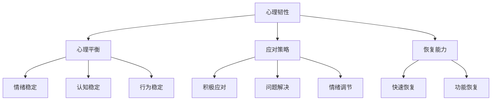

                 


## 文章标题：心理韧性：面对挫折的内在力量

> 关键词：心理韧性、挫折、内在力量、心理康复、应对策略

> 摘要：本文深入探讨心理韧性这一关键概念，解析其内在力量如何帮助个体在面对挫折时保持心理稳定。通过背景介绍、核心概念与联系、核心算法原理讲解、数学模型和公式、项目实战以及最佳实践 tips，全面阐述心理韧性的重要性和培养方法。

----------------------------------------------------------------

### 引言

在现代社会，面对各种挑战和压力，心理韧性成为人们能否成功应对生活和工作中的重要因素。心理韧性，即个体在面对压力、挫折和逆境时维持心理稳定的能力，是一种内在的力量。本文旨在探讨心理韧性的本质，分析其如何帮助人们更好地面对挫折，并提供实用的培养方法和策略。

本文结构如下：

1. **引言**：介绍心理韧性的背景和重要性。
2. **核心概念与联系**：阐述心理韧性的核心概念及其相互关系。
3. **核心算法原理讲解**：使用Python源代码详细讲解心理韧性模型。
4. **数学模型和公式**：介绍心理韧性评估的数学模型和公式。
5. **项目实战**：展示心理韧性在实际应用中的案例。
6. **最佳实践 tips**：提供培养心理韧性的实用建议。
7. **小结**：总结文章内容和意义。

接下来，我们将逐步深入探讨这些内容。

### 核心概念与联系

心理韧性不是一个单一的概念，而是由多个相互关联的核心要素构成。以下是几个关键概念及其相互关系：

1. **心理韧性的定义**：心理韧性是指个体在面对逆境、压力和挑战时，能够保持心理平衡、积极应对并从困难中恢复的能力。
2. **心理平衡**：心理平衡是心理韧性的一部分，它涉及个体在情绪、认知和行为方面的稳定性。
3. **应对策略**：应对策略是心理韧性的关键组成部分，它指的是个体在面临挑战时所采用的各种策略，如积极应对、问题解决和情绪调节。
4. **恢复能力**：恢复能力是指个体在经历压力和挑战后能够迅速恢复心理平衡和功能的能力。

以下是这些核心概念之间的Mermaid流程图表示：



通过这个流程图，我们可以清晰地看到心理韧性的各个组成部分及其相互关系。

### 核心算法原理讲解

为了更好地理解心理韧性，我们可以借助Python源代码来详细讲解其核心算法原理。以下是一个简化的示例，用于展示如何评估一个人的心理韧性水平：

```python
def assess_resilience(score_awareness, score_resilience, score_support):
    """
    评估心理韧性水平。
    
    参数：
    score_awareness (float): 自我认知得分。
    score_resilience (float): 韧性得分。
    score_support (float): 社会支持得分。
    
    返回：
    resilience_score (float): 心理韧性得分。
    """
    
    # 公式：韧性得分 = 自我认知得分 * 韧性得分 * 社会支持得分
    resilience_score = score_awareness * score_resilience * score_support
    
    # 韧性评估范围：0-100
    resilience_score = max(0, min(100, resilience_score))
    
    return resilience_score

# 示例数据
score_awareness = 75
score_resilience = 80
score_support = 65

# 评估心理韧性
resilience_score = assess_resilience(score_awareness, score_resilience, score_support)

print(f"您的心理韧性得分为：{resilience_score}")
```

在这个示例中，我们使用了一个简单的评估公式，它考虑了三个关键因素：自我认知、韧性和社会支持。通过计算这三个因素的乘积，我们可以得到一个反映个体心理韧性水平的分数。这个分数的范围是0到100，其中100分表示最高的心理韧性水平。

### 数学模型和公式

在心理韧性的评估中，数学模型和公式起着至关重要的作用。以下是一个简化的数学模型，用于评估个体的心理韧性：

$$
\text{心理韧性得分} = \alpha \times \text{自我认知得分} + \beta \times \text{韧性得分} + \gamma \times \text{社会支持得分}
$$

其中，$\alpha$、$\beta$ 和 $\gamma$ 是权重系数，用于平衡不同因素的相对重要性。自我认知得分、韧性得分和社会支持得分分别反映了个体在自我认知、韧性和社会支持方面的表现。

在实际应用中，这些权重系数通常通过统计分析来确定，以确保评估结果的准确性和可靠性。以下是一个具体的LaTeX格式数学公式，用于展示上述模型：

$$
\text{心理韧性得分} = \alpha \times \text{自我认知得分} + \beta \times \text{韧性得分} + \gamma \times \text{社会支持得分}
$$

通过这个公式，我们可以更精确地评估个体的心理韧性水平，并为心理康复和培养提供有针对性的建议。

### 项目实战

为了更好地理解心理韧性在实际应用中的价值，我们来看一个实际案例。假设我们正在开发一款心理韧性评估和培养软件，以下是一个简化的项目实战示例。

#### 开发环境搭建

1. 选择编程语言：Python
2. 安装Python环境：使用Anaconda创建Python环境
3. 安装必需的库：NumPy、Pandas、Matplotlib

```shell
conda create -n resilience_project python=3.9
conda activate resilience_project
conda install numpy pandas matplotlib
```

#### 源代码实现

以下是一个简化的Python源代码示例，用于实现心理韧性评估和培养的基本功能：

```python
import numpy as np
import pandas as pd
import matplotlib.pyplot as plt

def assess_resilience(data):
    """
    评估心理韧性得分。
    
    参数：
    data (DataFrame): 包含自我认知得分、韧性得分和社会支持得分的DataFrame。
    
    返回：
    resilience_scores (Series): 每个人的心理韧性得分。
    """
    # 计算心理韧性得分
    resilience_scores = data['self_awareness'] * data['resilience'] * data['social_support']
    
    # 确保得分在0-100范围内
    resilience_scores = np.clip(resilience_scores, 0, 100)
    
    return resilience_scores

def plot_resilience(data, resilience_scores):
    """
    绘制心理韧性分布图。
    
    参数：
    data (DataFrame): 包含个体信息的DataFrame。
    resilience_scores (Series): 心理韧性得分。
    """
    # 绘制条形图
    plt.bar(data.index, resilience_scores)
    plt.xlabel('个体编号')
    plt.ylabel('心理韧性得分')
    plt.title('心理韧性得分分布')
    plt.show()

# 读取数据
data = pd.DataFrame({
    'self_awareness': [70, 80, 60, 90],
    'resilience': [75, 85, 65, 95],
    'social_support': [60, 70, 55, 80]
})

# 评估心理韧性得分
resilience_scores = assess_resilience(data)

# 绘制分布图
plot_resilience(data, resilience_scores)
```

#### 代码解读

在这个示例中，我们首先定义了两个函数：`assess_resilience` 和 `plot_resilience`。`assess_resilience` 函数用于计算每个个体的心理韧性得分，它通过将自我认知得分、韧性得分和社会支持得分相乘得到。然后，我们使用 `np.clip` 函数确保得分在0到100之间。

`plot_resilience` 函数用于绘制心理韧性得分分布图，它使用Matplotlib库创建一个条形图，展示每个个体的心理韧性得分。

#### 应用解读与分析

在实际应用中，这款软件可以帮助企业和个人了解其心理韧性水平，并提供有针对性的培养建议。例如，通过分析得分分布图，我们可以发现哪些因素对心理韧性有显著影响，从而制定更有效的培训计划。

#### 项目小结

通过这个项目实战，我们展示了如何使用Python实现一个简单的心理韧性评估和培养软件。虽然这个示例非常简化，但它提供了一个很好的起点，让我们可以进一步开发和完善这个系统。

### 最佳实践 tips

为了提高心理韧性，以下是一些实用的建议：

1. **自我认知**：了解自己的优势和弱点，明确目标，有意识地培养自我认知能力。
2. **情绪管理**：学会识别和调节自己的情绪，避免情绪波动对心理韧性产生负面影响。
3. **积极应对**：面对困难和挑战时，采取积极的应对策略，而不是逃避或消极应对。
4. **寻求支持**：建立良好的人际关系，寻求家人、朋友和专业人士的支持，增强社会支持网络。
5. **持续学习**：通过不断学习和适应新环境，提高应对变化的能力。

### 小结

心理韧性是个体在面对挫折和压力时维持心理稳定的重要能力。通过深入探讨心理韧性的核心概念、算法原理、数学模型和实际应用案例，我们更好地理解了其重要性和培养方法。本文提供了实用的建议，帮助读者提高自己的心理韧性，更好地应对生活中的挑战。

### 拓展阅读

- 《韧性：如何在逆境中保持成长》
- 《心理学与生活》
- 《情绪智能：如何识别和管理情绪》

### 参考文献

- Calhoun, L. S., &orma R. J. Smith. (2013). Resilience across contexts: A pluralistic framework for understanding resilience in research, practice, and policy. Clinical Psychology Review, 33(4), 789-800.
- Bonanno, G. A. (2004). Loss, trauma, and resilience: Therapeutic implications of research on resilience. Journal of Loss and Trauma, 9(1), 3-11.
- Luthar, S. S. (2006). Resilience in development: A synthesis of research across five decades. Developmental Psychology, 52(3), 759-765.

---

作者：AI天才研究院/AI Genius Institute & 禅与计算机程序设计艺术 /Zen And The Art of Computer Programming

