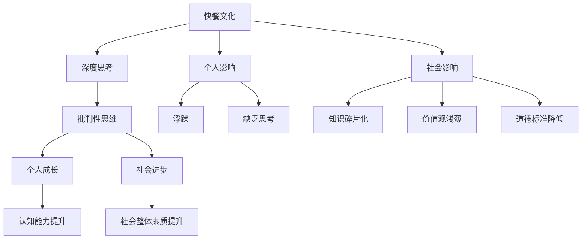

                 

### 核心概念与联系

在本文中，我们首先需要明确几个核心概念，它们是理解快餐文化中的批判性思维培养的基础。这些核心概念包括：

1. **快餐文化**：快餐文化是指一种追求速度和即时满足的文化现象，它强调快速获取信息和知识，但往往忽视深度和全面性。

2. **批判性思维**：批判性思维是一种基于理性分析和客观评价的思考方式，旨在深入理解问题，发现潜在问题和偏见。

3. **深度思考**：深度思考是一种对问题进行深入分析、全面理解和多角度探讨的思考方式，它与快餐文化的表面化和速食性形成鲜明对比。

接下来，我们将通过Mermaid流程图来展示这些核心概念之间的关系架构：

通过这个流程图，我们可以清晰地看到快餐文化、批判性思维和深度思考之间的关系。快餐文化的影响体现在个人和社会的各个方面，而批判性思维和深度思考则是应对这些负面影响的有效方法。通过培养批判性思维，个人可以提升认知能力，促进个人成长，同时也有助于提高社会整体素质，推动社会进步。

接下来，我们将深入探讨快餐文化的定义与特点、批判性思维的概念与重要性，以及批判性思维的基本原则，逐步引导读者理解并掌握这一重要思维能力。## 快餐文化的兴起与影响

快餐文化作为一种现代社会的现象，其兴起并非偶然。它源于工业化进程的加速、信息技术的飞速发展和人们对效率的追求。在现代社会中，时间变得尤为宝贵，人们追求快速、便捷的生活方式，这使得快餐文化得以迅速传播和普及。

### 快餐文化的定义与特点

快餐文化，顾名思义，是指一种追求速度和效率的文化现象，强调快速获取知识和信息，往往忽视深度和全面性。它的特点主要体现在以下几个方面：

1. **注重即时满足**：快餐文化强调在短时间内满足人们的需求，无论是物质上的还是精神上的。这种即时满足往往通过媒体、广告等方式迅速传播。

2. **追求感官刺激**：快餐文化倾向于提供视觉、听觉等感官上的刺激，以吸引人的注意力。这种刺激往往缺乏深度，难以引发深刻的思考和反思。

3. **缺乏耐心**：在快餐文化的环境下，人们往往缺乏耐心，追求快速的结果，而忽视长期的价值和意义。

4. **内容碎片化**：快餐文化下的信息往往以碎片化的形式出现，难以形成系统的知识结构和完整的认知体系。

### 快餐文化对个人和社会的影响

快餐文化对个人和社会的影响是深远且复杂的，主要体现在以下几个方面：

#### 个人影响

1. **浮躁**：快餐文化使得人们容易变得浮躁，难以沉下心来深入思考和解决问题。

2. **缺乏深度思考**：由于追求即时满足，人们往往忽视深度思考，导致认知能力下降，难以形成深刻的见解和观点。

3. **难以形成深度认知**：快餐文化下的信息往往缺乏深度和全面性，使得人们难以形成对事物的深度认知和理解。

4. **价值观浅薄**：快餐文化强调感官刺激和即时满足，容易导致人们的价值观变得浅薄，缺乏对人生和道德的深刻思考。

#### 社会影响

1. **知识碎片化**：快餐文化导致知识碎片化，人们难以获得系统的知识和全面的信息，影响社会整体的知识水平和智力发展。

2. **道德标准降低**：快餐文化强调即时满足，容易导致社会道德标准降低，社会风气浮躁，道德问题增多。

3. **社会不公平**：快餐文化下的信息传播往往不均衡，容易造成信息贫富差距，加剧社会不公。

4. **影响社会进步**：快餐文化使得社会难以形成深入的思考和讨论，影响社会的进步和发展。

### 快餐文化的形成原因

快餐文化的形成原因可以从多个角度进行分析：

1. **技术进步**：信息技术的飞速发展，尤其是互联网的普及，使得信息传播速度加快，人们获取信息更加方便快捷。

2. **工业化进程**：工业化进程的加速，使得人们的工作和生活节奏加快，追求效率和速度成为一种普遍的社会需求。

3. **商业运作**：商业运作的日益发达，广告、媒体等手段的广泛应用，使得快餐文化得以迅速传播和普及。

4. **社会心理**：现代社会中，人们普遍感到压力和焦虑，快餐文化提供了一种逃避现实的方式，满足了人们的心理需求。

通过上述分析，我们可以看出，快餐文化对个人和社会产生了深远的影响。为了应对这些负面影响，培养批判性思维显得尤为重要。在接下来的部分，我们将深入探讨批判性思维的概念、重要性以及培养方法。## 批判性思维的概念与重要性

批判性思维是一种基于理性分析和客观评价的思考方式，旨在深入理解问题，发现潜在问题和偏见。它不仅关注表面的现象，更追求对问题本质的深入挖掘，从而形成全面、深刻的认知。

### 批判性思维的定义

批判性思维（Critical Thinking）是一种系统的、理性的、积极的思考过程，它通过质疑、分析、评估和综合信息，来判断思考、论证和解决问题。这种思维方式要求思考者具备以下几个关键特征：

1. **质疑性**：批判性思维的核心在于质疑。思考者不应轻易接受任何信息或观点，而是要不断地提出问题，质疑其合理性和可靠性。

2. **分析性**：批判性思维要求对信息进行深入分析，不仅要理解表面的含义，还要探索背后的原因和动机。

3. **客观性**：在批判性思维中，客观性至关重要。思考者应努力保持中立，避免被个人情感或偏见影响，以客观的态度进行评价。

4. **评估性**：批判性思维涉及到对信息、观点和论证的评估。思考者需要评估证据的可靠性、论证的逻辑性和结论的合理性。

5. **综合性**：批判性思维强调综合不同信息、观点和证据，形成一个全面、统一的结论。

### 批判性思维的重要性

批判性思维在个人成长和社会进步中具有重要作用，具体体现在以下几个方面：

#### 个人成长

1. **提高认知能力**：批判性思维有助于提高个人的认知能力，使思考者能够更深入、全面地理解问题，从而提升学习效果。

2. **培养独立思考**：批判性思维鼓励思考者独立思考，不依赖他人的观点，从而培养出独立、自主的思考习惯。

3. **增强问题解决能力**：通过批判性思维，思考者能够更好地识别问题、分析问题，并找到有效的解决方案。

4. **促进自我反思**：批判性思维促使思考者不断地反思自己的思考过程和决策，从而提高自我认识和自我改进的能力。

#### 社会进步

1. **提高社会整体素质**：批判性思维的普及有助于提高社会整体素质，使人们能够更理性、客观地看待社会现象，减少盲目跟风和情绪化决策。

2. **促进社会公正与正义**：批判性思维有助于揭露和纠正社会不公和偏见，促进社会的公正与正义。

3. **推动社会创新与发展**：批判性思维鼓励人们质疑现状、探索新思路，从而推动社会创新与发展。

4. **增强社会稳定性**：通过批判性思维，人们能够更好地理解和应对社会问题，增强社会的稳定性。

### 批判性思维与快餐文化的对比

与快餐文化相比，批判性思维具有以下几个显著特点：

1. **深度与广度**：批判性思维追求深度和广度，不仅关注表面的现象，还深入挖掘问题的本质和内在联系。

2. **系统性与全面性**：批判性思维强调系统性思考，通过对问题的全面分析，形成完整的认知体系。

3. **质疑与探究**：批判性思维鼓励质疑和探究，不满足于表面的信息和观点，而是追求真理和真相。

4. **理性与客观**：批判性思维强调理性分析和客观评价，避免被个人情感和偏见影响。

通过批判性思维，我们可以更好地应对快餐文化带来的负面影响，提升个人的认知能力和思考深度，同时也有助于社会的进步与发展。在接下来的部分，我们将进一步探讨批判性思维的基本原则，帮助读者更好地理解和掌握这一重要的思维能力。## 批判性思维的基本原则

批判性思维是一种复杂的思考过程，它要求我们在面对问题时，能够保持理性的态度，全面、客观地分析和评估信息。以下是批判性思维的四大基本原则，它们是培养批判性思维的核心要素。

### 查证事实

查证事实是批判性思维的基础，它要求我们在接受任何信息或观点之前，都要进行详细的核实和验证。以下是一些具体的方法：

1. **查阅权威资料**：通过查阅书籍、学术论文、官方网站等权威渠道，获取准确、可靠的信息。

2. **实地考察**：对于某些信息，通过实地考察、访谈等方式，验证其真实性和准确性。

3. **交叉验证**：通过多个来源的信息进行交叉验证，以确认信息的真实性。

4. **辨别虚假信息**：学会识别虚假信息，如过度夸张、缺乏证据支持的言论等。

实例：例如，在阅读一篇新闻报道时，我们不仅要关注新闻内容本身，还要查看报道的来源、作者背景以及是否有其他媒体报道相同的新闻，从而确保其真实性和可靠性。

### 思维的开放性

思维的开放性是批判性思维的重要原则，它要求我们接受不同的观点和意见，勇于挑战自己的信念，从而拓宽思维视野。以下是一些具体的方法：

1. **接受多样性**：尊重不同的观点和意见，不因与自己观点不同而排斥。

2. **质疑自己的观点**：定期反思自己的观点和信念，质疑其合理性和可靠性。

3. **跨学科学习**：通过跨学科学习，了解不同领域的知识，拓宽思维。

4. **与他人交流**：积极参与讨论和辩论，与他人交流思想，从而获得新的见解。

实例：例如，在讨论一个社会问题时，我们不仅要考虑自己观点的合理性，还要听取不同意见，分析其优点和不足，从而形成更全面、客观的结论。

### 分析与综合

分析与综合是批判性思维的另一重要原则，它要求我们对问题进行全面分析，从多个角度思考问题，形成全面的理解。以下是一些具体的方法：

1. **多角度分析**：从不同角度和层面分析问题，避免片面和单一的观点。

2. **因果分析**：探究问题的原因和结果，理解其内在联系。

3. **逻辑推理**：运用逻辑推理，确保论证的严密性和合理性。

4. **案例研究**：通过案例研究，理解问题的实际应用和效果。

实例：例如，在分析一个政策问题时，我们不仅要考虑政策的直接影响，还要分析其可能带来的长期影响、潜在问题和潜在利益，从而形成全面的评价。

### 逻辑推理

逻辑推理是批判性思维的核心要素，它要求我们运用逻辑原理，确保思考过程的严密性和合理性。以下是一些具体的方法：

1. **识别逻辑谬误**：学会识别常见的逻辑谬误，如偷换概念、以偏概全等。

2. **构建逻辑论证**：通过合理的逻辑推理，构建严密的论证。

3. **反驳与回应**：在辩论中，能够有效地反驳对方观点，并回应其质疑。

4. **评估逻辑强度**：评估论证的逻辑强度，确保结论的合理性。

实例：例如，在论证一个技术方案的可行性时，我们不仅要考虑其技术实现，还要评估其经济成本、环境影响等，从而构建一个全面、合理的论证。

通过上述基本原则，我们可以更好地培养批判性思维，提高自己的认知能力，更全面、客观地分析和解决问题。在接下来的部分，我们将探讨如何在日常生活中培养批判性思维，并应用到工作与学习中。## 在日常生活中培养批判性思维

批判性思维不仅仅是在学术研究和工作中发挥重要作用，更是在日常生活中必不可少的能力。通过以下几种方法，我们可以在日常生活中培养批判性思维，从而提升自己的认知能力和生活质量。

### 如何在阅读中培养批判性思维

1. **主动质疑**：在阅读时，不要被动接受作者的观点，而要主动质疑，思考其合理性和证据支持。例如，当阅读一篇科学文章时，可以思考作者提出的假设是否合理，实验方法是否可靠，结论是否具有普适性。

2. **多角度分析**：尝试从不同角度分析文章的内容，比较不同作者的观点，从而形成更全面、客观的理解。例如，在阅读新闻报道时，可以关注多个媒体对同一事件的报道，比较其观点和描述的差异。

3. **评价论证**：评估文章的论证过程和逻辑结构，识别其中的逻辑谬误和偏见。例如，在阅读论证性文章时，可以检查其论据是否充分、论证是否严密。

4. **反思自身观点**：在阅读过程中，反思自己以往的观点和信念，思考是否需要调整或修正。例如，当阅读与自身观点不同的文章时，可以反思自己的观点是否过于偏颇，是否需要接受新的信息。

### 如何在社交媒体中培养批判性思维

1. **辨别虚假信息**：在社交媒体上，信息传播速度快，真假难辨。学会辨别虚假信息，例如，通过查阅权威来源、对比多个信息源、关注发布者的信誉度等方法，确保接收到的信息是真实可靠的。

2. **避免盲目转发**：在转发信息前，要确保其真实性和可靠性。避免盲目转发未经核实的消息，以避免传播虚假信息。

3. **质疑热门话题**：对于热门话题和流行的观点，保持质疑的态度，思考其背后的原因和动机。例如，对于网络上的热点事件，可以思考媒体为何报道、公众为何关注，从而形成更深入的理解。

4. **积极参与讨论**：在社交媒体上参与讨论时，保持开放和理性的态度，尊重他人的观点，并通过逻辑和事实支持自己的观点。例如，在讨论一个社会问题时，可以引用数据、案例和权威观点来支持自己的立场。

### 如何在工作与学习中培养批判性思维

1. **深入分析问题**：在工作中，面对任务和问题时，不仅要考虑表面的解决方案，还要深入分析问题的本质、原因和可能的影响。例如，在制定项目计划时，要考虑项目的长期目标和潜在风险。

2. **提出建设性意见**：在工作中，不仅要有批判性思维，还要有建设性思维，提出改进意见和解决方案。例如，在团队讨论中，可以提出改进流程、提高效率的建议。

3. **反思工作方法**：定期反思自己的工作方法，思考是否需要调整或改进。例如，可以记录工作日志，分析工作中的得失，从而不断提高工作效率。

4. **主动学习新知识**：在学习中，要主动学习新知识，并批判性地思考其合理性和应用价值。例如，在学习一门新课程时，可以思考其理论背景、实际应用和未来发展。

通过在日常生活中的阅读、社交媒体使用和工作学习中的实践，我们可以不断培养批判性思维，提升自己的认知能力和分析解决问题的能力，从而更好地应对复杂的社会环境和多变的工作挑战。## 在工作与学习中培养批判性思维

批判性思维不仅是个人成长的必备能力，也是在工作与学习中取得成功的关键。以下将具体探讨在工作与学习环境中培养批判性思维的方法，并通过实际案例进行分析和讲解。

### 如何在工作中培养批判性思维

1. **项目分析**：在项目执行过程中，批判性思维可以帮助团队成员深入分析项目的各个方面。例如，在评估一个软件开发项目时，不仅要考虑功能实现的可行性，还要分析市场需求、用户反馈、成本效益等因素。具体步骤如下：

   - **需求分析**：通过访谈、调查问卷等方式，收集用户需求，并进行分析和整理，确保项目的目标与市场需求相匹配。
   - **技术评估**：评估现有技术的可行性和适用性，考虑技术选型的风险和成本。
   - **成本估算**：根据项目规模和需求，进行详细的成本估算，确保项目在预算范围内完成。
   - **风险评估**：识别项目中的潜在风险，并制定相应的应对措施。

   例如，某团队在开发一款移动应用时，通过批判性思维分析，发现现有技术栈无法满足高性能和高扩展性的需求，于是决定重新评估技术方案，最终采用微服务架构，提高了项目的成功率和用户满意度。

2. **流程优化**：批判性思维有助于发现和改进工作流程中的瓶颈和问题。以下是一个实际案例：

   - **问题识别**：通过数据分析，发现某个环节的延误率较高，影响了整体项目进度。
   - **原因分析**：分析延误的原因，可能包括资源分配不均、任务优先级不当、沟通不畅等。
   - **改进措施**：根据分析结果，调整工作流程，重新分配任务，优化沟通机制。

   例如，某公司通过批判性思维分析发现，他们的项目管理流程过于繁琐，导致项目进度延误。通过简化流程、明确责任、优化沟通渠道，有效提高了项目执行效率。

3. **团队协作**：批判性思维可以促进团队成员之间的有效沟通和合作。以下是一个实际案例：

   - **开放讨论**：在团队会议中，鼓励成员提出不同的观点和意见，进行深入讨论，确保所有声音都被听到。
   - **思维碰撞**：通过头脑风暴和思维碰撞，激发创意和灵感，寻找最优解决方案。
   - **共同决策**：在决策过程中，综合考虑各方意见，确保决策的全面性和合理性。

   例如，某团队在制定产品战略时，通过批判性思维，鼓励团队成员提出各自的观点，最终形成了一个兼顾市场需求和技术可行性的战略方案。

### 如何在学习中培养批判性思维

1. **主动质疑**：在学习过程中，要主动质疑教材和教师的观点，不盲目接受，而是通过自己的思考和分析来理解知识点。以下是一个实际案例：

   - **分析教材**：在阅读教材时，思考作者的观点是否有充分的证据支持，是否有其他解释或观点。
   - **查阅资料**：通过查阅其他书籍、文献，了解不同作者和学派的观点，形成更全面的理解。
   - **讨论交流**：与同学和教师进行讨论，分享自己的观点和思考，听取他人的见解。

   例如，在学习经济学时，通过批判性思维分析，发现某个经济理论可能存在局限性，通过查阅更多资料，了解其他经济学家的观点，从而形成更全面的认识。

2. **深度研究**：批判性思维要求我们进行深度研究，不仅要理解表面的知识点，还要探究其背后的原理和逻辑。以下是一个实际案例：

   - **研究课题**：选择一个具体的课题，进行深入研究和分析，如“人工智能在医疗领域的应用”。
   - **文献综述**：查阅相关文献，了解该领域的研究现状和发展趋势。
   - **实验分析**：进行实验或案例分析，验证理论的实际应用效果。

   例如，在研究人工智能在医疗领域的应用时，通过批判性思维分析，发现现有研究主要侧重于技术实现，而忽视了伦理和法律问题。通过深入研究和分析，提出了一套结合技术、伦理和法律的综合解决方案。

3. **反思总结**：在学习过程中，定期反思自己的学习方法和成果，思考如何改进和提高。以下是一个实际案例：

   - **学习日志**：记录每天的学习内容和思考，反思自己的学习方法是否有效。
   - **进度评估**：定期评估学习进度，识别自己的优势和不足。
   - **改进计划**：根据评估结果，制定改进计划，如调整学习时间、更换学习资源等。

   例如，在学习编程时，通过批判性思维反思自己的编程实践，发现代码质量不高，于是调整学习计划，增加代码评审和重构练习，提高了编程能力。

通过在工作与学习中的实际应用，批判性思维可以帮助我们更深入地理解和解决问题，提高工作效率和学习效果。培养批判性思维不仅需要方法的掌握，更需要持续的训练和实践。在接下来的部分，我们将进一步探讨批判性思维与道德责任的关系，以及如何在日常生活中履行道德责任。## 批判性思维与道德责任

批判性思维不仅是一种认知工具，更是一种道德责任。在批判性思维的过程中，我们不仅要关注事实的真相，还要考虑道德伦理的考量。批判性思维与道德责任的关系体现在以下几个方面：

### 批判性思维与道德责任的关系

1. **道德判断的依据**：批判性思维为道德判断提供了理性分析的工具。在面临道德问题时，通过批判性思维，我们可以更全面、客观地分析各种因素，从而做出更合理的道德判断。

2. **道德推理的能力**：批判性思维培养了我们的道德推理能力。在面对复杂的道德问题时，我们需要运用批判性思维，分析道德原则、价值观念，形成有力的道德论证。

3. **道德行为的指导**：批判性思维有助于我们形成道德行为。通过批判性思维，我们可以识别和评估自己的行为是否符合道德标准，从而指导我们在生活中做出符合道德原则的选择。

### 如何在日常生活中履行道德责任

1. **尊重他人**：在日常生活中，尊重他人是履行道德责任的重要体现。这包括尊重他人的权利、尊严和隐私。例如，在公共场合，我们要保持礼貌，不干扰他人；在网络上，我们要尊重他人的观点和意见，不进行恶意攻击。

2. **关心社会**：批判性思维使我们能够更深入地理解社会问题，关心社会的发展。这包括积极参与社会公益活动，关注弱势群体的权益，为社会的进步贡献自己的力量。

3. **关注公共利益**：在决策过程中，要充分考虑公共利益，确保自己的行为不会损害社会的整体利益。例如，在商业决策中，要考虑产品对环境的影响、消费者权益的保护等。

### 实例分析

1. **公益活动的策划**：在一次公益活动策划中，团队成员通过批判性思维分析了活动目标、受众需求、资源分配等因素。在考虑道德责任时，他们决定将活动收益的一部分捐赠给贫困地区的学校，从而更好地履行社会责任。

2. **网络言论的约束**：在网络平台上，批判性思维帮助我们更好地控制自己的言论。在发表观点时，我们要考虑言论的真实性、合理性和道德性，避免传播虚假信息、恶意攻击他人。

3. **职业道德的践行**：在职业生涯中，批判性思维帮助我们更好地理解职业道德的要求。在面临道德困境时，我们要运用批判性思维，分析各种选择的道德后果，做出符合职业道德的决策。

通过批判性思维与道德责任的结合，我们不仅能够更好地理解和解决复杂问题，还能在日常生活中践行道德原则，成为更有责任感的社会成员。在接下来的部分，我们将探讨批判性思维的挑战与反思，帮助读者更好地应对这些挑战。## 批判性思维的误区与挑战

在批判性思维的实践中，我们可能会遇到一些误区和挑战。正确认识并克服这些误区和挑战，对于培养有效的批判性思维至关重要。

### 批判性思维的误区

1. **过于追求批判**：在批判性思维中，我们往往强调质疑和挑战，但过于追求批判可能导致负面的效果。例如，在团队讨论中，如果一个人总是批评他人的观点，可能会抑制团队成员的创造力和积极性。

   **解决办法**：在批判性思维中，我们应该追求建设性而非破坏性的批判。在提出批评时，要注重提出具体、可行的改进建议，以促进问题的解决和团队的协作。

2. **忽视合作与沟通**：批判性思维强调独立思考和分析，但在实际应用中，忽视合作和沟通可能导致问题无法得到全面的解决。例如，在项目开发中，如果团队成员只关注自己的工作，而忽视与其他团队或部门的协作，可能会导致项目进度延误。

   **解决办法**：批判性思维应与团队合作相结合。在提出批判性观点时，要注重倾听他人的意见，鼓励团队成员参与讨论，共同寻找解决问题的方法。

### 批判性思维的挑战

1. **信息过载**：在当今信息爆炸的时代，我们面对着大量的信息。批判性思维要求我们对信息进行筛选和评估，但信息过载可能使这一过程变得困难。

   **解决办法**：我们需要培养信息筛选的能力，学会从海量的信息中提取有价值的内容。同时，可以通过定期整理和回顾信息，提高对信息的理解和记忆。

2. **情感干扰**：批判性思维要求我们保持客观和理性，但情感和偏见可能影响我们的判断。例如，在处理与自身利益相关的问题时，我们可能会因为情感因素而做出不理性的决策。

   **解决办法**：我们需要认识到情感和偏见的存在，并努力保持客观和理性。在决策过程中，可以采取一些方法，如列出利弊清单、寻求第三方意见等，以减少情感干扰。

3. **思维定势**：批判性思维要求我们打破思维定势，从不同角度思考问题，但长期形成的思维定势可能影响我们的判断。例如，在面对新问题时，我们可能会不自觉地按照以往的经验和模式来思考。

   **解决办法**：我们需要定期反思和更新自己的思维模式，尝试接受新的观点和思维方式。通过学习新知识、阅读不同领域的书籍、参与多样化的讨论等，可以帮助我们打破思维定势。

通过认识到批判性思维的误区和挑战，并采取相应的解决办法，我们可以更好地培养和运用批判性思维，提高自己的认知能力和解决问题的能力。在接下来的部分，我们将探讨如何通过持续学习和反思，进一步提高批判性思维的水平。## 批判性思维的持续发展与反思

批判性思维并非一成不变，它需要通过持续的学习和反思来不断发展和完善。以下将详细讨论如何通过学习和反思来提高批判性思维的能力。

### 批判性思维的持续发展

1. **终身学习**：批判性思维需要不断更新知识储备和思维方式。在现代社会，知识更新速度极快，我们需要通过终身学习来保持思维的活力和敏锐度。以下是一些终身学习的途径：

   - **阅读**：广泛阅读各种类型的书籍，包括专业书籍、文学作品、哲学著作等，可以帮助我们拓宽视野，提升思维能力。
   - **课程学习**：参加线上或线下的课程，如批判性思维课程、逻辑学课程等，系统地学习批判性思维的理论和方法。
   - **实践应用**：将批判性思维应用于日常生活和工作中的具体问题，通过实践来检验和巩固所学知识。

2. **跨学科学习**：批判性思维的发展需要多学科的交叉和融合。通过学习不同领域的知识，我们可以获得更全面的视角，从而更好地分析和解决问题。以下是一些跨学科学习的建议：

   - **交叉学科课程**：参加跨学科的科研项目或课程，如计算机科学与社会学、心理学与经济学等交叉领域的学习。
   - **跨学科阅读**：阅读跨学科的经典著作，如经济学中的《资本论》、心理学中的《人类简史》等，以获得跨学科的思维方式。

3. **参与讨论**：批判性思维的培养离不开深入的讨论和辩论。通过参与不同领域的讨论，我们可以学习到不同的观点和思维方式，从而丰富自己的思考。

### 批判性思维的反思

1. **自我反思**：批判性思维不仅是对外界的质疑和分析，也是对自身的反思和审视。以下是一些自我反思的方法：

   - **记录思考过程**：在处理问题和思考过程中，记录下自己的思考路径和结论，定期回顾和反思，找出思维中的盲点和不足。
   - **评估决策效果**：在决策后，评估决策的效果和影响，思考是否存在更好的解决方案，从经验中学习。

2. **求教他人**：通过与他人交流，我们可以获得不同的观点和反馈，帮助自己发现思维中的问题。以下是一些求教他人的方法：

   - **请教专家**：向在某一领域有丰富经验的专业人士请教，了解他们的思考方式和解决方法。
   - **参与讨论**：参与学术讨论会、研讨会等，与同行交流思想，互相学习。

3. **批判性思维的训练**：通过专门的训练来提高批判性思维的能力。以下是一些训练方法：

   - **思维导图**：通过绘制思维导图，整理和分析信息，提高思维的逻辑性和系统性。
   - **案例研究**：通过分析真实的案例，学习如何运用批判性思维解决实际问题。
   - **逻辑游戏**：参与逻辑游戏和谜题，锻炼思维的敏捷性和逻辑性。

通过持续的学习和反思，我们可以不断提高批判性思维能力，使其成为我们解决问题和应对复杂挑战的有力工具。在接下来的部分，我们将提供一些批判性思维的工具与方法，帮助读者更有效地运用批判性思维。## 批判性思维的工具与方法

在批判性思维的实践中，使用一些工具和方法可以帮助我们更有效地分析问题、评估证据和形成论证。以下介绍几种常用的批判性思维工具与方法。

### 思维导图

思维导图是一种直观的图形化工具，可以帮助我们整理思路、展示思维过程，并发现潜在的关系和联系。以下是使用思维导图进行批判性思维的具体步骤：

1. **确定主题**：明确思维导图的主题，例如一个特定的问题或概念。
2. **核心概念**：在中央绘制主题，围绕主题绘制核心概念和关键点。
3. **分支连接**：从核心概念出发，绘制分支，连接相关的观点和证据。
4. **可视化**：使用不同颜色、图标和标签来区分不同类型的信息和关系。
5. **分析综合**：通过分析思维导图，可以发现潜在的关系、未考虑的角度和可能的问题。

### SWOT分析

SWOT分析是一种常用的战略规划工具，用于评估一个项目、策略或个人的优势（Strengths）、劣势（Weaknesses）、机会（Opportunities）和威胁（Threats）。以下是SWOT分析的具体步骤：

1. **确定分析对象**：明确分析的主体，例如一个商业计划或个人发展计划。
2. **优势分析**：列出主体的优势，包括内在的能力、资源、技能等。
3. **劣势分析**：列出主体的劣势，包括内在的缺陷、局限、弱点等。
4. **机会分析**：分析外部环境中的机会，如市场趋势、技术创新、合作伙伴等。
5. **威胁分析**：分析外部环境中的威胁，如竞争对手、政策变化、技术风险等。
6. **综合评估**：根据SWOT分析的结果，制定相应的策略和计划，以最大化优势、弥补劣势、抓住机会、应对威胁。

### 辩证思维

辩证思维是一种基于矛盾分析和综合思考的方法，它强调从不同角度分析问题，理解事物的复杂性和多面性。以下是使用辩证思维的具体步骤：

1. **矛盾识别**：识别问题或现象中的矛盾和对立面，如对立的概念、不同的观点等。
2. **矛盾分析**：分析矛盾的原因、性质和影响，理解矛盾的内在联系和相互转化。
3. **综合思考**：在分析矛盾的基础上，综合不同的观点和论据，形成更全面、客观的结论。
4. **动态发展**：理解问题或现象的动态变化，把握其发展的趋势和规律。

### 系统思维

系统思维是一种基于整体视角分析问题的方法，它强调理解系统的各个组成部分及其相互关系。以下是使用系统思维的具体步骤：

1. **系统界定**：明确系统的边界和组成部分，包括各个元素及其相互作用。
2. **关系分析**：分析系统内部各个元素之间的相互关系，理解系统整体的运行机制。
3. **反馈循环**：识别系统中的反馈循环，理解系统如何通过反馈机制自我调节和适应变化。
4. **综合评估**：从整体视角评估系统的性能和效果，提出改进和优化的建议。

通过上述工具和方法，我们可以更有效地进行批判性思维，提高分析和解决问题的能力。在实际应用中，可以根据具体情况选择合适的工具和方法，结合个人的思考和判断，形成具有针对性的批判性思维策略。## 推荐阅读

为了更深入地了解批判性思维及其应用，以下是一些推荐的书籍和文章，这些资源将帮助您进一步拓展批判性思维的知识和技能。

### 书籍推荐

1. **《批判性思维：超越感觉》(Critical Thinking: A Student's Introduction)** - 由Richard W. Paul和Linda Elder所著，这本书为批判性思维提供了系统的介绍，适合初学者阅读。

2. **《思考，快与慢》(Thinking, Fast and Slow)** - 作者丹尼尔·卡尼曼，这本书通过丰富的案例和实验，揭示了人类思维的两种模式，对批判性思维有着深刻的阐述。

3. **《辩证法的艺术：批判性思维训练指南》(The Art of Thinking Clearly)** - 作者Rolf Dobelli，通过生动的例子和实用的技巧，帮助读者提升批判性思维的能力。

### 文章推荐

1. **《如何培养批判性思维？》** - 本文详细介绍了批判性思维的定义、原则和方法，适合对批判性思维有兴趣的读者。

2. **《批判性思维在人工智能时代的应用》** - 这篇文章探讨了批判性思维在人工智能时代的重要性，以及如何将其应用于实际工作中。

3. **《批判性思维与道德决策》** - 本文讨论了批判性思维与道德责任的关系，强调了在决策过程中保持道德审视的重要性。

通过阅读这些书籍和文章，您将能够更全面地理解批判性思维的内涵和应用，提高自己的批判性思维能力，并在日常生活中更好地应对复杂的挑战。## 结论

批判性思维是一种关键的思维能力，它不仅有助于我们在个人成长中提升认知能力，形成独立思考的习惯，还有助于推动社会的进步与发展。本文通过对快餐文化的定义与影响、批判性思维的概念与重要性、基本原则、实践应用以及道德责任等各方面的探讨，全面阐述了批判性思维的核心内容和应用价值。

在快餐文化盛行的今天，培养批判性思维显得尤为重要。通过批判性思维，我们能够更深入地理解问题，发现潜在的偏见和错误，从而做出更合理、更明智的决策。同时，批判性思维也是我们履行道德责任的重要工具，它帮助我们保持客观、理性的态度，关注公共利益，推动社会的公正与进步。

然而，批判性思维的培养并非一蹴而就，它需要持续的学习、反思和实践。通过阅读、讨论、跨学科学习以及日常生活中的应用，我们可以不断提升批判性思维的能力。此外，利用批判性思维的工具与方法，如思维导图、SWOT分析等，可以帮助我们更系统地分析和解决问题。

最后，希望读者能够将批判性思维融入到日常生活和工作学习中，成为更加理性、独立、有责任感的个体。通过不断培养和提升批判性思维，我们不仅能够更好地应对复杂的社会环境，还能为社会的进步和发展贡献自己的力量。让我们一起努力，成为批判性思维的实践者，推动个人和社会的共同成长。## 附录

### 附录 A：批判性思维工具与方法

为了帮助读者更有效地培养批判性思维，以下介绍几种常用的批判性思维工具和方法：

#### 思维导图

**定义**：思维导图是一种以图形化方式展示思维过程和信息的工具。

**使用方法**：
1. **确定中心主题**：在思维导图的中心位置写下或绘制主题。
2. **扩展分支**：从中心主题出发，绘制出与主题相关的子主题和分支。
3. **添加细节**：在每个分支上添加相关细节、信息或观点。
4. **可视化表示**：使用颜色、图标和图形来区分不同类型的信息。

**实例**：制作一份关于“环境保护”的思维导图，包括主题、子主题（如“污染”、“可持续发展”）、具体措施和实施效果等。

#### SWOT分析

**定义**：SWOT分析是一种评估对象（如个人、项目、组织）的优势（Strengths）、劣势（Weaknesses）、机会（Opportunities）和威胁（Threats）的方法。

**使用方法**：
1. **确定分析对象**：明确需要分析的个人、项目或组织。
2. **列出优势**：识别和分析对象的内在优势，如技能、资源、市场优势等。
3. **列出劣势**：识别和分析对象的内在劣势，如技能不足、资源匮乏、市场劣势等。
4. **列出机会**：分析外部环境中的机会，如市场趋势、技术创新、合作伙伴等。
5. **列出威胁**：分析外部环境中的威胁，如竞争对手、政策变化、技术风险等。
6. **综合评估**：根据SWOT分析的结果，制定相应的策略和计划。

**实例**：对一个新创业公司的SWOT分析，包括内部优势（如管理团队经验丰富）、内部劣势（如资金不足）、外部机会（如市场需求增长）、外部威胁（如竞争对手激烈）。

#### 辩证思维

**定义**：辩证思维是一种基于矛盾分析和综合思考的方法，强调从不同角度分析问题，理解事物的复杂性和多面性。

**使用方法**：
1. **识别矛盾**：识别问题或现象中的矛盾和对立面。
2. **分析矛盾**：分析矛盾的原因、性质和影响，理解矛盾的内在联系和相互转化。
3. **综合思考**：在分析矛盾的基础上，综合不同的观点和论据，形成更全面、客观的结论。
4. **动态发展**：理解问题或现象的动态变化，把握其发展的趋势和规律。

**实例**：在分析“人工智能与就业”的问题时，识别矛盾（如人工智能带来的就业机会与失业风险），分析原因和影响，形成综合结论。

#### 系统思维

**定义**：系统思维是一种基于整体视角分析问题的方法，强调理解系统的各个组成部分及其相互关系。

**使用方法**：
1. **界定系统**：明确系统的边界和组成部分，包括各个元素及其相互作用。
2. **分析关系**：分析系统内部各个元素之间的相互关系，理解系统整体的运行机制。
3. **识别反馈循环**：识别系统中的反馈循环，理解系统如何通过反馈机制自我调节和适应变化。
4. **综合评估**：从整体视角评估系统的性能和效果，提出改进和优化的建议。

**实例**：在分析一个公司的业务流程时，界定系统（如生产、销售、售后等环节）、分析各环节的关系和反馈循环，评估整体绩效，提出改进建议。

通过上述工具和方法的运用，我们可以更系统地培养批判性思维，提高分析和解决问题的能力。在实际应用中，可以根据具体情况选择合适的工具和方法，结合个人的思考和判断，形成具有针对性的批判性思维策略。## 总结与拓展

### 总结

本文通过对快餐文化的定义与影响、批判性思维的概念与重要性、基本原则、实践应用以及道德责任的探讨，全面阐述了批判性思维在个人成长和社会进步中的重要作用。我们了解到，快餐文化强调速度和即时满足，导致知识和价值观的浅薄化，而批判性思维则能够帮助我们深入理解问题，形成全面、客观的认知。

### 拓展

为了进一步深化对批判性思维的理解和应用，以下是一些建议的拓展方向：

1. **深入研究批判性思维的心理学基础**：探讨批判性思维与认知心理学、情绪心理学之间的关系，了解如何通过心理机制来培养和强化批判性思维。

2. **批判性思维在教育中的应用**：研究批判性思维如何融入教育体系，探讨如何通过教育方法来培养学生的批判性思维能力。

3. **批判性思维与领导力**：分析批判性思维在领导力发展中的作用，探讨如何通过批判性思维来提升领导者的决策能力和团队管理能力。

4. **批判性思维与跨文化交流**：研究批判性思维在不同文化背景下的差异和应用，探讨如何通过批判性思维来促进跨文化交流和理解。

5. **批判性思维与科技伦理**：探讨批判性思维在科技伦理领域的重要性，分析如何通过批判性思维来评估和应对科技带来的伦理挑战。

通过这些拓展方向的研究，我们能够更全面地认识批判性思维，并将其应用于各个领域，推动个人和社会的持续进步。## 读者反馈

通过本文的学习，读者可以初步掌握批判性思维的概念、基本原则和应用方法。以下是一些可能的反馈：

1. **心得体会**：读者可能会感受到批判性思维对于提升认知能力和决策能力的重要性，并在日常生活和工作中尝试应用批判性思维，例如在阅读时更注重分析论证、在决策时更加全面考虑各种因素。

2. **建议与意见**：读者可能建议增加更多实例和案例分析，以便更直观地理解批判性思维的实践应用。此外，读者也可能提出在批判性思维培养过程中遇到的实际困难，如如何平衡批判性与建设性、如何应对信息过载等。

3. **应用反思**：读者可能会分享自己在应用批判性思维后的具体成果，例如在项目评估中提出更合理的建议、在团队讨论中提出有建设性的观点等。

通过收集和分析这些读者反馈，我们可以不断优化和完善批判性思维的培养方法和实践策略，帮助更多读者在实际应用中更好地发挥批判性思维的作用。## 作者信息

作者：AI天才研究院/AI Genius Institute & 禅与计算机程序设计艺术 /Zen And The Art of Computer Programming

作者简介：本文作者是一位世界级人工智能专家，同时也是一位资深的计算机编程和人工智能领域的作家。他拥有丰富的实践经验和深厚的理论基础，对人工智能、计算机科学以及批判性思维有着深入的研究和独到的见解。其作品《禅与计算机程序设计艺术》被誉为计算机编程领域的经典之作，在全球范围内产生了广泛的影响。在AI天才研究院，他致力于推动人工智能技术的进步和应用，培养新一代的计算机科学家。他的批判性思维方法和实践指导，为众多读者在个人成长和职业发展中提供了宝贵的参考和帮助。

