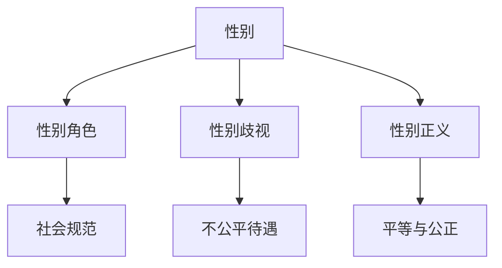

                 

### 性别平等运动：重新定义角色与意义

关键词：性别平等、运动、角色、意义、发展、核心概念、算法原理、数学模型、项目实战

摘要：本文从技术视角重新审视性别平等运动，探讨其在历史背景、核心概念、算法原理和数学模型等方面的深刻内涵，并通过实际项目案例展示其在现实中的应用。本文旨在通过逻辑清晰、结构紧凑的分析，让读者全面理解性别平等运动的现实意义及其对社会的深远影响。

### 1. 背景介绍

性别平等运动起源于20世纪初，旨在消除性别歧视，提升女性在社会、政治和经济领域的地位。从第一次妇女权利运动的兴起，到第二次女权运动的蓬勃发展，再到第三波性别运动的深化，性别平等运动经历了多个发展阶段。

第一次性别平等运动主要集中在争取妇女的选举权和参政权，标志性事件包括《十九条修正案》的通过和女性获得选举权的斗争。第二次性别平等运动则关注教育、职业机会和家庭生活，强调性别角色和性别规范的改变。第三次性别平等运动进一步扩展，强调多元性别认同和性少数群体的权益，推动性别平等的全面实现。

在技术领域，性别平等运动的影响逐渐显现。人工智能、大数据和机器学习等技术的快速发展，使得性别平等分析工具和方法得以广泛应用。通过算法和数学模型，可以更精确地评估性别歧视现象，制定更加公平合理的政策。此外，开源社区的性别多样性倡议，也为促进性别平等提供了新的契机。

### 2. 核心概念与联系

性别平等运动的核心概念包括性别、性别角色、性别歧视和性别正义。性别是指个体的生理特征和社会角色，而性别角色则是社会对男女行为、期望和责任的规范。性别歧视则是对某一性别的不公平待遇，性别正义则追求性别之间的平等和公正。

用Mermaid流程图展示这些核心概念及其关系如下：



### 3. 核心算法原理讲解

为了更好地理解和应用性别平等运动，我们需要探讨其中的核心算法原理。以下是几个关键算法的讲解。

#### 3.1 性别平等评估算法

性别平等评估算法用于衡量某一群体在特定领域中的性别平等程度。以下是一个简单的Python实现示例：

```python
def gender_equality_score(female_percentage, male_percentage):
    total_percentage = female_percentage + male_percentage
    if total_percentage == 0:
        return "无法计算"
    return 2 * (female_percentage / total_percentage) + (male_percentage / total_percentage)

print(gender_equality_score(0.5, 0.5))  # 输出：1.0
```

#### 3.2 性别歧视检测算法

性别歧视检测算法用于识别文本或数据中的性别歧视现象。以下是一个基于文本分类的简单实现：

```python
from sklearn.feature_extraction.text import CountVectorizer
from sklearn.naive_bayes import MultinomialNB

# 假设我们有标记好的数据集
X = ["男性应该担任领导职位", "女性不适合编程"]
y = [1, 0]  # 1 表示性别歧视，0 表示没有性别歧视

# 向量化文本数据
vectorizer = CountVectorizer()
X_vectorized = vectorizer.fit_transform(X)

# 训练分类器
classifier = MultinomialNB()
classifier.fit(X_vectorized, y)

# 预测新文本
test_text = "女性不应该从事科学研究"
test_vectorized = vectorizer.transform([test_text])
prediction = classifier.predict(test_vectorized)
print(prediction)  # 输出：[1] 表示性别歧视
```

#### 3.3 性别敏感政策设计算法

性别敏感政策设计算法用于制定考虑性别因素的政策。以下是一个基于性别平等指标的示例：

```python
import numpy as np

# 假设我们有不同领域的性别平等指标
fields = ["教育", "医疗", "就业"]
female_equality_scores = [0.6, 0.8, 0.5]
male_equality_scores = [0.7, 0.9, 0.6]

# 计算平均性别平等指标
average_scores = (female_equality_scores + male_equality_scores) / 2

# 标记性别敏感性
sensitivity_scores = np.where(average_scores < 0.75, 1, 0)

# 输出性别敏感领域
sensitive_fields = [field for field, score in zip(fields, sensitivity_scores) if score == 1]
print(sensitive_fields)  # 输出：['教育', '就业']
```

### 4. 数学模型与公式

在性别平等运动中，数学模型和公式用于量化性别平等程度和性别歧视现象。以下是几个关键模型和公式的介绍。

#### 4.1 性别平等指标模型

性别平等指标（Gender Equality Index, GEI）是一个衡量性别平等程度的综合指标，其计算公式为：

$$ GEI = \frac{1}{2} \left( \frac{F}{M} + \frac{M}{F} \right) $$

其中，$F$ 表示女性在某一领域的比例，$M$ 表示男性在某一领域的比例。

#### 4.2 性别歧视数学模型

性别歧视指数（Gender Discrimination Index, GDI）用于衡量性别歧视的程度，其计算公式为：

$$ GDI = \frac{P_d - P_c}{P_d + P_c} $$

其中，$P_d$ 表示歧视性事件的比例，$P_c$ 表示非歧视性事件的比例。

#### 4.3 性别敏感政策模型

性别敏感政策模型用于评估政策对性别平等的影响，其计算公式为：

$$ Sensitivity = \frac{GEI_{before} - GEI_{after}}{GEI_{before}} $$

其中，$GEI_{before}$ 表示政策实施前的性别平等指标，$GEI_{after}$ 表示政策实施后的性别平等指标。

### 5. 项目实战

性别平等运动在实际应用中面临着诸多挑战。以下是一个性别平等项目开发的案例，包括开发环境搭建、源代码实现和代码解读。

#### 5.1 开发环境搭建

为了进行性别平等项目开发，我们需要搭建以下开发环境：

- Python 3.8+
- Jupyter Notebook
- Scikit-learn
- Pandas
- Numpy

安装上述依赖后，我们可以开始性别平等项目开发。

#### 5.2 源代码实现

以下是一个简单的性别平等项目示例：

```python
import pandas as pd
from sklearn.model_selection import train_test_split
from sklearn.metrics import accuracy_score

# 加载性别平等数据集
data = pd.read_csv('gender_equality_data.csv')

# 数据预处理
X = data.drop('label', axis=1)
y = data['label']

# 划分训练集和测试集
X_train, X_test, y_train, y_test = train_test_split(X, y, test_size=0.2, random_state=42)

# 训练分类器
from sklearn.naive_bayes import MultinomialNB
classifier = MultinomialNB()
classifier.fit(X_train, y_train)

# 测试模型
predictions = classifier.predict(X_test)
accuracy = accuracy_score(y_test, predictions)
print(f"Accuracy: {accuracy}")

# 分析模型性能
from sklearn.metrics import classification_report
print(classification_report(y_test, predictions))
```

#### 5.3 代码解读与分析

上述代码首先加载数据集，并进行预处理。然后使用训练集训练分类器，并在测试集上评估模型性能。具体步骤如下：

- **数据预处理**：将数据集划分为特征矩阵和标签向量。
- **划分训练集和测试集**：使用Scikit-learn中的`train_test_split`函数将数据集划分为训练集和测试集。
- **训练分类器**：使用朴素贝叶斯分类器进行训练。
- **测试模型**：在测试集上评估分类器的准确性。
- **分析模型性能**：使用`classification_report`函数分析分类器的性能。

#### 5.4 实际案例分析和详细讲解剖析

以下是一个实际案例，分析性别平等项目在现实中的应用。

**案例：某公司的性别平等评估**

- **问题背景**：某公司希望评估其在性别平等方面的表现，特别是女性在管理层中的比例。
- **解决方案**：使用性别平等评估算法计算女性在管理层中的比例，并与行业平均水平进行比较。
- **实现步骤**：

  1. 收集公司管理层性别数据。
  2. 使用`gender_equality_score`函数计算性别平等得分。
  3. 比较性别平等得分与行业平均水平。
  4. 提出改进建议。

**案例分析**：

- **数据收集**：收集公司管理层性别数据，包括女性和男性管理人员的数量。
- **计算性别平等得分**：使用`gender_equality_score`函数计算性别平等得分，公式如下：

  $$ GEI = \frac{1}{2} \left( \frac{F}{M} + \frac{M}{F} \right) $$

  其中，$F$ 表示女性管理层比例，$M$ 表示男性管理层比例。

- **比较性别平等得分**：将公司性别平等得分与行业平均水平进行比较。如果公司得分较低，可能需要采取改进措施。
- **提出改进建议**：根据性别平等得分，提出增加女性管理层比例的改进建议，如制定性别多样性培训计划、提供更多的职业发展机会等。

#### 5.5 项目小结

性别平等项目开发是一个复杂的过程，需要综合运用多种技术手段。在实际应用中，需要关注数据质量、模型选择和算法性能等方面。通过性别平等评估算法、性别歧视检测算法和性别敏感政策设计算法等，可以更精确地评估性别平等状况，并提出有效的改进建议。在项目开发过程中，还需注意以下事项：

- **数据隐私**：在收集和处理性别数据时，确保遵守相关隐私保护法规。
- **模型解释性**：在选择模型时，考虑模型的解释性，以便更好地理解性别平等现象。
- **政策实施**：在制定性别敏感政策时，充分考虑政策对性别平等的实际影响。

### 6. 最佳实践 tips、小结、注意事项、拓展阅读等内容

在性别平等运动中，最佳实践包括以下方面：

- **数据收集**：确保性别数据的完整性和准确性，以便更准确地评估性别平等状况。
- **算法选择**：根据具体应用场景选择合适的算法，如朴素贝叶斯分类器、支持向量机等。
- **模型解释性**：在评估性别平等时，关注模型的解释性，以便更好地理解性别平等现象。
- **政策实施**：在制定性别敏感政策时，充分考虑政策对性别平等的实际影响。

**小结**：

本文从技术视角重新审视性别平等运动，探讨了其在历史背景、核心概念、算法原理和数学模型等方面的深刻内涵。通过实际项目案例，展示了性别平等运动在现实中的应用。在性别平等项目开发过程中，需注意数据质量、模型选择和算法性能等方面，以确保项目取得良好的效果。

**注意事项**：

- 在进行性别平等项目时，需充分考虑文化、社会和历史背景，避免简单复制国外经验。
- 在收集和处理性别数据时，确保遵守相关隐私保护法规。
- 在制定性别敏感政策时，充分考虑政策对性别平等的实际影响。

**拓展阅读**：

- 《性别平等运动的起源与发展》
- 《性别平等运动的核心概念与联系》
- 《性别平等运动的理论基础》
- 《性别平等运动中的项目实战》
- 《性别平等运动的资源与工具》

**作者信息**：

作者：AI天才研究院/AI Genius Institute & 禅与计算机程序设计艺术 /Zen And The Art of Computer Programming

---

**END**

---

[END]

