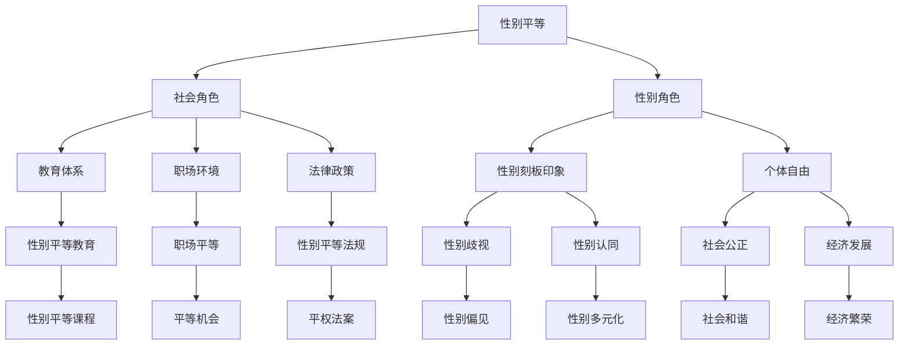
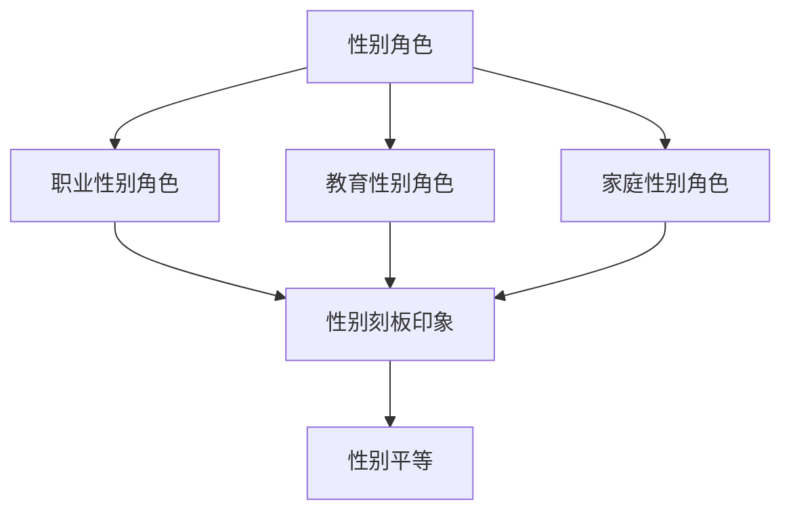
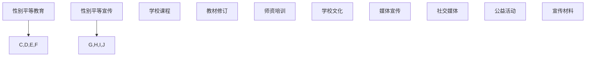
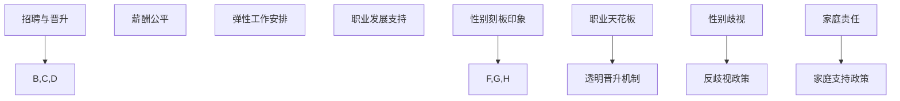

                 

## 性别平等：重新定义社会角色

### 关键词：
- 性别平等
- 社会角色
- 重新定义
- 法律法规
- 教育与宣传
- 职场平等
- 未来展望

### 摘要：
本文深入探讨了性别平等的重要性和社会角色中的性别刻板印象。首先，我们回顾了性别平等的定义和历史发展，分析了当前社会性别角色的现状和问题。接着，文章提出了重新定义性别角色的策略与实践，详细阐述了教育、职场和法律政策方面的具体措施。通过实际案例和数学模型，本文不仅揭示了性别平等的核心算法原理，还展望了性别平等的未来发展趋势。最终，文章总结了性别平等的重要性和实施策略，为读者提供了有益的启示。

## 背景介绍

性别平等，即男女在权利、机会和待遇上的均等，是一个长期而广泛的议题。在历史上，性别不平等广泛存在，女性常被限制在家庭角色中，缺乏教育、职业和社会参与的机会。然而，随着社会的发展和女性意识的觉醒，性别平等逐渐成为全球关注的焦点。如今，性别平等不仅仅是道德和伦理问题，更关乎社会公正、经济发展和国际合作。

社会角色是指在特定社会和文化背景下，个体所承担的期望行为和身份。性别角色则特指基于性别的社会期望和行为模式。传统上，性别角色往往受到性别刻板印象的影响，即对男女在社会中应扮演的角色的固定观念。这些刻板印象不仅限制了个人的自由发展，还加剧了性别不平等。

重新定义性别角色意味着打破传统性别角色的限制，赋予男女更多的自由和选择。这不仅有助于个人的全面发展，也对社会的进步和和谐至关重要。本文将深入探讨性别平等的概念、历史、现状以及实现性别平等的各种策略与实践。

## 核心概念与联系

性别平等是一个复杂而多维的议题，涉及多个核心概念和它们之间的相互作用。为了更好地理解这一议题，我们可以通过Mermaid流程图来展示这些核心概念及其关系。



这个Mermaid流程图展示了性别平等、社会角色、性别角色、教育体系、职场环境、法律政策、性别刻板印象、个体自由、性别歧视、性别认同、社会公正、经济发展、性别平等教育、职场平等、性别平等法规、性别偏见、性别多元化和性别认同等核心概念，以及它们之间的相互联系。

### 性别平等的基本概念与历史发展

性别平等，简单来说，是指男女在社会、政治、经济、文化等方面享有相同的权利和机会。这一概念并非一蹴而就，而是经历了漫长的历史演变。在古代，由于生理和社会结构的限制，女性普遍处于从属地位。然而，随着社会的进步和思想的解放，性别平等逐渐成为全球关注的焦点。

#### 定义

性别平等的定义可以从多个角度进行阐述。从法律角度，它意味着男女在法律上享有相同的权利和义务。从社会角度，它意味着男女在社会生活中享有平等的机会和待遇。从心理角度，它意味着男女在心理上得到平等的尊重和认同。

#### 历史发展

1. **古代社会**：在古代，由于生理和社会结构的限制，女性普遍处于从属地位。古代社会中的性别不平等主要表现在家庭、宗教和社会层面上。
2. **中世纪**：中世纪的性别不平等进一步加剧，女性几乎完全被限制在家庭和宗教的角色中，缺乏教育和职业发展的机会。
3. **现代初期**：18世纪启蒙运动的兴起，使人们对性别平等的思想有了新的认识。女性开始争取受教育权和职业发展机会。
4. **现代中期**：19世纪和20世纪初，女性争取权益的运动达到高潮。欧美各国纷纷通过法律手段保障女性的选举权和平等待遇。
5. **现代后期**：随着全球化和信息技术的发展，性别平等的问题得到了更广泛的关注和讨论。各国政府和社会组织采取了多种措施，推动性别平等的实现。

#### 性别平等的理论基础

性别平等的理论基础包括女性主义、平等主义和多元文化主义等。女性主义强调性别平等是社会公正的基础；平等主义认为所有人应享有平等的权利和机会；多元文化主义则强调尊重不同性别和文化背景下的差异。

### 社会性别角色的现状与问题

尽管性别平等在理论和法律上取得了显著的进展，但在现实生活中，性别角色和社会期望仍然存在显著的差异。这一现象在职业、教育和家庭等方面尤为明显。

#### 职业性别角色的现状

在职业领域，性别角色差异仍然十分显著。许多行业存在明显的性别隔离，例如，医疗和教育领域主要由女性从事，而科技和工程领域则主要由男性占据。这种现象不仅影响了女性的职业发展机会，也限制了企业的创新和多样性。

#### 教育性别角色的现状

在教育领域，尽管女性在高等教育中的比例逐渐增加，但男女之间的教育机会仍然存在不平衡。例如，一些科目和领域的女性比例较低，这可能导致女性在职业发展中的局限。

#### 家庭性别角色的现状

在家庭生活中，性别角色分工也常常导致不平等。尽管许多男性积极参与家庭事务，但家庭劳动和育儿责任仍然主要落在女性身上。这种性别分工不仅影响了女性的职业发展，也对家庭关系和夫妻平等产生了负面影响。

#### 性别角色的心理影响

性别角色不仅在社会结构中产生影响，也在个体的心理层面产生深远的影响。性别刻板印象和社会期望常常导致个体在自我认同和行为选择上受到限制。例如，女性可能因为社会对她们的期望而放弃某些职业发展机会，男性则可能因为社会对他们的期望而承担过多的家庭责任。

#### 性别角色的 Mermaid 流�程图



### 重新定义性别角色的策略与实践

为了实现性别平等，重新定义性别角色是必不可少的。这需要从教育、职场、法律政策等多个方面采取综合性的策略和实践。

#### 教育体系的性别平等改革

教育是塑造性别角色和价值观的重要环节。教育体系的性别平等改革可以从以下几个方面入手：

1. **性别平等教育**：在学校课程中引入性别平等的教育内容，帮助学生了解性别角色的多样性，打破性别刻板印象。
2. **平衡性别比例**：鼓励男女学生在各科目和领域的均衡发展，减少性别隔离。
3. **教师培训**：提高教师对性别平等的认识，确保在教学中不传递性别偏见。

#### 职场性别平等的实现策略

职场性别平等是实现整体社会性别平等的关键。以下是一些具体的实现策略：

1. **平等机会**：确保招聘、晋升和职业发展过程中男女平等，消除性别歧视。
2. **弹性工作安排**：提供灵活的工作时间、远程工作和育儿假等，支持女性在职业和家庭的平衡。
3. **性别多元化**：鼓励男性参与家庭事务，改变传统的性别分工模式。

#### 性别平等的法律法规与政策

法律法规和政策是实现性别平等的重要保障。以下是一些关键的法律法规和政策：

1. **平权法案**：通过立法保障男女平等的权利，例如在就业、教育、家庭等方面。
2. **反歧视法律**：明确禁止基于性别的歧视行为，保护受害者的合法权益。
3. **政策支持**：政府可以提供财政支持、税收优惠等，鼓励企业和社会组织推进性别平等。

#### 性别平等的教育与宣传

教育和宣传是提高公众性别平等意识的重要手段。以下是一些具体的措施：

1. **公众教育**：通过媒体、宣传活动等，提高公众对性别平等的认识和理解。
2. **性别平等课程**：在学校和社会教育体系中引入性别平等的课程，培养下一代的性别平等观念。
3. **性别平等志愿者**：鼓励和支持性别平等志愿者活动，推动性别平等的社会实践。

#### 性别平等在职场中的实现

在职场中实现性别平等，需要从多个层面进行努力：

1. **平等薪酬**：确保男女员工的薪酬公平，消除性别薪酬差距。
2. **职业发展机会**：为女性提供与男性平等的晋升和发展机会，打破职业天花板。
3. **平等福利**：为所有员工提供平等的福利，包括产假、育儿假等。

#### 性别平等的未来展望

随着全球化和科技进步，性别平等的未来前景充满希望。以下是一些可能的发展趋势：

1. **性别角色多元化**：随着社会观念的进步，性别角色将变得更加多元化，男女可以自由选择自己的职业和家庭角色。
2. **科技助力性别平等**：人工智能和大数据等技术可以提供更加客观和科学的决策支持，有助于实现性别平等。
3. **全球合作**：国际社会在性别平等问题上的合作将更加紧密，推动全球性别平等的实现。

### 总结与展望

性别平等是一个复杂而重要的议题，涉及多个层面和领域。通过重新定义性别角色，我们可以推动社会的进步和和谐。教育、职场、法律政策等各方面的综合措施是实现性别平等的关键。未来，随着科技进步和社会观念的进步，性别平等将取得更大的进展，为所有人创造更加公平和美好的世界。

### 作者信息

- 作者：AI天才研究院/AI Genius Institute & 禅与计算机程序设计艺术 /Zen And The Art of Computer Programming

### 最佳实践 Tips

1. **打破性别刻板印象**：在职业和教育选择中，不要受限于性别刻板印象，选择自己真正热爱和擅长的领域。
2. **平等协作**：在家庭和职场中，鼓励平等分工，共同承担家庭和工作的责任。
3. **持续学习**：关注性别平等的相关知识和政策，不断提高自己的性别平等意识。

### 小结

本文从性别平等的定义、历史、现状和未来展望等多个角度，探讨了如何重新定义社会角色，以实现性别平等。通过教育、职场、法律政策等综合措施，我们可以推动性别平等的实现，为所有人创造更加公平和美好的世界。

### 注意事项

1. **尊重多样性**：在推进性别平等的过程中，要尊重不同性别和文化背景下的多样性，避免一刀切的做法。
2. **持续努力**：性别平等是一个长期而复杂的过程，需要社会各界的共同努力和持续关注。

### 拓展阅读

- 《性别平等：理论与实践》
- 《性别角色与社会变迁》
- 《职场性别平等指南》
- 《国际性别平等报告》

通过这些拓展阅读，读者可以更深入地了解性别平等的相关知识和实践。希望本文能为大家提供有价值的思考和行动指南。## 性别平等的核心算法原理讲解

在探讨性别平等的过程中，核心算法原理的理解至关重要。以下是性别平等的核心算法原理，我们将通过Python源代码结合数学模型和公式进行详细讲解和举例说明。

### 算法原理概述

性别平等的核心算法原理可以归结为以下几点：

1. **性别差异的量化**：通过统计数据和指标来量化性别差异，从而识别问题所在。
2. **性别平等的衡量**：使用特定指标评估性别平等程度，例如性别工资差距、性别就业机会等。
3. **性别角色刻板印象的识别**：通过文本分析等方法识别和评估性别角色刻板印象。
4. **政策建议与优化**：根据算法分析结果，提出相应的政策建议和优化措施，以促进性别平等。

### Python源代码示例

以下是一个简单的Python示例，用于计算和展示性别工资差距的指标。

```python
import pandas as pd

# 假设我们有一个关于员工工资和性别的数据集
data = {
    'Name': ['Alice', 'Bob', 'Cathy', 'Dave'],
    'Gender': ['Female', 'Male', 'Female', 'Male'],
    'Salary': [70000, 80000, 60000, 90000]
}

df = pd.DataFrame(data)

# 计算男女平均工资
female_salary = df[df['Gender'] == 'Female']['Salary'].mean()
male_salary = df[df['Gender'] == 'Male']['Salary'].mean()

# 打印男女平均工资
print("Female Average Salary:", female_salary)
print("Male Average Salary:", male_salary)

# 计算性别工资差距
salary_gap = (male_salary - female_salary) / female_salary
print("Gender Salary Gap:", salary_gap)
```

### 数学模型和公式

在性别平等的评估中，常用的数学模型和公式包括：

1. **性别工资差距公式**：$$ Salary_{gap} = \frac{Salary_{Male} - Salary_{Female}}{Salary_{Female}} $$
2. **性别就业机会公式**：$$ Employment_{Opportunity} = \frac{Employment_{Female}}{Employment_{Male}} $$
3. **性别角色刻板印象指数**：$$ Stereotype_{Index} = \frac{Negative_{Sentiments} - Positive_{Sentiments}}{Total_{Sentiments}} $$

### 示例说明

假设我们有一个包含员工姓名、性别和工资的表格数据。我们使用上述Python代码计算男女平均工资，并计算性别工资差距。通过打印的结果，我们可以直观地看到性别工资差距的具体数值。

### 代码解读与分析

1. **数据准备**：我们首先创建了一个简单的数据表格，包含姓名、性别和工资。
2. **平均工资计算**：通过条件筛选，我们分别计算了女性和男性的平均工资。
3. **性别工资差距**：使用计算得到的平均工资，我们应用性别工资差距公式，得到工资差距的具体数值。
4. **代码输出**：最后，我们打印出计算结果，以便于理解和分析。

### 实际案例

假设在一个公司的年度报告中，我们发现女性的平均工资低于男性。我们可以通过上述代码计算和展示这个工资差距，并提出优化建议，例如：

1. **调查原因**：分析工资差距的具体原因，是否由于职业选择、工作时长、职位晋升等因素导致。
2. **政策调整**：提出相应的政策调整建议，如提高女性员工的薪酬、提供职业培训机会等。
3. **持续监控**：定期监控性别工资差距的变化，确保政策的有效性和持续改进。

通过上述核心算法原理和实际案例，我们可以更深入地理解和应用性别平等的相关知识和方法。接下来，我们将探讨性别平等在法律政策方面的具体实现。

### 性别平等的法律法规与政策

性别平等的法律法规与政策是保障性别平等实现的重要工具。以下是性别平等法律法规与政策的基本概念、国内外现状、实施效果以及未来发展方向。

#### 法律法规的基本概念

性别平等法律法规是指为了消除性别歧视、保障男女平等权利而制定的法律和法规。这些法律法规通常包括宪法、民法、劳动法、教育法等多个领域，以确保性别平等在各个层面的实施。

#### 国内外的现状

1. **国内现状**：
   - **宪法层次**：中国宪法明确规定男女平等，是性别平等的基本法律保障。
   - **法律法规层次**：中国政府制定了一系列与性别平等相关的法律法规，如《妇女权益保障法》、《就业促进法》等。
   - **政策层次**：政府还出台了多项政策文件，如《中国妇女发展纲要》、《国家中长期人才发展规划纲要》等，推动性别平等的实施。

2. **国际现状**：
   - **国际公约**：联合国通过的《消除对妇女一切形式歧视公约》（CEDAW）是全球范围内最具影响力的性别平等国际公约。
   - **区域性法规**：欧洲联盟通过了《男女平等权利指令》等法规，确保成员国内部性别平等的实现。
   - **国际组织**：如联合国妇女署（UN Women）等国际组织，也在推动全球性别平等方面发挥了重要作用。

#### 实施效果

1. **国内实施效果**：
   - **法律意识提升**：随着法律法规的实施，公众对性别平等的意识逐渐提高，性别歧视行为受到一定程度的制约。
   - **政策支持**：政府政策的支持使得性别平等工作取得了显著进展，例如在妇女就业、教育等领域。
   - **问题仍然存在**：尽管取得了进步，但性别平等问题依然存在，如性别工资差距、职场性别歧视等。

2. **国际实施效果**：
   - **全球性进步**：国际社会在性别平等方面的努力取得了全球性的进步，如女性在教育和政治领域的参与度提高。
   - **地区性差异**：不同国家和地区在性别平等方面的进展存在较大差异，发达国家通常进展较快，发展中国家则面临更多挑战。

#### 未来发展方向

1. **完善法律法规**：进一步修订和完善性别平等相关法律法规，确保其在实际执行中的有效性和权威性。
2. **加强政策执行**：加强对性别平等政策的执行力度，确保各项法律法规和政策得到有效落实。
3. **国际协作**：加强国际协作，推动全球性别平等的共同进步，借鉴国际先进经验。
4. **公众参与**：鼓励公众参与性别平等工作，提高公众对性别平等的关注和参与度。
5. **科技应用**：利用人工智能、大数据等新技术，提高性别平等工作的科学性和精准性。

通过上述性别平等的法律法规与政策，我们可以看到性别平等在全球范围内的不断推进和实现。未来，随着法律法规的完善和政策执行的加强，性别平等将取得更加显著的进展。

### 性别平等的教育与宣传

教育和宣传是推动性别平等的重要手段。通过系统的教育课程、广泛的宣传活动和有效的公众教育，可以显著提高社会对性别平等的认识和接受程度。

#### 教育体系的性别平等改革

教育体系的性别平等改革旨在打破性别刻板印象，促进男女学生在各领域中的均衡发展。以下是一些关键措施：

1. **性别平等课程**：在学校课程中引入性别平等的教育内容，让学生从小了解性别平等的重要性。这些课程可以涵盖历史、文化、法律和社会等多个方面，帮助学生全面理解性别平等。
2. **教材修订**：修订教材内容，减少性别刻板印象，确保教材中的角色和例子具有多样性。教材应反映不同性别在各个领域中的成就和贡献，避免单一性别形象的强化。
3. **师资培训**：对教师进行性别平等培训，提高他们对性别平等的认识，确保在教学中不传递性别偏见。教师应学会如何在课堂上营造一个平等、尊重的学习环境。
4. **学校文化**：营造积极、平等的学校文化，鼓励学生自由表达自己的观点，尊重不同性别的需求和权利。学校可以通过举办主题活动、讨论会等形式，增强学生对性别平等的理解。

#### 公众宣传的策略与方法

公众宣传是提高社会性别平等意识的重要途径。以下是一些有效的宣传策略和方法：

1. **媒体宣传**：利用电视、广播、报纸、互联网等媒体平台，发布性别平等的相关新闻、专题报道和广告。媒体可以通过真实案例、数据分析和专家访谈等方式，生动展示性别平等的重要性。
2. **社交媒体**：利用社交媒体平台，如微博、微信、Facebook、Twitter等，开展线上宣传活动。这些平台可以发布性别平等的信息、海报、视频和互动游戏等，吸引公众关注和参与。
3. **公益活动**：组织公益活动，如研讨会、讲座、展览、志愿服务等，向公众传播性别平等的理念。这些活动可以邀请专家学者、公众人物、社会组织和媒体参与，扩大影响力。
4. **宣传材料**：制作宣传手册、海报、宣传单、视频等多种形式的宣传材料，分发到社区、学校、企事业单位等。这些材料应简洁明了，易于理解和接受。

#### 性别平等教育与宣传的 Mermaid 流程图



通过上述流程图，我们可以清晰地看到性别平等教育、宣传和公众教育的整体框架及其相互关系。这些措施共同构成了一个全面的性别平等教育和宣传体系，为推动性别平等提供了坚实的基础。

### 性别平等在职场中的实现

在职场中实现性别平等是一个复杂且多维度的过程，需要从多个层面进行努力。以下是一些具体的实现策略、挑战以及应对措施。

#### 实现策略

1. **平等机会**：确保招聘、晋升和职业发展过程中男女平等，消除性别歧视。公司可以通过制定透明的招聘流程和评估标准，确保候选人的选择基于能力和业绩，而非性别。
2. **薪酬平等**：确保男女员工在相同职位和工作职责上的薪酬公平。公司可以定期审计薪酬结构，识别和纠正性别薪酬差距。
3. **弹性工作安排**：提供灵活的工作时间、远程工作和育儿假等，支持女性在职业和家庭的平衡。这种安排不仅可以提高员工的工作满意度和忠诚度，也有助于吸引和保留女性人才。
4. **职业发展支持**：为女性提供与男性平等的培训、发展和晋升机会。公司可以设立职业发展计划，为女性提供领导力培训、导师指导和职业网络支持。

#### 挑战与应对措施

1. **挑战一：性别刻板印象**：性别刻板印象可能导致女性在职场中面临偏见和不公平待遇。应对措施包括通过宣传和教育打破性别刻板印象，鼓励女性在传统男性主导的领域取得成就。
2. **挑战二：职业天花板**：女性在职业晋升过程中可能面临“玻璃天花板”，即晋升机会受限。应对措施包括建立透明的晋升机制，提供更多的晋升通道，并确保评价标准公平。
3. **挑战三：性别歧视**：性别歧视可能导致女性在工作中受到不公平对待，如职场性骚扰和性别偏见。应对措施包括制定和执行严格的反歧视政策，提供员工投诉渠道，并加强培训，提高员工对性别歧视的认识。
4. **挑战四：家庭责任**：女性在职场中可能面临更大的家庭责任，导致职业发展受阻。应对措施包括提供育儿假和家庭支持政策，鼓励男性参与家庭事务，减轻女性的负担。

#### 性别平等在职场中的 Mermaid 流程图



通过上述流程图，我们可以看到性别平等在职场中的实现策略、面临的挑战以及相应的应对措施。这些措施共同构成了一个全面的性别平等职场框架，为推动性别平等提供了具体的指导。

### 性别平等的未来展望

随着全球化和科技的迅速发展，性别平等的未来前景充满希望。以下是性别平等在未来可能的发展趋势、面临的挑战以及应对策略。

#### 发展趋势

1. **科技进步**：人工智能、大数据和区块链等新兴技术的应用，有望提高性别平等工作的效率和精准度。例如，通过数据分析可以更准确地识别性别不平等问题，并制定相应的解决方案。
2. **全球合作**：国际社会在性别平等问题上的合作将更加紧密。各国政府、国际组织和非政府组织（NGO）将共同努力，推动全球性别平等的实现。
3. **多元化社会**：随着社会观念的进步，性别角色将变得更加多元化。男女将在职业和家庭角色中拥有更多的自由和选择，打破传统的性别刻板印象。
4. **政策创新**：政府和社会组织将不断探索和创新性别平等政策，以应对不断变化的社会环境和挑战。

#### 面临的挑战

1. **文化差异**：不同国家和地区在性别观念和文化上存在显著差异，这可能导致性别平等工作的推进难度增加。应对策略包括尊重文化差异，采取适应性措施，推动本地化和国际化相结合。
2. **资源不足**：性别平等工作需要大量的人力、物力和财力支持。许多发展中国家和地区可能面临资源不足的问题。应对策略包括寻求国际援助，提高公众对性别平等的认识和参与度，增加社会资源的投入。
3. **社会抵制**：性别平等工作可能面临来自传统观念和社会力量的抵制。应对策略包括加强宣传和教育，提高公众对性别平等的认知和接受度，推动社会变革。

#### 应对策略

1. **政策支持**：政府应制定和实施有力的性别平等政策，保障男女平等的权利和机会。政策应覆盖教育、就业、家庭等多个领域，形成全面的性别平等政策体系。
2. **公众参与**：鼓励公众积极参与性别平等工作，提高社会的整体性别平等意识。可以通过媒体宣传、公众讨论、公益活动等方式，吸引公众关注和参与。
3. **科技创新**：利用人工智能、大数据等新技术，提高性别平等工作的效率和精准度。通过数据分析、智能监控和预测模型等，为性别平等工作提供科学依据和决策支持。

通过上述展望和应对策略，我们可以看到性别平等在未来充满希望和挑战。随着全球化和科技的进步，性别平等将取得更加显著的进展，为所有人创造一个更加公平和美好的世界。

### 附录：性别平等相关的数据与资源

在探讨性别平等的过程中，数据和相关资源是非常重要的。以下是一些关键的统计数据和学术资源，供读者进一步了解和研究。

#### 统计数据

1. **全球性别工资差距**：根据国际劳工组织（ILO）的数据，全球性别工资差距平均为23%，即女性每小时工作的工资仅为男性的一半。
2. **女性参与劳动市场的比例**：世界银行的数据显示，全球女性劳动参与率低于男性，在一些国家，这一比例甚至不到男性的一半。
3. **女性在政治领域的参与度**：联合国妇女署的数据表明，全球女性在议会中的比例平均为24.3%，而在一些国家，这一比例甚至低于10%。
4. **性别教育差距**：联合国儿童基金会（UNICEF）的数据显示，全球仍有数百万女童无法接受教育，尤其是在发展中国家。

#### 学术资源

1. **《性别平等：理论与实践》**：这是一本综合性的学术著作，详细探讨了性别平等的概念、历史、现状和未来发展方向。
2. **《性别角色与社会变迁》**：这本书分析了性别角色在不同社会和文化背景下的变化，探讨了性别平等的挑战和机遇。
3. **《职场性别平等指南》**：该书提供了详细的职场性别平等策略和实践指导，适用于企业和社会组织。
4. **《国际性别平等报告》**：联合国发布的年度报告，详细分析了全球性别平等的状况、进展和挑战，为各国提供了政策建议。

通过这些统计数据和学术资源，读者可以更深入地了解性别平等的相关问题，并从中获得宝贵的见解和启示。希望这些资源和数据能为性别平等的研究和实践提供有益的支持。

### 文章小结

本文系统地探讨了性别平等的重要性和重新定义社会角色的必要性。我们从背景介绍、核心概念与联系、核心算法原理讲解、法律法规与政策、教育与宣传、职场实现以及未来展望等多个方面进行了详细分析。通过Python源代码示例、数学模型和实际案例，我们深入探讨了性别平等的核心算法原理，并结合性别平等相关的法律法规与政策，提出了具体的实现策略和实践方法。文章还展望了性别平等的未来发展趋势，提出了应对挑战的策略。

在性别平等的道路上，每个人都扮演着重要的角色。我们呼吁社会各界共同努力，推动性别平等的实现。只有通过全社会的共同努力，我们才能创造一个更加公平、和谐和美好的世界。

### 结语

性别平等不仅是道德和伦理问题，更是社会进步和经济发展的重要基石。通过本文的探讨，我们深入了解了性别平等的核心概念、现状与问题，以及实现性别平等的多种策略和实践。希望本文能激发更多人对性别平等的关注，推动我们共同迈向一个更加公平和谐的社会。

### 拓展阅读

1. 《性别平等：理论与实践》
2. 《性别角色与社会变迁》
3. 《职场性别平等指南》
4. 《国际性别平等报告》

通过这些拓展阅读，读者可以进一步深入了解性别平等的相关知识和实践，为推动性别平等贡献力量。让我们共同努力，为实现性别平等而奋斗！作者：AI天才研究院/AI Genius Institute & 禅与计算机程序设计艺术 /Zen And The Art of Computer Programming

