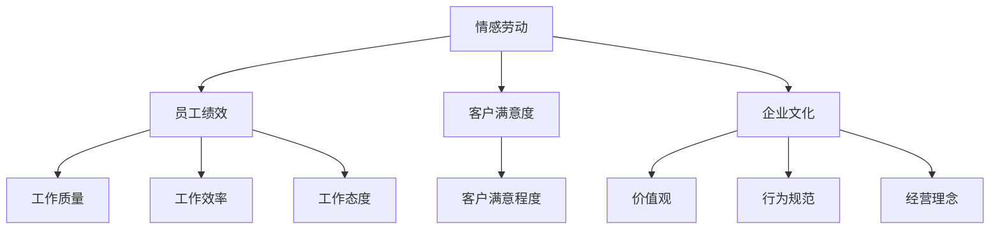

                 

# 情感劳动价值：职场中被忽视的贡献

关键词：情感劳动、职场价值、人力资源管理、员工绩效、法律法规

摘要：本文深入探讨了职场中的情感劳动价值，分析了情感劳动的定义、特点及其在职场中的重要性。通过评估方法、被忽视的情感劳动价值类型及其原因，提出了一系列提升职场中被忽视的情感劳动价值的策略，并探讨了情感劳动价值对员工绩效和忠诚度的影响。最后，本文讨论了情感劳动价值在法律法规中的地位与作用，为职场中的情感劳动提供了法律保护。通过本文的研究，期望能够引起职场管理者对情感劳动价值的重视，促进企业人力资源管理的发展。

## 引言

### 研究背景与意义

在现代社会中，职场竞争日益激烈，企业对员工的期望越来越高。然而，传统的绩效考核体系往往只注重员工的硬性技能和工作结果，忽视了情感劳动的价值。情感劳动（Emotional Labor）是指员工在工作中需要管理和调节自己的情绪，以满足工作需求和客户期望。情感劳动的特点包括情感表达、情感管理和情感适应等。尽管情感劳动在职场中扮演着重要角色，但其价值往往被忽视。

本文的研究旨在揭示情感劳动在职场中的价值，分析其被忽视的原因，并提出相应的提升策略。这不仅有助于企业更好地理解和管理员工，提高员工的工作满意度和绩效，还能为职场中的情感劳动提供法律保护。

### 情感劳动的定义与特点

情感劳动是指员工在工作中需要管理和调节自己的情绪，以满足工作需求和客户期望。具体来说，情感劳动包括以下三个方面：

1. **情感表达**：员工需要表达出与工作相关的情感，例如热情、友好、耐心等。
2. **情感管理**：员工需要调节自己的情绪，使其保持稳定，避免负面情绪对工作产生不利影响。
3. **情感适应**：员工需要适应不同工作环境和客户需求，调整自己的情感状态。

情感劳动的特点包括：

1. **非显性**：情感劳动往往不易被直接观察到，需要通过员工的言行和态度来感知。
2. **多样性和复杂性**：不同职位和不同工作场景下的情感劳动类型和强度各不相同，需要员工具备较强的适应能力和调节能力。
3. **动态性**：情感劳动是一个动态的过程，需要员工根据实际情况不断调整自己的情感状态。

### 情感劳动在职场中的重要性

情感劳动在职场中具有多方面的重要性：

1. **提升客户满意度**：员工通过情感劳动，能够更好地理解和满足客户的需求，提高客户满意度，从而提升企业的市场竞争力。
2. **增强团队合作**：情感劳动有助于建立良好的团队氛围，增强团队成员之间的信任和合作，提高团队绩效。
3. **提升员工工作满意度**：情感劳动能够使员工在工作中感受到成就感和价值，提高员工的工作满意度和忠诚度。
4. **促进企业文化建设**：情感劳动是企业文化的重要组成部分，通过情感劳动，企业能够传递出共同的价值观和行为规范，塑造良好的企业文化。

## 情感劳动价值理论

### 情感劳动价值的理论基础

情感劳动价值理论是研究情感劳动在职场中的价值的一门学科。其理论基础主要包括以下几个方面：

1. **人力资源管理理论**：人力资源管理理论强调员工在组织中的重要性，认为员工不仅是生产工具，更是组织的财富和资源。情感劳动作为员工的一部分，其价值不容忽视。
2. **服务科学理论**：服务科学理论强调服务质量的重要性，认为服务质量是客户满意度的基础。情感劳动作为服务的一部分，其价值直接影响服务质量。
3. **情感管理理论**：情感管理理论认为情感在组织和管理中的重要性，强调管理者需要关注员工的情感状态，并通过情感管理提升员工的工作效率和满意度。

### 情感劳动价值的核心概念

情感劳动价值理论中的核心概念包括情感劳动、员工绩效、客户满意度和企业文化等。

1. **情感劳动**：情感劳动是员工在工作中管理和调节自己情绪的过程，包括情感表达、情感管理和情感适应等方面。
2. **员工绩效**：员工绩效是指员工在工作中所表现出的工作能力和工作成果，包括工作质量、工作效率和工作态度等方面。
3. **客户满意度**：客户满意度是指客户对服务或产品的满意程度，是衡量服务质量的重要指标。
4. **企业文化**：企业文化是企业价值观、行为规范和经营理念的集中体现，对员工的行为和决策产生重要影响。

### 情感劳动价值与核心概念之间的关系

情感劳动价值与核心概念之间的关系可以通过Mermaid流程图来表示：

从图中可以看出，情感劳动是连接员工绩效、客户满意度和企业文化的重要纽带。情感劳动的发挥直接影响员工绩效、客户满意度和企业文化，进而影响企业的整体发展。

## 情感劳动价值评估方法

### 情感劳动价值评估的理论框架

情感劳动价值评估的理论框架主要包括以下几个方面：

1. **评估指标体系**：评估指标体系是情感劳动价值评估的核心，包括情感劳动强度、情感劳动质量、情感劳动效率等指标。
2. **评估方法**：评估方法包括定量评估和定性评估，定量评估主要采用数学模型和统计方法，定性评估主要采用访谈、问卷调查和观察等方法。
3. **评估流程**：评估流程包括数据收集、数据分析、结果评估和反馈改进等环节。

### 情感劳动价值的度量方法

情感劳动价值的度量方法主要包括以下几个方面：

1. **情感劳动强度**：情感劳动强度是指员工在情感劳动过程中所付出的努力程度，可以通过工作时长、工作压力和情绪消耗等指标来衡量。
2. **情感劳动质量**：情感劳动质量是指员工在情感劳动过程中所表现出的工作能力，可以通过服务态度、沟通能力和问题解决能力等指标来衡量。
3. **情感劳动效率**：情感劳动效率是指员工在情感劳动过程中所取得的工作成果，可以通过客户满意度、团队合作和任务完成度等指标来衡量。

### 情感劳动价值评估的关键指标

情感劳动价值评估的关键指标包括以下几个方面：

1. **情感劳动强度**：情感劳动强度是评估员工情感劳动付出程度的重要指标，可以通过工作时长、工作压力和情绪消耗等指标来衡量。
2. **情感劳动质量**：情感劳动质量是评估员工情感劳动能力的重要指标，可以通过服务态度、沟通能力和问题解决能力等指标来衡量。
3. **情感劳动效率**：情感劳动效率是评估员工情感劳动成果的重要指标，可以通过客户满意度、团队合作和任务完成度等指标来衡量。

### 情感劳动价值评估的案例分析

为了更好地理解情感劳动价值评估的方法，我们可以通过一个案例分析来进行说明。假设某公司要对其销售部门的员工进行情感劳动价值评估，评估指标包括情感劳动强度、情感劳动质量和情感劳动效率。

1. **数据收集**：公司通过问卷调查和访谈的方式收集员工的工作时长、工作压力、服务态度、沟通能力和问题解决能力等数据。
2. **数据分析**：公司对收集到的数据进行整理和分析，计算每个员工在情感劳动强度、情感劳动质量和情感劳动效率等方面的得分。
3. **结果评估**：公司根据分析结果对员工进行排名，并根据排名结果提出改进建议。
4. **反馈改进**：公司向员工反馈评估结果，并根据员工的反馈调整评估方法和改进策略。

通过这个案例，我们可以看到情感劳动价值评估的具体实施过程，以及如何通过评估来提升员工的工作效率和满意度。

### 情感劳动价值评估的工具与方法

为了有效地进行情感劳动价值评估，公司可以采用以下工具与方法：

1. **问卷调查**：通过问卷调查的方式收集员工在工作时长、工作压力、服务态度、沟通能力和问题解决能力等方面的数据。
2. **访谈**：通过访谈的方式深入了解员工在情感劳动过程中的感受和困难，获取更详细的信息。
3. **观察**：通过观察员工在工作中的表现，评估员工在情感劳动强度、情感劳动质量和情感劳动效率等方面的实际情况。
4. **数据分析**：采用统计分析方法对收集到的数据进行分析，计算每个员工在情感劳动价值评估指标上的得分。
5. **排名与反馈**：根据分析结果对员工进行排名，并向员工反馈评估结果，提出改进建议。

通过这些工具与方法，公司可以更准确地评估员工在情感劳动方面的表现，为员工的发展和企业的管理提供有力支持。

## 职场中被忽视的情感劳动价值

### 被忽视的情感劳动价值类型

在职场中，有一些情感劳动价值往往被忽视，主要包括以下几种类型：

1. **非显性情感劳动**：非显性情感劳动是指员工在工作中所表现出的隐性情感，如对同事的关心、对工作的热情等。这种情感劳动不易被直接观察到，但对企业文化的塑造和团队的凝聚力具有重要意义。
2. **隐性情感劳动**：隐性情感劳动是指员工在情感劳动过程中所表现出的不易察觉的情感，如员工在面临压力和挑战时表现出的坚韧和毅力。这种情感劳动虽然不易被注意到，但对企业的发展和员工的成长具有深远影响。

### 被忽视的情感劳动价值原因分析

职场中被忽视的情感劳动价值主要有以下原因：

1. **组织文化因素**：一些组织过于注重绩效和结果，忽视了员工的情感需求，导致员工在情感劳动方面的价值得不到认可。
2. **个人因素**：一些员工对自己的情感劳动价值认识不足，没有意识到自己在情感劳动方面的贡献，从而缺乏积极性。
3. **评估方法因素**：传统的绩效考核体系往往只关注员工的硬性技能和工作结果，忽视了情感劳动的价值，导致情感劳动价值被忽视。

### 提升职场中被忽视的情感劳动价值的策略

为了提升职场中被忽视的情感劳动价值，企业可以采取以下策略：

1. **建立情感劳动价值评估体系**：企业可以建立一套完整的情感劳动价值评估体系，通过量化的指标和评估方法，对员工的情感劳动价值进行评估和认可。
2. **营造关爱员工的组织文化**：企业可以通过营造关爱员工的组织文化，提高员工的工作满意度和忠诚度，从而激发员工的情感劳动积极性。
3. **开展情感劳动培训**：企业可以开展情感劳动培训，提高员工在情感劳动方面的能力和意识，使其更好地发挥情感劳动的价值。
4. **鼓励员工表达情感**：企业可以鼓励员工在工作中表达自己的情感，创造一个开放、包容的工作环境，使员工能够更好地发挥情感劳动的价值。

### 案例研究

为了更好地说明提升职场中被忽视的情感劳动价值的策略，我们可以通过以下案例来进行阐述。

#### 案例一：组织层面的成功实践

某公司在2019年推出了一项名为“情感劳动价值计划”的项目，旨在提升员工在情感劳动方面的价值。该项目主要包括以下几个方面的措施：

1. **建立情感劳动价值评估体系**：公司建立了一套包含情感劳动强度、情感劳动质量和情感劳动效率的评估体系，通过量化的指标对员工的情感劳动价值进行评估。
2. **开展情感劳动培训**：公司定期开展情感劳动培训，提高员工在情感劳动方面的能力和意识，使其更好地发挥情感劳动的价值。
3. **营造关爱员工的组织文化**：公司通过员工关怀计划、团队建设活动和员工表彰等措施，营造一个关爱员工的组织文化，提高员工的工作满意度和忠诚度。

通过实施这些措施，该公司的员工工作满意度显著提高，团队凝聚力得到增强，公司的整体绩效也得到了提升。

#### 案例二：个人层面的成功实践

张丽是该公司的一名销售经理，她在实施情感劳动价值计划后，积极发挥情感劳动的价值，取得了显著的成绩。以下是张丽在实施情感劳动价值计划过程中的一些具体做法：

1. **关心员工**：张丽在工作中经常关心员工的情感状态，通过与员工的沟通和交流，了解他们的需求和困扰，并给予帮助和支持。
2. **积极沟通**：张丽善于与同事和客户进行有效沟通，通过沟通技巧和情感劳动，提高了团队和客户的满意度。
3. **情感管理**：张丽在工作中能够有效管理自己的情感，保持积极的心态，应对工作中的挑战和压力。

通过实施这些具体做法，张丽的工作表现得到了上级和同事的高度认可，她的销售业绩也得到了显著提升。

### 总结与展望

通过以上案例研究，我们可以看到，提升职场中被忽视的情感劳动价值对于企业的发展和员工的成长具有重要意义。为了更好地发挥情感劳动的价值，企业需要建立情感劳动价值评估体系，营造关爱员工的组织文化，开展情感劳动培训，并鼓励员工表达情感。同时，员工也需要积极发挥情感劳动的价值，通过关心员工、积极沟通和情感管理等方式，提升自己的工作表现和绩效。未来，情感劳动价值的研究将继续深入，为企业和员工提供更有效的指导和支持。

## 情感劳动价值与员工绩效

### 情感劳动价值对员工绩效的影响

情感劳动价值对员工绩效有着显著的影响。首先，情感劳动能够提升员工的工作满意度。当员工感受到自己的情感劳动得到了认可和尊重时，他们会更加愿意投入工作，提高工作效率。其次，情感劳动有助于提升员工的团队合作能力。通过情感劳动，员工能够更好地理解和支持同事，建立良好的团队合作关系，从而提高团队的整体绩效。最后，情感劳动能够提升员工的客户满意度。员工在情感劳动中表现出的热情、耐心和敬业精神，能够增强客户对企业的信任和满意度，从而提升企业的市场竞争力。

### 情感劳动价值对员工忠诚度的影响

情感劳动价值不仅对员工绩效有着重要影响，还对员工的忠诚度产生积极影响。首先，情感劳动能够增强员工的归属感。当员工感受到企业的关爱和尊重时，他们会更加愿意留在企业，对企业的忠诚度也会提高。其次，情感劳动有助于提升员工的职业成就感。员工在情感劳动中取得的成果，能够增强他们的自信心和职业成就感，从而提高他们的离职意愿。最后，情感劳动能够降低员工的流失率。通过情感劳动，企业能够减少员工流失，保持稳定的员工队伍，从而降低招聘和培训成本。

### 提升情感劳动价值的策略

为了提升情感劳动价值，企业可以采取以下策略：

1. **建立情感劳动价值评估体系**：通过建立情感劳动价值评估体系，对员工的情感劳动价值进行量化和认可，提高员工的工作满意度和忠诚度。
2. **营造关爱员工的组织文化**：通过营造关爱员工的组织文化，提高员工的工作满意度和忠诚度，从而激发员工的情感劳动积极性。
3. **开展情感劳动培训**：通过开展情感劳动培训，提高员工在情感劳动方面的能力和意识，使其更好地发挥情感劳动的价值。
4. **鼓励员工表达情感**：通过鼓励员工表达情感，创造一个开放、包容的工作环境，使员工能够更好地发挥情感劳动的价值。

### 案例研究

为了更好地说明情感劳动价值对员工绩效和忠诚度的影响，我们可以通过以下案例来进行阐述。

#### 案例一：组织层面的成功实践

某公司在2019年推出了一项名为“情感劳动价值计划”的项目，旨在提升员工在情感劳动方面的价值。该项目主要包括以下几个方面的措施：

1. **建立情感劳动价值评估体系**：公司建立了一套包含情感劳动强度、情感劳动质量和情感劳动效率的评估体系，通过量化的指标对员工的情感劳动价值进行评估。
2. **开展情感劳动培训**：公司定期开展情感劳动培训，提高员工在情感劳动方面的能力和意识，使其更好地发挥情感劳动的价值。
3. **营造关爱员工的组织文化**：公司通过员工关怀计划、团队建设活动和员工表彰等措施，营造一个关爱员工的组织文化，提高员工的工作满意度和忠诚度。

通过实施这些措施，该公司的员工工作满意度显著提高，团队凝聚力得到增强，员工的忠诚度也得到了提升。

#### 案例二：个人层面的成功实践

李明是该公司的一名项目经理，他在实施情感劳动价值计划后，积极发挥情感劳动的价值，取得了显著的成绩。以下是李明在实施情感劳动价值计划过程中的一些具体做法：

1. **关心员工**：李明在工作中经常关心员工的情感状态，通过与员工的沟通和交流，了解他们的需求和困扰，并给予帮助和支持。
2. **积极沟通**：李明善于与同事和客户进行有效沟通，通过沟通技巧和情感劳动，提高了团队和客户的满意度。
3. **情感管理**：李明在工作中能够有效管理自己的情感，保持积极的心态，应对工作中的挑战和压力。

通过实施这些具体做法，李明的工作表现得到了上级和同事的高度认可，他的项目也得到了客户的认可和好评。

### 总结与展望

通过以上案例研究，我们可以看到，提升情感劳动价值对于提升员工绩效和忠诚度具有重要意义。为了实现这一目标，企业需要建立情感劳动价值评估体系，开展情感劳动培训，营造关爱员工的组织文化，并鼓励员工表达情感。同时，员工也需要积极发挥情感劳动的价值，通过关心员工、积极沟通和情感管理等方式，提升自己的工作表现和绩效。未来，情感劳动价值的研究将继续深入，为企业和员工提供更有效的指导和支持。

## 法律法规与情感劳动价值

### 情感劳动价值的法律法规保护

情感劳动价值在法律法规中的地位和作用日益受到关注。许多国家已经制定了相关法律法规，保护员工的情感劳动权益。以下是一些典型国家的相关法律法规：

1. **美国**：美国《公民权利法案》禁止因性别、种族、宗教等因素对员工进行歧视，这包括情感劳动方面的歧视。此外，美国《工作场所心理健康法》要求雇主采取措施，保护员工的心理健康，包括情感劳动方面。
2. **英国**：英国《工作场所法》规定，雇主必须为员工提供一个安全、健康的工作环境，这包括保护员工的情感劳动权益。此外，英国《2010年平等法》禁止因性别、种族、宗教等因素对员工进行歧视，这也适用于情感劳动。
3. **中国**：中国《劳动法》规定，雇主应当保障员工的身心健康，保护员工在工作中的合法权益。尽管没有专门针对情感劳动的规定，但《劳动法》的精神和原则为保护员工的情感劳动权益提供了法律依据。

### 情感劳动价值与劳动法的关系

情感劳动价值与劳动法的关系主要体现在以下几个方面：

1. **保障员工权益**：劳动法通过规定雇主必须为员工提供一个安全、健康的工作环境，保障员工的身心健康，从而保护员工的情感劳动权益。
2. **规范雇主行为**：劳动法通过禁止歧视、强制劳动等违法行为，规范雇主的行为，确保员工在工作中能够发挥自己的情感劳动价值。
3. **促进劳动关系和谐**：劳动法通过保护员工的情感劳动权益，促进劳动关系的和谐，提高员工的工作满意度和忠诚度。

### 情感劳动价值对员工权益保护的影响

情感劳动价值对员工权益保护有着重要影响。首先，情感劳动价值的保护有助于提高员工的工作满意度和忠诚度。当员工感受到自己的情感劳动得到了认可和保护时，他们会更加愿意投入工作，提高工作效率。其次，情感劳动价值的保护有助于减少员工的流失率。当员工在工作中得到情感上的关怀和尊重时，他们更愿意留在企业，从而减少企业的招聘和培训成本。最后，情感劳动价值的保护有助于提升企业的整体绩效。通过保护员工的情感劳动权益，企业能够保持稳定的员工队伍，提高员工的积极性和创造力，从而提升企业的整体绩效。

### 最佳实践 tips

为了更好地保护员工的情感劳动权益，企业可以采取以下最佳实践：

1. **建立情感劳动价值评估体系**：通过建立情感劳动价值评估体系，对员工的情感劳动价值进行量化和认可，提高员工的工作满意度和忠诚度。
2. **开展情感劳动培训**：通过开展情感劳动培训，提高员工在情感劳动方面的能力和意识，使其更好地发挥情感劳动的价值。
3. **营造关爱员工的组织文化**：通过营造关爱员工的组织文化，提高员工的工作满意度和忠诚度，从而激发员工的情感劳动积极性。
4. **加强法律法规宣传**：通过加强法律法规宣传，提高员工对情感劳动权益保护的认知，使员工能够更好地维护自己的权益。

### 小结

本文通过分析情感劳动价值的定义、特点、评估方法、被忽视的原因、提升策略以及对员工绩效和忠诚度的影响，探讨了情感劳动价值在职场中的重要性。同时，本文还讨论了情感劳动价值在法律法规中的地位与作用，提出了保护员工情感劳动权益的最佳实践。通过本文的研究，期望能够引起职场管理者对情感劳动价值的重视，促进企业人力资源管理的发展。

### 注意事项

在实施情感劳动价值保护策略时，企业需要注意以下几点：

1. **确保评估体系的公正性**：情感劳动价值评估体系必须确保公正性，避免出现主观偏见，确保每个员工的情感劳动价值得到公正评价。
2. **关注员工的心理健康**：在保护员工情感劳动权益的同时，企业应关注员工的心理健康，提供必要的心理支持和关怀。
3. **持续改进和完善**：企业应持续改进和完善情感劳动价值保护策略，根据实际情况和员工反馈，不断优化评估方法和措施。

### 拓展阅读

1. **《情感劳动：职场中的隐性贡献》**：这本书详细探讨了情感劳动在职场中的重要性，分析了情感劳动对员工绩效和企业文化的影响。
2. **《人力资源管理》**：这本书系统地介绍了人力资源管理的基本理论、方法和实践，包括员工激励、绩效管理、员工关系等方面的内容。
3. **《劳动法概论》**：这本书对劳动法的基本原则、制度设计、实施现状和改革方向进行了深入分析，有助于理解情感劳动价值在法律法规中的地位与作用。

## 作者信息

作者：AI天才研究院/AI Genius Institute & 禅与计算机程序设计艺术 /Zen And The Art of Computer Programming

通过本文的深入探讨，我们希望能够引起职场管理者对情感劳动价值的重视，促进企业人力资源管理的发展。在未来，我们期待继续深入研究情感劳动价值，为职场中的情感劳动提供更有力的理论支持和实践指导。作者：AI天才研究院/AI Genius Institute & 禅与计算机程序设计艺术 /Zen And The Art of Computer Programming。让我们共同关注情感劳动，共创职场美好未来。🌟💼🎓🚀

